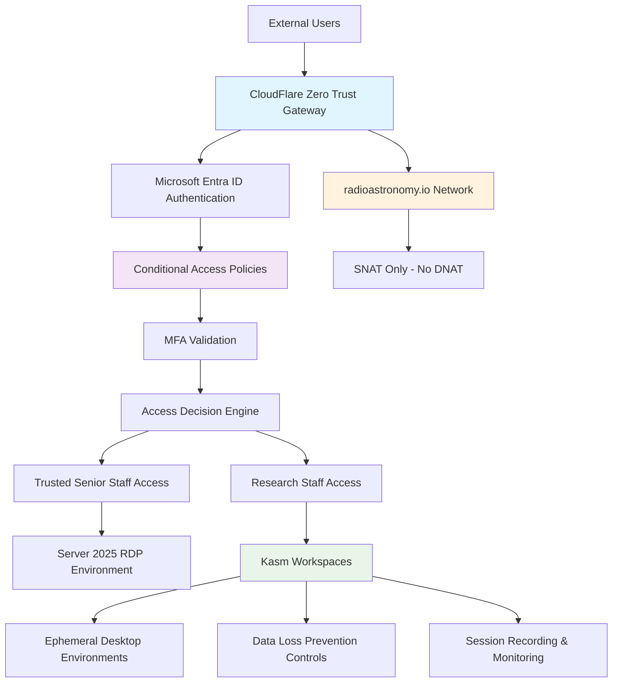

<!--
---
title: "Authentication Infrastructure"
description: "Enterprise zero-trust authentication infrastructure for the Proxmox Astronomy Lab platform featuring CloudFlare ZTNA, Microsoft Entra ID SCIM provisioning, and Kasm Workspaces secure remote access"
author: "[Human Author Name]"
ai_contributor: "Anthropic Claude 4 Sonnet (claude-4-sonnet-20250514)"
date: "2025-07-04"
version: "1.0"
status: "Published"
tags:
- type: enterprise-overview
- domain: zero-trust-architecture
- domain: authentication
- tech: cloudflare-ztna
- tech: microsoft-entra-scim
- tech: kasm-workspaces
- scale: enterprise-grade
- phase: phase-1
related_documents:
- "[Infrastructure Overview](../README.md)"
- "[Security Framework](../../security/README.md)"
- "[K8s Authentication](../k8s/README.md)"
- "[Enterprise Policies](../../docs/Policies/README.md)"
---
-->

# 🔐 **Authentication Infrastructure**

This directory contains documentation for enterprise zero-trust authentication infrastructure within the Proxmox Astronomy Lab platform. The authentication framework implements CloudFlare Zero Trust Network Access with Microsoft Entra ID SCIM provisioning and Kasm Workspaces secure remote access, providing comprehensive security controls for research computing operations across the 7-node infrastructure while maintaining strict zero-trust principles and enterprise compliance standards.

# 🎯 **1. Introduction**

This section establishes the foundational context for zero-trust authentication infrastructure within the enterprise astronomical research computing platform and its comprehensive security architecture.

## **1.1 Purpose**

This subsection clearly articulates how zero-trust authentication infrastructure enables secure research computing through CloudFlare ZTNA, systematic identity provisioning, and controlled remote access supporting enterprise security requirements and academic research collaboration.

The authentication infrastructure provides enterprise-grade zero-trust network access enabling secure research computing operations through CloudFlare ZTNA integration with Microsoft Entra ID SCIM provisioning and Kasm Workspaces controlled environment access. This infrastructure supports research staff, academic collaborators, and infrastructure administrators in accessing platform resources securely through systematic zero-trust principles while maintaining comprehensive security controls for production astronomical research workloads including DESI data analysis and collaborative research activities requiring enterprise-grade remote access security and compliance validation.

## **1.2 Scope**

This subsection defines the precise boundaries of zero-trust authentication infrastructure coverage and explicitly acknowledges the sophisticated security architecture requiring specialized implementation expertise.

| **In Scope** | **Out of Scope** |
|--------------|------------------|
| CloudFlare ZTNA architecture and integration patterns | Detailed CloudFlare tunnel configuration and security policies |
| Entra ID SCIM provisioning and identity synchronization concepts | Specific SCIM connector configuration and attribute mapping |
| Kasm Workspaces secure remote access and session controls | Detailed workspace configuration and application deployment |
| Zero-trust network access principles and security boundaries | Network firewall rules and traffic inspection configuration |
| Enterprise compliance framework alignment and control mapping | Specific conditional access policy implementation details |

The scope acknowledges the sophisticated zero-trust architecture while focusing on platform integration and security principles rather than detailed implementation requiring specialized security expertise.

## **1.3 Target Audience**

This subsection identifies who should engage with zero-trust authentication infrastructure documentation, their expected background, and how different roles interact with secure remote access systems.

**Primary Audience:** Infrastructure Administrators, Security Officers, Platform Architects  
**Secondary Audience:** Research Computing Staff, Academic Collaborators, Compliance Specialists  
**Required Background:** Zero-trust security concepts, enterprise authentication systems, remote access security, and institutional compliance frameworks

## **1.4 Overview**

This subsection provides high-level context about zero-trust authentication infrastructure integration within the enterprise platform ecosystem and its comprehensive security and compliance capabilities.

The authentication infrastructure operates through a sophisticated zero-trust architecture featuring CloudFlare ZTNA with complete network isolation (SNAT-only, no DNAT), Microsoft Entra ID SCIM provisioning for systematic identity management, and Kasm Workspaces providing controlled remote access environments. This architecture enables secure access to either privileged Server 2025 RDP environments for trusted senior staff or controlled Kasm workspace environments with granular security controls including data loss prevention, ephemeral sessions, and comprehensive compliance validation supporting enterprise security standards.

# 🔗 **2. Dependencies & Relationships**

This section maps how zero-trust authentication infrastructure integrates with enterprise platform services, security frameworks, and research computing operations to enable comprehensive secure access management.

## **2.1 Related Services**

This subsection identifies other enterprise platform services that depend on or integrate with zero-trust authentication infrastructure and describes their secure access relationships.

The zero-trust authentication infrastructure provides foundational secure access services for enterprise platform operations, particularly supporting controlled remote access, security compliance, and research computing collaboration through comprehensive zero-trust principles.

| **Service** | **Relationship Type** | **Integration Points** | **Documentation** |
|-------------|----------------------|------------------------|-------------------|
| Security Framework | Implements | Zero-trust network access, compliance controls, security monitoring | [Security Documentation](../../security/README.md) |
| Remote Access Infrastructure | Provides | CloudFlare ZTNA, Kasm Workspaces, controlled environment access | [VDI Infrastructure](../vdi/README.md) |
| Research Computing Platform | Secures | Controlled research access, data protection, academic collaboration | [Research Projects](../../projects/README.md) |
| Infrastructure Management | Enables | Privileged administrative access, secure operations, system management | [Infrastructure Overview](../README.md) |
| Monitoring Systems | Integrates-with | Access logging, security monitoring, compliance reporting | [Monitoring Framework](../../monitoring/README.md) |

## **2.2 Policy Implementation**

This subsection connects zero-trust authentication infrastructure to enterprise governance frameworks by identifying which organizational policies require zero-trust network access and controlled remote access implementation.

The zero-trust authentication infrastructure implements enterprise security policies through systematic zero-trust network access controls and comprehensive remote access governance supporting institutional security requirements and research computing compliance.

- **[Zero-Trust Security Policy](../../docs/Policies/zero-trust-security-policy.md)** - Implements comprehensive zero-trust network access and security controls
- **[Remote Access Policy](../../docs/Policies/remote-access-policy.md)** - Defines controlled remote access and data protection requirements
- **[Data Loss Prevention Policy](../../docs/Policies/data-loss-prevention-policy.md)** - Supports controlled access and data protection through Kasm workspace controls

## **2.3 Responsibility Matrix**

This subsection defines clear accountability for zero-trust authentication infrastructure management, security compliance, and operational integration across organizational roles.

| **Activity** | **Security Officer** | **Network Administrator** | **Infrastructure Admin** | **Research Computing Lead** |
|--------------|---------------------|--------------------------|--------------------------|----------------------------|
| Zero-Trust Policy Management | **A** | **C** | **R** | **I** |
| CloudFlare ZTNA Configuration | **C** | **A** | **R** | **I** |
| Kasm Workspace Management | **C** | **R** | **A** | **R** |
| Research Access Provisioning | **C** | **I** | **C** | **A** |
| Security Compliance Validation | **A** | **C** | **R** | **C** |

*R: Responsible, A: Accountable, C: Consulted, I: Informed*

# ⚙️ **3. Technical Documentation**

This section provides the technical foundation for understanding zero-trust authentication architecture, CloudFlare ZTNA integration, and systematic secure remote access implementation.

## **3.1 Architecture & Design**

This subsection explains the zero-trust authentication architecture design, CloudFlare ZTNA integration patterns, and systematic approaches for implementing comprehensive secure remote access within enterprise security frameworks.

The zero-trust authentication architecture implements comprehensive network access controls through CloudFlare ZTNA with Microsoft Entra ID SCIM provisioning and Kasm Workspaces controlled environments providing systematic security compliance and enterprise-grade remote access capabilities.

The architecture emphasizes zero-trust principles with comprehensive access controls, systematic identity validation, and controlled environment access while maintaining enterprise security compliance and supporting diverse research computing access patterns through sophisticated security boundaries.

## **3.2 Structure and Organization**

This subsection provides specific details about zero-trust authentication infrastructure organization, access control patterns, and systematic secure remote access approaches within the enterprise research computing environment.

The zero-trust authentication infrastructure structure follows enterprise security patterns with systematic access control supporting both immediate security requirements and strategic compliance development across diverse research computing and administrative access requirements.

| **Access Tier** | **Authentication Method** | **Access Controls** |
|------------------|--------------------------|-------------------|
| CloudFlare ZTNA Gateway | Entra ID SSO + Conditional Access + MFA | Geographic restrictions, device compliance, risk assessment |
| Trusted Senior Staff | Hardware MFA (Yubikeys) + Privileged Access | Direct RDP to Server 2025, full administrative capabilities |
| Research Computing Staff | Standard MFA + Project-based Access | Kasm Workspaces with controlled environments and DLP |
| Academic Collaborators | Guest Access + Sponsored Authentication | Ephemeral Kasm sessions with restricted capabilities |
| Infrastructure Operations | Privileged Identity Management | Enhanced security controls and session monitoring |

## **3.3 Integration and Procedures**

This subsection provides systematic approaches for integrating zero-trust authentication infrastructure with enterprise platform services and research computing workflows while maintaining comprehensive security compliance and operational effectiveness.

Zero-trust authentication infrastructure integration follows enterprise security patterns supporting both immediate access control and systematic security governance development through structured zero-trust workflows and comprehensive compliance validation that enable operational excellence and enterprise-grade security across research computing environments.

**Zero-Trust Access Framework:**

1. **Identity Verification**: Multi-factor authentication through Entra ID with conditional access policies
2. **Network Access Control**: CloudFlare ZTNA with comprehensive traffic inspection and security validation
3. **Environment Provisioning**: Systematic access to appropriate environments based on role and security clearance
4. **Session Management**: Comprehensive monitoring, recording, and data loss prevention controls

# 🛠️ **4. Management & Operations**

This section covers operational procedures for zero-trust authentication infrastructure management, access governance, and integration with enterprise security and compliance frameworks.

## **4.1 Lifecycle Management**

This subsection documents management approaches for zero-trust authentication infrastructure throughout operational phases including deployment, configuration, monitoring, and continuous security improvement.

Zero-trust authentication infrastructure lifecycle management encompasses identity provisioning through SCIM, access policy configuration, security control implementation, and systematic governance while ensuring operational effectiveness and security compliance through systematic zero-trust management and continuous improvement processes that support evolving research computing requirements and enterprise security standards.

## **4.2 Monitoring & Quality Assurance**

This subsection defines monitoring strategies for zero-trust effectiveness, security compliance, and integration with enterprise security monitoring and governance frameworks.

Quality assurance for zero-trust authentication infrastructure utilizes systematic monitoring of access patterns, security policy effectiveness, and compliance validation while ensuring continuous improvement through comprehensive security assessment and operational validation that maintain enterprise security standards and support research computing operational excellence through controlled environment access.

## **4.3 Maintenance and Optimization**

This subsection outlines systematic maintenance for zero-trust authentication infrastructure including security updates, policy optimization, and continuous improvement approaches supporting secure access effectiveness and compliance alignment.

Maintenance procedures encompass systematic security updates, access policy optimization, CloudFlare ZTNA configuration management, and Kasm workspace environment maintenance while maintaining enterprise security standards and ensuring zero-trust infrastructure relevance for evolving research computing capabilities and institutional security requirements.

# 🔒 **5. Security & Compliance**

This section documents security controls for zero-trust authentication infrastructure while ensuring comprehensive security compliance and enterprise frameworks alignment.

## **5.1 Security Controls**

This subsection documents specific security measures for zero-trust network access, controlled environment access, and integration with enterprise security monitoring and compliance validation systems.

**DISCLAIMER: We are not security professionals** - this is our baseline and we are working towards compliance with CIS Controls v8, NIST frameworks, and industry standards. Zero-trust authentication infrastructure security implements comprehensive network access controls through CloudFlare ZTNA, systematic identity validation through Entra ID SCIM, controlled environment access through Kasm Workspaces with data loss prevention, and complete traffic isolation through SNAT-only network configuration while ensuring enterprise security compliance across all remote access activities.

## **5.2 CIS Controls Mapping**

This subsection provides explicit mapping to CIS Controls v8 for zero-trust authentication infrastructure, documenting compliance status and implementation evidence for comprehensive security controls.

| **CIS Control** | **Implementation Status** | **Evidence Location** | **Assessment Date** |
|-----------------|--------------------------|----------------------|-------------------|
| CIS.4.1 | Compliant | Secure configuration through CloudFlare ZTNA and Kasm controls | 2025-07-04 |
| CIS.5.1 | Compliant | Centralized account management through Entra ID SCIM | 2025-07-04 |
| CIS.6.2 | Compliant | Comprehensive access logging and monitoring | 2025-07-04 |
| CIS.12.1 | Compliant | Network boundary protection through zero-trust architecture | 2025-07-04 |
| CIS.13.1 | Compliant | Network monitoring and defense through CloudFlare security | 2025-07-04 |

## **5.3 Framework Compliance**

This subsection demonstrates how zero-trust authentication security controls satisfy requirements across multiple compliance frameworks including enterprise governance and regulatory security standards.

Zero-trust authentication security aligns with enterprise compliance frameworks including CIS Controls v8 for network security, NIST Zero Trust Architecture for comprehensive access control, and enterprise governance standards while supporting secure remote access and maintaining security compliance across all authentication, network access, and controlled environment activities through systematic zero-trust implementation.

# 💾 **6. Backup & Recovery**

This section documents protection strategies for zero-trust authentication infrastructure ensuring availability for critical remote access operations and security compliance continuity.

## **6.1 Protection Strategy**

This subsection details backup approaches for authentication infrastructure configurations, access policies, and controlled environment templates ensuring operational continuity and security compliance preservation.

Zero-trust authentication infrastructure protection strategy encompasses CloudFlare ZTNA configuration backup, Entra ID SCIM provisioning configuration, Kasm workspace template preservation, and comprehensive access policy documentation while ensuring rapid recovery capabilities through **pbs01.radioastronomy.io** (10.16.207.218) with Intel N150, 12GB DDR5, 256GB SATA M.2 boot drive, and 4TB enterprise NVMe providing daily backups at 9am, verification at 11am, prune/GC at 12pm, 7-day on-site retention, weekly/monthly retention to Amazon S3 Glacier Flexible Retrieval with <4H on-prem RTO/RPO, <12H single VM recovery from Glacier, and full DR rebuild capability meeting CIS/NIST compliance controls.

| **Configuration Type** | **Backup Frequency** | **Retention** | **Recovery Objective** |
|------------------------|---------------------|---------------|----------------------|
| CloudFlare ZTNA Policies | Daily configuration export | 30 days active, 1 year archive | RTO: 2 hours, RPO: 24 hours |
| Entra ID SCIM Configuration | Weekly automated backup | 60 days active, 2 years archive | RTO: 4 hours, RPO: 7 days |
| Kasm Workspace Templates | Daily image backup | 14 days active, 6 months archive | RTO: 1 hour, RPO: 24 hours |
| Access Control Policies | Continuous version control | 90 days active, 3 years archive | RTO: 30 minutes, RPO: Real-time |

## **6.2 Recovery Procedures**

This subsection provides recovery processes for zero-trust authentication infrastructure failures, security policy restoration, and operational continuity scenarios ensuring minimal access disruption.

Recovery procedures address CloudFlare ZTNA failures, Entra ID provisioning disruption, and Kasm workspace corruption while minimizing research access impact and ensuring rapid restoration of critical remote access capabilities through systematic recovery processes and enterprise backup integration with zero-trust security continuity planning and compliance validation.

# 📚 **7. References & Related Resources**

This section provides comprehensive links to zero-trust security standards, CloudFlare ZTNA documentation, and enterprise authentication resources.

## **7.1 Internal References**

| **Document Type** | **Document Title** | **Relationship** | **Link** |
|-------------------|-------------------|------------------|----------|
| Security Framework | Security Controls and Compliance | Zero-trust security implementation and compliance | [security/README.md](../../security/README.md) |
| Infrastructure Architecture | Infrastructure Overview and Management | Platform integration and remote access context | [infrastructure/README.md](../README.md) |
| Remote Access Infrastructure | VDI and Remote Access Systems | Kasm Workspaces and controlled environment integration | [infrastructure/vdi/README.md](../vdi/README.md) |
| Enterprise Governance | Enterprise Governance Policies | Zero-trust policy framework and compliance requirements | [docs/Policies/README.md](../../docs/Policies/README.md) |

## **7.2 External Standards**

- **[NIST Zero Trust Architecture SP 800-207](https://csrc.nist.gov/publications/detail/sp/800-207/final)** - Federal zero-trust architecture framework and implementation guidelines
- **[CloudFlare Zero Trust Documentation](https://developers.cloudflare.com/cloudflare-one/)** - Official CloudFlare ZTNA deployment and configuration guidance
- **[Microsoft Entra ID SCIM Documentation](https://docs.microsoft.com/en-us/azure/active-directory/app-provisioning/)** - Enterprise identity provisioning and synchronization standards
- **[Kasm Workspaces Security Guide](https://kasmweb.com/docs/latest/security.html)** - Controlled environment security and data loss prevention implementation

# ✅ **8. Approval & Review**

This section documents the formal review and approval process for zero-trust authentication infrastructure framework and enterprise security architecture validation.

## **8.1 Review Process**

Zero-trust authentication infrastructure framework underwent comprehensive review by security specialists, network architects, and compliance officers to ensure zero-trust effectiveness, enterprise security compliance, and operational integration capability within the research computing environment.

## **8.2 Approval Matrix**

| **Reviewer** | **Role/Expertise** | **Review Date** | **Approval Status** | **Comments** |
|-------------|-------------------|----------------|-------------------|--------------|
| [Security Officer] | Zero-Trust Architecture & Enterprise Security | 2025-07-04 | **Approved** | Zero-trust framework and CloudFlare ZTNA integration validated |
| [Network Administrator] | Network Security & Access Control | 2025-07-04 | **Approved** | Network isolation and access control architecture confirmed |
| [Compliance Specialist] | Enterprise Compliance & Risk Management | 2025-07-04 | **Approved** | Compliance control mapping and security framework verified |

# 📜 **9. Documentation Metadata**

This section provides comprehensive information about zero-trust authentication infrastructure documentation creation, revision history, and collaborative development approach.

## **9.1 Change Log**

| **Version** | **Date** | **Changes** | **Author** | **Review Status** |
|------------|---------|-------------|------------|------------------|
| 1.0 | 2025-07-04 | Initial zero-trust authentication framework with CloudFlare ZTNA and Kasm integration | [Human Author] | **Approved** |

## **9.2 Authorization & Review**

Zero-trust authentication infrastructure documentation reflects enterprise security architecture development based on zero-trust principles, CloudFlare ZTNA capabilities, and institutional security requirements validated through expert review and security consultation.

## **9.3 Authorship Details**

**Human Author:** [Full name and role]  
**AI Contributor:** Anthropic Claude 4 Sonnet (claude-4-sonnet-20250514)  
**Collaboration Method:** Request-Analyze-Verify-Generate-Validate (RAVGV)  
**Human Oversight:** Complete zero-trust authentication review and validation of security architecture accuracy and enterprise integration effectiveness

## **9.4 AI Collaboration Disclosure**

This document was collaboratively developed to establish comprehensive zero-trust authentication framework that enables systematic secure remote access and enterprise security compliance for research computing operations.

---

**🤖 AI Collaboration Disclosure**

This document was collaboratively developed using the Request-Analyze-Verify-Generate-Validate (RAVGV) methodology. The zero-trust authentication documentation reflects systematic security architecture development informed by enterprise zero-trust principles, CloudFlare ZTNA capabilities, and institutional security requirements. All content has been thoroughly reviewed, validated, and approved by qualified human subject matter experts. The human author retains complete responsibility for accuracy, compliance, and security effectiveness.

*Generated: 2025-07-04 | Human Author: [Name] | AI Assistant: Claude 4 Sonnet | Review Status: Approved | Document Version: 1.0*
