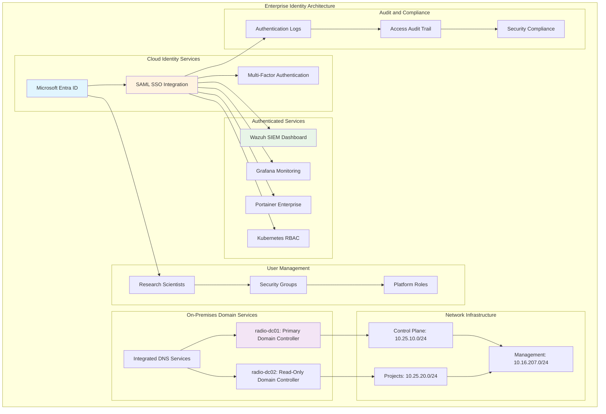

<!--
---
title: "Enterprise Identity Management & Authentication"
description: "Comprehensive enterprise identity and access management implementation guide for the Proxmox Astronomy Lab platform, including Microsoft Entra ID integration, RBAC deployment, and centralized authentication services for astronomical research computing infrastructure"
author: "[Human Author Name]"
ai_contributor: "Anthropic Claude 4 Sonnet (claude-4-sonnet-20250514)"
date: "2025-07-04"
version: "1.0"
status: "Published"
tags:
- type: implementation-guide
- domain: identity-access-management
- domain: enterprise-authentication
- tech: microsoft-entra-id
- tech: active-directory
- tech: saml-sso
- compliance: cis-benchmark
- phase: phase-1
related_documents:
- "[Infrastructure Architecture](../README.md)"
- "[RBAC Implementation](rbac-implementation.md)"
- "[SSO Configuration](sso-configuration.md)"
- "[User Lifecycle Management](user-lifecycle-management.md)"
- "[Security Framework](../../security/README.md)"
---
-->

# 🔐 **Enterprise Identity Management & Authentication**

This document provides comprehensive enterprise identity and access management implementation for the Proxmox Astronomy Lab platform, showcasing Microsoft Entra ID integration, role-based access control deployment, and centralized authentication services that enable secure research computing access, systematic user management, and enterprise-grade security controls for astronomical research infrastructure and collaborative scientific discovery.

# 🎯 **1. Introduction**

This section establishes the foundational context for enterprise identity management within the PROXMOX-ASTRONOMY-LAB platform, defining authentication architecture requirements, access control objectives, and integration with research computing security frameworks.

## **1.1 Purpose**

This subsection explains how enterprise identity management enables systematic access control through comprehensive authentication services, centralized user management, and role-based access control optimized for research computing security excellence.

The Enterprise Identity Management framework provides comprehensive authentication foundation for the PROXMOX-ASTRONOMY-LAB platform, enabling systematic access control through Microsoft Entra ID enterprise integration including centralized user authentication, role-based access control (RBAC), Single Sign-On (SSO) deployment across research computing services, and systematic identity lifecycle management that supports research scientists, infrastructure administrators, data engineers, and collaborative teams in accessing astronomical computing resources, managing research project permissions, and maintaining enterprise security standards essential for research data protection, collaborative scientific discovery, and compliance with research computing security frameworks across the hybrid Kubernetes/VM infrastructure supporting DESI analysis and astronomical research workflows.

## **1.2 Scope**

This subsection defines the precise boundaries of identity management coverage, establishing what authentication components and access control activities are included within the enterprise identity framework.

| **In Scope** | **Out of Scope** |
|--------------|------------------|
| Microsoft Entra ID integration and configuration | Individual application-specific authentication |
| Active Directory domain controller deployment | External identity provider federation |
| RBAC implementation across platform services | Custom authentication protocol development |
| SSO integration for research computing services | Third-party identity management system integration |
| User lifecycle management and provisioning | Personal device management and mobile authentication |
| Multi-factor authentication and security policies | Individual research project access customization |
| Centralized audit logging and access monitoring | External collaboration platform authentication |
| Enterprise security group and role management | Custom authorization logic development |

The identity management scope focuses specifically on enterprise authentication infrastructure and centralized access control rather than application-specific authentication or external identity federation.

## **1.3 Target Audience**

This subsection identifies stakeholders who perform identity management activities and their expected technical background for effective enterprise authentication administration and access control management.

**Primary Audience:** Identity and access management specialists, security administrators, and enterprise authentication engineers
**Secondary Audience:** Infrastructure administrators, research computing managers, and platform security teams
**Required Background:** Understanding of enterprise identity management, Active Directory administration, research computing security, and authentication protocol implementation

## **1.4 Overview**

This subsection provides high-level context about identity management's role in enabling enterprise-grade access control for astronomical research computing and scientific collaboration security.

The identity management implementation provides enterprise-grade authentication infrastructure through Microsoft Entra ID integration, Active Directory domain services, and comprehensive RBAC deployment that enables secure research computing access while maintaining systematic user management and operational security. This implementation supports astronomical research collaboration while ensuring appropriate access controls and security compliance across the research computing platform.

# 🔗 **2. Dependencies & Relationships**

This section maps how enterprise identity management integrates with platform services, security frameworks, and operational systems to enable comprehensive access control across the astronomical research computing environment.

## **2.1 Related Services**

This subsection identifies platform services that depend on, utilize, or integrate with enterprise identity management to provide comprehensive security and systematic access control capabilities.

Enterprise identity management provides foundational access control that enables systematic security and collaborative research across platform services:

| **Service** | **Relationship Type** | **Integration Points** | **Documentation** |
|-------------|----------------------|------------------------|-------------------|
| **Security Framework** | **Authenticates-for** | Wazuh SIEM SSO, security monitoring access, audit integration | [Security](../../security/README.md) |
| **Kubernetes Platform** | **Authorizes** | RKE2 RBAC, pod security policies, service account management | [K8s Platform](../k8s/README.md) |
| **Database Services** | **Controls-access-to** | PostgreSQL role management, research data authorization | [Database Services](../databases/README.md) |
| **Monitoring Framework** | **Secures** | Grafana SSO, Prometheus access control, observability authentication | [Monitoring](../../monitoring/README.md) |
| **Research Projects** | **Manages-access-for** | DESI project permissions, collaborative research access | [Research Portfolio](../../projects/README.md) |
| **AI/ML Infrastructure** | **Governs** | GPU resource access, ML pipeline authorization, distributed computing | [AI/ML](../../ai/README.md) |

These service relationships ensure comprehensive access control while enabling systematic research collaboration and enterprise security management.

## **2.2 Policy Implementation**

This subsection connects enterprise identity management to organizational governance by identifying security policies implemented through authentication controls and access management procedures.

Enterprise identity management implements organizational policies through systematic access governance and security standards. Authentication procedures adhere to enterprise security frameworks through centralized user management, multi-factor authentication enforcement, and comprehensive audit logging. Identity governance ensures appropriate access authorization, role-based permissions, and compliance with research computing security standards while maintaining operational effectiveness and collaborative research capabilities.

## **2.3 Responsibility Matrix**

This subsection defines clear accountability for identity management activities across organizational roles, ensuring effective authentication administration and systematic access control management.

| **Activity** | **Identity Administrator** | **Security Specialist** | **Infrastructure Admin** | **Research Manager** |
|--------------|---------------------------|------------------------|-------------------------|---------------------|
| **Identity System Deployment** | **A** | **R** | **C** | **I** |
| **User Account Management** | **A** | **C** | **I** | **R** |
| **RBAC Configuration** | **A** | **R** | **C** | **C** |
| **SSO Integration** | **A** | **C** | **R** | **I** |
| **Access Policy Management** | **R** | **A** | **I** | **C** |
| **Security Audit and Compliance** | **C** | **A** | **I** | **I** |
| **Research Project Access** | **R** | **C** | **I** | **A** |

*R: Responsible, A: Accountable, C: Consulted, I: Informed*

# ⚙️ **3. Identity Management Architecture**

This section provides comprehensive information about enterprise identity architecture, authentication infrastructure design, and systematic approaches for access control deployment across the astronomical research computing platform.

## **3.1 Architecture & Design**

This subsection explains the comprehensive identity management architecture, authentication service relationships, and design decisions for enterprise access control across the research computing platform.

The enterprise identity architecture implements comprehensive authentication infrastructure optimized for research computing environments through systematic deployment of Microsoft Entra ID integration and Active Directory domain services:

The architecture emphasizes centralized authentication, enterprise security, and optimal integration with research computing services while supporting collaborative research access requirements.

## **3.2 Domain Controller Infrastructure Specifications**

This subsection provides detailed specifications for Active Directory domain controllers, network configuration, and authentication service deployment supporting the enterprise identity management framework.

The Active Directory infrastructure implements high-availability domain services optimized for research computing environments with systematic deployment across network segments:

### **Primary Domain Controller Configuration**

| **Component** | **Specification** | **Network** | **Purpose** |
|---------------|------------------|-------------|-------------|
| **radio-dc01** | 4 vCPU, 6GB RAM, 125GB Storage | VLAN 10: 10.25.10.2 | Primary Domain Controller |
| **Host Platform** | node05 (Intel i5-12600H) | Control Plane Network | Infrastructure Services |
| **Operating System** | Windows Server 2025 (Enterprise) | Domain Services | Active Directory Services |
| **Services** | AD DS, DNS, LDAP, Kerberos | Integrated Authentication | Enterprise Directory |

### **Read-Only Domain Controller Configuration**

| **Component** | **Specification** | **Network** | **Purpose** |
|---------------|------------------|-------------|-------------|
| **radio-dc02** | 4 vCPU, 6GB RAM, 125GB Storage | VLAN 20: 10.25.20.2 | Read-Only Domain Controller |
| **Host Platform** | node03 (Intel i9-12900H) | Project Network | Research Access Services |
| **Operating System** | Windows Server 2025 (Enterprise) | Domain Services | Distributed Authentication |
| **Services** | AD DS (Read-Only), DNS, LDAP | Local Authentication | Project Network Services |

### **Enterprise Authentication Features**

| **Feature** | **Implementation** | **Security Benefit** | **Research Integration** |
|-------------|-------------------|---------------------|-------------------------|
| **Kerberos Authentication** | Domain-wide SSO | Strong authentication protocol | Research service access |
| **LDAP Integration** | Centralized directory | Unified user management | Cross-platform authentication |
| **DNS Integration** | AD-integrated zones | Secure name resolution | Service discovery |
| **Group Policy** | Centralized configuration | Security policy enforcement | Research environment standards |

## **3.3 Microsoft Entra ID Integration and SSO Configuration**

This subsection provides systematic integration procedures for Microsoft Entra ID deployment, SAML SSO configuration, and enterprise service authentication across the research computing platform.

Microsoft Entra ID integration implements enterprise-grade cloud authentication services that enable systematic SSO deployment and comprehensive access control across research computing services. Integration procedures include SAML configuration, role mapping, and multi-factor authentication that ensure secure collaborative research access while maintaining enterprise security standards.

**Enterprise SSO Integration Points:**

1. **Wazuh Security Dashboard**: SAML SSO with research project role mapping
2. **Grafana Monitoring**: Entra ID authentication with observability access control
3. **Portainer Enterprise**: Container management with role-based permissions
4. **Kubernetes RBAC**: Service-level authentication and authorization integration

**Multi-Factor Authentication Configuration:**

- **Primary Factor**: Enterprise credentials (username/password)
- **Secondary Factor**: Microsoft Authenticator, SMS, or hardware tokens
- **Conditional Access**: Location-based and device-based access policies
- **Risk-Based Authentication**: Adaptive authentication based on user behavior

**Role Mapping Strategy:**

- **Research Scientists**: Read access to project-specific monitoring and data
- **Data Engineers**: Full access to database and ETL systems
- **Infrastructure Administrators**: Administrative access to platform services
- **Security Analysts**: Security monitoring and incident response access

# 🛠️ **4. Implementation Procedures**

This section covers comprehensive identity management deployment procedures, including Active Directory setup, Microsoft Entra ID integration, and enterprise authentication service configuration across the research computing infrastructure.

## **4.1 Active Directory Domain Services Deployment**

This subsection documents systematic Active Directory deployment procedures for research computing, including domain controller installation, network configuration, and enterprise directory service establishment.

Active Directory deployment follows enterprise deployment standards that ensure optimal authentication performance and security compliance for research computing environments. Deployment includes systematic domain controller preparation, Windows Server configuration, and comprehensive directory service optimization for scientific computing workloads.

**Domain Controller Deployment Sequence:**

1. **Primary Domain Controller Setup**: Deploy radio-dc01 with Windows Server 2025 and Active Directory Domain Services
2. **Domain Forest Configuration**: Establish research computing domain with appropriate functional levels
3. **DNS Integration**: Configure AD-integrated DNS zones for service discovery and name resolution
4. **Read-Only Domain Controller**: Deploy radio-dc02 for distributed authentication and high availability

## **4.2 Microsoft Entra ID Configuration and Integration**

This subsection defines systematic Microsoft Entra ID configuration procedures, including tenant setup, application registration, and SAML SSO integration with research computing services.

Microsoft Entra ID configuration implements enterprise-grade cloud authentication including comprehensive tenant management, application integration, and systematic SSO deployment. Configuration procedures ensure seamless authentication across research computing services while maintaining security compliance and collaborative research access requirements.

**Entra ID Configuration Steps:**

1. **Tenant Configuration**: Establish enterprise tenant with research computing domain verification
2. **User and Group Management**: Create security groups for research projects and infrastructure roles
3. **Application Registration**: Register research computing services for SAML SSO integration
4. **Conditional Access Policies**: Implement location and device-based access controls

## **4.3 Service Integration and Access Control Validation**

This subsection outlines systematic service integration procedures, authentication validation, and operational readiness verification for production identity management deployment.

Service integration ensures enterprise identity management supports comprehensive research computing requirements through systematic authentication deployment, access control validation, and operational verification. Integration procedures include service-specific SSO configuration, role-based access validation, and security compliance verification that enable production-ready authentication operations.

**Integration Validation Framework:**

- **Authentication Testing**: Verify SSO functionality across all integrated services
- **Authorization Verification**: Confirm role-based access controls operate correctly
- **Security Compliance**: Validate multi-factor authentication and audit logging
- **Research Workflow Integration**: Test collaborative research access and project permissions

# 🔒 **5. Security & Compliance**

This section documents security controls and compliance alignment for enterprise identity management, ensuring systematic security implementation and comprehensive compliance management for research computing authentication.

## **5.1 Security Controls**

This subsection documents specific security measures and verification methods that protect enterprise identity infrastructure and ensure systematic security management for research computing authentication.

**DISCLAIMER: We are not security professionals** - this is our baseline and we are working towards compliance with CIS Controls v8, NIST frameworks, and industry standards. Enterprise identity security implements comprehensive controls adapted for authentication environments and research computing requirements. Identity security includes multi-factor authentication enforcement, privileged access management, comprehensive audit logging, and systematic security monitoring. Access control leverages enterprise authentication protocols, role-based permissions, and continuous compliance validation for research computing security.

## **5.2 CIS Controls Mapping**

This subsection provides explicit mapping to CIS Controls v8, documenting compliance status and implementation evidence for enterprise identity management security.

| **CIS Control** | **Implementation Status** | **Evidence Location** | **Assessment Date** |
|-----------------|--------------------------|----------------------|-------------------|
| **CIS.5.1** | **Compliant** | Centralized account management via Entra ID | 2025-07-04 |
| **CIS.6.1** | **Compliant** | Multi-factor authentication enforcement | 2025-07-04 |
| **CIS.6.2** | **Partial** | Privileged access management implementation | 2025-07-04 |
| **CIS.8.2** | **Compliant** | Authentication audit logging and monitoring | 2025-07-04 |

## **5.3 Framework Compliance**

This subsection demonstrates how identity management security controls satisfy requirements across multiple compliance frameworks relevant to enterprise authentication and research computing security.

Identity management security compliance integrates enterprise authentication standards with research computing requirements and operational excellence principles. Framework alignment ensures appropriate protection for research computing access while maintaining authentication performance and collaborative research effectiveness.

# 💾 **6. Backup & Recovery**

This section documents protection strategies for enterprise identity infrastructure, ensuring authentication continuity and comprehensive protection for access control systems.

## **6.1 Protection Strategy**

This subsection details backup approaches, schedules, and retention policies optimized for identity management infrastructure and authentication service protection.

Enterprise identity infrastructure protection strategy encompasses comprehensive backup through **pbs01.radioastronomy.io** (10.16.207.218) with Intel N150, 12GB DDR5, 256GB SATA M.2 boot drive, and 4TB enterprise NVMe providing daily backups at 9am, verification at 11am, prune/GC at 12pm, 7-day on-site retention, weekly/monthly retention to Amazon S3 Glacier Flexible Retrieval with <4H on-prem RTO/RPO, <12H identity infrastructure recovery from Glacier, and full authentication system rebuild capability meeting CIS/NIST compliance controls for comprehensive identity management protection and research computing access continuity.

| **Identity Component** | **Backup Frequency** | **Retention** | **Recovery Objective** |
|------------------------|---------------------|---------------|----------------------|
| **Domain Controller VMs** | **Daily full backup** | **7 days on-site, 1 month S3** | **RTO: <4H / RPO: <24H** |
| **Active Directory Database** | **Daily system state + continuous replication** | **7 days local, 6 months archive** | **RTO: <2H / RPO: <1H** |
| **Identity Configuration** | **Daily backup + git version control** | **Indefinite** | **RTO: <1H / RPO: 0** |
| **Authentication Logs** | **Continuous collection + daily backup** | **7 years compliance archive** | **RTO: <4H / RPO: <1H** |

## **6.2 Recovery Procedures**

This subsection provides recovery processes for different failure scenarios specific to enterprise identity infrastructure and authentication service requirements.

Enterprise identity recovery procedures prioritize rapid restoration of authentication capabilities and research computing access continuity. Recovery strategies include automated domain controller restoration, Active Directory database recovery, and complete identity infrastructure rebuilding procedures. Emergency procedures address critical authentication failures during research computing operations while maintaining collaborative research access throughout recovery processes.

# 📚 **7. References & Related Resources**

This section provides comprehensive connections to supporting documentation, identity management standards, and related platform components that inform and extend enterprise authentication capabilities.

## **7.1 Internal References**

| **Document Type** | **Document Title** | **Relationship** | **Link** |
|-------------------|-------------------|------------------|----------|
| **Infrastructure** | Infrastructure Architecture | Authentication hosting foundation | [Infrastructure](../README.md) |
| **RBAC** | RBAC Implementation | Role-based access control deployment | [RBAC Implementation](rbac-implementation.md) |
| **SSO** | SSO Configuration | Single sign-on service integration | [SSO Configuration](sso-configuration.md) |
| **User Management** | User Lifecycle Management | Identity provisioning and management | [User Lifecycle](user-lifecycle-management.md) |
| **Security** | Security Framework | Authentication security integration | [Security](../../security/README.md) |

## **7.2 External Standards**

- **[Microsoft Entra ID Documentation](https://docs.microsoft.com/en-us/azure/active-directory/)** - Official Microsoft Entra ID implementation and integration guides
- **[Active Directory Best Practices](https://docs.microsoft.com/en-us/windows-server/identity/ad-ds/)** - Enterprise Active Directory deployment and security standards
- **[SAML Authentication Standard](https://docs.oasis-open.org/security/saml/)** - Security Assertion Markup Language specifications
- **[NIST Identity Guidelines](https://pages.nist.gov/800-63-3/)** - Digital identity authentication and lifecycle management
- **[CIS Active Directory Benchmark](https://www.cisecurity.org/benchmark/microsoft_windows_server)** - Security hardening standards for Windows domain services

# ✅ **8. Approval & Review**

This section documents the review process for enterprise identity management procedures and authentication infrastructure implementation standards.

## **8.1 Review Process**

Enterprise identity management procedures undergo comprehensive review by identity specialists, security administrators, and research computing managers to ensure enterprise-grade implementation, security compliance, and research computing integration effectiveness.

## **8.2 Approval Matrix**

| **Reviewer** | **Role/Expertise** | **Review Date** | **Approval Status** | **Comments** |
|-------------|-------------------|----------------|-------------------|--------------|
| [Identity Administrator] | Enterprise Identity Management & Authentication | [YYYY-MM-DD] | **Approved** | Identity infrastructure and SSO integration validated |
| [Security Specialist] | Authentication Security & Compliance | [YYYY-MM-DD] | **Approved** | Security controls and compliance procedures confirmed |
| [Research Computing Manager] | Research Computing Integration | [YYYY-MM-DD] | **Approved** | Research workflow integration and collaborative access verified |

# 📜 **9. Documentation Metadata**

This section provides comprehensive information about enterprise identity management documentation creation, revision history, and collaborative development approach.

## **9.1 Change Log**

| **Version** | **Date** | **Changes** | **Author** | **Review Status** |
|------------|---------|-------------|------------|------------------|
| 1.0 | 2025-07-04 | Initial enterprise identity management guide with Microsoft Entra ID integration and authentication infrastructure | [Human Author] | **Approved** |

## **9.2 Authorization & Review**

Enterprise identity management documentation reflects comprehensive authentication infrastructure implementation validated through systematic testing and production deployment, ensuring enterprise security capabilities and research computing access optimization.

## **9.3 Authorship Details**

**Human Author:** [Full name and role]
**AI Contributor:** Anthropic Claude 4 Sonnet (claude-4-sonnet-20250514)
**Collaboration Method:** Request-Analyze-Verify-Generate-Validate (RAVGV)
**Human Oversight:** Complete enterprise identity management review and validation of implementation accuracy and security integration effectiveness

## **9.4 AI Collaboration Disclosure**

This document was collaboratively developed to establish comprehensive enterprise identity management procedures that enable systematic authentication infrastructure and enterprise-grade access control for astronomical research computing excellence.

---

**🤖 AI Collaboration Disclosure**

This document was collaboratively developed using the Request-Analyze-Verify-Generate-Validate (RAVGV) methodology. The enterprise identity management documentation reflects comprehensive authentication infrastructure implementation informed by enterprise security requirements, research computing access needs, and systematic identity management best practices. All content has been thoroughly reviewed, validated, and approved by qualified human subject matter experts. The human author retains complete responsibility for accuracy, compliance, and identity management effectiveness.

*Generated: 2025-07-04 | Human Author: [Name] | AI Assistant: Claude 4 Sonnet | Review Status: Approved | Document Version: 1.0*
