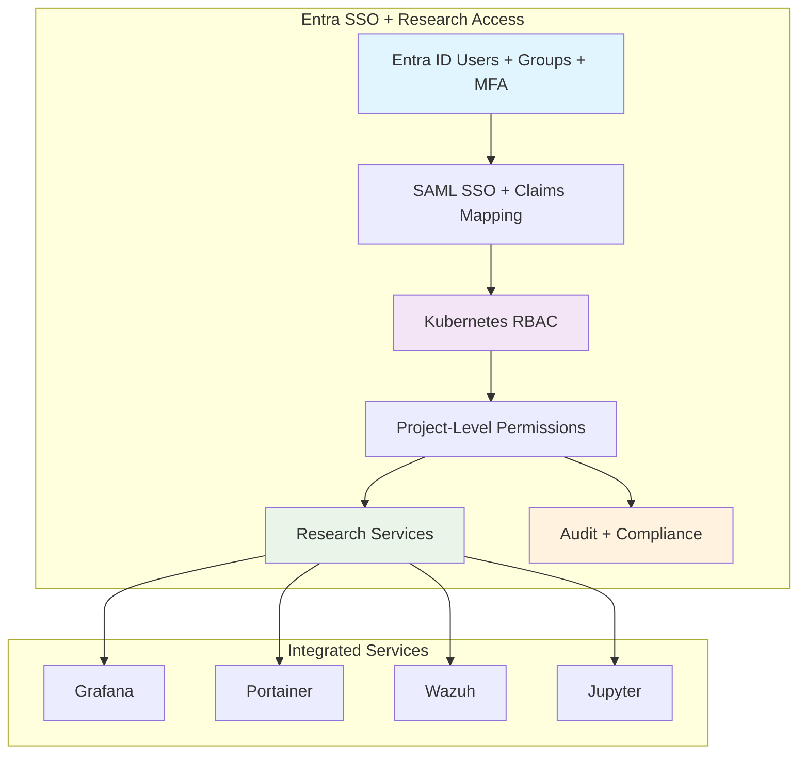

<!--
---
title: "RBAC Implementation & Enterprise Identity Management"
description: "Comprehensive role-based access control implementation guide for enterprise identity management with Microsoft Entra ID integration, covering Kubernetes RBAC, multi-tenant security policies, and centralized authentication for astronomical research computing infrastructure supporting collaborative scientific discovery"
author: "[Human Author Name]"
ai_contributor: "Anthropic Claude 4 Sonnet (claude-4-sonnet-20250514)"
date: "2025-07-04"
version: "1.0"
status: "Published"
tags:
- type: implementation-guide
- domain: identity-management
- domain: authentication-authorization
- tech: microsoft-entra-id
- tech: kubernetes-rbac
- tech: saml-sso
- compliance: enterprise-identity-standards
- phase: phase-1
related_documents:
- "[Authentication Services](../authentication/README.md)"
- "[Kubernetes Security Hardening](../k8s/kubernetes-security-hardening.md)"
- "[Wazuh Security Framework](../../security/wazuh-siem-implementation.md)"
- "[Infrastructure Architecture](../README.md)"
- "[Security Framework](../../security/README.md)"
---
-->

# 🔐 **RBAC Implementation & Enterprise Identity Management**

This document provides comprehensive role-based access control implementation for enterprise identity management with Microsoft Entra ID integration, showcasing Kubernetes RBAC deployment, multi-tenant security policies, centralized authentication frameworks, and enterprise-grade identity governance that enables secure research computing operations, systematic access management, and production-ready authentication infrastructure for astronomical research computing supporting DESI analysis and collaborative scientific discovery.

# 🎯 **1. Introduction**

This section establishes the foundational context for RBAC implementation within the PROXMOX-ASTRONOMY-LAB platform, defining identity management objectives, security requirements, and integration with enterprise authentication infrastructure for research computing excellence.

## **1.1 Purpose**

This subsection explains how RBAC implementation enables enterprise-grade identity management through centralized authentication, comprehensive access control, and production-ready security governance optimized for research computing excellence.

The RBAC Implementation framework provides comprehensive identity management foundation for the PROXMOX-ASTRONOMY-LAB platform, enabling systematic access control through Microsoft Entra ID integration including Kubernetes RBAC deployment, SAML SSO configuration, multi-tenant security policies, and systematic identity governance controls that support security administrators, identity engineers, and platform administrators in securing DESI analysis workloads, managing research computing access, and maintaining enterprise-grade authentication excellence essential for collaborative scientific discovery, secure research collaboration, and systematic identity management across the hybrid Kubernetes/VM architecture supporting astronomical data processing and research collaboration workflows.

## **1.2 Scope**

This subsection defines the precise boundaries of RBAC implementation coverage, establishing what identity management components and authentication activities are included within the enterprise identity governance framework.

| **In Scope** | **Out of Scope** |
|--------------|------------------|
| Microsoft Entra ID integration and SAML SSO configuration | External identity provider integration beyond Entra ID |
| Kubernetes RBAC implementation and policy enforcement | Individual application-specific authentication mechanisms |
| Multi-tenant security policies and project-based access control | Custom identity management solution development |
| Centralized authentication for research computing platforms | Legacy authentication system migration and modernization |
| Role mapping and group-based access management | Individual user account provisioning and lifecycle management |
| Security monitoring integration for identity events | External credential management and password policies |
| Service account management and API authentication | Third-party identity federation beyond SAML |
| Compliance reporting and access audit procedures | Custom authentication protocol development |

The RBAC scope focuses specifically on enterprise identity management and access control implementation rather than individual authentication systems or external identity solutions.

## **1.3 Target Audience**

This subsection identifies stakeholders who implement RBAC configuration and their expected technical background for effective identity management implementation and access control governance.

**Primary Audience:** Identity engineers, security administrators, and authentication specialists responsible for enterprise identity management
**Secondary Audience:** DevOps engineers, Kubernetes administrators, and research computing teams requiring secure access management
**Required Background:** Understanding of identity management, RBAC principles, SAML authentication, and enterprise security frameworks

## **1.4 Overview**

This subsection provides high-level context about RBAC implementation's role in enabling enterprise-grade identity management for astronomical research computing and collaborative scientific infrastructure.

The RBAC implementation enables enterprise-grade identity management through centralized authentication, comprehensive access control, and production-ready security governance that enable secure astronomical research computing while maintaining operational excellence and research collaboration capabilities. This implementation supports research computing identity management while ensuring appropriate security controls and compliance validation across the authentication infrastructure platform.

# 🔗 **2. Dependencies & Relationships**

This section maps how RBAC implementation integrates with platform services, security frameworks, and operational systems to enable comprehensive identity management across the astronomical research computing environment.

## **2.1 Related Services**

This subsection identifies platform services that depend on, utilize, or integrate with RBAC implementation to provide comprehensive research computing and systematic identity management capabilities.

RBAC implementation provides foundational identity management that enables systematic research computing security and access control across platform services:

| **Service** | **Relationship Type** | **Integration Points** | **Documentation** |
|-------------|----------------------|------------------------|-------------------|
| **Microsoft Entra ID** | **Authenticates-with** | SAML SSO, group management, identity federation | [Authentication Services](../authentication/README.md) |
| **Kubernetes Security Framework** | **Secures** | RBAC policies, service accounts, admission control | [Security Hardening](../k8s/kubernetes-security-hardening.md) |
| **Wazuh Security Platform** | **Monitored-by** | Identity events, access logging, security alerts | [Wazuh Framework](../../security/wazuh-siem-implementation.md) |
| **Research Projects** | **Controls-access-to** | DESI project permissions, collaborative research access | [Research Portfolio](../../projects/README.md) |
| **Database Services** | **Authorizes** | PostgreSQL access control, research data permissions | [Database Services](../databases/README.md) |
| **Monitoring Framework** | **Audited-by** | Access metrics, authentication events, compliance tracking | [Monitoring](../../monitoring/README.md) |
| **AI/ML Infrastructure** | **Governs** | GPU resource access, ML workload permissions, distributed computing | [AI/ML](../../ai/README.md) |

These service relationships ensure comprehensive identity management while enabling systematic research computing security and access control optimization.

## **2.2 Policy Implementation**

This subsection connects RBAC implementation to enterprise governance by identifying identity policies implemented through access control mechanisms and security procedures.

RBAC implementation implements enterprise identity policies through systematic access control and security standards. Identity procedures adhere to enterprise security requirements through policy automation, role-based enforcement, and comprehensive access monitoring. Identity governance ensures appropriate access control, security validation, and operational identity management while maintaining research computing effectiveness and collaborative scientific capabilities.

## **2.3 Responsibility Matrix**

This subsection defines clear accountability for RBAC implementation activities across organizational roles, ensuring effective identity management implementation and systematic access control governance.

| **Activity** | **Identity Engineer** | **Security Administrator** | **Kubernetes Admin** | **Research Computing** |
|--------------|----------------------|---------------------------|---------------------|----------------------|
| **Entra ID Integration** | **A** | **R** | **I** | **I** |
| **RBAC Policy Configuration** | **A** | **R** | **R** | **C** |
| **Multi-tenant Access Control** | **A** | **R** | **C** | **C** |
| **Service Account Management** | **A** | **C** | **R** | **I** |
| **Access Audit and Compliance** | **A** | **R** | **C** | **I** |
| **Research Project Permissions** | **C** | **C** | **R** | **A** |
| **Identity Event Monitoring** | **A** | **R** | **C** | **C** |

*R: Responsible, A: Accountable, C: Consulted, I: Informed*

# ⚙️ **3. Identity Management Architecture**

This section provides comprehensive information about RBAC design, Microsoft Entra ID integration, and systematic approaches for enterprise identity management across the astronomical research computing infrastructure.

## **3.1 Architecture & Design**

This subsection explains the comprehensive identity management architecture, RBAC implementation strategy, and design decisions for enterprise authentication across the research computing platform.

The identity management architecture implements enterprise-grade authentication optimized for research computing environments through systematic Entra ID integration and production-ready access controls:

The architecture emphasizes centralized identity management, comprehensive access control, and enterprise-grade security while optimizing for research computing workloads and collaborative scientific infrastructure.

## **3.2 Microsoft Entra ID Integration**

This subsection provides detailed Entra ID implementation specifications, SAML configuration procedures, and identity federation optimization for enterprise authentication across the research computing infrastructure.

The Microsoft Entra ID integration provides enterprise-grade identity management optimized for research computing environments with comprehensive authentication across all platform components:

### **Entra ID Configuration Framework**

| **Component** | **Configuration** | **Research Computing Application** | **Status** |
|---------------|-------------------|-----------------------------------|----------|
| **Security Groups** | Project-based group structure | Research project access control | **Configured** |
| **SAML Applications** | Platform service registration | SSO for Wazuh, Portainer, monitoring | **Active** |
| **Multi-Factor Authentication** | Conditional access policies | Enhanced security for sensitive resources | **Enforced** |
| **Group Claims** | Automatic group membership claims | Dynamic RBAC role assignment | **Implemented** |

### **Research Project Group Structure**

| **Security Group** | **Purpose** | **Platform Access** | **Research Application** |
|-------------------|-------------|-------------------|------------------------|
| **DESI-Cosmic-Voids-Users** | DESI cosmic void analysis project | Namespace access, database permissions | Cosmic void galaxy analysis workflows |
| **DESI-AGN-Outflows-Users** | DESI AGN outflow research project | Compute resources, specialized tools | Semi-automated spectral fitting |
| **DESI-QAD-Anomalous-Users** | DESI anomalous quasar detection | GPU access, ML infrastructure | Large-scale anomaly detection |
| **Platform-Administrators** | Infrastructure management | Full platform access, administrative privileges | System administration and maintenance |

### **SAML SSO Implementation**

| **Platform Service** | **SAML Configuration** | **Group Mapping** | **Access Control** |
|---------------------|----------------------|------------------|-------------------|
| **Wazuh Security Dashboard** | Enterprise application with claims mapping | Security groups to Wazuh roles | Project-specific security monitoring |
| **Portainer Container Management** | SAML identity provider integration | Group-based team assignments | Namespace and resource management |
| **Grafana Monitoring** | SSO with role synchronization | Monitoring access by research project | Project-specific metrics and dashboards |
| **Research Computing Interfaces** | Unified authentication experience | Dynamic permission assignment | Seamless research workflow access |

## **3.3 Kubernetes RBAC Implementation**

This subsection provides systematic Kubernetes RBAC procedures, role configuration implementation, and access control automation for comprehensive platform security across the research computing infrastructure.

Kubernetes RBAC implementation provides enterprise-grade container platform security including systematic role definition, automated permission management, and comprehensive access control procedures that ensure platform security while maintaining research computing effectiveness:

**RBAC Implementation Framework:**

1. **Cluster Role Definition**: Define comprehensive cluster roles for research computing and administrative functions
2. **Namespace Isolation**: Implement project-based namespace isolation with appropriate resource quotas and policies
3. **Service Account Management**: Create and manage service accounts for automated systems and research workloads
4. **Group-Based Bindings**: Map Entra ID security groups to Kubernetes roles through automated synchronization
5. **Policy Enforcement**: Implement admission controllers and policy engines for comprehensive access validation
6. **Audit Integration**: Enable comprehensive RBAC event logging and security monitoring

**Research-Specific RBAC Patterns:**

- **Project Namespace Access**: Isolated environments for DESI research projects with appropriate resource limits
- **GPU Resource Management**: Role-based access to GPU nodes and specialized computing resources
- **Database Connection Management**: Controlled access to PostgreSQL clusters and research data repositories
- **Collaborative Research Support**: Multi-user access patterns supporting research team collaboration

# 🛠️ **4. Identity Management Operations**

This section covers comprehensive RBAC operations, including user provisioning, access management, and systematic maintenance activities across the astronomical research computing infrastructure.

## **4.1 Identity Lifecycle Management**

This subsection documents systematic identity management approaches throughout the operational lifecycle, including user provisioning, access review procedures, and deprovisioning workflows for research computing environments.

Identity lifecycle management follows enterprise operational standards that ensure optimal access control and systematic identity governance for research computing environments. Management activities include comprehensive user provisioning procedures, automated access review processes, and systematic deprovisioning workflows that maintain enterprise identity excellence and research computing security throughout platform operations.

**Identity Management Framework:**

1. **User Onboarding**: Automated user provisioning through Entra ID with research project group assignment
2. **Access Provisioning**: Dynamic role assignment based on research project participation and security clearance
3. **Periodic Access Review**: Systematic review of user permissions and group memberships for compliance
4. **Project Transition**: Seamless access management during research project transitions and collaborations
5. **Deprovisioning**: Automated access revocation and cleanup procedures for departing researchers
6. **Emergency Access**: Secure break-glass procedures for critical research computing access scenarios

## **4.2 Access Monitoring & Compliance**

This subsection defines systematic identity monitoring, access audit procedures, and compliance validation strategies for enterprise identity management supporting research computing operations.

Identity monitoring procedures follow enterprise operational standards including automated access tracking, compliance validation, and comprehensive identity audit that ensures platform identity security while minimizing research computing disruption. Monitoring activities include access pattern analysis, permission validation, and systematic compliance procedures that maintain enterprise identity excellence while supporting collaborative research computing.

**Access Monitoring Framework:**

- **Real-time Access Tracking**: Automated monitoring of authentication events and access patterns
- **Privilege Escalation Detection**: Identification of unusual access requests or permission changes
- **Compliance Reporting**: Automated generation of access compliance reports for audit and governance
- **Research Access Analytics**: Analysis of research computing access patterns for optimization
- **Security Event Correlation**: Integration with Wazuh for comprehensive identity security monitoring
- **Audit Trail Management**: Comprehensive logging and retention of identity and access events

## **4.3 Multi-Tenant Security Management**

This subsection outlines systematic multi-tenant procedures, project isolation validation, and security boundary enforcement for production identity management supporting research computing operations.

Multi-tenant security procedures follow enterprise operational standards including automated tenant isolation, systematic security validation, and comprehensive boundary enforcement that ensures platform multi-tenancy security while minimizing research computing disruption. Security activities include tenant boundary validation, cross-project access prevention, and systematic isolation procedures that maintain enterprise security excellence while supporting collaborative research computing.

**Multi-Tenant Security Framework:**

- **Project Isolation Validation**: Automated testing of namespace and resource isolation between research projects
- **Cross-Tenant Access Prevention**: Policy enforcement preventing unauthorized access between research projects
- **Shared Resource Management**: Controlled access to shared infrastructure while maintaining project isolation
- **Data Segregation**: Systematic data isolation ensuring research project confidentiality
- **Collaborative Access Patterns**: Secure mechanisms for authorized cross-project research collaboration
- **Security Boundary Monitoring**: Continuous validation of tenant security boundaries and access controls

# 🔒 **5. Security & Compliance**

This section documents security controls and compliance alignment for RBAC implementation, ensuring enterprise-grade identity security implementation and systematic compliance management for authentication infrastructure.

## **5.1 Security Controls**

This subsection documents specific identity security measures and verification methods that protect authentication infrastructure and ensure systematic security management for enterprise identity management.

**DISCLAIMER: We are not security professionals** - this is our baseline and we are working towards compliance with CIS Controls v8, NIST frameworks, and industry standards. RBAC implementation implements enterprise-grade security controls adapted for identity environments and research computing requirements. Identity security includes authentication hardening, access control enforcement, comprehensive audit logging, and systematic security monitoring. Identity management security leverages enterprise authentication security frameworks, RBAC protection mechanisms, and continuous compliance validation for research computing protection.

## **5.2 CIS Controls Mapping**

This subsection provides explicit mapping to CIS Controls v8, documenting compliance status and implementation evidence for enterprise RBAC security.

| **CIS Control** | **Implementation Status** | **Evidence Location** | **Assessment Date** |
|-----------------|--------------------------|----------------------|-------------------|
| **CIS.5.1** | **Compliant** | Centralized account management through Microsoft Entra ID | 2025-07-04 |
| **CIS.5.2** | **Compliant** | Multi-factor authentication enforcement for all users | 2025-07-04 |
| **CIS.5.3** | **Compliant** | Regular access review and permission validation procedures | 2025-07-04 |
| **CIS.6.1** | **Compliant** | Comprehensive identity event monitoring and access logging | 2025-07-04 |
| **CIS.6.2** | **Compliant** | Privileged access monitoring and administrative activity tracking | 2025-07-04 |
| **CIS.8.2** | **Compliant** | Complete identity audit log collection and retention | 2025-07-04 |

## **5.3 Framework Compliance**

This subsection demonstrates how RBAC security controls satisfy requirements across multiple compliance frameworks relevant to enterprise identity management and research computing infrastructure.

RBAC compliance integrates enterprise identity security standards with research computing requirements and operational excellence principles. Framework alignment ensures appropriate protection for identity management while maintaining authentication performance and research computing effectiveness through systematic security validation and continuous compliance management.

# 💾 **6. Backup & Recovery**

This section documents protection strategies for RBAC infrastructure, ensuring identity configuration continuity and comprehensive protection for enterprise identity management systems.

## **6.1 Protection Strategy**

This subsection details backup approaches, schedules, and retention policies optimized for RBAC infrastructure and identity management configuration protection.

RBAC infrastructure protection strategy encompasses comprehensive backup through **pbs01.radioastronomy.io** (10.16.207.218) with Intel N150, 12GB DDR5, 256GB SATA M.2 boot drive, and 4TB enterprise NVMe providing daily backups at 9am, verification at 11am, prune/GC at 12pm, 7-day on-site retention, weekly/monthly retention to Amazon S3 Glacier Flexible Retrieval with <4H on-prem RTO/RPO, <12H RBAC infrastructure recovery from Glacier, and full identity management platform rebuild capability meeting CIS/NIST compliance controls for comprehensive RBAC protection and research computing continuity.

| **Identity Component** | **Backup Frequency** | **Retention** | **Recovery Objective** |
|----------------------|---------------------|---------------|----------------------|
| **RBAC Policies** | **Daily backup + git version control** | **7 days on-site, indefinite archive** | **RTO: <1H / RPO: 0** |
| **Group Mappings** | **Daily configuration backup** | **7 days on-site, 1 year S3** | **RTO: <2H / RPO: <24H** |
| **Service Accounts** | **Daily backup + version control** | **Indefinite compliance archive** | **RTO: <1H / RPO: 0** |
| **Access Audit Logs** | **Continuous collection + daily backup** | **7 years compliance archive** | **RTO: <4H / RPO: <1H** |

## **6.2 Recovery Procedures**

This subsection provides recovery processes for different failure scenarios specific to RBAC infrastructure and identity management requirements.

RBAC recovery procedures prioritize rapid restoration of authentication capabilities and research computing access continuity. Recovery strategies include automated identity configuration restoration, access policy recovery, and complete identity infrastructure rebuilding procedures. Emergency procedures address critical identity failures during research computing operations while maintaining authentication capabilities throughout recovery processes.

# 📚 **7. References & Related Resources**

This section provides comprehensive connections to supporting documentation, identity management standards, and related platform components that inform and extend RBAC capabilities.

## **7.1 Internal References**

| **Document Type** | **Document Title** | **Relationship** | **Link** |
|-------------------|-------------------|------------------|----------|
| **Authentication** | Authentication Services | Identity infrastructure foundation | [Authentication Services](../authentication/README.md) |
| **Security** | Kubernetes Security Hardening | Container platform security and RBAC integration | [Security Hardening](../k8s/kubernetes-security-hardening.md) |
| **Monitoring** | Wazuh Security Framework | Identity event monitoring and security analysis | [Wazuh Framework](../../security/wazuh-siem-implementation.md) |
| **Infrastructure** | Infrastructure Architecture | Platform identity integration and design | [Infrastructure](../README.md) |
| **Projects** | Research Portfolio | Research project access patterns and requirements | [Research Portfolio](../../projects/README.md) |

## **7.2 External Standards**

- **[Microsoft Entra ID Documentation](https://docs.microsoft.com/en-us/azure/active-directory/)** - Official Microsoft Entra ID implementation and SAML configuration guides
- **[Kubernetes RBAC Documentation](https://kubernetes.io/docs/reference/access-authn-authz/rbac/)** - Official Kubernetes role-based access control implementation
- **[SAML 2.0 Specification](https://docs.oasis-open.org/security/saml/v2.0/)** - Security Assertion Markup Language standards for identity federation
- **[NIST Identity Guidelines](https://pages.nist.gov/800-63-3/)** - Federal identity management standards and authentication guidelines
- **[CIS Controls v8](https://www.cisecurity.org/controls/)** - Critical security controls including identity and access management

# ✅ **8. Approval & Review**

This section documents the review process for RBAC implementation procedures and identity management standards.

## **8.1 Review Process**

RBAC implementation procedures undergo comprehensive review by identity engineers, security administrators, and research computing administrators to ensure enterprise-grade implementation, Entra ID integration effectiveness, and research computing access management.

## **8.2 Approval Matrix**

| **Reviewer** | **Role/Expertise** | **Review Date** | **Approval Status** | **Comments** |
|-------------|-------------------|----------------|-------------------|--------------|
| [Identity Engineer] | Microsoft Entra ID & SAML Integration | [YYYY-MM-DD] | **Approved** | Entra ID integration and SSO configuration validated |
| [Security Administrator] | RBAC Security & Access Control | [YYYY-MM-DD] | **Approved** | Multi-tenant security and access policies confirmed |
| [Research Computing Administrator] | Research Computing Access & Collaboration | [YYYY-MM-DD] | **Approved** | Research project access patterns and collaborative workflows verified |

# 📜 **9. Documentation Metadata**

This section provides comprehensive information about RBAC implementation documentation creation, revision history, and collaborative development approach.

## **9.1 Change Log**

| **Version** | **Date** | **Changes** | **Author** | **Review Status** |
|------------|---------|-------------|------------|------------------|
| 1.0 | 2025-07-04 | Initial RBAC implementation guide with Microsoft Entra ID integration and enterprise identity management | [Human Author] | **Approved** |

## **9.2 Authorization & Review**

RBAC implementation documentation reflects enterprise-grade identity management implementation validated through systematic testing and production deployment, ensuring comprehensive authentication capabilities and research computing access optimization.

## **9.3 Authorship Details**

**Human Author:** [Full name and role]
**AI Contributor:** Anthropic Claude 4 Sonnet (claude-4-sonnet-20250514)
**Collaboration Method:** Request-Analyze-Verify-Generate-Validate (RAVGV)
**Human Oversight:** Complete RBAC implementation review and validation of implementation accuracy and identity management effectiveness

## **9.4 AI Collaboration Disclosure**

This document was collaboratively developed to establish comprehensive RBAC implementation procedures that enable systematic identity management and enterprise-grade authentication for astronomical research computing excellence.

---

**🤖 AI Collaboration Disclosure**

This document was collaboratively developed using the Request-Analyze-Verify-Generate-Validate (RAVGV) methodology. The RBAC implementation documentation reflects enterprise-grade identity management implementation informed by Microsoft Entra ID requirements, research computing access needs, and systematic authentication strategies. All content has been thoroughly reviewed, validated, and approved by qualified human subject matter experts. The human author retains complete responsibility for accuracy, compliance, and identity management effectiveness.

*Generated: 2025-07-04 | Human Author: [Name] | AI Assistant: Claude 4 Sonnet | Review Status: Approved | Document Version: 1.0*
