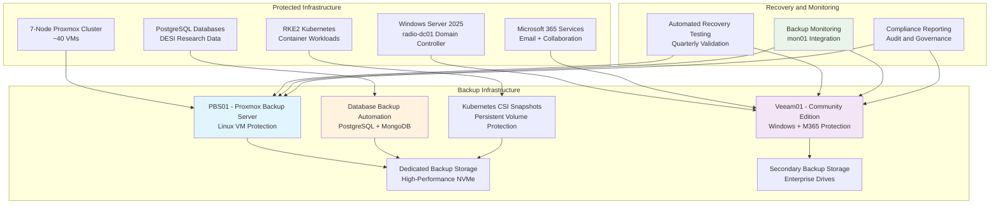

# 💾 **Backups**

This category provides comprehensive documentation for enterprise backup and recovery infrastructure across the Proxmox Astronomy Lab's research computing platform. The documentation covers systematic approaches to multi-tier data protection, automated backup workflows, and enterprise recovery procedures supporting both Linux and Windows infrastructure with specialized coverage for Microsoft 365 backup and scientific data protection. These implementations demonstrate enterprise-grade backup strategies optimized for research computing environments with emphasis on data integrity, recovery time objectives, and systematic disaster recovery capabilities.

## **Overview**

Backups represent the sophisticated orchestration of enterprise data protection, systematic recovery procedures, and comprehensive disaster recovery planning across the research computing infrastructure. The Proxmox Astronomy Lab implements enterprise-grade backup systems centered on Proxmox Backup Server (PBS01) for Linux virtualization infrastructure, Veeam Community Edition (Veeam01) for Windows Server and Microsoft 365 protection, and specialized database backup procedures supporting PostgreSQL astronomical datasets. This implementation provides automated backup scheduling, encrypted data protection, systematic retention management, and comprehensive recovery testing procedures ensuring data integrity and operational continuity for scientific research applications.

The backup ecosystem operates as the critical data protection foundation across the hybrid Kubernetes and VM architecture, providing seamless integration with research data workflows, database protection, and infrastructure recovery procedures. These systems enable systematic protection of DESI analysis datasets, automated infrastructure backup workflows, comprehensive disaster recovery capabilities, and systematic testing procedures ensuring reliable data protection and recovery across all research computing domains and operational scenarios.

---

## **📁 Repository Structure**

```markdown
infrastructure/backups/
├── README.md                                    # This category overview document
├── proxmox-backup-server/
│   ├── README.md                               # PBS01 enterprise backup infrastructure
│   ├── pbs-configuration/                     # Proxmox Backup Server setup and optimization
│   ├── vm-backup-scheduling/                  # Automated VM backup workflows and schedules
│   ├── retention-policies/                    # Systematic data retention and lifecycle management
│   └── monitoring-alerting/                   # Backup monitoring and failure alerting
├── veeam-community-edition/
│   ├── README.md                               # Veeam01 Windows and M365 backup infrastructure
│   ├── windows-server-backup/                 # Windows Server 2025 backup procedures
│   ├── microsoft365-backup/                   # M365 email and collaboration backup
│   ├── veeam-configuration/                   # Veeam Community Edition setup and optimization
│   └── recovery-procedures/                   # Windows and M365 recovery workflows
├── database-backups/
│   ├── README.md                               # Database backup strategies and automation
│   ├── postgresql-backup/                     # PostgreSQL backup automation and point-in-time recovery
│   ├── mongodb-backup/                        # MongoDB backup procedures and validation
│   ├── backup-validation/                     # Database backup integrity testing
│   └── performance-optimization/              # Database backup performance tuning
├── kubernetes-storage-protection/
│   ├── README.md                               # Kubernetes persistent volume backup
│   ├── csi-snapshots/                         # Container Storage Interface snapshot management
│   ├── application-backups/                   # Application-specific backup procedures
│   ├── stateful-workload-protection/          # StatefulSet and persistent data protection
│   └── disaster-recovery/                     # Kubernetes cluster disaster recovery
├── disaster-recovery/
│   ├── README.md                               # Enterprise disaster recovery planning
│   ├── recovery-time-objectives/              # RTO and RPO planning and validation
│   ├── testing-procedures/                    # Systematic disaster recovery testing
│   ├── documentation-procedures/              # Recovery documentation and runbooks
│   └── business-continuity/                   # Research continuity and operational procedures
└── monitoring-validation/
    ├── README.md                               # Backup monitoring and validation infrastructure
    ├── backup-monitoring/                     # Comprehensive backup success and failure monitoring
    ├── integrity-testing/                     # Systematic backup integrity validation
    ├── performance-tracking/                  # Backup performance monitoring and optimization
    └── compliance-reporting/                  # Backup compliance and audit reporting
```

---

## **📂 Directory Overview**

This section provides comprehensive navigation to all backup infrastructure implementations and data protection procedures.

### **🏗️ Core Backup Infrastructure**

| **Component** | **Purpose** | **Implementation** |
|---------------|-------------|-------------------|
| **[proxmox-backup-server/](proxmox-backup-server/)** | PBS01 enterprise Linux VM backup infrastructure | Proxmox Backup Server configuration, scheduling, retention |
| **[veeam-community-edition/](veeam-community-edition/)** | Veeam01 Windows Server and M365 backup | Windows backup, M365 protection, recovery procedures |
| **[database-backups/](database-backups/)** | Database backup strategies and automation | PostgreSQL, MongoDB backup with validation |

### **🔄 Advanced Protection Systems**

| **Component** | **Purpose** | **Implementation** |
|---------------|-------------|-------------------|
| **[kubernetes-storage-protection/](kubernetes-storage-protection/)** | Kubernetes persistent volume backup | CSI snapshots, application backups, StatefulSet protection |
| **[disaster-recovery/](disaster-recovery/)** | Enterprise disaster recovery planning | RTO/RPO planning, testing procedures, business continuity |

### **📊 Monitoring and Validation**

| **Component** | **Purpose** | **Implementation** |
|---------------|-------------|-------------------|
| **[monitoring-validation/](monitoring-validation/)** | Backup monitoring and validation infrastructure | Success monitoring, integrity testing, compliance reporting |

---

## **🏗️ Architecture & Design**

This section details the systematic architecture supporting enterprise-grade backup and recovery across the research computing infrastructure.

### **Multi-Tier Backup Architecture**

The backup infrastructure implements comprehensive data protection with systematic integration across Proxmox virtualization, Windows infrastructure, Microsoft 365 services, and Kubernetes container storage supporting diverse research computing requirements and enterprise recovery objectives.



### **Enterprise Backup Strategy**

The backup infrastructure provides systematic data protection across multiple technology domains with enterprise-grade scheduling, retention management, and recovery capabilities supporting research computing requirements and institutional governance.

| **Backup System** | **Protected Infrastructure** | **Backup Schedule** | **Retention Policy** | **Recovery Objectives** |
|------------------|------------------------------|-------------------|---------------------|----------------------|
| **PBS01 (Proxmox Backup Server)** | Linux VMs, PostgreSQL databases, development environments | Daily 2:00 AM with incremental snapshots | 7 daily, 4 weekly, 6 monthly | RTO: 4 hours, RPO: 24 hours |
| **Veeam01 (Community Edition)** | Windows Server 2025, Active Directory, M365 services | Daily 3:00 AM with differential backups | 14 daily, 8 weekly, 12 monthly | RTO: 2 hours, RPO: 24 hours |
| **Database Backup Automation** | PostgreSQL astronomical data, MongoDB collections | Every 6 hours with point-in-time recovery | 14 days + long-term archival | RTO: 1 hour, RPO: 6 hours |
| **Kubernetes Storage Protection** | Persistent volumes, StatefulSets, application data | Daily CSI snapshots with application consistency | 14 days with selective retention | RTO: 2 hours, RPO: 24 hours |

### **Backup Infrastructure Specifications**

The enterprise backup implementation provides dedicated backup infrastructure with high-performance storage, encryption, and systematic monitoring ensuring reliable data protection and efficient recovery capabilities.

| **Infrastructure Component** | **Specification** | **Purpose** | **Integration** |
|------------------------------|------------------|-------------|----------------|
| **PBS01 Backup Server** | Dedicated Proxmox Backup Server with high-performance storage | Linux VM backup and PostgreSQL protection | Integrated with Proxmox cluster and monitoring |
| **Veeam01 Windows Server** | Windows Server 2025 with Veeam Community Edition | Windows infrastructure and M365 backup | Integrated with Active Directory and cloud services |
| **Backup Storage Infrastructure** | Enterprise NVMe storage with redundancy and encryption | High-performance backup storage with data protection | Monitored through centralized infrastructure management |
| **Network Integration** | Dedicated backup network with 10G connectivity | Efficient backup data transfer and minimal production impact | Integrated with network monitoring and performance tracking |

### **Recovery Time and Point Objectives**

Enterprise backup systems implement systematic recovery objectives ensuring business continuity and research operational requirements with validated recovery procedures and comprehensive testing protocols.

| **Recovery Scenario** | **Recovery Time Objective (RTO)** | **Recovery Point Objective (RPO)** | **Validation Method** |
|----------------------|-----------------------------------|-----------------------------------|----------------------|
| **Individual VM Recovery** | 4 hours from backup initiation | 24 hours maximum data loss | Quarterly automated testing with full restoration |
| **Database Point-in-Time Recovery** | 1 hour from incident detection | 6 hours maximum data loss | Monthly recovery testing with transaction validation |
| **Complete Infrastructure Recovery** | 24 hours for core services | 24 hours maximum data loss | Annual disaster recovery exercise with full validation |
| **Microsoft 365 Service Recovery** | 2 hours for email restoration | 24 hours maximum data loss | Quarterly M365 recovery testing and validation |

---

## **⚙️ Management and Operations**

This section provides systematic approaches to managing backup infrastructure operations across enterprise research computing environments.

### **Backup Operations Lifecycle**

Enterprise backup operations require systematic scheduling management, performance monitoring, and systematic validation ensuring reliable data protection for research computing applications and institutional governance requirements.

| **Operations Phase** | **Management Approach** | **Backup-Specific Considerations** |
|---------------------|------------------------|-----------------------------------|
| **Backup Scheduling** | Automated scheduling with conflict avoidance | Coordinated backup windows across PBS01 and Veeam01 systems |
| **Performance Monitoring** | Real-time backup performance tracking with alerting | Backup completion monitoring with failure notification and escalation |
| **Retention Management** | Automated retention policy enforcement | Systematic data lifecycle management with compliance validation |
| **Recovery Testing** | Quarterly recovery validation with documented procedures | Comprehensive recovery testing ensuring RTO and RPO compliance |

### **Multi-Platform Backup Coordination**

Production backup systems implement comprehensive coordination across Proxmox, Windows, and cloud infrastructure ensuring systematic data protection while avoiding resource conflicts and maintaining operational efficiency.

| **Backup Platform** | **Coordination Strategy** | **Resource Management** | **Research Computing Integration** |
|--------------------|-------------------------|------------------------|-----------------------------------|
| **PBS01 Proxmox Backup** | Staggered VM backup scheduling with priority management | Bandwidth throttling and storage management | Integration with research project VMs and database protection |
| **Veeam01 Windows Backup** | Coordinated Windows and M365 backup scheduling | Resource allocation with performance monitoring | Integration with Active Directory and collaboration services |
| **Database Backup Systems** | Continuous backup with point-in-time recovery capabilities | Database-specific resource management with transaction consistency | Integration with PostgreSQL astronomical datasets and research workflows |
| **Kubernetes Storage Protection** | CSI snapshot coordination with application awareness | Container storage resource management | Integration with research computing workloads and persistent data |

### **Backup Validation and Testing Strategy**

Enterprise backup infrastructure implements systematic validation ensuring backup integrity, recovery reliability, and compliance with institutional governance and research data protection requirements.

| **Validation Category** | **Testing Strategy** | **Compliance Verification** |
|------------------------|--------------------|---------------------------|
| **Backup Integrity** | Automated checksum validation and corruption detection | Systematic verification of backup data integrity and completeness |
| **Recovery Procedures** | Quarterly recovery testing with documented validation | Recovery time validation and procedural compliance verification |
| **Performance Monitoring** | Continuous backup performance tracking with optimization | Backup window compliance and resource utilization monitoring |
| **Compliance Reporting** | Regular audit reporting with institutional alignment | Governance compliance and data protection regulation alignment |

---

## **🔒 Security & Compliance**

This section documents comprehensive security controls and compliance alignment for backup infrastructure within research computing environments.

⚠️ BACKUP INFRASTRUCTURE SECURITY DISCLAIMER

*The backup infrastructure implementations provide enterprise-grade data protection for research computing requiring careful data governance, encryption management, and systematic security monitoring. Backup systems may process sensitive research data, institutional information, and confidential scientific datasets. All backup implementations follow enterprise security frameworks with specific attention to data protection during backup operations, encrypted storage management, and appropriate governance aligned with research computing security requirements and institutional data protection policies.*

### **Backup Security Controls**

Enterprise-grade security implementation guided by research computing standards and institutional governance policies for backup infrastructure systems. Security controls protect research data during backup operations, ensure encrypted storage, and maintain systematic access control while enabling comprehensive data protection and recovery capabilities.

| **Security Control Category** | **Implementation** | **Research Protection** |
|------------------------------|-------------------|------------------------|
| **Data Protection During Backup** | Encrypted backup operations with secure data transmission | Protection of sensitive research data during backup processing |
| **Backup Storage Encryption** | AES-256 encryption at rest with centralized key management | Comprehensive protection of backup data with enterprise encryption |
| **Access Control and Authentication** | Role-based access to backup infrastructure with audit logging | Controlled access to backup systems with comprehensive monitoring |
| **Recovery Security** | Secure recovery procedures with validation and access control | Protected recovery operations with systematic security validation |

### **Research Computing Compliance**

Backup infrastructure implementations align with research computing standards ensuring proper data governance, institutional compliance, and appropriate data protection policies for academic institutions and collaborative research environments.

| **Compliance Domain** | **Framework Alignment** | **Implementation Evidence** |
|----------------------|------------------------|---------------------------|
| **Data Governance** | Institutional data protection policies with systematic backup governance | Comprehensive backup lifecycle management and data classification |
| **Regulatory Compliance** | Research data protection regulations with appropriate backup controls | Systematic compliance with data retention and protection requirements |
| **Audit and Transparency** | Backup audit capabilities with comprehensive reporting | Transparent backup operations with systematic compliance validation |
| **Institutional Governance** | University and research institution backup frameworks | Alignment with institutional governance and data protection policies |

---

## **🔗 Related Categories**

This section establishes systematic connections to other knowledge domains within the Proxmox Astronomy Lab ecosystem, demonstrating comprehensive integration across enterprise research computing infrastructure.

### **Infrastructure Integration**

| **Category** | **Relationship** | **Backup Integration** |
|--------------|------------------|------------------------|
| **[../databases/](../databases/)** | Database backup automation and point-in-time recovery | PostgreSQL backup integration with comprehensive recovery capabilities |
| **[../k8s-rke2/](../k8s-rke2/)** | Kubernetes persistent volume protection | CSI snapshot integration and StatefulSet backup procedures |
| **[../storage/](../storage/)** | Storage infrastructure backup and protection | NVMe storage backup and storage system protection |
| **[../virtual-machines/](../virtual-machines/)** | VM backup automation and recovery | Comprehensive VM protection with automated scheduling |

### **Security and Compliance Integration**

| **Category** | **Relationship** | **Backup Integration** |
|--------------|------------------|------------------------|
| **[../../security-assurance/](../../security-assurance/)** | Backup security compliance and validation | CIS Controls implementation for backup infrastructure protection |
| **[../../policies-and-procedures/](../../policies-and-procedures/)** | Backup policy implementation and governance | Systematic backup governance with institutional compliance |
| **[../../monitoring/](../../monitoring/)** | Backup monitoring and alerting integration | Comprehensive backup monitoring with performance tracking |

### **Research and Application Integration**

| **Category** | **Relationship** | **Backup Integration** |
|--------------|------------------|------------------------|
| **[../../projects/](../../projects/)** | Research project data protection | DESI analysis data backup and research dataset protection |
| **[../../ai-and-machine-learning/](../../ai-and-machine-learning/)** | AI/ML data and model backup | Machine learning dataset and model backup protection |
| **[../active-directory/](../active-directory/)** | Identity infrastructure backup | Active Directory backup and identity system protection |

---

## **🚀 Getting Started**

This section provides systematic guidance for implementing backup infrastructure capabilities across different operational roles and research computing applications.

### **For Backup Administrators**

**Proxmox Backup Setup:** [proxmox-backup-server/](proxmox-backup-server/)  
**Veeam Configuration:** [veeam-community-edition/](veeam-community-edition/)  
**Database Protection:** [database-backups/](database-backups/)  
**Monitoring Integration:** [monitoring-validation/](monitoring-validation/)

### **For Research Computing Teams**

**Database Backup:** [database-backups/](database-backups/)  
**Kubernetes Protection:** [kubernetes-storage-protection/](kubernetes-storage-protection/)  
**Recovery Procedures:** [disaster-recovery/](disaster-recovery/)  
**Research Data Protection:** [proxmox-backup-server/](proxmox-backup-server/)

### **For Platform Administrators**

**Infrastructure Backup:** [proxmox-backup-server/](proxmox-backup-server/)  
**Windows Infrastructure:** [veeam-community-edition/](veeam-community-edition/)  
**Disaster Recovery:** [disaster-recovery/](disaster-recovery/)  
**Compliance Management:** [monitoring-validation/](monitoring-validation/)

### **For Research Scientists**

**Data Protection Overview:** [database-backups/](database-backups/)  
**Recovery Procedures:** [disaster-recovery/](disaster-recovery/)  
**Research Continuity:** [disaster-recovery/](disaster-recovery/)  
**Support Resources:** [monitoring-validation/](monitoring-validation/)

---

## **Document Information**

| **Field** | **Value** |
|-----------|-----------|
| **Author** | VintageDon - <https://github.com/vintagedon> |
| **Created** | 2025-07-20 |
| **Last Updated** | 2025-07-20 |
| **Version** | 1.0 |

---
Tags: backup-infrastructure, pbs01-proxmox-backup, veeam-community-edition, database-backup, kubernetes-storage, disaster-recovery, enterprise-backup, research-data-protection
