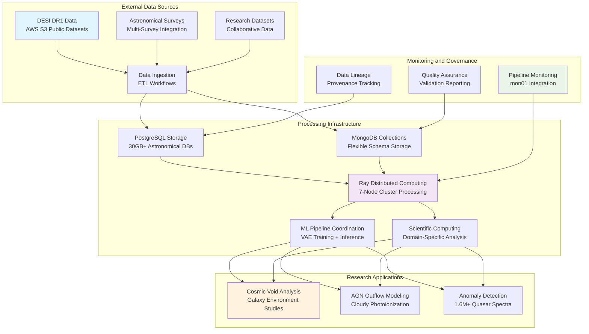

# 🔄 **Data Processing and Pipelines**

This category provides comprehensive documentation for data processing and pipeline infrastructure across the Proxmox Astronomy Lab's enterprise research computing platform. The documentation covers systematic approaches to astronomical data ingestion, ETL workflows, distributed processing pipelines, and specialized computational workflows supporting large-scale DESI analysis, machine learning training, and scientific data management. These implementations demonstrate enterprise-grade data processing patterns optimized for research computing environments with emphasis on reproducibility, scalability, and systematic data governance.

## **Overview**

Data Processing and Pipelines represent the sophisticated orchestration of scientific data workflows, systematic ETL operations, and distributed computational processing across the research computing infrastructure. The Proxmox Astronomy Lab implements enterprise-grade data processing systems centered on DESI spectroscopic data ingestion, PostgreSQL astronomical databases, Ray distributed computing frameworks, and specialized workflows supporting cosmic void analysis, AGN outflow modeling, and anomalous quasar detection. This implementation provides automated data ingestion, systematic ETL processing, distributed ML pipeline coordination, and comprehensive data validation procedures supporting reproducible scientific research and collaborative analysis workflows.

The data processing ecosystem operates as the computational backbone across the hybrid Kubernetes and VM architecture, providing seamless integration with external datasets, database systems, machine learning infrastructure, and research analysis workflows. These systems enable massive DESI dataset processing (30GB+ PostgreSQL implementations), distributed VAE training on 1.6M+ quasar spectra, automated spectral analysis pipelines with Cloudy photoionization modeling, and systematic data validation ensuring scientific accuracy and reproducibility across all research domains and computational workflows.

---

## **📁 Repository Structure**

```markdown
infrastructure/data-processing-and-pipelines/
├── README.md                                    # This category overview document
├── astronomical-data-ingestion/
│   ├── README.md                               # DESI and astronomical survey data ingestion
│   ├── desi-data-pipelines/                   # DESI DR1 data processing and ingestion workflows
│   ├── aws-s3-integration/                    # AWS S3 public dataset integration and processing
│   ├── survey-data-processing/                # Multi-survey astronomical data standardization
│   └── metadata-extraction/                   # Astronomical metadata processing and validation
├── etl-workflows/
│   ├── README.md                               # Extract, Transform, Load workflow coordination
│   ├── database-ingestion/                    # PostgreSQL and MongoDB data loading workflows
│   ├── data-transformation/                   # Scientific data transformation and standardization
│   ├── validation-pipelines/                  # Data quality validation and integrity checking
│   └── scheduling-automation/                 # ETL workflow scheduling and coordination
├── distributed-processing/
│   ├── README.md                               # Distributed computing and parallel processing
│   ├── ray-cluster-pipelines/                 # Ray distributed computing workflow coordination
│   ├── kubernetes-jobs/                       # Kubernetes-based batch processing and job management
│   ├── parallel-computing/                    # Multi-node parallel processing coordination
│   └── resource-optimization/                 # Distributed computing resource management
├── machine-learning-pipelines/
│   ├── README.md                               # ML data processing and training pipelines
│   ├── spectral-analysis-workflows/           # DESI spectral data processing for ML training
│   ├── feature-engineering/                   # Astronomical feature extraction and preprocessing
│   ├── model-training-pipelines/              # Distributed ML training workflow coordination
│   └── inference-pipelines/                   # Production ML inference and result processing
├── scientific-computing-workflows/
│   ├── README.md                               # Domain-specific scientific computing pipelines
│   ├── cosmic-void-analysis/                  # Galaxy environment classification and analysis
│   ├── agn-outflow-modeling/                  # Quasar outflow analysis with Cloudy integration
│   ├── anomaly-detection-workflows/           # Large-scale astronomical anomaly detection
│   └── statistical-analysis-pipelines/       # Statistical computing and significance testing
└── monitoring-and-governance/
    ├── README.md                               # Data pipeline monitoring and governance
    ├── pipeline-monitoring/                   # Comprehensive pipeline performance and status monitoring
    ├── data-lineage-tracking/                 # Systematic data provenance and lineage management
    ├── quality-assurance/                     # Data quality monitoring and validation reporting
    └── compliance-reporting/                  # Data governance and regulatory compliance
```

---

## **📂 Directory Overview**

This section provides comprehensive navigation to all data processing implementations and pipeline management procedures.

### **🔬 Astronomical Data Infrastructure**

| **Component** | **Purpose** | **Implementation** |
|---------------|-------------|-------------------|
| **[astronomical-data-ingestion/](astronomical-data-ingestion/)** | DESI and astronomical survey data ingestion | DESI DR1 processing, AWS S3 integration, survey standardization |
| **[etl-workflows/](etl-workflows/)** | Extract, Transform, Load workflow coordination | Database ingestion, transformation, validation, scheduling |

### **⚡ Distributed Processing Systems**

| **Component** | **Purpose** | **Implementation** |
|---------------|-------------|-------------------|
| **[distributed-processing/](distributed-processing/)** | Distributed computing and parallel processing | Ray clusters, Kubernetes jobs, resource optimization |
| **[machine-learning-pipelines/](machine-learning-pipelines/)** | ML data processing and training pipelines | Spectral workflows, feature engineering, training coordination |

### **🔬 Scientific Computing Applications**

| **Component** | **Purpose** | **Implementation** |
|---------------|-------------|-------------------|
| **[scientific-computing-workflows/](scientific-computing-workflows/)** | Domain-specific scientific computing pipelines | Cosmic void analysis, AGN modeling, anomaly detection |

### **📊 Monitoring and Governance**

| **Component** | **Purpose** | **Implementation** |
|---------------|-------------|-------------------|
| **[monitoring-and-governance/](monitoring-and-governance/)** | Data pipeline monitoring and governance | Performance monitoring, lineage tracking, quality assurance |

---

## **🏗️ Architecture & Design**

This section details the systematic architecture supporting enterprise-grade data processing and pipeline coordination across the research computing infrastructure.

### **Data Processing Architecture**

The data processing infrastructure implements comprehensive pipeline coordination with systematic integration across external data sources, distributed computing resources, database systems, and machine learning infrastructure supporting large-scale astronomical research applications.



### **DESI Data Processing Strategy**

The enterprise data processing platform provides systematic coordination for DESI spectroscopic data workflows supporting cosmic void analysis, AGN outflow studies, and anomalous quasar detection with scalable processing and validation capabilities.

| **Data Processing Domain** | **Dataset Scale** | **Processing Approach** | **Research Application** |
|---------------------------|------------------|------------------------|------------------------|
| **DESI Cosmic Void Analysis** | 30GB+ PostgreSQL database with void galaxy catalogs | Systematic ETL from DESI DR1 with environmental classification | Galaxy evolution studies in extreme large-scale environments |
| **AGN Outflow Energetics** | Spectroscopic datasets with semi-automated analysis | Cloudy photoionization modeling with parallel processing | Quasar outflow analysis and feedback mechanism studies |
| **Anomalous Quasar Detection** | 1.6M+ quasar spectra for ML anomaly detection | Ray distributed computing with VAE model training | Large-scale astronomical anomaly detection and rare object discovery |
| **Multi-Survey Integration** | Cross-survey astronomical data standardization | Systematic data harmonization and metadata extraction | Collaborative research and cross-survey scientific analysis |

### **Distributed Computing Integration**

The processing architecture implements comprehensive distributed computing coordination enabling scalable data processing across the 7-node cluster with systematic resource management and performance optimization.

| **Processing Scale** | **Infrastructure Approach** | **Resource Coordination** | **Scientific Benefit** |
|---------------------|----------------------------|-------------------------|----------------------|
| **Single-Node Processing** | High-performance VM processing for database operations | Local resource optimization with PostgreSQL tuning | Efficient database queries and single-node analysis workflows |
| **Multi-Node Coordination** | Ray cluster distributed processing across multiple nodes | Systematic task distribution and resource balancing | Large-scale data processing and parallel algorithm execution |
| **Kubernetes Jobs** | Container-based batch processing with RKE2 orchestration | Automated job scheduling and resource allocation | Scalable batch processing and workflow automation |
| **Hybrid Processing** | Integration between VM and container-based processing | Coordinated resource management across infrastructure types | Optimal resource utilization and workflow flexibility |

### **Machine Learning Pipeline Architecture**

Enterprise data processing implements specialized ML pipeline coordination ensuring systematic data preparation, distributed training, and comprehensive validation for astronomical machine learning applications.

| **ML Pipeline Stage** | **Processing Implementation** | **Data Management** | **Research Integration** |
|-----------------------|----------------------------|-------------------|----------------------|
| **Data Preprocessing** | Systematic spectral data normalization and feature extraction | High-performance data transformation with validation | Astronomical data preparation for ML model training |
| **Feature Engineering** | Domain-specific astronomical feature extraction and selection | Systematic feature validation and quality assessment | Scientific feature development for astronomical ML applications |
| **Distributed Training** | Ray cluster coordination for large-scale model training | Systematic data distribution and training coordination | Scalable ML training for massive astronomical datasets |
| **Model Validation** | Comprehensive model testing with astronomical domain validation | Systematic validation with scientific accuracy assessment | Research-grade model validation and scientific reproducibility |

---

## **⚙️ Management and Operations**

This section provides systematic approaches to managing data processing pipeline operations across enterprise research computing environments.

### **Pipeline Operations Lifecycle**

Enterprise data processing operations require systematic workflow management, performance monitoring, and systematic validation ensuring reliable data processing for research computing applications and scientific discovery workflows.

| **Operations Phase** | **Management Approach** | **Data Processing Considerations** |
|---------------------|------------------------|-----------------------------------|
| **Data Ingestion** | Automated data source monitoring with systematic ingestion workflows | External dataset integration with validation and quality assessment |
| **Processing Execution** | Distributed computing coordination with resource optimization | Multi-node processing with systematic performance monitoring |
| **Quality Validation** | Comprehensive data quality assessment with automated validation | Scientific accuracy validation and data integrity verification |
| **Results Management** | Systematic output management with research integration | Research workflow integration and collaborative access management |

### **Distributed Processing Coordination**

Production data processing systems implement comprehensive coordination across multiple processing domains ensuring optimal resource utilization while maintaining data quality and scientific accuracy requirements.

| **Processing Domain** | **Coordination Strategy** | **Resource Management** | **Research Computing Integration** |
|----------------------|-------------------------|------------------------|-----------------------------------|
| **ETL Workflows** | Systematic data transformation with quality validation | Database and storage resource coordination | Integration with PostgreSQL astronomical databases |
| **ML Pipeline Processing** | Distributed training coordination with Ray cluster management | GPU and compute resource optimization | Integration with ML training infrastructure and model deployment |
| **Scientific Computing** | Domain-specific workflow coordination with validation procedures | Computational resource allocation with performance monitoring | Integration with research projects and collaborative analysis |
| **Data Validation** | Systematic quality assessment with automated reporting | Validation resource coordination with compliance tracking | Integration with research governance and data quality standards |

### **Performance Optimization Strategy**

Enterprise data processing infrastructure implements systematic performance tuning ensuring optimal throughput, minimal latency, and efficient resource utilization for scientific computing and large-scale data analysis applications.

| **Optimization Category** | **Performance Strategy** | **Monitoring Integration** |
|---------------------------|-------------------------|---------------------------|
| **Data Transfer Optimization** | High-bandwidth network utilization with transfer optimization | Network performance monitoring with throughput tracking |
| **Database Performance** | PostgreSQL optimization with query performance tuning | Database performance monitoring with query analysis |
| **Distributed Computing** | Ray cluster optimization with task distribution efficiency | Distributed computing monitoring with resource utilization tracking |
| **Pipeline Efficiency** | Workflow optimization with bottleneck identification and resolution | Comprehensive pipeline monitoring with performance analytics |

---

## **🔒 Security & Compliance**

This section documents comprehensive security controls and compliance alignment for data processing infrastructure within research computing environments.

⚠️ DATA PROCESSING SECURITY DISCLAIMER

*The data processing and pipeline implementations provide enterprise-grade data handling for research computing requiring careful data governance, processing security, and systematic access control. Data processing systems may handle sensitive research data, collaborative datasets, and proprietary scientific information. All processing implementations follow enterprise security frameworks with specific attention to data protection during processing, systematic access control, and appropriate governance aligned with research computing security requirements and scientific collaboration policies.*

### **Data Processing Security Controls**

Enterprise-grade security implementation guided by research computing standards for data processing and pipeline systems. Security controls protect research data during processing, ensure systematic access control, and maintain comprehensive audit capabilities while enabling collaborative scientific computing and data analysis.

| **Security Control Category** | **Implementation** | **Research Protection** |
|------------------------------|-------------------|------------------------|
| **Data Protection During Processing** | Encrypted data processing with secure computational environments | Protection of sensitive astronomical data during analysis and transformation |
| **Access Control and Authentication** | Role-based access to data processing infrastructure and datasets | Controlled access to research data and processing capabilities |
| **Pipeline Security** | Secure workflow execution with systematic validation and monitoring | Protected data processing workflows with comprehensive audit capabilities |
| **Data Lineage and Provenance** | Systematic tracking of data processing history and transformations | Transparent data processing with comprehensive provenance documentation |

### **Research Computing Compliance**

Data processing implementations align with research computing standards ensuring proper data governance, scientific reproducibility, and appropriate usage policies for academic institutions and collaborative research environments.

| **Compliance Domain** | **Framework Alignment** | **Implementation Evidence** |
|----------------------|------------------------|---------------------------|
| **Data Governance** | Systematic data handling and processing governance with institutional policies | Comprehensive data lifecycle management and processing transparency |
| **Scientific Reproducibility** | Reproducible data processing with systematic documentation and validation | Version-controlled processing workflows with comprehensive documentation |
| **Collaborative Access** | Secure multi-user data access with appropriate controls and monitoring | Controlled collaborative access with systematic audit and governance |
| **Institutional Compliance** | University and research institution data processing frameworks | Alignment with institutional governance and research data policies |

---

## **🔗 Related Categories**

This section establishes systematic connections to other knowledge domains within the Proxmox Astronomy Lab ecosystem, demonstrating comprehensive integration across enterprise research computing infrastructure.

### **Infrastructure Integration**

| **Category** | **Relationship** | **Data Processing Integration** |
|--------------|------------------|--------------------------------|
| **[../databases/](../databases/)** | Database storage and query optimization | PostgreSQL and MongoDB integration for astronomical data storage |
| **[../k8s-rke2/](../k8s-rke2/)** | Kubernetes batch processing and job coordination | RKE2 deployment for container-based data processing workflows |
| **[../../ai-and-machine-learning/distributed-frameworks/](../../ai-and-machine-learning/distributed-frameworks/)** | Ray distributed computing coordination | Ray cluster integration for large-scale data processing and ML workflows |
| **[../storage/](../storage/)** | High-performance storage for data processing | NVMe storage optimization for data processing performance |

### **Research and Application Integration**

| **Category** | **Relationship** | **Data Processing Integration** |
|--------------|------------------|--------------------------------|
| **[../../projects/](../../projects/)** | Research project data processing workflows | DESI analysis pipelines and astronomical data processing |
| **[../../ai-and-machine-learning/training-pipelines/](../../ai-and-machine-learning/training-pipelines/)** | ML training data preparation | Systematic data preprocessing for astronomical ML training |
| **[../../publishing/](../../publishing/)** | Scientific publication data validation | Research data processing with publication-quality validation |
| **[../../reproducibility/](../../reproducibility/)** | Reproducible data processing workflows | Version-controlled processing with systematic reproducibility |

### **Monitoring and Governance Integration**

| **Category** | **Relationship** | **Data Processing Integration** |
|--------------|------------------|--------------------------------|
| **[../../monitoring/](../../monitoring/)** | Data processing monitoring and alerting | Comprehensive pipeline monitoring with performance tracking |
| **[../../security-assurance/](../../security-assurance/)** | Data processing security and compliance | Security controls for data processing and systematic governance |
| **[../backups/](../backups/)** | Data processing backup and recovery | Processing pipeline backup and data protection procedures |

---

## **🚀 Getting Started**

This section provides systematic guidance for implementing data processing and pipeline capabilities across different operational roles and research computing applications.

### **For Data Engineers**

**Data Ingestion:** [astronomical-data-ingestion/](astronomical-data-ingestion/)  
**ETL Workflows:** [etl-workflows/](etl-workflows/)  
**Distributed Processing:** [distributed-processing/](distributed-processing/)  
**Monitoring Integration:** [monitoring-and-governance/](monitoring-and-governance/)

### **For Research Computing Teams**

**Scientific Workflows:** [scientific-computing-workflows/](scientific-computing-workflows/)  
**ML Pipelines:** [machine-learning-pipelines/](machine-learning-pipelines/)  
**Quality Assurance:** [monitoring-and-governance/](monitoring-and-governance/)  
**Research Integration:** [scientific-computing-workflows/](scientific-computing-workflows/)

### **For Platform Administrators**

**Infrastructure Management:** [distributed-processing/](distributed-processing/)  
**Resource Coordination:** [distributed-processing/](distributed-processing/)  
**Monitoring and Governance:** [monitoring-and-governance/](monitoring-and-governance/)  
**Performance Optimization:** [distributed-processing/](distributed-processing/)

### **For Research Scientists**

**Data Access:** [astronomical-data-ingestion/](astronomical-data-ingestion/)  
**Analysis Workflows:** [scientific-computing-workflows/](scientific-computing-workflows/)  
**Research Pipelines:** [machine-learning-pipelines/](machine-learning-pipelines/)  
**Quality Validation:** [monitoring-and-governance/](monitoring-and-governance/)

---

## **Document Information**

| **Field** | **Value** |
|-----------|-----------|
| **Author** | VintageDon - <https://github.com/vintagedon> |
| **Created** | 2025-07-20 |
| **Last Updated** | 2025-07-20 |
| **Version** | 1.0 |

---
Tags: data-processing, astronomical-pipelines, desi-data-ingestion, ray-distributed-computing, etl-workflows, ml-pipelines, scientific-computing, enterprise-data
