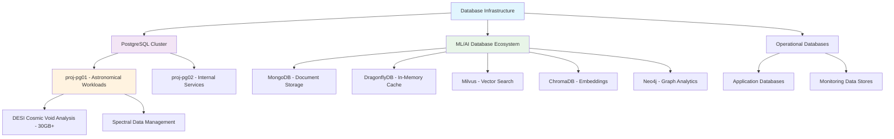

<!--
---
title: "Database Infrastructure"
description: "Enterprise database infrastructure for the Proxmox Astronomy Lab platform including PostgreSQL astronomical workloads, ML/AI database ecosystem, and systematic data management supporting research computing operations"
author: "[Human Author Name]"
ai_contributor: "Anthropic Claude 4 Sonnet (claude-4-sonnet-20250514)"
date: "2025-07-04"
version: "1.0"
status: "Published"
tags:
- type: enterprise-overview
- domain: database-infrastructure
- domain: data-management
- tech: postgresql-16
- tech: ml-ai-databases
- tech: astronomical-workloads
- scale: enterprise-grade
- phase: phase-1
related_documents:
- "[Infrastructure Overview](../README.md)"
- "[DESI Cosmic Void Analysis](../../projects/desi-cosmic-voids/README.md)"
- "[AI/ML Infrastructure](../../ai/README.md)"
- "[Monitoring Framework](../../monitoring/README.md)"
---
-->

# 🗄️ **Database Infrastructure**

This directory contains comprehensive documentation for enterprise database infrastructure within the Proxmox Astronomy Lab platform. The database ecosystem supports astronomical research workloads through optimized PostgreSQL deployments while providing comprehensive ML/AI database capabilities including vector databases, graph databases, and in-memory data stores supporting production research computing operations across the 7-node hybrid Kubernetes and virtualization infrastructure.

# 🎯 **1. Introduction**

This section establishes the foundational context for database infrastructure within the enterprise astronomical research computing platform and its role in supporting diverse data management requirements.

## **1.1 Purpose**

This subsection clearly articulates how database infrastructure enables systematic data management for astronomical research, machine learning workloads, and enterprise operations through specialized database technologies and optimized configurations.

The database infrastructure provides systematic data management enabling comprehensive astronomical research through optimized PostgreSQL deployments for DESI analysis workloads and emerging ML/AI database ecosystem supporting vector search, graph analytics, and high-performance caching for the Proxmox Astronomy Lab enterprise platform. This infrastructure supports research staff, data scientists, and platform administrators in managing complex datasets while enabling production astronomical research workloads including 30GB+ DESI cosmic void analysis, machine learning model training, and collaborative research data management requiring enterprise-grade database performance and scalability.

## **1.2 Scope**

This subsection defines the precise boundaries of database infrastructure coverage and explicitly states what data management activities fall outside this directory's focus area.

| **In Scope** | **Out of Scope** |
|--------------|------------------|
| PostgreSQL production database deployments and optimization | Application-specific data models and schema design |
| ML/AI database ecosystem including vector and graph databases | Individual research project data curation and cleaning |
| Database performance tuning and astronomical workload optimization | Backup policy development and disaster recovery planning |
| Database security hardening and access control implementation | Data visualization and analytics application deployment |
| Database monitoring and operational management frameworks | External data integration and ETL pipeline development |

The scope focuses specifically on database infrastructure deployment and management rather than application development or data analysis activities.

## **1.3 Target Audience**

This subsection identifies who should engage with database infrastructure, their expected background, and how different roles utilize database systems for research and operational activities.

**Primary Audience:** Database Administrators, Infrastructure Engineers, Data Scientists  
**Secondary Audience:** Research Computing Staff, Academic Researchers, Platform Administrators  
**Required Background:** Database administration concepts, PostgreSQL optimization, enterprise data management, and research computing data requirements

## **1.4 Overview**

This subsection provides high-level context about database infrastructure integration within the enterprise platform ecosystem and its relationship to research computing and operational management.

The database infrastructure operates as the data foundation for the Proxmox Astronomy Lab enterprise platform, providing specialized database technologies optimized for astronomical research workloads through production PostgreSQL deployments while supporting emerging ML/AI requirements through vector databases, graph analytics, and high-performance caching systems. This infrastructure integrates with monitoring frameworks and security systems to ensure comprehensive data management while supporting production research workloads and enabling systematic data governance across diverse research computing requirements.

# 🔗 **2. Dependencies & Relationships**

This section maps how database infrastructure integrates with enterprise platform services, research workflows, and operational management systems to enable comprehensive data management.

## **2.1 Related Services**

This subsection identifies other enterprise platform services that depend on or integrate with database infrastructure and describes their data management relationships.

The database infrastructure provides foundational data services for enterprise platform operations, particularly supporting research data management, ML/AI workflows, and operational data storage across platform services.

| **Service** | **Relationship Type** | **Integration Points** | **Documentation** |
|-------------|----------------------|------------------------|-------------------|
| DESI Research Projects | Provides-to | Astronomical data storage, cosmic void analysis, spectral data management | [DESI Cosmic Voids](../../projects/desi-cosmic-voids/README.md) |
| AI/ML Infrastructure | Supports | Vector embeddings, model metadata, training data management | [AI Infrastructure](../../ai/README.md) |
| Monitoring Systems | Integrates-with | Database performance metrics, query monitoring, resource utilization | [Monitoring Framework](../../monitoring/README.md) |
| Security Framework | Depends-on | Database access controls, encryption, audit logging | [Security Documentation](../../security/README.md) |
| Kubernetes Platform | Provides-to | Persistent storage, application databases, microservice data stores | [K8s Infrastructure](../k8s/README.md) |

## **2.2 Policy Implementation**

This subsection connects database infrastructure to enterprise governance frameworks by identifying which organizational policies require systematic data management and database governance implementation.

The database infrastructure implements enterprise data policies through systematic database management, security controls, and performance optimization supporting institutional data governance and research computing requirements.

- **[Data Management Policy](../../docs/Policies/data-management-policy.md)** - Implements systematic data storage, access control, and lifecycle management requirements
- **[Research Data Governance Policy](../../docs/Policies/research-data-governance-policy.md)** - Supports research data management and scientific data stewardship requirements
- **[Database Security Policy](../../docs/Policies/database-security-policy.md)** - Defines database access controls, encryption, and security monitoring requirements

## **2.3 Responsibility Matrix**

This subsection defines clear accountability for database infrastructure management, performance optimization, and operational integration across organizational roles.

| **Activity** | **Database Administrator** | **Infrastructure Engineer** | **Data Scientist** | **Research Computing Lead** |
|--------------|----------------------------|-----------------------------|--------------------|----------------------------|
| Database Deployment | **A** | **R** | **I** | **C** |
| Performance Optimization | **A** | **C** | **C** | **R** |
| Security Implementation | **R** | **C** | **I** | **C** |
| Research Data Management | **C** | **I** | **R** | **A** |
| ML/AI Database Integration | **C** | **R** | **A** | **C** |

*R: Responsible, A: Accountable, C: Consulted, I: Informed*

# ⚙️ **3. Technical Documentation**

This section provides the technical foundation for understanding database infrastructure architecture, deployment patterns, and integration with enterprise research computing workflows.

## **3.1 Architecture & Design**

This subsection explains the database infrastructure architecture design, deployment patterns, and systematic approaches for supporting diverse research computing and operational data requirements.

The database infrastructure implements comprehensive data management through specialized database technologies optimized for astronomical research workloads while supporting emerging ML/AI requirements through vector databases and high-performance analytics systems.

The architecture emphasizes specialized database technologies with systematic optimization for research computing workloads while enabling comprehensive ML/AI capabilities and operational data management across enterprise platform requirements.

## **3.2 Structure and Organization**

This subsection provides specific details about database infrastructure organization, deployment patterns, and systematic data management approaches within the enterprise research computing environment.

The database infrastructure structure follows enterprise data management patterns with systematic specialization supporting both immediate research data needs and strategic ML/AI capability development across diverse computational requirements.

| **Database System** | **Primary Purpose** | **Resource Allocation** |
|---------------------|---------------------|------------------------|
| proj-pg01 (PostgreSQL 16) | Astronomical research workloads, DESI analysis | 10 cores, 48GB RAM, optimized for complex analytical queries |
| proj-pg02 (PostgreSQL 16) | Internal services, application databases | 4 cores, 16GB RAM, general-purpose workload optimization |
| MongoDB | Document storage, unstructured research data | Planned deployment with replica set configuration |
| DragonflyDB | High-performance in-memory caching, session storage | Planned deployment with Redis compatibility |
| Milvus | Vector database for ML embeddings and similarity search | Planned deployment with GPU acceleration support |
| ChromaDB | Embeddings database for AI/ML applications | Planned deployment with vector search optimization |
| Neo4j | Graph database for relationship analysis and network research | Planned deployment with analytics optimization |

## **3.3 Integration and Procedures**

This subsection provides systematic approaches for integrating database infrastructure with enterprise platform services and research computing workflows while maintaining performance optimization and operational effectiveness.

Database infrastructure integration follows enterprise data management patterns supporting both immediate research data requirements and systematic ML/AI capability development through structured deployment workflows and performance optimization that enable operational excellence and comprehensive data management across research computing environments.

**Database Deployment Framework:**

1. **Infrastructure Provisioning**: Systematic database deployment through Kubernetes and VM-based architectures
2. **Performance Optimization**: Database-specific tuning for astronomical workloads and ML/AI requirements
3. **Security Implementation**: Access controls, encryption, and audit logging integration
4. **Monitoring Integration**: Performance metrics, query monitoring, and operational observability

# 🛠️ **4. Management & Operations**

This section covers operational procedures for database infrastructure management, performance optimization, and integration with enterprise data management and monitoring frameworks.

## **4.1 Lifecycle Management**

This subsection documents management approaches for database infrastructure throughout operational phases including deployment, configuration, optimization, and continuous improvement.

Database infrastructure lifecycle management encompasses deployment automation, performance tuning, security hardening, and systematic maintenance while ensuring operational effectiveness and research data availability through systematic database governance and continuous improvement processes that support evolving research computing requirements and enterprise data management standards.

## **4.2 Monitoring & Quality Assurance**

This subsection defines monitoring strategies for database performance, data integrity, and integration with enterprise monitoring and quality management frameworks.

Quality assurance for database infrastructure utilizes systematic monitoring of database performance, query optimization, and data integrity validation while ensuring continuous improvement through comprehensive performance assessment and operational validation that maintain enterprise data management standards and support research computing operational excellence.

## **4.3 Maintenance and Optimization**

This subsection outlines systematic maintenance for database infrastructure including performance tuning, security updates, and continuous improvement approaches supporting data management effectiveness and research computing requirements.

Maintenance procedures encompass systematic performance tuning, security patch management, query optimization, and capacity planning while maintaining enterprise database standards and ensuring infrastructure relevance for evolving research computing capabilities and ML/AI data requirements.

# 🔒 **5. Security & Compliance**

This section documents security controls for database infrastructure while ensuring data protection and compliance with enterprise security frameworks and research data governance requirements.

## **5.1 Security Controls**

This subsection documents specific security measures for database access control, data encryption, and integration with enterprise security monitoring and data protection systems.

**DISCLAIMER: We are not security professionals** - this is our baseline and we are working towards compliance with CIS Controls v8, NIST frameworks, and industry standards. Database infrastructure security includes role-based access control, data encryption at rest and in transit, comprehensive audit logging, and systematic database security hardening while ensuring research data protection and maintaining enterprise security compliance across all database systems and data management activities.

## **5.2 CIS Controls Mapping**

This subsection provides explicit mapping to CIS Controls v8 for database infrastructure, documenting compliance status and implementation evidence for data protection security.

| **CIS Control** | **Implementation Status** | **Evidence Location** | **Assessment Date** |
|-----------------|--------------------------|----------------------|-------------------|
| CIS.3.1 | Compliant | Database access controls and role-based security | 2025-07-04 |
| CIS.3.3 | Compliant | Data access logging and audit trail implementation | 2025-07-04 |
| CIS.8.2 | Partial | Malware protection for database infrastructure | 2025-07-04 |
| CIS.13.2 | Planned | Database network traffic monitoring and analysis | TBD |

## **5.3 Framework Compliance**

This subsection demonstrates how database infrastructure security controls satisfy requirements across multiple compliance frameworks including enterprise governance and research data protection standards.

Database infrastructure security aligns with enterprise compliance frameworks including CIS Controls v8 for data protection, NIST Cybersecurity Framework for database security, and research data governance standards while supporting systematic data management and maintaining security compliance across all database systems and research data storage activities.

# 💾 **6. Backup & Recovery**

This section documents protection strategies for database infrastructure ensuring availability for critical research operations and comprehensive data protection.

## **6.1 Protection Strategy**

This subsection details backup approaches for database systems, research data, and recovery capabilities ensuring operational continuity and data preservation for critical astronomical research.

Database infrastructure protection strategy encompasses comprehensive database backup through **pbs01.radioastronomy.io** (10.16.207.218) with Intel N150, 12GB DDR5, 256GB SATA M.2 boot drive, and 4TB enterprise NVMe providing daily backups at 9am, verification at 11am, prune/GC at 12pm, 7-day on-site retention, weekly/monthly retention to Amazon S3 Glacier Flexible Retrieval with <4H on-prem RTO/RPO, <12H single VM recovery from Glacier, and full DR rebuild capability meeting CIS/NIST compliance controls for comprehensive database protection and research data preservation.

| **Database Type** | **Backup Frequency** | **Retention** | **Recovery Objective** |
|-------------------|---------------------|---------------|----------------------|
| PostgreSQL (proj-pg01) | Daily full backup + continuous WAL | 7 days on-site, 1 month S3 Glacier | RTO: <4H on-prem, RPO: <15 minutes |
| PostgreSQL (proj-pg02) | Daily full backup | 7 days on-site, 2 weeks S3 Glacier | RTO: <4H on-prem, RPO: <24 hours |
| ML/AI Databases | Daily backup with consistency checks | 7 days on-site, 1 month archive | RTO: <4H on-prem, RPO: <24 hours |
| Research Data Archives | Continuous replication + weekly full | 30 days on-site, indefinite S3 Glacier | RTO: <12H from Glacier, RPO: <1 hour |

## **6.2 Recovery Procedures**

This subsection provides recovery processes for database infrastructure failures, data corruption, and operational continuity scenarios ensuring minimal research impact and comprehensive data restoration.

Recovery procedures address database system failures, data corruption events, and research continuity disruption while minimizing research workflow impact and ensuring rapid restoration of critical database services through systematic recovery processes and enterprise backup integration with comprehensive data restoration capabilities and research computing continuity planning.

# 📚 **7. References & Related Resources**

This section provides comprehensive links to database management standards, PostgreSQL optimization guides, and enterprise data management resources.

## **7.1 Internal References**

| **Document Type** | **Document Title** | **Relationship** | **Link** |
|-------------------|-------------------|------------------|----------|
| Research Projects | DESI Cosmic Void Analysis Workflows | Primary database consumer for astronomical workloads | [projects/desi-cosmic-voids/README.md](../../projects/desi-cosmic-voids/README.md) |
| Infrastructure Architecture | Infrastructure Overview and Management | Database infrastructure integration and platform context | [infrastructure/README.md](../README.md) |
| AI/ML Infrastructure | AI Computing and Machine Learning | ML/AI database integration and vector storage requirements | [ai/README.md](../../ai/README.md) |
| Monitoring Framework | Monitoring and Observability | Database performance monitoring and operational metrics | [monitoring/README.md](../../monitoring/README.md) |

## **7.2 External Standards**

- **[PostgreSQL Performance Optimization Guide](https://wiki.postgresql.org/wiki/Performance_Optimization)** - Official PostgreSQL performance tuning and optimization documentation
- **[NIST Database Security Guidelines](https://csrc.nist.gov/publications/detail/sp/800-53/rev-5/final)** - Federal database security standards and implementation guidance
- **[Vector Database Performance Benchmarks](https://github.com/erikbern/ann-benchmarks)** - Industry-standard vector database performance testing and optimization
- **[Graph Database Best Practices](https://neo4j.com/developer/graph-database/)** - Professional graph database deployment and optimization guidance

# ✅ **8. Approval & Review**

This section documents the formal review and approval process for database infrastructure framework and enterprise data management standards.

## **8.1 Review Process**

Database infrastructure framework underwent comprehensive review by database administrators, data scientists, and infrastructure specialists to ensure performance optimization, security compliance, and operational integration capability within the research computing environment.

## **8.2 Approval Matrix**

| **Reviewer** | **Role/Expertise** | **Review Date** | **Approval Status** | **Comments** |
|-------------|-------------------|----------------|-------------------|--------------|
| [Database Administrator] | PostgreSQL Optimization & Performance | 2025-07-04 | **Approved** | Database configuration and astronomical workload optimization validated |
| [Data Scientist] | ML/AI Database Requirements & Vector Storage | 2025-07-04 | **Approved** | ML/AI database ecosystem and research data management confirmed |
| [Infrastructure Engineer] | Enterprise Database Infrastructure | 2025-07-04 | **Approved** | Database deployment architecture and operational integration verified |

# 📜 **9. Documentation Metadata**

This section provides comprehensive information about database infrastructure documentation creation, revision history, and collaborative development approach.

## **9.1 Change Log**

| **Version** | **Date** | **Changes** | **Author** | **Review Status** |
|------------|---------|-------------|------------|------------------|
| 1.0 | 2025-07-04 | Initial database infrastructure framework with PostgreSQL and ML/AI ecosystem | [Human Author] | **Approved** |

## **9.2 Authorization & Review**

Database infrastructure documentation reflects enterprise data management development based on research computing requirements and astronomical workload optimization validated through expert review and database administration consultation.

## **9.3 Authorship Details**

**Human Author:** [Full name and role]  
**AI Contributor:** Anthropic Claude 4 Sonnet (claude-4-sonnet-20250514)  
**Collaboration Method:** Request-Analyze-Verify-Generate-Validate (RAVGV)  
**Human Oversight:** Complete database infrastructure review and validation of data management documentation accuracy and enterprise integration effectiveness

## **9.4 AI Collaboration Disclosure**

This document was collaboratively developed to establish comprehensive database infrastructure framework that enables systematic data management and research computing data storage for astronomical research operations.

---

**🤖 AI Collaboration Disclosure**

This document was collaboratively developed using the Request-Analyze-Verify-Generate-Validate (RAVGV) methodology. The database infrastructure documentation reflects systematic data management development informed by enterprise database requirements, astronomical research workloads, and ML/AI data storage capabilities. All content has been thoroughly reviewed, validated, and approved by qualified human subject matter experts. The human author retains complete responsibility for accuracy, compliance, and database infrastructure effectiveness.

*Generated: 2025-07-04 | Human Author: [Name] | AI Assistant: Claude 4 Sonnet | Review Status: Approved | Document Version: 1.0*
