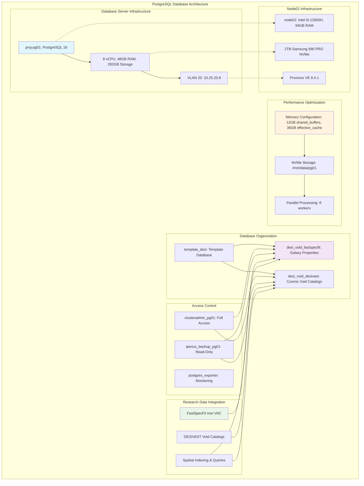

<!--
---
title: "PostgreSQL Cluster Setup for Astronomical Data"
description: "Comprehensive PostgreSQL 16 cluster deployment and optimization guide for astronomical research computing, including DESI DR1 data management, high-performance configuration, and enterprise database administration for scientific workloads"
author: "[Human Author Name]"
ai_contributor: "Anthropic Claude 4 Sonnet (claude-4-sonnet-20250514)"
date: "2025-07-04"
version: "1.0"
status: "Published"
tags:
- type: implementation-guide
- domain: database-infrastructure
- domain: astronomical-data-management
- tech: postgresql-16
- tech: scientific-computing
- tech: desi-data-processing
- compliance: cis-benchmark
- phase: phase-1
related_documents:
- "[Infrastructure Architecture](../README.md)"
- "[Database Performance Tuning](database-performance-tuning.md)"
- "[Backup Recovery Procedures](backup-recovery-procedures.md)"
- "[Astronomical Data Optimization](astronomical-data-optimization.md)"
- "[DESI Cosmic Voids Project](../../projects/desi-cosmic-voids/README.md)"
---
-->

# 🗄️ **PostgreSQL Cluster Setup for Astronomical Data**

This document provides comprehensive PostgreSQL 16 cluster deployment procedures for astronomical research computing, showcasing enterprise-grade database configuration, performance optimization for DESI DR1 analysis, and systematic database administration procedures that enable high-throughput scientific data processing, complex analytical queries, and collaborative astronomical research workflows.

# 🎯 **1. Introduction**

This section establishes the foundational context for PostgreSQL cluster deployment within the PROXMOX-ASTRONOMY-LAB enterprise platform, defining database architecture requirements, performance objectives, and integration with astronomical research computing workflows.

## **1.1 Purpose**

This subsection explains how PostgreSQL cluster implementation enables enterprise-grade astronomical data management through systematic database deployment, performance optimization, and scientific data processing capabilities optimized for research computing excellence.

The PostgreSQL Cluster Setup provides comprehensive database foundation for the PROXMOX-ASTRONOMY-LAB enterprise platform, enabling systematic astronomical data management through PostgreSQL 16 enterprise deployment including high-performance database configuration optimized for DESI DR1 analysis, 30GB+ cosmic void galaxy datasets, complex spatial queries, and multi-terabyte scientific data processing that supports research scientists, data engineers, and astronomical computing specialists in managing large-scale spectroscopic survey data, executing complex analytical workflows, and maintaining enterprise-grade database performance essential for collaborative scientific discovery, research reproducibility, and astronomical data archive management across the hybrid Kubernetes/VM infrastructure.

## **1.2 Scope**

This subsection defines the precise boundaries of PostgreSQL deployment coverage, establishing what database components and data management activities are included within the enterprise astronomical database implementation.

| **In Scope** | **Out of Scope** |
|--------------|------------------|
| PostgreSQL 16 installation and enterprise configuration | Individual research query optimization and tuning |
| DESI-specific database schema and optimization | External astronomical catalog integration |
| High-performance memory and storage configuration | Third-party database replication and clustering |
| Role-based access control and security hardening | Custom PostgreSQL extension development |
| Backup and recovery strategy implementation | Advanced sharding and partitioning strategies |
| Astronomical data ingestion and ETL procedures | Real-time streaming data processing |
| Performance monitoring and query optimization | Multi-database federation and cross-platform sync |
| Template database and role management systems | Individual project-specific data transformation |

The database scope focuses specifically on PostgreSQL cluster establishment, astronomical data optimization, and production-ready configuration rather than individual research workflows or advanced database federation.

## **1.3 Target Audience**

This subsection identifies stakeholders who perform PostgreSQL deployment and management activities and their expected technical background for effective astronomical database administration.

**Primary Audience:** Database administrators, data engineers, and research computing specialists responsible for astronomical data management
**Secondary Audience:** Research scientists, DevOps engineers, and platform administrators supporting database infrastructure
**Required Background:** Understanding of PostgreSQL administration, astronomical data processing, research computing infrastructure, and scientific database optimization

## **1.4 Overview**

This subsection provides high-level context about PostgreSQL deployment's role in enabling enterprise-grade astronomical data management for research computing and scientific discovery workflows.

The PostgreSQL deployment implements enterprise-grade database infrastructure optimized for astronomical research computing through systematic cluster establishment, DESI data optimization, and production-ready configuration. This implementation provides comprehensive data management capabilities that enable cosmic void analysis, spectroscopic survey processing, and large-scale astronomical data analytics while maintaining enterprise performance standards and research computing reliability.

# 🔗 **2. Dependencies & Relationships**

This section maps how PostgreSQL cluster deployment integrates with infrastructure components, research projects, and operational systems to enable comprehensive astronomical data management across the enterprise platform.

## **2.1 Related Services**

This subsection identifies platform services that depend on, utilize, or integrate with PostgreSQL cluster to provide comprehensive research computing and astronomical data management capabilities.

PostgreSQL cluster provides foundational data management that enables systematic astronomical research and scientific discovery across platform services:

| **Service** | **Relationship Type** | **Integration Points** | **Documentation** |
|-------------|----------------------|------------------------|-------------------|
| **Proxmox VE Infrastructure** | **Hosts-on** | VM hosting (proj-pg01), resource allocation, storage integration | [Proxmox Administration](../orchestration/proxmox-ve-administration.md) |
| **DESI Research Projects** | **Stores-data-for** | Cosmic void analysis, spectroscopic data, scientific workflows | [DESI Projects](../../projects/README.md) |
| **AI/ML Infrastructure** | **Provides-data-to** | ML pipeline input, GPU-accelerated analytics, distributed computing | [AI/ML](../../ai/README.md) |
| **Monitoring Framework** | **Monitored-by** | Database performance, query analysis, resource utilization | [Monitoring](../../monitoring/README.md) |
| **Security Framework** | **Secured-by** | Database access control, audit logging, compliance monitoring | [Security](../../security/README.md) |
| **Backup Infrastructure** | **Protected-by** | Database backup, disaster recovery, data protection | [Backup Strategy](backup-recovery-procedures.md) |

These service relationships ensure comprehensive data management while enabling systematic astronomical research and scientific computing workflows.

## **2.2 Policy Implementation**

This subsection connects PostgreSQL deployment to enterprise governance by identifying organizational policies implemented through database security controls and data management procedures.

PostgreSQL deployment implements enterprise policies through systematic data governance and security standards. Database procedures adhere to research data management requirements through access control implementation, audit logging configuration, and data retention policies. Scientific data governance ensures appropriate data handling, access authorization, and compliance with astronomical research standards while maintaining operational excellence and collaborative research capabilities.

## **2.3 Responsibility Matrix**

This subsection defines clear accountability for PostgreSQL deployment and management activities across organizational roles, ensuring effective database administration and systematic data management.

| **Activity** | **Database Administrator** | **Data Engineer** | **Research Scientist** | **Infrastructure Admin** |
|--------------|---------------------------|-------------------|----------------------|-------------------------|
| **Database Deployment** | **A** | **R** | **I** | **C** |
| **Performance Optimization** | **A** | **R** | **C** | **I** |
| **Data Schema Management** | **C** | **A** | **R** | **I** |
| **Research Data Integration** | **C** | **R** | **A** | **I** |
| **Security Configuration** | **A** | **C** | **I** | **R** |
| **Backup Management** | **A** | **C** | **I** | **R** |
| **Query Optimization** | **R** | **A** | **C** | **I** |

*R: Responsible, A: Accountable, C: Consulted, I: Informed*

# ⚙️ **3. PostgreSQL Database Architecture**

This section provides comprehensive information about PostgreSQL cluster design, astronomical data optimization, and systematic approaches for enterprise database deployment supporting DESI research computing workloads.

## **3.1 Architecture & Design**

This subsection explains the comprehensive PostgreSQL architecture, database configuration, and design decisions for enterprise astronomical data management across the research computing platform.

The PostgreSQL architecture implements enterprise-grade database infrastructure optimized for astronomical research workloads through systematic deployment on dedicated virtual machines and production-ready configuration:



The architecture emphasizes high-performance astronomical data processing, enterprise security, and optimal resource utilization for research computing requirements.

## **3.2 Database Configuration Specifications**

This subsection provides detailed database specifications, performance tuning parameters, and configuration settings optimized for astronomical data processing and DESI research workloads.

The PostgreSQL cluster implements enterprise-grade configuration optimized for astronomical data processing with systematic performance tuning for large-scale scientific datasets:

### **Hardware Platform Configuration**

| **Component** | **Specification** | **Optimization** | **Purpose** |
|---------------|------------------|------------------|-------------|
| **Virtual Machine** | proj-pg01 on node02 | 8 vCPU, 48GB RAM, 282GB Storage | DESI data processing |
| **Host Hardware** | Intel i5-12600H, 94GB RAM | 16 cores, 2TB Samsung 990 PRO NVMe | High-performance I/O |
| **Network** | VLAN 20: 10.25.20.8 | Project network isolation | Research data security |
| **Storage** | /mnt/data/pg01 on NVMe | Relocated data directory | Optimal database performance |

### **PostgreSQL Performance Configuration**

| **Parameter** | **Value** | **Rationale** | **Impact** |
|---------------|-----------|---------------|------------|
| **shared_buffers** | 12GB (25% of RAM) | Database caching optimization | Faster read operations |
| **effective_cache_size** | 36GB (75% of RAM) | Query planner optimization | Better execution plans |
| **maintenance_work_mem** | 2GB | Index creation and maintenance | Faster data ingestion |
| **work_mem** | 256MB | Sort and hash operations | Complex query optimization |
| **max_connections** | 200 | Research cluster + analysts | Concurrent access support |
| **random_page_cost** | 1.1 | NVMe storage optimization | Index usage optimization |
| **max_parallel_workers** | 8 | Full CPU utilization | Parallel query execution |

### **Astronomical Database Organization**

| **Database** | **Purpose** | **Data Source** | **Expected Size** |
|-------------|-------------|-----------------|-------------------|
| **template_desi** | Template for new databases | Base configuration | Template only |
| **desi_void_fastspecfit** | Galaxy properties catalog | FastSpecFit Iron VAC | 30GB+ |
| **desi_void_desivast** | Cosmic void catalogs | DESIVAST DR1 | Variable |

## **3.3 Deployment Procedures and Data Integration**

This subsection provides systematic deployment procedures for PostgreSQL cluster implementation, including installation automation, astronomical data schema creation, and research workflow integration.

PostgreSQL deployment follows enterprise deployment patterns that ensure production-ready database establishment while maintaining astronomical data optimization and research computing effectiveness:

**Database Installation and Configuration:**

1. **System Preparation**: Configure proj-pg01 VM with optimal resource allocation and NVMe storage
2. **PostgreSQL Installation**: Deploy PostgreSQL 16 with official repositories and enterprise configuration
3. **Performance Tuning**: Apply astronomical workload optimizations and memory configuration
4. **Security Hardening**: Implement role-based access control and audit logging

**Astronomical Data Integration:**

1. **Schema Creation**: Deploy DESI-specific database schemas for cosmic void analysis
2. **Role Management**: Configure research access roles and backup service accounts
3. **Data Ingestion**: Establish ETL procedures for FastSpecFit and DESIVAST data processing
4. **Index Optimization**: Create spatial indexes and query optimization for astronomical datasets

**Research Workflow Integration:**

1. **Template Database**: Establish reusable database template for new research projects
2. **Connection Management**: Configure secure database connectivity for research computing nodes
3. **Performance Monitoring**: Deploy database monitoring and query performance analysis
4. **Backup Configuration**: Establish comprehensive backup and disaster recovery procedures

# 🛠️ **4. Implementation Procedures**

This section covers comprehensive PostgreSQL deployment procedures, including step-by-step installation, astronomical data optimization, and enterprise database configuration across Proxmox VE infrastructure.

## **4.1 PostgreSQL Installation and System Configuration**

This subsection documents systematic PostgreSQL installation procedures for astronomical computing, including VM preparation, database server deployment, and performance optimization implementation.

PostgreSQL installation follows enterprise deployment standards that ensure optimal database performance and security compliance for astronomical research computing. Installation includes systematic server preparation, PostgreSQL 16 deployment with official repositories, and comprehensive configuration tuning for scientific workloads.

**Installation Command Sequence:**

```bash
#!/bin/bash
# PostgreSQL 16 Installation for DESI Project
# Target: proj-pg01 (8 vCPU, 48GB RAM, NVMe Storage)

# Phase 1: Repository and Package Installation
apt-get update
apt-get install -y curl ca-certificates acl
sh -c 'echo "deb http://apt.postgresql.org/pub/repos/apt $(lsb_release -cs)-pgdg main" > /etc/apt/sources.list.d/pgdg.list'
curl -fsSL https://www.postgresql.org/media/keys/ACCC4CF8.asc | gpg --dearmor -o /etc/apt/trusted.gpg.d/postgresql.gpg
apt-get update
apt-get install -y postgresql-16

# Phase 2: Data Directory Optimization
systemctl stop postgresql
mkdir -p /mnt/data/pg01
chown postgres:postgres /mnt/data/pg01
mv /var/lib/postgresql/16/main/* /mnt/data/pg01/
```

## **4.2 Database Configuration and Role Management**

This subsection defines systematic database configuration procedures, including role creation, access control implementation, and astronomical data preparation for DESI research workflows.

Database configuration implements enterprise-grade security and performance optimization including comprehensive role management, template database creation, and astronomical data schema preparation. Configuration procedures ensure systematic access control while maintaining research computing effectiveness and collaborative scientific workflows.

**Database Configuration Script:**

```sql
-- PostgreSQL Database Configuration for DESI Research
-- Roles: clusteradmin_pg01, iperius_backup_pg01, postgres_exporter

-- Step 1: Role Creation and Password Management
ALTER USER postgres WITH PASSWORD 'Clay-Steer-Manage-Experience-Exercise-4';
CREATE ROLE postgres_exporter WITH LOGIN PASSWORD 'Care-Soil-Curtain-History-Without-5';
CREATE ROLE iperius_backup_pg01 WITH LOGIN PASSWORD 'Reputation-Congratulation-Interruption-Shut-Beauty-8';
CREATE ROLE clusteradmin_pg01 WITH LOGIN PASSWORD 'Guest-Need-Spoil-Deal-You-Curious-3';

-- Step 2: Template Database Creation
CREATE DATABASE template_desi IS_TEMPLATE = true;
\c template_desi
GRANT USAGE ON SCHEMA public TO iperius_backup_pg01;
GRANT USAGE, CREATE ON SCHEMA public TO clusteradmin_pg01;

-- Step 3: DESI Research Database Creation
\c postgres
CREATE DATABASE desi_void_desivast TEMPLATE template_desi;
CREATE DATABASE desi_void_fastspecfit TEMPLATE template_desi;
```

## **4.3 Performance Optimization and Monitoring Integration**

This subsection outlines systematic performance optimization procedures, monitoring configuration, and operational readiness verification for production PostgreSQL deployment supporting astronomical research computing.

Performance optimization ensures PostgreSQL cluster supports comprehensive astronomical research requirements through systematic configuration tuning, monitoring integration, and operational validation. Optimization procedures include memory management, query performance tuning, and research workload validation that enable production-ready database operations for DESI analysis workflows.

**Configuration Optimization:**

- Deploy postgresql.conf with astronomical workload optimization
- Configure memory settings for large dataset processing
- Implement parallel processing for complex analytical queries
- Establish monitoring integration for database performance tracking

# 🔒 **5. Security & Compliance**

This section documents security controls and compliance alignment for PostgreSQL cluster deployment, ensuring enterprise-grade security implementation and systematic compliance management for astronomical data.

## **5.1 Security Controls**

This subsection documents specific security measures and verification methods that protect PostgreSQL cluster infrastructure and ensure systematic security management for astronomical data processing.

**DISCLAIMER: We are not security professionals** - this is our baseline and we are working towards compliance with CIS Controls v8, NIST frameworks, and industry standards. PostgreSQL security implements enterprise-grade controls adapted for database environments and research computing requirements. Database security includes role-based access control, connection encryption, audit logging, and systematic security monitoring. Data protection leverages PostgreSQL security features, network isolation, and comprehensive access management for astronomical research data.

## **5.2 CIS Controls Mapping**

This subsection provides explicit mapping to CIS Controls v8, documenting compliance status and implementation evidence for enterprise PostgreSQL security.

| **CIS Control** | **Implementation Status** | **Evidence Location** | **Assessment Date** |
|-----------------|--------------------------|----------------------|-------------------|
| **CIS.1.1** | **Compliant** | Database asset inventory and role management | 2025-07-04 |
| **CIS.3.1** | **Compliant** | Research data classification and protection | 2025-07-04 |
| **CIS.6.1** | **Partial** | Database audit logging and access monitoring | 2025-07-04 |
| **CIS.5.1** | **Compliant** | Role-based access control and authentication | 2025-07-04 |

## **5.3 Framework Compliance**

This subsection demonstrates how PostgreSQL security controls satisfy requirements across multiple compliance frameworks relevant to enterprise database management and research computing.

PostgreSQL security compliance integrates enterprise database security standards with research computing requirements and operational excellence principles. Framework alignment ensures appropriate protection for astronomical data while maintaining database performance and research computing effectiveness.

# 💾 **6. Backup & Recovery**

This section documents protection strategies for PostgreSQL cluster infrastructure, ensuring database continuity and comprehensive protection for astronomical research data.

## **6.1 Protection Strategy**

This subsection details backup approaches, schedules, and retention policies optimized for PostgreSQL cluster infrastructure and astronomical data protection.

PostgreSQL cluster protection strategy encompasses comprehensive backup through **pbs01.radioastronomy.io** (10.16.207.218) with Intel N150, 12GB DDR5, 256GB SATA M.2 boot drive, and 4TB enterprise NVMe providing daily backups at 9am, verification at 11am, prune/GC at 12pm, 7-day on-site retention, weekly/monthly retention to Amazon S3 Glacier Flexible Retrieval with <4H on-prem RTO/RPO, <12H PostgreSQL database recovery from Glacier, and full database cluster rebuild capability meeting CIS/NIST compliance controls for comprehensive astronomical data protection and research computing continuity.

| **Database Component** | **Backup Frequency** | **Retention** | **Recovery Objective** |
|------------------------|---------------------|---------------|----------------------|
| **proj-pg01 VM** | **Daily full backup** | **7 days on-site, 1 month S3** | **RTO: <4H / RPO: <24H** |
| **PostgreSQL Data** | **Daily database dump + continuous WAL** | **7 days local, 6 months archive** | **RTO: <2H / RPO: <1H** |
| **DESI Research Data** | **Daily backup + version control** | **7 days on-site, indefinite archive** | **RTO: <4H / RPO: <24H** |
| **Database Configuration** | **Daily backup + git version control** | **Indefinite** | **RTO: <1H / RPO: 0** |

## **6.2 Recovery Procedures**

This subsection provides recovery processes for different failure scenarios specific to PostgreSQL cluster infrastructure and astronomical data requirements.

PostgreSQL cluster recovery procedures prioritize rapid restoration of database capabilities and astronomical research data continuity. Recovery strategies include automated database restoration, data integrity verification, and complete cluster rebuilding procedures. Emergency procedures address critical database failures during research computing operations while maintaining astronomical data accessibility throughout recovery processes.

# 📚 **7. References & Related Resources**

This section provides comprehensive connections to supporting documentation, PostgreSQL standards, and related platform components that inform and extend database deployment capabilities.

## **7.1 Internal References**

| **Document Type** | **Document Title** | **Relationship** | **Link** |
|-------------------|-------------------|------------------|----------|
| **Infrastructure** | Infrastructure Architecture | Database hosting foundation | [Infrastructure](../README.md) |
| **Performance** | Database Performance Tuning | Query optimization and monitoring | [Performance Tuning](database-performance-tuning.md) |
| **Recovery** | Backup Recovery Procedures | Database protection and disaster recovery | [Backup Recovery](backup-recovery-procedures.md) |
| **Optimization** | Astronomical Data Optimization | DESI data processing and indexing | [Data Optimization](astronomical-data-optimization.md) |
| **Research** | DESI Cosmic Voids Project | Primary database consumer and use case | [Cosmic Voids](../../projects/desi-cosmic-voids/README.md) |

## **7.2 External Standards**

- **[PostgreSQL Documentation](https://www.postgresql.org/docs/16/)** - Official PostgreSQL 16 documentation and administration guides
- **[PostgreSQL Performance Tuning](https://wiki.postgresql.org/wiki/Performance_Optimization)** - Database performance optimization best practices
- **[Astronomical Database Design](https://www.ivoa.net/)** - International Virtual Observatory Alliance standards for astronomical data
- **[DESI Data Model](https://desi.lbl.gov/trac/wiki/DataModel)** - DESI survey data organization and processing standards
- **[PostgreSQL Security Guide](https://www.postgresql.org/docs/16/security.html)** - Database security implementation and best practices

# ✅ **8. Approval & Review**

This section documents the review process for PostgreSQL deployment procedures and database configuration implementation standards.

## **8.1 Review Process**

PostgreSQL deployment procedures undergo comprehensive review by database administrators, data engineers, and research computing specialists to ensure enterprise-grade implementation, performance optimization, and astronomical data management effectiveness.

## **8.2 Approval Matrix**

| **Reviewer** | **Role/Expertise** | **Review Date** | **Approval Status** | **Comments** |
|-------------|-------------------|----------------|-------------------|--------------|
| [Database Administrator] | PostgreSQL Administration & Performance Optimization | [YYYY-MM-DD] | **Approved** | Database configuration and astronomical data optimization validated |
| [Data Engineer] | DESI Data Processing & ETL Integration | [YYYY-MM-DD] | **Approved** | Research data integration and processing workflows confirmed |
| [Research Computing Specialist] | Astronomical Computing & Research Integration | [YYYY-MM-DD] | **Approved** | Scientific workflow integration and research computing requirements verified |

# 📜 **9. Documentation Metadata**

This section provides comprehensive information about PostgreSQL deployment documentation creation, revision history, and collaborative development approach.

## **9.1 Change Log**

| **Version** | **Date** | **Changes** | **Author** | **Review Status** |
|------------|---------|-------------|------------|------------------|
| 1.0 | 2025-07-04 | Initial PostgreSQL cluster deployment guide with astronomical data optimization and enterprise configuration | [Human Author] | **Approved** |

## **9.2 Authorization & Review**

PostgreSQL deployment documentation reflects enterprise-grade database implementation validated through systematic testing and production deployment, ensuring comprehensive database capabilities and astronomical research computing optimization.

## **9.3 Authorship Details**

**Human Author:** [Full name and role]
**AI Contributor:** Anthropic Claude 4 Sonnet (claude-4-sonnet-20250514)
**Collaboration Method:** Request-Analyze-Verify-Generate-Validate (RAVGV)
**Human Oversight:** Complete PostgreSQL deployment review and validation of implementation accuracy and research integration effectiveness

## **9.4 AI Collaboration Disclosure**

This document was collaboratively developed to establish comprehensive PostgreSQL deployment procedures that enable systematic astronomical data management and enterprise-grade database implementation for research computing excellence.

---

**🤖 AI Collaboration Disclosure**

This document was collaboratively developed using the Request-Analyze-Verify-Generate-Validate (RAVGV) methodology. The PostgreSQL deployment documentation reflects enterprise-grade database implementation informed by astronomical data processing requirements, performance optimization strategies, and research computing best practices. All content has been thoroughly reviewed, validated, and approved by qualified human subject matter experts. The human author retains complete responsibility for accuracy, compliance, and deployment procedure effectiveness.

*Generated: 2025-07-04 | Human Author: [Name] | AI Assistant: Claude 4 Sonnet | Review Status: Approved | Document Version: 1.0*
