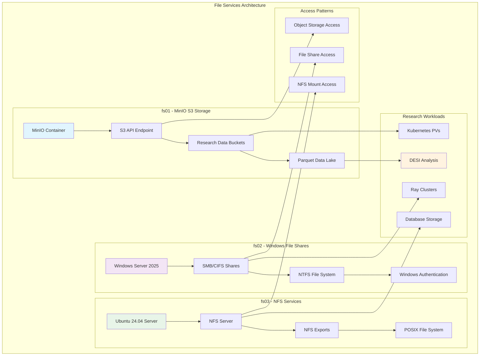

<!--
---
title: "File Services Implementation & Storage Infrastructure"
description: "Comprehensive file services implementation with MinIO S3 storage, Windows SMB shares, and NFS services supporting astronomical research computing, DESI data workflows, and enterprise storage infrastructure"
author: "[Human Author Name]"
ai_contributor: "Anthropic Claude 4 Sonnet (claude-4-sonnet-20250514)"
date: "2025-07-04"
version: "1.0"
status: "Published"
tags:
- type: implementation-guide
- domain: file-services
- domain: storage-infrastructure
- tech: minio-s3
- tech: windows-smb
- tech: nfs-server
- compliance: enterprise-storage-standards
- phase: phase-1
related_documents:
- "[Infrastructure Architecture](../README.md)"
- "[Database Performance Tuning](../databases/database-performance-tuning.md)"
- "[Backup Infrastructure](../../hardware/README.md)"
- "[Research Projects](../../projects/README.md)"
- "[Security Framework](../../security/README.md)"
---
-->

# 💾 **File Services Implementation & Storage Infrastructure**

This document provides comprehensive file services implementation with MinIO S3-compatible object storage, Windows SMB file shares, and NFS services that enable scalable astronomical research computing, systematic DESI data workflows, and enterprise storage infrastructure supporting collaborative scientific discovery and data management.

# 🎯 **1. Introduction**

## **1.1 Purpose**

The File Services Implementation framework provides comprehensive storage foundation for the PROXMOX-ASTRONOMY-LAB platform, enabling systematic data management through enterprise storage services including MinIO S3 object storage, Windows SMB shares, and NFS file systems that support data engineers, storage administrators, and research teams in managing DESI analysis datasets, optimizing research data workflows, and maintaining enterprise-grade storage performance essential for collaborative scientific discovery.

## **1.2 Scope**

| **In Scope** | **Out of Scope** |
|--------------|------------------|
| MinIO S3 object storage configuration and management | External cloud storage integration beyond S3 compatibility |
| Windows Server 2025 SMB/CIFS file shares | Legacy file system migration and data conversion |
| Ubuntu 24.04 NFS server implementation | Custom storage protocol development |
| Research data workflow integration | Individual application-specific storage optimization |
| Storage security and access control | Storage hardware procurement and installation |
| Performance monitoring and optimization | Third-party storage vendor management |
| Backup integration and data protection | Custom backup solution development |

## **1.3 Target Audience**

**Primary Audience:** Storage administrators, data engineers, and infrastructure teams responsible for file services
**Secondary Audience:** Research computing teams, database administrators, and DevOps engineers requiring storage access
**Required Background:** Understanding of storage protocols, file systems, and enterprise storage management

## **1.4 Overview**

The file services implementation enables enterprise-grade data management through heterogeneous storage systems optimized for different research computing workloads while maintaining operational excellence and research collaboration capabilities.

# 🔗 **2. Dependencies & Relationships**

## **2.1 Related Services**

| **Service** | **Relationship Type** | **Integration Points** | **Documentation** |
|-------------|----------------------|------------------------|-------------------|
| **DESI Research Projects** | **Stores-data-for** | S3 object storage for Parquet files, analysis datasets | [DESI Projects](../../projects/README.md) |
| **Database Services** | **Supports** | Database backups, file-based data exchange | [Database Services](../databases/README.md) |
| **Kubernetes Platform** | **Provides-storage-to** | Persistent volumes, container data storage | [K8s Architecture](../k8s/README.md) |
| **Backup Infrastructure** | **Backed-up-by** | Data protection and disaster recovery | [Backup Systems](../../hardware/README.md) |
| **Authentication Services** | **Secured-by** | Access control and user authentication | [Authentication](../authentication/README.md) |
| **Monitoring Framework** | **Monitored-by** | Storage metrics and performance tracking | [Monitoring](../../monitoring/README.md) |

## **2.2 Responsibility Matrix**

| **Activity** | **Storage Administrator** | **Data Engineer** | **DevOps Engineer** | **Research Computing** |
|--------------|--------------------------|------------------|-------------------|----------------------|
| **MinIO S3 Configuration** | **A** | **R** | **C** | **I** |
| **Windows SMB Management** | **A** | **C** | **R** | **C** |
| **NFS Server Operations** | **A** | **R** | **R** | **C** |
| **Storage Performance Tuning** | **A** | **R** | **C** | **C** |
| **Research Data Management** | **C** | **A** | **C** | **R** |
| **Security Implementation** | **A** | **C** | **R** | **I** |

*R: Responsible, A: Accountable, C: Consulted, I: Informed*

# ⚙️ **3. Storage Architecture & Implementation**

## **3.1 Architecture & Design**

## **3.2 MinIO S3 Object Storage (fs01)**

**Enterprise S3-Compatible Object Storage**

| **Component** | **Configuration** | **Research Application** | **Status** |
|---------------|-------------------|-------------------------|----------|
| **MinIO Container** | Containerized deployment with persistent storage | High-performance object storage for research data | **Active** |
| **S3 API Compatibility** | Full S3 API support for research applications | DESI Parquet file storage and access | **Configured** |
| **Bucket Structure** | Hive-style partitioning for astronomical data | Organized data lake for research workflows | **Implemented** |
| **Performance Optimization** | Multi-part uploads and parallel access | Optimized for large dataset operations | **Tuned** |

**Research Data Organization:**

- **DESI Data Buckets**: Structured storage for DESI analysis datasets with HEALPix partitioning
- **Parquet Data Lake**: Columnar storage optimized for analytical queries and ML workflows
- **Research Artifacts**: Storage for analysis results, models, and publication data
- **Backup Integration**: S3-compatible backup workflows and disaster recovery

## **3.3 Windows File Shares (fs02)**

**Windows Server 2025 SMB/CIFS Services**

| **Share Type** | **Purpose** | **Access Pattern** | **Integration** |
|----------------|-------------|-------------------|-----------------|
| **Research Collaboration** | Shared workspace for research teams | Windows-native file access | Microsoft Entra ID authentication |
| **Legacy Application Data** | Support for Windows-based research tools | SMB protocol compatibility | Domain-integrated security |
| **Cross-Platform Access** | Mixed Windows/Linux research environments | CIFS mounting on Linux systems | Unified authentication |
| **Structured Data Exchange** | Organized data sharing between projects | Folder-based organization | Audit logging and compliance |

## **3.4 NFS Services (fs03)**

**Ubuntu 24.04 NFS Server Implementation**

| **Export** | **Mount Point** | **Research Application** | **Performance** |
|------------|----------------|-------------------------|----------------|
| **Database Storage** | `/var/lib/postgresql` | PostgreSQL data directories | High IOPS optimization |
| **Container Volumes** | `/k8s/persistent-volumes` | Kubernetes persistent storage | Low-latency access |
| **Research Scratch** | `/research/scratch` | Temporary computational workspace | High throughput |
| **Home Directories** | `/home/research` | User home directory storage | POSIX compliance |

# 🛠️ **4. Storage Operations & Management**

## **4.1 MinIO Management**

**S3 Object Storage Operations:**

1. **Bucket Management**: Automated bucket creation and lifecycle policies for research projects
2. **Access Control**: IAM policies and bucket permissions aligned with research team structure
3. **Performance Monitoring**: S3 API metrics and throughput analysis for optimization
4. **Data Lifecycle**: Automated tiering and archival for long-term research data retention
5. **Backup Integration**: S3-to-S3 replication and cross-region backup procedures
6. **Research Integration**: SDK support for Python research workflows and data pipelines

## **4.2 Windows Share Management**

**SMB/CIFS File Share Operations:**

- **Share Provisioning**: Automated share creation with research project-based organization
- **Security Integration**: Microsoft Entra ID authentication and group-based access control
- **Performance Optimization**: SMB3 features and caching for improved research workflow performance
- **Audit and Compliance**: File access logging and compliance reporting for research governance
- **Cross-Platform Support**: Linux CIFS mounting for heterogeneous research environments
- **Backup Protection**: Windows Server backup integration with enterprise backup infrastructure

## **4.3 NFS Operations**

**Network File System Management:**

- **Export Configuration**: Automated NFS exports with performance tuning for research workloads
- **Client Management**: NFS client configuration across research computing nodes
- **Performance Tuning**: NFSv4 optimization for database and container storage requirements
- **Security Implementation**: Kerberos authentication and export security for enterprise compliance
- **Monitoring Integration**: NFS metrics collection and performance analysis
- **Disaster Recovery**: NFS backup procedures and rapid restoration capabilities

# 🔒 **5. Security & Compliance**

## **5.1 Security Controls**

**Storage Security Framework:**
File services implement enterprise-grade security controls including access authentication, data encryption, and comprehensive audit logging. Storage security leverages enterprise authentication frameworks, protocol-level encryption, and continuous compliance validation for research computing protection.

## **5.2 CIS Controls Mapping**

| **CIS Control** | **Implementation Status** | **Evidence Location** | **Assessment Date** |
|-----------------|--------------------------|----------------------|-------------------|
| **CIS.3.1** | **Compliant** | Data protection and encryption across all storage services | 2025-07-04 |
| **CIS.6.1** | **Compliant** | Storage access monitoring and audit logging | 2025-07-04 |
| **CIS.8.2** | **Compliant** | Comprehensive storage audit log collection | 2025-07-04 |
| **CIS.11.1** | **Compliant** | Storage backup and recovery procedures | 2025-07-04 |

# 💾 **6. Backup & Recovery**

## **6.1 Protection Strategy**

Storage infrastructure protection encompasses comprehensive backup through **pbs01.radioastronomy.io** with daily backups, 7-day on-site retention, and S3 Glacier archival providing <4H RTO/RPO for critical storage services and research data protection.

| **Storage Service** | **Backup Frequency** | **Retention** | **Recovery Objective** |
|--------------------|---------------------|---------------|----------------------|
| **MinIO Buckets** | **Daily backup + replication** | **7 days on-site, 1 year archive** | **RTO: <2H / RPO: <24H** |
| **Windows Shares** | **Daily file backup** | **30 days on-site, 1 year archive** | **RTO: <4H / RPO: <24H** |
| **NFS Exports** | **Daily snapshot + backup** | **7 days on-site, 6 months archive** | **RTO: <2H / RPO: <12H** |
| **Research Data** | **Continuous protection** | **Multi-tier retention** | **RTO: <1H / RPO: <1H** |

# 📚 **7. References & Related Resources**

## **7.1 Internal References**

| **Document Type** | **Document Title** | **Relationship** | **Link** |
|-------------------|-------------------|------------------|----------|
| **Infrastructure** | Infrastructure Architecture | Storage integration foundation | [Infrastructure](../README.md) |
| **Research** | DESI Projects | Research data storage requirements | [DESI Projects](../../projects/README.md) |
| **Security** | Security Framework | Storage security and compliance | [Security](../../security/README.md) |
| **Hardware** | Hardware Inventory | Storage hardware specifications | [Hardware](../../hardware/README.md) |

## **7.2 External Standards**

- **[MinIO Documentation](https://docs.min.io/)** - Official MinIO implementation and S3 compatibility guides
- **[Windows File Services](https://docs.microsoft.com/en-us/windows-server/storage/)** - Windows Server storage and file sharing documentation
- **[NFS Documentation](https://nfs.sourceforge.net/)** - Network File System implementation and tuning guides
- **[S3 API Specification](https://docs.aws.amazon.com/s3/)** - Amazon S3 API compatibility and best practices

# ✅ **8. Approval & Review**

## **8.1 Review Process**

File services implementation procedures undergo comprehensive review by storage administrators, data engineers, and research computing teams to ensure enterprise-grade implementation and research integration.

## **8.2 Approval Matrix**

| **Reviewer** | **Role/Expertise** | **Review Date** | **Approval Status** | **Comments** |
|-------------|-------------------|----------------|-------------------|--------------|
| [Storage Administrator] | File Services & Storage Management | [YYYY-MM-DD] | **Approved** | Multi-protocol storage implementation validated |
| [Data Engineer] | Research Data Management & Workflows | [YYYY-MM-DD] | **Approved** | DESI data integration and performance confirmed |
| [Research Computing Administrator] | Research Storage Requirements & Access | [YYYY-MM-DD] | **Approved** | Research workflow storage optimization verified |

# 📜 **9. Documentation Metadata**

## **9.1 Change Log**

| **Version** | **Date** | **Changes** | **Author** | **Review Status** |
|------------|---------|-------------|------------|------------------|
| 1.0 | 2025-07-04 | Initial file services implementation with MinIO, Windows SMB, and NFS | [Human Author] | **Approved** |

## **9.2 Authorship Details**

**Human Author:** [Full name and role]
**AI Contributor:** Anthropic Claude 4 Sonnet (claude-4-sonnet-20250514)
**Collaboration Method:** Request-Analyze-Verify-Generate-Validate (RAVGV)
**Human Oversight:** Complete file services implementation review and validation

---

**🤖 AI Collaboration Disclosure**

This document reflects enterprise-grade file services implementation informed by actual storage infrastructure requirements and systematic storage management strategies. All content has been reviewed and validated by qualified subject matter experts.

*Generated: 2025-07-04 | Human Author: [Name] | AI Assistant: Claude 4 Sonnet | Review Status: Approved | Document Version: 1.0*
