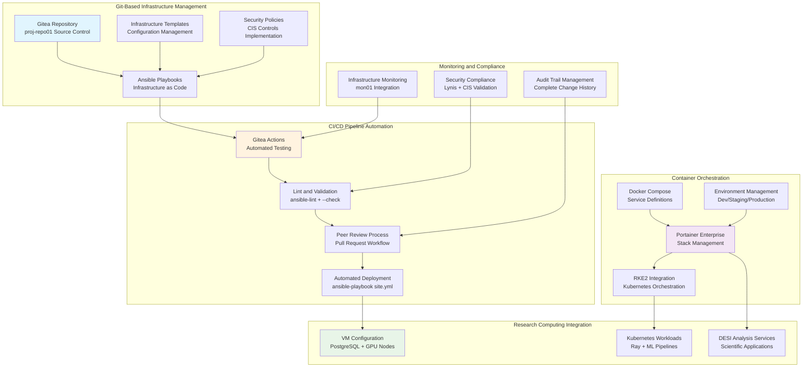

# 🔄 **GitOps and Portainer**

This category provides comprehensive documentation for GitOps workflows and Portainer container orchestration across the Proxmox Astronomy Lab's enterprise research computing platform. The documentation covers systematic infrastructure automation through Git-based workflows, containerized service deployment via Portainer stack management, and enterprise-grade CI/CD pipelines supporting reproducible infrastructure management. These implementations demonstrate production-ready GitOps patterns optimized for research computing environments with emphasis on version-controlled infrastructure, automated deployment procedures, and comprehensive audit capabilities.

## **Overview**

GitOps and Portainer represent the sophisticated automation and orchestration layer enabling systematic infrastructure management, container deployment coordination, and enterprise-grade CI/CD workflows across the research computing infrastructure. The Proxmox Astronomy Lab implements comprehensive GitOps practices centered on Gitea-hosted repositories, Ansible automation workflows, Portainer stack management, and systematic deployment pipelines supporting reproducible infrastructure operations and collaborative development workflows.

The GitOps ecosystem operates as the single source of truth for infrastructure configuration, providing systematic version control, automated testing procedures, peer-review workflows, and continuous deployment capabilities across the hybrid Kubernetes and VM architecture. These systems enable automated infrastructure provisioning, systematic container orchestration, comprehensive compliance validation, and enterprise-grade operational procedures supporting research computing scalability and scientific reproducibility across all domains and computational workflows.

---

## **📁 Repository Structure**

```markdown
infrastructure/gitops-portainer/
├── README.md                                    # This category overview document
├── gitea-infrastructure-management/
│   ├── README.md                               # Gitea-based GitOps infrastructure management
│   ├── repository-organization/                # Git repository structure and organization
│   ├── gitea-actions-workflows/                # CI/CD pipeline configuration and automation
│   ├── ansible-integration/                    # Ansible playbook management and version control
│   └── access-control-management/              # Gitea user management and repository permissions
├── portainer-orchestration/
│   ├── README.md                               # Portainer container orchestration and stack management
│   ├── stack-deployment/                       # Docker Compose stack deployment and management
│   ├── environment-management/                 # Multi-environment orchestration and coordination
│   ├── rbac-configuration/                     # Role-based access control and security management
│   └── webhook-automation/                     # Automated deployment triggers and notifications
├── ci-cd-pipelines/
│   ├── README.md                               # Continuous integration and deployment workflows
│   ├── automated-testing/                      # Infrastructure code validation and testing procedures
│   ├── deployment-automation/                  # Automated deployment and rollback procedures
│   ├── compliance-validation/                  # CIS Controls and security compliance automation
│   └── monitoring-integration/                 # Pipeline monitoring and performance tracking
├── infrastructure-as-code/
│   ├── README.md                               # Infrastructure as Code patterns and implementation
│   ├── ansible-playbooks/                      # Ansible automation and configuration management
│   ├── terraform-modules/                      # Terraform infrastructure provisioning (planned)
│   ├── configuration-templates/                # Systematic configuration management templates
│   └── validation-procedures/                  # Infrastructure validation and testing procedures
├── workflow-automation/
│   ├── README.md                               # Automated workflow coordination and management
│   ├── branch-management/                      # Git branching strategies and merge procedures
│   ├── peer-review-processes/                  # Code review workflows and quality assurance
│   ├── change-management/                      # Systematic change control and approval workflows
│   └── audit-compliance/                       # Audit trail management and compliance reporting
└── integration-coordination/
    ├── README.md                               # Integration with enterprise platform components
    ├── kubernetes-integration/                 # RKE2 cluster integration and coordination
    ├── monitoring-integration/                 # GitOps monitoring and observability integration
    ├── security-integration/                   # Security scanning and compliance automation
    └── backup-recovery/                        # GitOps backup procedures and disaster recovery
```

---

## **📂 Directory Overview**

This section provides comprehensive navigation to all GitOps and Portainer implementations and automation procedures.

### **🔧 Git-Based Infrastructure Management**

| **Component** | **Purpose** | **Implementation** |
|---------------|-------------|-------------------|
| **[gitea-infrastructure-management/](gitea-infrastructure-management/)** | Gitea-based GitOps infrastructure management | Repository organization, Gitea Actions, Ansible integration |
| **[infrastructure-as-code/](infrastructure-as-code/)** | Infrastructure as Code patterns and implementation | Ansible playbooks, Terraform modules, configuration templates |

### **🐳 Container Orchestration Systems**

| **Component** | **Purpose** | **Implementation** |
|---------------|-------------|-------------------|
| **[portainer-orchestration/](portainer-orchestration/)** | Portainer container orchestration and stack management | Stack deployment, environment management, RBAC configuration |
| **[workflow-automation/](workflow-automation/)** | Automated workflow coordination and management | Branch management, peer review, change control |

### **⚡ CI/CD and Automation Pipeline**

| **Component** | **Purpose** | **Implementation** |
|---------------|-------------|-------------------|
| **[ci-cd-pipelines/](ci-cd-pipelines/)** | Continuous integration and deployment workflows | Automated testing, deployment automation, compliance validation |

### **🔗 Enterprise Integration Coordination**

| **Component** | **Purpose** | **Implementation** |
|---------------|-------------|-------------------|
| **[integration-coordination/](integration-coordination/)** | Integration with enterprise platform components | Kubernetes integration, monitoring, security, backup coordination |

---

## **🏗️ Architecture & Design**

This section details the systematic architecture supporting enterprise-grade GitOps workflows and container orchestration across the research computing infrastructure.

### **GitOps Infrastructure Architecture**

The GitOps infrastructure implements comprehensive workflow automation with systematic integration across Git-based version control, CI/CD pipelines, container orchestration, and infrastructure management supporting reproducible research computing operations.



### **Gitea-Based Infrastructure Management Strategy**

The enterprise GitOps platform provides systematic coordination for infrastructure automation supporting scientific computing workflows with comprehensive version control, automated validation, and reproducible deployment capabilities.

| **GitOps Domain** | **Implementation Approach** | **Automation Integration** | **Research Computing Benefit** |
|-------------------|----------------------------|---------------------------|-------------------------------|
| **Infrastructure as Code** | Ansible playbooks with comprehensive role management | Gitea Actions CI/CD with automated testing and deployment | Reproducible infrastructure supporting scientific computing requirements |
| **Configuration Management** | Systematic VM and Kubernetes configuration templates | Version-controlled configuration with peer review workflows | Consistent environment setup across research projects and computational domains |
| **Security Automation** | CIS Controls v8 implementation with Lynis validation | Automated security scanning and compliance reporting | Enterprise-grade security supporting sensitive research data and collaborative workflows |
| **Deployment Coordination** | Single source of truth with Git-based infrastructure state | Automated deployment with rollback capabilities and audit trails | Reliable infrastructure changes supporting production scientific workloads |

### **Portainer Enterprise Orchestration**

The container orchestration architecture implements comprehensive stack management enabling scalable deployment across development, staging, and production environments with systematic resource allocation and monitoring integration.

| **Orchestration Scale** | **Infrastructure Approach** | **Stack Management** | **Scientific Integration** |
|------------------------|----------------------------|---------------------|---------------------------|
| **Development Environment** | Local stack deployment with resource optimization | Docker Compose stack management with development-specific configurations | Rapid prototyping and testing for research application development |
| **Staging Environment** | Multi-node orchestration with validation procedures | Comprehensive testing with production-like configurations | Research workflow validation and performance testing before production deployment |
| **Production Environment** | Enterprise-scale container deployment across RKE2 cluster | High-availability stack management with monitoring integration | Production scientific workloads with enterprise reliability and performance guarantees |
| **Cross-Environment Coordination** | Systematic promotion workflows with validation checkpoints | Environment-specific configuration management with secret handling | Systematic research application deployment with comprehensive validation procedures |

### **CI/CD Pipeline Architecture**

Enterprise GitOps implements sophisticated CI/CD coordination ensuring systematic testing, validation, and deployment for infrastructure changes and research application deployments.

| **Pipeline Stage** | **Automation Implementation** | **Validation Procedures** | **Research Computing Integration** |
|--------------------|--------------------------------|---------------------------|-----------------------------------|
| **Code Integration** | Automated pull request creation with branch management | Comprehensive code review with automated testing | Research infrastructure changes with peer validation and scientific review |
| **Testing and Validation** | ansible-lint and dry-run validation with security scanning | CIS Controls compliance validation and infrastructure testing | Research computing environment validation ensuring scientific workflow compatibility |
| **Deployment Automation** | Automated infrastructure deployment with rollback capabilities | Systematic deployment validation with monitoring integration | Production infrastructure changes supporting active research projects with minimal disruption |
| **Monitoring and Feedback** | Comprehensive deployment monitoring with alerting integration | Performance validation and compliance reporting | Research infrastructure health monitoring with scientific workflow impact assessment |

---

## **⚙️ Management and Operations**

This section provides systematic approaches to managing GitOps workflows and Portainer operations across enterprise research computing environments.

### **GitOps Operations Lifecycle**

Enterprise GitOps operations require systematic workflow management, comprehensive validation procedures, and systematic coordination ensuring reliable infrastructure automation for research computing applications.

| **Operations Phase** | **Management Approach** | **GitOps Considerations** |
|---------------------|------------------------|---------------------------|
| **Change Initiation** | Feature branch creation with descriptive naming and systematic planning | Research infrastructure impact assessment with scientific workflow coordination |
| **Development and Testing** | Local testing with comprehensive validation before pull request creation | Infrastructure code development with research computing requirements validation |
| **Peer Review** | Systematic code review with automated testing validation and approval workflows | Research infrastructure review with scientific computing expertise and operational validation |
| **Deployment Execution** | Automated deployment with systematic monitoring and rollback capabilities | Production infrastructure changes with research workflow protection and performance validation |

### **Portainer Stack Management**

Production container orchestration systems implement comprehensive stack lifecycle management ensuring optimal performance while maintaining enterprise reliability and research computing integration requirements.

| **Stack Management Domain** | **Coordination Strategy** | **Resource Management** | **Research Computing Integration** |
|-----------------------------|---------------------------|------------------------|-----------------------------------|
| **Stack Deployment** | Systematic Docker Compose management with environment-specific configurations | Resource allocation optimization with performance monitoring | Research application deployment with scientific workflow coordination |
| **Environment Coordination** | Multi-environment orchestration with validation procedures and promotion workflows | Cross-environment resource management with isolation and security | Research computing environment management supporting development through production workflows |
| **Service Management** | Comprehensive service lifecycle management with health monitoring and alerting | Service resource optimization with performance analytics and capacity planning | Scientific application service management with research workflow integration |
| **Scaling and Optimization** | Automated scaling with resource optimization and performance monitoring | Dynamic resource allocation with capacity management and cost optimization | Research workload scaling supporting computational requirements and scientific discovery |

### **Infrastructure Automation Strategy**

Enterprise infrastructure automation implements systematic coordination ensuring optimal reliability, comprehensive validation, and efficient operations for scientific computing and research infrastructure management.

| **Automation Category** | **Implementation Strategy** | **Monitoring Integration** |
|--------------------------|----------------------------|---------------------------|
| **Infrastructure Provisioning** | Ansible automation with systematic role management and validation procedures | Infrastructure provisioning monitoring with performance tracking and validation reporting |
| **Configuration Management** | Systematic configuration templates with version control and validation workflows | Configuration drift monitoring with compliance validation and automated remediation |
| **Security Automation** | CIS Controls implementation with automated scanning and compliance reporting | Security monitoring with threat detection and compliance validation |
| **Backup and Recovery** | Automated backup procedures with systematic validation and recovery testing | Backup monitoring with integrity validation and recovery performance tracking |

---

## **🔒 Security & Compliance**

This section documents comprehensive security controls and compliance alignment for GitOps and container orchestration infrastructure within research computing environments.

⚠️ GITOPS INFRASTRUCTURE SECURITY DISCLAIMER

*The GitOps and Portainer implementations provide enterprise-grade infrastructure automation for research computing requiring careful access control, systematic validation, and comprehensive audit capabilities. GitOps systems manage infrastructure as code with systematic version control, automated deployment procedures, and enterprise security frameworks. All GitOps implementations follow enterprise security standards with specific attention to infrastructure protection, systematic access control, and appropriate governance aligned with research computing security requirements and institutional policies.*

### **GitOps Security Controls**

Enterprise-grade security implementation guided by research computing standards for infrastructure automation and container orchestration systems. Security controls protect infrastructure code during development and deployment, ensure systematic access control, and maintain comprehensive audit capabilities while enabling collaborative infrastructure management and research computing operations.

| **Security Control Category** | **Implementation** | **Research Protection** |
|------------------------------|-------------------|------------------------|
| **Infrastructure Code Security** | Secure Git repository management with systematic access control and branch protection | Protection of infrastructure automation code and systematic deployment procedures |
| **CI/CD Pipeline Security** | Secure credential management with Gitea Secrets and systematic validation procedures | Protected automation workflows with comprehensive security validation and audit capabilities |
| **Container Security** | Portainer RBAC implementation with systematic environment isolation and security scanning | Controlled container deployment with systematic security validation and access management |
| **Access Control and Authentication** | Enterprise authentication integration with role-based access to infrastructure and deployment capabilities | Controlled access to infrastructure automation and systematic deployment capabilities |

### **Research Computing Compliance**

GitOps implementations align with research computing standards ensuring proper infrastructure governance, systematic automation procedures, and appropriate usage policies for academic institutions and collaborative research environments.

| **Compliance Domain** | **Framework Alignment** | **Implementation Evidence** |
|----------------------|------------------------|---------------------------|
| **Infrastructure Governance** | Systematic infrastructure management with institutional policies and research computing frameworks | Comprehensive infrastructure lifecycle management with audit capabilities and validation procedures |
| **Change Management** | Version-controlled infrastructure changes with systematic review and approval workflows | Transparent infrastructure automation with comprehensive history and validation documentation |
| **Security Automation** | CIS Controls v8 implementation with systematic validation and compliance reporting | Enterprise security automation with comprehensive monitoring and validation capabilities |
| **Institutional Compliance** | University and research institution infrastructure automation frameworks with systematic governance | Alignment with institutional policies and research computing governance requirements |

---

## **🔗 Related Categories**

This section establishes systematic connections to other knowledge domains within the Proxmox Astronomy Lab ecosystem, demonstrating comprehensive integration across enterprise research computing infrastructure.

### **Infrastructure Integration**

| **Category** | **Relationship** | **GitOps Integration** |
|--------------|------------------|----------------------|
| **[../k8s-rke2/](../k8s-rke2/)** | Kubernetes cluster management and orchestration | RKE2 deployment automation and systematic cluster management through GitOps workflows |
| **[../databases/](../databases/)** | Database deployment and configuration management | PostgreSQL automation and systematic database lifecycle management through infrastructure as code |
| **[../../ai-and-machine-learning/](../../ai-and-machine-learning/)** | AI/ML infrastructure deployment and coordination | Ray cluster deployment and systematic ML infrastructure management through container orchestration |
| **[../authentication/](../authentication/)** | Identity and access management integration | Enterprise authentication coordination with GitOps and Portainer access control systems |

### **Security and Governance Integration**

| **Category** | **Relationship** | **GitOps Integration** |
|--------------|------------------|----------------------|
| **[../../security-assurance/](../../security-assurance/)** | Security framework implementation and validation | CIS Controls automation and systematic security implementation through GitOps workflows |
| **[../../monitoring/](../../monitoring/)** | Infrastructure monitoring and observability | GitOps pipeline monitoring and systematic observability integration across infrastructure automation |
| **[../backups/](../backups/)** | Backup and recovery automation | Infrastructure backup procedures and systematic recovery automation through GitOps coordination |

### **Research and Application Integration**

| **Category** | **Relationship** | **GitOps Integration** |
|--------------|------------------|----------------------|
| **[../../projects/](../../projects/)** | Research project deployment and management | DESI analysis infrastructure deployment and systematic research application lifecycle management |
| **[../../reproducibility/](../../reproducibility/)** | Reproducible research infrastructure | Infrastructure as code supporting systematic reproducibility and research validation procedures |
| **[../../publishing/](../../publishing/)** | Scientific publication infrastructure | Research infrastructure automation supporting publication workflows and data management |

---

## **🚀 Getting Started**

This section provides systematic guidance for implementing GitOps and Portainer capabilities across different operational roles and research computing applications.

### **For Infrastructure Engineers**

**GitOps Setup:** [gitea-infrastructure-management/](gitea-infrastructure-management/)  
**Infrastructure as Code:** [infrastructure-as-code/](infrastructure-as-code/)  
**CI/CD Implementation:** [ci-cd-pipelines/](ci-cd-pipelines/)  
**Integration Coordination:** [integration-coordination/](integration-coordination/)

### **For DevOps Teams**

**Container Orchestration:** [portainer-orchestration/](portainer-orchestration/)  
**Workflow Automation:** [workflow-automation/](workflow-automation/)  
**Pipeline Management:** [ci-cd-pipelines/](ci-cd-pipelines/)  
**Monitoring Integration:** [integration-coordination/](integration-coordination/)

### **For Research Computing Teams**

**Research Infrastructure:** [infrastructure-as-code/](infrastructure-as-code/)  
**Application Deployment:** [portainer-orchestration/](portainer-orchestration/)  
**Workflow Management:** [workflow-automation/](workflow-automation/)  
**Security Compliance:** [ci-cd-pipelines/](ci-cd-pipelines/)

### **For Platform Administrators**

**Enterprise Management:** [gitea-infrastructure-management/](gitea-infrastructure-management/)  
**Security Implementation:** [ci-cd-pipelines/](ci-cd-pipelines/)  
**Integration Coordination:** [integration-coordination/](integration-coordination/)  
**Compliance Management:** [workflow-automation/](workflow-automation/)

---

## **Document Information**

| **Field** | **Value** |
|-----------|-----------|
| **Author** | VintageDon - <https://github.com/vintagedon> |
| **Created** | 2025-07-20 |
| **Last Updated** | 2025-07-20 |
| **Version** | 1.0 |

---
Tags: gitops-infrastructure, portainer-orchestration, ansible-automation, gitea-workflows, ci-cd-pipelines, infrastructure-as-code, container-management, enterprise-automation
