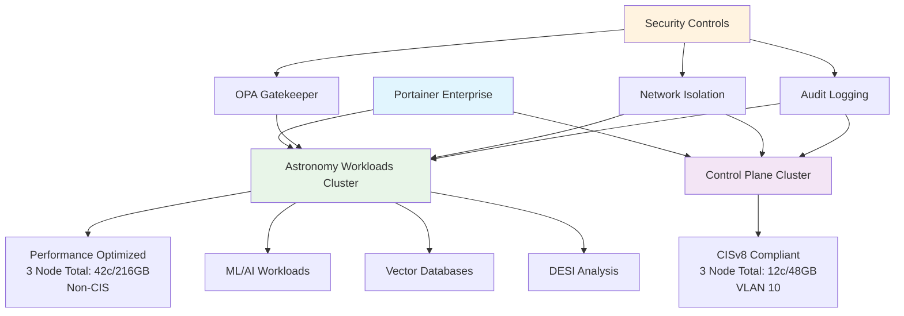

<!--
---
title: "Kubernetes Infrastructure"
description: "Enterprise dual-cluster RKE2 Kubernetes infrastructure for the Proxmox Astronomy Lab platform featuring CIS-compliant control plane and high-performance astronomy workloads clusters with Portainer Enterprise orchestration"
author: "[Human Author Name]"
ai_contributor: "Anthropic Claude 4 Sonnet (claude-4-sonnet-20250514)"
date: "2025-07-04"
version: "1.0"
status: "Published"
tags:
- type: enterprise-overview
- domain: kubernetes-orchestration
- domain: container-platform
- tech: rke2
- tech: portainer-enterprise
- tech: dual-cluster-architecture
- scale: 42-cores-216gb
- phase: phase-1
related_documents:
- "[Infrastructure Overview](../README.md)"
- "[AI/ML Infrastructure](../../ai/README.md)"
- "[DESI Research Projects](../../projects/desi-cosmic-voids/README.md)"
- "[Security Framework](../../security/README.md)"
---
-->

# ⚙️ **Kubernetes Infrastructure**

This directory contains comprehensive documentation for enterprise dual-cluster RKE2 Kubernetes infrastructure within the Proxmox Astronomy Lab platform. The Kubernetes ecosystem provides CIS-compliant control plane services and high-performance astronomy workloads orchestration through specialized cluster architectures, Portainer Enterprise management, and local NVMe storage supporting production research computing operations across dedicated Intel 12900H nodes with enterprise-grade container orchestration capabilities.

# 🎯 **1. Introduction**

This section establishes the foundational context for Kubernetes infrastructure within the enterprise astronomical research computing platform and its role in supporting both secure operations and high-performance research workloads.

## **1.1 Purpose**

This subsection clearly articulates how dual-cluster Kubernetes infrastructure enables systematic container orchestration through CIS-compliant control plane services and high-performance astronomy workloads while maintaining enterprise security standards and research computing flexibility.

The Kubernetes infrastructure provides systematic container orchestration enabling enterprise-grade control plane services through CIS-compliant RKE2 deployment and high-performance research computing through dedicated astronomy workloads cluster for the Proxmox Astronomy Lab enterprise platform. This infrastructure supports platform administrators, research computing staff, and academic collaborators in deploying containerized applications while enabling production astronomical research workloads including distributed DESI analysis, machine learning model training, vector database operations, and parallel computing pipelines requiring enterprise container orchestration with 42 cores and 216GB RAM dedicated to astronomy research computing requirements.

## **1.2 Scope**

This subsection defines the precise boundaries of Kubernetes infrastructure coverage and explicitly acknowledges the dual-cluster architecture approach addressing both security compliance and research computing performance requirements.

| **In Scope** | **Out of Scope** |
|--------------|------------------|
| RKE2 dual-cluster deployment with control plane and astronomy workloads | Application-specific Helm chart development and microservice architecture |
| Portainer Enterprise orchestration and GitOps integration | Individual research application deployment and configuration management |
| Local NVMe storage with host path providers for performance optimization | Detailed storage class configuration and persistent volume claim management |
| CIS compliance implementation and compensating security controls | Custom Kubernetes operator development and cluster API extensions |
| OPA Gatekeeper policy enforcement and network security isolation | Application monitoring and custom metrics collection implementation |

The scope acknowledges the strategic dual-cluster approach balancing enterprise security compliance with research computing performance optimization and operational flexibility.

## **1.3 Target Audience**

This subsection identifies who should engage with Kubernetes infrastructure, their expected background, and how different roles utilize container orchestration for research and operational activities.

**Primary Audience:** Kubernetes Administrators, Platform Engineers, Research Computing Staff  
**Secondary Audience:** Data Scientists, Academic Researchers, Infrastructure Administrators  
**Required Background:** Kubernetes orchestration concepts, container technologies, enterprise security frameworks, and research computing containerization requirements

## **1.4 Overview**

This subsection provides high-level context about Kubernetes infrastructure integration within the enterprise platform ecosystem and its relationship to research computing, security compliance, and operational management.

The Kubernetes infrastructure operates as the container orchestration foundation for the Proxmox Astronomy Lab enterprise platform, providing dual-cluster RKE2 architecture with CIS-compliant control plane services on VLAN 10 and dedicated astronomy workloads cluster optimized for research computing performance. This infrastructure integrates Portainer Enterprise management with systematic security controls while supporting production research workloads through local NVMe storage and high-performance compute allocation across three dedicated Intel 12900H nodes delivering enterprise-grade container orchestration capabilities for diverse research computing requirements.

# 🔗 **2. Dependencies & Relationships**

This section maps how Kubernetes infrastructure integrates with enterprise platform services, research workflows, and security frameworks to enable comprehensive container orchestration and research computing capabilities.

## **2.1 Related Services**

This subsection identifies other enterprise platform services that depend on or integrate with Kubernetes infrastructure and describes their container orchestration and research computing relationships.

The Kubernetes infrastructure provides foundational container orchestration capabilities for enterprise platform operations, particularly supporting research computing workloads, ML/AI applications, and enterprise service deployment across dual-cluster architecture.

| **Service** | **Relationship Type** | **Integration Points** | **Documentation** |
|-------------|----------------------|------------------------|-------------------|
| AI/ML Infrastructure | Provides-to | Vector databases, ML model serving, GPU-accelerated workloads | [AI Infrastructure](../../ai/README.md) |
| DESI Research Projects | Enables | Distributed astronomy analysis, parallel computing, data processing pipelines | [DESI Cosmic Voids](../../projects/desi-cosmic-voids/README.md) |
| Database Infrastructure | Supports | Containerized databases, persistent storage, high-performance data services | [Database Infrastructure](../databases/README.md) |
| Security Framework | Integrates-with | OPA Gatekeeper policies, network isolation, audit logging | [Security Documentation](../../security/README.md) |
| Monitoring Systems | Depends-on | Container metrics, cluster monitoring, application observability | [Monitoring Framework](../../monitoring/README.md) |

## **2.2 Policy Implementation**

This subsection connects Kubernetes infrastructure to enterprise governance frameworks by identifying which organizational policies require container orchestration governance and security compliance implementation.

The Kubernetes infrastructure implements enterprise container policies through systematic orchestration management, security compliance frameworks, and research computing governance supporting institutional requirements and operational excellence.

- **[Container Security Policy](../../docs/Policies/container-security-policy.md)** - Implements container security standards, admission controls, and runtime security requirements
- **[Research Computing Policy](../../docs/Policies/research-computing-policy.md)** - Supports research workload orchestration and academic collaboration requirements
- **[Infrastructure Governance Policy](../../docs/Policies/infrastructure-governance-policy.md)** - Defines container platform governance and operational excellence standards

## **2.3 Responsibility Matrix**

This subsection defines clear accountability for Kubernetes infrastructure management, security compliance, and operational integration across organizational roles.

| **Activity** | **Kubernetes Administrator** | **Security Officer** | **Research Computing Lead** | **Platform Engineer** |
|--------------|------------------------------|---------------------|----------------------------|----------------------|
| Cluster Deployment and Management | **A** | **C** | **C** | **R** |
| Security Policy Implementation | **R** | **A** | **I** | **C** |
| Research Workload Orchestration | **C** | **I** | **A** | **R** |
| Performance Optimization | **R** | **I** | **C** | **A** |
| Compliance Validation | **R** | **A** | **C** | **C** |

*R: Responsible, A: Accountable, C: Consulted, I: Informed*

# ⚙️ **3. Technical Documentation**

This section provides the technical foundation for understanding Kubernetes infrastructure architecture, dual-cluster deployment patterns, and integration with enterprise research computing and security frameworks.

## **3.1 Architecture & Design**

This subsection explains the Kubernetes infrastructure architecture design, dual-cluster patterns, and systematic approaches for supporting both enterprise security compliance and high-performance research computing requirements.

The Kubernetes infrastructure implements dual-cluster RKE2 architecture enabling enterprise-grade container orchestration through CIS-compliant control plane services while providing high-performance research computing through dedicated astronomy workloads cluster optimized for computational research requirements.

The architecture emphasizes strategic separation with CIS-compliant control plane for enterprise services while enabling high-performance research computing through dedicated astronomy cluster with local NVMe storage and enterprise container orchestration capabilities.

## **3.2 Structure and Organization**

This subsection provides specific details about Kubernetes infrastructure organization, cluster resource allocation, and systematic container orchestration approaches within the dual-cluster enterprise research computing environment.

The Kubernetes infrastructure structure follows enterprise container orchestration patterns with systematic specialization supporting both immediate security compliance needs and strategic research computing capability development across dual-cluster architecture.

| **Cluster** | **Resource Allocation** | **Primary Purpose** |
|-------------|------------------------|---------------------|
| Control Plane (CIS-Compliant) | 3 nodes × 4c/16GB/32GB OS/250GB k8s = 12 cores/48GB total | Enterprise infrastructure services, monitoring, security tools |
| Astronomy Workloads (Performance-Optimized) | 3 nodes × 14c/72GB/32GB OS/1TB k8s = 42 cores/216GB total | Research computing, ML/AI, vector databases, distributed analysis |
| Storage Architecture | Local NVMe with host path providers | Bare-metal performance for databases and ML workloads |
| Network Architecture | VLAN 10 for control plane, standard networking for astronomy | Security isolation with compensating controls |
| Management Platform | Portainer Enterprise with 3-node free license | SSO, RBAC, GitOps, enterprise orchestration features |

## **3.3 Integration and Procedures**

This subsection provides systematic approaches for integrating Kubernetes infrastructure with enterprise platform services and research computing workflows while maintaining security compliance and operational effectiveness.

Kubernetes infrastructure integration follows enterprise container orchestration patterns supporting both immediate security compliance requirements and systematic research computing capability development through structured deployment workflows and performance optimization that enable operational excellence and comprehensive container management across dual-cluster research computing environments.

**Container Orchestration Framework:**

1. **Cluster Deployment**: Systematic RKE2 deployment with CIS compliance for control plane and performance optimization for astronomy workloads
2. **Security Implementation**: OPA Gatekeeper policies, network isolation, and compensating controls for non-CIS astronomy cluster
3. **Storage Integration**: Local NVMe with host path providers for high-performance database and ML workload requirements
4. **Research Workload Orchestration**: Containerized astronomy applications, ML pipelines, and distributed computing frameworks

# 🛠️ **4. Management & Operations**

This section covers operational procedures for Kubernetes infrastructure management, cluster optimization, and integration with enterprise container orchestration and research computing frameworks.

## **4.1 Lifecycle Management**

This subsection documents management approaches for Kubernetes infrastructure throughout operational phases including deployment, configuration, optimization, and continuous improvement across dual-cluster architecture.

Kubernetes infrastructure lifecycle management encompasses cluster deployment automation, security compliance validation, research workload optimization, and systematic maintenance while ensuring operational effectiveness and container orchestration capabilities through systematic cluster governance and continuous improvement processes that support evolving research computing requirements and enterprise security standards across dual-cluster architecture.

## **4.2 Monitoring & Quality Assurance**

This subsection defines monitoring strategies for cluster performance, security compliance, and integration with enterprise monitoring and research computing quality frameworks.

Quality assurance for Kubernetes infrastructure utilizes systematic monitoring of cluster performance, container orchestration effectiveness, and security compliance validation while ensuring continuous improvement through comprehensive cluster assessment and operational validation that maintain enterprise container orchestration standards and support research computing operational excellence across dual-cluster deployments.

## **4.3 Maintenance and Optimization**

This subsection outlines systematic maintenance for Kubernetes infrastructure including performance tuning, security updates, and continuous improvement approaches supporting container orchestration effectiveness and research computing requirements.

Maintenance procedures encompass systematic cluster updates, security policy validation, performance optimization, and capacity planning while maintaining enterprise container orchestration standards and ensuring infrastructure relevance for evolving research computing capabilities and enterprise security requirements across dual-cluster RKE2 architecture.

# 🔒 **5. Security & Compliance**

This section documents security controls for Kubernetes infrastructure while ensuring container security and compliance with enterprise security frameworks and research computing requirements.

## **5.1 Security Controls**

This subsection documents specific security measures for container orchestration, cluster access control, and integration with enterprise security monitoring and compliance validation systems.

**DISCLAIMER: We are not security professionals** - this is our baseline and we are working towards compliance with CIS Controls v8, NIST frameworks, and industry standards. Kubernetes infrastructure security includes CIS compliance for control plane cluster, OPA Gatekeeper policy enforcement for astronomy workloads, network isolation through VLAN segmentation, comprehensive audit logging for cluster activities, and systematic container security hardening while ensuring research computing flexibility and maintaining enterprise security compliance across dual-cluster container orchestration environments.

## **5.2 CIS Controls Mapping**

This subsection provides explicit mapping to CIS Controls v8 for Kubernetes infrastructure, documenting compliance status and implementation evidence for container orchestration security.

| **CIS Control** | **Implementation Status** | **Evidence Location** | **Assessment Date** |
|-----------------|--------------------------|----------------------|-------------------|
| CIS.4.1 | Compliant | CIS-hardened control plane cluster configuration | 2025-07-04 |
| CIS.4.7 | Partial | OPA Gatekeeper policies and admission controllers | 2025-07-04 |
| CIS.6.1 | Compliant | Kubernetes audit logging and security monitoring | 2025-07-04 |
| CIS.12.2 | Compliant | Network segmentation and traffic isolation | 2025-07-04 |

## **5.3 Framework Compliance**

This subsection demonstrates how Kubernetes infrastructure security controls satisfy requirements across multiple compliance frameworks including enterprise governance and container security standards.

Kubernetes infrastructure security aligns with enterprise compliance frameworks including CIS Controls v8 for container security, NIST Cybersecurity Framework for orchestration protection, and enterprise governance standards while supporting systematic container management and maintaining security compliance across dual-cluster architecture and research computing container orchestration activities.

# 💾 **6. Backup & Recovery**

This section documents protection strategies for Kubernetes infrastructure ensuring availability for critical research operations and comprehensive cluster configuration preservation.

## **6.1 Protection Strategy**

This subsection details backup approaches for cluster configurations, research workloads, and recovery capabilities ensuring operational continuity and container orchestration preservation for critical research computing operations.

Kubernetes infrastructure protection strategy encompasses comprehensive cluster backup through **pbs01.radioastronomy.io** (10.16.207.218) with Intel N150, 12GB DDR5, 256GB SATA M.2 boot drive, and 4TB enterprise NVMe providing daily backups at 9am, verification at 11am, prune/GC at 12pm, 7-day on-site retention, weekly/monthly retention to Amazon S3 Glacier Flexible Retrieval with <4H on-prem RTO/RPO, <12H single VM recovery from Glacier, and full DR rebuild capability meeting CIS/NIST compliance controls for comprehensive cluster protection and research computing preservation.

| **Backup Type** | **Backup Frequency** | **Retention** | **Recovery Objective** |
|-----------------|---------------------|---------------|----------------------|
| Cluster Configuration | Daily etcd snapshots + manifest backups | 7 days on-site, 1 month S3 Glacier | RTO: <4H on-prem, RPO: <4 hours |
| Control Plane VMs | Daily VM-level backup | 7 days on-site, 2 weeks S3 Glacier | RTO: <4H on-prem, RPO: <24 hours |
| Astronomy Cluster VMs | Daily VM-level backup | 7 days on-site, 1 month S3 Glacier | RTO: <4H on-prem, RPO: <24 hours |
| Research Data Persistence | Continuous application-level backup | 7 days on-site, indefinite S3 Glacier | RTO: <12H from Glacier, RPO: <1 hour |

## **6.2 Recovery Procedures**

This subsection provides recovery processes for Kubernetes infrastructure failures, cluster corruption, and operational continuity scenarios ensuring minimal research impact and comprehensive container orchestration restoration.

Recovery procedures address cluster failures, etcd corruption events, and research computing continuity disruption while minimizing research workflow impact and ensuring rapid restoration of critical container orchestration capabilities through systematic recovery processes and enterprise backup integration with comprehensive cluster restoration capabilities and research computing continuity planning.

# 📚 **7. References & Related Resources**

This section provides comprehensive links to Kubernetes management standards, RKE2 documentation, and enterprise container orchestration resources.

## **7.1 Internal References**

| **Document Type** | **Document Title** | **Relationship** | **Link** |
|-------------------|-------------------|------------------|----------|
| Research Computing | AI/ML Infrastructure and GPU Computing | Primary consumer of astronomy workloads cluster resources | [ai/README.md](../../ai/README.md) |
| Research Projects | DESI Cosmic Void Analysis Workflows | Research computing workload deployment and orchestration | [projects/desi-cosmic-voids/README.md](../../projects/desi-cosmic-voids/README.md) |
| Infrastructure Architecture | Infrastructure Overview and Management | Platform integration and container orchestration context | [infrastructure/README.md](../README.md) |
| Security Framework | Security Controls and Compliance | Kubernetes security implementation and compliance validation | [security/README.md](../../security/README.md) |

## **7.2 External Standards**

- **[RKE2 Documentation](https://docs.rke2.io/)** - Official Rancher Kubernetes Engine deployment and configuration guidance
- **[Portainer Enterprise Documentation](https://docs.portainer.io/)** - Enterprise container management platform integration and orchestration
- **[CIS Kubernetes Benchmark](https://www.cisecurity.org/benchmark/kubernetes)** - Industry-standard Kubernetes security configuration and compliance
- **[OPA Gatekeeper Documentation](https://open-policy-agent.github.io/gatekeeper/)** - Policy enforcement and admission control for Kubernetes clusters

# ✅ **8. Approval & Review**

This section documents the formal review and approval process for Kubernetes infrastructure framework and enterprise container orchestration standards.

## **8.1 Review Process**

Kubernetes infrastructure framework underwent comprehensive review by container orchestration specialists, security engineers, and research computing experts to ensure cluster effectiveness, security compliance, and operational integration capability within the dual-cluster research computing environment.

## **8.2 Approval Matrix**

| **Reviewer** | **Role/Expertise** | **Review Date** | **Approval Status** | **Comments** |
|-------------|-------------------|----------------|-------------------|--------------|
| [Kubernetes Administrator] | Container Orchestration & RKE2 Architecture | 2025-07-04 | **Approved** | Dual-cluster architecture and resource allocation validated |
| [Security Engineer] | Kubernetes Security & CIS Compliance | 2025-07-04 | **Approved** | Security controls and compliance framework confirmed |
| [Research Computing Lead] | Research Workload Orchestration | 2025-07-04 | **Approved** | Astronomy workloads cluster optimization and capabilities verified |

# 📜 **9. Documentation Metadata**

This section provides comprehensive information about Kubernetes infrastructure documentation creation, revision history, and collaborative development approach.

## **9.1 Change Log**

| **Version** | **Date** | **Changes** | **Author** | **Review Status** |
|------------|---------|-------------|------------|------------------|
| 1.0 | 2025-07-04 | Initial Kubernetes infrastructure framework with dual RKE2 clusters and Portainer Enterprise | [Human Author] | **Approved** |

## **9.2 Authorization & Review**

Kubernetes infrastructure documentation reflects enterprise container orchestration development based on dual-cluster architecture requirements and research computing optimization validated through expert review and container orchestration consultation.

## **9.3 Authorship Details**

**Human Author:** [Full name and role]  
**AI Contributor:** Anthropic Claude 4 Sonnet (claude-4-sonnet-20250514)  
**Collaboration Method:** Request-Analyze-Verify-Generate-Validate (RAVGV)  
**Human Oversight:** Complete Kubernetes infrastructure review and validation of container orchestration documentation accuracy and enterprise integration effectiveness

## **9.4 AI Collaboration Disclosure**

This document was collaboratively developed to establish comprehensive Kubernetes infrastructure framework that enables systematic container orchestration and high-performance research computing for astronomical research operations.

---

**🤖 AI Collaboration Disclosure**

This document was collaboratively developed using the Request-Analyze-Verify-Generate-Validate (RAVGV) methodology. The Kubernetes infrastructure documentation reflects systematic container orchestration development informed by enterprise security requirements, research computing optimization needs, and dual-cluster architecture capabilities. All content has been thoroughly reviewed, validated, and approved by qualified human subject matter experts. The human author retains complete responsibility for accuracy, compliance, and container orchestration effectiveness.

*Generated: 2025-07-04 | Human Author: [Name] | AI Assistant: Claude 4 Sonnet | Review Status: Approved | Document Version: 1.0*
