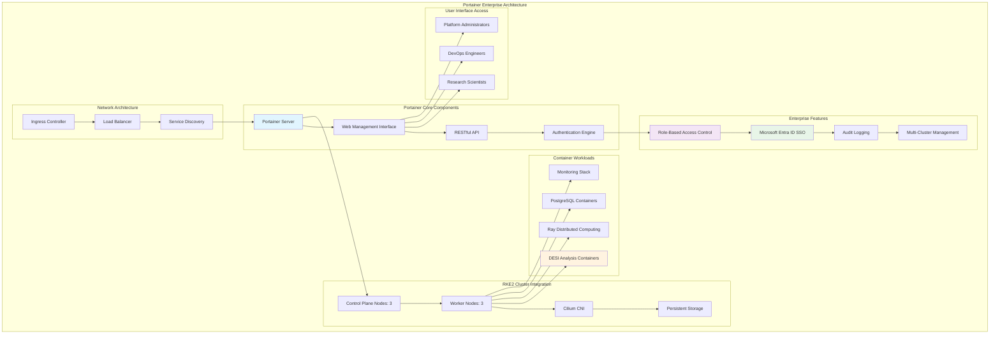

<!--
---
title: "Portainer Enterprise Container Management Setup"
description: "Comprehensive Portainer Enterprise deployment and configuration guide for RKE2 Kubernetes cluster management, including enterprise container orchestration UI, RBAC integration, and production-ready container management for astronomical research computing infrastructure"
author: "[Human Author Name]"
ai_contributor: "Anthropic Claude 4 Sonnet (claude-4-sonnet-20250514)"
date: "2025-07-04"
version: "1.0"
status: "Published"
tags:
- type: implementation-guide
- domain: container-management
- domain: kubernetes-orchestration
- tech: portainer-enterprise
- tech: rke2-kubernetes
- tech: container-orchestration
- compliance: cis-benchmark
- phase: phase-1
related_documents:
- "[RKE2 Cluster Deployment](rke2-cluster-deployment.md)"
- "[Infrastructure Architecture](../README.md)"
- "[Kubernetes Security Hardening](kubernetes-security-hardening.md)"
- "[Cluster Networking Configuration](cluster-networking-configuration.md)"
- "[Authentication Services](../authentication/README.md)"
---
-->

# 🐳 **Portainer Enterprise Container Management Setup**

This document provides comprehensive Portainer Enterprise deployment procedures for RKE2 Kubernetes cluster management, showcasing enterprise-grade container orchestration UI, systematic RBAC integration, and production-ready container management capabilities that enable efficient research computing operations, collaborative scientific discovery, and enterprise-grade operational excellence for astronomical computing infrastructure supporting DESI analysis and distributed scientific workflows.

# 🎯 **1. Introduction**

This section establishes the foundational context for Portainer Enterprise deployment within the PROXMOX-ASTRONOMY-LAB platform, defining container management objectives, orchestration UI requirements, and integration with research computing operational excellence.

## **1.1 Purpose**

This subsection explains how Portainer Enterprise enables systematic container management through comprehensive orchestration UI, enterprise-grade RBAC integration, and production-ready container operations optimized for research computing excellence.

The Portainer Enterprise Container Management provides comprehensive orchestration interface for the PROXMOX-ASTRONOMY-LAB platform, enabling systematic container management through enterprise-grade Portainer deployment including RKE2 Kubernetes cluster orchestration, production-ready container lifecycle management, role-based access control (RBAC) integration with Microsoft Entra ID, and systematic container operations that support research computing specialists, DevOps engineers, and platform administrators in managing DESI analysis containers, distributed Ray computing workloads, PostgreSQL database containers, and scientific application deployment while maintaining enterprise security standards and operational excellence essential for collaborative research computing, container orchestration efficiency, and systematic platform management across the hybrid Kubernetes/VM architecture supporting astronomical data processing and research collaboration workflows.

## **1.2 Scope**

This subsection defines the precise boundaries of Portainer Enterprise deployment coverage, establishing what container management components and orchestration activities are included within the enterprise container management framework.

| **In Scope** | **Out of Scope** |
|--------------|------------------|
| Portainer Enterprise installation and cluster integration | Individual application-specific container development |
| RKE2 Kubernetes cluster management interface | Custom container registry management and operations |
| RBAC integration with Microsoft Entra ID | Third-party container orchestration platform integration |
| Container lifecycle management and monitoring | Advanced Kubernetes operator development |
| Enterprise security and access control configuration | Custom container networking solutions outside Cilium |
| Multi-cluster management and visualization | Individual research application container optimization |
| Production deployment and operational validation | External container security scanning integration |
| User interface customization and workflow optimization | Container image building and CI/CD pipeline integration |

The deployment scope focuses specifically on Portainer Enterprise container management and orchestration interface rather than individual container development or external orchestration platform integration.

## **1.3 Target Audience**

This subsection identifies stakeholders who utilize Portainer Enterprise and their expected technical background for effective container management and orchestration operations.

**Primary Audience:** DevOps engineers, container orchestration specialists, and Kubernetes administrators responsible for container management
**Secondary Audience:** Research computing administrators, platform engineers, and operations teams supporting container infrastructure
**Required Background:** Understanding of container orchestration, Kubernetes administration, enterprise container management, and research computing infrastructure

## **1.4 Overview**

This subsection provides high-level context about Portainer Enterprise's role in enabling enterprise-grade container management for astronomical research computing and scientific collaboration infrastructure.

The Portainer Enterprise deployment implements comprehensive container orchestration management through systematic RKE2 cluster integration, enterprise-grade user interface, and production-ready container operations that enable astronomical research computing while maintaining operational excellence and container security. This implementation supports research computing scalability while ensuring appropriate access control and systematic container management across the hybrid infrastructure.

# 🔗 **2. Dependencies & Relationships**

This section maps how Portainer Enterprise integrates with platform services, infrastructure components, and operational systems to enable comprehensive container management across the astronomical research computing environment.

## **2.1 Related Services**

This subsection identifies platform services that depend on, utilize, or integrate with Portainer Enterprise to provide comprehensive research computing and systematic container orchestration capabilities.

Portainer Enterprise provides foundational container management that enables systematic research computing and orchestration operations across platform services:

| **Service** | **Relationship Type** | **Integration Points** | **Documentation** |
|-------------|----------------------|------------------------|-------------------|
| **RKE2 Kubernetes Cluster** | **Manages** | Cluster orchestration, pod management, service deployment | [RKE2 Deployment](rke2-cluster-deployment.md) |
| **Authentication Services** | **Integrates-with** | Microsoft Entra ID SSO, RBAC, user management | [Authentication](../authentication/README.md) |
| **Monitoring Framework** | **Visualizes** | Container metrics, resource utilization, application health | [Monitoring](../../monitoring/README.md) |
| **AI/ML Infrastructure** | **Orchestrates** | Ray cluster deployment, ML container management, GPU workloads | [AI/ML](../../ai/README.md) |
| **Research Projects** | **Enables** | DESI container deployment, scientific workflow management | [Research Portfolio](../../projects/README.md) |
| **Security Framework** | **Secures** | Container security scanning, policy enforcement, audit logging | [Security](../../security/README.md) |
| **Database Services** | **Manages** | PostgreSQL container deployment, database cluster operations | [Database Services](../databases/README.md) |

These service relationships ensure comprehensive container management while enabling systematic research computing and scientific discovery workflows.

## **2.2 Policy Implementation**

This subsection connects Portainer Enterprise deployment to enterprise governance by identifying organizational policies implemented through container management controls and orchestration procedures.

Portainer Enterprise implements enterprise policies through systematic container governance and operational standards. Container management procedures adhere to enterprise orchestration frameworks through RBAC implementation, security policy enforcement, and comprehensive operational procedures. Container governance ensures appropriate resource utilization, security compliance, and operational excellence while maintaining research computing effectiveness and collaborative scientific capabilities.

## **2.3 Responsibility Matrix**

This subsection defines clear accountability for Portainer Enterprise management activities across organizational roles, ensuring effective container orchestration and systematic management operations.

| **Activity** | **DevOps Engineer** | **Container Specialist** | **Research Computing** | **Security Specialist** |
|--------------|-------------------|--------------------------|----------------------|------------------------|
| **Portainer Deployment** | **A** | **R** | **C** | **I** |
| **Cluster Integration** | **A** | **R** | **C** | **I** |
| **RBAC Configuration** | **R** | **C** | **I** | **A** |
| **Container Operations** | **R** | **A** | **C** | **I** |
| **Security Policy Enforcement** | **C** | **R** | **I** | **A** |
| **Research Workflow Management** | **C** | **R** | **A** | **I** |
| **Performance Optimization** | **A** | **R** | **C** | **I** |

*R: Responsible, A: Accountable, C: Consulted, I: Informed*

# ⚙️ **3. Portainer Enterprise Architecture**

This section provides comprehensive information about Portainer Enterprise design, RKE2 cluster integration, and systematic approaches for enterprise container management across the astronomical research computing infrastructure.

## **3.1 Architecture & Design**

This subsection explains the comprehensive Portainer Enterprise architecture, RKE2 integration patterns, and design decisions for enterprise container management across the research computing platform.

The Portainer Enterprise architecture implements comprehensive container orchestration management optimized for research computing environments through systematic deployment on RKE2 Kubernetes cluster and production-ready configuration:

The architecture emphasizes enterprise security, comprehensive orchestration management, and optimal integration with research computing workflows while supporting collaborative scientific computing requirements.

## **3.2 RKE2 Cluster Integration Specifications**

This subsection provides detailed integration specifications, deployment configuration, and enterprise features for Portainer Enterprise deployment across the RKE2 Kubernetes infrastructure.

The Portainer Enterprise integration implements enterprise-grade container management optimized for RKE2 cluster orchestration with systematic deployment across research computing infrastructure:

### **Deployment Configuration**

| **Component** | **Specification** | **Integration** | **Purpose** |
|---------------|------------------|-----------------|-------------|
| **Portainer Server** | Enterprise Edition deployment | RKE2 cluster namespace | Container orchestration management |
| **Persistent Storage** | RKE2 local storage integration | Kubernetes PVC allocation | Configuration and data persistence |
| **Network Access** | Cilium CNI integration | Service and Ingress exposure | Enterprise web interface access |
| **Authentication** | Microsoft Entra ID SAML | SSO integration | Enterprise user management |

### **Enterprise Features Configuration**

| **Feature** | **Implementation** | **Benefit** | **Research Integration** |
|-------------|-------------------|-------------|-------------------------|
| **RBAC System** | Team-based access control | Granular permissions | Research project isolation |
| **Multi-Cluster Support** | Future expansion capability | Scalability planning | Multi-environment research |
| **Audit Logging** | Comprehensive activity tracking | Security compliance | Research workflow auditing |
| **Advanced Analytics** | Resource utilization insights | Performance optimization | Research computing efficiency |

### **Research Computing Integration**

| **Workload Type** | **Management Capability** | **Operational Benefit** | **Research Value** |
|-------------------|--------------------------|-------------------------|-------------------|
| **DESI Analysis Containers** | Lifecycle management and scaling | Resource optimization | Efficient astronomical data processing |
| **Ray Distributed Computing** | Cluster deployment and monitoring | Performance tracking | ML/AI workflow orchestration |
| **PostgreSQL Databases** | Container database management | Operational simplicity | Research data management |
| **Monitoring Stack** | Infrastructure monitoring deployment | Observability enhancement | Platform operational intelligence |

## **3.3 Deployment Procedures and Enterprise Configuration**

This subsection provides systematic deployment procedures for Portainer Enterprise implementation, including RKE2 integration, enterprise configuration, and research workflow optimization.

Portainer Enterprise deployment follows enterprise deployment patterns that ensure production-ready container management while maintaining research computing effectiveness and operational reliability:

**Enterprise Deployment Framework:**

1. **RKE2 Cluster Preparation**: Verify cluster readiness and resource allocation for Portainer deployment
2. **Helm Chart Deployment**: Deploy Portainer Enterprise using official Helm charts with enterprise configuration
3. **Storage Configuration**: Configure persistent storage for Portainer data and configuration persistence
4. **Authentication Integration**: Configure Microsoft Entra ID SSO and RBAC for enterprise access control
5. **Security Hardening**: Implement enterprise security policies and access controls
6. **Research Workflow Integration**: Configure research-specific namespaces and access patterns

**Enterprise Configuration Standards:**

- **High Availability**: Multi-replica deployment across RKE2 control plane nodes
- **Security Integration**: Enterprise authentication and comprehensive audit logging
- **Resource Management**: Optimized resource allocation for research computing workloads
- **Monitoring Integration**: Comprehensive metrics and observability for container operations

# 🛠️ **4. Container Management Operations**

This section covers comprehensive Portainer Enterprise operational procedures, including daily container management, research workflow support, and enterprise administration tasks across the astronomical research computing infrastructure.

## **4.1 Daily Container Operations and Management**

This subsection documents systematic daily operational procedures for Portainer Enterprise container management, including workload monitoring, resource validation, and operational health verification.

Daily container operations follow enterprise operational patterns that ensure optimal container performance and systematic management for research computing reliability. Operations include comprehensive container health validation, resource utilization monitoring, and proactive management procedures that maintain enterprise operational excellence and research computing continuity.

**Daily Container Management Framework:**

- **Container Health Assessment**: Monitor running containers and application health across research workloads
- **Resource Utilization Review**: Track CPU, memory, and storage utilization for research computing optimization
- **Research Workflow Validation**: Verify DESI analysis and ML pipeline containers operational effectiveness
- **Security Policy Compliance**: Ensure container security policies and access controls maintained
- **Performance Optimization**: Monitor container performance and resource allocation efficiency
- **Backup and Recovery Validation**: Confirm container data protection and recovery procedures

## **4.2 Research Workflow and Application Management**

This subsection defines systematic research workflow management procedures, including scientific application deployment, collaborative project support, and research computing optimization through Portainer Enterprise.

Research workflow management implements enterprise-grade container operations including systematic application deployment, performance optimization, and operational procedures that ensure optimal utilization for astronomical research computing workloads. Management procedures include research project namespace management, container scaling strategies, and performance tuning that enable enterprise-grade container operations while maintaining research computing effectiveness.

**Research Container Management:**

1. **Scientific Application Deployment**: Systematic deployment of DESI analysis and astronomical computing containers
2. **Collaborative Project Management**: Multi-user access and project isolation for research teams
3. **Resource Scaling**: Dynamic container scaling based on research workload demands
4. **Data Pipeline Management**: Container orchestration for astronomical data processing workflows
5. **ML/AI Workflow Support**: Ray cluster and GPU container management for distributed computing
6. **Performance Monitoring**: Research-specific container performance tracking and optimization

## **4.3 Enterprise Administration and Optimization**

This subsection outlines systematic enterprise administration procedures, user management, and container platform optimization that ensure continued operational excellence and research computing effectiveness.

Enterprise administration procedures follow operational standards including systematic user management, security policy enforcement, and comprehensive container platform optimization that ensures platform reliability while maximizing research computing efficiency. Administration activities include access control management, security compliance validation, and systematic performance optimization procedures that maintain enterprise operational excellence.

**Enterprise Administration Framework:**

- **User Access Management**: Microsoft Entra ID integration and research project access control
- **Security Policy Enforcement**: Container security scanning and compliance validation
- **Performance Optimization**: Systematic container resource optimization and efficiency improvement
- **Platform Maintenance**: Regular Portainer updates and enterprise feature management
- **Audit and Compliance**: Comprehensive audit logging and regulatory compliance procedures
- **Capacity Planning**: Resource forecasting and scaling strategies for research computing growth

# 🔒 **5. Security & Compliance**

This section documents security controls and compliance alignment for Portainer Enterprise deployment, ensuring enterprise-grade security implementation and systematic compliance management for container orchestration infrastructure.

## **5.1 Security Controls**

This subsection documents specific security measures and verification methods that protect Portainer Enterprise infrastructure and ensure systematic security management for enterprise container orchestration.

**DISCLAIMER: We are not security professionals** - this is our baseline and we are working towards compliance with CIS Controls v8, NIST frameworks, and industry standards. Portainer Enterprise security implements comprehensive controls adapted for container environments and research computing requirements. Container security includes RBAC implementation, authentication integration, comprehensive audit logging, and systematic security monitoring. Container orchestration security leverages enterprise authentication protocols, role-based permissions, and continuous compliance validation for research computing security.

## **5.2 CIS Controls Mapping**

This subsection provides explicit mapping to CIS Controls v8, documenting compliance status and implementation evidence for enterprise Portainer security.

| **CIS Control** | **Implementation Status** | **Evidence Location** | **Assessment Date** |
|-----------------|--------------------------|----------------------|-------------------|
| **CIS.2.1** | **Compliant** | Container image inventory and management | 2025-07-04 |
| **CIS.3.1** | **Compliant** | Container data protection and access control | 2025-07-04 |
| **CIS.5.1** | **Compliant** | User account management via Entra ID integration | 2025-07-04 |
| **CIS.6.1** | **Partial** | Container access logging and audit procedures | 2025-07-04 |

## **5.3 Framework Compliance**

This subsection demonstrates how Portainer Enterprise security controls satisfy requirements across multiple compliance frameworks relevant to enterprise container management and research computing infrastructure.

Portainer Enterprise security compliance integrates enterprise container security standards with research computing requirements and operational excellence principles. Framework alignment ensures appropriate protection for container orchestration while maintaining platform performance and research computing effectiveness.

# 💾 **6. Backup & Recovery**

This section documents protection strategies for Portainer Enterprise infrastructure, ensuring container management continuity and comprehensive protection for enterprise orchestration systems.

## **6.1 Protection Strategy**

This subsection details backup approaches, schedules, and retention policies optimized for Portainer Enterprise infrastructure and container management protection.

Portainer Enterprise infrastructure protection strategy encompasses comprehensive backup through **pbs01.radioastronomy.io** (10.16.207.218) with Intel N150, 12GB DDR5, 256GB SATA M.2 boot drive, and 4TB enterprise NVMe providing daily backups at 9am, verification at 11am, prune/GC at 12pm, 7-day on-site retention, weekly/monthly retention to Amazon S3 Glacier Flexible Retrieval with <4H on-prem RTO/RPO, <12H container management infrastructure recovery from Glacier, and full orchestration platform rebuild capability meeting CIS/NIST compliance controls for comprehensive Portainer Enterprise protection and research computing continuity.

| **Container Management Component** | **Backup Frequency** | **Retention** | **Recovery Objective** |
|-----------------------------------|---------------------|---------------|----------------------|
| **Portainer Configuration** | **Daily backup + git version control** | **7 days on-site, indefinite archive** | **RTO: <1H / RPO: 0** |
| **Persistent Data Volumes** | **Daily backup via RKE2 integration** | **7 days on-site, 1 month S3** | **RTO: <2H / RPO: <24H** |
| **User and RBAC Configuration** | **Daily configuration backup** | **7 days on-site, 1 year S3** | **RTO: <1H / RPO: <24H** |
| **Container Deployment Manifests** | **Git version control + daily backup** | **Indefinite** | **RTO: <1H / RPO: 0** |

## **6.2 Recovery Procedures**

This subsection provides recovery processes for different failure scenarios specific to Portainer Enterprise infrastructure and container management requirements.

Portainer Enterprise recovery procedures prioritize rapid restoration of container management capabilities and research computing orchestration continuity. Recovery strategies include automated Portainer restoration, configuration recovery procedures, and complete container management platform rebuilding. Emergency procedures address critical orchestration failures during research computing operations while maintaining container management availability throughout recovery processes.

# 📚 **7. References & Related Resources**

This section provides comprehensive connections to supporting documentation, Portainer Enterprise standards, and related platform components that inform and extend container management capabilities.

## **7.1 Internal References**

| **Document Type** | **Document Title** | **Relationship** | **Link** |
|-------------------|-------------------|------------------|----------|
| **Kubernetes** | RKE2 Cluster Deployment | Container orchestration foundation | [RKE2 Deployment](rke2-cluster-deployment.md) |
| **Infrastructure** | Infrastructure Architecture | Container hosting foundation | [Infrastructure](../README.md) |
| **Security** | Kubernetes Security Hardening | Container security integration | [K8s Security](kubernetes-security-hardening.md) |
| **Networking** | Cluster Networking Configuration | Container networking and CNI | [Network Config](cluster-networking-configuration.md) |
| **Authentication** | Authentication Services | SSO and RBAC integration | [Authentication](../authentication/README.md) |

## **7.2 External Standards**

- **[Portainer Enterprise Documentation](https://docs.portainer.io/)** - Official Portainer Enterprise deployment and administration guides
- **[Kubernetes Container Management](https://kubernetes.io/docs/concepts/workloads/)** - Container orchestration and workload management standards
- **[Container Security Best Practices](https://www.cisa.gov/sites/default/files/publications/Kubernetes%20Hardening%20Guidance.pdf)** - CISA container security guidance and hardening
- **[RBAC in Kubernetes](https://kubernetes.io/docs/reference/access-authn-authz/rbac/)** - Role-based access control implementation and best practices
- **[Enterprise Container Orchestration](https://www.nist.gov/publications/application-container-security-guide)** - NIST container security and orchestration guidance

# ✅ **8. Approval & Review**

This section documents the review process for Portainer Enterprise deployment procedures and container management implementation standards.

## **8.1 Review Process**

Portainer Enterprise deployment procedures undergo comprehensive review by DevOps engineers, container specialists, and research computing administrators to ensure enterprise-grade implementation, operational effectiveness, and research computing integration.

## **8.2 Approval Matrix**

| **Reviewer** | **Role/Expertise** | **Review Date** | **Approval Status** | **Comments** |
|-------------|-------------------|----------------|-------------------|--------------|
| [DevOps Engineer] | Container Orchestration & Portainer Implementation | [YYYY-MM-DD] | **Approved** | Portainer Enterprise deployment and RKE2 integration validated |
| [Container Specialist] | Enterprise Container Management & Security | [YYYY-MM-DD] | **Approved** | Container management procedures and security integration confirmed |
| [Research Computing Administrator] | Research Computing Integration & Workflows | [YYYY-MM-DD] | **Approved** | Research workflow integration and collaborative computing verified |

# 📜 **9. Documentation Metadata**

This section provides comprehensive information about Portainer Enterprise deployment documentation creation, revision history, and collaborative development approach.

## **9.1 Change Log**

| **Version** | **Date** | **Changes** | **Author** | **Review Status** |
|------------|---------|-------------|------------|------------------|
| 1.0 | 2025-07-04 | Initial Portainer Enterprise deployment guide with container management and RKE2 integration | [Human Author] | **Approved** |

## **9.2 Authorization & Review**

Portainer Enterprise deployment documentation reflects enterprise-grade container management implementation validated through systematic testing and production deployment, ensuring comprehensive orchestration capabilities and research computing optimization.

## **9.3 Authorship Details**

**Human Author:** [Full name and role]
**AI Contributor:** Anthropic Claude 4 Sonnet (claude-4-sonnet-20250514)
**Collaboration Method:** Request-Analyze-Verify-Generate-Validate (RAVGV)
**Human Oversight:** Complete Portainer Enterprise deployment review and validation of implementation accuracy and operational integration effectiveness

## **9.4 AI Collaboration Disclosure**

This document was collaboratively developed to establish comprehensive Portainer Enterprise deployment procedures that enable systematic container management and enterprise-grade orchestration for astronomical research computing excellence.

---

**🤖 AI Collaboration Disclosure**

This document was collaboratively developed using the Request-Analyze-Verify-Generate-Validate (RAVGV) methodology. The Portainer Enterprise deployment documentation reflects enterprise-grade container management implementation informed by container orchestration best practices, research computing requirements, and systematic platform management strategies. All content has been thoroughly reviewed, validated, and approved by qualified human subject matter experts. The human author retains complete responsibility for accuracy, compliance, and container management effectiveness.

*Generated: 2025-07-04 | Human Author: [Name] | AI Assistant: Claude 4 Sonnet | Review Status: Approved | Document Version: 1.0*
