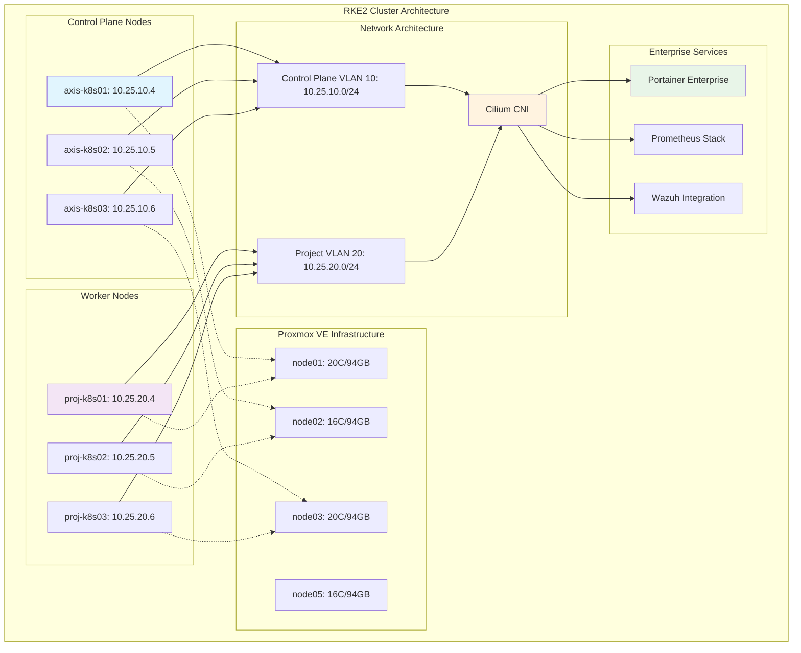

<!--
---
title: "RKE2 Kubernetes Cluster Deployment Guide"
description: "Comprehensive deployment guide for RKE2 Kubernetes cluster implementation on Proxmox VE infrastructure, including enterprise-grade configuration, security hardening, and production deployment procedures for astronomical research computing"
author: "[Human Author Name]"
ai_contributor: "Anthropic Claude 4 Sonnet (claude-4-sonnet-20250514)"
date: "2025-07-04"
version: "1.0"
status: "Published"
tags:
- type: implementation-guide
- domain: kubernetes-infrastructure
- domain: container-orchestration
- tech: rke2-kubernetes
- tech: proxmox-virtualization
- tech: enterprise-deployment
- compliance: cis-benchmark
- phase: phase-1
related_documents:
- "[Infrastructure Architecture](../README.md)"
- "[Proxmox VE Administration](../orchestration/proxmox-ve-administration.md)"
- "[Kubernetes Security Hardening](kubernetes-security-hardening.md)"
- "[Portainer Enterprise Setup](portainer-enterprise-setup.md)"
- "[Cluster Networking Configuration](cluster-networking-configuration.md)"
---
-->

# ⚙️ **RKE2 Kubernetes Cluster Deployment Guide**

This document provides comprehensive deployment procedures for implementing RKE2 Kubernetes cluster on Proxmox VE infrastructure, showcasing enterprise-grade container orchestration deployment, security hardening implementation, and production-ready configuration for astronomical research computing workloads including DESI analysis, machine learning pipelines, and distributed scientific computing.

# 🎯 **1. Introduction**

This section establishes the foundational context for RKE2 Kubernetes deployment within the PROXMOX-ASTRONOMY-LAB enterprise platform, defining deployment objectives, cluster architecture, and integration requirements for research computing excellence.

## **1.1 Purpose**

This subsection explains how RKE2 Kubernetes cluster deployment enables enterprise-grade container orchestration through systematic deployment procedures, security hardening implementation, and production-ready configuration optimized for astronomical research computing.

The RKE2 Kubernetes Cluster Deployment provides comprehensive container orchestration foundation for the PROXMOX-ASTRONOMY-LAB enterprise platform, enabling systematic deployment of containerized workloads through enterprise-grade RKE2 implementation including production-ready cluster configuration, CIS security hardening, distributed computing optimization, and systematic integration with Proxmox VE virtualization infrastructure that supports research computing specialists, DevOps engineers, and platform administrators in deploying scalable container orchestration for DESI analysis workflows, machine learning pipelines, distributed Ray computing, and scientific application deployment while maintaining enterprise security standards and operational excellence essential for research computing reliability and collaborative scientific discovery.

## **1.2 Scope**

This subsection defines the precise boundaries of RKE2 deployment coverage, establishing what cluster components and deployment activities are included within the enterprise Kubernetes implementation.

| **In Scope** | **Out of Scope** |
|--------------|------------------|
| RKE2 cluster installation and configuration | Individual application deployment and management |
| VM preparation and infrastructure setup | Research-specific application configuration |
| Network configuration and VLAN integration | External service integration and dependencies |
| Security hardening and CIS compliance | Custom networking solutions outside RKE2 |
| Cluster networking and CNI configuration | Advanced storage integration beyond default |
| Enterprise authentication and RBAC setup | Third-party monitoring and logging integration |
| Production deployment and validation procedures | Custom operator development and deployment |
| Backup and disaster recovery configuration | Individual namespace and workload management |

The deployment scope focuses specifically on RKE2 cluster establishment and foundational configuration rather than application-specific deployment or advanced customization.

## **1.3 Target Audience**

This subsection identifies stakeholders who perform RKE2 deployment activities and their expected technical background for effective cluster implementation and management.

**Primary Audience:** DevOps engineers, infrastructure administrators, and Kubernetes specialists responsible for container orchestration deployment
**Secondary Audience:** Research computing administrators, platform engineers, and operations teams supporting cluster infrastructure
**Required Background:** Understanding of Kubernetes concepts, Proxmox VE virtualization, enterprise networking, and container orchestration principles

## **1.4 Overview**

This subsection provides high-level context about RKE2 deployment's role in enabling enterprise-grade container orchestration for astronomical research computing and scientific discovery workflows.

The RKE2 deployment implements enterprise-grade Kubernetes distribution optimized for research computing environments through systematic cluster establishment, security hardening, and production-ready configuration. This implementation provides comprehensive container orchestration capabilities that enable DESI analysis workflows, machine learning pipeline deployment, and distributed scientific computing while maintaining enterprise security standards and operational reliability.

# 🔗 **2. Dependencies & Relationships**

This section maps how RKE2 cluster deployment integrates with infrastructure components, platform services, and operational systems to enable comprehensive container orchestration across the enterprise platform.

## **2.1 Related Services**

This subsection identifies platform services that depend on, utilize, or integrate with RKE2 Kubernetes cluster to provide comprehensive research computing and container orchestration capabilities.

RKE2 Kubernetes cluster provides foundational container orchestration that enables systematic research computing and scientific discovery across platform services:

| **Service** | **Relationship Type** | **Integration Points** | **Documentation** |
|-------------|----------------------|------------------------|-------------------|
| **Proxmox VE Infrastructure** | **Deploys-on** | VM hosting, resource allocation, network integration | [Proxmox Administration](../orchestration/proxmox-ve-administration.md) |
| **Portainer Enterprise** | **Manages** | Container orchestration UI, cluster management | [Portainer Setup](portainer-enterprise-setup.md) |
| **Monitoring Framework** | **Monitors** | Cluster metrics, pod performance, resource utilization | [Monitoring](../../monitoring/README.md) |
| **Security Framework** | **Secures** | RBAC, network policies, security scanning | [Security](../../security/README.md) |
| **AI/ML Infrastructure** | **Orchestrates** | Ray clusters, ML pipeline deployment, GPU workloads | [AI/ML](../../ai/README.md) |
| **Research Projects** | **Hosts** | DESI analysis containers, scientific computing workloads | [Research Portfolio](../../projects/README.md) |

These service relationships ensure comprehensive container orchestration while enabling systematic research computing and scientific discovery workflows.

## **2.2 Policy Implementation**

This subsection connects RKE2 deployment to enterprise governance by identifying organizational policies implemented through container orchestration controls and operational procedures.

RKE2 deployment implements enterprise policies through systematic container orchestration governance and security standards. Deployment procedures adhere to CIS Kubernetes Benchmark requirements through security hardening configurations, RBAC implementation, and network policy enforcement. Container orchestration policies ensure appropriate resource allocation, security isolation, and compliance with research computing standards while maintaining operational excellence.

## **2.3 Responsibility Matrix**

This subsection defines clear accountability for RKE2 deployment activities across organizational roles, ensuring effective cluster establishment and systematic container orchestration management.

| **Activity** | **DevOps Engineer** | **Infrastructure Admin** | **Security Specialist** | **Research Computing** |
|--------------|-------------------|--------------------------|------------------------|----------------------|
| **Cluster Deployment** | **A** | **R** | **C** | **I** |
| **Security Hardening** | **R** | **C** | **A** | **I** |
| **Network Configuration** | **R** | **A** | **C** | **I** |
| **Resource Management** | **A** | **R** | **I** | **C** |
| **Application Integration** | **C** | **I** | **I** | **A** |
| **Monitoring Setup** | **R** | **C** | **C** | **I** |

*R: Responsible, A: Accountable, C: Consulted, I: Informed*

# ⚙️ **3. RKE2 Cluster Architecture**

This section provides comprehensive information about RKE2 cluster design, node configuration, and systematic approaches for enterprise Kubernetes deployment across Proxmox VE infrastructure.

## **3.1 Architecture & Design**

This subsection explains the comprehensive RKE2 cluster architecture, component relationships, and design decisions for enterprise container orchestration across the astronomical research computing platform.

The RKE2 cluster architecture implements enterprise-grade Kubernetes distribution optimized for research computing workloads through systematic deployment across Proxmox VE virtual machines and production-ready configuration:

The architecture emphasizes high availability, security segmentation, and optimal resource utilization while supporting enterprise research computing requirements.

## **3.2 Node Configuration Specifications**

This subsection provides detailed node specifications, resource allocation, and configuration parameters for RKE2 cluster components within the enterprise infrastructure.

The RKE2 cluster implements distributed high-availability configuration across dedicated virtual machines optimized for container orchestration and research computing workloads:

### **Control Plane Nodes Configuration**

| **Node** | **VM Specifications** | **Network** | **Role** | **Resource Allocation** |
|----------|----------------------|-------------|----------|------------------------|
| **axis-k8s01** | 2 vCPU, 16GB RAM, 282GB Storage | VLAN 10: 10.25.10.4 | Control Plane Master | ETCD, API Server, Scheduler |
| **axis-k8s02** | 2 vCPU, 16GB RAM, 282GB Storage | VLAN 10: 10.25.10.5 | Control Plane | ETCD, API Server, Scheduler |
| **axis-k8s03** | 2 vCPU, 2GB RAM, 282GB Storage | VLAN 10: 10.25.10.6 | Control Plane | ETCD, API Server, Scheduler |

### **Worker Nodes Configuration**

| **Node** | **VM Specifications** | **Network** | **Workload Focus** | **Capacity** |
|----------|----------------------|-------------|--------------------|--------------|
| **proj-k8s01** | 14 vCPU, 56GB RAM, 32GB Storage | VLAN 20: 10.25.20.4 | High-Performance Computing | CPU-intensive workloads |
| **proj-k8s02** | 10 vCPU, 28GB RAM, 32GB Storage | VLAN 20: 10.25.20.5 | Balanced Workloads | General purpose computing |
| **proj-k8s03** | 2 vCPU, 56GB RAM, 32GB Storage | VLAN 20: 10.25.20.6 | Memory-Intensive Tasks | Large dataset processing |

### **Enterprise Configuration Standards**

- **Operating System**: Ubuntu 24.04 LTS with CIS Level 2 hardening
- **Container Runtime**: containerd with security optimizations
- **Network CNI**: Cilium for advanced networking and security policies
- **Storage**: Local storage with planned CSI integration
- **Security**: UEFI boot, TPM v2.0, encrypted communication

## **3.3 Deployment Procedures and Integration**

This subsection provides systematic deployment procedures for RKE2 cluster implementation, including VM preparation, cluster initialization, and enterprise service integration.

RKE2 deployment follows enterprise deployment patterns that ensure production-ready cluster establishment while maintaining security standards and operational excellence:

**Pre-Deployment Infrastructure Preparation:**

1. **VM Provisioning**: Deploy RKE2 nodes across Proxmox VE infrastructure with appropriate resource allocation
2. **Network Configuration**: Configure VLAN segmentation and network connectivity for cluster communication
3. **Security Hardening**: Apply CIS Level 2 hardening to all cluster nodes before RKE2 installation
4. **Storage Preparation**: Configure local storage and prepare for persistent volume requirements

**RKE2 Cluster Initialization:**

1. **Control Plane Deployment**: Initialize first control plane node and establish cluster foundation
2. **High Availability Setup**: Join additional control plane nodes for enterprise-grade availability
3. **Worker Node Integration**: Deploy and join worker nodes with appropriate taints and labels
4. **CNI Configuration**: Deploy Cilium container network interface with security policies

**Enterprise Service Integration:**

1. **Portainer Deployment**: Install enterprise container management interface
2. **Monitoring Integration**: Deploy Prometheus and Grafana for cluster observability
3. **Security Integration**: Configure Wazuh monitoring and security scanning
4. **Backup Configuration**: Establish cluster backup and disaster recovery procedures

# 🛠️ **4. Deployment Implementation**

This section covers comprehensive deployment procedures for RKE2 cluster implementation, including step-by-step installation, configuration validation, and enterprise service integration across Proxmox VE infrastructure.

## **4.1 VM Preparation and Infrastructure Setup**

This subsection documents systematic VM preparation procedures for RKE2 deployment, including Proxmox VE configuration, network setup, and security hardening implementation.

VM preparation follows enterprise deployment standards that ensure optimal RKE2 cluster performance and security compliance across Proxmox VE infrastructure. Preparation includes systematic resource allocation, network configuration, and security hardening procedures that establish reliable foundation for container orchestration deployment.

**VM Creation Procedures:**

- Create VMs with appropriate resource allocation based on node specifications
- Configure UEFI boot and TPM v2.0 for enhanced security
- Apply Ubuntu 24.04 LTS with enterprise hardening baseline
- Configure network interfaces for VLAN segmentation and cluster communication

## **4.2 RKE2 Installation and Configuration**

This subsection defines systematic RKE2 installation procedures, including cluster initialization, node joining, and enterprise configuration implementation across the distributed infrastructure.

RKE2 installation implements enterprise-grade deployment procedures including automated cluster initialization, security hardening, and production-ready configuration. Installation procedures ensure consistent cluster deployment while maintaining security standards and operational reliability for research computing workloads.

**Installation Sequence:**

1. **Control Plane Initialization**: Deploy first control plane node with cluster configuration
2. **Additional Control Planes**: Join remaining control plane nodes for high availability
3. **Worker Node Deployment**: Join worker nodes with appropriate resource allocation
4. **Cluster Validation**: Verify cluster functionality and component health

## **4.3 Enterprise Integration and Validation**

This subsection outlines systematic enterprise service integration, cluster validation procedures, and operational readiness verification for production RKE2 deployment.

Enterprise integration ensures RKE2 cluster supports comprehensive research computing requirements through systematic service deployment, monitoring integration, and operational validation. Integration procedures include container orchestration validation, security verification, and performance optimization that enable production-ready cluster operations.

**Integration Verification:**

- Deploy test workloads to validate cluster functionality
- Verify network connectivity and CNI operation
- Validate security policies and RBAC configuration
- Confirm monitoring and logging integration effectiveness

# 🔒 **5. Security & Compliance**

This section documents security controls and compliance alignment for RKE2 cluster deployment, ensuring enterprise-grade security implementation and systematic compliance management.

## **5.1 Security Controls**

This subsection documents specific security measures and verification methods that protect RKE2 cluster infrastructure and ensure systematic security management for container orchestration.

**DISCLAIMER: We are not security professionals** - this is our baseline and we are working towards compliance with CIS Controls v8, NIST frameworks, and industry standards. RKE2 security implements enterprise-grade controls adapted for Kubernetes environments and research computing requirements. Cluster security includes CIS Kubernetes Benchmark compliance, RBAC implementation, network policy enforcement, and systematic security scanning. Container security leverages admission controllers, pod security standards, and runtime security monitoring.

## **5.2 CIS Controls Mapping**

This subsection provides explicit mapping to CIS Controls v8, documenting compliance status and implementation evidence for enterprise RKE2 security.

| **CIS Control** | **Implementation Status** | **Evidence Location** | **Assessment Date** |
|-----------------|--------------------------|----------------------|-------------------|
| **CIS.1.1** | **Compliant** | Kubernetes asset inventory and cluster management | 2025-07-04 |
| **CIS.4.1** | **Compliant** | Network segmentation and VLAN configuration | 2025-07-04 |
| **CIS.12.1** | **Partial** | Network monitoring and traffic analysis | 2025-07-04 |
| **CIS.3.1** | **Compliant** | Container image scanning and protection | 2025-07-04 |

## **5.3 Framework Compliance**

This subsection demonstrates how RKE2 security controls satisfy requirements across multiple compliance frameworks relevant to enterprise container orchestration and research computing.

RKE2 security compliance integrates enterprise container security standards with research computing requirements and operational excellence principles. Framework alignment ensures appropriate protection for containerized workloads while maintaining Kubernetes performance and research computing effectiveness.

# 💾 **6. Backup & Recovery**

This section documents protection strategies for RKE2 cluster infrastructure, ensuring container orchestration continuity and comprehensive protection for enterprise Kubernetes deployment.

## **6.1 Protection Strategy**

This subsection details backup approaches, schedules, and retention policies optimized for RKE2 cluster infrastructure and container orchestration protection.

RKE2 cluster protection strategy encompasses comprehensive backup through **pbs01.radioastronomy.io** (10.16.207.218) with Intel N150, 12GB DDR5, 256GB SATA M.2 boot drive, and 4TB enterprise NVMe providing daily backups at 9am, verification at 11am, prune/GC at 12pm, 7-day on-site retention, weekly/monthly retention to Amazon S3 Glacier Flexible Retrieval with <4H on-prem RTO/RPO, <12H RKE2 cluster recovery from Glacier, and full container orchestration platform rebuild capability meeting CIS/NIST compliance controls for comprehensive Kubernetes infrastructure protection and research computing continuity.

| **RKE2 Component** | **Backup Frequency** | **Retention** | **Recovery Objective** |
|--------------------|---------------------|---------------|----------------------|
| **Control Plane VMs** | **Daily full backup** | **7 days on-site, 1 month S3** | **RTO: <4H / RPO: <24H** |
| **Worker Node VMs** | **Daily full backup** | **7 days on-site, 2 weeks S3** | **RTO: <4H / RPO: <24H** |
| **ETCD Database** | **Hourly snapshot + daily backup** | **7 days local, 1 month archive** | **RTO: <1H / RPO: <1H** |
| **Cluster Configuration** | **Daily backup + git version control** | **Indefinite** | **RTO: <1H / RPO: 0** |

## **6.2 Recovery Procedures**

This subsection provides recovery processes for different failure scenarios specific to RKE2 cluster infrastructure and container orchestration requirements.

RKE2 cluster recovery procedures prioritize rapid restoration of container orchestration capabilities and research computing continuity. Recovery strategies include automated cluster node restoration, ETCD database recovery, and complete cluster rebuilding procedures. Emergency procedures address critical cluster failures during research computing operations while maintaining container orchestration availability throughout recovery processes.

# 📚 **7. References & Related Resources**

This section provides comprehensive connections to supporting documentation, Kubernetes standards, and related platform components that inform and extend RKE2 deployment capabilities.

## **7.1 Internal References**

| **Document Type** | **Document Title** | **Relationship** | **Link** |
|-------------------|-------------------|------------------|----------|
| **Infrastructure** | Infrastructure Architecture | Platform deployment foundation | [Infrastructure](../README.md) |
| **Virtualization** | Proxmox VE Administration | VM hosting and resource management | [Proxmox Administration](../orchestration/proxmox-ve-administration.md) |
| **Security** | Kubernetes Security Hardening | Cluster security and compliance | [K8s Security](kubernetes-security-hardening.md) |
| **Management** | Portainer Enterprise Setup | Container orchestration management | [Portainer Setup](portainer-enterprise-setup.md) |
| **Networking** | Cluster Networking Configuration | CNI and network policy configuration | [Network Config](cluster-networking-configuration.md) |

## **7.2 External Standards**

- **[RKE2 Documentation](https://docs.rke2.io/)** - Official RKE2 Kubernetes distribution documentation and deployment guides
- **[CIS Kubernetes Benchmark](https://www.cisecurity.org/benchmark/kubernetes)** - Security hardening standards for Kubernetes deployment
- **[Kubernetes Documentation](https://kubernetes.io/docs/)** - Comprehensive Kubernetes platform documentation and best practices
- **[Cilium Documentation](https://docs.cilium.io/)** - Advanced container networking and security policy implementation
- **[CNCF Security Guidelines](https://github.com/cncf/sig-security)** - Cloud native security best practices and standards

# ✅ **8. Approval & Review**

This section documents the review process for RKE2 deployment procedures and container orchestration implementation standards.

## **8.1 Review Process**

RKE2 deployment procedures undergo comprehensive review by DevOps engineers, infrastructure administrators, and security specialists to ensure enterprise-grade implementation, security compliance, and operational effectiveness.

## **8.2 Approval Matrix**

| **Reviewer** | **Role/Expertise** | **Review Date** | **Approval Status** | **Comments** |
|-------------|-------------------|----------------|-------------------|--------------|
| [DevOps Engineer] | Container Orchestration & RKE2 Implementation | [YYYY-MM-DD] | **Approved** | RKE2 deployment procedures and cluster architecture validated |
| [Infrastructure Admin] | Proxmox VE Integration & Resource Management | [YYYY-MM-DD] | **Approved** | VM configuration and infrastructure integration confirmed |
| [Security Specialist] | Kubernetes Security & CIS Compliance | [YYYY-MM-DD] | **Approved** | Security hardening and compliance procedures verified |

# 📜 **9. Documentation Metadata**

This section provides comprehensive information about RKE2 deployment documentation creation, revision history, and collaborative development approach.

## **9.1 Change Log**

| **Version** | **Date** | **Changes** | **Author** | **Review Status** |
|------------|---------|-------------|------------|------------------|
| 1.0 | 2025-07-04 | Initial RKE2 deployment guide with enterprise cluster configuration and security hardening | [Human Author] | **Approved** |

## **9.2 Authorization & Review**

RKE2 deployment documentation reflects enterprise-grade container orchestration implementation validated through systematic testing and production deployment, ensuring comprehensive Kubernetes capabilities and research computing optimization.

## **9.3 Authorship Details**

**Human Author:** [Full name and role]
**AI Contributor:** Anthropic Claude 4 Sonnet (claude-4-sonnet-20250514)
**Collaboration Method:** Request-Analyze-Verify-Generate-Validate (RAVGV)
**Human Oversight:** Complete RKE2 deployment review and validation of implementation accuracy and enterprise integration effectiveness

## **9.4 AI Collaboration Disclosure**

This document was collaboratively developed to establish comprehensive RKE2 deployment procedures that enable systematic container orchestration and enterprise-grade Kubernetes implementation for astronomical research computing excellence.

---

**🤖 AI Collaboration Disclosure**

This document was collaboratively developed using the Request-Analyze-Verify-Generate-Validate (RAVGV) methodology. The RKE2 deployment documentation reflects enterprise-grade container orchestration implementation informed by Kubernetes best practices, security hardening requirements, and research computing optimization strategies. All content has been thoroughly reviewed, validated, and approved by qualified human subject matter experts. The human author retains complete responsibility for accuracy, compliance, and deployment procedure effectiveness.

*Generated: 2025-07-04 | Human Author: [Name] | AI Assistant: Claude 4 Sonnet | Review Status: Approved | Document Version: 1.0*
