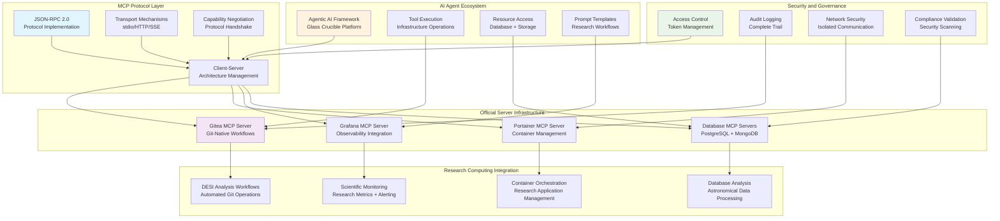

# 🔌 **MCP Servers**

This category provides comprehensive documentation for Model Context Protocol (MCP) server infrastructure supporting enterprise AI and agentic systems across the Proxmox Astronomy Lab's research computing platform. The documentation covers systematic deployment, security hardening, and operational management of MCP servers enabling AI agents to interact with infrastructure components, databases, and research services. These implementations provide the foundational protocol layer supporting advanced agentic AI workflows documented in the AI and Machine Learning section.

## **Overview**

MCP Servers represent the critical infrastructure layer enabling AI agents to interact systematically with research computing resources, database systems, container orchestration platforms, and observability infrastructure. The Proxmox Astronomy Lab implements enterprise-grade MCP server deployments centered on official vendor-supported implementations, security-hardened community servers, and systematic protocol management supporting the Glass Crucible agentic framework and collaborative intelligence systems.

The MCP infrastructure operates as the secure communication backbone between AI agents and enterprise systems, providing systematic tool execution, resource access, and prompt templates across the hybrid Kubernetes and VM architecture. These systems enable AI-driven infrastructure management, automated research workflows, database analysis capabilities, and systematic observability integration supporting scientific computing operations and collaborative research activities.

---

## **📁 Repository Structure**

```markdown
infrastructure/mcp-servers/
├── README.md                                    # This category overview document
├── protocol-implementation/
│   ├── README.md                               # MCP protocol implementation and standards
│   ├── json-rpc-communication/                # JSON-RPC 2.0 protocol implementation and message handling
│   ├── client-server-architecture/            # MCP client-server architecture and connection management
│   ├── transport-mechanisms/                   # stdio, HTTP, and SSE transport implementation
│   └── capability-negotiation/                # Protocol handshake and capability exchange procedures
├── official-server-deployments/
│   ├── README.md                               # Official vendor-supported MCP server deployments
│   ├── gitea-mcp-server/                       # Gitea official MCP server for Git-native workflows
│   ├── portainer-mcp-server/                   # Portainer official MCP server for container management
│   ├── grafana-mcp-server/                     # Grafana official MCP server for observability integration
│   └── prometheus-loki-integration/            # Prometheus and Loki MCP server coordination
├── database-server-implementations/
│   ├── README.md                               # Database MCP server implementations and management
│   ├── postgresql-mcp-servers/                 # PostgreSQL MCP server evaluation and deployment
│   ├── mongodb-mcp-integration/                # MongoDB official MCP server implementation
│   ├── vector-database-servers/                # Milvus and vector database MCP server coordination
│   └── graph-database-integration/             # Neo4j MCP server implementation and management
├── security-hardening/
│   ├── README.md                               # MCP server security implementation and validation
│   ├── access-control-management/              # Authentication, authorization, and token management
│   ├── network-security/                       # Network isolation and secure transport configuration
│   ├── audit-logging/                          # Comprehensive audit trail and security monitoring
│   └── vulnerability-assessment/               # Security scanning and compliance validation procedures
├── operational-management/
│   ├── README.md                               # MCP server operational procedures and lifecycle management
│   ├── deployment-automation/                  # Automated MCP server deployment and configuration
│   ├── monitoring-integration/                 # MCP server health monitoring and performance tracking
│   ├── backup-recovery/                        # MCP server backup procedures and disaster recovery
│   └── troubleshooting-procedures/             # Systematic troubleshooting and incident response
└── research-integration/
    ├── README.md                               # Research computing integration and scientific workflows
    ├── desi-analysis-integration/              # DESI research project MCP server coordination
    ├── scientific-database-access/             # Research database MCP server implementations
    ├── computational-workflow-integration/     # Research workflow automation and AI agent coordination
    └── collaborative-research-support/         # Multi-user research environment MCP server management
```

---

## **📂 Directory Overview**

This section provides comprehensive navigation to all MCP server infrastructure implementations and operational procedures.

### **🔌 Protocol Foundation Infrastructure**

| **Component** | **Purpose** | **Implementation** |
|---------------|-------------|-------------------|
| **[protocol-implementation/](protocol-implementation/)** | MCP protocol implementation and standards | JSON-RPC communication, client-server architecture, transport mechanisms |
| **[security-hardening/](security-hardening/)** | MCP server security implementation and validation | Access control, network security, audit logging, vulnerability assessment |

### **🏢 Official Enterprise Implementations**

| **Component** | **Purpose** | **Implementation** |
|---------------|-------------|-------------------|
| **[official-server-deployments/](official-server-deployments/)** | Official vendor-supported MCP server deployments | Gitea, Portainer, Grafana official servers with enterprise support |
| **[database-server-implementations/](database-server-implementations/)** | Database MCP server implementations and management | PostgreSQL, MongoDB, vector databases, graph database integration |

### **⚙️ Operations and Management**

| **Component** | **Purpose** | **Implementation** |
|---------------|-------------|-------------------|
| **[operational-management/](operational-management/)** | MCP server operational procedures and lifecycle management | Deployment automation, monitoring integration, backup recovery |

### **🔬 Research Computing Integration**

| **Component** | **Purpose** | **Implementation** |
|---------------|-------------|-------------------|
| **[research-integration/](research-integration/)** | Research computing integration and scientific workflows | DESI analysis integration, scientific databases, computational workflows |

---

## **🏗️ Architecture & Design**

This section details the systematic architecture supporting enterprise-grade MCP server infrastructure enabling AI-driven research computing operations.

### **MCP Infrastructure Architecture**

The MCP server infrastructure implements comprehensive protocol management with systematic integration across enterprise systems, database platforms, container orchestration, and observability infrastructure supporting agentic AI workflows and research computing operations.



### **Official Server Implementation Strategy**

The enterprise MCP infrastructure prioritizes official vendor-supported implementations ensuring long-term stability, security compliance, and systematic integration with research computing workflows.

| **MCP Server Category** | **Implementation Approach** | **Enterprise Benefits** | **Research Computing Integration** |
|-------------------------|----------------------------|------------------------|-----------------------------------|
| **Version Control Integration** | Gitea official MCP server with systematic Git-native workflows | Enterprise-grade version control with AI agent integration | Automated research workflow management and collaborative development |
| **Container Orchestration** | Portainer official MCP server with read-only security mode | Secure container management with systematic AI agent oversight | Research application deployment and container lifecycle automation |
| **Observability Platform** | Grafana official MCP server with unified monitoring integration | Comprehensive observability with AI-driven analytics and alerting | Scientific monitoring with research metrics and performance analysis |
| **Database Management** | PostgreSQL and MongoDB official servers with security hardening | Enterprise database access with systematic AI agent integration | Astronomical database analysis and research data management |

### **Security-First Implementation Framework**

The MCP server security architecture implements comprehensive protection ensuring safe AI agent interaction with enterprise infrastructure while maintaining research computing capabilities and collaborative access.

| **Security Domain** | **Implementation Strategy** | **Protection Mechanisms** | **Research Computing Considerations** |
|---------------------|----------------------------|--------------------------|-------------------------------------|
| **Authentication and Authorization** | Token-based access control with least-privilege principles | Dedicated AI agent tokens with scoped permissions and rotation procedures | Controlled research resource access with systematic audit capabilities |
| **Network Security** | Isolated communication channels with encrypted transport | TLS encryption with certificate management and network segmentation | Secure research collaboration with protected data transmission |
| **Audit and Compliance** | Comprehensive logging with systematic security monitoring | Complete action audit trail with real-time alerting and analysis | Research governance with transparent AI agent activity tracking |
| **Vulnerability Management** | Continuous security scanning with automated remediation | Regular vulnerability assessment with patch management and compliance validation | Research infrastructure protection with systematic security maintenance |

### **Research Computing Integration Pattern**

Enterprise MCP servers implement specialized coordination supporting scientific workflows, astronomical data processing, and collaborative research operations with systematic AI agent assistance.

| **Research Domain** | **MCP Integration Pattern** | **AI Agent Capabilities** | **Scientific Benefits** |
|--------------------|----------------------------|---------------------------|------------------------|
| **DESI Data Analysis** | Automated Git workflows with systematic analysis coordination | AI-driven data processing with systematic result validation | Accelerated scientific discovery with reproducible analysis procedures |
| **Database Operations** | PostgreSQL MCP servers with astronomical query optimization | AI-assisted database analysis with performance tuning recommendations | Enhanced research productivity with intelligent database management |
| **Infrastructure Management** | Container orchestration with systematic research application deployment | AI-driven infrastructure optimization with resource allocation efficiency | Reliable research computing with intelligent resource management |
| **Collaborative Research** | Multi-user MCP server coordination with systematic access control | AI-facilitated collaboration with systematic knowledge sharing | Enhanced research collaboration with intelligent workflow coordination |

---

## **⚙️ Management and Operations**

This section provides systematic approaches to managing MCP server infrastructure operations across enterprise research computing environments.

### **MCP Server Lifecycle Management**

Enterprise MCP server operations require systematic deployment procedures, comprehensive monitoring integration, and systematic maintenance ensuring reliable AI agent integration for research computing applications.

| **Lifecycle Phase** | **Management Approach** | **MCP Infrastructure Considerations** |
|---------------------|------------------------|--------------------------------------|
| **Deployment Planning** | Systematic server selection with security validation and performance assessment | Research computing requirement analysis with AI agent integration planning |
| **Security Hardening** | Comprehensive security implementation with vulnerability assessment and access control | Enterprise security standards with research computing access requirements |
| **Operational Monitoring** | Continuous performance monitoring with systematic alerting and health validation | Research workflow integration with AI agent performance tracking |
| **Maintenance and Updates** | Systematic update procedures with security patch management and compatibility validation | Research continuity with minimal disruption to active scientific workflows |

### **Official Server Coordination**

Production MCP infrastructure implements comprehensive coordination across official vendor implementations ensuring optimal reliability while maintaining enterprise security and research computing integration requirements.

| **Server Category** | **Coordination Strategy** | **Operational Management** | **Research Computing Integration** |
|----------------------|---------------------------|----------------------------|-----------------------------------|
| **Gitea Integration** | Official server deployment with systematic Git workflow automation | Version control operations with AI agent coordination and audit capabilities | Research project management with automated workflow coordination |
| **Portainer Management** | Enterprise container orchestration with read-only security defaults | Container lifecycle management with systematic monitoring and resource optimization | Research application deployment with intelligent resource allocation |
| **Database Operations** | PostgreSQL and MongoDB servers with performance optimization | Database analysis with AI-driven query optimization and health monitoring | Scientific data processing with intelligent database management |
| **Observability Integration** | Grafana server coordination with comprehensive monitoring integration | Systematic observability with AI-driven analytics and alerting coordination | Research monitoring with scientific metrics and performance analysis |

### **Security Operations Strategy**

Enterprise MCP server security implements systematic protection ensuring safe AI agent operations while maintaining research computing capabilities and collaborative access requirements.

| **Security Category** | **Implementation Strategy** | **Monitoring Integration** |
|------------------------|----------------------------|---------------------------|
| **Access Control Management** | Token-based authentication with systematic privilege management | Access monitoring with audit trail and compliance validation |
| **Network Security** | Encrypted communication with systematic transport security | Network monitoring with traffic analysis and threat detection |
| **Audit and Compliance** | Comprehensive logging with systematic security validation | Security monitoring with incident response and compliance reporting |
| **Vulnerability Management** | Continuous scanning with systematic remediation procedures | Security assessment with automated patching and validation reporting |

---

## **🔒 Security & Compliance**

This section documents comprehensive security controls and compliance alignment for MCP server infrastructure within research computing environments.

⚠️ MCP SERVER SECURITY DISCLAIMER

*The MCP server implementations provide enterprise-grade AI agent integration for research computing requiring careful security management, systematic access control, and comprehensive audit capabilities. MCP servers enable AI agents to interact with enterprise infrastructure, database systems, and research resources. All MCP implementations follow enterprise security frameworks with specific attention to AI agent access control, systematic security validation, and appropriate governance aligned with research computing security requirements and institutional policies.*

### **MCP Infrastructure Security Controls**

Enterprise-grade security implementation guided by research computing standards for AI agent infrastructure integration. Security controls protect enterprise systems during AI agent interaction, ensure systematic access control, and maintain comprehensive audit capabilities while enabling collaborative research computing and intelligent infrastructure management.

| **Security Control Category** | **Implementation** | **Research Protection** |
|------------------------------|-------------------|------------------------|
| **AI Agent Access Control** | Token-based authentication with systematic privilege management and least-privilege principles | Controlled AI agent access to research infrastructure with comprehensive audit capabilities |
| **Protocol Security** | Encrypted MCP communication with systematic transport security and certificate management | Protected AI agent communication with enterprise infrastructure and research systems |
| **Infrastructure Protection** | Read-only default modes with explicit write authorization and systematic validation | Protected research infrastructure with controlled AI agent modification capabilities |
| **Audit and Monitoring** | Comprehensive AI agent activity logging with real-time monitoring and alerting | Transparent AI agent operations with complete audit trail and security validation |

### **Research Computing Compliance**

MCP server implementations align with research computing standards ensuring proper AI agent governance, systematic infrastructure protection, and appropriate usage policies for academic institutions and collaborative research environments.

| **Compliance Domain** | **Framework Alignment** | **Implementation Evidence** |
|----------------------|------------------------|---------------------------|
| **AI Agent Governance** | Systematic AI agent management with institutional policies and research computing frameworks | Comprehensive AI agent lifecycle management with audit capabilities and validation procedures |
| **Infrastructure Protection** | Enterprise security standards with systematic AI agent access control and monitoring | Protected research infrastructure with controlled AI agent integration and systematic security validation |
| **Research Data Security** | Research data protection with systematic AI agent access control and audit capabilities | Protected scientific data with controlled AI agent interaction and comprehensive governance |
| **Institutional Compliance** | University and research institution AI governance frameworks with systematic compliance validation | Alignment with institutional policies and research computing AI governance requirements |

---

## **🔗 Related Categories**

This section establishes systematic connections to other knowledge domains within the Proxmox Astronomy Lab ecosystem, demonstrating comprehensive integration across enterprise research computing infrastructure.

### **AI and Machine Learning Integration**

| **Category** | **Relationship** | **MCP Integration** |
|--------------|------------------|-------------------|
| **[../../ai-and-machine-learning/agentic-ai/mcp-server-integrations/](../../ai-and-machine-learning/agentic-ai/mcp-server-integrations/)** | Agentic AI implementation using MCP server infrastructure | Complete agentic AI framework implementation leveraging MCP server foundation |
| **[../../ai-and-machine-learning/distributed-frameworks/](../../ai-and-machine-learning/distributed-frameworks/)** | Ray and distributed AI integration | MCP server coordination with distributed AI frameworks and computational resources |

### **Infrastructure Integration**

| **Category** | **Relationship** | **MCP Integration** |
|--------------|------------------|-------------------|
| **[../databases/](../databases/)** | Database infrastructure and MCP server coordination | PostgreSQL and MongoDB MCP servers enabling AI agent database interaction |
| **[../gitops-portainer/](../gitops-portainer/)** | GitOps and container orchestration integration | Gitea and Portainer MCP servers supporting AI-driven infrastructure automation |
| **[../observability/](../observability/)** | Monitoring and observability infrastructure | Grafana MCP server enabling AI agent observability integration and analytics |
| **[../authentication/](../authentication/)** | Identity and access management coordination | MCP server authentication integration with enterprise identity systems |

### **Security and Research Integration**

| **Category** | **Relationship** | **MCP Integration** |
|--------------|------------------|-------------------|
| **[../../security-assurance/](../../security-assurance/)** | Security framework implementation and validation | MCP server security controls and systematic compliance validation |
| **[../../projects/](../../projects/)** | Research project infrastructure and AI integration | MCP server support for research workflow automation and scientific collaboration |
| **[../../reproducibility/](../../reproducibility/)** | Reproducible research infrastructure | MCP server integration supporting systematic reproducibility and research validation |

---

## **🚀 Getting Started**

This section provides systematic guidance for implementing MCP server infrastructure across different operational roles and research computing applications.

### **For Infrastructure Engineers**

**Protocol Implementation:** [protocol-implementation/](protocol-implementation/)  
**Official Deployments:** [official-server-deployments/](official-server-deployments/)  
**Security Hardening:** [security-hardening/](security-hardening/)  
**Operational Management:** [operational-management/](operational-management/)

### **For AI/ML Engineers**

**Database Integration:** [database-server-implementations/](database-server-implementations/)  
**Research Integration:** [research-integration/](research-integration/)  
**Security Implementation:** [security-hardening/](security-hardening/)  
**Agentic AI Framework:** [../../ai-and-machine-learning/agentic-ai/mcp-server-integrations/](../../ai-and-machine-learning/agentic-ai/mcp-server-integrations/)

### **For Research Computing Teams**

**Research Integration:** [research-integration/](research-integration/)  
**Database Access:** [database-server-implementations/](database-server-implementations/)  
**Scientific Workflows:** [research-integration/](research-integration/)  
**Security Compliance:** [security-hardening/](security-hardening/)

### **For Platform Administrators**

**Enterprise Management:** [official-server-deployments/](official-server-deployments/)  
**Security Implementation:** [security-hardening/](security-hardening/)  
**Operational Procedures:** [operational-management/](operational-management/)  
**Compliance Management:** [security-hardening/](security-hardening/)

---

## **Document Information**

| **Field** | **Value** |
|-----------|-----------|
| **Author** | VintageDon - <https://github.com/vintagedon> |
| **Created** | 2025-07-20 |
| **Last Updated** | 2025-07-20 |
| **Version** | 1.0 |

---
Tags: mcp-servers, model-context-protocol, ai-agent-infrastructure, official-server-deployments, security-hardening, research-integration, enterprise-ai, protocol-implementation
