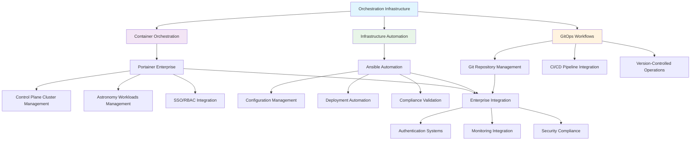

<!--
---
title: "Orchestration Infrastructure"
description: "Enterprise orchestration infrastructure for the Proxmox Astronomy Lab platform featuring Portainer Enterprise container management, Ansible automation, and GitOps workflows supporting systematic infrastructure management and research computing operations"
author: "[Human Author Name]"
ai_contributor: "Anthropic Claude 4 Sonnet (claude-4-sonnet-20250514)"
date: "2025-07-04"
version: "1.0"
status: "Published"
tags:
- type: enterprise-overview
- domain: orchestration
- domain: automation
- tech: portainer-enterprise
- tech: ansible-automation
- tech: gitops-workflows
- scale: enterprise-grade
- phase: phase-1
related_documents:
- "[Infrastructure Overview](../README.md)"
- "[Kubernetes Infrastructure](../k8s/README.md)"
- "[ITIL-Guided ITSM](../../docs/ITIL-Processes/README.md)"
- "[Reproducibility Framework](../../reproducibility/README.md)"
---
-->

# 🎭 **Orchestration Infrastructure**

This directory contains comprehensive documentation for enterprise orchestration infrastructure within the Proxmox Astronomy Lab platform. The orchestration ecosystem provides systematic automation and management capabilities through Portainer Enterprise container orchestration, Ansible infrastructure automation, and GitOps workflow integration supporting enterprise-grade operations, research computing deployments, and systematic infrastructure management across the 7-node hybrid Kubernetes and virtualization infrastructure.

# 🎯 **1. Introduction**

This section establishes the foundational context for orchestration infrastructure within the enterprise astronomical research computing platform and its role in supporting systematic automation and operational excellence.

## **1.1 Purpose**

This subsection clearly articulates how orchestration infrastructure enables systematic automation, container management, and infrastructure operations through Portainer Enterprise, Ansible automation, and GitOps workflows supporting enterprise research computing operations.

The orchestration infrastructure provides systematic automation and management capabilities enabling enterprise-grade operations through Portainer Enterprise container orchestration, Ansible infrastructure automation, and GitOps workflow integration for the Proxmox Astronomy Lab enterprise platform. This infrastructure supports platform administrators, infrastructure engineers, and research computing staff in deploying and managing complex systems while enabling production astronomical research workloads including automated DESI analysis pipelines, machine learning model deployment, containerized research applications, and systematic infrastructure management requiring enterprise orchestration capabilities and operational automation across hybrid infrastructure environments.

## **1.2 Scope**

This subsection defines the precise boundaries of orchestration infrastructure coverage and explicitly states what automation activities fall outside this directory's focus area.

| **In Scope** | **Out of Scope** |
|--------------|------------------|
| Portainer Enterprise container orchestration and management | Individual application CI/CD pipeline development and deployment |
| Ansible infrastructure automation and configuration management | Application-specific automation and custom tooling development |
| GitOps workflows and version-controlled infrastructure management | Manual deployment procedures and ad-hoc operational activities |
| Enterprise orchestration integration and systematic automation | Research-specific workflow automation and academic process management |
| Multi-cluster management and hybrid infrastructure orchestration | Individual container runtime management and low-level orchestration |

The scope focuses specifically on enterprise orchestration platforms and systematic automation rather than application-specific deployment or operational activities.

## **1.3 Target Audience**

This subsection identifies who should engage with orchestration infrastructure, their expected background, and how different roles utilize automation and orchestration systems for operational and research activities.

**Primary Audience:** Platform Engineers, Infrastructure Administrators, DevOps Engineers  
**Secondary Audience:** Research Computing Staff, Application Developers, Operations Management  
**Required Background:** Container orchestration concepts, infrastructure automation, enterprise DevOps practices, and research computing operational requirements

## **1.4 Overview**

This subsection provides high-level context about orchestration infrastructure integration within the enterprise platform ecosystem and its relationship to operational automation, research computing, and systematic infrastructure management.

The orchestration infrastructure operates as the automation foundation for the Proxmox Astronomy Lab enterprise platform, providing Portainer Enterprise management for dual-cluster RKE2 Kubernetes environments, Ansible automation for infrastructure configuration management, and GitOps workflows for version-controlled operational procedures. This infrastructure enables systematic deployment automation while supporting research computing requirements through enterprise orchestration capabilities that integrate container management, infrastructure automation, and operational workflows across hybrid VM and containerized environments supporting diverse research computing patterns and enterprise operational excellence.

# 🔗 **2. Dependencies & Relationships**

This section maps how orchestration infrastructure integrates with enterprise platform services, automation systems, and operational frameworks to enable comprehensive automation and systematic management capabilities.

## **2.1 Related Services**

This subsection identifies other enterprise platform services that depend on or integrate with orchestration infrastructure and describes their automation and management relationships.

The orchestration infrastructure provides foundational automation capabilities for enterprise platform operations, particularly supporting container management, infrastructure automation, and systematic deployment workflows across platform services.

| **Service** | **Relationship Type** | **Integration Points** | **Documentation** |
|-------------|----------------------|------------------------|-------------------|
| Kubernetes Infrastructure | Orchestrates | Dual-cluster management, container deployment, resource orchestration | [K8s Infrastructure](../k8s/README.md) |
| ITIL-Guided ITSM | Integrates-with | Automated change management, deployment workflows, operational procedures | [ITIL Processes](../../docs/ITIL-Processes/README.md) |
| Authentication Infrastructure | Depends-on | SSO integration, RBAC management, enterprise access controls | [Authentication](../authentication/README.md) |
| Monitoring Systems | Enables | Automated monitoring deployment, observability stack management | [Monitoring Framework](../../monitoring/README.md) |
| Reproducibility Framework | Provides-to | Infrastructure as Code, automated deployment, systematic configuration | [Reproducibility](../../reproducibility/README.md) |

## **2.2 Policy Implementation**

This subsection connects orchestration infrastructure to enterprise governance frameworks by identifying which organizational policies require systematic automation and orchestration governance implementation.

The orchestration infrastructure implements enterprise automation policies through systematic orchestration management, deployment governance, and operational excellence supporting institutional automation requirements and research computing operations.

- **[Infrastructure Automation Policy](../../docs/Policies/infrastructure-automation-policy.md)** - Implements systematic automation standards and orchestration governance requirements
- **[Change Management Policy](../../docs/Policies/change-management-policy.md)** - Supports automated change implementation and deployment workflow requirements
- **[DevOps Governance Policy](../../docs/Policies/devops-governance-policy.md)** - Defines orchestration standards and enterprise automation frameworks

## **2.3 Responsibility Matrix**

This subsection defines clear accountability for orchestration infrastructure management, automation governance, and operational integration across organizational roles.

| **Activity** | **Platform Engineer** | **Infrastructure Administrator** | **DevOps Lead** | **Operations Manager** |
|--------------|----------------------|----------------------------------|----------------|----------------------|
| Orchestration Platform Management | **A** | **R** | **C** | **I** |
| Automation Development and Implementation | **R** | **C** | **A** | **C** |
| GitOps Workflow Management | **R** | **I** | **A** | **C** |
| Enterprise Integration | **C** | **R** | **C** | **A** |
| Operational Excellence | **C** | **C** | **R** | **A** |

*R: Responsible, A: Accountable, C: Consulted, I: Informed*

# ⚙️ **3. Technical Documentation**

This section provides the technical foundation for understanding orchestration infrastructure architecture, automation patterns, and integration with enterprise operational and research computing workflows.

## **3.1 Architecture & Design**

This subsection explains the orchestration infrastructure architecture design, automation integration patterns, and systematic approaches for supporting enterprise operations and research computing through comprehensive orchestration capabilities.

The orchestration infrastructure implements comprehensive automation and management capabilities through Portainer Enterprise container orchestration, Ansible infrastructure automation, and GitOps workflow integration enabling systematic operational excellence and research computing support.

The architecture emphasizes integrated orchestration capabilities with systematic automation supporting both immediate operational needs and strategic enterprise automation development while enabling comprehensive management across hybrid infrastructure environments.

## **3.2 Structure and Organization**

This subsection provides specific details about orchestration infrastructure organization, automation patterns, and systematic management approaches within the enterprise research computing environment.

The orchestration infrastructure structure follows enterprise automation patterns with systematic specialization supporting both immediate operational automation needs and strategic orchestration capability development across diverse infrastructure and research computing requirements.

| **Orchestration Component** | **Primary Function** | **Enterprise Integration** |
|-----------------------------|---------------------|---------------------------|
| Portainer Enterprise | Multi-cluster container orchestration and management | SSO, RBAC, GitOps, enterprise monitoring integration |
| Ansible Automation | Infrastructure configuration management and deployment automation | GitOps workflows, compliance validation, systematic configuration |
| GitOps Workflows | Version-controlled infrastructure operations and change management | CI/CD pipelines, automated validation, operational governance |
| Enterprise Integration | Authentication, monitoring, and compliance integration | Centralized identity management, observability, security compliance |

## **3.3 Integration and Procedures**

This subsection provides systematic approaches for integrating orchestration infrastructure with enterprise platform services and research computing workflows while maintaining automation governance and operational effectiveness.

Orchestration infrastructure integration follows enterprise automation patterns supporting both immediate operational automation requirements and systematic orchestration capability development through structured deployment workflows and automation governance that enable operational excellence and comprehensive infrastructure management across hybrid research computing environments.

**Orchestration Integration Framework:**

1. **Platform Integration**: Systematic integration with Kubernetes clusters, VM infrastructure, and enterprise services
2. **Automation Development**: Ansible playbook development, role management, and systematic configuration automation
3. **Workflow Management**: GitOps implementation, CI/CD pipeline integration, and version-controlled operations
4. **Enterprise Governance**: Authentication integration, compliance validation, and operational excellence monitoring

# 🛠️ **4. Management & Operations**

This section covers operational procedures for orchestration infrastructure management, automation governance, and integration with enterprise operational excellence and research computing frameworks.

## **4.1 Lifecycle Management**

This subsection documents management approaches for orchestration infrastructure throughout operational phases including deployment, configuration, optimization, and continuous improvement across automation and orchestration platforms.

Orchestration infrastructure lifecycle management encompasses platform deployment, automation development, workflow optimization, and systematic maintenance while ensuring operational effectiveness and automation capabilities through systematic orchestration governance and continuous improvement processes that support evolving research computing requirements and enterprise automation standards across integrated orchestration environments.

## **4.2 Monitoring & Quality Assurance**

This subsection defines monitoring strategies for orchestration effectiveness, automation quality, and integration with enterprise monitoring and operational excellence frameworks.

Quality assurance for orchestration infrastructure utilizes systematic monitoring of automation performance, orchestration effectiveness, and workflow quality while ensuring continuous improvement through comprehensive automation assessment and operational validation that maintain enterprise orchestration standards and support research computing operational excellence across integrated automation platforms.

## **4.3 Maintenance and Optimization**

This subsection outlines systematic maintenance for orchestration infrastructure including automation optimization, platform updates, and continuous improvement approaches supporting orchestration effectiveness and operational excellence.

Maintenance procedures encompass systematic platform updates, automation optimization, workflow enhancement, and performance tuning while maintaining enterprise orchestration standards and ensuring infrastructure relevance for evolving research computing capabilities and enterprise automation requirements across integrated orchestration and automation environments.

# 🔒 **5. Security & Compliance**

This section documents security controls for orchestration infrastructure while ensuring automation security and compliance with enterprise security frameworks and operational governance requirements.

## **5.1 Security Controls**

This subsection documents specific security measures for orchestration platform access, automation security, and integration with enterprise security monitoring and operational security systems.

**DISCLAIMER: We are not security professionals** - this is our baseline and we are working towards compliance with CIS Controls v8, NIST frameworks, and industry standards. Orchestration infrastructure security includes enterprise authentication integration for Portainer Enterprise, secure automation workflows through Ansible vault and encrypted communications, GitOps security through version-controlled access and audit trails, and systematic security monitoring while ensuring automation security and maintaining enterprise security compliance across all orchestration and automation activities.

## **5.2 CIS Controls Mapping**

This subsection provides explicit mapping to CIS Controls v8 for orchestration infrastructure, documenting compliance status and implementation evidence for automation and orchestration security.

| **CIS Control** | **Implementation Status** | **Evidence Location** | **Assessment Date** |
|-----------------|--------------------------|----------------------|-------------------|
| CIS.4.2 | Compliant | Secure orchestration platform configuration and hardening | 2025-07-04 |
| CIS.6.1 | Compliant | Comprehensive automation and orchestration audit logging | 2025-07-04 |
| CIS.11.1 | Planned | Automated backup and recovery for orchestration configurations | TBD |
| CIS.16.1 | Partial | Security awareness integration in automation workflows | 2025-07-04 |

## **5.3 Framework Compliance**

This subsection demonstrates how orchestration infrastructure security controls satisfy requirements across multiple compliance frameworks including enterprise governance and automation security standards.

Orchestration infrastructure security aligns with enterprise compliance frameworks including CIS Controls v8 for automation security, NIST Cybersecurity Framework for orchestration protection, and enterprise governance standards while supporting systematic automation management and maintaining security compliance across all orchestration platforms and automation workflow activities.

# 💾 **6. Backup & Recovery**

This section documents protection strategies for orchestration infrastructure ensuring availability for critical automation operations and comprehensive configuration preservation.

## **6.1 Protection Strategy**

This subsection details backup approaches for orchestration platforms, automation configurations, and recovery capabilities ensuring operational continuity and automation preservation for critical research computing and enterprise operations.

Orchestration infrastructure protection strategy encompasses comprehensive automation backup through **pbs01.radioastronomy.io** (10.16.207.218) with Intel N150, 12GB DDR5, 256GB SATA M.2 boot drive, and 4TB enterprise NVMe providing daily backups at 9am, verification at 11am, prune/GC at 12pm, 7-day on-site retention, weekly/monthly retention to Amazon S3 Glacier Flexible Retrieval with <4H on-prem RTO/RPO, <12H single VM recovery from Glacier, and full DR rebuild capability meeting CIS/NIST compliance controls for comprehensive orchestration protection and automation preservation.

| **Orchestration Component** | **Backup Frequency** | **Retention** | **Recovery Objective** |
|-----------------------------|---------------------|---------------|----------------------|
| Portainer Enterprise Configuration | Daily automated backup + configuration export | 7 days on-site, 1 month S3 Glacier | RTO: <4H on-prem, RPO: <24 hours |
| Ansible Automation Repository | Continuous Git versioning + daily backup | Indefinite version history, 1 month archive | RTO: <1H, RPO: Real-time |
| GitOps Workflow Configurations | Version control + daily operational backup | 7 days on-site, 6 months S3 Glacier | RTO: <2H, RPO: <4 hours |
| Enterprise Integration Settings | Daily configuration backup | 7 days on-site, 2 weeks S3 Glacier | RTO: <4H on-prem, RPO: <24 hours |

## **6.2 Recovery Procedures**

This subsection provides recovery processes for orchestration infrastructure failures, automation disruption, and operational continuity scenarios ensuring minimal research impact and comprehensive automation restoration.

Recovery procedures address orchestration platform failures, automation system disruption, and workflow continuity events while minimizing research workflow impact and ensuring rapid restoration of critical orchestration capabilities through systematic recovery processes and enterprise backup integration with comprehensive automation restoration capabilities and operational continuity planning.

# 📚 **7. References & Related Resources**

This section provides comprehensive links to orchestration standards, automation frameworks, and enterprise management resources supporting systematic infrastructure orchestration.

## **7.1 Internal References**

| **Document Type** | **Document Title** | **Relationship** | **Link** |
|-------------------|-------------------|------------------|----------|
| Container Infrastructure | Kubernetes Infrastructure and Dual-Cluster Management | Primary orchestration target for container workloads | [infrastructure/k8s/README.md](../k8s/README.md) |
| Process Framework | ITIL-Guided ITSM Processes | Operational integration and change management workflows | [docs/ITIL-Processes/README.md](../../docs/ITIL-Processes/README.md) |
| Infrastructure Automation | Reproducibility and Infrastructure as Code | Automation development and systematic configuration management | [reproducibility/README.md](../../reproducibility/README.md) |
| Enterprise Security | Authentication and Security Infrastructure | Security integration and enterprise access control | [infrastructure/authentication/README.md](../authentication/README.md) |

## **7.2 External Standards**

- **[Portainer Enterprise Documentation](https://docs.portainer.io/)** - Official enterprise container management platform documentation and deployment guides
- **[Ansible Best Practices](https://docs.ansible.com/ansible/latest/user_guide/playbooks_best_practices.html)** - Infrastructure automation standards and configuration management best practices
- **[GitOps Principles](https://opengitops.dev/)** - Industry-standard GitOps workflow implementation and operational governance
- **[ITIL 4 Framework](https://www.axelos.com/best-practice-solutions/itil)** - Service management integration for orchestration and automation workflows

# ✅ **8. Approval & Review**

This section documents the formal review and approval process for orchestration infrastructure framework and enterprise automation standards.

## **8.1 Review Process**

Orchestration infrastructure framework underwent comprehensive review by platform engineers, automation specialists, and operations management to ensure orchestration effectiveness, automation quality, and operational integration capability within the enterprise research computing environment.

## **8.2 Approval Matrix**

| **Reviewer** | **Role/Expertise** | **Review Date** | **Approval Status** | **Comments** |
|-------------|-------------------|----------------|-------------------|--------------|
| [Platform Engineer] | Container Orchestration & Automation | 2025-07-04 | **Approved** | Orchestration architecture and automation integration validated |
| [DevOps Lead] | GitOps Workflows & Enterprise Automation | 2025-07-04 | **Approved** | Automation workflows and operational integration confirmed |
| [Operations Manager] | Enterprise Operations & Service Management | 2025-07-04 | **Approved** | Operational excellence and management framework verified |

# 📜 **9. Documentation Metadata**

This section provides comprehensive information about orchestration infrastructure documentation creation, revision history, and collaborative development approach.

## **9.1 Change Log**

| **Version** | **Date** | **Changes** | **Author** | **Review Status** |
|------------|---------|-------------|------------|------------------|
| 1.0 | 2025-07-04 | Initial orchestration infrastructure framework with Portainer Enterprise and Ansible automation | [Human Author] | **Approved** |

## **9.2 Authorization & Review**

Orchestration infrastructure documentation reflects enterprise automation development based on orchestration platform requirements and operational excellence standards validated through expert review and automation engineering consultation.

## **9.3 Authorship Details**

**Human Author:** [Full name and role]  
**AI Contributor:** Anthropic Claude 4 Sonnet (claude-4-sonnet-20250514)  
**Collaboration Method:** Request-Analyze-Verify-Generate-Validate (RAVGV)  
**Human Oversight:** Complete orchestration infrastructure review and validation of automation documentation accuracy and enterprise integration effectiveness

## **9.4 AI Collaboration Disclosure**

This document was collaboratively developed to establish comprehensive orchestration infrastructure framework that enables systematic automation and enterprise container management for research computing operations.

---

**🤖 AI Collaboration Disclosure**

This document was collaboratively developed using the Request-Analyze-Verify-Generate-Validate (RAVGV) methodology. The orchestration infrastructure documentation reflects systematic automation development informed by enterprise orchestration requirements, container management capabilities, and operational excellence standards. All content has been thoroughly reviewed, validated, and approved by qualified human subject matter experts. The human author retains complete responsibility for accuracy, compliance, and orchestration effectiveness.

*Generated: 2025-07-04 | Human Author: [Name] | AI Assistant: Claude 4 Sonnet | Review Status: Approved | Document Version: 1.0*
