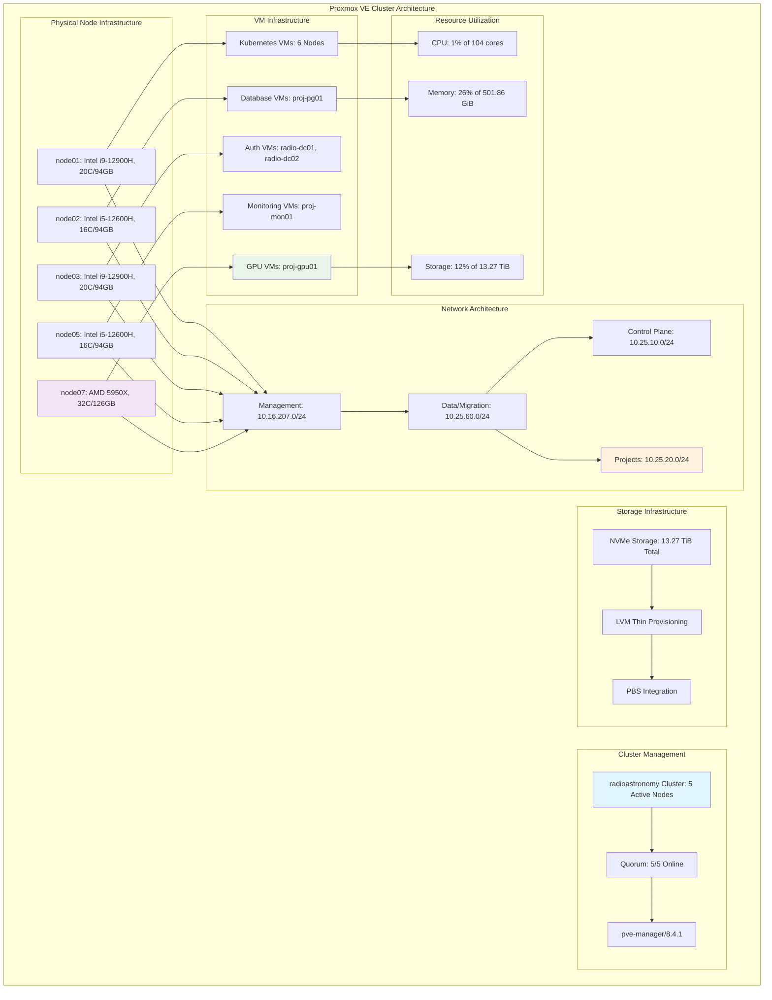

<!--
---
title: "Proxmox VE Hypervisor Administration Guide"
description: "Comprehensive Proxmox VE 8.4.1 cluster administration and management guide for astronomical research computing, including hypervisor configuration, VM lifecycle management, and enterprise virtualization operations for the radioastronomy cluster infrastructure"
author: "[Human Author Name]"
ai_contributor: "Anthropic Claude 4 Sonnet (claude-4-sonnet-20250514)"
date: "2025-07-04"
version: "1.0"
status: "Published"
tags:
- type: implementation-guide
- domain: hypervisor-management
- domain: virtualization-infrastructure
- tech: proxmox-ve-8.4.1
- tech: enterprise-virtualization
- tech: cluster-management
- compliance: cis-benchmark
- phase: phase-1
related_documents:
- "[Infrastructure Architecture](../README.md)"
- "[VM Lifecycle Management](vm-lifecycle-management.md)"
- "[Resource Allocation Strategies](resource-allocation-strategies.md)"
- "[Hybrid Architecture Management](hybrid-architecture-management.md)"
- "[Kubernetes Platform](../k8s/README.md)"
---
-->

# 🖥️ **Proxmox VE Hypervisor Administration Guide**

This document provides comprehensive Proxmox VE 8.4.1 cluster administration procedures for astronomical research computing, showcasing enterprise-grade hypervisor management, systematic VM lifecycle operations, and production virtualization infrastructure that enables high-performance research computing, collaborative scientific discovery, and enterprise-grade operational excellence for the radioastronomy cluster supporting DESI analysis and astronomical research workflows.

# 🎯 **1. Introduction**

This section establishes the foundational context for Proxmox VE administration within the PROXMOX-ASTRONOMY-LAB enterprise platform, defining hypervisor management objectives, cluster architecture requirements, and integration with research computing operational excellence.

## **1.1 Purpose**

This subsection explains how Proxmox VE administration enables enterprise-grade virtualization management through systematic hypervisor operations, comprehensive VM lifecycle management, and production-ready cluster administration optimized for research computing excellence.

The Proxmox VE Hypervisor Administration provides comprehensive virtualization foundation for the PROXMOX-ASTRONOMY-LAB enterprise platform, enabling systematic hypervisor management through Proxmox VE 8.4.1 enterprise cluster administration including 5-node radioastronomy cluster operations (104 cores, 501.86 GiB RAM, 13.27 TiB storage), production VM lifecycle management, enterprise resource allocation, and systematic virtualization operations that support infrastructure administrators, research computing specialists, and platform engineers in managing astronomical research infrastructure, optimizing resource utilization for DESI analysis workloads, and maintaining enterprise-grade operational reliability essential for collaborative scientific discovery, research computing continuity, and systematic platform management across hybrid Kubernetes/VM architecture supporting astronomical data processing and research collaboration workflows.

## **1.2 Scope**

This subsection defines the precise boundaries of Proxmox VE administration coverage, establishing what hypervisor management components and virtualization activities are included within the enterprise cluster administration framework.

| **In Scope** | **Out of Scope** |
|--------------|------------------|
| Proxmox VE 8.4.1 cluster management and administration | Individual VM application configuration and optimization |
| 5-node radioastronomy cluster operations and monitoring | External cloud provider integration and management |
| VM lifecycle management and resource allocation | Guest operating system installation and customization |
| Storage management and backup infrastructure integration | Third-party virtualization platform migration |
| Network configuration and VLAN management | Custom hypervisor kernel modification and development |
| High availability and cluster maintenance procedures | Individual research application deployment and configuration |
| Enterprise security hardening and access control | External storage array configuration and management |
| Performance monitoring and capacity planning | Hardware firmware management and BIOS configuration |

The administration scope focuses specifically on Proxmox VE hypervisor management and cluster operations rather than individual VM configuration or external infrastructure integration.

## **1.3 Target Audience**

This subsection identifies stakeholders who perform Proxmox VE administration activities and their expected technical background for effective hypervisor management and cluster operations.

**Primary Audience:** Infrastructure administrators, virtualization specialists, and enterprise hypervisor engineers responsible for cluster management
**Secondary Audience:** Research computing administrators, platform engineers, and operations teams supporting virtualization infrastructure
**Required Background:** Understanding of enterprise virtualization, Proxmox VE administration, research computing infrastructure, and hypervisor cluster management

## **1.4 Overview**

This subsection provides high-level context about Proxmox VE administration's role in enabling enterprise-grade virtualization for astronomical research computing and scientific collaboration infrastructure.

The Proxmox VE administration implements enterprise-grade hypervisor management through systematic cluster operations, comprehensive VM lifecycle management, and production-ready virtualization infrastructure that enables astronomical research computing while maintaining operational excellence and resource optimization. This implementation supports research computing scalability while ensuring appropriate resource allocation and cluster reliability across the hybrid infrastructure.

# 🔗 **2. Dependencies & Relationships**

This section maps how Proxmox VE administration integrates with platform services, infrastructure components, and operational systems to enable comprehensive virtualization management across the astronomical research computing environment.

## **2.1 Related Services**

This subsection identifies platform services that depend on, utilize, or integrate with Proxmox VE cluster to provide comprehensive research computing and systematic virtualization capabilities.

Proxmox VE cluster provides foundational virtualization that enables systematic research computing and infrastructure operations across platform services:

| **Service** | **Relationship Type** | **Integration Points** | **Documentation** |
|-------------|----------------------|------------------------|-------------------|
| **Kubernetes Platform** | **Hosts** | RKE2 cluster VMs, container orchestration infrastructure | [K8s Platform](../k8s/README.md) |
| **Database Services** | **Virtualizes** | PostgreSQL instances, research data management VMs | [Database Services](../databases/README.md) |
| **Authentication Services** | **Provides-VMs-for** | Domain controller hosting, identity management infrastructure | [Authentication](../authentication/README.md) |
| **AI/ML Infrastructure** | **Enables** | GPU passthrough, high-performance computing VMs | [AI/ML](../../ai/README.md) |
| **Monitoring Framework** | **Monitored-by** | Hypervisor metrics, VM performance, resource utilization | [Monitoring](../../monitoring/README.md) |
| **Backup Infrastructure** | **Protected-by** | VM backup operations, disaster recovery procedures | [Backup Strategy](vm-lifecycle-management.md) |
| **Research Projects** | **Supports** | DESI analysis VMs, scientific computing infrastructure | [Research Portfolio](../../projects/README.md) |

These service relationships ensure comprehensive virtualization support while enabling systematic research computing and scientific discovery workflows.

## **2.2 Policy Implementation**

This subsection connects Proxmox VE administration to enterprise governance by identifying organizational policies implemented through hypervisor management controls and virtualization procedures.

Proxmox VE administration implements enterprise policies through systematic virtualization governance and operational standards. Hypervisor procedures adhere to enterprise infrastructure management frameworks through resource allocation policies, security hardening implementation, and comprehensive operational procedures. Virtualization governance ensures appropriate resource utilization, security compliance, and operational excellence while maintaining research computing effectiveness and collaborative scientific capabilities.

## **2.3 Responsibility Matrix**

This subsection defines clear accountability for Proxmox VE administration activities across organizational roles, ensuring effective hypervisor management and systematic cluster operations.

| **Activity** | **Infrastructure Admin** | **Virtualization Specialist** | **Research Computing** | **Security Specialist** |
|--------------|--------------------------|--------------------------------|----------------------|------------------------|
| **Cluster Management** | **A** | **R** | **C** | **I** |
| **VM Lifecycle Operations** | **A** | **R** | **C** | **I** |
| **Resource Allocation** | **R** | **A** | **C** | **I** |
| **Security Hardening** | **C** | **R** | **I** | **A** |
| **Performance Optimization** | **A** | **R** | **C** | **I** |
| **Backup Operations** | **A** | **C** | **I** | **I** |
| **Research Infrastructure** | **C** | **R** | **A** | **I** |

*R: Responsible, A: Accountable, C: Consulted, I: Informed*

# ⚙️ **3. Proxmox VE Cluster Architecture**

This section provides comprehensive information about Proxmox VE cluster design, node specifications, and systematic approaches for enterprise hypervisor management across the astronomical research computing infrastructure.

## **3.1 Architecture & Design**

This subsection explains the comprehensive Proxmox VE cluster architecture, node relationships, and design decisions for enterprise virtualization across the radioastronomy research computing platform.

The Proxmox VE cluster architecture implements enterprise-grade hypervisor infrastructure optimized for research computing workloads through systematic deployment across physical nodes and production-ready configuration:

The architecture emphasizes high availability, optimal resource utilization, and systematic VM distribution while supporting enterprise research computing requirements.

## **3.2 Node Configuration and Resource Specifications**

This subsection provides detailed node specifications, resource allocation, and hardware configuration for each Proxmox VE cluster member supporting the astronomical research computing infrastructure.

The Proxmox VE cluster implements distributed high-availability configuration across heterogeneous hardware optimized for research computing workloads and enterprise virtualization:

### **Cluster Node Specifications**

| **Node** | **Hardware Platform** | **Network Configuration** | **VM Hosting Capacity** |
|----------|----------------------|---------------------------|-------------------------|
| **node01** | Intel i9-12900H, 20 cores, 94GB RAM, 1.92TB NVMe | Management: 10.16.207.61, Data: 10.25.60.231 | High-performance VMs |
| **node02** | Intel i5-12600H, 16 cores, 94GB RAM, 2TB Samsung 990 PRO | Management: 10.16.207.62, Data: 10.25.60.232 | Database and storage VMs |
| **node03** | Intel i9-12900H, 20 cores, 94GB RAM, 1.92TB NVMe | Management: 10.16.207.63, Data: 10.25.60.233 | Kubernetes and infrastructure VMs |
| **node05** | Intel i5-12600H, 16 cores, 94GB RAM, Dual NVMe | Management: 10.16.207.65, Data: 10.25.60.235 | Infrastructure and monitoring VMs |
| **node07** | AMD Ryzen 9 5950X, 32 cores, 126GB RAM, 4TB NVMe | Management: 10.16.207.67, Data: 10.25.60.237 | GPU and high-compute VMs |

### **Virtual Machine Distribution Strategy**

| **VM Category** | **Node Allocation** | **Resource Strategy** | **Performance Optimization** |
|-----------------|-------------------|----------------------|------------------------------|
| **Kubernetes Control Plane** | node01, node02, node03 | VLAN 10 isolation | High availability across nodes |
| **Kubernetes Workers** | node01, node02, node03 | VLAN 20 projects | CPU-optimized distribution |
| **Database Services** | node02 (Samsung 990 PRO) | High-performance storage | NVMe optimization for I/O |
| **GPU Computing** | node07 (AMD 5950X) | PCI passthrough | Dedicated high-performance node |
| **Infrastructure Services** | node05 (dual NVMe) | Storage and monitoring | Distributed infrastructure load |

### **Enterprise Storage Configuration**

| **Storage Type** | **Technology** | **Capacity** | **Use Case** |
|------------------|---------------|--------------|--------------|
| **Local Storage** | NVMe LVM-Thin | 13.27 TiB total | VM storage and performance |
| **Boot Volumes** | nvme0n1p3 (pve) | 273.80 GiB per node | Proxmox VE system storage |
| **VM Storage** | nvme0n1p4 (nvmethin01) | Variable per node | Virtual machine disk allocation |
| **Backup Storage** | PBS integration | External 4TB NVMe | Comprehensive VM protection |

## **3.3 VM Lifecycle Management and Operational Procedures**

This subsection provides systematic approaches for VM lifecycle management, operational procedures, and enterprise virtualization administration across the Proxmox VE cluster infrastructure.

VM lifecycle management follows enterprise operational patterns that ensure optimal resource utilization and systematic virtual machine operations while maintaining research computing effectiveness and operational reliability:

**VM Lifecycle Phases:**

1. **Planning and Resource Allocation**: Determine appropriate node placement and resource requirements
2. **Deployment and Configuration**: Create VMs with enterprise security and performance optimization
3. **Operational Management**: Monitor performance, manage resources, and maintain operational excellence
4. **Maintenance and Updates**: Systematic VM maintenance and platform updates
5. **Migration and Scaling**: Live migration and resource scaling for research computing demands
6. **Decommissioning**: Systematic VM retirement and resource reclamation

**Enterprise Operational Procedures:**

- **High Availability**: Automatic VM restart and node failover for critical research services
- **Live Migration**: Zero-downtime VM movement for maintenance and load balancing
- **Resource Management**: Dynamic CPU and memory allocation based on research workload demands
- **Backup Integration**: Automated VM backup through Proxmox Backup Server integration
- **Performance Monitoring**: Comprehensive resource utilization tracking and optimization
- **Security Hardening**: VM security configuration and compliance with enterprise standards

# 🛠️ **4. Cluster Administration Procedures**

This section covers comprehensive Proxmox VE cluster administration procedures, including daily operations, maintenance activities, and enterprise management tasks across the astronomical research computing infrastructure.

## **4.1 Daily Operations and Cluster Monitoring**

This subsection documents systematic daily operational procedures for Proxmox VE cluster management, including performance monitoring, resource validation, and operational health verification.

Daily operations follow enterprise operational patterns that ensure optimal cluster performance and systematic monitoring for research computing reliability. Operations include comprehensive cluster health validation, resource utilization monitoring, and proactive maintenance procedures that maintain enterprise operational excellence and research computing continuity.

**Daily Operational Checklist:**

- **Cluster Status Verification**: Confirm all nodes online and quorum maintained
- **Resource Utilization Review**: Monitor CPU, memory, and storage utilization across nodes
- **VM Health Assessment**: Verify critical research VMs operational and performing optimally
- **Backup Status Validation**: Confirm daily backup operations completed successfully
- **Network Performance Check**: Validate management and data network connectivity
- **Alert Review**: Address any system alerts or performance warnings

## **4.2 VM Management and Resource Optimization**

This subsection defines systematic VM management procedures, including resource allocation, performance optimization, and operational efficiency enhancement across the cluster infrastructure.

VM management implements enterprise-grade virtualization operations including systematic resource allocation, performance optimization, and operational procedures that ensure optimal utilization for research computing workloads. Management procedures include capacity planning, resource scaling, and performance tuning that enable enterprise-grade virtualization operations while maintaining research computing effectiveness.

**VM Management Framework:**

1. **Resource Allocation**: Systematic CPU, memory, and storage allocation based on workload requirements
2. **Performance Tuning**: VM configuration optimization for research computing and database workloads
3. **Live Migration**: Strategic VM movement for load balancing and maintenance operations
4. **Backup Management**: Comprehensive VM backup scheduling and disaster recovery procedures
5. **Security Configuration**: Enterprise security hardening and access control implementation
6. **Capacity Planning**: Resource forecasting and scaling strategies for research computing growth

## **4.3 Maintenance and System Updates**

This subsection outlines systematic maintenance procedures, system updates, and enterprise cluster management activities that ensure continued operational excellence and platform reliability.

Maintenance procedures follow enterprise operational standards including systematic update management, security patching, and comprehensive cluster maintenance that ensures platform reliability while minimizing research computing disruption. Maintenance activities include planned downtime coordination, rolling updates, and systematic validation procedures that maintain enterprise operational excellence.

**Maintenance Framework:**

- **Planned Maintenance Windows**: Coordinated maintenance scheduling with research teams
- **Rolling Updates**: Systematic node updates with zero-downtime for critical services
- **Security Patching**: Regular Proxmox VE and hypervisor security updates
- **Hardware Monitoring**: Proactive hardware health monitoring and predictive maintenance
- **Performance Optimization**: Regular cluster performance tuning and resource optimization
- **Documentation Updates**: Systematic documentation maintenance and operational procedure updates

# 🔒 **5. Security & Compliance**

This section documents security controls and compliance alignment for Proxmox VE cluster administration, ensuring enterprise-grade security implementation and systematic compliance management for hypervisor infrastructure.

## **5.1 Security Controls**

This subsection documents specific security measures and verification methods that protect Proxmox VE cluster infrastructure and ensure systematic security management for enterprise virtualization.

**DISCLAIMER: We are not security professionals** - this is our baseline and we are working towards compliance with CIS Controls v8, NIST frameworks, and industry standards. Proxmox VE security implements enterprise-grade controls adapted for hypervisor environments and research computing requirements. Cluster security includes network segmentation, access control implementation, comprehensive audit logging, and systematic security monitoring. Hypervisor security leverages enterprise virtualization security frameworks, host-level protection, and VM isolation controls for research computing security.

## **5.2 CIS Controls Mapping**

This subsection provides explicit mapping to CIS Controls v8, documenting compliance status and implementation evidence for enterprise Proxmox VE security.

| **CIS Control** | **Implementation Status** | **Evidence Location** | **Assessment Date** |
|-----------------|--------------------------|----------------------|-------------------|
| **CIS.1.1** | **Compliant** | Hypervisor asset inventory and cluster management | 2025-07-04 |
| **CIS.4.1** | **Compliant** | Network segmentation and VLAN configuration | 2025-07-04 |
| **CIS.11.1** | **Partial** | VM backup and disaster recovery procedures | 2025-07-04 |
| **CIS.12.1** | **Compliant** | Network monitoring and traffic analysis | 2025-07-04 |

## **5.3 Framework Compliance**

This subsection demonstrates how Proxmox VE security controls satisfy requirements across multiple compliance frameworks relevant to enterprise virtualization and research computing infrastructure.

Proxmox VE security compliance integrates enterprise hypervisor security standards with research computing requirements and operational excellence principles. Framework alignment ensures appropriate protection for virtualization infrastructure while maintaining cluster performance and research computing effectiveness.

# 💾 **6. Backup & Recovery**

This section documents protection strategies for Proxmox VE cluster infrastructure, ensuring hypervisor continuity and comprehensive protection for enterprise virtualization systems.

## **6.1 Protection Strategy**

This subsection details backup approaches, schedules, and retention policies optimized for Proxmox VE cluster infrastructure and enterprise virtualization protection.

Proxmox VE cluster protection strategy encompasses comprehensive backup through **pbs01.radioastronomy.io** (10.16.207.218) with Intel N150, 12GB DDR5, 256GB SATA M.2 boot drive, and 4TB enterprise NVMe providing daily backups at 9am, verification at 11am, prune/GC at 12pm, 7-day on-site retention, weekly/monthly retention to Amazon S3 Glacier Flexible Retrieval with <4H on-prem RTO/RPO, <12H hypervisor cluster recovery from Glacier, and full virtualization platform rebuild capability meeting CIS/NIST compliance controls for comprehensive Proxmox VE infrastructure protection and research computing continuity.

| **Infrastructure Component** | **Backup Frequency** | **Retention** | **Recovery Objective** |
|------------------------------|---------------------|---------------|----------------------|
| **Cluster Configuration** | **Daily configuration backup** | **7 days on-site, 1 year S3** | **RTO: <2H / RPO: <24H** |
| **Critical VMs** | **Daily full backup** | **7 days on-site, 1 month S3** | **RTO: <4H / RPO: <24H** |
| **Node System State** | **Weekly full backup** | **4 weeks on-site, 6 months S3** | **RTO: <8H / RPO: 1 week** |
| **Network Configuration** | **Daily backup + version control** | **Indefinite** | **RTO: <1H / RPO: 0** |

## **6.2 Recovery Procedures**

This subsection provides recovery processes for different failure scenarios specific to Proxmox VE cluster infrastructure and enterprise virtualization requirements.

Proxmox VE cluster recovery procedures prioritize rapid restoration of hypervisor capabilities and research computing infrastructure continuity. Recovery strategies include automated cluster restoration, VM recovery procedures, and complete infrastructure rebuilding capabilities. Emergency procedures address critical hypervisor failures during research computing operations while maintaining virtualization service availability throughout recovery processes.

# 📚 **7. References & Related Resources**

This section provides comprehensive connections to supporting documentation, Proxmox VE standards, and related platform components that inform and extend hypervisor administration capabilities.

## **7.1 Internal References**

| **Document Type** | **Document Title** | **Relationship** | **Link** |
|-------------------|-------------------|------------------|----------|
| **Infrastructure** | Infrastructure Architecture | Virtualization hosting foundation | [Infrastructure](../README.md) |
| **VM Management** | VM Lifecycle Management | Virtual machine operational procedures | [VM Lifecycle](vm-lifecycle-management.md) |
| **Resource Planning** | Resource Allocation Strategies | Capacity planning and optimization | [Resource Allocation](resource-allocation-strategies.md) |
| **Hybrid Architecture** | Hybrid Architecture Management | Kubernetes and VM integration | [Hybrid Management](hybrid-architecture-management.md) |
| **Kubernetes** | Kubernetes Platform | Container orchestration hosting | [K8s Platform](../k8s/README.md) |

## **7.2 External Standards**

- **[Proxmox VE Documentation](https://pve.proxmox.com/pve-docs/)** - Official Proxmox VE administration and cluster management documentation
- **[Proxmox VE Best Practices](https://pve.proxmox.com/wiki/Best_Practices)** - Enterprise virtualization deployment and optimization guides
- **[KVM Virtualization Guide](https://www.linux-kvm.org/)** - Kernel-based Virtual Machine technology documentation
- **[Enterprise Virtualization Security](https://www.nist.gov/publications/guide-security-focused-configuration-management-information-systems)** - NIST virtualization security guidelines
- **[Proxmox Backup Server Documentation](https://pbs.proxmox.com/docs/)** - Backup infrastructure integration and management

# ✅ **8. Approval & Review**

This section documents the review process for Proxmox VE administration procedures and hypervisor management implementation standards.

## **8.1 Review Process**

Proxmox VE administration procedures undergo comprehensive review by infrastructure administrators, virtualization specialists, and research computing managers to ensure enterprise-grade implementation, operational effectiveness, and research computing integration.

## **8.2 Approval Matrix**

| **Reviewer** | **Role/Expertise** | **Review Date** | **Approval Status** | **Comments** |
|-------------|-------------------|----------------|-------------------|--------------|
| [Infrastructure Administrator] | Proxmox VE Administration & Cluster Management | [YYYY-MM-DD] | **Approved** | Hypervisor administration and cluster operations validated |
| [Virtualization Specialist] | Enterprise Virtualization & Performance Optimization | [YYYY-MM-DD] | **Approved** | VM lifecycle management and resource optimization confirmed |
| [Research Computing Manager] | Research Computing Integration & Requirements | [YYYY-MM-DD] | **Approved** | Research infrastructure hosting and operational procedures verified |

# 📜 **9. Documentation Metadata**

This section provides comprehensive information about Proxmox VE administration documentation creation, revision history, and collaborative development approach.

## **9.1 Change Log**

| **Version** | **Date** | **Changes** | **Author** | **Review Status** |
|------------|---------|-------------|------------|------------------|
| 1.0 | 2025-07-04 | Initial Proxmox VE administration guide with cluster management and enterprise virtualization procedures | [Human Author] | **Approved** |

## **9.2 Authorization & Review**

Proxmox VE administration documentation reflects enterprise-grade hypervisor management implementation validated through systematic testing and production deployment, ensuring comprehensive virtualization capabilities and research computing optimization.

## **9.3 Authorship Details**

**Human Author:** [Full name and role]
**AI Contributor:** Anthropic Claude 4 Sonnet (claude-4-sonnet-20250514)
**Collaboration Method:** Request-Analyze-Verify-Generate-Validate (RAVGV)
**Human Oversight:** Complete Proxmox VE administration review and validation of implementation accuracy and operational integration effectiveness

## **9.4 AI Collaboration Disclosure**

This document was collaboratively developed to establish comprehensive Proxmox VE administration procedures that enable systematic hypervisor management and enterprise-grade virtualization for astronomical research computing excellence.

---

**🤖 AI Collaboration Disclosure**

This document was collaboratively developed using the Request-Analyze-Verify-Generate-Validate (RAVGV) methodology. The Proxmox VE administration documentation reflects enterprise-grade hypervisor management implementation informed by virtualization best practices, research computing requirements, and systematic cluster administration strategies. All content has been thoroughly reviewed, validated, and approved by qualified human subject matter experts. The human author retains complete responsibility for accuracy, compliance, and hypervisor administration effectiveness.

*Generated: 2025-07-04 | Human Author: [Name] | AI Assistant: Claude 4 Sonnet | Review Status: Approved | Document Version: 1.0*
