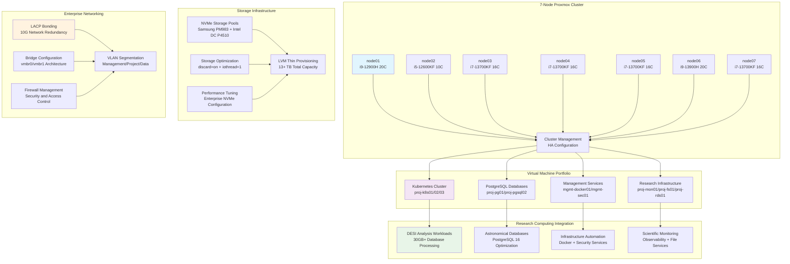

# 🖥️ **Proxmox VE**

This category provides comprehensive documentation for Proxmox Virtual Environment infrastructure management across the Proxmox Astronomy Lab's enterprise research computing platform. The documentation covers systematic virtualization platform administration, cluster configuration, VM lifecycle management, and enterprise-grade operational procedures supporting hybrid Kubernetes and VM architectures. These implementations demonstrate production-ready virtualization patterns optimized for scientific computing environments with emphasis on high availability, performance optimization, and systematic infrastructure automation.

## **Overview**

Proxmox VE represents the foundational virtualization layer enabling enterprise-grade virtual machine management, container orchestration support, and systematic infrastructure provisioning across the research computing infrastructure. The Proxmox Astronomy Lab implements a comprehensive 7-node Proxmox VE 8.4.1 cluster supporting over 30 virtual machines, hybrid Kubernetes integration, high-performance storage pools, and enterprise networking configurations enabling production DESI analysis workloads, AI/ML processing capabilities, and collaborative research environments.

The Proxmox infrastructure operates as the enterprise virtualization backbone providing systematic resource allocation, high-availability configurations, automated VM lifecycle management, and comprehensive monitoring integration across the cluster architecture. These systems enable scalable research computing workloads, systematic database deployments, distributed Kubernetes orchestration, and enterprise security implementations supporting scientific discovery and collaborative research operations.

---

## **📁 Repository Structure**

```markdown
infrastructure/proxmox/
├── README.md                                    # This category overview document
├── cluster-configuration/
│   ├── README.md                               # Proxmox cluster configuration and management
│   ├── node-administration/                   # Individual node configuration and maintenance
│   ├── high-availability-setup/               # HA cluster configuration and failover procedures
│   ├── network-configuration/                 # Advanced networking, VLAN, and bonding setup
│   └── storage-pool-management/               # Storage configuration and optimization procedures
├── vm-lifecycle-management/
│   ├── README.md                               # Virtual machine lifecycle automation and management
│   ├── vm-templates/                          # VM template creation and standardization
│   ├── provisioning-automation/               # Automated VM deployment and configuration
│   ├── resource-allocation/                   # Systematic resource management and optimization
│   └── backup-recovery-procedures/            # VM backup strategies and disaster recovery
├── enterprise-networking/
│   ├── README.md                               # Enterprise networking configuration and management
│   ├── vlan-segmentation/                     # VLAN configuration and network segmentation
│   ├── lacp-bonding/                          # Link aggregation and network redundancy
│   ├── firewall-configuration/                # Proxmox firewall and security implementation
│   └── network-performance-optimization/      # Network tuning and performance enhancement
├── storage-architecture/
│   ├── README.md                               # Storage architecture and performance optimization
│   ├── nvme-storage-pools/                    # NVMe storage configuration and management
│   ├── thin-provisioning/                     # LVM thin provisioning and optimization
│   ├── performance-tuning/                    # Storage performance optimization and monitoring
│   └── capacity-management/                   # Storage capacity planning and allocation
├── automation-integration/
│   ├── README.md                               # Proxmox automation and infrastructure as code
│   ├── ansible-integration/                   # Ansible automation for Proxmox management
│   ├── api-automation/                        # Proxmox API integration and scripting
│   ├── terraform-modules/                     # Terraform infrastructure provisioning (planned)
│   └── gitops-coordination/                   # GitOps integration with Proxmox management
├── monitoring-observability/
│   ├── README.md                               # Proxmox monitoring and performance tracking
│   ├── cluster-monitoring/                    # Cluster health monitoring and alerting
│   ├── performance-analytics/                 # Performance monitoring and optimization
│   ├── resource-utilization/                  # Resource monitoring and capacity planning
│   └── alerting-integration/                  # Integrated alerting and notification systems
└── enterprise-operations/
    ├── README.md                               # Enterprise operational procedures and maintenance
    ├── maintenance-procedures/                 # Systematic maintenance and update procedures
    ├── security-hardening/                     # Proxmox security configuration and compliance
    ├── disaster-recovery/                      # Enterprise disaster recovery and business continuity
    └── compliance-validation/                  # Enterprise compliance and audit procedures
```

---

## **📂 Directory Overview**

This section provides comprehensive navigation to all Proxmox VE infrastructure implementations and operational procedures.

### **🏢 Enterprise Cluster Management**

| **Component** | **Purpose** | **Implementation** |
|---------------|-------------|-------------------|
| **[cluster-configuration/](cluster-configuration/)** | Proxmox cluster configuration and management | Node administration, HA setup, network configuration, storage management |
| **[vm-lifecycle-management/](vm-lifecycle-management/)** | Virtual machine lifecycle automation and management | VM templates, provisioning automation, resource allocation, backup procedures |

### **🌐 Advanced Networking Infrastructure**

| **Component** | **Purpose** | **Implementation** |
|---------------|-------------|-------------------|
| **[enterprise-networking/](enterprise-networking/)** | Enterprise networking configuration and management | VLAN segmentation, LACP bonding, firewall configuration, performance optimization |
| **[storage-architecture/](storage-architecture/)** | Storage architecture and performance optimization | NVMe storage pools, thin provisioning, performance tuning, capacity management |

### **⚙️ Automation and Integration**

| **Component** | **Purpose** | **Implementation** |
|---------------|-------------|-------------------|
| **[automation-integration/](automation-integration/)** | Proxmox automation and infrastructure as code | Ansible integration, API automation, Terraform modules, GitOps coordination |
| **[monitoring-observability/](monitoring-observability/)** | Proxmox monitoring and performance tracking | Cluster monitoring, performance analytics, resource utilization, alerting integration |

### **🔒 Enterprise Operations**

| **Component** | **Purpose** | **Implementation** |
|---------------|-------------|-------------------|
| **[enterprise-operations/](enterprise-operations/)** | Enterprise operational procedures and maintenance | Maintenance procedures, security hardening, disaster recovery, compliance validation |

---

## **🏗️ Architecture & Design**

This section details the systematic architecture supporting enterprise-grade Proxmox VE infrastructure enabling production research computing operations.

### **Enterprise Cluster Architecture**

The Proxmox VE infrastructure implements comprehensive cluster management with systematic integration across virtualization, networking, storage, and automation layers supporting scalable research computing and enterprise operational requirements.



### **Enterprise Virtualization Strategy**

The Proxmox infrastructure provides systematic coordination for enterprise virtualization supporting scientific computing workflows with comprehensive resource management, high availability, and performance optimization capabilities.

| **Virtualization Domain** | **Implementation Approach** | **Resource Allocation** | **Research Computing Integration** |
|----------------------------|----------------------------|------------------------|------------------------------------|
| **Kubernetes Infrastructure** | High-performance VMs (32GB RAM, 16 cores) for RKE2 cluster nodes | Dedicated resource allocation with performance optimization | Container orchestration supporting Ray distributed computing and ML workloads |
| **Database Systems** | Optimized PostgreSQL VMs with specialized resource allocation | Database-tuned configuration with storage and memory optimization | Astronomical database workloads with 30GB+ DESI analysis datasets |
| **Management Services** | Systematic infrastructure service deployment with resource efficiency | Balanced resource allocation for operational services | Enterprise infrastructure automation and security service coordination |
| **Research Applications** | Specialized VM configurations for scientific computing requirements | Domain-specific resource optimization and performance tuning | Direct research workflow support with monitoring and file service integration |

### **Storage and Performance Architecture**

The storage architecture implements enterprise-grade NVMe configurations enabling high-performance virtualization with systematic optimization for research computing workloads and database operations.

| **Storage Category** | **Configuration Strategy** | **Performance Optimization** | **Scientific Benefit** |
|---------------------|----------------------------|------------------------------|------------------------|
| **NVMe Storage Pools** | Samsung PM983 and Intel DC P4510 enterprise drives with LVM thin provisioning | discard=on and iothread=1 optimization for maximum performance | High-speed database operations and scientific data processing |
| **VM Storage Allocation** | Systematic disk allocation with separate OS and data volumes | VirtIO SCSI controllers with enterprise optimization settings | Optimized storage performance for research applications and database workloads |
| **Storage Pool Management** | Multi-pool architecture with capacity planning and performance monitoring | Enterprise storage optimization with systematic capacity management | Scalable storage supporting growing research datasets and computational requirements |
| **Backup and Recovery** | Systematic backup procedures with disaster recovery capabilities | Enterprise backup optimization with minimal performance impact | Research data protection with systematic recovery procedures |

### **Network Architecture and Enterprise Connectivity**

Enterprise networking implements sophisticated configurations ensuring high-bandwidth connectivity, systematic segmentation, and optimal performance for research computing and infrastructure operations.

| **Network Layer** | **Implementation Strategy** | **Performance Considerations** | **Research Computing Integration** |
|-------------------|----------------------------|--------------------------------|-----------------------------------|
| **LACP Bonding** | Redundant 10G network connections with LACP aggregation | High-bandwidth connectivity with failover capabilities | Research data transfer and distributed computing coordination |
| **VLAN Segmentation** | Systematic network segmentation (management, project, data networks) | Network isolation with performance optimization and security | Segmented research networks with controlled access and systematic traffic management |
| **Bridge Configuration** | Advanced bridge management with optimized packet processing | Low-latency networking with enterprise-grade performance | High-performance networking for Kubernetes clusters and research applications |
| **Firewall Integration** | Enterprise firewall management with systematic security policies | Security implementation with minimal performance impact | Protected research networks with controlled access and comprehensive audit capabilities |

---

## **⚙️ Management and Operations**

This section provides systematic approaches to managing Proxmox VE infrastructure operations across enterprise research computing environments.

### **Cluster Operations Lifecycle**

Enterprise Proxmox operations require systematic cluster management, comprehensive monitoring integration, and systematic maintenance ensuring reliable virtualization infrastructure for research computing applications.

| **Operations Phase** | **Management Approach** | **Proxmox Infrastructure Considerations** |
|---------------------|------------------------|-------------------------------------------|
| **Cluster Planning** | Systematic node configuration with resource allocation planning and capacity assessment | Research computing requirement analysis with enterprise virtualization planning |
| **Deployment Execution** | Automated cluster deployment with configuration management and validation procedures | Enterprise cluster implementation with research computing optimization |
| **Operational Monitoring** | Continuous cluster monitoring with systematic alerting and performance validation | Research infrastructure monitoring with comprehensive observability integration |
| **Maintenance and Updates** | Systematic update procedures with minimal disruption and comprehensive validation | Research continuity with enterprise maintenance procedures and systematic validation |

### **Virtual Machine Lifecycle Management**

Production virtualization systems implement comprehensive VM lifecycle management ensuring optimal performance while maintaining enterprise reliability and research computing integration requirements.

| **VM Management Domain** | **Coordination Strategy** | **Resource Management** | **Research Computing Integration** |
|---------------------------|---------------------------|------------------------|-----------------------------------|
| **Template Management** | Systematic VM template creation with standardized configurations | Template optimization with research computing requirements | Research-oriented VM templates with scientific computing optimization |
| **Provisioning Automation** | Automated VM deployment with configuration management and validation | Resource allocation optimization with performance monitoring | Research VM deployment with systematic configuration and validation |
| **Performance Optimization** | Systematic resource tuning with performance monitoring and capacity planning | VM performance optimization with research computing requirements | Scientific application optimization with resource allocation efficiency |
| **Backup and Recovery** | Enterprise backup procedures with systematic validation and recovery testing | VM protection with enterprise backup and disaster recovery capabilities | Research data protection with systematic backup and recovery procedures |

### **Infrastructure Automation Strategy**

Enterprise Proxmox infrastructure implements systematic automation ensuring optimal reliability, comprehensive management capabilities, and efficient operations for scientific computing and research infrastructure administration.

| **Automation Category** | **Implementation Strategy** | **Integration Approach** |
|--------------------------|----------------------------|-------------------------|
| **Configuration Management** | Ansible automation with systematic Proxmox configuration and validation | Infrastructure as code with GitOps integration and systematic deployment |
| **VM Lifecycle Automation** | Proxmox API integration with automated provisioning and configuration management | Systematic VM management with enterprise automation and validation procedures |
| **Monitoring Integration** | Comprehensive monitoring with systematic alerting and performance tracking | Proxmox monitoring integration with enterprise observability and analytics platforms |
| **Security Automation** | Automated security configuration with systematic validation and compliance monitoring | Enterprise security automation with systematic hardening and compliance validation |

---

## **🔒 Security & Compliance**

This section documents comprehensive security controls and compliance alignment for Proxmox VE infrastructure within research computing environments.

⚠️ PROXMOX INFRASTRUCTURE SECURITY DISCLAIMER

*The Proxmox VE implementations provide enterprise-grade virtualization infrastructure for research computing requiring careful security management, systematic access control, and comprehensive operational procedures. Proxmox clusters manage virtual machines supporting enterprise research operations, database systems, and infrastructure services. All Proxmox implementations follow enterprise security frameworks with specific attention to hypervisor security, systematic access control, and appropriate governance aligned with research computing security requirements and institutional policies.*

### **Virtualization Infrastructure Security Controls**

Enterprise-grade security implementation guided by research computing standards for virtualization infrastructure and VM management. Security controls protect virtualization layer, ensure systematic access control, and maintain comprehensive audit capabilities while enabling collaborative research computing and scientific infrastructure operations.

| **Security Control Category** | **Implementation** | **Research Protection** |
|------------------------------|-------------------|------------------------|
| **Hypervisor Security** | Proxmox VE security hardening with systematic vulnerability management and access control | Protected virtualization infrastructure supporting research computing and enterprise operations |
| **VM Isolation and Security** | Systematic VM security with network segmentation and resource isolation | Protected research VMs with controlled access and systematic security validation |
| **Network Security** | VLAN segmentation with firewall management and systematic traffic control | Secure research networks with controlled access and comprehensive monitoring capabilities |
| **Storage Security** | Encrypted storage with systematic access control and audit capabilities | Protected research data with systematic storage security and access management |

### **Research Computing Compliance**

Proxmox implementations align with research computing standards ensuring proper virtualization governance, systematic infrastructure management, and appropriate usage policies for academic institutions and collaborative research environments.

| **Compliance Domain** | **Framework Alignment** | **Implementation Evidence** |
|----------------------|------------------------|---------------------------|
| **Infrastructure Governance** | Enterprise virtualization management with institutional policies and research computing frameworks | Comprehensive infrastructure lifecycle management with audit capabilities and systematic procedures |
| **Virtualization Security** | Enterprise security standards with systematic virtualization protection and monitoring | Protected research infrastructure with systematic security validation and compliance monitoring |
| **Resource Management** | Systematic resource allocation with research computing optimization and capacity planning | Efficient research resource utilization with comprehensive monitoring and optimization |
| **Institutional Compliance** | University and research institution virtualization frameworks with systematic governance | Alignment with institutional policies and research computing infrastructure requirements |

---

## **🔗 Related Categories**

This section establishes systematic connections to other knowledge domains within the Proxmox Astronomy Lab ecosystem, demonstrating comprehensive integration across enterprise research computing infrastructure.

### **Infrastructure Integration**

| **Category** | **Relationship** | **Proxmox Integration** |
|--------------|------------------|------------------------|
| **[../k8s-rke2/](../k8s-rke2/)** | Kubernetes cluster deployment and management | Proxmox VM hosting for RKE2 cluster nodes with enterprise resource allocation |
| **[../databases/](../databases/)** | Database infrastructure deployment and optimization | PostgreSQL VM deployment with enterprise resource optimization and performance tuning |
| **[../storage/](../storage/)** | Storage architecture and performance optimization | NVMe storage pool integration with enterprise optimization and systematic management |
| **[../networking/](../networking/)** | Network architecture and enterprise connectivity | VLAN segmentation and bonding coordination with enterprise networking infrastructure |

### **Automation and Management Integration**

| **Category** | **Relationship** | **Proxmox Integration** |
|--------------|------------------|------------------------|
| **[../gitops-portainer/](../gitops-portainer/)** | Infrastructure automation and GitOps coordination | Proxmox automation integration with Ansible and GitOps workflows |
| **[../../monitoring/](../../monitoring/)** | Infrastructure monitoring and observability | Proxmox cluster monitoring with enterprise observability and performance tracking |
| **[../backups/](../backups/)** | Backup and recovery infrastructure | VM backup integration with enterprise backup procedures and disaster recovery |

### **Research and Security Integration**

| **Category** | **Relationship** | **Proxmox Integration** |
|--------------|------------------|------------------------|
| **[../../projects/](../../projects/)** | Research project infrastructure deployment | Proxmox VM hosting for DESI analysis infrastructure and research computing environments |
| **[../../security-assurance/](../../security-assurance/)** | Security framework implementation and validation | Proxmox security hardening with enterprise security controls and systematic compliance |
| **[../../reproducibility/](../../reproducibility/)** | Reproducible research infrastructure | Infrastructure as code supporting systematic reproducibility and research validation |

---

## **🚀 Getting Started**

This section provides systematic guidance for implementing Proxmox VE infrastructure across different operational roles and research computing applications.

### **For Infrastructure Engineers**

**Cluster Management:** [cluster-configuration/](cluster-configuration/)  
**VM Lifecycle:** [vm-lifecycle-management/](vm-lifecycle-management/)  
**Storage Architecture:** [storage-architecture/](storage-architecture/)  
**Enterprise Operations:** [enterprise-operations/](enterprise-operations/)

### **For Virtualization Administrators**

**Network Configuration:** [enterprise-networking/](enterprise-networking/)  
**Automation Integration:** [automation-integration/](automation-integration/)  
**Monitoring Setup:** [monitoring-observability/](monitoring-observability/)  
**Security Implementation:** [enterprise-operations/](enterprise-operations/)

### **For Research Computing Teams**

**VM Deployment:** [vm-lifecycle-management/](vm-lifecycle-management/)  
**Resource Optimization:** [storage-architecture/](storage-architecture/)  
**Performance Tuning:** [monitoring-observability/](monitoring-observability/)  
**Research Integration:** [cluster-configuration/](cluster-configuration/)

### **For Platform Administrators**

**Enterprise Management:** [cluster-configuration/](cluster-configuration/)  
**Security Hardening:** [enterprise-operations/](enterprise-operations/)  
**Automation Implementation:** [automation-integration/](automation-integration/)  
**Compliance Management:** [enterprise-operations/](enterprise-operations/)

---

## **Document Information**

| **Field** | **Value** |
|-----------|-----------|
| **Author** | VintageDon - <https://github.com/vintagedon> |
| **Created** | 2025-07-20 |
| **Last Updated** | 2025-07-20 |
| **Version** | 1.0 |

---
Tags: proxmox-ve, enterprise-virtualization, cluster-management, vm-lifecycle, storage-architecture, enterprise-networking, infrastructure-automation, research-computing
