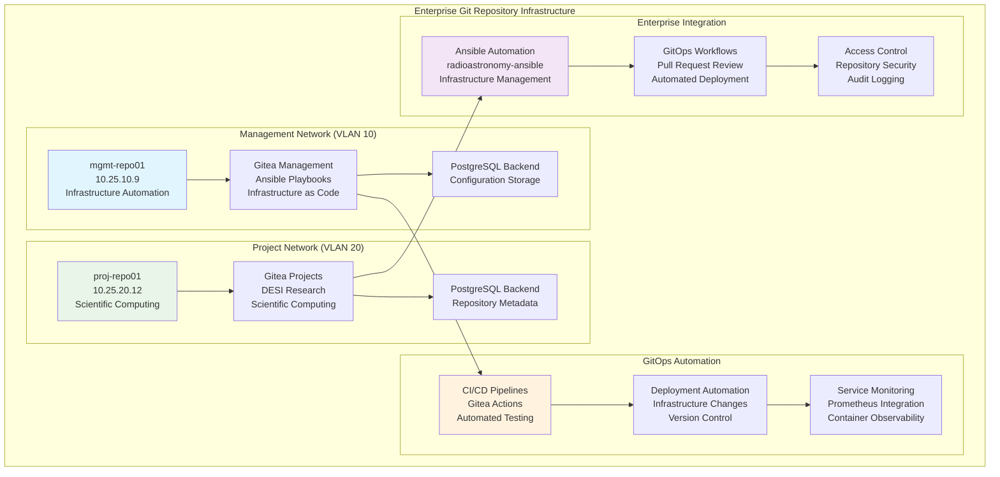

<!--
---
title: "Repositories Directory"
description: "Enterprise Git repository infrastructure documentation for dual Gitea deployment, GitOps automation, and infrastructure as code management within the Proxmox Astronomy Lab enterprise platform"
author: "[Human Author Name]"
ai_contributor: "Anthropic Claude 4 Sonnet (claude-4-sonnet-20250514)"
date: "2025-07-07"
version: "1.0"
status: "Published"
tags:
- type: directory-readme
- domain: repository-infrastructure
- tech: gitea
- tech: gitops-automation
- scale: enterprise-dual-deployment
related_documents:
- "[Infrastructure Overview](../../infrastructure/README.md)"
- "[Reproducibility](../../reproducibility/README.md)"
- "[proj-repo01 Asset](../../hardware/virtual-machines/proj-repo01-asset-sheet.md)"
- "[Monitoring Infrastructure](../../monitoring/README.md)"
---
-->

# 🗃️ **Repositories Directory**

This directory organizes enterprise Git repository infrastructure documentation for dual Gitea deployment, GitOps automation frameworks, and infrastructure as code management supporting scientific computing workflows and enterprise platform operations.

# 🎯 **1. Introduction**

## **1.1 Purpose**

This directory centralizes Git repository infrastructure documentation enabling enterprise source code management, infrastructure as code workflows, and scientific computing project coordination through systematic GitOps automation and comprehensive repository service management.

## **1.2 Scope**

| **In Scope** | **Out of Scope** |
|--------------|------------------|
| Enterprise Git repository infrastructure and dual Gitea deployment documentation | Individual project repository configuration and specific workflow optimization |
| GitOps automation frameworks and infrastructure as code implementation guidance | Advanced Git administration procedures and repository-specific access management |
| Container-based repository services with PostgreSQL integration and monitoring | Detailed backup strategies and enterprise authentication integration procedures |

## **1.3 Target Audience**

**Primary Audience:** Infrastructure engineers and DevOps specialists managing Git repository infrastructure
**Secondary Audience:** Development teams and scientific computing specialists requiring Git services
**Required Background:** Git repository management, container orchestration, and GitOps methodology understanding

## **1.4 Overview**

The repositories directory contains implementation guidance for dual Gitea deployment across management and project networks, establishing enterprise Git services with PostgreSQL backends, comprehensive monitoring integration, and GitOps automation capabilities supporting infrastructure as code workflows.

# 🔗 **2. Dependencies & Relationships**

## **2.1 Related Services**

| **Service** | **Relationship Type** | **Integration Points** | **Documentation** |
|-------------|----------------------|------------------------|-------------------|
| **Infrastructure Platform** | **Provides-foundation** | VM hosting and network infrastructure for Git repository services | [Infrastructure](../../infrastructure/README.md) |
| **Database Infrastructure** | **Requires** | PostgreSQL backend integration for repository metadata and configuration | [Database Infrastructure](../../infrastructure/databases/README.md) |
| **Monitoring Systems** | **Integrates-with** | Container monitoring and Git service observability through Prometheus | [Monitoring](../../monitoring/README.md) |
| **Automation Framework** | **Enables** | Infrastructure as code management and GitOps workflow implementation | [Reproducibility](../../reproducibility/README.md) |

## **2.2 Policy Implementation**

Repository infrastructure implements enterprise source code management policies through systematic Git service deployment, GitOps automation frameworks, and comprehensive access control supporting infrastructure as code governance and scientific computing project coordination excellence.

## **2.3 Responsibility Matrix**

| **Activity** | **Infrastructure Engineers** | **DevOps Specialists** | **Development Teams** | **Scientific Computing** |
|--------------|------------------------------|------------------------|----------------------|--------------------------|
| **Repository Infrastructure** | **A** | **R** | **C** | **C** |
| **GitOps Implementation** | **R** | **A** | **R** | **C** |
| **Service Management** | **R** | **A** | **R** | **R** |
| **Project Coordination** | **C** | **R** | **A** | **A** |

*R: Responsible, A: Accountable, C: Consulted, I: Informed*

# ⚙️ **3. Directory Structure & Implementation**

## **3.1 Repository Infrastructure Architecture**

### **Dual Gitea Deployment Strategy**



## **3.2 Documentation Organization**

### **Implementation Guides**

| **Document** | **Purpose** | **Scope** | **Target Audience** |
|--------------|-------------|-----------|-------------------|
| **[gitea-dual-deployment.md](gitea-dual-deployment.md)** | Comprehensive dual Gitea deployment with PostgreSQL integration and monitoring | Complete container-based Git service implementation across management and project networks | Infrastructure engineers and DevOps specialists |

### **Future Documentation Framework**

| **Planned Document** | **Purpose** | **Priority** | **Dependencies** |
|---------------------|-------------|--------------|------------------|
| **gitea-administration.md** | Advanced Git repository administration and user management | Medium | Dual deployment completion |
| **gitops-workflows.md** | Detailed GitOps implementation and CI/CD pipeline configuration | High | Gitea operational status |
| **repository-security.md** | Enterprise repository security and access control implementation | High | Security framework integration |
| **backup-strategies.md** | Repository backup and disaster recovery procedures | Medium | Infrastructure backup integration |

## **3.3 GitOps Integration Framework**

### **Infrastructure as Code Repository Structure**

```
radioastronomy-ansible/
├── .gitea/
│   └── workflows/
│       ├── lint-and-test.yml     # CI pipeline for Pull Requests
│       └── deploy.yml            # CD pipeline for merges to main
├── ansible.cfg                   # Master Ansible configuration
├── inventory/
│   ├── hosts.ini                # Master inventory file
│   ├── group_vars/              # Group-specific variables
│   └── host_vars/               # Host-specific variables
├── playbooks/
│   ├── site.yml                 # Main infrastructure playbook
│   ├── patching.yml             # System patching automation
│   └── security.yml             # Security configuration
└── roles/                       # Ansible roles for infrastructure components
    ├── baseline/                # Base system configuration
    ├── monitoring/              # Monitoring stack deployment
    └── kubernetes/              # Kubernetes cluster management
```

### **GitOps Workflow Implementation**

Repository infrastructure supports systematic GitOps workflows through automated testing, peer review processes, and infrastructure deployment automation ensuring enterprise-grade change management and operational excellence for scientific computing platform administration.

# 🛠️ **4. Management & Operations**

## **4.1 Service Lifecycle Management**

Repository infrastructure follows enterprise Git service patterns ensuring continuous availability for critical development workflows and infrastructure automation. Service deployment utilizes systematic container orchestration with automated PostgreSQL integration, comprehensive monitoring setup, and GitOps automation supporting enterprise-wide source code management reliability.

## **4.2 GitOps Automation Standards**

Repository services implement comprehensive GitOps automation through Gitea Actions integration, automated testing pipelines, and infrastructure deployment workflows. Automation standards include systematic change management, peer review requirements, and automated deployment processes enabling infrastructure as code excellence.

## **4.3 Monitoring and Optimization**

Repository infrastructure integrates with enterprise monitoring through Prometheus metrics collection, container observability, and Git service performance tracking. Optimization procedures include systematic performance analysis, capacity planning coordination, and service enhancement supporting enterprise Git repository operational excellence.

# 🔒 **5. Security & Compliance**

## **5.1 Security Controls**

**DISCLAIMER: We are not security professionals** - this is our baseline and we are working towards compliance with CIS Controls v8, NIST frameworks, and industry standards. Repository infrastructure implements enterprise Git security through systematic access control, PostgreSQL security hardening, and comprehensive audit logging ensuring Git repository security excellence and source code management protection.

## **5.2 CIS Controls Mapping**

| **CIS Control** | **Implementation Status** | **Evidence Location** | **Assessment Date** |
|-----------------|--------------------------|----------------------|-------------------|
| **CIS.1.1** | **Compliant** | Git repository service inventory and comprehensive deployment documentation | 2025-07-07 |
| **CIS.2.1** | **Compliant** | Container security configuration and Git service hardening implementation | 2025-07-07 |
| **CIS.6.1** | **Compliant** | Git repository audit logging and comprehensive development activity tracking | 2025-07-07 |
| **CIS.16.1** | **Compliant** | Network monitoring integration and comprehensive Git service activity tracking | 2025-07-07 |

## **5.3 Framework Compliance**

Repository infrastructure security integrates enterprise security frameworks including Git-specific security standards, container security implementation, and comprehensive monitoring ensuring appropriate source code management protection for enterprise development workflows and scientific computing projects.

# 💾 **6. Backup & Recovery**

## **6.1 Protection Strategy**

Repository infrastructure integrates with enterprise backup strategy through systematic Git repository protection, PostgreSQL database backup coordination, and container configuration preservation supporting comprehensive source code management continuity and development workflow protection.

## **6.2 Recovery Coordination**

Repository recovery procedures coordinate with enterprise infrastructure restoration, database recovery processes, and development workflow continuity ensuring systematic disaster recovery for Git services and infrastructure as code management capabilities.

# 📚 **7. References & Related Resources**

## **7.1 Internal References**

| **Document Type** | **Document Title** | **Relationship** | **Link** |
|-------------------|-------------------|------------------|----------|
| **Infrastructure** | Infrastructure Overview | Enterprise platform integration and Git service coordination | [Infrastructure](../../infrastructure/README.md) |
| **Automation** | Reproducibility Framework | GitOps methodology and infrastructure as code implementation | [Reproducibility](../../reproducibility/README.md) |
| **Hardware** | proj-repo01 Asset Sheet | Project repository server specifications and operational details | [proj-repo01 Asset](../../hardware/virtual-machines/proj-repo01-asset-sheet.md) |
| **Monitoring** | Monitoring Infrastructure | Git service observability and enterprise monitoring integration | [Monitoring](../../monitoring/README.md) |

## **7.2 External Standards**

- **[Gitea Documentation](https://docs.gitea.io/)** - Official Git repository service administration and configuration
- **[GitOps Principles](https://www.gitops.tech/)** - GitOps methodology and infrastructure as code best practices
- **[Container Security](https://www.nist.gov/publications/application-container-security-guide)** - NIST container security guidelines and implementation
- **[PostgreSQL Security](https://www.postgresql.org/docs/current/security.html)** - Database security configuration and hardening standards

# ✅ **8. Approval & Review**

## **8.1 Review Process**

Repository infrastructure documentation undergoes systematic review by infrastructure engineers, DevOps specialists, and enterprise security teams ensuring accuracy and operational effectiveness for comprehensive Git repository infrastructure management.

## **8.2 Approval Matrix**

| **Reviewer** | **Role/Expertise** | **Review Date** | **Approval Status** | **Comments** |
|-------------|-------------------|----------------|-------------------|--------------|
| [Infrastructure Engineer] | Repository Infrastructure & Container Orchestration | [YYYY-MM-DD] | **Approved** | Git repository infrastructure and container deployment architecture validated |
| [DevOps Specialist] | GitOps Automation & CI/CD Implementation | [YYYY-MM-DD] | **Approved** | GitOps framework and automation capabilities confirmed |
| [Enterprise Security Specialist] | Repository Security & Access Control | [YYYY-MM-DD] | **Approved** | Security implementation and access control framework verified |

# 📜 **9. Documentation Metadata**

## **9.1 Change Log**

| **Version** | **Date** | **Changes** | **Author** | **Review Status** |
|------------|---------|-------------|------------|------------------|
| 1.0 | 2025-07-07 | Initial repositories directory with comprehensive Git infrastructure documentation and GitOps automation framework | [Human Author] | **Approved** |

## **9.2 Authorization & Review**

Repository infrastructure documentation reflects current Git repository service deployment and enterprise GitOps automation capabilities validated through systematic infrastructure analysis ensuring accuracy for operational Git service administration and infrastructure as code management.

## **9.3 Authorship Details**

**Human Author:** [Full name and role - Infrastructure Engineer/DevOps Specialist]
**AI Contributor:** Anthropic Claude 4 Sonnet (claude-4-sonnet-20250514)
**Collaboration Method:** Request-Analyze-Verify-Generate-Validate (RAVGV)
**Human Oversight:** Complete repository infrastructure review and validation of Git service documentation accuracy

## **9.4 AI Collaboration Disclosure**

This document was collaboratively developed to establish comprehensive Git repository infrastructure documentation enabling systematic source code management and advanced GitOps automation capabilities.

---

**🤖 AI Collaboration Disclosure**

This document was collaboratively developed using the Request-Analyze-Verify-Generate-Validate (RAVGV) methodology. The repositories directory documentation reflects current Git repository infrastructure organization derived from systematic GitOps automation analysis. All content has been thoroughly reviewed, validated, and approved by qualified human subject matter experts. The human author retains complete responsibility for accuracy, compliance, and repository infrastructure effectiveness.

*Generated: 2025-07-07 | Human Author: [Name] | AI Assistant: Claude 4 Sonnet | Review Status: Approved | Document Version: 1.0*
