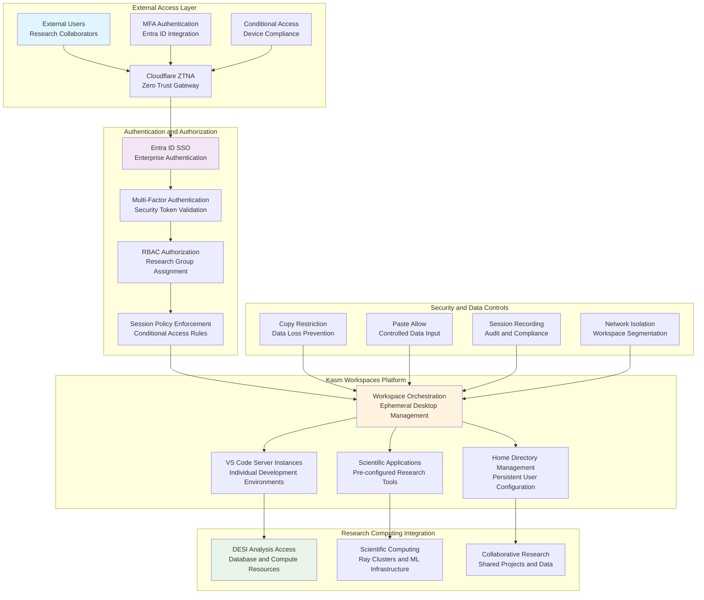

# 🖥️ **VDI Kasm Workspaces**

This category provides comprehensive documentation for Virtual Desktop Infrastructure (VDI) using Kasm Workspaces across the Proxmox Astronomy Lab's enterprise research computing platform. The documentation covers secure browser-based ephemeral desktop environments, enterprise SSO integration with Entra ID, Cloudflare Zero Trust Network Access (ZTNA), and systematic workspace management supporting secure external collaboration. These implementations demonstrate production-ready remote access patterns optimized for research computing environments with emphasis on security isolation, compliance validation, and systematic access control.

## **Overview**

VDI Kasm Workspaces represent the sophisticated secure access layer enabling external collaboration and remote research computing through ephemeral desktop environments accessible via browser-based interfaces. The Proxmox Astronomy Lab implements enterprise-grade VDI infrastructure centered on Kasm Workspaces platform integration, Cloudflare ZTNA protection, Entra ID authentication with MFA and conditional access policies, and systematic workspace configuration supporting scientific computing workflows, VS Code development environments, and collaborative research operations.

The VDI infrastructure operates as the secure gateway for external access to research computing resources, providing systematic workspace isolation, enterprise authentication integration, data loss prevention controls, and comprehensive audit capabilities across the research computing ecosystem. These systems enable secure external collaboration, systematic remote access to scientific computing environments, controlled data access with copy/paste policies, and enterprise-grade security monitoring supporting collaborative scientific research and institutional compliance requirements.

---

## **📁 Repository Structure**

```markdown
infrastructure/vdi-kasm-workspaces/
├── README.md                                    # This category overview document
├── cloudflare-ztna-integration/
│   ├── README.md                               # Cloudflare Zero Trust Network Access integration
│   ├── access-policies/                        # Cloudflare Access policy configuration and management
│   ├── conditional-access/                     # Advanced conditional access rules and enforcement
│   ├── network-security/                       # ZTNA network security and traffic inspection
│   └── audit-logging/                          # Cloudflare Access audit and compliance logging
├── enterprise-sso-configuration/
│   ├── README.md                               # Enterprise Single Sign-On configuration and management
│   ├── entra-id-integration/                   # Microsoft Entra ID authentication and authorization
│   ├── mfa-conditional-access/                 # Multi-factor authentication and conditional access policies
│   ├── rbac-implementation/                    # Role-based access control and group management
│   └── session-management/                     # Session timeout and security policy enforcement
├── kasm-platform-deployment/
│   ├── README.md                               # Kasm Workspaces platform deployment and configuration
│   ├── initial-deployment/                     # Initial Kasm platform installation and setup
│   ├── workspace-templates/                    # Workspace image management and customization
│   ├── performance-optimization/               # Platform performance tuning and resource allocation
│   └── high-availability-setup/                # HA configuration and failover procedures
├── ephemeral-workspace-management/
│   ├── README.md                               # Ephemeral workspace lifecycle and management
│   ├── workspace-policies/                     # Workspace creation, duration, and destruction policies
│   ├── resource-allocation/                    # Dynamic resource allocation and optimization
│   ├── state-management/                       # Workspace state preservation and cleanup procedures
│   └── scaling-automation/                     # Automatic workspace scaling and resource management
├── security-data-controls/
│   ├── README.md                               # Security controls and data loss prevention
│   ├── copy-paste-policies/                    # Copy/paste restriction and data flow control
│   ├── file-transfer-controls/                 # File upload/download restrictions and monitoring
│   ├── session-recording/                      # Session recording and compliance monitoring
│   └── network-isolation/                      # Workspace network isolation and traffic control
├── workspace-customization/
│   ├── README.md                               # Workspace customization and user experience
│   ├── development-environments/               # VS Code server instances and development tooling
│   ├── home-directory-management/              # User home directory configuration and persistence
│   ├── application-presets/                    # Pre-configured applications and scientific tools
│   └── bookmark-configuration/                 # Browser bookmark management and research resource access
└── compliance-monitoring/
    ├── README.md                               # Compliance monitoring and audit procedures
    ├── session-audit/                          # Comprehensive session monitoring and logging
    ├── access-compliance/                      # Access control compliance and validation
    ├── data-governance/                        # Data handling compliance and policy enforcement
    └── security-reporting/                     # Security metrics and compliance reporting
```

---

## **📂 Directory Overview**

This section provides comprehensive navigation to all VDI Kasm Workspaces implementations and security procedures.

### **🔐 Zero Trust Access Infrastructure**

| **Component** | **Purpose** | **Implementation** |
|---------------|-------------|-------------------|
| **[cloudflare-ztna-integration/](cloudflare-ztna-integration/)** | Cloudflare Zero Trust Network Access integration | Access policies, conditional access, network security, audit logging |
| **[enterprise-sso-configuration/](enterprise-sso-configuration/)** | Enterprise Single Sign-On configuration and management | Entra ID integration, MFA, conditional access, RBAC implementation |

### **🖥️ VDI Platform Management**

| **Component** | **Purpose** | **Implementation** |
|---------------|-------------|-------------------|
| **[kasm-platform-deployment/](kasm-platform-deployment/)** | Kasm Workspaces platform deployment and configuration | Initial deployment, workspace templates, performance optimization, HA setup |
| **[ephemeral-workspace-management/](ephemeral-workspace-management/)** | Ephemeral workspace lifecycle and management | Workspace policies, resource allocation, state management, scaling automation |

### **🛡️ Security and Data Protection**

| **Component** | **Purpose** | **Implementation** |
|---------------|-------------|-------------------|
| **[security-data-controls/](security-data-controls/)** | Security controls and data loss prevention | Copy/paste policies, file transfer controls, session recording, network isolation |
| **[workspace-customization/](workspace-customization/)** | Workspace customization and user experience | Development environments, home directory management, application presets |

### **📊 Compliance and Monitoring**

| **Component** | **Purpose** | **Implementation** |
|---------------|-------------|-------------------|
| **[compliance-monitoring/](compliance-monitoring/)** | Compliance monitoring and audit procedures | Session audit, access compliance, data governance, security reporting |

---

## **🏗️ Architecture & Design**

This section details the systematic architecture supporting enterprise-grade VDI infrastructure enabling secure external access to research computing environments.

### **Zero Trust VDI Architecture**

The VDI infrastructure implements comprehensive zero trust access with systematic integration across Cloudflare ZTNA, enterprise authentication, ephemeral workspace management, and security monitoring supporting secure external collaboration and research computing access.



### **Enterprise Authentication and Access Strategy**

The VDI platform provides systematic coordination for enterprise authentication supporting secure external access with comprehensive policy enforcement, systematic session management, and controlled research computing resource access.

| **Authentication Domain** | **Implementation Approach** | **Security Integration** | **Research Computing Benefit** |
|----------------------------|----------------------------|--------------------------|-------------------------------|
| **Zero Trust Network Access** | Cloudflare ZTNA with systematic policy enforcement and conditional access | Device compliance validation with geolocation and risk assessment | Secure external collaboration with controlled access to research infrastructure |
| **Enterprise SSO Integration** | Entra ID authentication with MFA and systematic session management | Multi-factor authentication with conditional access policies and risk-based assessment | Simplified access management with enterprise security standards and institutional compliance |
| **Role-Based Access Control** | Research group assignment with systematic permission management | Granular access control with project-based resource allocation | Controlled research collaboration with appropriate access to scientific computing resources |
| **Session Security Management** | Systematic session timeout with security policy enforcement | Session monitoring with audit capabilities and compliance validation | Protected research sessions with comprehensive security oversight |

### **Ephemeral Workspace Management**

The workspace architecture implements sophisticated ephemeral desktop management enabling scalable secure access with systematic resource allocation, performance optimization, and enterprise security controls.

| **Workspace Category** | **Configuration Strategy** | **Resource Management** | **Security Implementation** |
|-------------------------|----------------------------|------------------------|----------------------------|
| **Development Environments** | VS Code server instances with pre-configured development tooling | Individual resource allocation with performance optimization | Isolated development environments with controlled access to research repositories |
| **Scientific Computing Access** | Pre-configured scientific applications with research tool integration | Optimized resource allocation for computational workloads | Controlled access to DESI analysis infrastructure and database resources |
| **Collaborative Research** | Shared workspace configurations with project-specific customization | Dynamic resource scaling with collaborative session management | Secure collaboration environments with systematic data protection |
| **Administrative Access** | Elevated privilege workspaces with systematic access control | Controlled resource allocation with enhanced monitoring | Protected administrative access with comprehensive audit capabilities |

### **Security and Compliance Framework**

Enterprise VDI implements comprehensive security controls ensuring data protection, systematic access management, and compliance validation for external research collaboration and institutional security requirements.

| **Security Domain** | **Implementation Strategy** | **Compliance Integration** | **Research Protection** |
|---------------------|----------------------------|---------------------------|------------------------|
| **Data Loss Prevention** | Copy restriction with systematic paste policy management | Enterprise DLP compliance with institutional data protection policies | Protected research data with controlled external collaboration |
| **Session Monitoring** | Comprehensive session recording with audit capabilities | Compliance monitoring with systematic security validation | Transparent research collaboration with comprehensive audit trail |
| **Network Security** | Workspace isolation with systematic traffic control | Network security compliance with enterprise segmentation policies | Protected research networks with controlled access and monitoring |
| **Access Governance** | Systematic access control with compliance validation | Enterprise governance with institutional policy alignment | Controlled research access with systematic compliance and audit capabilities |

---

## **⚙️ Management and Operations**

This section provides systematic approaches to managing VDI Kasm Workspaces operations across enterprise research computing environments.

### **VDI Operations Lifecycle**

Enterprise VDI operations require systematic workspace management, comprehensive security monitoring, and systematic maintenance ensuring reliable secure access for research computing applications and external collaboration.

| **Operations Phase** | **Management Approach** | **VDI Infrastructure Considerations** |
|---------------------|------------------------|---------------------------------------|
| **Access Provisioning** | Systematic user onboarding with enterprise authentication integration | Research collaboration access with security validation and compliance monitoring |
| **Workspace Management** | Ephemeral workspace lifecycle with resource optimization and performance monitoring | Scientific computing workspace configuration with research tool integration |
| **Security Monitoring** | Continuous session monitoring with systematic alerting and compliance validation | Research collaboration security with systematic audit and threat detection |
| **Maintenance and Updates** | Systematic platform updates with minimal disruption and comprehensive validation | Research continuity with enterprise maintenance procedures and security updates |

### **Workspace Lifecycle Management**

Production VDI systems implement comprehensive workspace lifecycle management ensuring optimal performance while maintaining enterprise security and research computing integration requirements.

| **Workspace Domain** | **Coordination Strategy** | **Resource Management** | **Research Computing Integration** |
|-----------------------|---------------------------|------------------------|-----------------------------------|
| **Development Workspaces** | VS Code server management with systematic development environment provisioning | Individual resource allocation with performance optimization | Research development access with repository integration and collaborative development |
| **Scientific Computing Access** | Research application deployment with systematic tool configuration | Optimized resource allocation for computational workloads | DESI analysis access with database integration and ML infrastructure coordination |
| **Collaborative Sessions** | Multi-user workspace coordination with systematic session management | Dynamic resource scaling with collaborative optimization | Research collaboration with shared access to scientific computing resources |
| **Administrative Operations** | Elevated access management with systematic privilege control | Controlled resource allocation with enhanced monitoring and audit capabilities | Infrastructure administration with systematic security validation |

### **Security Operations Strategy**

Enterprise VDI security implements systematic protection ensuring secure external access while maintaining research computing capabilities and collaborative access requirements.

| **Security Category** | **Implementation Strategy** | **Monitoring Integration** |
|------------------------|----------------------------|---------------------------|
| **Access Control Management** | Zero trust authentication with systematic policy enforcement | Access monitoring with compliance validation and risk assessment |
| **Data Protection** | Copy/paste policy enforcement with systematic data loss prevention | Data flow monitoring with audit capabilities and compliance reporting |
| **Session Security** | Session isolation with systematic monitoring and recording | Session analysis with security validation and threat detection |
| **Compliance Validation** | Systematic compliance monitoring with enterprise policy enforcement | Compliance reporting with audit capabilities and institutional alignment |

---

## **🔒 Security & Compliance**

This section documents comprehensive security controls and compliance alignment for VDI Kasm Workspaces infrastructure within research computing environments.

⚠️ VDI SECURITY DISCLAIMER

*The VDI Kasm Workspaces implementations provide enterprise-grade secure remote access for research computing requiring careful security management, systematic access control, and comprehensive monitoring capabilities. VDI systems enable external access to research infrastructure, scientific computing resources, and collaborative research environments. All VDI implementations follow enterprise security frameworks with specific attention to zero trust access control, systematic session monitoring, and appropriate governance aligned with research computing security requirements and institutional policies.*

### **VDI Infrastructure Security Controls**

Enterprise-grade security implementation guided by research computing standards for secure remote access and external collaboration. Security controls protect research infrastructure during external access, ensure systematic session monitoring, and maintain comprehensive audit capabilities while enabling collaborative research computing and scientific discovery.

| **Security Control Category** | **Implementation** | **Research Protection** |
|------------------------------|-------------------|------------------------|
| **Zero Trust Network Access** | Cloudflare ZTNA with systematic policy enforcement and conditional access validation | Protected research infrastructure with controlled external access and systematic threat detection |
| **Enterprise Authentication** | Entra ID integration with MFA and systematic session management | Secure research collaboration with enterprise authentication standards and institutional compliance |
| **Data Loss Prevention** | Copy restriction with systematic paste policy management and file transfer controls | Protected research data with controlled external collaboration and systematic data governance |
| **Session Security** | Comprehensive session monitoring with isolation and audit capabilities | Transparent research collaboration with complete audit trail and security validation |

### **Research Computing Compliance**

VDI implementations align with research computing standards ensuring proper external access governance, systematic security management, and appropriate usage policies for academic institutions and collaborative research environments.

| **Compliance Domain** | **Framework Alignment** | **Implementation Evidence** |
|----------------------|------------------------|---------------------------|
| **External Access Governance** | Enterprise security standards with systematic external collaboration management | Comprehensive access control with audit capabilities and institutional policy alignment |
| **Data Protection Compliance** | Research data protection with systematic DLP implementation and monitoring | Protected scientific data with controlled external access and comprehensive governance |
| **Session Compliance** | Enterprise session management with systematic monitoring and audit capabilities | Transparent collaboration with comprehensive audit trail and compliance validation |
| **Institutional Compliance** | University and research institution remote access frameworks with systematic governance | Alignment with institutional policies and research computing external access requirements |

---

## **🔗 Related Categories**

This section establishes systematic connections to other knowledge domains within the Proxmox Astronomy Lab ecosystem, demonstrating comprehensive integration across enterprise research computing infrastructure.

### **Authentication and Security Integration**

| **Category** | **Relationship** | **VDI Integration** |
|--------------|------------------|-------------------|
| **[../authentication/](../authentication/)** | Enterprise identity and access management coordination | Entra ID integration with VDI authentication and systematic session management |
| **[../../security-assurance/](../../security-assurance/)** | Security framework implementation and validation | VDI security controls with comprehensive monitoring and compliance validation |
| **[../networking/](../networking/)** | Network security and enterprise connectivity | Cloudflare ZTNA integration with enterprise network security and traffic control |

### **Infrastructure Integration**

| **Category** | **Relationship** | **VDI Integration** |
|--------------|------------------|-------------------|
| **[../proxmox/](../proxmox/)** | Virtualization infrastructure deployment | VDI platform hosting with enterprise resource allocation and performance optimization |
| **[../k8s-rke2/](../k8s-rke2/)** | Kubernetes cluster integration | Container-based workspace deployment with RKE2 orchestration and resource management |
| **[../../monitoring/](../../monitoring/)** | Infrastructure monitoring and observability | VDI monitoring integration with enterprise observability and performance tracking |

### **Research and Development Integration**

| **Category** | **Relationship** | **VDI Integration** |
|--------------|------------------|-------------------|
| **[../../projects/](../../projects/)** | Research project access and collaboration | Secure external access to DESI analysis infrastructure and scientific computing resources |
| **[../../ai-and-machine-learning/](../../ai-and-machine-learning/)** | AI/ML infrastructure access | Controlled access to Ray clusters and ML infrastructure through secure VDI environments |
| **[../../reproducibility/](../../reproducibility/)** | Reproducible research infrastructure | VDI configuration management supporting systematic reproducibility and research validation |

---

## **🚀 Getting Started**

This section provides systematic guidance for implementing VDI Kasm Workspaces infrastructure across different operational roles and research computing applications.

### **For Infrastructure Engineers**

**Platform Deployment:** [kasm-platform-deployment/](kasm-platform-deployment/)  
**ZTNA Integration:** [cloudflare-ztna-integration/](cloudflare-ztna-integration/)  
**Security Controls:** [security-data-controls/](security-data-controls/)  
**Compliance Monitoring:** [compliance-monitoring/](compliance-monitoring/)

### **For Security Administrators**

**Enterprise SSO:** [enterprise-sso-configuration/](enterprise-sso-configuration/)  
**Access Policies:** [cloudflare-ztna-integration/](cloudflare-ztna-integration/)  
**Data Protection:** [security-data-controls/](security-data-controls/)  
**Audit Procedures:** [compliance-monitoring/](compliance-monitoring/)

### **For Research Computing Teams**

**Workspace Management:** [ephemeral-workspace-management/](ephemeral-workspace-management/)  
**Development Environments:** [workspace-customization/](workspace-customization/)  
**Research Integration:** [workspace-customization/](workspace-customization/)  
**Collaboration Access:** [enterprise-sso-configuration/](enterprise-sso-configuration/)

### **For Platform Administrators**

**Enterprise Management:** [kasm-platform-deployment/](kasm-platform-deployment/)  
**Security Implementation:** [security-data-controls/](security-data-controls/)  
**Compliance Management:** [compliance-monitoring/](compliance-monitoring/)  
**Performance Optimization:** [ephemeral-workspace-management/](ephemeral-workspace-management/)

---

## **Document Information**

| **Field** | **Value** |
|-----------|-----------|
| **Author** | VintageDon - <https://github.com/vintagedon> |
| **Created** | 2025-07-20 |
| **Last Updated** | 2025-07-20 |
| **Version** | 1.0 |

---
Tags: vdi-kasm-workspaces, zero-trust-access, cloudflare-ztna, entra-id-sso, ephemeral-workspaces, enterprise-security, remote-collaboration, data-protection
