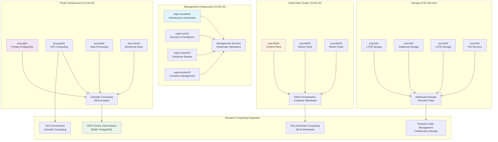

# 🖥️ **Virtual Machines**

This category provides comprehensive documentation for virtual machine infrastructure across the Proxmox Astronomy Lab's enterprise research computing platform. The documentation covers systematic VM deployment, configuration management, resource allocation optimization, and operational procedures supporting hybrid Kubernetes and specialized service architectures. These implementations demonstrate production-ready virtualization patterns optimized for scientific computing environments with emphasis on role-based deployment, performance optimization, and systematic lifecycle management.

## **Overview**

Virtual Machines represent the foundational compute layer enabling specialized service deployment, database hosting, development environments, and infrastructure services across the research computing infrastructure. The Proxmox Astronomy Lab implements a comprehensive portfolio of over 30 virtual machines distributed across 7 Proxmox nodes, supporting diverse workloads including Kubernetes cluster nodes, PostgreSQL databases, GPU-accelerated computing, monitoring infrastructure, and collaborative research environments enabling production DESI analysis, AI/ML processing, and scientific computing operations.

The VM infrastructure operates as the systematic foundation for research computing services, providing optimized resource allocation, role-based deployment patterns, enterprise security configurations, and comprehensive lifecycle management across the cluster architecture. These systems enable scalable scientific computing workloads, systematic database operations, distributed Kubernetes orchestration, and enterprise infrastructure services supporting collaborative research and scientific discovery operations.

---

## **📊 Virtual Machine Reference Table**

This comprehensive reference table provides systematic overview of all virtual machines deployed across the 7-node Proxmox cluster with role-based organization and resource allocation details.

### **Management Infrastructure VMs (VLAN 10 - 10.25.10.x)**

| **VM ID** | **Hostname** | **Node** | **IP Address** | **vCPU** | **RAM** | **Storage** | **Tags** | **Primary Role** |
|-----------|-------------|----------|----------------|----------|---------|-------------|----------|------------------|
| **1002** | mgmt-ansible01 | node05 | 10.25.10.7 | 2 | 2GB/4GB | 32GB | infra, mgmt | Infrastructure automation and configuration management |
| **1003** | radio-dc01 | node01 | 10.25.10.2 | 2 | 2GB/6GB | 125GB | infra, mgmt, pdoc | Legacy radio astronomy infrastructure and documentation |
| **1004** | mgmt-veeam01 | node05 | 10.25.10.11 | 4 | 8GB/16GB | 125GB+1TB | data, infra, mgmt | Enterprise backup and data protection services |
| **1005** | mgmt-docker01 | node02 | 10.25.10.9 | 6 | 8GB/24GB | 32GB+100GB | docker, mgmt | Management services containerization and orchestration |
| **1006** | mgmt-sec01 | node02 | 10.25.10.8 | 4 | 4GB/12GB | 32GB+100GB | mgmt, security | Security services and compliance monitoring |
| **1007** | mgmt-agents01 | node02 | 10.25.10.10 | 4 | 4GB/16GB | 32GB+100GB | ai-ml, dev, proj | AI/ML development and agent orchestration |

### **Project Infrastructure VMs (VLAN 20 - 10.25.20.x)**

| **VM ID** | **Hostname** | **Node** | **IP Address** | **vCPU** | **RAM** | **Storage** | **Tags** | **Primary Role** |
|-----------|-------------|----------|----------------|----------|---------|-------------|----------|------------------|
| **2001** | proj-dp01 | node04 | 10.25.20.3 | 4 | 2GB/16GB | 32GB+100GB | data, proj | Data processing and scientific analysis workflows |
| **2002** | proj-pg01 | node06 | 10.25.20.8 | 8 | 8GB/48GB | 32GB+250GB | db, infra, proj | Primary PostgreSQL database for DESI analysis |
| **2005** | proj-gpu01 | node07 | 10.25.20.10 | 16 | 64GB/128GB | 1.95TB | ai-ml, proj | GPU-accelerated computing and ML inference |
| **2006** | proj-rds01 | node04 | 10.25.20.6 | 6 | 4GB/16GB | 125GB | infra, proj, vdi | Remote desktop services and VDI infrastructure |
| **2007** | proj-fs01 | node05 | 10.25.20.11 | 2 | 2GB/6GB | 32GB+1.5TB | data, infra, proj | File services and distributed storage |
| **2008** | proj-mon01 | node05 | 10.25.20.9 | 4 | 4GB/12GB | 32GB+500GB | monitor, proj | Infrastructure monitoring and observability |
| **2009** | proj-port01 | node02 | 10.25.20.22 | 2 | 2GB/6GB | 32GB | docker, mgmt | Portainer container orchestration management |
| **2010** | proj-fs03 | node02 | 10.25.20.17 | 2 | 2GB/6GB | 32GB+1.5TB | data, infra, proj | Additional file services and storage capacity |
| **2011** | proj-fs02 | node05 | 10.25.20.20 | 4 | 2GB/6GB | 125GB+150GB | data, infra, proj | Distributed file services and backup storage |
| **2012** | proj-pgsql02 | node04 | 10.25.20.16 | 4 | 4GB/16GB | 32GB+100GB | db, infra, proj | Secondary PostgreSQL database cluster |
| **2014** | proj-docker01 | node06 | 10.25.20.14 | 6 | 8GB/32GB | 32GB+100GB | docker, proj | Project containerization and service orchestration |
| **2015** | proj-fs04 | node02 | 10.25.20.23 | 4 | 2GB/6GB | 125GB | data, infra, proj | Additional distributed storage and file services |
| **2018** | proj-repo01 | node04 | 10.25.20.1 | 4 | 4GB/12GB | 32GB+100GB | dev, infra, proj | Git repository hosting and version control services |

### **Kubernetes Cluster VMs (VLAN 20 - 10.25.20.x)**

| **VM ID** | **Hostname** | **Node** | **IP Address** | **vCPU** | **RAM** | **Storage** | **Tags** | **Primary Role** |
|-----------|-------------|----------|----------------|----------|---------|-------------|----------|------------------|
| **3001** | proj-k8s01 | node01 | 10.25.20.4 | 16 | 32GB/82GB | 32GB+1TB | k8s, proj | RKE2 Kubernetes control plane node |
| **3002** | proj-k8s02 | node03 | 10.25.20.5 | 16 | 32GB/82GB | 32GB+1TB | k8s, proj | RKE2 Kubernetes worker node |
| **3003** | proj-k8s03 | node07 | 10.25.20.6 | 16 | 32GB/82GB | 32GB+1TB | k8s, proj | RKE2 Kubernetes worker node |

### **Resource Allocation Summary**

| **VM Category** | **VM Count** | **Total vCPU** | **Total RAM** | **Primary Network** | **Key Functions** |
|-----------------|--------------|----------------|---------------|-------------------|------------------|
| **Management Infrastructure** | 6 | 22 | 28GB allocated | VLAN 10 (10.25.10.x) | Infrastructure automation, security, backup |
| **Project Infrastructure** | 13 | 60 | 117GB allocated | VLAN 20 (10.25.20.x) | Scientific computing, databases, storage |
| **Kubernetes Cluster** | 3 | 48 | 96GB allocated | VLAN 20 (10.25.20.x) | Container orchestration, distributed computing |
| **Total Deployment** | **22** | **130** | **241GB** | **Dual VLAN** | **Enterprise research computing** |

---

## **📁 Repository Structure**

```markdown
infrastructure/virtual-machines/
├── README.md                                    # This category overview document
├── vm-deployment-patterns/
│   ├── README.md                               # VM deployment patterns and role-based architecture
│   ├── management-infrastructure/              # Management VM deployment and configuration
│   ├── project-infrastructure/                 # Project VM deployment and scientific computing
│   ├── kubernetes-nodes/                       # Kubernetes cluster VM deployment and optimization
│   └── specialized-workloads/                  # GPU, database, and high-performance VM configurations
├── resource-management/
│   ├── README.md                               # VM resource allocation and optimization
│   ├── cpu-memory-allocation/                  # Systematic CPU and memory resource planning
│   ├── storage-optimization/                   # VM storage allocation and performance tuning
│   ├── network-configuration/                  # VM networking and VLAN segmentation
│   └── performance-monitoring/                 # VM performance monitoring and capacity planning
├── lifecycle-management/
│   ├── README.md                               # VM lifecycle automation and management
│   ├── provisioning-automation/                # Automated VM deployment and configuration
│   ├── configuration-management/               # Systematic VM configuration and maintenance
│   ├── backup-procedures/                      # VM backup strategies and disaster recovery
│   └── decommissioning-procedures/             # Systematic VM decommissioning and cleanup
├── security-hardening/
│   ├── README.md                               # VM security configuration and compliance
│   ├── os-hardening/                          # Operating system security hardening procedures
│   ├── network-security/                       # VM network security and isolation
│   ├── access-control/                         # VM access control and authentication
│   └── compliance-validation/                  # Security compliance validation and audit
├── specialized-configurations/
│   ├── README.md                               # Specialized VM configurations and optimization
│   ├── database-vms/                          # PostgreSQL and database VM optimization
│   ├── gpu-computing/                          # GPU-accelerated VM configuration and management
│   ├── development-environments/               # Development and AI/ML VM configurations
│   └── storage-services/                       # File services and storage VM optimization
└── operational-procedures/
    ├── README.md                               # VM operational procedures and maintenance
    ├── maintenance-schedules/                  # Systematic VM maintenance and update procedures
    ├── monitoring-integration/                 # VM monitoring and alerting integration
    ├── troubleshooting-guides/                 # VM troubleshooting and incident response
    └── capacity-planning/                      # VM capacity planning and scaling procedures
```

---

## **📂 Directory Overview**

This section provides comprehensive navigation to all virtual machine implementations and operational procedures.

### **🚀 VM Deployment and Architecture**

| **Component** | **Purpose** | **Implementation** |
|---------------|-------------|-------------------|
| **[vm-deployment-patterns/](vm-deployment-patterns/)** | VM deployment patterns and role-based architecture | Management infrastructure, project infrastructure, Kubernetes nodes, specialized workloads |
| **[resource-management/](resource-management/)** | VM resource allocation and optimization | CPU/memory allocation, storage optimization, network configuration, performance monitoring |

### **⚙️ Lifecycle and Operations**

| **Component** | **Purpose** | **Implementation** |
|---------------|-------------|-------------------|
| **[lifecycle-management/](lifecycle-management/)** | VM lifecycle automation and management | Provisioning automation, configuration management, backup procedures, decommissioning |
| **[operational-procedures/](operational-procedures/)** | VM operational procedures and maintenance | Maintenance schedules, monitoring integration, troubleshooting guides, capacity planning |

### **🔒 Security and Specialized Systems**

| **Component** | **Purpose** | **Implementation** |
|---------------|-------------|-------------------|
| **[security-hardening/](security-hardening/)** | VM security configuration and compliance | OS hardening, network security, access control, compliance validation |
| **[specialized-configurations/](specialized-configurations/)** | Specialized VM configurations and optimization | Database VMs, GPU computing, development environments, storage services |

---

## **🏗️ Architecture & Design**

This section details the systematic architecture supporting enterprise-grade virtual machine infrastructure enabling specialized research computing operations.

### **Role-Based VM Architecture**

The virtual machine infrastructure implements comprehensive role-based deployment with systematic integration across management services, project infrastructure, specialized workloads, and enterprise operational requirements supporting scalable research computing operations.



### **Resource Allocation Strategy**

The VM infrastructure provides systematic coordination for resource allocation supporting diverse research computing workloads with optimized performance, systematic scaling, and enterprise operational efficiency.

| **VM Category** | **Resource Strategy** | **Performance Optimization** | **Research Computing Integration** |
|-----------------|----------------------|------------------------------|-----------------------------------|
| **Kubernetes Cluster Nodes** | High-performance allocation (16 vCPU, 32GB RAM each) | Optimized for container orchestration and distributed computing | RKE2 cluster supporting Ray distributed computing and ML workloads |
| **Database Systems** | Database-optimized resources (8-16 vCPU, 8-64GB RAM) | Storage and memory optimization for PostgreSQL performance | DESI analysis databases with 30GB+ astronomical dataset processing |
| **GPU Computing** | Maximum resource allocation (16 vCPU, 64GB RAM, 1.95TB storage) | GPU passthrough with high-performance storage and networking | AI/ML acceleration for scientific computing and distributed inference |
| **Infrastructure Services** | Balanced resource allocation for operational efficiency | Resource optimization for monitoring, backup, and management services | Enterprise operational support with systematic monitoring and automation |

### **Network Segmentation and Security**

The VM architecture implements sophisticated network segmentation ensuring systematic isolation, controlled communication, and enterprise security across research computing and infrastructure operations.

| **Network Segment** | **VLAN Configuration** | **Security Implementation** | **Communication Patterns** |
|---------------------|------------------------|----------------------------|----------------------------|
| **Management Network (VLAN 10)** | 10.25.10.x addressing with systematic management isolation | Enterprise authentication and monitoring with restricted access | Infrastructure automation and security service coordination |
| **Project Network (VLAN 20)** | 10.25.20.x addressing for research computing and data services | Scientific computing security with controlled external collaboration | Database connectivity, file services, and research application communication |
| **Inter-VLAN Communication** | Controlled routing between management and project networks | Systematic firewall rules with enterprise access control | Monitoring integration and infrastructure coordination across network segments |
| **External Access** | VDI and ZTNA integration for secure external collaboration | Cloudflare ZTNA with Entra ID authentication and MFA | Secure external access to research computing resources through VDI infrastructure |

### **Specialized Workload Configuration**

Enterprise VM infrastructure implements sophisticated configurations supporting specialized research computing requirements with systematic optimization, performance tuning, and enterprise operational integration.

| **Workload Type** | **Configuration Approach** | **Performance Considerations** | **Research Benefits** |
|-------------------|----------------------------|--------------------------------|---------------------|
| **GPU-Accelerated Computing** | Dedicated high-performance VM with GPU passthrough | Optimized GPU allocation with high-bandwidth storage and networking | AI/ML acceleration for astronomical data processing and distributed computing |
| **Database Operations** | PostgreSQL-optimized VMs with systematic performance tuning | Memory and storage optimization with enterprise backup integration | High-performance astronomical database operations supporting DESI analysis |
| **Container Orchestration** | RKE2 Kubernetes cluster with enterprise-grade resource allocation | Distributed computing optimization with systematic networking and storage | Scalable container workloads supporting research computing and ML infrastructure |
| **File and Storage Services** | Distributed storage VMs with systematic capacity management | High-capacity storage with performance optimization and redundancy | Research data management with collaborative access and systematic backup procedures |

---

## **⚙️ Management and Operations**

This section provides systematic approaches to managing virtual machine infrastructure operations across enterprise research computing environments.

### **VM Operations Lifecycle**

Enterprise VM operations require systematic lifecycle management, comprehensive monitoring integration, and systematic maintenance ensuring reliable virtualization infrastructure for research computing applications and enterprise operational requirements.

| **Operations Phase** | **Management Approach** | **VM Infrastructure Considerations** |
|---------------------|------------------------|--------------------------------------|
| **Deployment Planning** | Systematic VM provisioning with role-based resource allocation and performance planning | Research computing requirement analysis with enterprise virtualization optimization |
| **Configuration Management** | Automated VM configuration with systematic validation and compliance monitoring | Enterprise configuration standards with research computing optimization |
| **Operational Monitoring** | Continuous VM monitoring with systematic alerting and performance validation | Research infrastructure monitoring with comprehensive observability integration |
| **Maintenance and Updates** | Systematic VM maintenance with minimal disruption and comprehensive validation | Research continuity with enterprise maintenance procedures and security updates |

### **Resource Optimization Management**

Production VM systems implement comprehensive resource optimization ensuring optimal performance while maintaining enterprise reliability and research computing integration requirements.

| **Resource Domain** | **Optimization Strategy** | **Monitoring Integration** | **Research Computing Integration** |
|---------------------|-------------------------|---------------------------|-----------------------------------|
| **CPU and Memory Allocation** | Systematic resource allocation with performance monitoring and capacity planning | Resource utilization monitoring with optimization recommendations | Scientific computing optimization with research workload coordination |
| **Storage Performance** | NVMe storage optimization with systematic performance tuning and capacity management | Storage performance monitoring with enterprise optimization and validation | Research data processing optimization with high-performance storage allocation |
| **Network Optimization** | Network performance tuning with systematic traffic optimization and monitoring | Network monitoring with performance analytics and capacity planning | Research collaboration optimization with systematic network performance management |
| **Workload Balancing** | Systematic workload distribution with performance optimization and resource balancing | Workload monitoring with resource allocation optimization | Research computing efficiency with systematic resource coordination |

### **Security Operations Strategy**

Enterprise VM security implements systematic protection ensuring secure virtualization infrastructure while maintaining research computing capabilities and collaborative access requirements.

| **Security Category** | **Implementation Strategy** | **Monitoring Integration** |
|------------------------|----------------------------|---------------------------|
| **VM Security Hardening** | Operating system hardening with systematic security configuration and compliance validation | Security monitoring with vulnerability assessment and compliance reporting |
| **Network Security** | VM network isolation with systematic traffic control and security monitoring | Network security monitoring with threat detection and traffic analysis |
| **Access Control Management** | Systematic VM access control with enterprise authentication and authorization | Access monitoring with audit capabilities and compliance validation |
| **Compliance Validation** | Systematic compliance monitoring with enterprise security standards and validation | Compliance reporting with audit capabilities and security validation |

---

## **🔒 Security & Compliance**

This section documents comprehensive security controls and compliance alignment for virtual machine infrastructure within research computing environments.

⚠️ VM INFRASTRUCTURE SECURITY DISCLAIMER

*The virtual machine implementations provide enterprise-grade virtualization infrastructure for research computing requiring careful security management, systematic access control, and comprehensive operational procedures. Virtual machines host enterprise research operations, database systems, and infrastructure services supporting scientific computing and collaborative research. All VM implementations follow enterprise security frameworks with specific attention to virtualization security, systematic access control, and appropriate governance aligned with research computing security requirements and institutional policies.*

### **VM Infrastructure Security Controls**

Enterprise-grade security implementation guided by research computing standards for virtualization infrastructure and operational security. Security controls protect virtual machines during operation, ensure systematic access control, and maintain comprehensive audit capabilities while enabling collaborative research computing and scientific discovery.

| **Security Control Category** | **Implementation** | **Research Protection** |
|------------------------------|-------------------|------------------------|
| **VM Security Hardening** | Operating system hardening with systematic security configuration and compliance validation | Protected research computing infrastructure with enterprise security standards |
| **Virtualization Security** | Hypervisor security with systematic VM isolation and resource protection | Secure virtualization supporting research computing with systematic isolation |
| **Network Security** | VM network segmentation with systematic traffic control and monitoring | Protected research networks with controlled communication and comprehensive monitoring |
| **Access Control** | Systematic VM access control with enterprise authentication and audit capabilities | Controlled research access with comprehensive audit trail and systematic validation |

### **Research Computing Compliance**

VM implementations align with research computing standards ensuring proper virtualization governance, systematic infrastructure management, and appropriate usage policies for academic institutions and collaborative research environments.

| **Compliance Domain** | **Framework Alignment** | **Implementation Evidence** |
|----------------------|------------------------|---------------------------|
| **Virtualization Governance** | Enterprise virtualization management with institutional policies and research computing frameworks | Comprehensive VM lifecycle management with audit capabilities and systematic procedures |
| **Infrastructure Security** | CIS Controls v8 implementation with systematic security hardening and compliance validation | Protected research infrastructure with systematic security validation and monitoring |
| **Resource Management** | Systematic resource allocation with research computing optimization and capacity planning | Efficient research resource utilization with comprehensive monitoring and optimization |
| **Institutional Compliance** | University and research institution virtualization frameworks with systematic governance | Alignment with institutional policies and research computing infrastructure requirements |

---

## **🔗 Related Categories**

This section establishes systematic connections to other knowledge domains within the Proxmox Astronomy Lab ecosystem, demonstrating comprehensive integration across enterprise research computing infrastructure.

### **Infrastructure Integration**

| **Category** | **Relationship** | **VM Integration** |
|--------------|------------------|-------------------|
| **[../proxmox/](../proxmox/)** | Proxmox virtualization platform management | VM hosting platform with enterprise resource management and cluster coordination |
| **[../k8s-rke2/](../k8s-rke2/)** | Kubernetes cluster deployment and management | VM-hosted RKE2 cluster with systematic resource allocation and performance optimization |
| **[../databases/](../databases/)** | Database infrastructure deployment and optimization | Database VM hosting with PostgreSQL optimization and enterprise resource allocation |
| **[../storage/](../storage/)** | Storage architecture and performance optimization | VM storage allocation with NVMe optimization and systematic capacity management |

### **Operational Integration**

| **Category** | **Relationship** | **VM Integration** |
|--------------|------------------|-------------------|
| **[../gitops-portainer/](../gitops-portainer/)** | Infrastructure automation and GitOps coordination | VM automation with Ansible integration and systematic configuration management |
| **[../../monitoring/](../../monitoring/)** | Infrastructure monitoring and observability | VM monitoring integration with enterprise observability and performance tracking |
| **[../backups/](../backups/)** | Backup and recovery infrastructure | VM backup integration with Proxmox Backup Server and enterprise recovery procedures |

### **Research and Security Integration**

| **Category** | **Relationship** | **VM Integration** |
|--------------|------------------|-------------------|
| **[../../projects/](../../projects/)** | Research project infrastructure deployment | VM hosting for DESI analysis infrastructure and scientific computing environments |
| **[../../security-assurance/](../../security-assurance/)** | Security framework implementation and validation | VM security hardening with enterprise security controls and systematic compliance |
| **[../../ai-and-machine-learning/](../../ai-and-machine-learning/)** | AI/ML infrastructure deployment | GPU VM hosting for AI/ML workloads with systematic resource optimization |

---

## **🚀 Getting Started**

This section provides systematic guidance for implementing virtual machine infrastructure across different operational roles and research computing applications.

### **For Infrastructure Engineers**

**VM Deployment:** [vm-deployment-patterns/](vm-deployment-patterns/)  
**Resource Management:** [resource-management/](resource-management/)  
**Lifecycle Management:** [lifecycle-management/](lifecycle-management/)  
**Operational Procedures:** [operational-procedures/](operational-procedures/)

### **For System Administrators**

**Configuration Management:** [lifecycle-management/](lifecycle-management/)  
**Security Hardening:** [security-hardening/](security-hardening/)  
**Performance Monitoring:** [resource-management/](resource-management/)  
**Troubleshooting:** [operational-procedures/](operational-procedures/)

### **For Research Computing Teams**

**Specialized Configurations:** [specialized-configurations/](specialized-configurations/)  
**Database VMs:** [specialized-configurations/](specialized-configurations/)  
**GPU Computing:** [specialized-configurations/](specialized-configurations/)  
**Development Environments:** [specialized-configurations/](specialized-configurations/)

### **For Platform Administrators**

**Enterprise Management:** [vm-deployment-patterns/](vm-deployment-patterns/)  
**Security Implementation:** [security-hardening/](security-hardening/)  
**Capacity Planning:** [operational-procedures/](operational-procedures/)  
**Compliance Management:** [security-hardening/](security-hardening/)

---

## **Document Information**

| **Field** | **Value** |
|-----------|-----------|
| **Author** | VintageDon - <https://github.com/vintagedon> |
| **Created** | 2025-07-20 |
| **Last Updated** | 2025-07-20 |
| **Version** | 1.0 |

---
Tags: virtual-machines, vm-infrastructure, proxmox-virtualization, resource-allocation, role-based-deployment, enterprise-virtualization, research-computing, infrastructure-management
