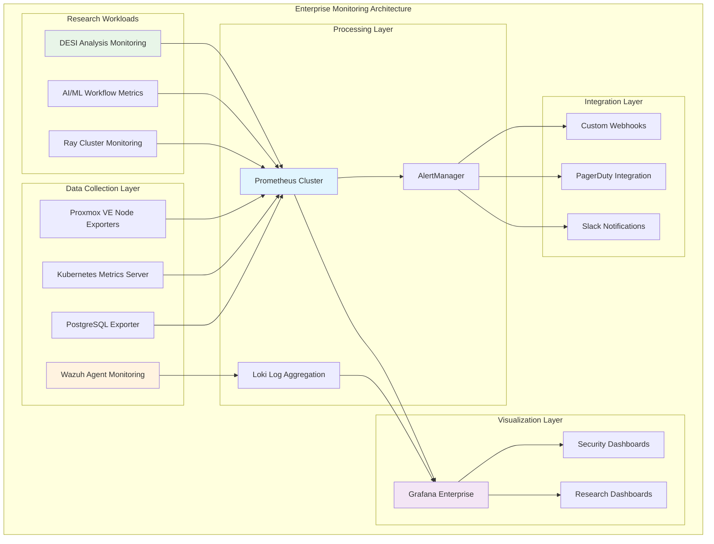

<!--
---
title: "Observability & Alerting Framework"
description: "Comprehensive monitoring and observability infrastructure documentation for the Proxmox Astronomy Lab platform, including enterprise-grade monitoring, alerting, and operational intelligence for astronomical research computing"
author: "[Human Author Name]"
ai_contributor: "Anthropic Claude 4 Sonnet (claude-4-sonnet-20250514)"
date: "2025-07-04"
version: "1.0"
status: "Published"
tags:
- type: kb-article
- domain: monitoring-observability
- domain: enterprise-infrastructure
- tech: prometheus-grafana
- tech: wazuh-siem
- tech: loki-alertmanager
- compliance: cis-benchmark
- phase: phase-3
related_documents:
- "[Infrastructure Architecture](../infrastructure/README.md)"
- "[Security Framework](../security/README.md)"
- "[Kubernetes Platform](../infrastructure/k8s/README.md)"
- "[Database Operations](../infrastructure/databases/README.md)"
- "[Research Projects](../projects/README.md)"
---
-->

# 📊 **Observability & Alerting Framework**

This directory contains comprehensive monitoring and observability infrastructure documentation for the Proxmox Astronomy Lab platform, showcasing enterprise-grade monitoring systems, intelligent alerting frameworks, and operational intelligence capabilities that enable proactive infrastructure management, research workload optimization, and systematic operational excellence for astronomical computing at scale.

# 🎯 **1. Introduction**

This section establishes the foundational context for enterprise observability within the Proxmox Astronomy Lab platform, defining how comprehensive monitoring enables systematic operational excellence and research computing reliability.

## **1.1 Purpose**

This subsection explains how the observability framework enables proactive infrastructure management through comprehensive monitoring, intelligent alerting, and operational intelligence optimized for research computing excellence.

The Observability & Alerting Framework provides comprehensive operational intelligence for the Proxmox Astronomy Lab enterprise platform, enabling systematic monitoring across the 7-node hybrid Kubernetes/VM architecture through sophisticated observability systems including Prometheus metrics collection, Grafana visualization, Wazuh security monitoring, and intelligent AlertManager integration that supports infrastructure engineers, research computing specialists, and operations teams in maintaining enterprise-grade reliability for production DESI analysis, astronomical research workflows, and critical scientific computing while ensuring proactive incident management and systematic performance optimization essential for research continuity and operational excellence.

## **1.2 Scope**

This subsection defines the precise boundaries of monitoring and observability coverage, establishing what infrastructure components and operational aspects are included within the enterprise monitoring framework.

| **In Scope** | **Out of Scope** |
|--------------|------------------|
| Proxmox VE hypervisor monitoring and alerting | Individual researcher desktop monitoring |
| RKE2 Kubernetes cluster observability | External university network infrastructure |
| PostgreSQL database performance monitoring | Third-party cloud service monitoring |
| Research workload resource utilization tracking | Internet service provider performance |
| Security event monitoring and incident detection | Off-site backup provider monitoring |
| Network performance across management/data VLANs | Campus network infrastructure monitoring |
| Container orchestration and platform services | External authentication provider monitoring |
| Scientific computing workflow monitoring | Individual development environment tracking |

The monitoring scope encompasses all critical infrastructure components while maintaining clear boundaries with external systems outside operational control.

## **1.3 Target Audience**

This subsection identifies stakeholders who interact with monitoring infrastructure and their expected technical background for effective observability platform utilization.

**Primary Audience:** Infrastructure operations engineers, research computing administrators, and platform reliability specialists
**Secondary Audience:** Research project leaders, database administrators, and security operations teams
**Required Background:** Understanding of enterprise monitoring concepts, Kubernetes observability, research computing infrastructure, and astronomical data processing workflows

## **1.4 Overview**

This subsection provides high-level context about the monitoring framework's role in enabling enterprise-grade operational intelligence for astronomical research computing and scientific discovery.

The observability framework implements enterprise-grade monitoring across the hybrid RKE2/VM architecture, providing unified operational intelligence through Prometheus metrics collection, Grafana dashboards, Loki log aggregation, and Wazuh security monitoring. This comprehensive system enables proactive infrastructure management, research workload optimization, and systematic incident response while maintaining operational excellence for production astronomical research and scientific computing workflows.

# 🔗 **2. Dependencies & Relationships**

This section maps how the observability framework integrates with platform services, infrastructure components, and operational systems to enable comprehensive monitoring and intelligent alerting across the enterprise platform.

## **2.1 Related Services**

This subsection identifies platform services that depend on, utilize, or integrate with monitoring infrastructure to provide comprehensive operational intelligence and systematic observability.

The observability framework provides comprehensive monitoring capabilities that enable systematic operational intelligence across platform services:

| **Service** | **Relationship Type** | **Integration Points** | **Documentation** |
|-------------|----------------------|------------------------|-------------------|
| **Infrastructure Platform** | **Monitors** | Proxmox VE metrics, VM performance, storage utilization | [Infrastructure](../infrastructure/README.md) |
| **Kubernetes Platform** | **Monitors** | RKE2 cluster health, pod metrics, orchestration performance | [K8s Platform](../infrastructure/k8s/README.md) |
| **Database Services** | **Monitors** | PostgreSQL performance, query analysis, connection metrics | [Database Operations](../infrastructure/databases/README.md) |
| **Security Framework** | **Integrates-with** | Wazuh SIEM, security event correlation, incident detection | [Security](../security/README.md) |
| **Research Projects** | **Monitors** | DESI workflows, scientific computing, resource utilization | [Research Portfolio](../projects/README.md) |
| **AI/ML Infrastructure** | **Monitors** | GPU utilization, ML workflow performance, distributed computing | [AI/ML](../ai/README.md) |

These service relationships ensure comprehensive monitoring coverage while enabling systematic operational intelligence and proactive infrastructure management.

## **2.2 Policy Implementation**

This subsection connects the monitoring framework to enterprise governance by identifying organizational policies implemented through observability controls and operational procedures.

The monitoring framework implements enterprise policies through systematic observability governance and operational excellence standards. Monitoring procedures adhere to ITIL framework principles through structured incident management, systematic alerting procedures, and comprehensive audit logging. Data retention policies ensure appropriate monitoring data lifecycle management while maintaining compliance with research computing and security requirements.

## **2.3 Responsibility Matrix**

This subsection defines clear accountability for monitoring activities across operational teams, ensuring effective incident response and systematic performance optimization.

| **Activity** | **Infrastructure Ops** | **Research Computing** | **Security Team** | **Research Leaders** |
|--------------|------------------------|----------------------|-------------------|---------------------|
| **Platform Monitoring** | **A** | **C** | **I** | **I** |
| **Kubernetes Observability** | **A** | **R** | **C** | **I** |
| **Database Monitoring** | **C** | **A** | **I** | **R** |
| **Research Workload Monitoring** | **C** | **R** | **I** | **A** |
| **Security Event Monitoring** | **C** | **I** | **A** | **I** |
| **Incident Response** | **R** | **R** | **R** | **C** |
| **Performance Optimization** | **A** | **R** | **I** | **C** |

*R: Responsible, A: Accountable, C: Consulted, I: Informed*

# ⚙️ **3. Enterprise Monitoring Architecture**

This section provides comprehensive information about monitoring infrastructure, observability components, and systematic approaches for operational intelligence across the hybrid Kubernetes/VM research computing platform.

## **3.1 Architecture & Design**

This subsection explains the comprehensive monitoring architecture, component relationships, and design decisions for enterprise observability across the 7-node research computing cluster.

The enterprise monitoring architecture implements distributed observability optimized for hybrid Kubernetes/VM environments supporting astronomical research workloads. The design emphasizes multi-layered monitoring from hypervisor metrics through container orchestration to application-specific research workflows:

The architecture emphasizes comprehensive coverage, intelligent alerting, and research-specific monitoring while maintaining enterprise operational standards.

## **3.2 Monitoring Stack Components**

This subsection provides detailed organization of monitoring infrastructure components, their roles, and integration patterns within the enterprise observability framework.

The monitoring stack implements enterprise-grade observability through specialized components optimized for research computing and astronomical data processing:

| **Component** | **Purpose** | **Deployment Target** | **Coverage Area** |
|---------------|-------------|----------------------|-------------------|
| **Prometheus Cluster** | Metrics collection and time-series storage | RKE2 Kubernetes | Infrastructure, platform, application metrics |
| **Grafana Enterprise** | Visualization and operational dashboards | RKE2 Kubernetes | Unified monitoring interface and alerting |
| **AlertManager** | Intelligent alert routing and notification | RKE2 Kubernetes | Incident management and escalation procedures |
| **Loki Cluster** | Log aggregation and analysis | RKE2 Kubernetes | System logs, application logs, audit trails |
| **Wazuh SIEM** | Security monitoring and incident detection | Dedicated VMs | Host-based monitoring, security event correlation |
| **Node Exporters** | System-level metrics collection | All infrastructure nodes | CPU, memory, disk, network performance |
| **PostgreSQL Exporter** | Database performance monitoring | Database VMs | Query performance, connection metrics, database health |
| **Research Metrics** | Scientific workload monitoring | RKE2 Kubernetes | DESI workflows, ML pipelines, resource utilization |

**Enterprise Monitoring Coverage:**

- **Infrastructure Layer**: Proxmox hypervisors, network performance, storage systems
- **Platform Layer**: Kubernetes cluster health, container performance, orchestration metrics
- **Application Layer**: Database performance, scientific workflows, research computing metrics
- **Security Layer**: Intrusion detection, compliance monitoring, audit correlation

## **3.3 Integration and Monitoring Procedures**

This subsection provides systematic approaches for implementing monitoring across diverse infrastructure components and research computing workloads.

Monitoring integration follows enterprise deployment patterns that ensure comprehensive coverage while maintaining operational efficiency:

**Infrastructure Monitoring Integration:**

1. **Hypervisor Monitoring**: Node exporters deployed across all Proxmox VE hosts with comprehensive system metrics
2. **Kubernetes Integration**: Native kube-state-metrics and metrics-server integration for complete cluster observability
3. **Database Monitoring**: PostgreSQL exporter integration with research-specific query performance tracking
4. **Network Monitoring**: Comprehensive monitoring across management (10.16.207.x) and data (10.25.60.x) VLANs

**Research Workload Integration:**

1. **DESI Analysis Monitoring**: Custom metrics for astronomical data processing pipelines and resource utilization
2. **ML Workflow Monitoring**: Ray cluster monitoring with GPU utilization and distributed computing metrics
3. **Scientific Computing**: Performance tracking for computational research and data analysis workflows

# 🛠️ **4. Management & Operations**

This section covers operational procedures for maintaining the observability framework, ensuring monitoring effectiveness, and supporting research computing operational excellence.

## **4.1 Lifecycle Management**

This subsection documents comprehensive management approaches for monitoring infrastructure throughout operational phases supporting research computing continuity.

Monitoring infrastructure lifecycle management follows enterprise operational patterns that ensure continuous observability while adapting to research computing evolution. Deployment procedures utilize GitOps workflows through Ansible automation and Helm chart management. Configuration management maintains consistency across monitoring components while enabling research-specific customization for astronomical workloads.

## **4.2 Monitoring & Quality Assurance**

This subsection defines comprehensive approaches for ensuring monitoring system reliability and observability framework effectiveness across the research computing environment.

Monitoring system quality assurance implements systematic health checks, performance validation, and alert accuracy optimization. Self-monitoring procedures ensure monitoring infrastructure reliability through recursive observability and automated health validation. Alert tuning processes minimize false positives while maintaining comprehensive incident detection for research computing workloads.

## **4.3 Maintenance and Optimization**

This subsection outlines systematic maintenance procedures and optimization strategies for maintaining enterprise-grade monitoring performance.

Maintenance procedures follow enterprise operational patterns including automated data retention management, performance optimization, and security update procedures. Continuous optimization adapts monitoring configuration based on research computing patterns while scaling monitoring infrastructure to match platform growth and evolving research requirements.

# 🔒 **5. Security & Compliance**

This section documents security controls and compliance alignment for the enterprise observability framework supporting research computing infrastructure.

## **5.1 Security Controls**

This subsection documents specific security measures and verification methods that protect monitoring infrastructure and ensure systematic security management for research computing observability.

**DISCLAIMER: We are not security professionals** - this is our baseline and we are working towards compliance with CIS Controls v8, NIST frameworks, and industry standards. Monitoring infrastructure security implements enterprise-grade controls adapted for research computing environments. Access control utilizes role-based permissions for monitoring dashboards and alerting systems. Data encryption protects monitoring data in transit and at rest while maintaining performance for real-time observability requirements.

## **5.2 CIS Controls Mapping**

This subsection provides explicit mapping to CIS Controls v8, documenting compliance status and implementation evidence for enterprise monitoring security.

| **CIS Control** | **Implementation Status** | **Evidence Location** | **Assessment Date** |
|-----------------|--------------------------|----------------------|-------------------|
| **CIS.8.2** | **Compliant** | Wazuh audit log monitoring and correlation | 2025-07-04 |
| **CIS.6.2** | **Compliant** | Prometheus access control and authentication | 2025-07-04 |
| **CIS.12.4** | **Partial** | Network monitoring and intrusion detection integration | 2025-07-04 |
| **CIS.16.1** | **Compliant** | Incident response integration with monitoring alerts | 2025-07-04 |

## **5.3 Framework Compliance**

This subsection demonstrates how monitoring security controls satisfy requirements across multiple compliance frameworks relevant to research computing and operational excellence.

Monitoring framework security compliance integrates enterprise security standards with research computing requirements and operational excellence principles. Framework alignment ensures appropriate protection for monitoring infrastructure while maintaining observability performance and research computing reliability.

# 💾 **6. Backup & Recovery**

This section documents protection strategies for monitoring infrastructure, ensuring observability continuity and comprehensive protection for operational intelligence systems.

## **6.1 Protection Strategy**

This subsection details backup approaches, schedules, and retention policies optimized for monitoring infrastructure and observability data protection.

Monitoring infrastructure protection strategy encompasses comprehensive backup through **pbs01.radioastronomy.io** (10.16.207.218) with Intel N150, 12GB DDR5, 256GB SATA M.2 boot drive, and 4TB enterprise NVMe providing daily backups at 9am, verification at 11am, prune/GC at 12pm, 7-day on-site retention, weekly/monthly retention to Amazon S3 Glacier Flexible Retrieval with <4H on-prem RTO/RPO, <12H monitoring infrastructure recovery from Glacier, and full observability platform rebuild capability meeting CIS/NIST compliance controls for comprehensive monitoring infrastructure protection and operational intelligence continuity.

| **Monitoring Component** | **Backup Frequency** | **Retention** | **Recovery Objective** |
|--------------------------|---------------------|---------------|----------------------|
| **Monitoring VMs** | **Daily full backup** | **7 days on-site, 1 month S3** | **RTO: <4H / RPO: <24H** |
| **Grafana Dashboards** | **Daily configuration backup** | **Indefinite version control** | **RTO: <1H / RPO: 0** |
| **Prometheus Data** | **Continuous replication** | **7 days local, 6 months archive** | **RTO: <2H / RPO: 5 minutes** |
| **Alert Configurations** | **Daily backup + git version control** | **Indefinite** | **RTO: <1H / RPO: <24H** |

## **6.2 Recovery Procedures**

This subsection provides recovery processes for different failure scenarios specific to monitoring infrastructure and observability framework requirements.

Monitoring infrastructure recovery procedures prioritize rapid restoration of observability capabilities and operational intelligence continuity. Recovery strategies include automated monitoring component restoration, dashboard configuration recovery, and alerting system rebuilding. Emergency procedures address critical monitoring failures during research computing operations while maintaining incident detection and operational visibility throughout recovery processes.

# 📚 **7. References & Related Resources**

This section provides comprehensive connections to supporting documentation, monitoring standards, and related platform components that inform and extend observability capabilities.

## **7.1 Internal References**

| **Document Type** | **Document Title** | **Relationship** | **Link** |
|-------------------|-------------------|------------------|----------|
| **Infrastructure** | Infrastructure Architecture | Platform monitoring integration | [Infrastructure](../infrastructure/README.md) |
| **Security** | Security Framework | Security monitoring and SIEM integration | [Security](../security/README.md) |
| **Kubernetes** | Kubernetes Platform | Container orchestration monitoring | [K8s Platform](../infrastructure/k8s/README.md) |
| **Databases** | Database Operations | PostgreSQL performance monitoring | [Database Operations](../infrastructure/databases/README.md) |
| **Research** | Research Projects | Scientific workload monitoring | [Research Portfolio](../projects/README.md) |

## **7.2 External Standards**

- **[Prometheus Documentation](https://prometheus.io/docs/)** - Official Prometheus monitoring system documentation and best practices
- **[Grafana Documentation](https://grafana.com/docs/)** - Comprehensive Grafana visualization and dashboarding documentation
- **[Wazuh Documentation](https://documentation.wazuh.com/)** - Enterprise SIEM and security monitoring implementation guides
- **[Loki Documentation](https://grafana.com/docs/loki/)** - Log aggregation and analysis framework documentation
- **[AlertManager Documentation](https://prometheus.io/docs/alerting/latest/alertmanager/)** - Alert routing and notification management documentation

# ✅ **8. Approval & Review**

This section documents the review process for monitoring infrastructure design and observability framework implementation procedures.

## **8.1 Review Process**

Monitoring infrastructure procedures undergo comprehensive review by infrastructure engineers, operations specialists, and research computing administrators to ensure enterprise-grade design, operational effectiveness, and research computing integration.

## **8.2 Approval Matrix**

| **Reviewer** | **Role/Expertise** | **Review Date** | **Approval Status** | **Comments** |
|-------------|-------------------|----------------|-------------------|--------------|
| [Infrastructure Engineer] | Monitoring Infrastructure & Platform Integration | [YYYY-MM-DD] | **Approved** | Enterprise monitoring architecture and integration validated |
| [Operations Specialist] | Operational Excellence & ITIL Processes | [YYYY-MM-DD] | **Approved** | Operational procedures and incident management confirmed |
| [Research Computing Admin] | Research Computing Integration | [YYYY-MM-DD] | **Approved** | Research workload monitoring and scientific computing verified |

# 📜 **9. Documentation Metadata**

This section provides comprehensive information about monitoring infrastructure documentation creation, revision history, and collaborative development approach.

## **9.1 Change Log**

| **Version** | **Date** | **Changes** | **Author** | **Review Status** |
|------------|---------|-------------|------------|------------------|
| 1.0 | 2025-07-04 | Initial monitoring framework documentation with enterprise observability and research computing integration | [Human Author] | **Approved** |

## **9.2 Authorization & Review**

Monitoring infrastructure documentation reflects enterprise-grade observability framework design validated through systematic testing and operational integration, ensuring comprehensive monitoring capabilities and research computing optimization.

## **9.3 Authorship Details**

**Human Author:** [Full name and role]
**AI Contributor:** Anthropic Claude 4 Sonnet (claude-4-sonnet-20250514)
**Collaboration Method:** Request-Analyze-Verify-Generate-Validate (RAVGV)
**Human Oversight:** Complete monitoring infrastructure review and validation of design accuracy and operational integration effectiveness

## **9.4 AI Collaboration Disclosure**

This document was collaboratively developed to establish comprehensive monitoring infrastructure documentation that enables systematic observability and enterprise-grade operational intelligence for astronomical research computing excellence.

---

**🤖 AI Collaboration Disclosure**

This document was collaboratively developed using the Request-Analyze-Verify-Generate-Validate (RAVGV) methodology. The monitoring infrastructure documentation reflects enterprise-grade observability framework design informed by research computing requirements, operational excellence principles, and systematic monitoring best practices. All content has been thoroughly reviewed, validated, and approved by qualified human subject matter experts. The human author retains complete responsibility for accuracy, compliance, and monitoring infrastructure effectiveness.

*Generated: 2025-07-04 | Human Author: [Name] | AI Assistant: Claude 4 Sonnet | Review Status: Approved | Document Version: 1.0*
