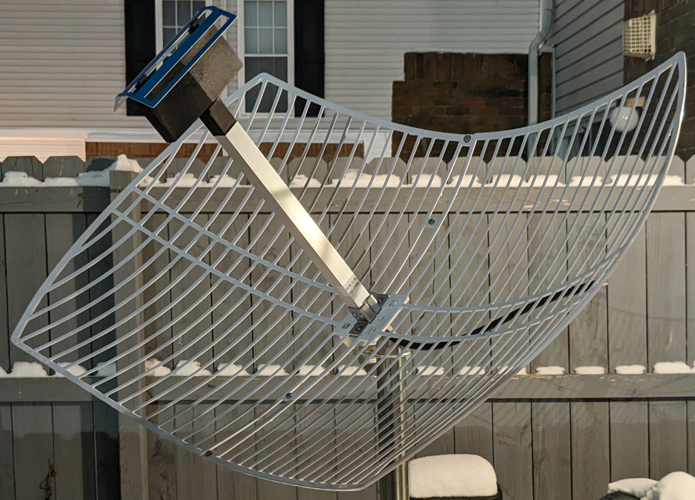
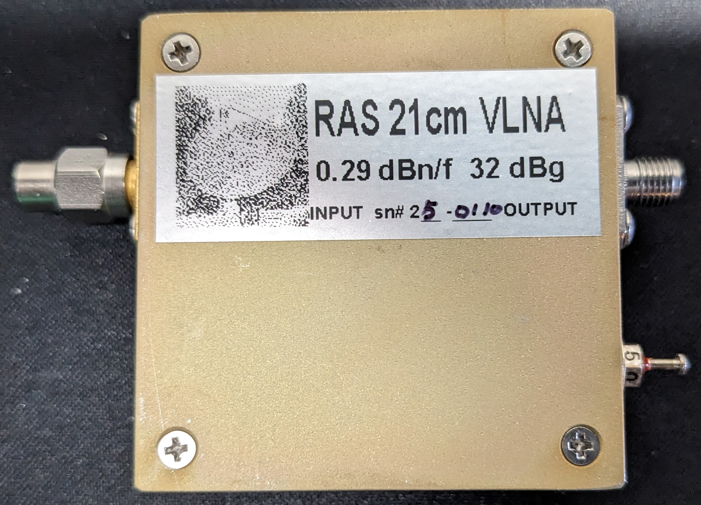
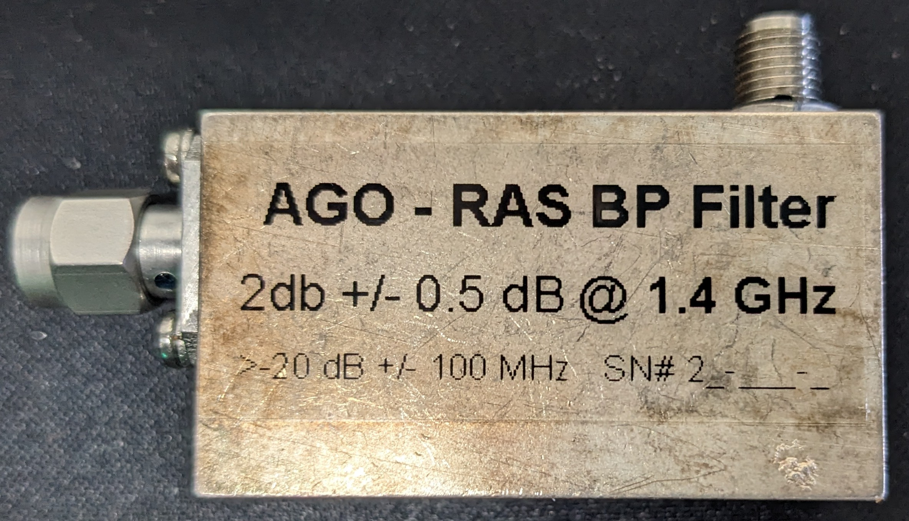
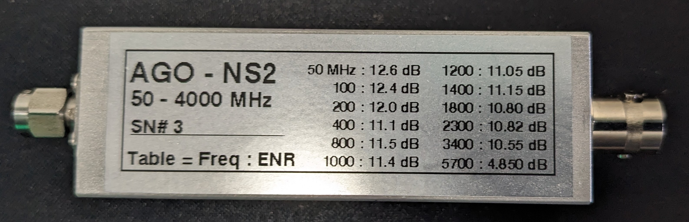

# **Hydrogen Line Research - Proxmox Astronomy Lab**

## **📡 Overview**

The **Hydrogen Line (1420.4057 MHz)** is a fundamental radio emission that enables astronomers to **map interstellar hydrogen, analyze galactic kinematics, and study high-velocity clouds (HVCs)**. The **Proxmox Astronomy Lab** is dedicated to **long-term Hydrogen Line spectral analysis**, utilizing **research-grade hardware, AI-enhanced signal processing, and structured data pipelines** to maximize observational accuracy.

This document details the **hardware setup, signal processing pipeline, and expected system performance**.

---

## **🔬 Hydrogen Line Feed Chain & Expected Sensitivity**

The observatory’s **RF front-end** is optimized for **low-noise, high-sensitivity Hydrogen Line detection**.

### **📡 Primary Antenna**

| Specification | Details |
|--------------|---------|
| **Type** | Nooelec GOES Parabolic Mesh |
| **Gain** | 21 dBi |
| **Beamwidth** | ~5° |
| **Center Frequency** | 1.7 GHz |
| **Bandwidth** | 200 MHz+ |
| **Polarization** | RHCP & LHCP capable |
| **Connector** | SMA male |

---

### **🎛 Filtering & Amplification**

| Component | Specification |
|-----------|--------------|
| **Bandpass Filter** | AGO - RAS BP Filter (1.4 GHz, 2 dB ± 0.5 dB insertion loss, >20 dB attenuation at ±100 MHz) |
| **Low Noise Amplifier (LNA)** | RAS 21cm VLNA (0.29 dB noise figure, 32 dB gain, SMA connectors) |
| **Noise Source** | AGO - NS2 (50 - 4000 MHz, ENR @ 1420 MHz: 11.1 dB) |
| **GPSDO (Reference Clock)** | GooZeeZOO NEO-6M (High-precision GPS-disciplined oscillator for frequency stability) |

**🔹 System Characteristics:**

- **Total System Gain:** ~49 dB (Antenna + LNA + Filter)
- **System Noise Figure:** <1 dB
- **Minimum Detectable Signal (MDS):** -140 dBm (0.1s integration)
- **Expected SNR for Hydrogen Line Detection:**
  - **Clear sky, 10-minute integration:** 20-25 dB
  - **Extended integration (1+ hours):** >30 dB

---

### **🛰 Software-Defined Radio (SDR) Receiver**

- **Model:** Airspy R2
- **Bit Depth:** 12-bit ADC
- **Sample Rate:** Configurable up to 10 MSPS
- **Tunable Range:** 24-1700 MHz (with SpyVerter support)
- **USB Interface:** USB 2.0 high-speed

---

### **🖥 Edge Node (Data Collection Unit)**

| Component | Specification |
|-----------|--------------|
| **Model** | N100 Mini PC |
| **Storage** | 1TB SSD |
| **Role** | Real-time SDR data acquisition & pre-processing |
| **Software Stack** | Ubuntu 24.04, Airspy tools, SoapySDR, FFT processing scripts |

---

## **🔄 Hydrogen Line Data Processing Pipeline**

The **data processing pipeline** consists of **sequential stages**, from **raw signal acquisition to AI-enhanced spectral analysis**.

### **🔹 Data Acquisition & Preprocessing**

1. **Raw RF Capture** (Airspy R2 SDR → I/Q Sample Stream)
2. **Bandpass Filtering & Noise Reduction**
   - Hardware: **RAS-1420LNA-CBPF**
   - Software: **FFT-based filtering**
3. **Time-Frequency Binning & Signal Normalization**
   - Maintains spectral consistency across observations

---

### **🔹 Doppler Shift & Velocity Analysis**

| Process | Purpose |
|---------|---------|
| **Spectral Calibration** | GPSDO ensures frequency stability |
| **Doppler Correction** | Compensates for Earth's rotation and relative motion |
| **Hydrogen Line Velocity Mapping** | Computes radial velocities of interstellar gas clouds |

---

### **🔹 AI-Enhanced Signal Processing**

- **Noise Reduction:** Deep learning models trained on real & synthetic datasets
- **Feature Extraction & Anomaly Detection:** Identifies spectral deviations
- **Automated Data Labeling & Classification:** Hydrogen Line signal tagging for database storage

---

### **🔹 Data Storage & Visualization**

| Stage | Details |
|-------|---------|
| **Real-Time Database Ingestion** | PostgreSQL + TimescaleDB stores spectral time-series data |
| **Public Data Access** | REST API & Grafana dashboards provide live data visualization |
| **Archival & Research Export** | Periodic dataset releases for external research |

📌 **More details available in [Data Pipelines](../data-pipelines.md).**

---

## **🌍 Research & Public Data Availability**

The **Hydrogen Line project** contributes to **open-science initiatives**, making processed data available to **citizen scientists and researchers**.

### **🔹 Live Data Access**

- **Public Grafana Dashboards**: Real-time Hydrogen Line signal plots
- **REST API**: Query-based access to historical observations

### **🔹 External Data Integrations**

- **NASA Sky Survey**: Cross-referencing Hydrogen Line detections
- **Citizen Science Collaborations**: Working with amateur radio astronomers
- **NRAO Data Comparisons**: Using archival radio astronomy datasets

---

## **🚀 Future Upgrades & Research Goals**

The **next phase** of Hydrogen Line research includes:
✅ **Deploying a 1.2m dish** for improved spatial resolution  
✅ **AI-enhanced spectral classification** for automated signal tagging  
✅ **Expanding dataset hosting** via an **S3-based repository**  

🔹 **Stay updated by following the main repository!**  

📌 **For full documentation, visit the main [Proxmox Astronomy Lab README](../README.md).**
