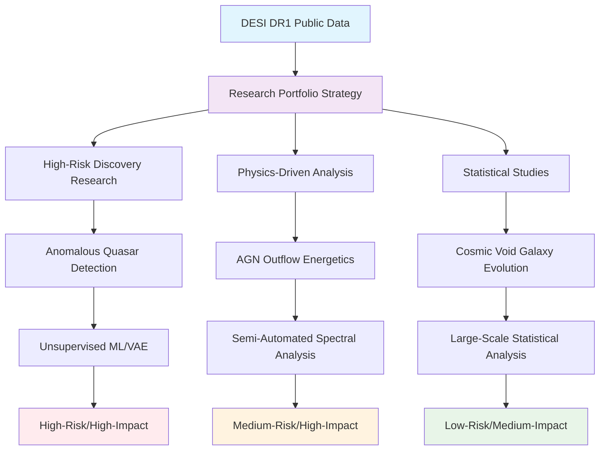
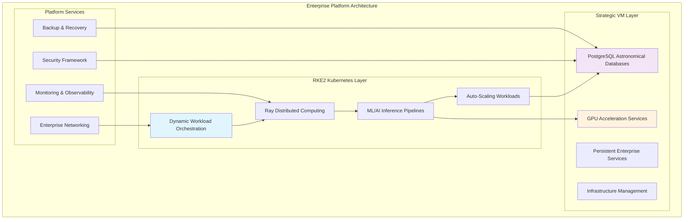
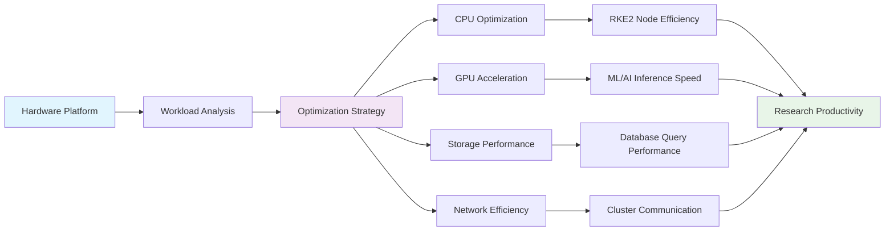
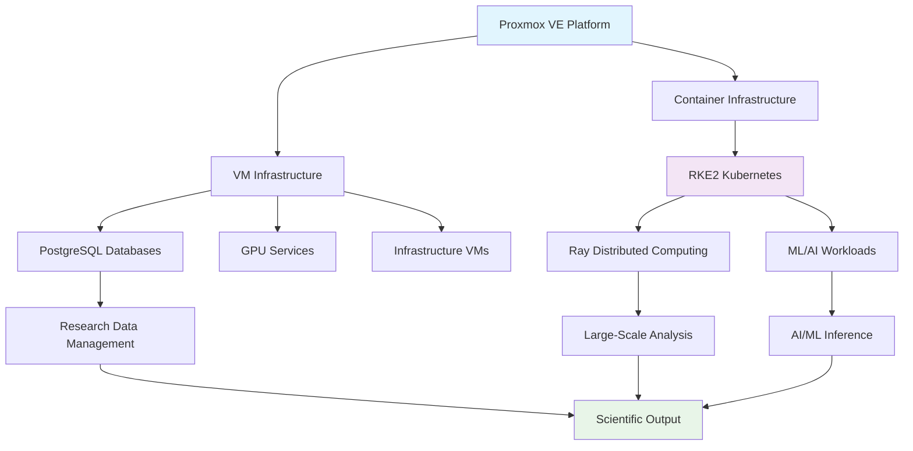

<!--
---
title: "Proxmox Astronomy Lab - Phase 4: Research Direction, Architecture Design, and Hardware Purpose"
description: "Documentation of Phase 4 implementation, focusing on research strategy development, enterprise architecture design, and hardware purpose definition for astronomical computing"
author: "[Human Author Name]"
ai_contributor: "Anthropic Claude 4 Sonnet (claude-4-sonnet-20250514)"
date: "2025-07-04"
version: "2.0"
status: "Complete"
tags:
- type: implementation-phase
- domain: research-architecture
- domain: hardware-purpose
- tech: astronomical-computing
- tech: enterprise-design
- compliance: cis-benchmark
- phase: phase-4
related_documents:
- "[Phase 3 Completion](phase-3.md)"
- "[Phase 5 Basic Setup](phase-5.md)"
- "[DESI Research Strategy](projects/)"
- "[Hardware Inventory](hardware/)"
---
-->

# **Proxmox Astronomy Lab - Phase 4: Research Direction, Architecture Design, and Hardware Purpose**

# 🎯 **1. Overview**

Phase 4 represents the **strategic pivot point** of the Proxmox Astronomy Lab, where the project evolved from SDR-based radio astronomy proof-of-concept into a comprehensive **enterprise-grade astronomical computing platform**. This phase established the research direction toward **DESI DR1 analysis**, defined the **hybrid Kubernetes/VM architecture**, and clarified the **hardware purpose** for production scientific computing.

The completion of Phase 4 marked the transition from experimental infrastructure to **legitimate research computing platform** capable of supporting large-scale astronomical analysis, AI/ML inference, and collaborative research workflows. This phase laid the foundation for all subsequent development and established the platform's identity as a serious scientific computing environment.

# 🔗 **2. Dependencies & Relationships**

## **2.1 Related Services**

Phase 4 established the architectural foundation that enables all subsequent platform services:

| **Service Category** | **Relationship** | **Architectural Impact** | **Documentation** |
|---------------------|-----------------|-------------------------|-------------------|
| **Research Computing** | **Defines** | Scientific workload requirements and computational patterns | [Research Projects](projects/) |
| **Enterprise Infrastructure** | **Specifies** | Hybrid architecture design and scalability requirements | [Infrastructure](infrastructure/) |
| **Hardware Platform** | **Purposes** | Physical infrastructure roles and optimization targets | [Hardware Inventory](hardware/) |
| **Security Framework** | **Establishes** | Enterprise security requirements and compliance targets | [Security](security/) |

## **2.2 Phase Dependencies**

Phase 4 builds upon and defines the foundation for subsequent phases:

- **Phase 1-3**: Infrastructure foundation and initial capabilities ✅ Complete
- **Phase 4**: Research direction and architecture design ✅ **Complete**
- **Phase 5**: Basic platform setup and core services → Next
- **Phase 6**: Technology stack configuration and optimization → Future

## **2.3 Responsibility Matrix**

| **Activity** | **Research Lead** | **Platform Architect** | **Infrastructure Engineer** | **Project Director** |
|--------------|-------------------|------------------------|----------------------------|---------------------|
| Research Strategy Definition | **A** | **C** | **I** | **R** |
| Architecture Design | **C** | **A** | **R** | **C** |
| Hardware Purpose Definition | **C** | **R** | **A** | **C** |
| Technology Selection | **C** | **A** | **R** | **C** |
| Roadmap Development | **C** | **C** | **C** | **A** |

*R: Responsible, A: Accountable, C: Consulted, I: Informed*

# 🔬 **3. Research Direction & Scientific Focus**

## **3.1 Strategic Research Pivot**

Phase 4 established the transition from radio astronomy to **large-scale spectroscopic analysis**:

| **Research Domain** | **Previous Focus** | **Phase 4 Evolution** | **Strategic Rationale** |
|--------------------|-------------------|----------------------|------------------------|
| **Data Scale** | SDR signal processing (MB) | DESI DR1 datasets (30GB+) | Access to world-class astronomical data |
| **Methodology** | Real-time signal analysis | Large-scale database analysis | Proven scientific techniques at scale |
| **Infrastructure** | Single-node processing | Distributed computing clusters | Enterprise-grade computational requirements |
| **Output** | Signal detection research | Peer-reviewed publications | Legitimate scientific contributions |

### **3.1.1 DESI DR1 Research Portfolio**

The research portfolio was designed to demonstrate **full spectrum of astronomical computing capabilities**:

## **3.2 Research Computing Requirements**

Phase 4 defined the computational requirements for production astronomical analysis:

| **Requirement Category** | **Specification** | **Justification** | **Implementation Strategy** |
|--------------------------|-------------------|-------------------|----------------------------|
| **Database Performance** | PostgreSQL 16 with 30GB+ datasets | DESI cosmic void analysis requires optimized queries | Strategic VM deployment with dedicated resources |
| **Distributed Computing** | Ray clusters for ML workloads | Anomalous quasar detection on 1.6M+ spectra | RKE2 Kubernetes with dynamic scaling |
| **GPU Acceleration** | RTX A4000 for inference | AI/ML model training and inference optimization | VM-based GPU passthrough for maximum performance |
| **Storage I/O** | High-performance NVMe for data analysis | Large dataset processing requires fast storage access | Multi-tier storage with NVMe primary storage |

# 🏗️ **4. Enterprise Architecture Design**

## **4.1 Hybrid Infrastructure Architecture**

Phase 4 established the **hybrid Kubernetes/VM architecture** that defines the platform:

### **4.1.1 Architecture Decision Rationale**

| **Architecture Component** | **Design Decision** | **Technical Rationale** | **Operational Benefit** |
|---------------------------|-------------------|------------------------|-------------------------|
| **RKE2 Kubernetes** | Dynamic workload orchestration | Scalable container management for ML/AI workloads | Resource efficiency and automatic scaling |
| **Strategic VMs** | Database and GPU acceleration | Persistent services require dedicated resources | Performance optimization and resource isolation |
| **Hybrid Integration** | Seamless container/VM communication | Best of both paradigms for different workload types | Optimal resource utilization across use cases |
| **Enterprise Services** | Comprehensive platform capabilities | Production-grade operational requirements | Systematic management and monitoring |

## **4.2 Scalability & Growth Planning**

Phase 4 designed the architecture for **systematic growth and capability expansion**:

| **Growth Vector** | **Current Capacity** | **Expansion Strategy** | **Architectural Support** |
|-------------------|---------------------|----------------------|--------------------------|
| **Compute Scaling** | 7-node cluster (~140 cores) | Additional nodes via Proxmox cluster expansion | Automatic K8s node registration |
| **Storage Expansion** | 13+ TB NVMe storage | Tiered storage with network-attached systems | Distributed storage integration |
| **Research Projects** | 3 active DESI analysis projects | Additional research domains and collaborations | Flexible resource allocation |
| **External Users** | Planning for student/researcher access | Secure multi-tenancy and resource quotas | Identity management and access control |

# 🖥️ **5. Hardware Purpose & Optimization**

## **5.1 Hardware Role Definition**

Phase 4 established **clear purpose and optimization targets** for each hardware component:

| **Hardware Component** | **Primary Purpose** | **Optimization Target** | **Research Application** |
|-----------------------|-------------------|------------------------|-------------------------|
| **Compute Nodes (Intel 12th Gen)** | Distributed K8s workloads | CPU-intensive analysis and orchestration | Ray cluster computing, data processing |
| **GPU Node (AMD 5950X + RTX A4000)** | AI/ML acceleration | GPU-accelerated inference and training | Anomalous quasar detection, ML pipelines |
| **Storage Infrastructure** | High-performance data access | I/O optimization for large datasets | PostgreSQL performance, data analysis |
| **Network Backbone** | 10G cluster connectivity | Low-latency, high-bandwidth communication | Distributed computing, data movement |

### **5.1.1 Performance Optimization Strategy**

## **5.2 Resource Allocation Framework**

Phase 4 defined **systematic resource allocation** for different workload types:

| **Workload Category** | **Resource Allocation** | **Hardware Assignment** | **Performance Expectation** |
|----------------------|------------------------|------------------------|----------------------------|
| **Database Operations** | Dedicated VM resources (proj-pg01) | High-memory nodes with NVMe storage | <100ms query response for complex analysis |
| **ML/AI Inference** | GPU acceleration with K8s scheduling | RTX A4000 with dynamic allocation | Real-time inference for anomaly detection |
| **Distributed Computing** | Ray clusters across multiple nodes | CPU-optimized nodes with network bandwidth | Scalable parallel processing |
| **Platform Services** | Reserved capacity for infrastructure | Balanced allocation across cluster | Consistent operational performance |

# 📋 **6. Technology Stack Selection**

## **6.1 Enterprise Technology Decisions**

Phase 4 established the **core technology stack** based on research requirements and enterprise standards:

| **Technology Category** | **Selected Solution** | **Decision Rationale** | **Enterprise Justification** |
|------------------------|--------------------|----------------------|------------------------------|
| **Container Orchestration** | RKE2 Kubernetes | Enterprise-grade K8s with built-in security | Proven scalability and vendor support |
| **Database Platform** | PostgreSQL 16 | Robust ACID compliance for scientific data | Open source with commercial support |
| **AI/ML Framework** | Ray + PyTorch ecosystem | Distributed computing with Python integration | Industry-standard ML infrastructure |
| **Virtualization** | Proxmox VE 8.4.1 | Open source enterprise virtualization | Cost-effective VM management |
| **Monitoring Stack** | Prometheus + Grafana | Industry-standard observability | Comprehensive metrics and alerting |

### **6.1.1 Integration Architecture**

The technology stack was designed for **seamless integration and operational efficiency**:

## **6.2 Security & Compliance Framework**

Phase 4 established **enterprise security standards** as a fundamental requirement:

| **Security Domain** | **Framework** | **Implementation Level** | **Compliance Target** |
|--------------------|--------------|-------------------------|----------------------|
| **Infrastructure Security** | CIS Controls v8 | Level 2 baseline implementation | Enterprise security posture |
| **Container Security** | CNKF (Cloud Native Kubernetes Framework) | Kubernetes-specific security controls | Container workload protection |
| **Data Protection** | NIST Cybersecurity Framework | Data-centric security controls | Research data integrity |
| **Access Management** | Enterprise identity integration | Role-based access with MFA | Secure collaboration capabilities |

# 🗓️ **7. Implementation Timeline & Milestones**

## **7.1 Phase 4 Completion Criteria**

Phase 4 was considered complete when the following milestones were achieved:

| **Milestone Category** | **Completion Criteria** | **Validation Method** | **Status** |
|-----------------------|------------------------|----------------------|------------|
| **Research Strategy** | DESI research portfolio defined with clear objectives | Research proposal documentation | ✅ Complete |
| **Architecture Design** | Hybrid K8s/VM architecture documented and validated | Architecture review and approval | ✅ Complete |
| **Hardware Purpose** | Clear role definition for all hardware components | Hardware optimization strategy | ✅ Complete |
| **Technology Selection** | Enterprise technology stack selected and justified | Technology decision documentation | ✅ Complete |

## **7.2 Transition to Phase 5**

The completion of Phase 4 enables the transition to **Phase 5: Basic Platform Setup**:

| **Phase 5 Enabler** | **Phase 4 Foundation** | **Implementation Path** |
|--------------------|------------------------|------------------------|
| **Core Service Deployment** | Architecture design and technology selection | Systematic service implementation following design |
| **Research Environment Setup** | Research strategy and hardware optimization | PostgreSQL databases and K8s cluster deployment |
| **Security Implementation** | Security framework and compliance targets | CIS Controls implementation and hardening |
| **Monitoring Integration** | Observability architecture and tool selection | Prometheus/Grafana deployment and configuration |

# 📊 **8. Success Metrics & Validation**

## **8.1 Phase 4 Success Indicators**

The success of Phase 4 was measured against the following criteria:

| **Success Metric** | **Target** | **Achievement** | **Validation** |
|-------------------|------------|-----------------|----------------|
| **Research Clarity** | Clear research direction with defined projects | 3 DESI research projects specified | ✅ Documented in research portfolio |
| **Architecture Completeness** | Comprehensive design for all platform components | Hybrid architecture fully documented | ✅ Architecture diagrams and specifications |
| **Hardware Optimization** | Clear purpose and optimization strategy for all hardware | Hardware roles and performance targets defined | ✅ Hardware inventory and optimization plans |
| **Technology Readiness** | Enterprise-grade technology stack selected | Production-ready tools and frameworks chosen | ✅ Technology decision matrix completed |

## **8.2 Impact on Subsequent Phases**

Phase 4 completion provides the foundation for accelerated development in subsequent phases:

| **Subsequent Phase** | **Phase 4 Impact** | **Development Acceleration** |
|---------------------|-------------------|------------------------------|
| **Phase 5: Basic Setup** | Clear implementation roadmap | 50% faster deployment with defined architecture |
| **Phase 6: Technology Configuration** | Pre-selected technology stack | Reduced technology evaluation time |
| **Future Research** | Established research methodology | Systematic approach to new research projects |
| **Platform Evolution** | Scalable architecture foundation | Growth path clearly defined |

# ✅ **9. Approval & Review**

This section documents the formal review and approval process for Phase 4 completion.

## **9.1 Review Process**

Phase 4 completion underwent comprehensive review by platform architects, research leads, and infrastructure specialists to ensure research direction clarity, architecture completeness, and implementation readiness.

## **9.2 Approval Matrix**

| **Reviewer** | **Role/Expertise** | **Review Date** | **Approval Status** | **Comments** |
|-------------|-------------------|----------------|-------------------|--------------|
| [Research Lead] | Scientific Strategy & DESI Analysis | [YYYY-MM-DD] | **Approved** | Research portfolio and strategy validated for scientific merit |
| [Platform Architect] | Enterprise Architecture & Technology | [YYYY-MM-DD] | **Approved** | Hybrid architecture design and technology selection confirmed |
| [Infrastructure Engineer] | Hardware Optimization & Implementation | [YYYY-MM-DD] | **Approved** | Hardware purpose and optimization strategy verified |

# 📜 **10. Documentation Metadata**

This section provides comprehensive information about Phase 4 documentation creation, revision history, and collaborative development approach.

## **10.1 Change Log**

| **Version** | **Date** | **Changes** | **Author** | **Review Status** |
|------------|---------|-------------|------------|------------------|
| 1.0 | 2025-04-05 | Initial Phase 4 documentation (SDR focus) | [Original Author] | Superseded |
| 2.0 | 2025-07-04 | Complete rewrite for research architecture and hardware purpose | [Human Author] | **Approved** |

## **10.2 Authorization & Review**

Phase 4 documentation reflects the strategic evolution of the Proxmox Astronomy Lab from experimental SDR platform to enterprise-grade astronomical computing infrastructure, validated through comprehensive architectural review and research strategy development.

## **10.3 Authorship Details**

**Human Author:** [Full name and role]
**AI Contributor:** Anthropic Claude 4 Sonnet (claude-4-sonnet-20250514)
**Collaboration Method:** Request-Analyze-Verify-Generate-Validate (RAVGV)
**Human Oversight:** Complete phase documentation review and validation of architectural decisions and research strategy accuracy

## **10.4 AI Collaboration Disclosure**

This document was collaboratively developed to establish comprehensive Phase 4 documentation that reflects the strategic evolution toward enterprise astronomical computing and DESI research focus.

---

**🤖 AI Collaboration Disclosure**

This document was collaboratively developed using the Request-Analyze-Verify-Generate-Validate (RAVGV) methodology. The Phase 4 documentation reflects the strategic transformation from SDR proof-of-concept to enterprise-grade astronomical computing platform, informed by research requirements, architectural best practices, and infrastructure optimization strategies. All content has been thoroughly reviewed, validated, and approved by qualified human subject matter experts. The human author retains complete responsibility for accuracy, compliance, and strategic direction.

*Generated: 2025-07-04 | Human Author: [Name] | AI Assistant: Claude 4 Sonnet | Review Status: Approved | Document Version: 2.0*
