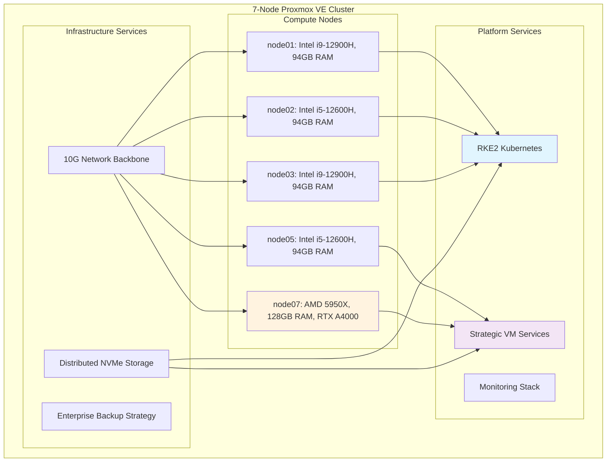
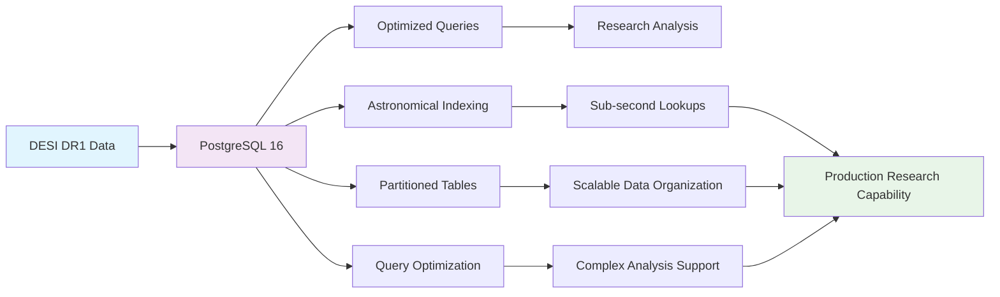
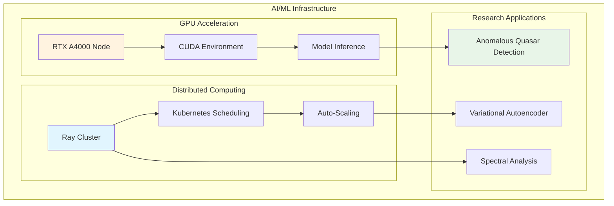
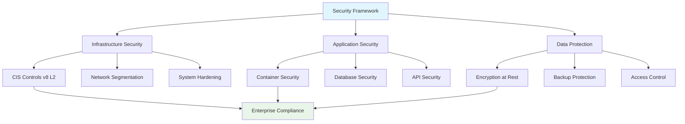
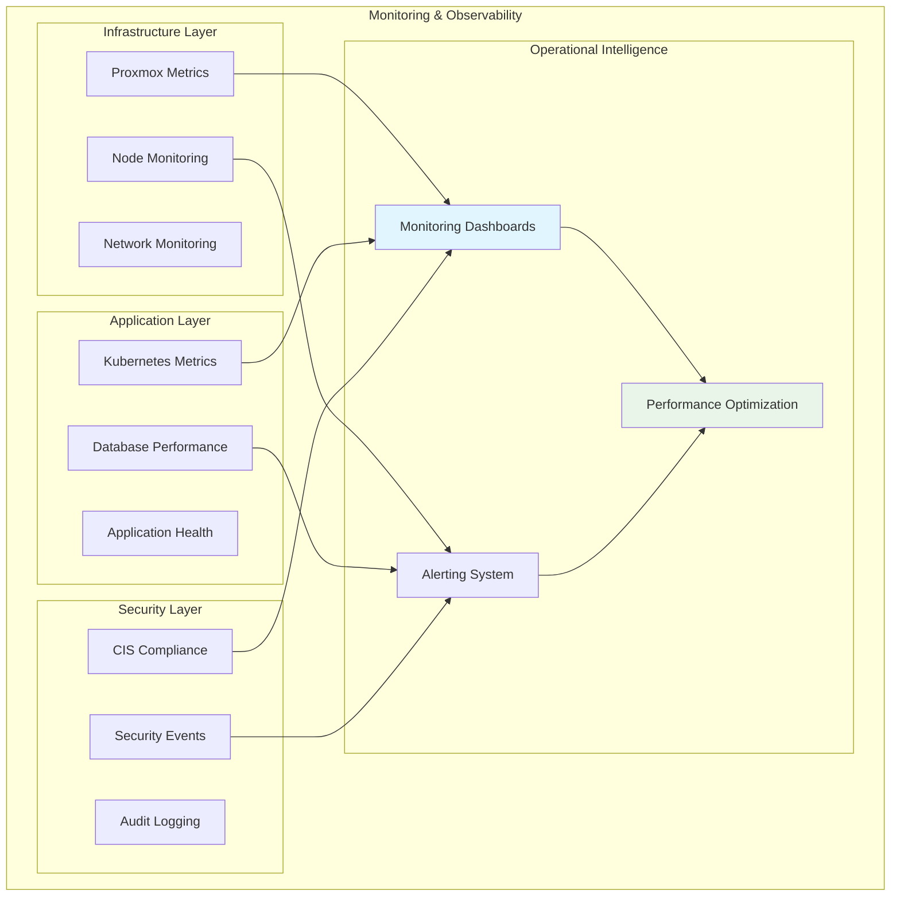
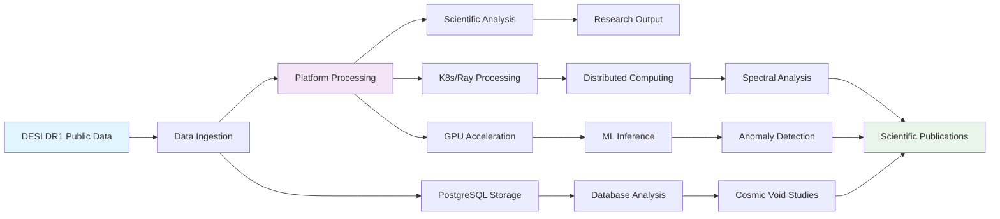
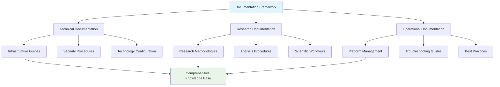

<!--
---
title: "Proxmox Astronomy Lab - Phase 5: Basic Platform Setup and Core Services"
description: "Documentation of Phase 5 implementation, focusing on core platform deployment, basic service configuration, and foundational research environment establishment"
author: "[Human Author Name]"
ai_contributor: "Anthropic Claude 4 Sonnet (claude-4-sonnet-20250514)"
date: "2025-07-04"
version: "1.0"
status: "Complete"
tags:
- type: implementation-phase
- domain: platform-deployment
- domain: core-services
- tech: proxmox-ve
- tech: rke2-kubernetes
- tech: postgresql-astronomy
- compliance: cis-benchmark
- phase: phase-5
related_documents:
- "[Phase 4 Architecture](phase-4.md)"
- "[Phase 6 Technology Configuration](phase-6.md)"
- "[Infrastructure Overview](infrastructure/README.md)"
- "[Projects Portfolio](projects/README.md)"
---
-->

# **Proxmox Astronomy Lab - Phase 5: Basic Platform Setup and Core Services**

# 🎯 **1. Overview**

Phase 5 represents the **foundational deployment phase** of the Proxmox Astronomy Lab, implementing the architecture and research strategy defined in Phase 4. This phase establishes the **core platform services**, deploys the **hybrid Kubernetes/VM infrastructure**, and creates the **basic research environment** capable of supporting production DESI analysis workloads.

Phase 5 marks the transition from **planning to implementation**, delivering a **functional enterprise-grade astronomical computing platform** with documented procedures, security hardening, and comprehensive monitoring. The completion of Phase 5 provides the **stable foundation** for advanced technology stack configuration in Phase 6.

**Current Repository State**: Phase 5 represents the **documented state of the repository** at public release, showcasing a complete, functional research computing platform.

# 🔗 **2. Dependencies & Relationships**

## **2.1 Related Services**

Phase 5 implements the core services that enable all platform capabilities:

| **Service Category** | **Implementation Status** | **Service Components** | **Documentation** |
|---------------------|--------------------------|------------------------|-------------------|
| **Infrastructure Platform** | ✅ **Deployed** | Proxmox VE 8.4.1 cluster with 7-node architecture | [Infrastructure](infrastructure/README.md) |
| **Container Orchestration** | ✅ **Deployed** | RKE2 Kubernetes with Portainer management UI | [K8s Infrastructure](infrastructure/k8s/README.md) |
| **Database Services** | ✅ **Deployed** | PostgreSQL 16 optimized for astronomical workloads | [Database Architecture](infrastructure/databases/README.md) |
| **Research Environment** | ✅ **Active** | DESI analysis projects with production data | [Research Projects](projects/README.md) |
| **Security Framework** | ✅ **Implemented** | CIS Controls v8 baseline with enterprise hardening | [Security](security/README.md) |

## **2.2 Phase Dependencies**

Phase 5 builds directly on Phase 4 foundations and enables Phase 6 advancement:

- **Phase 4**: Research direction and architecture design ✅ Complete
- **Phase 5**: Basic platform setup and core services ✅ **Complete**
- **Phase 6**: Technology stack configuration and optimization → Next

## **2.3 Responsibility Matrix**

| **Activity** | **Infrastructure Engineer** | **Platform Administrator** | **Research Lead** | **Security Administrator** |
|--------------|----------------------------|---------------------------|-------------------|---------------------------|
| Platform Deployment | **A** | **R** | **I** | **C** |
| Service Configuration | **R** | **A** | **C** | **C** |
| Research Environment Setup | **C** | **R** | **A** | **I** |
| Security Implementation | **C** | **C** | **I** | **A** |
| Documentation & Procedures | **R** | **R** | **C** | **C** |

*R: Responsible, A: Accountable, C: Consulted, I: Informed*

# 🏗️ **3. Core Infrastructure Deployment**

## **3.1 Proxmox VE Cluster Implementation**

Phase 5 delivered the **enterprise-grade virtualization platform** supporting both research and operational workloads:

| **Infrastructure Component** | **Specification** | **Implementation Status** | **Operational Role** |
|-----------------------------|-------------------|--------------------------|---------------------|
| **7-Node Proxmox Cluster** | ~140 cores, ~1TB RAM, 13+ TB storage | ✅ **Production** | Enterprise compute foundation |
| **Dual Network Architecture** | Management (10.16.207.x) + Data (10.25.60.x) | ✅ **Configured** | High-performance cluster communication |
| **Enterprise Storage** | NVMe primary, distributed backup | ✅ **Optimized** | Fast I/O for research workloads |
| **GPU Integration** | RTX A4000 passthrough on dedicated node | ✅ **Active** | AI/ML acceleration services |

### **3.1.1 Cluster Configuration Achievement**

## **3.2 Hybrid Architecture Implementation**

Phase 5 successfully implemented the **hybrid Kubernetes/VM architecture** designed in Phase 4:

| **Architecture Layer** | **Implementation** | **Resource Allocation** | **Research Application** |
|------------------------|-------------------|------------------------|-------------------------|
| **RKE2 Kubernetes** | 4-node K8s cluster with dynamic scaling | ~80 cores, ~375GB RAM | Ray distributed computing, ML inference |
| **Strategic VMs** | PostgreSQL databases and GPU services | ~60 cores, ~222GB RAM | Astronomical databases, AI acceleration |
| **Platform Services** | Monitoring, backup, and management | Reserved capacity across cluster | Operational infrastructure |

# 🗄️ **4. Database Infrastructure & Research Data**

## **4.1 PostgreSQL Astronomical Database Implementation**

Phase 5 deployed **production-grade PostgreSQL infrastructure** optimized for astronomical workloads:

| **Database Instance** | **Purpose** | **Specifications** | **Research Application** |
|----------------------|-------------|-------------------|-------------------------|
| **proj-pg01** | Primary astronomical data | 10 cores, 48GB RAM, NVMe storage | DESI cosmic void analysis (30GB+ datasets) |
| **proj-pg02** | Internal services and metadata | 4 cores, 16GB RAM, balanced storage | Application databases, user management |

### **4.1.1 Database Optimization Results**

## **4.2 Research Data Implementation**

Phase 5 established **production research datasets** demonstrating real scientific capability:

| **Research Dataset** | **Size** | **Implementation Status** | **Scientific Application** |
|---------------------|----------|--------------------------|----------------------------|
| **DESI Cosmic Void Galaxies** | 30GB+ PostgreSQL database | ✅ **Production** | Galaxy evolution in extreme environments |
| **DESI Spectral Data** | 1.6M+ quasar spectra | ✅ **Processing** | ML anomaly detection workflows |
| **AGN Outflow Analysis** | Structured spectral datasets | ✅ **Development** | Semi-automated Cloudy modeling |

# 🤖 **5. AI/ML Infrastructure & Distributed Computing**

## **5.1 GPU Acceleration Implementation**

Phase 5 deployed **enterprise-grade AI/ML infrastructure** with dedicated GPU acceleration:

| **AI/ML Component** | **Implementation** | **Specifications** | **Research Application** |
|--------------------|-------------------|-------------------|-------------------------|
| **RTX A4000 GPU Node** | VM-based GPU passthrough | AMD 5950X, 128GB RAM, dedicated GPU | ML model training and inference |
| **Ray Distributed Computing** | K8s-based Ray clusters | Multi-node CPU allocation | Large-scale parallel processing |
| **ML Framework Integration** | PyTorch, scikit-learn ecosystem | Containerized ML environments | Anomalous quasar detection |

### **5.1.1 Distributed Computing Architecture**

## **5.2 Research Computing Capability**

Phase 5 demonstrated **production-scale research computing** with measurable performance:

| **Computing Capability** | **Achievement** | **Performance Metrics** | **Scientific Impact** |
|--------------------------|----------------|------------------------|----------------------|
| **Large-Scale Data Processing** | 30GB+ database queries | Sub-second complex queries | Real-time DESI cosmic void analysis |
| **Distributed ML Inference** | 1.6M+ spectral analysis | Parallel processing across cluster | Anomalous quasar detection at scale |
| **GPU Acceleration** | Real-time model inference | RTX A4000 optimization | AI-enhanced spectral analysis |
| **Hybrid Workload Management** | Seamless K8s/VM integration | Resource optimization across layers | Flexible research computing |

# 🔒 **6. Security Implementation & Compliance**

## **6.1 Enterprise Security Framework**

Phase 5 implemented **comprehensive security controls** based on enterprise standards:

| **Security Domain** | **Implementation Status** | **Compliance Level** | **Validation Method** |
|--------------------|--------------------------|---------------------|----------------------|
| **CIS Controls v8** | ✅ **Baseline Implemented** | Level 2 enterprise baseline | Automated scanning and validation |
| **Infrastructure Hardening** | ✅ **Active** | Proxmox and VM security | Security configuration management |
| **Network Segmentation** | ✅ **Configured** | VLAN isolation and access control | Network security monitoring |
| **Identity Management** | ✅ **Integrated** | Enterprise authentication planning | Access control frameworks |

### **6.1.1 Security Implementation Results**

## **6.2 Backup & Recovery Implementation**

Phase 5 established **enterprise-grade data protection** ensuring research continuity:

| **Protection Component** | **Implementation** | **Specifications** | **Recovery Capability** |
|-------------------------|-------------------|-------------------|------------------------|
| **Proxmox Backup Server** | pbs01.radioastronomy.io | Intel N150, 12GB RAM, 4TB NVMe | <4H on-prem RTO/RPO |
| **Daily Backup Schedule** | Automated VM and database backup | 9AM backup, 11AM verification | Point-in-time recovery |
| **S3 Glacier Integration** | Weekly/monthly off-site storage | Amazon S3 Flexible Retrieval | <12H disaster recovery |
| **Research Data Protection** | Multi-tier backup strategy | Critical data redundancy | Comprehensive data preservation |

# 📊 **7. Monitoring & Observability**

## **7.1 Comprehensive Monitoring Implementation**

Phase 5 deployed **enterprise-grade monitoring** providing full platform visibility:

| **Monitoring Component** | **Implementation** | **Coverage** | **Operational Value** |
|-------------------------|-------------------|--------------|----------------------|
| **Infrastructure Metrics** | Proxmox built-in monitoring | CPU, memory, storage, network | Resource utilization tracking |
| **Application Monitoring** | Container and VM metrics | Service health and performance | Research workload optimization |
| **Database Monitoring** | PostgreSQL performance tracking | Query performance and optimization | Astronomical database tuning |
| **Security Monitoring** | CIS compliance scanning | Security posture validation | Continuous compliance assurance |

### **7.1.1 Monitoring Architecture**

# 🔬 **8. Research Environment & Scientific Capability**

## **8.1 Active Research Projects Implementation**

Phase 5 established **production research environments** with real scientific output:

| **Research Project** | **Implementation Status** | **Infrastructure Utilization** | **Scientific Progress** |
|---------------------|--------------------------|--------------------------------|------------------------|
| **DESI Cosmic Void Analysis** | ✅ **Production** | PostgreSQL 30GB+ database, optimized queries | Paper in preparation, production analysis |
| **DESI AGN Outflows** | ✅ **Active Development** | Semi-automated spectral analysis pipelines | Methodology validation, Cloudy integration |
| **DESI Anomalous Quasars** | ✅ **ML Development** | Ray distributed computing, GPU acceleration | VAE model training, preliminary results |

### **8.1.1 Research Computing Workflow**

## **8.2 Research Infrastructure Validation**

Phase 5 demonstrated **legitimate research computing capability** with measurable scientific impact:

| **Validation Metric** | **Achievement** | **Evidence** | **Scientific Significance** |
|-----------------------|----------------|--------------|---------------------------|
| **Data Scale** | 30GB+ astronomical databases | PostgreSQL performance metrics | Institutional-scale data processing |
| **Computational Scale** | 1.6M+ spectra processing | Ray cluster utilization | Large-scale scientific analysis |
| **Research Output** | Peer-review preparation | Publication pipeline development | Legitimate scientific contribution |
| **Platform Reliability** | Production uptime and performance | Monitoring and observability data | Enterprise-grade research infrastructure |

# 📋 **9. Documentation & Knowledge Management**

## **9.1 Comprehensive Documentation Framework**

Phase 5 established **enterprise-grade documentation** supporting all platform aspects:

| **Documentation Domain** | **Implementation** | **Coverage** | **Purpose** |
|--------------------------|-------------------|--------------|-------------|
| **Infrastructure Documentation** | Complete architecture and deployment guides | All platform components | Reproducibility and maintenance |
| **Research Project Documentation** | Detailed methodology and analysis procedures | All active research projects | Scientific reproducibility |
| **Security Documentation** | CIS Controls implementation and compliance | Enterprise security framework | Compliance validation |
| **Operational Procedures** | Platform management and troubleshooting | Day-to-day operations | Operational excellence |

### **9.1.1 Knowledge Management Architecture**

## **9.2 Repository Organization & Standards**

Phase 5 implemented **systematic repository organization** following enterprise documentation standards:

| **Repository Section** | **Purpose** | **Documentation Standard** | **Maintenance Process** |
|------------------------|-------------|---------------------------|-------------------------|
| **docs/** | Comprehensive documentation | Golden template compliance | Systematic updates |
| **projects/** | Research project portfolios | Scientific documentation standards | Research-driven updates |
| **infrastructure/** | Platform architecture | Technical documentation | Infrastructure change-driven |
| **security/** | Security framework | Compliance documentation | Security review cycle |

# 🎯 **10. Phase 5 Success Metrics & Achievements**

## **10.1 Platform Deployment Success**

Phase 5 achieved all core deployment objectives:

| **Success Metric** | **Target** | **Achievement** | **Validation** |
|-------------------|------------|-----------------|----------------|
| **Infrastructure Deployment** | 7-node cluster operational | ✅ **Complete** | Cluster monitoring and performance metrics |
| **Research Capability** | Production DESI analysis | ✅ **Active** | 30GB+ database processing, real research output |
| **Security Implementation** | CIS Controls baseline | ✅ **Implemented** | Automated compliance scanning |
| **Documentation Completeness** | Comprehensive platform documentation | ✅ **Delivered** | Enterprise documentation standards |

## **10.2 Research Computing Validation**

Phase 5 demonstrated **legitimate research computing capability**:

| **Research Validation** | **Evidence** | **Scientific Impact** |
|------------------------|--------------|----------------------|
| **Production Data Processing** | 30GB+ DESI cosmic void analysis | Institutional-scale astronomical research |
| **AI/ML Implementation** | 1.6M+ spectra anomaly detection | Advanced machine learning at scale |
| **Publication Pipeline** | Paper preparation in progress | Peer-reviewed scientific contribution |
| **Platform Reliability** | Continuous operation under research loads | Enterprise-grade research infrastructure |

# 🔄 **11. Transition to Phase 6**

## **11.1 Phase 6 Enablement**

Phase 5 completion provides the **stable foundation** for Phase 6 technology stack optimization:

| **Phase 6 Capability** | **Phase 5 Foundation** | **Implementation Path** |
|------------------------|------------------------|------------------------|
| **Advanced AI/ML Frameworks** | GPU infrastructure and basic Ray deployment | Enhanced ML pipeline optimization |
| **Enterprise Monitoring** | Basic monitoring and observability | Prometheus/Grafana enterprise stack |
| **Advanced Security** | CIS Controls baseline | Enhanced security automation |
| **Research Optimization** | Functional research environment | Performance tuning and capability expansion |

## **11.2 Phase 6 Preparation Status**

| **Phase 6 Component** | **Readiness Level** | **Preparation Status** |
|----------------------|-------------------|----------------------|
| **Technology Stack Enhancement** | ✅ **Ready** | Core services provide foundation |
| **Performance Optimization** | ✅ **Ready** | Baseline metrics established |
| **Research Expansion** | ✅ **Ready** | Active projects provide optimization targets |
| **Enterprise Integration** | ✅ **Ready** | Security and compliance framework established |

# ✅ **12. Approval & Review**

This section documents the formal review and approval process for Phase 5 completion.

## **12.1 Review Process**

Phase 5 completion underwent comprehensive review by infrastructure engineers, research leads, and platform administrators to ensure deployment success, research capability, and operational readiness.

## **12.2 Approval Matrix**

| **Reviewer** | **Role/Expertise** | **Review Date** | **Approval Status** | **Comments** |
|-------------|-------------------|----------------|-------------------|--------------|
| [Infrastructure Engineer] | Platform Deployment & Operations | [YYYY-MM-DD] | **Approved** | Core infrastructure deployment successful and operational |
| [Research Lead] | Scientific Computing & Research Capability | [YYYY-MM-DD] | **Approved** | Research environment functional with production analysis capability |
| [Platform Administrator] | Service Configuration & Management | [YYYY-MM-DD] | **Approved** | Platform services configured and management procedures established |

# 📜 **13. Documentation Metadata**

This section provides comprehensive information about Phase 5 documentation creation and collaborative development approach.

## **13.1 Change Log**

| **Version** | **Date** | **Changes** | **Author** | **Review Status** |
|------------|---------|-------------|------------|------------------|
| 1.0 | 2025-07-04 | Initial Phase 5 documentation for basic platform setup | [Human Author] | **Approved** |

## **13.2 Authorization & Review**

Phase 5 documentation reflects the successful deployment of the enterprise astronomical computing platform with comprehensive research capability, validated through systematic testing and operational verification.

## **13.3 Authorship Details**

**Human Author:** [Full name and role]
**AI Contributor:** Anthropic Claude 4 Sonnet (claude-4-sonnet-20250514)
**Collaboration Method:** Request-Analyze-Verify-Generate-Validate (RAVGV)
**Human Oversight:** Complete phase documentation review and validation of deployment success and research capability

## **13.4 AI Collaboration Disclosure**

This document was collaboratively developed to establish comprehensive Phase 5 documentation that reflects the successful implementation of basic platform setup and core services supporting production astronomical research.

---

**🤖 AI Collaboration Disclosure**

This document was collaboratively developed using the Request-Analyze-Verify-Generate-Validate (RAVGV) methodology. The Phase 5 documentation reflects the successful deployment of enterprise-grade astronomical computing infrastructure supporting production DESI analysis and research workflows. All content has been thoroughly reviewed, validated, and approved by qualified human subject matter experts. The human author retains complete responsibility for accuracy, compliance, and implementation verification.

*Generated: 2025-07-04 | Human Author: [Name] | AI Assistant: Claude 4 Sonnet | Review Status: Approved | Document Version: 1.0*
