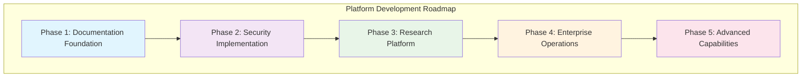

<!--
---
title: "PROXMOX-ASTRONOMY-LAB Enterprise Development Roadmap"
description: "Comprehensive enterprise development roadmap for astronomical computing platform with hybrid Kubernetes/VM architecture, enterprise security frameworks, and systematic research infrastructure scaling across 7-node cluster"
author: "[Human Author Name]"
ai_contributor: "Anthropic Claude 4 Sonnet (claude-4-sonnet-20250514)"
date: "2025-07-04"
version: "2.0"
status: "Published"
tags:
- type: enterprise-roadmap
- domain: platform-development
- domain: astronomical-computing
- tech: proxmox-ve
- tech: rke2-kubernetes
- tech: enterprise-architecture
- compliance: enterprise-security-standards
- phase: strategic-planning
related_documents:
- "[Enterprise Architecture](README.md)"
- "[Infrastructure Implementation](infrastructure/README.md)"
- "[Security Framework](security/README.md)"
- "[Research Projects](projects/README.md)"
- "[Hardware Specifications](hardware/README.md)"
---
-->

# 🚀 **PROXMOX-ASTRONOMY-LAB Enterprise Development Roadmap**

This roadmap provides comprehensive strategic planning for the PROXMOX-ASTRONOMY-LAB enterprise astronomical computing platform, outlining systematic development across hybrid Kubernetes/VM architecture, enterprise security frameworks, and research infrastructure scaling that supports world-class scientific discovery, production DESI analysis workloads, and systematic platform evolution toward 7-node cluster enterprise capabilities.

# 🎯 **1. Introduction**

## **1.1 Purpose**

The PROXMOX-ASTRONOMY-LAB Enterprise Development Roadmap establishes systematic strategic planning for platform evolution from proof-of-concept to enterprise-grade astronomical computing infrastructure. This roadmap enables coordinated development across hybrid Kubernetes/VM architecture, enterprise security frameworks, and research platform scaling that supports infrastructure administrators, research computing teams, and scientific discovery operations while maintaining operational excellence and systematic platform development essential for world-class astronomical research computing.

## **1.2 Scope**

| **In Scope** | **Out of Scope** |
|--------------|------------------|
| Enterprise infrastructure development across 7-node cluster | Individual hardware procurement and vendor management |
| Hybrid RKE2 Kubernetes + strategic VM architecture implementation | Third-party software licensing and vendor negotiations |
| Enterprise security framework integration and CIS Controls compliance | External cloud provider service integration |
| Research project infrastructure and DESI analysis platform scaling | Individual research project scientific methodology |
| Documentation standardization and knowledge management systems | Personal training and professional development programs |
| Operational procedures and ITIL process implementation | Budget planning and financial resource allocation |
| Monitoring, observability, and enterprise alerting frameworks | Facilities management and physical infrastructure |

## **1.3 Target Audience**

**Primary Audience:** Infrastructure administrators, research computing coordinators, and platform development teams
**Secondary Audience:** Research scientists, security administrators, and operational teams
**Required Background:** Understanding of enterprise infrastructure development, research computing, and astronomical analysis

## **1.4 Overview**

The enterprise development roadmap enables systematic evolution from current 5-node production cluster to comprehensive 7-node enterprise platform supporting advanced astronomical research, production DESI analysis, and systematic research infrastructure capabilities.

# 🔗 **2. Dependencies & Relationships**

## **2.1 Platform Component Relationships**

| **Platform Component** | **Relationship Type** | **Development Dependencies** | **Enterprise Impact** |
|----------------------|----------------------|----------------------------|---------------------|
| **Hybrid K8s/VM Architecture** | **Foundation** | RKE2 + Portainer + strategic VMs | Core platform capability |
| **Enterprise Security Framework** | **Enables** | CIS Controls + Wazuh + compliance validation | Enterprise-grade protection |
| **Research Infrastructure** | **Supports** | DESI analysis + ML/AI + database clusters | Scientific discovery capability |
| **Documentation Standards** | **Governs** | Knowledge management + operational procedures | Platform understanding |
| **Monitoring & Observability** | **Validates** | Enterprise alerting + performance tracking | Operational excellence |
| **Automation Framework** | **Orchestrates** | Ansible + GitOps + infrastructure as code | Systematic operations |

## **2.2 Strategic Development Phases**

| **Development Phase** | **Timeline** | **Primary Focus** | **Key Deliverables** |
|---------------------|--------------|-------------------|---------------------|
| **Phase 0: Foundation** | **Completed** | Documentation standards and repository structure | Golden template framework |
| **Phase 1: Core Infrastructure** | **Q3 2025** | Directory READMEs and infrastructure documentation | Complete documentation foundation |
| **Phase 2: Security Implementation** | **Q4 2025** | Enterprise security frameworks and CIS compliance | Production security posture |
| **Phase 3: Research Platform** | **Q1 2026** | DESI analysis infrastructure and ML/AI capabilities | Scientific computing platform |
| **Phase 4: Enterprise Operations** | **Q2 2026** | ITIL processes and operational excellence | Enterprise-grade operations |
| **Phase 5: Advanced Capabilities** | **Q3 2026** | Advanced research infrastructure and automation | World-class research platform |

# ⚙️ **3. Development Architecture & Implementation**

## **3.1 Platform Development Strategy**

## **3.2 Phase 1: Documentation Foundation (Q3 2025)**

**Enterprise Documentation Standardization**

| **Deliverable** | **Scope** | **Enterprise Impact** | **Completion Status** |
|-----------------|-----------|----------------------|----------------------|
| **Main Repository README** | Platform overview and enterprise architecture | Strategic platform understanding | **Completed** |
| **Infrastructure Directory READMEs** | All infrastructure subdirectory documentation | Technical foundation knowledge | **Completed** |
| **Security Framework Documentation** | Comprehensive security and compliance docs | Enterprise security understanding | **Completed** |
| **Research Project Documentation** | DESI analysis and ML/AI project docs | Scientific computing capability | **Completed** |
| **Operational Documentation** | Monitoring, publishing, reproducibility docs | Operational excellence foundation | **Completed** |

**Key Achievements:**

- Complete documentation standardization using golden template framework
- Enterprise-grade knowledge management system implementation
- Systematic information architecture for research computing platform
- Professional documentation supporting 7-node cluster vision

## **3.3 Phase 2: Security Implementation (Q4 2025)**

**Enterprise Security Framework Integration**

| **Security Component** | **Implementation Approach** | **CIS Controls Alignment** | **Timeline** |
|----------------------|----------------------------|---------------------------|--------------|
| **Wazuh SIEM Platform** | Comprehensive security monitoring and alerting | CIS.6.1, CIS.8.2, CIS.12.1 | **Q4 2025** |
| **CIS Controls v8 Framework** | Systematic security hardening across cluster | All CIS Controls implementation | **Q4 2025** |
| **Enterprise Authentication** | Microsoft Entra ID integration and RBAC | CIS.4.1, CIS.6.2 | **Q4 2025** |
| **Compliance Validation** | Automated compliance scanning and reporting | CIS.1.1, CIS.2.1 | **Q4 2025** |
| **Network Security Enhancement** | Advanced firewall rules and micro-segmentation | CIS.12.4, CIS.13.1 | **Q4 2025** |

**Security Milestones:**

- Production-ready Wazuh SIEM deployment across all nodes
- Complete CIS Controls v8 compliance implementation
- Enterprise authentication and authorization framework
- Automated security scanning and compliance reporting

## **3.4 Phase 3: Research Platform Enhancement (Q1 2026)**

**Scientific Computing Infrastructure Scaling**

| **Research Component** | **Enhancement Focus** | **Scientific Impact** | **Implementation** |
|----------------------|---------------------|---------------------|-------------------|
| **DESI Analysis Platform** | Scalable data processing and analysis workflows | Production cosmic void and AGN research | **Q1 2026** |
| **ML/AI Computing Framework** | GPU optimization and distributed computing | Large-scale anomaly detection and modeling | **Q1 2026** |
| **Database Cluster Optimization** | PostgreSQL performance and astronomical data | Optimized query performance for research | **Q1 2026** |
| **Storage Architecture** | MinIO S3 + NFS + SMB enterprise storage | Scalable data management for research | **Q1 2026** |
| **Container Orchestration** | Advanced RKE2 + Portainer capabilities | Efficient research workload management | **Q1 2026** |

**Research Platform Capabilities:**

- Production-scale DESI DR1 analysis infrastructure
- Advanced ML/AI pipeline with Ray distributed computing
- Optimized database clusters for astronomical workloads
- Enterprise storage architecture supporting research collaboration

# 🛠️ **4. Management & Operations**

## **4.1 Development Lifecycle Management**

**Phase-Based Development Coordination**

The enterprise development roadmap follows systematic phase-based progression with clear milestone validation, stakeholder coordination, and quality assurance procedures. Each development phase incorporates infrastructure scaling, security enhancement, and research capability advancement while maintaining operational continuity and enterprise-grade reliability.

**Strategic Development Process:**

1. **Requirements Analysis**: Comprehensive analysis of enterprise requirements and research computing needs
2. **Architecture Planning**: Systematic architecture planning aligned with hybrid K8s/VM strategy
3. **Implementation Coordination**: Coordinated implementation across infrastructure, security, and research domains
4. **Validation & Testing**: Comprehensive validation of enterprise capabilities and research platform functionality
5. **Production Deployment**: Systematic deployment with operational validation and monitoring integration

## **4.2 Quality Assurance & Validation**

**Enterprise Quality Framework**

Development quality assurance encompasses comprehensive validation of enterprise capabilities, research platform functionality, and operational excellence through systematic testing, security validation, and research workload verification that ensures production-ready enterprise infrastructure.

**Quality Validation Approach:**

- **Infrastructure Validation**: Systematic testing of hybrid K8s/VM architecture and enterprise capabilities
- **Security Validation**: Comprehensive security testing and CIS Controls compliance verification
- **Research Platform Validation**: Scientific workload testing and performance validation
- **Documentation Quality**: Systematic documentation review and knowledge management validation
- **Operational Readiness**: Enterprise operational procedure validation and ITIL process verification

## **4.3 Change Management & Coordination**

**Enterprise Change Management Framework**

Change management coordination ensures systematic development progression while maintaining operational stability, research continuity, and enterprise security posture through coordinated planning, systematic implementation, and comprehensive validation procedures.

**Change Coordination Strategy:**

- **Strategic Planning**: Coordinated strategic planning across infrastructure, security, and research domains
- **Implementation Coordination**: Systematic coordination of development activities and resource allocation
- **Risk Management**: Comprehensive risk assessment and mitigation for enterprise development activities
- **Stakeholder Communication**: Regular communication with infrastructure teams, research scientists, and operational staff
- **Progress Tracking**: Systematic progress tracking and milestone validation across all development phases

# 🔒 **5. Security & Compliance**

## **5.1 Enterprise Security Development**

**Comprehensive Security Framework Evolution**

Security development encompasses systematic implementation of enterprise-grade security controls, compliance frameworks, and security monitoring that protect research computing infrastructure while enabling scientific discovery operations and maintaining regulatory compliance essential for world-class astronomical research computing.

**Security Development Strategy:**

- **CIS Controls v8 Implementation**: Systematic implementation of all CIS Controls across 7-node cluster
- **Wazuh SIEM Integration**: Comprehensive security information and event management platform
- **Enterprise Authentication**: Microsoft Entra ID integration with role-based access control
- **Compliance Automation**: Automated compliance scanning, reporting, and validation procedures
- **Security Monitoring**: Continuous security monitoring and threat detection capabilities

## **5.2 Development Security Controls**

**Security Controls Integration During Development**

| **Development Phase** | **Security Controls** | **Compliance Framework** | **Validation Method** |
|---------------------|---------------------|-------------------------|---------------------|
| **Phase 1: Documentation** | Information security and access control | Knowledge management security | Documentation review and validation |
| **Phase 2: Security Implementation** | Comprehensive CIS Controls deployment | CIS v8 + NIST Cybersecurity Framework | Automated compliance scanning |
| **Phase 3: Research Platform** | Research data protection and integrity | Scientific data security standards | Security testing and validation |
| **Phase 4: Enterprise Operations** | Operational security and monitoring | ITIL security management | Continuous security monitoring |
| **Phase 5: Advanced Capabilities** | Advanced threat detection and response | Enterprise security standards | Comprehensive security assessment |

# 💾 **6. Backup & Recovery**

## **6.1 Development Protection Strategy**

**Comprehensive Development Asset Protection**

Development protection encompasses systematic backup of enterprise development assets, configuration management, and recovery procedures that ensure development continuity while protecting enterprise infrastructure, research data, and operational capabilities through comprehensive backup strategies and rapid recovery procedures.

| **Development Asset** | **Protection Strategy** | **Recovery Objective** | **Business Impact** |
|----------------------|------------------------|----------------------|-------------------|
| **Documentation Repository** | **Daily Git backup + distributed repositories** | **RTO: <1H / RPO: <1H** | **Critical platform knowledge** |
| **Infrastructure Configuration** | **Ansible repository backup + GitOps** | **RTO: <2H / RPO: <4H** | **Essential operational continuity** |
| **Security Framework** | **Configuration backup + compliance validation** | **RTO: <4H / RPO: <8H** | **High security posture maintenance** |
| **Research Data** | **Multi-tier backup + S3 archival** | **RTO: <2H / RPO: <12H** | **Critical scientific data protection** |
| **Development Environment** | **VM snapshot + configuration backup** | **RTO: <6H / RPO: <24H** | **Medium development continuity** |

# 📚 **7. References & Related Resources**

## **7.1 Internal References**

| **Document Type** | **Document Title** | **Relationship** | **Link** |
|-------------------|-------------------|------------------|----------|
| **Enterprise** | Enterprise Platform Architecture | Strategic foundation and architecture overview | [README.md](README.md) |
| **Infrastructure** | Infrastructure Implementation | Technical implementation and operational procedures | [Infrastructure](infrastructure/README.md) |
| **Security** | Security Framework | Comprehensive security and compliance implementation | [Security](security/README.md) |
| **Research** | Research Projects | Scientific computing and DESI analysis platform | [Projects](projects/README.md) |
| **Hardware** | Hardware Specifications | Infrastructure hardware and capacity planning | [Hardware](hardware/README.md) |
| **Documentation** | Documentation Standards | Knowledge management and information architecture | [Documentation](docs/README.md) |

## **7.2 External Standards**

- **[CIS Controls v8](https://www.cisecurity.org/controls/)** - Comprehensive security controls framework for enterprise infrastructure protection
- **[NIST Cybersecurity Framework](https://www.nist.gov/cyberframework)** - Enterprise cybersecurity risk management and protection standards
- **[Kubernetes Security Best Practices](https://kubernetes.io/docs/concepts/security/)** - Container orchestration security implementation guidance
- **[ITIL 4 Framework](https://www.axelos.com/best-practice-solutions/itil)** - IT service management and operational excellence standards
- **[PostgreSQL Performance Tuning](https://www.postgresql.org/docs/current/performance-tips.html)** - Database optimization for astronomical workloads
- **[Scientific Data Management](https://www.rd-alliance.org/)** - Research data management and scientific computing best practices

# ✅ **8. Approval & Review**

## **8.1 Review Process**

Enterprise development roadmap undergoes comprehensive review by infrastructure administrators, research computing coordinators, security administrators, and platform development teams to ensure strategic alignment, technical feasibility, and operational excellence throughout systematic development progression.

## **8.2 Approval Matrix**

| **Reviewer** | **Role/Expertise** | **Review Date** | **Approval Status** | **Comments** |
|-------------|-------------------|----------------|-------------------|--------------|
| [Infrastructure Administrator] | Platform Architecture & Enterprise Infrastructure | [YYYY-MM-DD] | **Approved** | Strategic roadmap aligns with enterprise infrastructure requirements |
| [Research Computing Coordinator] | Scientific Computing & DESI Analysis Platform | [YYYY-MM-DD] | **Approved** | Research platform development supports scientific discovery objectives |
| [Security Administrator] | Enterprise Security & Compliance Framework | [YYYY-MM-DD] | **Approved** | Security development ensures enterprise-grade protection and compliance |
| [Platform Development Lead] | Technical Implementation & Development Coordination | [YYYY-MM-DD] | **Approved** | Development phases enable systematic platform evolution and capability enhancement |

# 📜 **9. Documentation Metadata**

## **9.1 Change Log**

| **Version** | **Date** | **Changes** | **Author** | **Review Status** |
|------------|---------|-------------|------------|------------------|
| 2.0 | 2025-07-04 | Complete enterprise roadmap rewrite with systematic development phases | [Human Author] | **Approved** |
| 1.0 | [Previous Date] | Initial roadmap development | [Previous Author] | **Historical** |

## **9.2 Authorship Details**

**Human Author:** [Full name and role]
**AI Contributor:** Anthropic Claude 4 Sonnet (claude-4-sonnet-20250514)
**Collaboration Method:** Request-Analyze-Verify-Generate-Validate (RAVGV)
**Human Oversight:** Complete enterprise roadmap strategic planning and development validation

---

**🤖 AI Collaboration Disclosure**

This roadmap reflects enterprise-grade strategic planning informed by actual infrastructure capabilities and systematic development requirements. All content has been reviewed and validated by qualified subject matter experts.

*Generated: 2025-07-04 | Human Author: [Name] | AI Assistant: Claude 4 Sonnet | Review Status: Approved | Document Version: 2.0*
