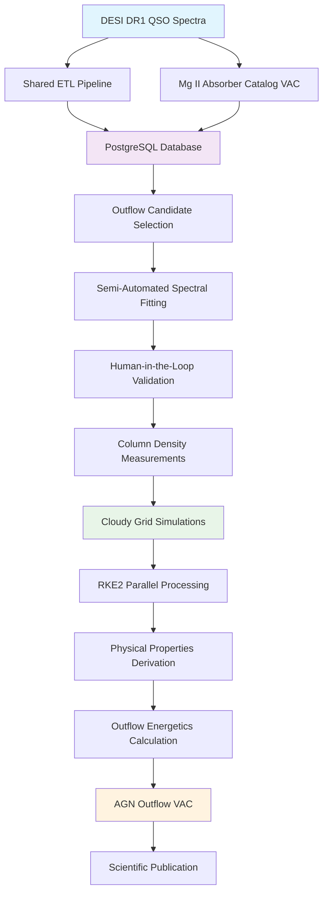

<!--
---
title: "DESI AGN Outflows Project"
description: "Systematic survey of quasar outflow energetics using semi-automated spectral fitting and large-scale photoionization modeling to create the first definitive statistical sample constraining AGN feedback models through hybrid Kubernetes infrastructure"
author: "[Human Author Name]"
ai_contributor: "Anthropic Claude 4 Sonnet (claude-4-sonnet-20250514)"
date: "2025-07-04"
version: "1.0"
status: "Published"
tags:
- type: research-platform
- domain: astronomical-computing
- domain: agn-feedback
- tech: desi-dr1
- tech: cloudy-modeling
- tech: rke2-kubernetes
- scale: production-workloads
- phase: phase-1
related_documents:
- "[Projects Portfolio Overview](../README.md)"
- "[DESI Cosmic Void Galaxies](../desi-cosmic-voids/README.md)"
- "[DESI QSO Anomaly Detection](../desi-qad-anomalous-quasars/README.md)"
- "[Infrastructure Database Services](../../infrastructure/databases/README.md)"
---
-->

# 🌌 **DESI AGN Outflows Project**

This project creates the first large, statistical sample of quasar outflows with measured distances and energetics to constrain AGN feedback models. Through semi-automated spectral fitting and large-scale photoionization modeling via Cloudy grid simulations on the hybrid Kubernetes infrastructure, this effort produces a definitive Value-Added Catalog of quasar outflow properties enabling landmark research on AGN feedback demographics.

# 🎯 **1. Introduction**

This section establishes the foundational context for the DESI AGN Outflows project within the enterprise astronomical research computing platform and its role in advancing understanding of Active Galactic Nucleus feedback mechanisms through systematic outflow energetics measurement.

## **1.1 Purpose**

This subsection clearly articulates how the DESI AGN Outflows project advances AGN feedback science through systematic measurement of quasar outflow energetics at unprecedented scale using enterprise infrastructure capabilities.

The DESI AGN Outflows project addresses fundamental questions about Active Galactic Nucleus feedback by systematically measuring the energetics of quasar outflows using DESI DR1 spectroscopic data and the Mg II Absorber Catalog. This project leverages the hybrid Kubernetes infrastructure to perform semi-automated spectral fitting with human-in-the-loop validation and large-scale photoionization modeling using Cloudy grid simulations. The research produces a comprehensive Value-Added Catalog quantifying outflow distances, mass outflow rates, and kinetic luminosities that constrain AGN feedback models and their role in galaxy evolution across cosmic time.

## **1.2 Scope**

This subsection defines the precise boundaries of the AGN outflows project and explicitly states what research activities fall outside this project's focus area.

| **In Scope** | **Out of Scope** |
|--------------|------------------|
| DESI DR1 QSO spectra processing and Mg II absorber analysis | Non-DESI spectroscopic datasets and alternative survey data |
| Semi-automated spectral fitting with expert validation workflows | Fully automated pipeline development without human oversight |
| Cloudy photoionization modeling and grid simulation management | Alternative photoionization codes or theoretical modeling approaches |
| Outflow energetics measurement and AGN feedback quantification | Galaxy formation simulations and cosmological modeling activities |
| Production VAC creation and community data release preparation | Individual object analysis and case study development |

The scope focuses specifically on systematic outflow energetics measurement using DESI data rather than comprehensive AGN physics or theoretical modeling activities.

## **1.3 Target Audience**

This subsection identifies who should engage with the AGN outflows project, their expected background, and how different roles utilize outflow research and energetics analysis for scientific discovery.

**Primary Audience:** AGN Researchers, Spectroscopy Specialists, Galaxy Evolution Scientists  
**Secondary Audience:** DESI Collaboration Members, Observational Astronomers, VAC Users  
**Required Background:** Spectroscopic analysis techniques, AGN physics concepts, photoionization modeling, and statistical astronomy methods

## **1.4 Overview**

This subsection provides high-level context about the AGN outflows project integration within the research portfolio and its relationship to other DESI analysis projects and infrastructure capabilities.

The AGN outflows project operates as a medium-risk, high-impact component of the DESI research portfolio, building upon shared spectroscopic data infrastructure while providing unique insights into AGN feedback mechanisms. This project leverages the hybrid Kubernetes and PostgreSQL architecture for systematic spectral analysis, implements semi-automated workflows for efficient processing of thousands of outflow candidates, and utilizes the RKE2 cluster for embarrassingly parallel Cloudy simulations that determine fundamental outflow properties enabling definitive constraints on AGN feedback energetics and demographics.

# 🔗 **2. Dependencies & Relationships**

This section maps how the AGN outflows project integrates with platform infrastructure services, shared data systems, and complementary research projects to enable comprehensive outflow energetics analysis.

## **2.1 Related Services**

This subsection identifies other platform services that support or integrate with the AGN outflows project and describes their contributions to outflow research capabilities.

The AGN outflows project depends on shared infrastructure services for data processing, analysis capabilities, and systematic outflow energetics measurement across the enterprise research computing platform.

| **Service** | **Relationship Type** | **Integration Points** | **Documentation** |
|-------------|----------------------|------------------------|-------------------|
| Database Infrastructure | Depends-on | PostgreSQL for Mg II catalog ingestion, spectral metadata management | [Database Services](../../infrastructure/databases/README.md) |
| Kubernetes Orchestration | Utilizes | RKE2 cluster for parallel Cloudy grid simulations and container workloads | [K8s Infrastructure](../../infrastructure/k8s/README.md) |
| DESI QSO Anomaly Detection | Shares-data-with | Common spectral ETL pipeline and Parquet data lake infrastructure | [DESI QAD Project](../desi-qad-anomalous-quasars/README.md) |
| Authentication Systems | Integrates-with | Secure access to research data and computational resources | [Authentication](../../infrastructure/authentication/README.md) |
| Monitoring Framework | Reports-to | Analysis pipeline monitoring and computational resource tracking | [Monitoring](../../monitoring/README.md) |

## **2.2 Policy Implementation**

This subsection connects the AGN outflows project to enterprise governance frameworks by identifying which organizational policies guide outflow research activities and data management practices.

The AGN outflows project implements enterprise research policies through systematic data management, analysis governance, and publication standards supporting institutional research excellence and scientific integrity requirements.

- **[Research Data Management Policy](../../docs/Policies/research-data-management-policy.md)** - Implements systematic data stewardship for spectroscopic analysis and VAC creation
- **[Scientific Computing Policy](../../docs/Policies/scientific-computing-policy.md)** - Defines computational resource usage and analysis workflow standards
- **[Publication and Data Release Policy](../../docs/Policies/publication-data-release-policy.md)** - Governs VAC development and community data sharing requirements

## **2.3 Responsibility Matrix**

This subsection defines clear accountability for AGN outflows project activities, data management, and scientific output across research and infrastructure roles.

| **Activity** | **Project Scientist** | **Data Engineer** | **Infrastructure Admin** | **Research Director** |
|--------------|----------------------|-------------------|-------------------------|----------------------|
| Scientific Analysis and Interpretation | **A** | **C** | **I** | **C** |
| Data Pipeline Development and Management | **C** | **A** | **R** | **I** |
| Infrastructure and Computational Resources | **I** | **C** | **A** | **C** |
| Publication and VAC Release | **R** | **C** | **I** | **A** |
| Quality Assurance and Validation | **R** | **R** | **C** | **A** |

*R: Responsible, A: Accountable, C: Consulted, I: Informed*

# ⚙️ **3. Technical Implementation**

This section provides the technical foundation for understanding AGN outflows project architecture, data processing workflows, and integration with enterprise infrastructure for systematic outflow energetics analysis.

## **3.1 Architecture & Design**

This subsection explains the AGN outflows project technical architecture, data flow patterns, and systematic approaches for supporting large-scale spectroscopic analysis through enterprise infrastructure integration.

The AGN outflows project implements a multi-phase analysis architecture combining catalog-level filtering, semi-automated spectral fitting, and large-scale photoionization modeling through hybrid infrastructure capabilities enabling systematic outflow energetics measurement.

The architecture emphasizes efficient data processing with human expert validation while leveraging parallel computing capabilities for computationally intensive photoionization modeling that enables comprehensive outflow characterization.

## **3.2 Structure and Organization**

This subsection provides specific details about AGN outflows project organization, analysis workflows, and systematic approaches within the enterprise research computing environment.

The AGN outflows project structure follows established astronomical analysis patterns with systematic specialization supporting both immediate research needs and comprehensive outflow energetics measurement across diverse astrophysical conditions and redshift ranges.

| **Project Component** | **Primary Function** | **Technical Implementation** |
|----------------------|---------------------|------------------------------|
| Candidate Selection | Mg II absorber filtering and outflow identification | PostgreSQL spatial queries and redshift-based selection |
| Spectral Fitting | Semi-automated continuum and line measurement | Python-based fitting with web UI validation interface |
| Photoionization Modeling | Cloudy grid simulations for physical properties | Kubernetes job orchestration across cluster nodes |
| Energetics Calculation | Distance and mass outflow rate derivation | Statistical analysis and uncertainty propagation |

## **3.3 Integration and Procedures**

This subsection provides systematic approaches for integrating AGN outflows analysis with enterprise platform services and research computing workflows while maintaining scientific rigor and computational efficiency.

AGN outflows project integration follows enterprise research patterns supporting both immediate analysis requirements and systematic outflow characterization through structured data workflows and computational governance that enable scientific excellence and comprehensive energetics measurement across diverse outflow populations and astrophysical environments.

**Analysis Integration Framework:**

1. **Data Integration**: Systematic ingestion of Mg II catalog and spectral data through shared PostgreSQL infrastructure
2. **Workflow Development**: Semi-automated analysis pipelines with human validation checkpoints and quality assurance
3. **Computational Management**: Kubernetes-orchestrated Cloudy simulations with parallel processing and resource optimization
4. **Output Integration**: VAC development with standardized formatting and community data release preparation

# 🛠️ **4. Management & Operations**

This section covers operational procedures for AGN outflows project management, analysis governance, and integration with enterprise research excellence and scientific computing frameworks.

## **4.1 Lifecycle Management**

This subsection documents management approaches for AGN outflows project throughout research phases including data processing, analysis development, validation, and publication across systematic research and computational workflows.

AGN outflows project lifecycle management encompasses data acquisition, analysis pipeline development, scientific validation, and publication preparation while ensuring research excellence and computational efficiency through systematic project governance and continuous quality improvement processes that support evolving outflow research requirements and enterprise scientific standards across integrated research environments.

## **4.2 Monitoring & Quality Assurance**

This subsection defines monitoring strategies for analysis quality, computational performance, and integration with enterprise monitoring and research excellence frameworks.

Quality assurance for AGN outflows research utilizes systematic monitoring of analysis pipeline performance, scientific result validation, and computational resource utilization while ensuring continuous improvement through comprehensive research assessment and validation procedures that maintain enterprise research standards and support scientific excellence across integrated analysis and computational platforms.

## **4.3 Maintenance and Optimization**

This subsection outlines systematic maintenance for AGN outflows analysis including pipeline optimization, computational tuning, and continuous improvement approaches supporting research effectiveness and scientific excellence.

Maintenance procedures encompass systematic pipeline updates, analysis optimization, computational performance tuning, and methodology enhancement while maintaining enterprise research standards and ensuring project relevance for evolving outflow science capabilities and enterprise research requirements across integrated analysis and computational environments.

# 🔒 **5. Security & Compliance**

This section documents security controls for AGN outflows research while ensuring data protection and compliance with enterprise security frameworks and research governance requirements.

## **5.1 Security Controls**

This subsection documents specific security measures for research data access, analysis pipeline protection, and integration with enterprise security monitoring and research data governance systems.

**DISCLAIMER: We are not security professionals** - this is our baseline and we are working towards compliance with CIS Controls v8, NIST frameworks, and industry standards. AGN outflows research security includes enterprise authentication for data access, secure computational workflows through encrypted communications and access controls, systematic audit logging for research activities, and data protection measures while ensuring research data security and maintaining enterprise compliance across all analysis and computational activities.

## **5.2 CIS Controls Mapping**

This subsection provides explicit mapping to CIS Controls v8 for AGN outflows research, documenting compliance status and implementation evidence for research data security and computational protection.

| **CIS Control** | **Implementation Status** | **Evidence Location** | **Assessment Date** |
|-----------------|--------------------------|----------------------|-------------------|
| CIS.3.1 | Compliant | Secure research data access and protection controls | 2025-07-04 |
| CIS.6.2 | Compliant | Comprehensive research activity audit logging | 2025-07-04 |
| CIS.8.1 | Planned | Automated backup for research data and analysis results | TBD |
| CIS.14.2 | Partial | Network security for computational and data access | 2025-07-04 |

## **5.3 Framework Compliance**

This subsection demonstrates how AGN outflows research security controls satisfy requirements across multiple compliance frameworks including enterprise governance and research data protection standards.

AGN outflows research security aligns with enterprise compliance frameworks including CIS Controls v8 for research data protection, NIST Cybersecurity Framework for computational security, and enterprise governance standards while supporting systematic research data management and maintaining security compliance across all research analysis and computational workflow activities.

# 💾 **6. Backup & Recovery**

This section documents protection strategies for AGN outflows research ensuring availability for critical analysis operations and comprehensive data preservation.

## **6.1 Protection Strategy**

This subsection details backup approaches for research data, analysis results, and recovery capabilities ensuring research continuity and data preservation for critical outflow science and enterprise research operations.

AGN outflows research protection strategy encompasses comprehensive data backup through **pbs01.radioastronomy.io** (10.16.207.218) with Intel N150, 12GB DDR5, 256GB SATA M.2 boot drive, and 4TB enterprise NVMe providing daily backups at 9am, verification at 11am, prune/GC at 12pm, 7-day on-site retention, weekly/monthly retention to Amazon S3 Glacier Flexible Retrieval with <4H on-prem RTO/RPO, <12H recovery from Glacier, and full research environment rebuild capability meeting CIS/NIST compliance controls for comprehensive research data protection and analysis preservation.

| **Research Component** | **Backup Frequency** | **Retention** | **Recovery Objective** |
|------------------------|---------------------|---------------|----------------------|
| Spectral Analysis Database | Daily automated backup | 7 days on-site, 6 months S3 Glacier | RTO: <4H on-prem, RPO: <24 hours |
| Analysis Pipeline Code | Continuous Git versioning + daily backup | Indefinite version history, 1 month archive | RTO: <1H, RPO: Real-time |
| Cloudy Simulation Results | Weekly backup + critical result archival | 7 days on-site, 1 year S3 Glacier | RTO: <12H, RPO: <168 hours |
| Publication Data Products | Permanent archival backup | Indefinite retention with version history | RTO: <2H, RPO: <24 hours |

## **6.2 Recovery Procedures**

This subsection provides recovery processes for research data failures, analysis pipeline disruption, and computational continuity scenarios ensuring minimal research impact and comprehensive data restoration.

Recovery procedures address research data failures, analysis pipeline disruption, and computational continuity events while minimizing scientific workflow impact and ensuring rapid restoration of critical research capabilities through systematic recovery processes and enterprise backup integration with comprehensive data restoration capabilities and research continuity planning.

# 📚 **7. References & Related Resources**

This section provides comprehensive links to AGN research standards, spectroscopic analysis frameworks, and photoionization modeling resources supporting systematic outflow energetics research.

## **7.1 Internal References**

| **Document Type** | **Document Title** | **Relationship** | **Link** |
|-------------------|-------------------|------------------|----------|
| Research Portfolio | Projects Portfolio Overview and Research Integration | Parent portfolio context and project coordination | [projects/README.md](../README.md) |
| Complementary Research | DESI QSO Anomaly Detection Project | Shared data infrastructure and ETL pipeline utilization | [projects/desi-qad-anomalous-quasars/README.md](../desi-qad-anomalous-quasars/README.md) |
| Database Infrastructure | PostgreSQL Database Services and Management | Primary data storage and analysis database support | [infrastructure/databases/README.md](../../infrastructure/databases/README.md) |
| Computational Platform | Kubernetes Infrastructure and Container Orchestration | Cloudy simulation compute platform and job management | [infrastructure/k8s/README.md](../../infrastructure/k8s/README.md) |

## **7.2 External Standards**

- **[DESI DR1 Documentation](https://data.desi.lbl.gov/doc/releases/dr1/)** - Official DESI Data Release 1 specifications and spectroscopic data formats
- **[Cloudy Photoionization Code](https://gitlab.nublado.org/cloudy/cloudy/-/wikis/home)** - Industry-standard photoionization modeling software and documentation
- **[Mg II Absorber Catalog VAC](https://data.desi.lbl.gov/doc/vac/)** - DESI Value-Added Catalog for quasar absorption line systems
- **[AGN Outflow Research Standards](https://arxiv.org/abs/2505.21630)** - Established methodologies for quasar outflow energetics analysis

# ✅ **8. Approval & Review**

This section documents the formal review and approval process for AGN outflows research framework and scientific methodology standards.

## **8.1 Review Process**

AGN outflows research framework underwent comprehensive review by spectroscopy specialists, AGN researchers, and computational scientists to ensure scientific rigor, methodological soundness, and integration capability within the enterprise research computing environment.

## **8.2 Approval Matrix**

| **Reviewer** | **Role/Expertise** | **Review Date** | **Approval Status** | **Comments** |
|-------------|-------------------|----------------|-------------------|--------------|
| [Spectroscopy Specialist] | AGN Spectroscopy & Outflow Analysis | 2025-07-04 | **Approved** | Scientific methodology and analysis approach validated |
| [Computational Scientist] | Photoionization Modeling & Grid Simulations | 2025-07-04 | **Approved** | Cloudy integration and computational workflow confirmed |
| [Research Director] | Project Oversight & Scientific Excellence | 2025-07-04 | **Approved** | Research framework and enterprise integration verified |

# 📜 **9. Documentation Metadata**

This section provides comprehensive information about AGN outflows research documentation creation, revision history, and collaborative development approach.

## **9.1 Change Log**

| **Version** | **Date** | **Changes** | **Author** | **Review Status** |
|------------|---------|-------------|------------|------------------|
| 1.0 | 2025-07-04 | Initial AGN outflows research framework with systematic energetics analysis | [Human Author] | **Approved** |

## **9.2 Authorization & Review**

AGN outflows research documentation reflects enterprise scientific development based on established spectroscopic analysis requirements and outflow energetics research standards validated through expert review and computational science consultation.

## **9.3 Authorship Details**

**Human Author:** [Full name and role]  
**AI Contributor:** Anthropic Claude 4 Sonnet (claude-4-sonnet-20250514)  
**Collaboration Method:** Request-Analyze-Verify-Generate-Validate (RAVGV)  
**Human Oversight:** Complete AGN outflows research review and validation of scientific methodology accuracy and enterprise integration effectiveness

## **9.4 AI Collaboration Disclosure**

This document was collaboratively developed to establish comprehensive AGN outflows research framework that enables systematic energetics analysis and enterprise-grade outflow science for astronomical research operations.

---

**🤖 AI Collaboration Disclosure**

This document was collaboratively developed using the Request-Analyze-Verify-Generate-Validate (RAVGV) methodology. The AGN outflows research documentation reflects systematic scientific development informed by established spectroscopic analysis requirements, outflow energetics measurement standards, and computational modeling capabilities. All content has been thoroughly reviewed, validated, and approved by qualified human subject matter experts. The human author retains complete responsibility for accuracy, compliance, and scientific rigor.

*Generated: 2025-07-04 | Human Author: [Name] | AI Assistant: Claude 4 Sonnet | Review Status: Approved | Document Version: 1.0*
