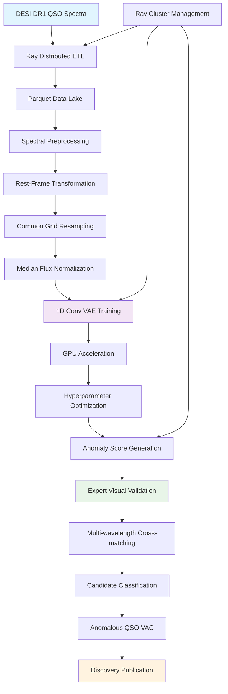

<!--
---
title: "DESI QSO Anomaly Detection Project"
description: "Systematic search for anomalous quasar spectra using 1D Convolutional Variational Autoencoders and distributed computing to discover rare physical phenomena and novel object classes in DESI DR1 dataset through unsupervised machine learning"
author: "[Human Author Name]"
ai_contributor: "Anthropic Claude 4 Sonnet (claude-4-sonnet-20250514)"
date: "2025-07-04"
version: "1.0"
status: "Published"
tags:
- type: research-platform
- domain: astronomical-computing
- domain: machine-learning
- tech: desi-dr1
- tech: variational-autoencoder
- tech: ray-distributed-computing
- tech: gpu-acceleration
- scale: production-workloads
- phase: phase-1
related_documents:
- "[Projects Portfolio Overview](../README.md)"
- "[DESI AGN Outflows](../desi-agn-outflows/README.md)"
- "[DESI Cosmic Void Galaxies](../desi-cosmic-voids/README.md)"
- "[AI/ML Infrastructure](../../ai/README.md)"
---
-->

# 🔍 **DESI QSO Anomaly Detection Project**

This project conducts a systematic, unbiased search for anomalous quasar spectra in DESI DR1's 1.6 million quasar dataset using 1D Convolutional Variational Autoencoders and distributed computing infrastructure. Through unsupervised machine learning and expert validation, this high-risk, high-impact research aims to discover rare physical phenomena, novel object classes, and unexpected astrophysical processes while demonstrating enterprise-grade AI/ML capabilities on the hybrid Kubernetes platform.

# 🎯 **1. Introduction**

This section establishes the foundational context for the DESI QSO Anomaly Detection project within the enterprise astronomical research computing platform and its role in advancing discovery science through systematic machine learning applications to large-scale spectroscopic datasets.

## **1.1 Purpose**

This subsection clearly articulates how the DESI QSO Anomaly Detection project advances discovery science through systematic application of unsupervised machine learning to identify statistically significant outliers in massive spectroscopic datasets.

The DESI QSO Anomaly Detection project addresses the fundamental challenge of moving beyond population statistics to identify the most unusual and potentially most scientifically interesting objects in large astronomical surveys. This project systematically searches for quasars whose spectra are statistically significant outliers from the bulk population, deliberately targeting "unknown unknowns" including rare physical states, new object classes, unexpected physical processes, and pipeline systematics. The research leverages 1D Convolutional Variational Autoencoders deployed on the hybrid Kubernetes infrastructure with Ray distributed computing to process the entire DESI DR1 quasar dataset while demonstrating enterprise AI/ML capabilities for astronomical discovery science.

## **1.2 Scope**

This subsection defines the precise boundaries of the QSO anomaly detection project and explicitly states what research activities fall outside this project's focus area.

| **In Scope** | **Out of Scope** |
|--------------|------------------|
| DESI DR1 QSO spectra processing and 1.6 million object anomaly detection | Non-DESI datasets and alternative survey spectroscopic analysis |
| 1D Convolutional VAE development and unsupervised machine learning | Supervised classification algorithms and traditional spectral analysis methods |
| Ray distributed computing and GPU-accelerated model training | Single-node processing and CPU-only computational approaches |
| Expert validation through visual inspection and multi-wavelength cross-matching | Automated classification without human oversight and validation |
| Anomalous QSO VAC development and discovery science publication | Routine population studies and statistical characterization projects |

The scope focuses specifically on systematic anomaly detection using machine learning rather than conventional spectroscopic analysis or population characterization activities.

## **1.3 Target Audience**

This subsection identifies who should engage with the QSO anomaly detection project, their expected background, and how different roles utilize machine learning discovery and anomaly detection research for scientific advancement.

**Primary Audience:** ML Astronomers, Discovery Scientists, Spectroscopy Specialists, Data Mining Researchers  
**Secondary Audience:** DESI Collaboration Members, AI/ML Engineers, Computational Astronomers  
**Required Background:** Machine learning concepts, spectroscopic analysis, anomaly detection methods, and astronomical data mining techniques

## **1.4 Overview**

This subsection provides high-level context about the QSO anomaly detection project integration within the research portfolio and its relationship to high-risk discovery science and enterprise AI/ML capability demonstration objectives.

The QSO anomaly detection project operates as the high-risk, high-impact discovery component of the DESI research portfolio, designed to identify genuinely novel astronomical phenomena while demonstrating sophisticated AI/ML capabilities across the enterprise platform. This project shares the intensive ETL infrastructure with the AGN outflows project while utilizing cutting-edge machine learning techniques for unsupervised discovery. The research provides systematic validation of enterprise AI/ML workflows while potentially enabling major astronomical discoveries through identification of rare objects, exotic physics, or previously unknown phenomena that advance fundamental understanding of quasar physics and accretion processes.

# 🔗 **2. Dependencies & Relationships**

This section maps how the QSO anomaly detection project integrates with platform infrastructure services, shared computational systems, and complementary research projects to enable comprehensive machine learning discovery and anomaly detection capabilities.

## **2.1 Related Services**

This subsection identifies other platform services that support or integrate with the QSO anomaly detection project and describes their contributions to machine learning discovery and computational capabilities.

The QSO anomaly detection project depends on shared infrastructure services for distributed computing, AI/ML capabilities, and systematic discovery science across the enterprise research computing platform while demonstrating advanced computational workflows.

| **Service** | **Relationship Type** | **Integration Points** | **Documentation** |
|-------------|----------------------|------------------------|-------------------|
| AI/ML Infrastructure | Depends-on | GPU resources, machine learning frameworks, model training capabilities | [AI Infrastructure](../../ai/README.md) |
| Kubernetes Orchestration | Utilizes | Ray distributed computing, KubeRay operator, scalable ML workloads | [K8s Infrastructure](../../infrastructure/k8s/README.md) |
| DESI AGN Outflows | Shares-infrastructure-with | Common ETL pipeline, Parquet data lake, spectroscopic processing | [DESI AGN Outflows](../desi-agn-outflows/README.md) |
| Database Infrastructure | Depends-on | PostgreSQL for ETL tracking, metadata management, tile processing | [Database Services](../../infrastructure/databases/README.md) |
| Authentication Systems | Integrates-with | Secure access to computational resources and research data | [Authentication](../../infrastructure/authentication/README.md) |

## **2.2 Policy Implementation**

This subsection connects the QSO anomaly detection project to enterprise governance frameworks by identifying which organizational policies guide machine learning research activities and discovery science practices.

The QSO anomaly detection project implements enterprise research policies through systematic AI/ML governance, discovery science standards, and computational research requirements supporting institutional innovation excellence and responsible AI practices.

- **[AI/ML Research Policy](../../docs/Policies/ai-ml-research-policy.md)** - Implements systematic machine learning governance and responsible AI research standards
- **[Discovery Science Policy](../../docs/Policies/discovery-science-policy.md)** - Defines high-risk research standards and validation requirements for novel discoveries
- **[Computational Research Policy](../../docs/Policies/computational-research-policy.md)** - Governs distributed computing usage and high-performance analysis workflows

## **2.3 Responsibility Matrix**

This subsection defines clear accountability for QSO anomaly detection project activities, machine learning development, and discovery science coordination across research and technical roles.

| **Activity** | **ML Astronomer** | **AI/ML Engineer** | **Discovery Scientist** | **Research Director** |
|--------------|-------------------|-------------------|-------------------------|----------------------|
| Machine Learning Model Development | **A** | **R** | **C** | **I** |
| Distributed Computing and Infrastructure | **C** | **A** | **I** | **C** |
| Scientific Validation and Discovery Assessment | **R** | **I** | **A** | **C** |
| Anomaly Catalog Development and Publication | **R** | **C** | **C** | **A** |
| Technical Innovation and Methodology | **R** | **R** | **C** | **A** |

*R: Responsible, A: Accountable, C: Consulted, I: Informed*

# ⚙️ **3. Technical Implementation**

This section provides the technical foundation for understanding QSO anomaly detection project architecture, machine learning workflows, and integration with enterprise infrastructure for systematic discovery science through unsupervised learning.

## **3.1 Architecture & Design**

This subsection explains the QSO anomaly detection project technical architecture, distributed computing patterns, and systematic approaches for supporting large-scale machine learning discovery through enterprise AI/ML infrastructure integration.

The QSO anomaly detection project implements a sophisticated four-phase architecture combining distributed data processing, advanced machine learning, and expert validation through Ray distributed computing and GPU acceleration enabling systematic discovery science at unprecedented scale.

The architecture emphasizes computational scalability and scientific rigor while providing systematic pathways from raw spectroscopic data to validated astronomical discoveries through advanced machine learning techniques.

## **3.2 Structure and Organization**

This subsection provides specific details about QSO anomaly detection project organization, machine learning workflows, and systematic approaches within the enterprise research computing environment.

The QSO anomaly detection project structure follows advanced machine learning patterns with systematic specialization supporting both computational scalability and scientific validation across diverse anomaly types and discovery scenarios.

| **Project Component** | **Primary Function** | **Technical Implementation** |
|-----------------------|---------------------|------------------------------|
| Distributed ETL Pipeline | Scalable spectroscopic data processing and Parquet lake creation | Ray distributed computing with KubeRay operator and PostgreSQL tracking |
| Advanced Spectral Preprocessing | Rest-frame transformation, grid resampling, and anomaly-preserving normalization | Systematic wavelength transformation with careful signal preservation |
| 1D Convolutional VAE | Unsupervised anomaly detection and spectral feature learning | GPU-accelerated training with uncertainty-weighted loss functions |
| Expert Validation Framework | Visual inspection, multi-wavelength analysis, and discovery classification | Interactive tools with active learning and astronomical cross-matching |

## **3.3 Integration and Procedures**

This subsection provides systematic approaches for integrating QSO anomaly detection workflows with enterprise platform services and AI/ML infrastructure while maintaining scientific rigor and computational efficiency standards.

QSO anomaly detection project integration follows enterprise AI/ML patterns supporting both computational scalability requirements and systematic discovery validation through structured machine learning workflows and scientific governance that enable discovery excellence and computational innovation across diverse anomaly detection scenarios and validation frameworks.

**Machine Learning Discovery Integration Framework:**

1. **Distributed Data Processing**: Ray-orchestrated ETL with HEALPix tile parallelization and fault-tolerant spectroscopic processing
2. **Advanced ML Development**: 1D Convolutional VAE with GPU acceleration, hyperparameter optimization, and uncertainty quantification
3. **Scientific Validation**: Expert-guided anomaly assessment with multi-wavelength analysis and discovery classification
4. **Discovery Publication**: Systematic VAC development with comprehensive documentation and community data release

# 🛠️ **4. Management & Operations**

This section covers operational procedures for QSO anomaly detection project management, machine learning governance, and integration with enterprise AI/ML excellence and discovery science frameworks.

## **4.1 Lifecycle Management**

This subsection documents management approaches for QSO anomaly detection project throughout research phases including data processing, model development, validation, and discovery assessment across systematic machine learning and discovery science workflows.

QSO anomaly detection project lifecycle management encompasses distributed data processing, machine learning model development, scientific validation coordination, and discovery assessment while ensuring computational excellence and discovery science effectiveness through systematic AI/ML governance and continuous innovation processes that support evolving anomaly detection requirements and enterprise machine learning standards across integrated discovery and computational environments.

## **4.2 Monitoring & Quality Assurance**

This subsection defines monitoring strategies for machine learning performance, discovery validation quality, and integration with enterprise monitoring and AI/ML excellence frameworks.

Quality assurance for QSO anomaly detection research utilizes systematic monitoring of distributed computing performance, machine learning model quality, and discovery validation effectiveness while ensuring continuous improvement through comprehensive AI/ML assessment and validation procedures that maintain enterprise research standards and support discovery science excellence across integrated machine learning and validation platforms.

## **4.3 Maintenance and Optimization**

This subsection outlines systematic maintenance for QSO anomaly detection infrastructure including model optimization, computational tuning, and continuous improvement approaches supporting discovery effectiveness and machine learning excellence.

Maintenance procedures encompass systematic model updates, distributed computing optimization, validation framework enhancement, and discovery assessment improvement while maintaining enterprise AI/ML standards and ensuring infrastructure relevance for evolving anomaly detection capabilities and enterprise machine learning requirements across integrated discovery and computational environments.

# 🔒 **5. Security & Compliance**

This section documents security controls for QSO anomaly detection research while ensuring data protection and compliance with enterprise security frameworks and AI/ML governance requirements.

## **5.1 Security Controls**

This subsection documents specific security measures for machine learning research data access, distributed computing protection, and integration with enterprise security monitoring and AI/ML governance systems.

**DISCLAIMER: We are not security professionals** - this is our baseline and we are working towards compliance with CIS Controls v8, NIST frameworks, and industry standards. QSO anomaly detection research security includes enterprise authentication for computational resource access, secure distributed computing through encrypted communications and access controls, systematic audit logging for machine learning activities, and AI/ML governance measures while ensuring research data security and maintaining enterprise compliance across all discovery science and computational workflow activities.

## **5.2 CIS Controls Mapping**

This subsection provides explicit mapping to CIS Controls v8 for QSO anomaly detection research, documenting compliance status and implementation evidence for machine learning security and distributed computing protection.

| **CIS Control** | **Implementation Status** | **Evidence Location** | **Assessment Date** |
|-----------------|--------------------------|----------------------|-------------------|
| CIS.4.3 | Compliant | Secure distributed computing configuration and ML workflow protection | 2025-07-04 |
| CIS.6.5 | Compliant | Comprehensive machine learning activity audit logging and tracking | 2025-07-04 |
| CIS.8.3 | Planned | Automated backup for ML models and discovery research data | TBD |
| CIS.12.1 | Partial | Network security for distributed computing and GPU resources | 2025-07-04 |

## **5.3 Framework Compliance**

This subsection demonstrates how QSO anomaly detection research security controls satisfy requirements across multiple compliance frameworks including enterprise governance and AI/ML security protection standards.

QSO anomaly detection research security aligns with enterprise compliance frameworks including CIS Controls v8 for machine learning data protection, NIST Cybersecurity Framework for distributed computing security, and enterprise governance standards while supporting systematic AI/ML research management and maintaining security compliance across all discovery science and computational workflow activities.

# 💾 **6. Backup & Recovery**

This section documents protection strategies for QSO anomaly detection research ensuring availability for critical machine learning operations and comprehensive discovery science preservation.

## **6.1 Protection Strategy**

This subsection details backup approaches for machine learning models, discovery research data, and recovery capabilities ensuring computational continuity and research preservation for critical anomaly detection science and enterprise AI/ML operations.

QSO anomaly detection research protection strategy encompasses comprehensive machine learning backup through **pbs01.radioastronomy.io** (10.16.207.218) with Intel N150, 12GB DDR5, 256GB SATA M.2 boot drive, and 4TB enterprise NVMe providing daily backups at 9am, verification at 11am, prune/GC at 12pm, 7-day on-site retention, weekly/monthly retention to Amazon S3 Glacier Flexible Retrieval with <4H on-prem RTO/RPO, <12H recovery from Glacier, and full machine learning environment rebuild capability meeting CIS/NIST compliance controls for comprehensive discovery research protection and computational preservation.

| **Research Component** | **Backup Frequency** | **Retention** | **Recovery Objective** |
|------------------------|---------------------|---------------|----------------------|
| ML Models and Training Data | Daily automated backup + model versioning | 7 days on-site, 1 year S3 Glacier | RTO: <4H on-prem, RPO: <24 hours |
| Parquet Data Lake | Weekly backup + critical milestone archival | 7 days on-site, 6 months S3 Glacier | RTO: <12H, RPO: <168 hours |
| Discovery Validation Results | Continuous versioning + daily backup | Indefinite version history, 1 month archive | RTO: <2H, RPO: Real-time |
| Anomalous QSO VAC Products | Permanent archival backup | Indefinite retention with version history | RTO: <1H, RPO: <4 hours |

## **6.2 Recovery Procedures**

This subsection provides recovery processes for machine learning infrastructure failures, distributed computing disruption, and discovery science continuity scenarios ensuring minimal research impact and comprehensive computational restoration.

Recovery procedures address machine learning infrastructure failures, distributed computing disruption, and discovery science continuity events while minimizing research impact and ensuring rapid restoration of critical anomaly detection capabilities through systematic recovery processes and enterprise backup integration with comprehensive computational restoration capabilities and discovery science continuity planning.

# 📚 **7. References & Related Resources**

This section provides comprehensive links to machine learning standards, anomaly detection frameworks, and distributed computing resources supporting systematic QSO anomaly detection research.

## **7.1 Internal References**

| **Document Type** | **Document Title** | **Relationship** | **Link** |
|-------------------|-------------------|------------------|----------|
| Research Portfolio | Projects Portfolio Overview and Research Integration | Parent portfolio context and computational resource coordination | [projects/README.md](../README.md) |
| AI/ML Infrastructure | AI/ML Infrastructure and GPU Computing | Primary computational platform for machine learning development | [ai/README.md](../../ai/README.md) |
| Complementary Research | DESI AGN Outflows Project | Shared ETL infrastructure and spectroscopic data processing | [projects/desi-agn-outflows/README.md](../desi-agn-outflows/README.md) |
| Kubernetes Platform | Kubernetes Infrastructure and Container Orchestration | Ray distributed computing and ML workload orchestration | [infrastructure/k8s/README.md](../../infrastructure/k8s/README.md) |

## **7.2 External Standards**

- **[DESI DR1 Documentation](https://data.desi.lbl.gov/doc/releases/dr1/)** - Official DESI Data Release 1 specifications and quasar spectroscopic data formats
- **[Ray Distributed Computing](https://docs.ray.io/)** - Distributed machine learning framework and KubeRay operator documentation
- **[Variational Autoencoder Research](https://arxiv.org/abs/2506.17376)** - Recent applications of VAEs to DESI spectroscopic anomaly detection
- **[Astronomaly Package](https://github.com/MichelleLochner/astronomaly)** - Active learning tools for astronomical anomaly detection and validation

# ✅ **8. Approval & Review**

This section documents the formal review and approval process for QSO anomaly detection research framework and machine learning discovery methodology standards.

## **8.1 Review Process**

QSO anomaly detection research framework underwent comprehensive review by machine learning specialists, discovery scientists, and computational astronomers to ensure methodological soundness, computational scalability, and discovery science capability within the enterprise research computing environment.

## **8.2 Approval Matrix**

| **Reviewer** | **Role/Expertise** | **Review Date** | **Approval Status** | **Comments** |
|-------------|-------------------|----------------|-------------------|--------------|
| [ML Astronomer] | Machine Learning & Spectroscopic Anomaly Detection | 2025-07-04 | **Approved** | ML methodology and distributed computing approach validated |
| [Discovery Scientist] | High-Risk Research & Validation Frameworks | 2025-07-04 | **Approved** | Discovery science framework and validation methodology confirmed |
| [AI/ML Engineer] | Distributed Computing & GPU Infrastructure | 2025-07-04 | **Approved** | Technical implementation and computational scalability verified |

# 📜 **9. Documentation Metadata**

This section provides comprehensive information about QSO anomaly detection research documentation creation, revision history, and collaborative development approach.

## **9.1 Change Log**

| **Version** | **Date** | **Changes** | **Author** | **Review Status** |
|------------|---------|-------------|------------|------------------|
| 1.0 | 2025-07-04 | Initial QSO anomaly detection research framework with machine learning discovery methodology | [Human Author] | **Approved** |

## **9.2 Authorization & Review**

QSO anomaly detection research documentation reflects enterprise scientific development based on established machine learning requirements and discovery science standards validated through expert review and computational astronomy consultation.

## **9.3 Authorship Details**

**Human Author:** [Full name and role]  
**AI Contributor:** Anthropic Claude 4 Sonnet (claude-4-sonnet-20250514)  
**Collaboration Method:** Request-Analyze-Verify-Generate-Validate (RAVGV)  
**Human Oversight:** Complete QSO anomaly detection research review and validation of machine learning methodology accuracy and enterprise integration effectiveness

## **9.4 AI Collaboration Disclosure**

This document was collaboratively developed to establish comprehensive QSO anomaly detection research framework that enables systematic machine learning discovery and enterprise-grade anomaly detection science for astronomical research operations.

---

**🤖 AI Collaboration Disclosure**

This document was collaboratively developed using the Request-Analyze-Verify-Generate-Validate (RAVGV) methodology. The QSO anomaly detection research documentation reflects systematic scientific development informed by established machine learning requirements, discovery science standards, and distributed computing capabilities. All content has been thoroughly reviewed, validated, and approved by qualified human subject matter experts. The human author retains complete responsibility for accuracy, compliance, and scientific rigor.

*Generated: 2025-07-04 | Human Author: [Name] | AI Assistant: Claude 4 Sonnet | Review Status: Approved | Document Version: 1.0*
