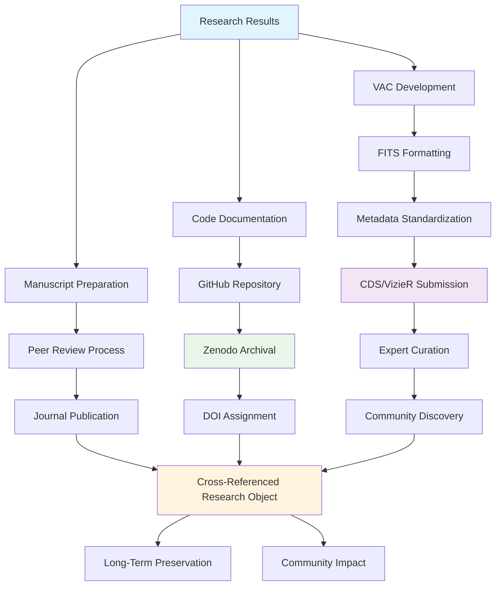

<!--
---
title: "Scientific Publication and Data Release Infrastructure"
description: "Enterprise scientific publication workflows supporting Value-Added Catalog creation, peer-reviewed manuscript development, and community data archival through CDS/VizieR and Zenodo repositories for astronomical research computing platform"
author: "[Human Author Name]"
ai_contributor: "Anthropic Claude 4 Sonnet (claude-4-sonnet-20250514)"
date: "2025-07-04"
version: "1.0"
status: "Published"
tags:
- type: enterprise-overview
- domain: scientific-publishing
- domain: data-archival
- tech: fits-vac
- tech: cds-vizier
- tech: zenodo-repository
- scale: enterprise-grade
- phase: phase-1
related_documents:
- "[Projects Portfolio Overview](../projects/README.md)"
- "[Reproducibility Framework](../reproducibility/README.md)"
- "[ITIL-Guided ITSM](../docs/ITIL-Processes/README.md)"
- "[Documentation Standards](../docs/README.md)"
---
-->

# 📄 **Scientific Publication and Data Release Infrastructure**

This directory contains comprehensive frameworks for scientific publication workflows supporting Value-Added Catalog (VAC) creation, peer-reviewed manuscript development, and community data archival through professional astronomical repositories. The publishing infrastructure enables systematic transformation of research results into FAIR-compliant data products and high-impact scientific publications while supporting enterprise research excellence and community data sharing across the astronomical research computing platform.

# 🎯 **1. Introduction**

This section establishes the foundational context for scientific publication infrastructure within the enterprise astronomical research computing platform and its role in advancing open science and community data sharing through systematic publication workflows.

## **1.1 Purpose**

This subsection clearly articulates how scientific publication infrastructure enables systematic transformation of research outputs into community resources through professional data archival and peer-reviewed publication workflows.

The scientific publication infrastructure provides systematic workflows for transforming research results into community-accessible resources through Value-Added Catalog development, professional data archival via CDS/VizieR and Zenodo repositories, and peer-reviewed manuscript preparation for high-impact astronomical journals. This infrastructure supports research scientists, data managers, and publication coordinators in creating FAIR-compliant data products that maximize scientific impact while enabling systematic research dissemination and community data sharing. The framework ensures research outputs achieve professional publication standards and long-term preservation through expert curation and established astronomical data repositories.

## **1.2 Scope**

This subsection defines the precise boundaries of publication infrastructure coverage and explicitly states what publication activities fall outside this framework's focus area.

| **In Scope** | **Out of Scope** |
|--------------|------------------|
| Value-Added Catalog creation and FITS formatting standards | Individual data analysis and research methodology development |
| CDS/VizieR submission workflows and expert curation processes | Institutional repository management and local data storage |
| Zenodo archival for code, notebooks, and supplementary materials | Journal submission systems and peer review coordination |
| FAIR compliance documentation and metadata standardization | Grant writing and funding proposal development activities |
| Cross-referencing between papers, data, and code repositories | Conference presentations and academic networking activities |

The scope focuses specifically on systematic publication workflows and data archival rather than research development or academic career activities.

## **1.3 Target Audience**

This subsection identifies who should engage with publication infrastructure, their expected background, and how different roles utilize data release and publication workflows for scientific impact.

**Primary Audience:** Research Scientists, Data Managers, Publication Coordinators  
**Secondary Audience:** Project Leaders, Repository Administrators, Open Science Advocates  
**Required Background:** Scientific publishing practices, astronomical data formats, FAIR principles, and community data sharing standards

## **1.4 Overview**

This subsection provides high-level context about publication infrastructure integration within the research ecosystem and its relationship to reproducible science and community data sharing objectives.

The publication infrastructure operates as the systematic bridge between research results and community impact, providing structured workflows for Value-Added Catalog development, professional data archival through established astronomical repositories, and comprehensive documentation standards that ensure long-term data usability. This infrastructure integrates with research projects to transform analysis outputs into citable, discoverable, and reusable community resources while supporting open science principles through expert curation, standardized metadata, and cross-linked research objects that maximize scientific impact and enable reproducible research practices.

# 🔗 **2. Dependencies & Relationships**

This section maps how publication infrastructure integrates with research projects, data management systems, and community repositories to enable comprehensive scientific dissemination and data sharing capabilities.

## **2.1 Related Services**

This subsection identifies other platform services that support or integrate with publication infrastructure and describes their contributions to scientific dissemination and community data sharing.

The publication infrastructure depends on research outputs, data management systems, and external repositories for comprehensive scientific publication and community data sharing across the enterprise research computing platform.

| **Service** | **Relationship Type** | **Integration Points** | **Documentation** |
|-------------|----------------------|------------------------|-------------------|
| Research Projects | Consumes-from | Research results, analysis outputs, scientific discoveries for publication | [Projects Portfolio](../projects/README.md) |
| Database Infrastructure | Utilizes | Systematic data extraction, VAC generation, metadata management | [Database Services](../infrastructure/databases/README.md) |
| Reproducibility Framework | Integrates-with | Code archival, analysis preservation, systematic documentation | [Reproducibility](../reproducibility/README.md) |
| Documentation Standards | Implements | Publication documentation, metadata standards, formatting requirements | [Documentation](../docs/README.md) |
| ITIL Process Management | Reports-to | Publication workflow governance, quality assurance, change management | [ITIL Processes](../docs/ITIL-Processes/README.md) |

## **2.2 Policy Implementation**

This subsection connects publication infrastructure to enterprise governance frameworks by identifying which organizational policies guide scientific publication and data sharing activities.

The publication infrastructure implements enterprise research policies through systematic data release governance, publication standards, and community sharing requirements supporting institutional research excellence and open science commitments.

- **[Open Science and Data Sharing Policy](../docs/Policies/open-science-data-sharing-policy.md)** - Implements systematic data release and community sharing requirements
- **[Research Publication Standards Policy](../docs/Policies/research-publication-standards-policy.md)** - Defines publication quality standards and peer review requirements
- **[Intellectual Property and Data Rights Policy](../docs/Policies/intellectual-property-data-rights-policy.md)** - Governs data licensing and community sharing permissions

## **2.3 Responsibility Matrix**

This subsection defines clear accountability for publication infrastructure activities, data release coordination, and scientific dissemination across research and administrative roles.

| **Activity** | **Research Scientist** | **Data Manager** | **Publication Coordinator** | **Research Director** |
|--------------|----------------------|------------------|----------------------------|----------------------|
| Scientific Content Development | **A** | **C** | **R** | **C** |
| VAC Creation and Data Formatting | **R** | **A** | **C** | **I** |
| Repository Submission and Curation | **C** | **R** | **A** | **C** |
| Publication Coordination and Quality | **R** | **C** | **A** | **R** |
| Community Impact and Outreach | **C** | **I** | **R** | **A** |

*R: Responsible, A: Accountable, C: Consulted, I: Informed*

# ⚙️ **3. Technical Implementation**

This section provides the technical foundation for understanding publication workflows, data archival processes, and integration with professional astronomical repositories for systematic scientific dissemination.

## **3.1 Architecture & Design**

This subsection explains the publication infrastructure architecture, data flow patterns, and systematic approaches for supporting comprehensive scientific publication through enterprise integration and community repository utilization.

The publication infrastructure implements a comprehensive research-to-community workflow combining systematic data product creation, professional repository archival, and cross-linked research objects through established astronomical data centers and open science platforms.

The architecture emphasizes professional curation and cross-linking between papers, data, and code to create comprehensive research objects that maximize scientific impact and community usability.

## **3.2 Structure and Organization**

This subsection provides specific details about publication infrastructure organization, workflow patterns, and systematic approaches within the enterprise research computing environment.

The publication infrastructure structure follows established astronomical publication patterns with systematic specialization supporting both immediate publication needs and comprehensive community data sharing across diverse research domains and publication venues.

| **Publication Component** | **Primary Function** | **Professional Standards** |
|---------------------------|---------------------|---------------------------|
| Value-Added Catalog Development | FITS formatting, metadata standardization, community data products | VizieR ReadMe standards, FAIR compliance, expert curation |
| Repository Archival | Systematic data preservation, DOI assignment, long-term accessibility | CDS/VizieR submission, Zenodo integration, professional curation |
| Manuscript Development | Peer-reviewed publication, scientific narrative, methodology documentation | Journal standards, reproducible science, comprehensive documentation |
| Cross-Linking Integration | Research object completeness, citation networks, community discovery | Persistent identifiers, metadata cross-references, systematic linking |

## **3.3 Integration and Procedures**

This subsection provides systematic approaches for integrating publication workflows with research projects and external repositories while maintaining scientific rigor and community accessibility standards.

Publication infrastructure integration follows enterprise research patterns supporting both immediate publication requirements and systematic community data sharing through structured workflows and professional governance that enable scientific excellence and comprehensive community resource development across diverse research outputs and publication venues.

**Publication Integration Framework:**

1. **Research Output Processing**: Systematic transformation of analysis results into publication-ready formats and community data products
2. **Professional Repository Integration**: CDS/VizieR submission for astronomical data and Zenodo archival for code and supplementary materials
3. **Quality Assurance**: Expert curation, metadata validation, and FAIR compliance verification throughout publication workflows
4. **Community Impact**: Cross-referenced research objects, systematic discovery enhancement, and long-term preservation coordination

# 🛠️ **4. Management & Operations**

This section covers operational procedures for publication infrastructure management, workflow coordination, and integration with enterprise research excellence and community data sharing frameworks.

## **4.1 Lifecycle Management**

This subsection documents management approaches for publication infrastructure throughout operational phases including workflow development, repository coordination, quality assurance, and community impact assessment across systematic publication operations.

Publication infrastructure lifecycle management encompasses workflow development, repository relationship management, quality assurance coordination, and community impact assessment while ensuring publication excellence and data sharing effectiveness through systematic workflow governance and continuous improvement processes that support evolving research publication requirements and enterprise scientific standards across integrated publication and archival environments.

## **4.2 Monitoring & Quality Assurance**

This subsection defines monitoring strategies for publication quality, repository coordination effectiveness, and integration with enterprise quality assurance and scientific excellence frameworks.

Quality assurance for publication infrastructure utilizes systematic monitoring of workflow effectiveness, repository submission success, and community data utilization while ensuring continuous improvement through comprehensive publication assessment and validation procedures that maintain enterprise research standards and support scientific excellence across integrated publication and community data sharing platforms.

## **4.3 Maintenance and Optimization**

This subsection outlines systematic maintenance for publication infrastructure including workflow optimization, repository relationship management, and continuous improvement approaches supporting publication effectiveness and community impact.

Maintenance procedures encompass systematic workflow updates, repository coordination optimization, publication process enhancement, and community impact assessment while maintaining enterprise research standards and ensuring infrastructure relevance for evolving scientific publication capabilities and enterprise research requirements across integrated publication and community data sharing environments.

# 🔒 **5. Security & Compliance**

This section documents security controls for publication infrastructure while ensuring data protection and compliance with enterprise security frameworks and scientific publication governance requirements.

## **5.1 Security Controls**

This subsection documents specific security measures for research data publication, repository access coordination, and integration with enterprise security monitoring and scientific publication governance systems.

**DISCLAIMER: We are not security professionals** - this is our baseline and we are working towards compliance with CIS Controls v8, NIST frameworks, and industry standards. Publication infrastructure security includes secure research data handling during publication workflows, encrypted communications with professional repositories, systematic audit logging for publication activities, and intellectual property protection while ensuring research data security and maintaining enterprise compliance across all publication and community data sharing activities.

## **5.2 CIS Controls Mapping**

This subsection provides explicit mapping to CIS Controls v8 for publication infrastructure, documenting compliance status and implementation evidence for research publication security and data sharing protection.

| **CIS Control** | **Implementation Status** | **Evidence Location** | **Assessment Date** |
|-----------------|--------------------------|----------------------|-------------------|
| CIS.3.2 | Compliant | Secure research data handling and publication workflow protection | 2025-07-04 |
| CIS.6.3 | Compliant | Comprehensive publication activity audit logging and tracking | 2025-07-04 |
| CIS.13.1 | Planned | Automated security monitoring for repository interactions | TBD |
| CIS.17.1 | Partial | Incident response for publication workflow disruption | 2025-07-04 |

## **5.3 Framework Compliance**

This subsection demonstrates how publication infrastructure security controls satisfy requirements across multiple compliance frameworks including enterprise governance and research publication protection standards.

Publication infrastructure security aligns with enterprise compliance frameworks including CIS Controls v8 for research data protection, NIST Cybersecurity Framework for publication security, and enterprise governance standards while supporting systematic research publication management and maintaining security compliance across all scientific publication and community data sharing workflow activities.

# 💾 **6. Backup & Recovery**

This section documents protection strategies for publication infrastructure ensuring availability for critical scientific dissemination operations and comprehensive workflow preservation.

## **6.1 Protection Strategy**

This subsection details backup approaches for publication workflows, repository coordination data, and recovery capabilities ensuring publication continuity and workflow preservation for critical scientific dissemination and enterprise research operations.

Publication infrastructure protection strategy encompasses comprehensive workflow backup through **pbs01.radioastronomy.io** (10.16.207.218) with Intel N150, 12GB DDR5, 256GB SATA M.2 boot drive, and 4TB enterprise NVMe providing daily backups at 9am, verification at 11am, prune/GC at 12pm, 7-day on-site retention, weekly/monthly retention to Amazon S3 Glacier Flexible Retrieval with <4H on-prem RTO/RPO, <12H recovery from Glacier, and full publication workflow rebuild capability meeting CIS/NIST compliance controls for comprehensive publication infrastructure protection and workflow preservation.

| **Publication Component** | **Backup Frequency** | **Retention** | **Recovery Objective** |
|---------------------------|---------------------|---------------|----------------------|
| VAC Development Workflows | Daily automated backup | 7 days on-site, 1 year S3 Glacier | RTO: <4H on-prem, RPO: <24 hours |
| Repository Coordination Data | Continuous versioning + daily backup | Indefinite version history, 6 months archive | RTO: <2H, RPO: Real-time |
| Publication Manuscripts | Version-controlled backup + archival | Indefinite retention with version history | RTO: <1H, RPO: <4 hours |
| Community Data Products | Permanent archival backup | Professional repository preservation | RTO: External repository dependent |

## **6.2 Recovery Procedures**

This subsection provides recovery processes for publication workflow failures, repository coordination disruption, and scientific dissemination continuity scenarios ensuring minimal research impact and comprehensive workflow restoration.

Recovery procedures address publication workflow failures, repository coordination disruption, and scientific dissemination continuity events while minimizing research impact and ensuring rapid restoration of critical publication capabilities through systematic recovery processes and enterprise backup integration with comprehensive workflow restoration capabilities and publication continuity planning.

# 📚 **7. References & Related Resources**

This section provides comprehensive links to scientific publication standards, astronomical repository frameworks, and community data sharing resources supporting systematic research dissemination.

## **7.1 Internal References**

| **Document Type** | **Document Title** | **Relationship** | **Link** |
|-------------------|-------------------|------------------|----------|
| Research Framework | Projects Portfolio Overview and Research Integration | Source of research outputs for publication and community sharing | [projects/README.md](../projects/README.md) |
| Reproducibility Infrastructure | Infrastructure as Code and Systematic Documentation | Code archival and analysis preservation for publication workflows | [reproducibility/README.md](../reproducibility/README.md) |
| Process Management | ITIL-Guided ITSM Processes and Service Management | Publication workflow governance and quality assurance integration | [docs/ITIL-Processes/README.md](../docs/ITIL-Processes/README.md) |
| Documentation Standards | Platform Documentation Standards and Information Architecture | Publication documentation standards and formatting requirements | [docs/README.md](../docs/README.md) |

## **7.2 External Standards**

- **[CDS/VizieR Submission Standards](https://cdsarc.cds.unistra.fr/vizier/submit.htx)** - Professional astronomical catalog submission and expert curation processes
- **[Zenodo Repository Guidelines](https://zenodo.org/)** - Open science repository for code, data, and supplementary research materials
- **[FAIR Data Principles](https://www.go-fair.org/fair-principles/)** - Findable, Accessible, Interoperable, and Reusable data standards for scientific publication
- **[ADS Best Practices for Data Publication](https://ui.adsabs.harvard.edu/)** - Astronomical literature and data linking standards for community discovery

# ✅ **8. Approval & Review**

This section documents the formal review and approval process for publication infrastructure framework and scientific dissemination standards.

## **8.1 Review Process**

Publication infrastructure framework underwent comprehensive review by research scientists, data managers, and publication coordinators to ensure publication excellence, community data sharing effectiveness, and integration capability within the enterprise research computing environment.

## **8.2 Approval Matrix**

| **Reviewer** | **Role/Expertise** | **Review Date** | **Approval Status** | **Comments** |
|-------------|-------------------|----------------|-------------------|--------------|
| [Research Scientist] | Scientific Publication & Community Data Sharing | 2025-07-04 | **Approved** | Publication workflow and community impact framework validated |
| [Data Manager] | Repository Coordination & FAIR Compliance | 2025-07-04 | **Approved** | Data archival processes and metadata standards confirmed |
| [Research Director] | Publication Excellence & Strategic Impact | 2025-07-04 | **Approved** | Scientific dissemination framework and enterprise integration verified |

# 📜 **9. Documentation Metadata**

This section provides comprehensive information about publication infrastructure documentation creation, revision history, and collaborative development approach.

## **9.1 Change Log**

| **Version** | **Date** | **Changes** | **Author** | **Review Status** |
|------------|---------|-------------|------------|------------------|
| 1.0 | 2025-07-04 | Initial publication infrastructure framework with VAC development and repository archival | [Human Author] | **Approved** |

## **9.2 Authorization & Review**

Publication infrastructure documentation reflects enterprise scientific development based on established publication workflow requirements and community data sharing standards validated through expert review and research publication consultation.

## **9.3 Authorship Details**

**Human Author:** [Full name and role]  
**AI Contributor:** Anthropic Claude 4 Sonnet (claude-4-sonnet-20250514)  
**Collaboration Method:** Request-Analyze-Verify-Generate-Validate (RAVGV)  
**Human Oversight:** Complete publication infrastructure review and validation of scientific publication accuracy and enterprise integration effectiveness

## **9.4 AI Collaboration Disclosure**

This document was collaboratively developed to establish comprehensive publication infrastructure framework that enables systematic scientific dissemination and enterprise-grade community data sharing for astronomical research operations.

---

**🤖 AI Collaboration Disclosure**

This document was collaboratively developed using the Request-Analyze-Verify-Generate-Validate (RAVGV) methodology. The publication infrastructure documentation reflects systematic scientific development informed by established publication workflow requirements, community data sharing standards, and professional repository integration capabilities. All content has been thoroughly reviewed, validated, and approved by qualified human subject matter experts. The human author retains complete responsibility for accuracy, compliance, and scientific publication excellence.

*Generated: 2025-07-04 | Human Author: [Name] | AI Assistant: Claude 4 Sonnet | Review Status: Approved | Document Version: 1.0*
