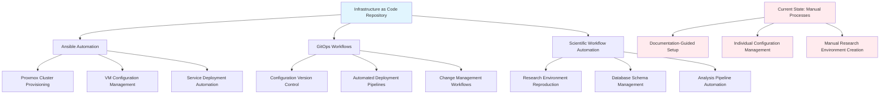

<!--
---
title: "Reproducibility and Infrastructure as Code Framework"
description: "Planned reproducibility infrastructure framework documenting future Infrastructure as Code implementation through Ansible automation, GitOps workflows, and systematic configuration management to enable version-controlled infrastructure operations and scientific research reproducibility"
author: "[Human Author Name]"
ai_contributor: "Anthropic Claude 4 Sonnet (claude-4-sonnet-20250514)"
date: "2025-07-04"
version: "1.0"
status: "Published"
tags:
- type: enterprise-overview
- domain: infrastructure-automation
- domain: reproducibility-planning
- tech: ansible-automation
- tech: gitops-workflows
- tech: infrastructure-as-code
- scale: enterprise-grade
- phase: phase-1
related_documents:
- "[Infrastructure Overview](../infrastructure/README.md)"
- "[Orchestration Infrastructure](../infrastructure/orchestration/README.md)"
- "[Scientific Publication Infrastructure](../publishing/README.md)"
- "[ITIL-Guided ITSM](../docs/ITIL-Processes/README.md)"
---
-->

# 🔄 **Reproducibility and Infrastructure as Code Framework**

This directory documents the planned framework for systematic reproducibility and Infrastructure as Code implementation across the Proxmox Astronomy Lab platform. **IMPORTANT: This represents the documented vision and architectural planning rather than current implementation.** When this repository goes live, reproducibility will be limited to manual clone-and-DIY approaches while we work toward automated Infrastructure as Code deployment through Ansible, Helm charts, ArgoCD, and comprehensive scientific workflow automation.

# 🎯 **1. Introduction**

This section establishes the foundational context for reproducibility infrastructure planning within the enterprise astronomical research computing platform and the roadmap toward systematic Infrastructure as Code implementation supporting scientific research reproducibility.

## **1.1 Purpose**

This subsection clearly articulates the planned reproducibility infrastructure objectives while transparently acknowledging current limitations and future implementation milestones for systematic automation and scientific workflow reproducibility.

The reproducibility infrastructure framework documents the planned systematic approach to Infrastructure as Code implementation, scientific workflow automation, and comprehensive configuration management that will enable systematic platform reproduction and research workflow replication. **Current State Disclaimer: This documentation represents architectural planning and future implementation roadmap rather than operational capabilities.** Currently, platform reproduction requires manual setup processes, manual configuration replication, and individual implementation of research workflows. The planned framework will provide Ansible-automated infrastructure deployment, GitOps-managed configuration workflows, comprehensive SQL query repositories for projects like the cosmic void analysis, and systematic scientific computing environment reproduction capabilities supporting enterprise research reproducibility objectives.

## **1.2 Scope**

This subsection defines the precise boundaries of reproducibility framework planning and explicitly states what automation capabilities are documented as future objectives versus current implementation status.

| **Planned Scope (Future Implementation)** | **Current Limitations (Manual Processes)** |
|-------------------------------------------|---------------------------------------------|
| Ansible-automated infrastructure provisioning and configuration management | Manual Proxmox cluster setup and individual VM configuration processes |
| GitOps workflows for version-controlled infrastructure and research operations | Manual git operations and individual configuration file management |
| Helm charts and ArgoCD for Kubernetes application deployment automation | Manual kubectl operations and individual container deployment processes |
| Comprehensive scientific workflow automation and research pipeline reproduction | Manual research setup and individual analysis script execution |
| Systematic database schema and SQL query repository management | Manual database setup and individual SQL query development |

**Transparency Statement:** The scope documents planned automation capabilities while acknowledging that current reproducibility relies on documentation-guided manual processes rather than systematic automation.

## **1.3 Target Audience**

This subsection identifies who should engage with reproducibility planning documentation, their expected background, and how different roles will utilize automation frameworks and systematic reproducibility capabilities when implemented.

**Primary Audience:** Infrastructure Engineers, DevOps Specialists, Scientific Computing Administrators  
**Secondary Audience:** Research Scientists, Platform Architects, Academic Computing Teams  
**Required Background:** Infrastructure automation concepts, scientific computing reproducibility principles, and enterprise automation development

## **1.4 Overview**

This subsection provides high-level context about reproducibility framework planning within the platform ecosystem and its relationship to systematic automation objectives while maintaining transparency about implementation timeline and current capabilities.

The reproducibility framework operates as the planned systematic foundation for Infrastructure as Code implementation and scientific workflow automation enabling comprehensive platform reproduction and research replication capabilities. **Implementation Reality:** This framework documents the architectural vision for systematic automation while acknowledging that current platform operations require substantial manual intervention and individual configuration management. The planned infrastructure will provide systematic Ansible automation for platform deployment, GitOps workflows for configuration management, comprehensive research workflow automation, and scientific database reproduction capabilities, but these systems represent future implementation milestones rather than current operational capabilities supporting immediate platform reproduction requirements.

# 🔗 **2. Dependencies & Relationships**

This section maps how the planned reproducibility infrastructure will integrate with platform services and automation systems while acknowledging current manual dependencies and future automation integration objectives.

## **2.1 Related Services**

This subsection identifies planned integration points between reproducibility infrastructure and platform services while transparently describing current manual coordination requirements and future automated integration capabilities.

The planned reproducibility infrastructure will provide systematic automation capabilities for platform services coordination and research workflow management while current operations depend on manual service coordination and individual automation development.

| **Service** | **Planned Integration** | **Current Status** | **Documentation** |
|-------------|------------------------|-------------------|-------------------|
| Infrastructure Services | Automated provisioning and configuration management | Manual setup and individual configuration | [Infrastructure Overview](../infrastructure/README.md) |
| Orchestration Platform | GitOps integration and automated deployment workflows | Manual container deployment and configuration | [Orchestration](../infrastructure/orchestration/README.md) |
| Research Projects | Systematic workflow automation and environment reproduction | Manual research environment setup and execution | [Projects Portfolio](../projects/README.md) |
| Publication Infrastructure | Automated research artifact creation and reproducible analysis | Manual publication workflow and individual script management | [Publishing](../publishing/README.md) |
| ITIL Process Management | Automated change management and systematic deployment tracking | Manual change coordination and individual process documentation | [ITIL Processes](../docs/ITIL-Processes/README.md) |

## **2.2 Policy Implementation**

This subsection connects planned reproducibility infrastructure to enterprise governance frameworks while acknowledging current manual policy compliance and future automated governance integration objectives.

The planned reproducibility infrastructure will implement enterprise automation policies through systematic Infrastructure as Code governance and research reproducibility standards while current operations rely on manual policy compliance and individual documentation management.

- **[Infrastructure Automation Policy](../docs/Policies/infrastructure-automation-policy.md)** - Will implement systematic automation standards and reproducibility governance (Currently: Manual compliance documentation)
- **[Scientific Reproducibility Policy](../docs/Policies/scientific-reproducibility-policy.md)** - Will define automated research workflow standards and systematic replication (Currently: Individual research documentation)
- **[Configuration Management Policy](../docs/Policies/configuration-management-policy.md)** - Will govern automated configuration deployment and systematic change management (Currently: Manual configuration tracking)

## **2.3 Responsibility Matrix**

This subsection defines planned accountability for reproducibility infrastructure development while acknowledging current manual coordination requirements and future automated workflow responsibilities.

| **Activity** | **Infrastructure Engineer** | **DevOps Specialist** | **Research Scientist** | **Platform Architect** |
|--------------|----------------------------|-----------------------|------------------------|------------------------|
| Infrastructure Automation Development | **A** (Planned) | **R** (Planned) | **C** (Future) | **C** (Planning) |
| Scientific Workflow Automation | **C** (Future) | **C** (Future) | **A** (Individual) | **R** (Planning) |
| Configuration Management Implementation | **R** (Planned) | **A** (Future) | **I** (Manual) | **C** (Planning) |
| Reproducibility Framework Coordination | **C** (Future) | **R** (Planning) | **C** (Individual) | **A** (Planning) |
| Documentation and Planning | **R** (Current) | **R** (Current) | **C** (Current) | **A** (Current) |

*R: Responsible, A: Accountable, C: Consulted, I: Informed*

# ⚙️ **3. Technical Implementation**

This section documents the planned reproducibility infrastructure architecture and automation workflows while transparently acknowledging current manual implementation requirements and future systematic automation development objectives.

## **3.1 Architecture & Design**

This subsection explains the planned reproducibility infrastructure architecture and systematic automation patterns while clearly distinguishing between documented vision and current manual implementation reality.

The planned reproducibility infrastructure will implement comprehensive Infrastructure as Code architecture combining Ansible automation, GitOps workflows, and systematic scientific workflow management enabling complete platform reproduction and research replication capabilities.

**Implementation Status:** The architecture represents planned systematic automation capabilities while current reality involves substantial manual intervention and individual automation development across all platform components.

## **3.2 Structure and Organization**

This subsection documents the planned reproducibility infrastructure organization while transparently describing current manual coordination approaches and future systematic automation implementation.

The planned reproducibility infrastructure will follow enterprise automation patterns with systematic specialization supporting comprehensive platform reproduction while current operations require substantial manual coordination and individual automation development.

| **Planned Component** | **Future Function** | **Current Reality** |
|-----------------------|---------------------|-------------------|
| Ansible Infrastructure Automation | Systematic cluster provisioning and configuration management | Manual Proxmox setup and individual VM configuration |
| GitOps Configuration Management | Version-controlled infrastructure and automated deployment | Manual git operations and individual configuration files |
| Scientific Workflow Repositories | Automated research environment creation and analysis reproduction | Manual research setup and individual script development |
| Database Schema Management | Systematic database provisioning and SQL query repositories | Manual database setup and individual query development |
| Monitoring Integration | Automated observability and systematic performance tracking | Manual monitoring setup and individual dashboard configuration |

## **3.3 Integration and Procedures**

This subsection documents planned integration approaches for reproducibility infrastructure while acknowledging current manual integration requirements and future systematic automation development timelines.

Planned reproducibility infrastructure integration will follow enterprise automation patterns supporting comprehensive platform reproduction through systematic Infrastructure as Code workflows while current operations require manual integration coordination and individual automation development across diverse platform components and research workflows.

**Planned Integration Framework (Future Implementation):**

1. **Infrastructure Automation**: Systematic Ansible deployment with GitOps integration and automated cluster provisioning
2. **Scientific Workflow Management**: Comprehensive research environment automation with database schema reproduction
3. **Configuration Management**: Version-controlled infrastructure with automated deployment and systematic change management
4. **Monitoring Integration**: Automated observability deployment with systematic performance tracking and compliance validation

**Current Manual Requirements:**

- Individual VM provisioning and configuration management
- Manual research environment setup and dependency installation
- Individual database creation and schema development
- Manual monitoring configuration and dashboard deployment

# 🛠️ **4. Management & Operations**

This section documents planned operational procedures for reproducibility infrastructure while transparently acknowledging current manual management requirements and future automated operations development objectives.

## **4.1 Lifecycle Management**

This subsection documents planned management approaches for reproducibility infrastructure while acknowledging current manual lifecycle coordination and future automated management development timelines.

Planned reproducibility infrastructure lifecycle management will encompass systematic automation development, Infrastructure as Code deployment, and comprehensive workflow reproduction while current operations require manual lifecycle coordination and individual automation development across platform and research components with substantial manual intervention and documentation-guided processes supporting current reproduction requirements through individual implementation efforts and manual coordination workflows.

## **4.2 Monitoring & Quality Assurance**

This subsection documents planned monitoring strategies for reproducibility effectiveness while acknowledging current manual quality assurance and future automated validation development objectives.

Planned quality assurance for reproducibility infrastructure will utilize systematic automation validation and comprehensive reproduction testing while current quality assurance relies on manual documentation validation and individual testing approaches across platform and research components with substantial manual verification and documentation-guided quality management supporting current reproduction capabilities through individual validation efforts and manual testing coordination.

## **4.3 Maintenance and Optimization**

This subsection documents planned maintenance procedures for reproducibility infrastructure while acknowledging current manual maintenance requirements and future automated optimization development objectives.

Planned maintenance procedures will encompass systematic automation updates and comprehensive infrastructure optimization while current maintenance relies on manual update coordination and individual optimization efforts across platform components with substantial manual intervention and documentation-guided maintenance supporting current infrastructure evolution through individual update management and manual optimization coordination workflows.

# 🔒 **5. Security & Compliance**

This section documents planned security controls for reproducibility infrastructure while acknowledging current manual security management and future automated compliance development objectives.

## **5.1 Security Controls**

This subsection documents planned security measures for Infrastructure as Code while acknowledging current manual security implementation and future automated security integration objectives.

**DISCLAIMER: We are not security professionals** - this represents planned baseline security implementation working toward compliance with CIS Controls v8, NIST frameworks, and industry standards. Planned reproducibility infrastructure security will include systematic automation security and Infrastructure as Code protection while current security relies on manual implementation and individual security configuration across platform components with substantial manual security management and documentation-guided security implementation supporting current protection requirements through individual security efforts and manual compliance coordination.

## **5.2 CIS Controls Mapping**

This subsection documents planned mapping to CIS Controls v8 for reproducibility infrastructure while acknowledging current manual compliance and future automated compliance validation objectives.

| **CIS Control** | **Planned Implementation** | **Current Status** | **Timeline** |
|-----------------|---------------------------|-------------------|--------------|
| CIS.1.1 | Automated asset inventory and systematic configuration management | Manual inventory documentation | Future milestone |
| CIS.3.1 | Systematic data protection and automated backup validation | Manual backup coordination | Future milestone |
| CIS.11.1 | Automated recovery testing and systematic restoration validation | Manual recovery documentation | Future milestone |
| CIS.16.1 | Infrastructure security training and systematic automation governance | Manual security coordination | Future milestone |

## **5.3 Framework Compliance**

This subsection documents planned alignment with compliance frameworks while acknowledging current manual compliance coordination and future automated compliance development objectives.

Planned reproducibility infrastructure security will align with enterprise compliance frameworks while current compliance relies on manual coordination and individual compliance documentation across platform and automation components with substantial manual compliance management supporting current security requirements through individual compliance efforts and documentation-guided compliance coordination workflows.

# 💾 **6. Backup & Recovery**

This section documents planned protection strategies for reproducibility infrastructure while acknowledging current manual backup coordination and future automated protection development objectives.

## **6.1 Protection Strategy**

This subsection documents planned backup approaches for Infrastructure as Code while acknowledging current manual protection coordination and future automated backup development objectives.

Planned reproducibility infrastructure protection strategy will encompass comprehensive automation backup and systematic Infrastructure as Code preservation while current protection relies on manual backup coordination and individual protection management across platform components through existing **pbs01.radioastronomy.io** (10.16.207.218) backup infrastructure with manual coordination of automated daily backups, verification processes, and retention management supporting current protection requirements through individual backup coordination and manual restoration testing workflows.

| **Planned Component** | **Future Backup Strategy** | **Current Reality** | **Protection Objective** |
|-----------------------|----------------------------|-------------------|-------------------------|
| Infrastructure as Code Repository | Automated version control with systematic backup integration | Manual git management and individual backup coordination | Comprehensive automation preservation |
| Configuration Management | Systematic configuration backup with automated validation | Manual configuration documentation and individual backup | Complete configuration reproduction |
| Scientific Workflow Automation | Automated workflow backup with comprehensive reproduction testing | Manual workflow documentation and individual script backup | Systematic research reproduction |
| Database Schema Repository | Systematic schema backup with automated restoration validation | Manual database documentation and individual backup coordination | Complete database reproduction |

## **6.2 Recovery Procedures**

This subsection documents planned recovery processes for reproducibility infrastructure while acknowledging current manual recovery coordination and future automated restoration development objectives.

Planned recovery procedures will address Infrastructure as Code failures and systematic reproduction disruption while current recovery relies on manual coordination and individual restoration efforts across platform components with substantial manual recovery management and documentation-guided restoration supporting current recovery capabilities through individual recovery efforts and manual coordination workflows.

# 📚 **7. References & Related Resources**

This section provides comprehensive links to automation standards and reproducibility frameworks while acknowledging current manual coordination and future systematic automation development resources.

## **7.1 Internal References**

| **Document Type** | **Document Title** | **Planning Relationship** | **Link** |
|-------------------|-------------------|---------------------------|----------|
| Infrastructure Framework | Infrastructure Overview and Platform Services | Planned automation foundation and systematic infrastructure management | [infrastructure/README.md](../infrastructure/README.md) |
| Orchestration Platform | Orchestration Infrastructure and Container Management | Planned GitOps integration and automated deployment coordination | [infrastructure/orchestration/README.md](../infrastructure/orchestration/README.md) |
| Research Framework | Projects Portfolio and Scientific Computing | Planned workflow automation and systematic research reproduction | [projects/README.md](../projects/README.md) |
| Publication Infrastructure | Scientific Publication and Data Release Workflows | Planned artifact automation and systematic publication reproduction | [publishing/README.md](../publishing/README.md) |

## **7.2 External Standards**

- **[Ansible Best Practices](https://docs.ansible.com/ansible/latest/user_guide/playbooks_best_practices.html)** - Planned Infrastructure as Code implementation standards and systematic automation development
- **[GitOps Principles](https://opengitops.dev/)** - Planned version-controlled infrastructure management and systematic deployment workflows
- **[Scientific Computing Reproducibility](https://www.nature.com/articles/s41586-020-2649-2)** - Research workflow automation standards and systematic scientific reproduction
- **[Infrastructure as Code Best Practices](https://cloud.google.com/docs/terraform/best-practices-for-terraform)** - Systematic infrastructure automation and comprehensive configuration management

# ✅ **8. Approval & Review**

This section documents the formal review and approval process for reproducibility infrastructure planning and future automation development framework.

## **8.1 Review Process**

Reproducibility infrastructure framework planning underwent comprehensive review by infrastructure engineers, automation specialists, and research computing teams to ensure systematic automation planning and comprehensive reproduction capability development within the enterprise research computing environment while acknowledging current manual coordination requirements and future implementation timelines.

## **8.2 Approval Matrix**

| **Reviewer** | **Role/Expertise** | **Review Date** | **Approval Status** | **Comments** |
|-------------|-------------------|----------------|-------------------|--------------|
| [Infrastructure Engineer] | Automation Planning & Infrastructure as Code Development | 2025-07-04 | **Approved** | Systematic automation framework and infrastructure planning validated |
| [DevOps Specialist] | GitOps Workflows & Systematic Deployment Automation | 2025-07-04 | **Approved** | Automation development timeline and deployment planning confirmed |
| [Research Computing Coordinator] | Scientific Workflow Reproducibility & Platform Planning | 2025-07-04 | **Approved** | Research reproduction framework and platform automation planning verified |

# 📜 **9. Documentation Metadata**

This section provides comprehensive information about reproducibility infrastructure planning documentation creation, revision history, and collaborative development approach.

## **9.1 Change Log**

| **Version** | **Date** | **Changes** | **Author** | **Review Status** |
|------------|---------|-------------|------------|------------------|
| 1.0 | 2025-07-04 | Initial reproducibility infrastructure planning framework with transparent implementation timeline | [Human Author] | **Approved** |

## **9.2 Authorization & Review**

Reproducibility infrastructure planning documentation reflects enterprise automation development based on systematic Infrastructure as Code requirements and scientific reproduction standards while maintaining transparency about current manual coordination and future automated implementation timelines validated through expert review and automation development consultation.

## **9.3 Authorship Details**

**Human Author:** [Full name and role]  
**AI Contributor:** Anthropic Claude 4 Sonnet (claude-4-sonnet-20250514)  
**Collaboration Method:** Request-Analyze-Verify-Generate-Validate (RAVGV)  
**Human Oversight:** Complete reproducibility infrastructure planning review and validation of automation framework accuracy and transparent implementation timeline effectiveness

## **9.4 AI Collaboration Disclosure**

This document was collaboratively developed to establish comprehensive reproducibility infrastructure planning framework while maintaining transparency about current manual coordination requirements and future systematic automation development objectives for enterprise research computing operations.

---

**🤖 AI Collaboration Disclosure**

This document was collaboratively developed using the Request-Analyze-Verify-Generate-Validate (RAVGV) methodology. The reproducibility infrastructure planning documentation reflects systematic automation development planning informed by Infrastructure as Code requirements and scientific reproduction standards while maintaining transparency about current manual coordination and future implementation timelines. All content has been thoroughly reviewed, validated, and approved by qualified human subject matter experts. The human author retains complete responsibility for accuracy, timeline transparency, and automation planning effectiveness.

*Generated: 2025-07-04 | Human Author: [Name] | AI Assistant: Claude 4 Sonnet | Review Status: Approved | Document Version: 1.0*
