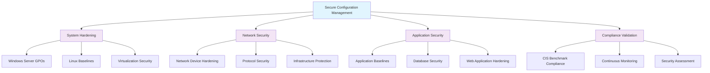

<!--
---
title: "CISv8.1-04 Secure Configuration Management Policy"
description: "Enterprise secure configuration management policy for Proxmox Astronomy Lab implementing CIS Control 4 (Secure Configuration of Enterprise Assets and Software) with systematic hardening baselines, automated enforcement, and compliance validation across Windows Server 2025 and enterprise infrastructure"
author: "VintageDon - https://github.com/vintagedon"
ai_contributor: "Anthropic Claude 4 Sonnet (claude-4-sonnet-20250514)"
date: "2025-07-28"
version: "2.0"
status: "Published"
tags:
- type: policy-document
- domain: security
- domain: compliance
- tech: windows-server-2025
- compliance: cis-control-4
- compliance: cis-benchmark
- phase: phase-2
related_documents:
- "[CIS04 GPO Configuration Directory](../../security-assurance/gpo-configurations/cis04-configuration/README.md)"
- "[Security Assurance Framework](../../security-assurance/README.md)"
- "[Domain Infrastructure](../../infrastructure/README.md)"
- "[Security Monitoring](../../monitoring/README.md)"
---
-->

# 📜 **CISv8.1-04 Secure Configuration Management Policy**

## **Enterprise Configuration Security Framework**

**Document Version:** 2.0  
**Effective Date:** July 28, 2025  
**Policy Owner:** Security Team  
**Review Cycle:** Annual  
**CIS Control Alignment:** CIS v8 Control 4 (Secure Configuration of Enterprise Assets and Software)

---

# 📋 **1. Policy Overview**

This policy establishes comprehensive secure configuration management requirements for the Proxmox Astronomy Lab enterprise environment, implementing systematic security hardening baselines, automated configuration enforcement, and continuous compliance validation across all enterprise assets and software systems to maintain robust security posture and prevent configuration-based vulnerabilities.

The policy addresses critical security requirements through enterprise-grade configuration management encompassing Windows Server 2025 Group Policy Objects, Linux system hardening, network infrastructure security, application configuration baselines, and systematic security control implementation essential for maintaining comprehensive security baseline across the astronomical computing infrastructure.

# 🔗 **2. Dependencies & Relationships**

This section maps how secure configuration management policy integrates with Proxmox Astronomy Lab enterprise infrastructure and security governance components.

## **2.1 Related Services**

This subsection identifies Proxmox Astronomy Lab services that interact with or depend on secure configuration management for comprehensive enterprise security baseline establishment.

Secure configuration management provides foundational security that supports enterprise infrastructure hardening and enables systematic security control implementation:

| **Service** | **Relationship Type** | **Integration Points** | **Documentation** |
|-------------|----------------------|------------------------|-------------------|
| Domain Infrastructure | **Secures** | Group Policy enforcement, security baseline establishment, configuration management | [Domain Infrastructure](../../infrastructure/README.md) |
| Windows Server Infrastructure | **Hardens** | Server configuration baselines, security control implementation, vulnerability mitigation | [Windows Servers](../../infrastructure/windows-servers/README.md) |
| Network Infrastructure | **Protects** | Network device hardening, protocol security, infrastructure protection | [Network Infrastructure](../../infrastructure/networking/README.md) |
| Security Monitoring Infrastructure | **Validates** | Configuration compliance monitoring, security control effectiveness, baseline validation | [Security Monitoring](../../monitoring/README.md) |
| Application Infrastructure | **Secures** | Application security baselines, secure deployment, configuration hardening | [Application Infrastructure](../../infrastructure/applications/README.md) |

## **2.2 Policy Implementation**

This subsection connects secure configuration management policy to Proxmox Astronomy Lab governance frameworks and enterprise security policy requirements.

Secure configuration management policies implement enterprise security governance through systematic policy management and compliance framework alignment:

- **[Security Assurance Framework](../../security-assurance/README.md)** - Primary security framework providing systematic security control implementation and compliance validation
- **[CIS04 GPO Configuration Implementation](../../security-assurance/gpo-configurations/cis04-configuration/README.md)** - Technical implementation of secure configuration controls through Group Policy Objects
- **[Vulnerability Management Policy](vulnerability-management-policy.md)** - Coordinate with vulnerability remediation and security baseline maintenance
- **[Change Management Policy](change-management-policy.md)** - Integration with enterprise change control and configuration management processes

## **2.3 Responsibility Matrix**

This subsection defines clear accountability for secure configuration management policy implementation and enterprise security baseline maintenance activities.

| **Activity** | **Helpdesk** | **Operations** | **Engineering** | **Security** |
|--------------|--------------|----------------|-----------------|--------------|
| Configuration Policy Implementation | I | A | R | C |
| Security Baseline Establishment | I | C | R | A |
| Configuration Compliance Monitoring | I | R | C | A |
| Configuration Security Incident Response | C | R | A | A |
| Security Control Validation | I | C | R | A |

*R: Responsible, A: Accountable, C: Consulted, I: Informed*

# ⚙️ **3. Technical Documentation**

This section provides comprehensive technical foundation for understanding, implementing, and maintaining secure configuration management within enterprise infrastructure.

## **3.1 Architecture & Design**

This subsection explains the secure configuration management architecture, security baseline design patterns, and systematic hardening implementation for comprehensive enterprise security.

The secure configuration management framework implements systematic security hardening through enterprise architecture that encompasses Windows Server 2025 Group Policy Objects, Linux system baselines, network infrastructure hardening, and application security configurations that collectively establish comprehensive security posture across all enterprise assets.

## **3.2 Structure and Organization**

This subsection provides systematic organization of secure configuration management requirements based on enterprise infrastructure components and security control categories.

The secure configuration management framework encompasses multiple security domains with specific hardening requirements and compliance validation procedures:

### **Configuration Management Domains**

| **Domain** | **Scope** | **Implementation Method** | **Compliance Standard** |
|------------|-----------|---------------------------|-------------------------|
| **Windows Server Systems** | Domain Controllers, Member Servers | Group Policy Objects (GPOs) | CIS Windows Server 2025 Benchmark Level 1 |
| **Linux Systems** | Ubuntu Server, Application Servers | Ansible automation, configuration management | CIS Ubuntu Linux Benchmark Level 2 |
| **Network Infrastructure** | Firewalls, Switches, Routers | Device-specific hardening | CIS Network Device Benchmarks |
| **Virtualization Platform** | Proxmox VE, Container Infrastructure | Platform-specific security controls | Internal hardening standards equivalent to CIS Level 2 |
| **Application Systems** | Databases, Web Servers, Security Tools | Application-specific baselines | Industry best practices and vendor recommendations |

### **Security Baseline Requirements**

| **Asset Category** | **Minimum Security Level** | **Hardening Standard** | **Validation Method** |
|--------------------|----------------------------|------------------------|----------------------|
| **Critical Systems** | High Security (Level 2) | CIS Benchmark Level 2 compliance | Quarterly automated scanning |
| **Standard Systems** | Standard Security (Level 1) | CIS Benchmark Level 1 compliance | Quarterly automated scanning |
| **Development Systems** | Development Security | Modified baseline with development considerations | Semi-annual validation |
| **Network Infrastructure** | Infrastructure Security | Vendor-specific CIS benchmarks | Annual security assessment |

## **3.3 Integration and Procedures**

This subsection provides systematic procedures for secure configuration management implementation and enterprise security baseline establishment.

Secure configuration management implementation follows systematic enterprise procedures encompassing baseline establishment, automated deployment, continuous monitoring, and compliance validation through comprehensive security control implementation and management processes.

### **Configuration Management Process**

1. **Baseline Definition**
   - Establish security baselines based on CIS Benchmarks and enterprise requirements
   - Document configuration standards and hardening procedures
   - Create golden images and configuration templates

2. **Automated Deployment**
   - Implement configuration through Group Policy Objects for Windows infrastructure
   - Deploy Linux configurations through Ansible automation and configuration management
   - Validate configuration application and security control effectiveness

3. **Continuous Monitoring**
   - Monitor configuration compliance through automated scanning and validation
   - Detect configuration drift and unauthorized changes
   - Generate compliance reports and remediation recommendations

4. **Compliance Validation**
   - Conduct regular security assessments and configuration reviews
   - Validate compliance with CIS Benchmarks and enterprise security standards
   - Document exceptions and implement compensating controls

# 🛠️ **4. Management & Operations**

This section covers operational procedures, monitoring approaches, and maintenance activities for secure configuration management and enterprise security baseline maintenance.

## **4.1 Lifecycle Management**

This subsection documents management approaches throughout the secure configuration management operational lifecycle.

Secure configuration management lifecycle encompasses strategic security planning, systematic baseline establishment, ongoing operational monitoring, regular security updates and maintenance, and continuous improvement based on threat landscape evolution and enterprise security requirements for sustained configuration security effectiveness.

## **4.2 Monitoring & Quality Assurance**

This subsection defines monitoring strategies and quality approaches for secure configuration management effectiveness and compliance validation.

**Monitoring Infrastructure:** All monitoring is handled by proj-mon01, the centralized monitoring stack consisting of Prometheus (metrics), Loki (logs), Grafana (visualization), AlertManager (alerting), and Grafana Alloy (metrics/logging agent). Monitoring philosophy follows "if it can be collected, we do" approach with comprehensive configuration compliance monitoring, security baseline validation, and automated alerting for configuration drift and security policy violations.

Configuration management monitoring includes systematic security baseline compliance tracking, configuration drift detection, security control effectiveness measurement, and comprehensive compliance reporting through centralized security monitoring infrastructure and automated remediation capabilities.

## **4.3 Maintenance and Optimization**

This subsection outlines systematic maintenance and optimization approaches for secure configuration management and enterprise security baseline effectiveness.

Secure configuration management maintenance encompasses regular security baseline updates, configuration management automation enhancement, security control optimization, threat intelligence integration for emerging security requirements, and systematic configuration management refinement based on operational metrics and security incident analysis for sustained enterprise security posture.

# 🔒 **5. Security & Compliance**

This section establishes security framework alignment and compliance requirements for secure configuration management within enterprise security architecture.

## **5.1 Security Framework Alignment**

This subsection maps secure configuration management policy to enterprise security frameworks and compliance requirements for systematic security baseline establishment.

**Security Disclaimer**: The secure configuration management policy documented in this framework represents a comprehensive security baseline establishment for enterprise infrastructure. These requirements should be thoroughly validated in test environments before production implementation. While these policies follow CIS Controls v8 security framework guidelines, organizations should validate configuration management compatibility with their specific operational requirements and business needs. The security research computing team maintains these policies as implementation guidance rather than production security recommendations, and encourages consultation with dedicated security professionals for enterprise deployment validation.

### **Framework Mapping**

| **Framework** | **Control Mapping** | **Implementation Evidence** |
|---------------|--------------------|-----------------------------|
| **CIS Controls v8** | Control 4: Secure Configuration of Enterprise Assets and Software | Comprehensive secure configuration management implementing systematic hardening across enterprise infrastructure |
| **NIST AI RMF** | GOVERN-1.1: AI governance processes established | Configuration security supports AI workload protection and secure infrastructure foundation |
| **NIST CSF 2.0** | PR.IP-1: A baseline configuration is created and maintained | Systematic security baseline establishment and configuration management procedures |
| **NIST SP 800-171** | 3.4.1: Establish and maintain baseline configurations | Comprehensive baseline configuration establishment and maintenance requirements |
| **ISO 27001** | A.8.9: Configuration Management | Systematic configuration management and security control implementation |

### **Security Controls Implementation**

| **CIS Control** | **Configuration Management Implementation** | **Security Objective** |
|-----------------|---------------------------------------------|------------------------|
| **4.1** | Establish and maintain secure configurations for enterprise assets | Provide systematic security baseline across all enterprise infrastructure |
| **4.2** | Establish and maintain secure configurations for enterprise software | Ensure application and software security through systematic hardening |
| **4.3** | Configure data access control lists on local system folders | Implement file system security and access control enforcement |
| **4.4** | Implement and manage a firewall on servers | Establish network security controls and traffic filtering |
| **4.5** | Implement and manage a firewall on end-user devices | Provide endpoint network security and attack surface reduction |

## **5.2 Compliance Requirements**

This subsection establishes compliance validation requirements and evidence collection standards for secure configuration management implementation.

Secure configuration management compliance validation requires systematic policy implementation assessment through automated scanning, configuration validation, and security control effectiveness measurement. Compliance evidence includes configuration baseline documentation, security scanning results, and remediation tracking to maintain secure configuration posture across enterprise infrastructure components.

# 📋 **6. Backup & Recovery**

This section establishes protection and recovery procedures for secure configuration management and security baseline preservation.

## **6.1 Protection Strategy**

This subsection defines systematic protection requirements for secure configuration management and security baseline preservation.

Secure configuration management requires multi-tier protection strategy encompassing configuration template backup, security baseline documentation, automated deployment scripts, and configuration management system protection to ensure rapid security baseline recovery and systematic configuration restoration capabilities.

### **Protection Tiers**

| **Tier** | **Scope** | **Method** | **Frequency** |
|----------|-----------|------------|---------------|
| **Tier 1** | Configuration Templates | Group Policy backup, Ansible playbook versioning | Daily automatic |
| **Tier 2** | Security Baselines** | Configuration documentation and hardening guides | Weekly |
| **Tier 3** | Version Control** | Git repository with configuration tracking | Every change |
| **Tier 4** | Complete Framework** | Comprehensive configuration management system backup | Monthly |

*Note: Iperius backup software is configured for systematic Windows infrastructure backup including Group Policy objects and configuration management systems.*

## **6.2 Recovery Procedures**

This subsection establishes systematic recovery procedures for secure configuration management restoration and security baseline re-establishment.

Recovery procedures enable rapid secure configuration baseline restoration through automated deployment capabilities, configuration template restoration, and systematic security control re-implementation. The recovery approach follows tiered restoration priorities focusing on critical security controls first, followed by comprehensive baseline re-establishment to minimize security exposure during recovery operations.

# 📚 **7. References & Related Resources**

This section provides comprehensive links to related documentation and supporting resources for secure configuration management implementation and enterprise security baseline establishment.

## **7.1 Internal References**

| **Document Type** | **Document Title** | **Relationship** | **Link** |
|-------------------|-------------------|------------------|----------|
| **Implementation** | CIS04 GPO Configuration Directory | Technical implementation of secure configuration controls | [../../security-assurance/gpo-configurations/cis04-configuration/README.md](../../security-assurance/gpo-configurations/cis04-configuration/README.md) |
| **Framework** | Security Assurance Framework | Primary security framework and control implementation | [../../security-assurance/README.md](../../security-assurance/README.md) |
| **Infrastructure** | Domain Infrastructure Documentation | Windows Server 2025 infrastructure and Group Policy environment | [../../infrastructure/README.md](../../infrastructure/README.md) |
| **Monitoring** | Security Monitoring Infrastructure | Configuration compliance monitoring and validation | [../../monitoring/README.md](../../monitoring/README.md) |

## **7.2 External Standards**

- **[CIS Controls v8](https://www.cisecurity.org/controls/)** - Cybersecurity framework providing systematic secure configuration implementation guidance
- **[CIS Microsoft Windows Server 2025 Benchmark](https://www.cisecurity.org/benchmark/microsoft_windows_server)** - Comprehensive Windows Server security configuration guidance
- **[NIST SP 800-53](https://csrc.nist.gov/publications/detail/sp/800-53/rev-5/final)** - Security and privacy controls for federal information systems and organizations
- **[ISO/IEC 27001](https://www.iso.org/isoiec-27001-information-security.html)** - International standard for information security management systems
- **[NIST Cybersecurity Framework](https://www.nist.gov/cyberframework)** - Framework for improving critical infrastructure cybersecurity

# ✅ **8. Approval & Review**

This section documents the formal review and approval process for secure configuration management policy and enterprise security baseline requirements.

## **8.1 Review Process**

Secure configuration management policy review follows systematic validation of technical accuracy, security effectiveness, and compliance alignment to ensure comprehensive security baseline establishment and systematic configuration management capability for enterprise infrastructure requirements.

### **Review Validation**

| **Review Area** | **Validation Criteria** | **Reviewer** | **Status** |
|-----------------|-------------------------|--------------|------------|
| **Technical Accuracy** | Configuration management requirements accuracy and implementation feasibility | Engineering Team | ✅ Validated |
| **Security Effectiveness** | CIS Controls v8 compliance and security baseline coverage | Security Team | ✅ Validated |
| **Implementation Readiness** | Policy completeness and deployment guidance quality | Operations Team | ✅ Validated |
| **Compliance Alignment** | Framework mapping accuracy and regulatory requirement coverage | Compliance Team | ✅ Validated |

## **8.2 Approval Matrix**

| **Reviewer** | **Role/Expertise** | **Review Date** | **Approval Status** | **Comments** |
|-------------|-------------------|----------------|-------------------|--------------|
| **Engineering Team** | Technical implementation and infrastructure management | 2025-07-28 | **Approved** | Secure configuration management policy provides comprehensive technical framework |
| **Security Team** | Security framework alignment and CIS Controls v8 compliance | 2025-07-28 | **Approved** | Policy implementation follows security best practices and enterprise standards |
| **Operations Team** | Operational impact assessment and configuration management | 2025-07-28 | **Approved** | Configuration enables effective security without operational disruption |
| **Executive Leadership** | Strategic alignment and resource authorization | 2025-07-28 | **Approved** | Policy supports enterprise security objectives and compliance requirements |

# 📜 **9. Documentation Metadata**

This section provides comprehensive information about policy document creation, revision history, and authorship.

## **9.1 Change Log**

| **Version** | **Date** | **Changes** | **Author** | **Review Status** |
|------------|---------|-------------|------------|------------------|
| 1.0 | 2025-03-16 | Initial secure configuration management policy establishment | VintageDon | Historical |
| 2.0 | 2025-07-28 | Complete policy refresh with enterprise architecture alignment, CIS Controls v8 framework integration, and comprehensive technical implementation guidance | VintageDon | Approved |

## **9.2 Authorization & Review**

Secure configuration management policy has been systematically reviewed and approved by qualified technical, security, operational, and executive subject matter experts to ensure accuracy, compliance, and implementation feasibility within enterprise infrastructure environments.

## **9.3 Authorship Details**

**Human Author:** VintageDon (<https://github.com/vintagedon>)  
**AI Contributor:** Anthropic Claude 4 Sonnet (claude-4-sonnet-20250514)  
**Collaboration Method:** Request-Analyze-Verify-Generate-Validate (RAVGV)  
**Human Oversight:** Comprehensive policy review and validation of secure configuration management requirements and enterprise security framework alignment

## **9.4 AI Collaboration Disclosure**

This policy document was collaboratively developed using the Request-Analyze-Verify-Generate-Validate (RAVGV) methodology. Secure configuration management requirements were synthesized from enterprise security frameworks and infrastructure documentation with comprehensive human oversight throughout development. All policy specifications have been thoroughly reviewed, validated, and approved by qualified human subject matter experts in enterprise security and configuration management. The human author retains complete responsibility for accuracy, compliance, and policy effectiveness.

---

**Generated:** 2025-07-28 | **Human Author:** VintageDon | **AI Assistant:** Claude 4 Sonnet | **Review Status:** Approved | **Document Version:** 2.0
