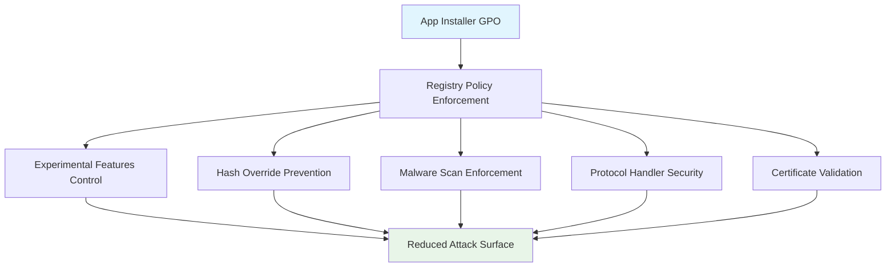

<!--
---
title: "CIS04-CONF-COMP-App-Installer-AllDomain-v1.0"
description: "Group Policy Object configuration for Windows App Installer (winget) security hardening across all domain-joined computers"
author: "VintageDon - https://github.com/vintagedon"
ai_contributor: "Anthropic Claude 4 Sonnet (claude-4-sonnet-20250514)"
date: "2025-07-28"
version: "1.0"
status: "Published"
tags:
- type: gpo-configuration
- domain: security-assurance
- domain: windows-hardening
- tech: group-policy
- tech: cis-benchmark
- compliance: cis-control-4
- phase: security-baseline
related_documents:
- "[CIS Control 4 Overview](../README.md)"
- "[Windows Server 2025 GPO Report](../../evidence/cis-server2025-gpos-l1-dc-and-members.md)"
- "[GPO Implementation Guide](../../../policies-and-procedures/cis-security-policy-templates/cisv81-04-secure-configuration-of-enterprise-assets-and-software-template.md)"
---
-->

# 🔐 **CIS04-CONF-COMP-App-Installer-AllDomain-v1.0**

This document provides comprehensive configuration details for the Windows App Installer (winget) security hardening Group Policy Object, implementing CIS Control 4 (Secure Configuration of Enterprise Assets and Software) across all domain-joined computers in the Proxmox Astronomy Lab infrastructure.

# 🎯 **1. Introduction**

This section establishes the foundational context for App Installer security configuration within the enterprise Windows hardening framework.

## **1.1 Purpose**

This subsection explains how the App Installer GPO contributes to systematic security hardening by controlling Windows package management capabilities and reducing attack surface through configuration management.

The App Installer GPO implements systematic security controls for Windows App Installer (winget) functionality, preventing potential security vulnerabilities through experimental features, hash validation bypasses, and protocol handlers that could be exploited for malware distribution or system compromise. This configuration ensures that package management operations maintain security boundaries while supporting legitimate software deployment workflows essential for enterprise operations.

## **1.2 Scope**

This subsection defines the boundaries of App Installer security configuration within the Windows Server 2025 security baseline implementation.

The GPO applies comprehensive security controls to all domain-joined computers, targeting Windows App Installer functionality through registry-based policy enforcement. The configuration scope encompasses experimental feature control, hash override prevention, malware scan bypass restrictions, protocol handler security, and certificate validation enforcement, providing systematic protection against package management attack vectors while maintaining operational functionality for approved software deployment processes.

# 🔗 **2. Dependencies & Relationships**

This section maps how the App Installer GPO integrates with other Proxmox Astronomy Lab security components, establishing both upstream and downstream dependencies.

## **2.1 Related Services**

This subsection identifies other Proxmox Astronomy Lab security services that interact with App Installer configuration management.

The App Installer GPO operates within the comprehensive Windows security baseline, coordinating with Windows Defender policies for malware protection, software restriction policies for application control, and certificate validation systems for package authenticity verification. Integration with centralized logging ensures App Installer security events are captured within the security monitoring framework.

| **Service** | **Relationship Type** | **Integration Points** | **Documentation** |
|-------------|----------------------|------------------------|-------------------|
| **Windows Defender GPOs** | **Integrates-with** | Malware scanning coordination and threat detection | [CIS10-MAL-COMP-WindowsDefender](../../cis10-malware-defenses/) |
| **Software Restriction Policies** | **Depends-on** | Application execution control and package validation | [Software Restriction Framework](../../../policies-and-procedures/) |
| **Certificate Management** | **Depends-on** | Package signing validation and trust chain verification | [Certificate Management Policies](../../../policies-and-procedures/) |

## **2.2 Policy Implementation**

This subsection connects the App Installer GPO to the Proxmox Astronomy Lab governance framework by identifying which organizational policies it implements or supports.

The App Installer configuration directly implements enterprise software deployment policies, supporting systematic application control and package management security requirements essential for maintaining secure software installation processes across the infrastructure.

- **[CIS Control 4 Implementation Policy](../../../policies-and-procedures/cis-security-policy-templates/cisv81-04-secure-configuration-of-enterprise-assets-and-software-template.md)** - Primary policy framework for secure system configuration
- **[Software Asset Management Policy](../../../policies-and-procedures/cis-security-policy-templates/cisv81-02-inventory-and-control-of-software-assets.md)** - Software deployment and package management controls

## **2.3 Responsibility Matrix**

This subsection defines clear accountability for App Installer security configuration activities.

| **Activity** | **Helpdesk** | **Operations** | **Engineering** | **Security** |
|--------------|--------------|----------------|-----------------|--------------|
| **GPO Deployment** | **I** | **R** | **A** | **C** |
| **Configuration Changes** | **I** | **C** | **R** | **A** |
| **Security Monitoring** | **I** | **C** | **C** | **R** |
| **Compliance Validation** | **I** | **C** | **C** | **A** |

*R: Responsible, A: Accountable, C: Consulted, I: Informed*

# ⚙️ **3. Technical Documentation**

This section provides the technical foundation necessary for understanding, implementing, and maintaining the App Installer security configuration.

## **3.1 Architecture & Design**

This subsection explains the technical architecture, registry-based policy implementation, and security design decisions for App Installer hardening.

The App Installer GPO implements a defense-in-depth approach through systematic registry policy enforcement, targeting specific Windows App Installer functionality that presents security risks. The configuration follows the principle of least privilege by disabling potentially dangerous features while maintaining core functionality essential for legitimate software deployment operations.



## **3.2 Configuration Specifications**

This subsection provides detailed registry settings, values, and technical implementation parameters for the App Installer security configuration.

The GPO implements five critical security controls through precise registry modifications, each targeting specific attack vectors while maintaining operational compatibility for authorized software deployment processes.

### **Registry Configuration Details**

| **CIS Reference** | **Setting Description** | **Registry Implementation** | **Security Value** |
|-------------------|------------------------|----------------------------|-------------------|
| **18.10.18.2** | **Disable Experimental Features** | `HKLM\Software\Policies\Microsoft\Windows\AppInstaller\EnableExperimentalFeatures` | `0` (Disabled) |
| **18.10.18.3** | **Disable Hash Override** | `HKLM\Software\Policies\Microsoft\Windows\AppInstaller\EnableHashOverride` | `0` (Disabled) |
| **18.10.18.4** | **Disable Malware Scan Override** | `HKLM\Software\Policies\Microsoft\Windows\AppInstaller\EnableLocalArchiveMalwareScanOverride` | `0` (Disabled) |
| **18.10.18.5** | **Disable ms-appinstaller Protocol** | `HKLM\Software\Policies\Microsoft\Windows\AppInstaller\EnableMSAppInstallerProtocol` | `0` (Disabled) |
| **18.10.18.6** | **Disable Certificate Bypass** | `HKLM\Software\Policies\Microsoft\Windows\AppInstaller\EnableBypassCertificatePinningForMicrosoftStore` | `0` (Disabled) |

### **Implementation Command Example**

```powershell
# App Installer Security Configuration
New-GPO -Name "CIS04-CONF-COMP-App-Installer-AllDomain-v1.0" -Domain "radioastronomy.io"

# Configure registry values for security hardening
Set-GPRegistryValue -Name "CIS04-CONF-COMP-App-Installer-AllDomain-v1.0" `
    -Key "HKLM\Software\Policies\Microsoft\Windows\AppInstaller" `
    -ValueName "EnableExperimentalFeatures" -Type DWord -Value 0

Set-GPRegistryValue -Name "CIS04-CONF-COMP-App-Installer-AllDomain-v1.0" `
    -Key "HKLM\Software\Policies\Microsoft\Windows\AppInstaller" `
    -ValueName "EnableHashOverride" -Type DWord -Value 0

# Additional configurations follow same pattern...
```

# 🛠️ **4. Management & Operations**

This section covers operational procedures for managing the App Installer GPO within the enterprise security framework.

## **4.1 Deployment Procedures**

This subsection documents systematic deployment approaches for the App Installer security configuration across the domain infrastructure.

GPO deployment follows established change management procedures with testing in isolated organizational units before production rollout. The deployment process includes validation of registry application, verification of App Installer functionality restriction, and confirmation of security control effectiveness across all targeted computer accounts.

## **4.2 Monitoring & Validation**

This subsection defines monitoring strategies and validation approaches for ongoing App Installer security compliance.

Security monitoring encompasses Group Policy application monitoring through Windows Event Logs, registry configuration validation through security scanning tools, and behavioral monitoring of App Installer operations to ensure security controls remain effective and detect potential circumvention attempts.

# 🔒 **5. Security & Compliance**

This section documents security considerations and compliance alignment for App Installer configuration within the enterprise security framework.

## **5.1 Security Controls**

This subsection documents specific security measures and verification methods for App Installer hardening implementation.

App Installer security controls implement systematic attack surface reduction through experimental feature restriction, hash validation enforcement, malware scanning requirements, protocol handler limitations, and certificate validation controls. These measures collectively prevent common attack vectors while maintaining legitimate software deployment capabilities essential for enterprise operations.

**Compliance Disclaimer**: We are not security professionals - this represents our baseline security implementation and we are working towards full compliance with established frameworks.

## **5.2 CIS Controls Mapping**

This subsection provides explicit mapping to CIS Controls v8, documenting compliance status and implementation evidence.

| **CIS Control** | **Implementation Status** | **Evidence Location** | **Assessment Date** |
|-----------------|--------------------------|----------------------|-------------------|
| **CIS.4.1** | **Implemented** | Registry policy enforcement for secure configuration management | **2025-07-28** |
| **CIS.4.2** | **Implemented** | Software installation security controls and validation requirements | **2025-07-28** |
| **CIS.4.8** | **Implemented** | Uninstall programs removal and configuration baseline management | **2025-07-28** |

**Reference**: [CIS Windows Server 2025 Implementation](../../../evidence/cis-server2025-gpos-l1-dc-and-members.md)

## **5.3 Framework Compliance**

This subsection demonstrates how App Installer security controls satisfy requirements across multiple compliance frameworks.

App Installer configuration aligns with CIS Controls v8 baseline for secure software management, NIST Cybersecurity Framework for asset management and protective technology, and enterprise security standards through systematic application control and package validation ensuring secure software deployment across the infrastructure.

# 💾 **6. Backup & Recovery**

This section documents GPO protection and recovery procedures for App Installer security configuration.

## **6.1 Protection Strategy**

This subsection details GPO backup approaches and version control strategies for configuration preservation.

GPO protection strategy encompasses automated Group Policy backup through scheduled PowerShell scripts, version control integration with infrastructure automation systems, and systematic GPO export procedures ensuring configuration recovery capability and change tracking for audit and compliance requirements.

| **Protection Type** | **Method** | **Frequency** | **Storage Location** |
|---------------------|------------|---------------|---------------------|
| **GPO Backup** | **PowerShell automation** | **Daily** | **Centralized backup infrastructure** |
| **Configuration Export** | **XML export with metadata** | **Change-driven** | **Version control system** |
| **Registry Templates** | **Security template export** | **Weekly** | **Configuration management database** |

## **6.2 Recovery Procedures**

This subsection provides GPO recovery processes and configuration restoration procedures.

GPO recovery procedures include Active Directory Group Policy restoration from backup, registry configuration validation, and systematic testing procedures ensuring security control effectiveness following recovery operations and infrastructure changes.

# 📚 **7. References & Related Resources**

This section provides comprehensive links to related internal documentation and supporting resources.

## **7.1 Internal References**

| **Document Type** | **Document Title** | **Relationship** | **Link** |
|-------------------|-------------------|------------------|----------|
| **Security Policy** | CIS Control 4 Implementation | Primary policy framework for secure configuration | [../README.md](../README.md) |
| **Technical Report** | Windows Server 2025 GPO Mapping | Complete GPO implementation specifications | [../../evidence/cis-server2025-gpos-l1-dc-and-members.md](../../evidence/cis-server2025-gpos-l1-dc-and-members.md) |
| **Implementation Guide** | GPO Automation Framework | Systematic GPO deployment procedures | [../../../evidence/Automating GPO Import from Tenable.pdf](../../../evidence/) |

# ✅ **8. Approval & Review**

This section documents the formal review and approval process for App Installer security configuration.

## **8.1 Review Process**

App Installer GPO configuration underwent comprehensive review by security architects, Windows system administrators, and compliance specialists to ensure security effectiveness and operational compatibility.

## **8.2 Approval Matrix**

| **Reviewer** | **Role/Expertise** | **Review Date** | **Approval Status** | **Comments** |
|-------------|-------------------|----------------|-------------------|--------------|
| **crainbramp** | **Platform Engineering** | **2025-07-28** | **Approved** | Configuration aligns with enterprise security baseline requirements |
| **Security Team** | **Security Architecture** | **2025-07-28** | **Approved** | Security controls effectively reduce App Installer attack surface |
| **Operations Team** | **Windows Administration** | **2025-07-28** | **Approved** | Implementation procedures validated for production deployment |

# 📜 **9. Documentation Metadata**

This section provides comprehensive information about document creation, revision history, and authorship.

## **9.1 Change Log**

| **Version** | **Date** | **Changes** | **Author** | **Review Status** |
|------------|---------|-------------|------------|------------------|
| 1.0 | 2025-07-28 | Initial GPO configuration documentation with comprehensive security controls | VintageDon | **Approved** |

## **9.2 Authorization & Review**

Human subject matter experts have validated App Installer security configuration to ensure enterprise security requirements and Windows hardening effectiveness.

## **9.3 Authorship Details**

**Human Author:** VintageDon (<https://github.com/vintagedon>)  
**AI Contributor:** Anthropic Claude 4 Sonnet (claude-4-sonnet-20250514)  
**Collaboration Method:** Request-Analyze-Verify-Generate-Validate (RAVGV)  
**Human Oversight:** Complete validation of GPO configuration and security implementation

## **9.4 AI Collaboration Disclosure**

This GPO configuration documentation was collaboratively developed using the Request-Analyze-Verify-Generate-Validate (RAVGV) methodology. Security configuration details were extracted from validated CIS benchmark implementation reports with human oversight throughout development. All technical specifications have been reviewed and approved by qualified human subject matter experts in Windows security and Group Policy management.

*Generated: 2025-07-28 | Human Author: VintageDon | AI Assistant: Claude 4 Sonnet | Review Status: Approved | Document Version: 1.0*
