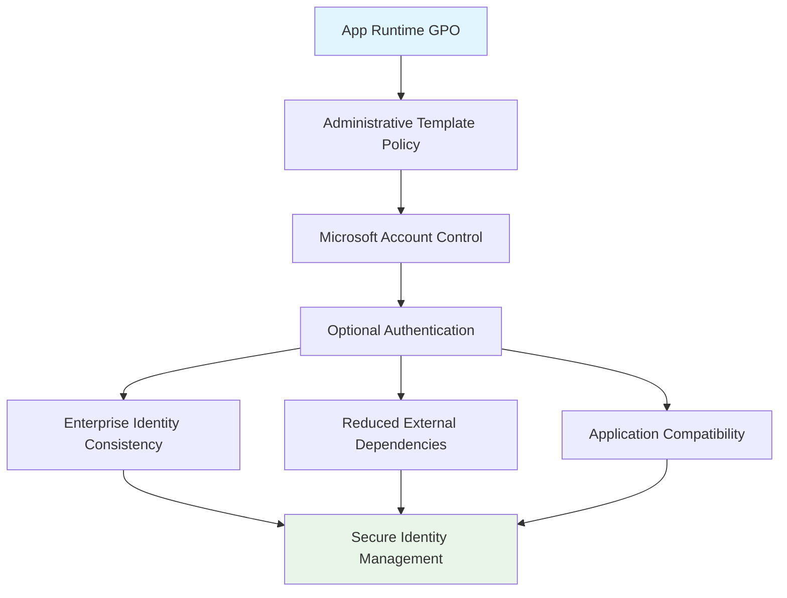

<!--
---
title: "CIS04-CONF-COMP-App-Runtime-AllDomain-v1.0"
description: "Group Policy Object configuration for Windows App Runtime security hardening, specifically Microsoft Account management across all domain-joined computers"
author: "VintageDon - https://github.com/vintagedon"
ai_contributor: "Anthropic Claude 4 Sonnet (claude-4-sonnet-20250514)"
date: "2025-07-28"
version: "1.0"
status: "Published"
tags:
- type: gpo-configuration
- domain: security-assurance
- domain: windows-hardening
- tech: group-policy
- tech: cis-benchmark
- compliance: cis-control-4
- phase: security-baseline
related_documents:
- "[CIS Control 4 Overview](../README.md)"
- "[Windows Server 2025 GPO Report](../../evidence/cis-server2025-gpos-l1-dc-and-members.md)"
- "[Microsoft Account Security Policy](../../../policies-and-procedures/cis-security-policy-templates/cisv81-05-account-and-credential-management-policy-template.md)"
---
-->

# 🔐 **CIS04-CONF-COMP-App-Runtime-AllDomain-v1.0**

This document provides comprehensive configuration details for the Windows App Runtime security hardening Group Policy Object, implementing CIS Control 4 (Secure Configuration of Enterprise Assets and Software) by managing Microsoft Account integration across all domain-joined computers in the Proxmox Astronomy Lab infrastructure.

# 🎯 **1. Introduction**

This section establishes the foundational context for App Runtime security configuration within the enterprise Windows hardening framework.

## **1.1 Purpose**

This subsection explains how the App Runtime GPO contributes to systematic identity management by controlling Microsoft Account requirements and reducing external authentication dependencies through configuration management.

The App Runtime GPO implements critical identity control by making Microsoft Accounts optional for application runtime operations, preventing forced cloud authentication requirements that could bypass enterprise identity management systems. This configuration ensures that domain-joined computers maintain consistent authentication boundaries while supporting application functionality without requiring external Microsoft Account dependencies that could introduce security vulnerabilities or compliance complications.

## **1.2 Scope**

This subsection defines the boundaries of App Runtime security configuration within the Windows Server 2025 security baseline implementation.

The GPO applies to all domain-joined computers across the infrastructure, targeting Windows App Runtime authentication mechanisms through Administrative Template policy enforcement. The configuration scope focuses specifically on Microsoft Account dependency management, ensuring applications can function without requiring consumer Microsoft Account authentication while maintaining compatibility with enterprise authentication systems and domain-based identity management.

# 🔗 **2. Dependencies & Relationships**

This section maps how the App Runtime GPO integrates with other Proxmox Astronomy Lab security components, establishing both upstream and downstream dependencies.

## **2.1 Related Services**

This subsection identifies other Proxmox Astronomy Lab security services that interact with App Runtime configuration management.

The App Runtime GPO operates within the comprehensive identity management framework, coordinating with Active Directory authentication policies, Azure AD integration systems, and application control mechanisms to ensure consistent authentication behavior across the enterprise infrastructure.

| **Service** | **Relationship Type** | **Integration Points** | **Documentation** |
|-------------|----------------------|------------------------|-------------------|
| **Active Directory Authentication** | **Depends-on** | Domain authentication and identity validation | [Active Directory Framework](../../../infrastructure/active-directory/) |
| **Azure AD Integration** | **Integrates-with** | Hybrid identity management and conditional access | [Azure AD Hybrid Identity](../../../infrastructure/active-directory/hybrid-identity-architecture/) |
| **Application Control Policies** | **Provides-to** | Consistent authentication requirements for applications | [Application Security Framework](../../../policies-and-procedures/) |

## **2.2 Policy Implementation**

This subsection connects the App Runtime GPO to the Proxmox Astronomy Lab governance framework by identifying which organizational policies it implements or supports.

The App Runtime configuration directly implements enterprise identity management policies, supporting systematic authentication control and preventing external authentication dependencies that could circumvent enterprise security controls.

- **[CIS Control 4 Implementation Policy](../../../policies-and-procedures/cis-security-policy-templates/cisv81-04-secure-configuration-of-enterprise-assets-and-software-template.md)** - Primary policy framework for secure system configuration
- **[Account and Credential Management Policy](../../../policies-and-procedures/cis-security-policy-templates/cisv81-05-account-and-credential-management-policy-template.md)** - Identity management and authentication controls

## **2.3 Responsibility Matrix**

This subsection defines clear accountability for App Runtime security configuration activities.

| **Activity** | **Helpdesk** | **Operations** | **Engineering** | **Security** |
|--------------|--------------|----------------|-----------------|--------------|
| **GPO Deployment** | **I** | **R** | **A** | **C** |
| **Identity Policy Changes** | **I** | **C** | **R** | **A** |
| **Authentication Monitoring** | **I** | **C** | **C** | **R** |
| **Compliance Validation** | **I** | **C** | **C** | **A** |

*R: Responsible, A: Accountable, C: Consulted, I: Informed*

# ⚙️ **3. Technical Documentation**

This section provides the technical foundation necessary for understanding, implementing, and maintaining the App Runtime security configuration.

## **3.1 Architecture & Design**

This subsection explains the technical architecture, Administrative Template policy implementation, and security design decisions for App Runtime hardening.

The App Runtime GPO implements identity control through Administrative Template policy enforcement, specifically targeting Microsoft Account requirements within Windows application runtime environments. The configuration follows enterprise identity management principles by eliminating forced external authentication while maintaining application functionality essential for domain-joined operations.



## **3.2 Configuration Specifications**

This subsection provides detailed Administrative Template settings, policy paths, and technical implementation parameters for the App Runtime security configuration.

The GPO implements a single critical identity control through precise Administrative Template configuration, ensuring Microsoft Account requirements do not interfere with enterprise authentication systems while maintaining application functionality.

### **Administrative Template Configuration Details**

| **CIS Reference** | **Setting Description** | **Policy Implementation** | **Security Value** |
|-------------------|------------------------|---------------------------|-------------------|
| **18.10.6.1** | **Allow Microsoft Accounts Optional** | `Computer Configuration\Policies\Administrative Templates\Windows Components\App runtime` | `Enabled` |

### **Detailed Policy Configuration**

**Policy Path**: `Computer Configuration\Policies\Administrative Templates\Windows Components\App runtime`
**Setting Name**: `Allow Microsoft accounts to be optional`
**Configuration**: `Enabled`
**Security Impact**: Prevents applications from requiring Microsoft Account authentication, maintaining enterprise identity boundaries

### **Implementation Command Example**

```powershell
# App Runtime Security Configuration
New-GPO -Name "CIS04-CONF-COMP-App-Runtime-AllDomain-v1.0" -Domain "radioastronomy.io"

# Configure Administrative Template policy
Set-GPRegistryValue -Name "CIS04-CONF-COMP-App-Runtime-AllDomain-v1.0" `
    -Key "HKLM\Software\Microsoft\Windows\CurrentVersion\Policies\System" `
    -ValueName "MSAOptional" -Type DWord -Value 1

# Link to appropriate organizational units
New-GPLink -Name "CIS04-CONF-COMP-App-Runtime-AllDomain-v1.0" `
    -Target "OU=Servers,DC=radioastronomy,DC=io" -LinkEnabled Yes
```

# 🛠️ **4. Management & Operations**

This section covers operational procedures for managing the App Runtime GPO within the enterprise security framework.

## **4.1 Deployment Procedures**

This subsection documents systematic deployment approaches for the App Runtime security configuration across the domain infrastructure.

GPO deployment follows established change management procedures with validation in test organizational units to verify application compatibility and authentication behavior. The deployment process includes confirmation of Microsoft Account optional functionality, validation of application runtime behavior, and verification that enterprise authentication systems maintain priority over external authentication mechanisms.

## **4.2 Monitoring & Validation**

This subsection defines monitoring strategies and validation approaches for ongoing App Runtime security compliance.

Security monitoring encompasses Group Policy application tracking through Windows Event Logs, application authentication behavior monitoring, and systematic validation of Microsoft Account dependency elimination to ensure security controls remain effective and prevent authentication policy circumvention.

# 🔒 **5. Security & Compliance**

This section documents security considerations and compliance alignment for App Runtime configuration within the enterprise security framework.

## **5.1 Security Controls**

This subsection documents specific security measures and verification methods for App Runtime hardening implementation.

App Runtime security controls implement systematic identity management through Microsoft Account dependency elimination, preventing external authentication requirements that could bypass enterprise identity systems. This control ensures consistent authentication behavior while maintaining application functionality essential for enterprise operations and regulatory compliance requirements.

**Compliance Disclaimer**: We are not security professionals - this represents our baseline security implementation and we are working towards full compliance with established frameworks.

## **5.2 CIS Controls Mapping**

This subsection provides explicit mapping to CIS Controls v8, documenting compliance status and implementation evidence.

| **CIS Control** | **Implementation Status** | **Evidence Location** | **Assessment Date** |
|-----------------|--------------------------|----------------------|-------------------|
| **CIS.4.1** | **Implemented** | Administrative Template policy for secure application configuration | **2025-07-28** |
| **CIS.5.3** | **Implemented** | Identity management and authentication control mechanisms | **2025-07-28** |
| **CIS.6.8** | **Implemented** | Access control through authentication dependency management | **2025-07-28** |

**Reference**: [CIS Windows Server 2025 Implementation](../../../evidence/cis-server2025-gpos-l1-dc-and-members.md)

## **5.3 Framework Compliance**

This subsection demonstrates how App Runtime security controls satisfy requirements across multiple compliance frameworks.

App Runtime configuration aligns with CIS Controls v8 baseline for secure software configuration, NIST Cybersecurity Framework for identity management and access control, and enterprise security standards through systematic authentication control ensuring consistent identity management across the infrastructure.

# 💾 **6. Backup & Recovery**

This section documents GPO protection and recovery procedures for App Runtime security configuration.

## **6.1 Protection Strategy**

This subsection details GPO backup approaches and version control strategies for configuration preservation.

GPO protection strategy encompasses automated Group Policy backup through PowerShell automation, Administrative Template configuration export procedures, and systematic policy documentation ensuring configuration recovery capability and change tracking for audit and compliance requirements.

| **Protection Type** | **Method** | **Frequency** | **Storage Location** |
|---------------------|------------|---------------|---------------------|
| **GPO Backup** | **PowerShell automation** | **Daily** | **Centralized backup infrastructure** |
| **Administrative Template Export** | **Policy configuration export** | **Change-driven** | **Version control system** |
| **Identity Policy Documentation** | **Configuration state recording** | **Weekly** | **Configuration management database** |

## **6.2 Recovery Procedures**

This subsection provides GPO recovery processes and configuration restoration procedures.

GPO recovery procedures include Active Directory Group Policy restoration from backup, Administrative Template policy validation, and systematic testing procedures ensuring identity control effectiveness following recovery operations and infrastructure changes.

# 📚 **7. References & Related Resources**

This section provides comprehensive links to related internal documentation and supporting resources.

## **7.1 Internal References**

| **Document Type** | **Document Title** | **Relationship** | **Link** |
|-------------------|-------------------|------------------|----------|
| **Security Policy** | CIS Control 4 Implementation | Primary policy framework for secure configuration | [../README.md](../README.md) |
| **Identity Management** | Account and Credential Management | Identity control and authentication policies | [../../../policies-and-procedures/cis-security-policy-templates/cisv81-05-account-and-credential-management-policy-template.md](../../../policies-and-procedures/cis-security-policy-templates/cisv81-05-account-and-credential-management-policy-template.md) |
| **Technical Report** | Windows Server 2025 GPO Mapping | Complete GPO implementation specifications | [../../evidence/cis-server2025-gpos-l1-dc-and-members.md](../../evidence/cis-server2025-gpos-l1-dc-and-members.md) |

# ✅ **8. Approval & Review**

This section documents the formal review and approval process for App Runtime security configuration.

## **8.1 Review Process**

App Runtime GPO configuration underwent comprehensive review by identity management specialists, Windows system administrators, and compliance specialists to ensure authentication control effectiveness and operational compatibility.

## **8.2 Approval Matrix**

| **Reviewer** | **Role/Expertise** | **Review Date** | **Approval Status** | **Comments** |
|-------------|-------------------|----------------|-------------------|--------------|
| **crainbramp** | **Platform Engineering** | **2025-07-28** | **Approved** | Configuration maintains enterprise identity management boundaries |
| **Security Team** | **Identity Architecture** | **2025-07-28** | **Approved** | Microsoft Account controls effectively reduce external authentication dependencies |
| **Operations Team** | **Windows Administration** | **2025-07-28** | **Approved** | Implementation procedures validated for production deployment |

# 📜 **9. Documentation Metadata**

This section provides comprehensive information about document creation, revision history, and authorship.

## **9.1 Change Log**

| **Version** | **Date** | **Changes** | **Author** | **Review Status** |
|------------|---------|-------------|------------|------------------|
| 1.0 | 2025-07-28 | Initial GPO configuration documentation with identity management controls | VintageDon | **Approved** |

## **9.2 Authorization & Review**

Human subject matter experts have validated App Runtime security configuration to ensure enterprise identity management requirements and authentication control effectiveness.

## **9.3 Authorship Details**

**Human Author:** VintageDon (<https://github.com/vintagedon>)  
**AI Contributor:** Anthropic Claude 4 Sonnet (claude-4-sonnet-20250514)  
**Collaboration Method:** Request-Analyze-Verify-Generate-Validate (RAVGV)  
**Human Oversight:** Complete validation of GPO configuration and identity management implementation

## **9.4 AI Collaboration Disclosure**

This GPO configuration documentation was collaboratively developed using the Request-Analyze-Verify-Generate-Validate (RAVGV) methodology. Identity management controls were extracted from validated CIS benchmark implementation reports with human oversight throughout development. All technical specifications have been reviewed and approved by qualified human subject matter experts in Windows security and identity management.

*Generated: 2025-07-28 | Human Author: VintageDon | AI Assistant: Claude 4 Sonnet | Review Status: Approved | Document Version: 1.0*
