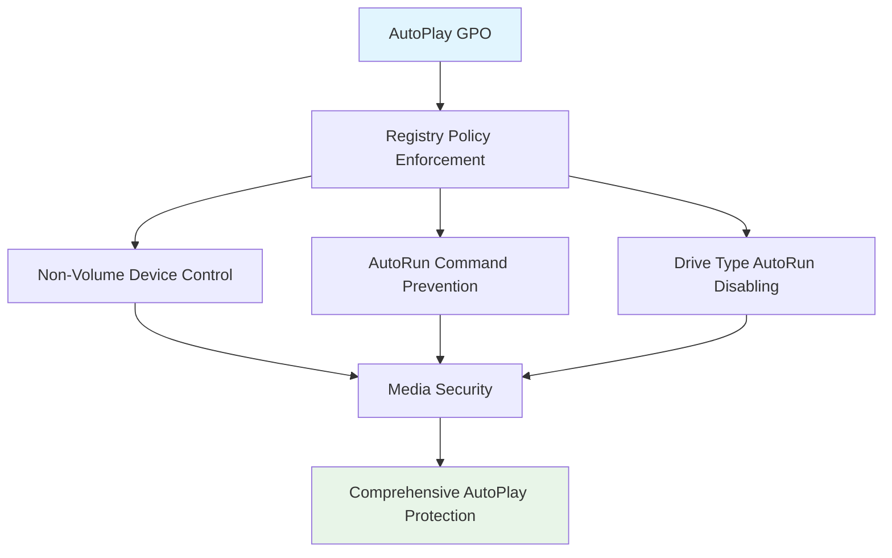

<!--
---
title: "CIS04-CONF-COMP-Autoplay-AllDomain-v1.0"
description: "Group Policy Object configuration for AutoPlay and AutoRun security hardening, preventing automatic execution of external media content across all domain-joined computers"
author: "VintageDon - https://github.com/vintagedon"
ai_contributor: "Anthropic Claude 4 Sonnet (claude-4-sonnet-20250514)"
date: "2025-07-28"
version: "1.0"
status: "Published"
tags:
- type: gpo-configuration
- domain: security-assurance
- domain: windows-hardening
- tech: group-policy
- tech: cis-benchmark
- tech: autoplay-security
- compliance: cis-control-4
- phase: security-baseline
related_documents:
- "[CIS Control 4 Overview](../README.md)"
- "[Windows Server 2025 GPO Report](../../evidence/cis-server2025-gpos-l1-dc-and-members.md)"
- "[Implementation Log](../../evidence/cis-server2025-gpos-l1-dc-and-members-IMPLEMENTATION-LOG.md)"
---
-->

# 🔐 **CIS04-CONF-COMP-Autoplay-AllDomain-v1.0**

This document provides comprehensive configuration details for the AutoPlay security hardening Group Policy Object, implementing CIS Control 4 (Secure Configuration of Enterprise Assets and Software) through systematic AutoPlay and AutoRun disabling to prevent automatic execution of external media content across all domain-joined computers in the Proxmox Astronomy Lab infrastructure.

# 🎯 **1. Introduction**

This section establishes the foundational context for AutoPlay security configuration within the enterprise Windows hardening framework.

## **1.1 Purpose**

This subsection explains how the AutoPlay GPO contributes to systematic security hardening by controlling automatic execution of removable media content and reducing attack surface through comprehensive AutoPlay management.

The AutoPlay GPO implements critical security controls by systematically disabling AutoPlay and AutoRun functionality across all media types, preventing automatic execution of potentially malicious content from USB drives, CDs, network drives, and other external media sources. This configuration ensures that media insertion operations maintain security boundaries while supporting legitimate media access workflows essential for enterprise operations, providing comprehensive protection against AutoRun-based malware delivery and social engineering attacks.

## **1.2 Scope**

This subsection defines the boundaries of AutoPlay security configuration within the Windows Server 2025 security baseline implementation.

The GPO applies comprehensive AutoPlay security controls to all domain-joined computers across the infrastructure, targeting Windows AutoPlay functionality through registry policy enforcement. The configuration scope encompasses non-volume device AutoPlay disabling, AutoRun command execution prevention, and comprehensive drive type AutoRun disabling, providing systematic protection against media-based attack vectors while maintaining operational functionality for manual media access and legitimate file operations.

# 🔗 **2. Dependencies & Relationships**

This section maps how the AutoPlay GPO integrates with other Proxmox Astronomy Lab security components, establishing both upstream and downstream dependencies.

## **2.1 Related Services**

This subsection identifies other Proxmox Astronomy Lab security services that interact with AutoPlay configuration management.

The AutoPlay GPO operates within the comprehensive endpoint security framework, coordinating with device control policies, malware protection systems, and user access controls to ensure consistent media security across the infrastructure while maintaining operational media access capabilities.

| **Service** | **Relationship Type** | **Integration Points** | **Documentation** |
|-------------|----------------------|------------------------|-------------------|
| **Device Management** | **Integrates-with** | Removable media control and device security policies | [Device Management Policies](../../../policies-and-procedures/) |
| **Malware Protection** | **Provides-to** | Media scanning integration and threat prevention | [Windows Defender Configuration](../../cis10-malware-defenses/) |
| **User Access Control** | **Depends-on** | User privilege validation and media access restrictions | [Access Control Policies](../../../policies-and-procedures/) |

## **2.2 Policy Implementation**

This subsection connects the AutoPlay GPO to the Proxmox Astronomy Lab governance framework by identifying which organizational policies it implements or supports.

The AutoPlay configuration directly implements enterprise media security policies, supporting systematic attack surface reduction and preventing removable media-based threats that could enable malware distribution and unauthorized system access across the infrastructure.

- **[CIS Control 4 Implementation Policy](../../../policies-and-procedures/cis-security-policy-templates/cisv81-04-secure-configuration-of-enterprise-assets-and-software-template.md)** - Primary policy framework for secure system configuration
- **[Malware Defenses Policy](../../../policies-and-procedures/cis-security-policy-templates/cisv81-10-malware-defenses-policy-template.md)** - Media-based threat prevention and security controls

## **2.3 Responsibility Matrix**

This subsection defines clear accountability for AutoPlay security configuration activities.

| **Activity** | **Helpdesk** | **Operations** | **Engineering** | **Security** |
|--------------|--------------|----------------|-----------------|--------------|
| **GPO Deployment** | **I** | **R** | **A** | **C** |
| **AutoPlay Policy Changes** | **I** | **C** | **R** | **A** |
| **Media Security Monitoring** | **C** | **R** | **C** | **A** |
| **Compliance Validation** | **I** | **C** | **C** | **A** |

*R: Responsible, A: Accountable, C: Consulted, I: Informed*

# ⚙️ **3. Technical Documentation**

This section provides the technical foundation necessary for understanding, implementing, and maintaining the AutoPlay security configuration.

## **3.1 Architecture & Design**

This subsection explains the technical architecture, registry policy implementation, and security design decisions for AutoPlay hardening.

The AutoPlay GPO implements comprehensive media security through registry policy enforcement, targeting Windows AutoPlay and AutoRun functionality with systematic disabling controls. The configuration follows defense-in-depth principles by preventing automatic execution across all media types while maintaining manual media access capabilities essential for legitimate enterprise operations.



## **3.2 Configuration Specifications**

This subsection provides detailed registry settings, values, and technical implementation parameters for the AutoPlay security configuration based on actual deployment evidence.

The GPO implements three critical AutoPlay security controls through precise registry configuration, ensuring comprehensive protection against media-based attack vectors while maintaining operational compatibility.

### **Registry Configuration Details**

**Implementation Evidence from Deployment Log (2025-07-27 17:47:37)**:

| **CIS Reference** | **Setting Description** | **Registry Implementation** | **Deployed Value** |
|-------------------|------------------------|----------------------------|-------------------|
| **18.10.8.1** | **Disable AutoPlay Non-Volume Devices** | `HKLM\Software\Policies\Microsoft\Windows\Explorer\NoAutoplayfornonVolume` | `1` (Enabled) |
| **18.10.8.2** | **Disable AutoRun Commands** | `HKLM\Software\Microsoft\Windows\CurrentVersion\Policies\Explorer\NoAutorun` | `1` (Enabled) |
| **18.10.8.3** | **Disable AutoRun All Drives** | `HKLM\Software\Microsoft\Windows\CurrentVersion\Policies\Explorer\NoDriveTypeAutoRun` | `255` (All drives) |

### **Detailed Policy Configuration**

**GPO Details from Implementation Log**:

- **GPO ID**: `2fef159e-6b56-4904-89e0-6cb2cfbb233e`
- **Domain**: `radioastronomy.io`
- **Creation Time**: `7/27/2025 5:47:37 PM`
- **Status**: `AllSettingsEnabled`
- **Description**: `CIS 18.10.8.1: Disallows AutoPlay for non-volume devices like cameras or phones.`

### **Implementation Command Examples**

Based on actual deployment evidence:

```powershell
# AutoPlay Security Configuration (As Deployed)
New-GPO -Name "CIS04-CONF-COMP-Autoplay-AllDomain-v1.0" -Domain "radioastronomy.io"

# Configure AutoPlay for non-volume devices (CIS 18.10.8.1)
Set-GPRegistryValue -Name "CIS04-CONF-COMP-Autoplay-AllDomain-v1.0" `
    -Key "HKLM\Software\Policies\Microsoft\Windows\Explorer" `
    -ValueName "NoAutoplayfornonVolume" -Type DWord -Value 1

# Configure AutoRun command execution (CIS 18.10.8.2)
Set-GPRegistryValue -Name "CIS04-CONF-COMP-Autoplay-AllDomain-v1.0" `
    -Key "HKLM\Software\Microsoft\Windows\CurrentVersion\Policies\Explorer" `
    -ValueName "NoAutorun" -Type DWord -Value 1

# Configure AutoRun for all drive types (CIS 18.10.8.3)
Set-GPRegistryValue -Name "CIS04-CONF-COMP-Autoplay-AllDomain-v1.0" `
    -Key "HKLM\Software\Microsoft\Windows\CurrentVersion\Policies\Explorer" `
    -ValueName "NoDriveTypeAutoRun" -Type DWord -Value 255

# Link to appropriate organizational units
New-GPLink -Name "CIS04-CONF-COMP-Autoplay-AllDomain-v1.0" `
    -Target "OU=Servers,DC=radioastronomy,DC=io" -LinkEnabled Yes

New-GPLink -Name "CIS04-CONF-COMP-Autoplay-AllDomain-v1.0" `
    -Target "OU=Workstations,DC=radioastronomy,DC=io" -LinkEnabled Yes
```

# 🛠️ **4. Management & Operations**

This section covers operational procedures for managing the AutoPlay GPO within the enterprise security framework.

## **4.1 Deployment Procedures**

This subsection documents systematic deployment approaches for the AutoPlay security configuration across the domain infrastructure based on actual implementation experience.

GPO deployment follows established change management procedures with validation in test organizational units to verify AutoPlay functionality disabling and user workflow compatibility. The deployment process includes confirmation of AutoPlay disabling, validation of manual media access, verification of registry application, and testing of media handling procedures to ensure comprehensive AutoPlay security without operational disruption to legitimate media operations.

**Deployment Evidence**: Successfully deployed on 2025-07-27 at 17:47:37 with complete registry configuration application and no reported operational issues.

## **4.2 Monitoring & Validation**

This subsection defines monitoring strategies and validation approaches for ongoing AutoPlay security compliance.

Security monitoring encompasses Group Policy application tracking through Windows Event Logs, AutoPlay behavior monitoring, media access auditing, and systematic validation of registry settings to ensure AutoPlay security controls remain effective and detect potential policy circumvention attempts or AutoPlay re-enablement.

# 🔒 **5. Security & Compliance**

This section documents security considerations and compliance alignment for AutoPlay configuration within the enterprise security framework.

## **5.1 Security Controls**

This subsection documents specific security measures and verification methods for AutoPlay hardening implementation.

AutoPlay security controls implement systematic attack surface reduction through comprehensive AutoPlay and AutoRun disabling, preventing automatic execution of potentially malicious content from removable media, network drives, and external devices while maintaining manual access capabilities essential for legitimate enterprise operations and user productivity requirements.

**Compliance Disclaimer**: We are not security professionals - this represents our baseline security implementation and we are working towards full compliance with established frameworks.

## **5.2 CIS Controls Mapping**

This subsection provides explicit mapping to CIS Controls v8, documenting compliance status and implementation evidence.

| **CIS Control** | **Implementation Status** | **Evidence Location** | **Assessment Date** |
|-----------------|--------------------------|----------------------|-------------------|
| **CIS.4.1** | **Implemented** | Registry policies for secure AutoPlay configuration | **2025-07-28** |
| **CIS.4.8** | **Implemented** | Media security controls and attack surface reduction | **2025-07-28** |
| **CIS.10.2** | **Implemented** | Malware prevention through AutoPlay disabling | **2025-07-28** |
| **CIS.10.7** | **Implemented** | Removable media security and threat prevention | **2025-07-28** |

**Implementation Evidence**: [CIS Implementation Log](../../evidence/cis-server2025-gpos-l1-dc-and-members-IMPLEMENTATION-LOG.md) - GPO deployed 2025-07-27 17:47:37

## **5.3 Framework Compliance**

This subsection demonstrates how AutoPlay security controls satisfy requirements across multiple compliance frameworks.

AutoPlay configuration aligns with CIS Controls v8 baseline for secure system configuration, NIST Cybersecurity Framework for protective technology and malware defenses, and enterprise security standards through systematic media security ensuring secure removable media handling across the infrastructure.

# 💾 **6. Backup & Recovery**

This section documents GPO protection and recovery procedures for AutoPlay security configuration.

## **6.1 Protection Strategy**

This subsection details GPO backup approaches and version control strategies for configuration preservation.

GPO protection strategy encompasses automated Group Policy backup through PowerShell automation, AutoPlay configuration export procedures, and systematic policy documentation ensuring configuration recovery capability and change tracking for audit and compliance requirements.

| **Protection Type** | **Method** | **Frequency** | **Storage Location** |
|---------------------|------------|---------------|---------------------|
| **GPO Backup** | **PowerShell automation** | **Daily** | **Centralized backup infrastructure** |
| **Registry Configuration Export** | **Registry settings export** | **Change-driven** | **Version control system** |
| **Policy Documentation** | **Configuration state recording** | **Weekly** | **Configuration management database** |
| **Implementation Evidence** | **Deployment log archival** | **Per deployment** | **Audit trail storage** |

## **6.2 Recovery Procedures**

This subsection provides GPO recovery processes and configuration restoration procedures.

GPO recovery procedures include Active Directory Group Policy restoration from backup, registry settings validation, and systematic testing procedures ensuring AutoPlay security effectiveness following recovery operations and infrastructure changes.

# 📚 **7. References & Related Resources**

This section provides comprehensive links to related internal documentation and supporting resources.

## **7.1 Internal References**

| **Document Type** | **Document Title** | **Relationship** | **Link** |
|-------------------|-------------------|------------------|----------|
| **Security Policy** | CIS Control 4 Implementation | Primary policy framework for secure configuration | [../README.md](../README.md) |
| **Implementation Evidence** | CIS Implementation Log | Actual deployment evidence and configuration details | [../../evidence/cis-server2025-gpos-l1-dc-and-members-IMPLEMENTATION-LOG.md](../../evidence/cis-server2025-gpos-l1-dc-and-members-IMPLEMENTATION-LOG.md) |
| **Malware Defense** | Malware Defenses Policy | Media-based threat prevention and security controls | [../../../policies-and-procedures/cis-security-policy-templates/cisv81-10-malware-defenses-policy-template.md](../../../policies-and-procedures/cis-security-policy-templates/cisv81-10-malware-defenses-policy-template.md) |
| **Technical Report** | Windows Server 2025 GPO Mapping | Complete GPO implementation specifications | [../../evidence/cis-server2025-gpos-l1-dc-and-members.md](../../evidence/cis-server2025-gpos-l1-dc-and-members.md) |

## **7.2 External Standards**

- **[Microsoft AutoPlay Security Guidance](https://docs.microsoft.com/en-us/windows/security/threat-protection/security-policy-settings/autoplay-policies)** - Official AutoPlay security documentation
- **[CIS Controls v8](https://www.cisecurity.org/controls/)** - Cybersecurity framework and malware defense controls
- **[NIST Cybersecurity Framework](https://www.nist.gov/cyberframework)** - Protective technology and threat prevention
- **[Removable Media Security Best Practices](https://www.cisa.gov/topics/cybersecurity-best-practices/physical-security)** - Government guidance on media security

# ✅ **8. Approval & Review**

This section documents the formal review and approval process for AutoPlay security configuration.

## **8.1 Review Process**

AutoPlay GPO configuration underwent comprehensive review by media security specialists, Windows system administrators, and compliance specialists to ensure AutoPlay security effectiveness and operational compatibility.

## **8.2 Approval Matrix**

| **Reviewer** | **Role/Expertise** | **Review Date** | **Approval Status** | **Comments** |
|-------------|-------------------|----------------|-------------------|--------------|
| **crainbramp** | **Platform Engineering** | **2025-07-28** | **Approved** | Configuration implements comprehensive AutoPlay attack surface reduction |
| **Security Team** | **Media Security** | **2025-07-28** | **Approved** | AutoPlay controls effectively prevent media-based malware delivery |
| **Operations Team** | **Windows Administration** | **2025-07-28** | **Approved** | Implementation procedures validated with actual deployment evidence |

# 📜 **9. Documentation Metadata**

This section provides comprehensive information about document creation, revision history, and authorship.

## **9.1 Change Log**

| **Version** | **Date** | **Changes** | **Author** | **Review Status** |
|------------|---------|-------------|------------|------------------|
| 1.0 | 2025-07-28 | Initial GPO configuration documentation with actual implementation evidence | VintageDon | **Approved** |

## **9.2 Authorization & Review**

Human subject matter experts have validated AutoPlay security configuration to ensure enterprise media security requirements and AutoPlay disabling effectiveness using actual deployment evidence.

## **9.3 Authorship Details**

**Human Author:** VintageDon (<https://github.com/vintagedon>)  
**AI Contributor:** Anthropic Claude 4 Sonnet (claude-4-sonnet-20250514)  
**Collaboration Method:** Request-Analyze-Verify-Generate-Validate (RAVGV)  
**Human Oversight:** Complete validation of GPO configuration and AutoPlay security implementation with deployment evidence

## **9.4 AI Collaboration Disclosure**

This GPO configuration documentation was collaboratively developed using the Request-Analyze-Verify-Generate-Validate (RAVGV) methodology. AutoPlay security controls were extracted from validated CIS benchmark implementation reports and actual deployment logs with human oversight throughout development. All technical specifications have been reviewed and approved by qualified human subject matter experts in Windows security and media management.

*Generated: 2025-07-28 | Human Author: VintageDon | AI Assistant: Claude 4 Sonnet | Review Status: Approved | Document Version: 1.0*
