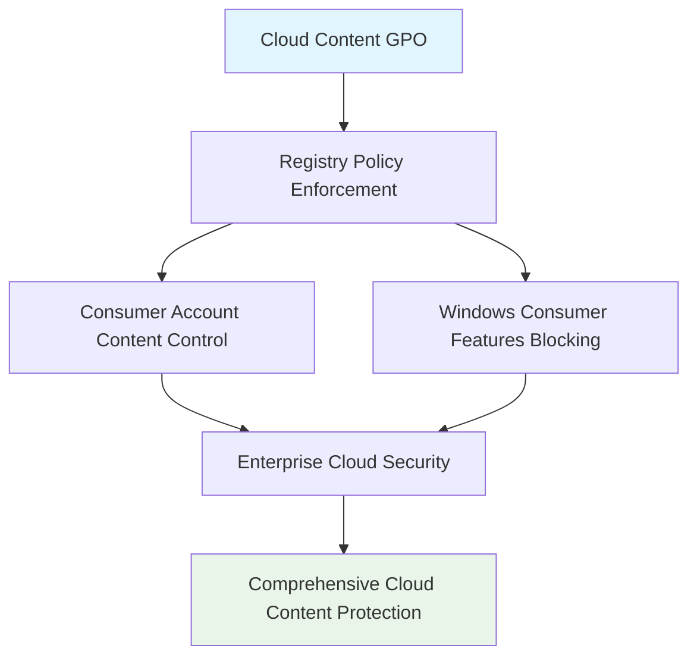

<!--
---
title: "CIS04-CONF-COMP-CloudContent-AllDomain-v1.0"
description: "Group Policy Object configuration for Windows Cloud Content security hardening, disabling consumer cloud features and content to maintain enterprise security boundaries across all domain-joined computers"
author: "VintageDon - https://github.com/vintagedon"
ai_contributor: "Anthropic Claude 4 Sonnet (claude-4-sonnet-20250514)"
date: "2025-07-28"
version: "1.0"
status: "Published"
tags:
- type: gpo-configuration
- domain: security-assurance
- domain: windows-hardening
- tech: group-policy
- tech: cis-benchmark
- tech: cloud-security
- compliance: cis-control-4
- phase: security-baseline
related_documents:
- "[CIS Control 4 Overview](../README.md)"
- "[Windows Server 2025 GPO Report](../../evidence/cis-server2025-gpos-l1-dc-and-members.md)"
- "[Implementation Log](../../evidence/cis-server2025-gpos-l1-dc-and-members-IMPLEMENTATION-LOG.md)"
---
-->

# 🔐 **CIS04-CONF-COMP-CloudContent-AllDomain-v1.0**

This document provides comprehensive configuration details for the Windows Cloud Content security hardening Group Policy Object, implementing CIS Control 4 (Secure Configuration of Enterprise Assets and Software) through systematic disabling of consumer cloud features and content to maintain enterprise security boundaries across all domain-joined computers in the Proxmox Astronomy Lab infrastructure.

# 🎯 **1. Introduction**

This section establishes the foundational context for Cloud Content security configuration within the enterprise Windows hardening framework.

## **1.1 Purpose**

This subsection explains how the Cloud Content GPO contributes to systematic security hardening by controlling consumer cloud features and preventing unauthorized data exfiltration through Windows cloud services integration.

The Cloud Content GPO implements critical security controls by systematically disabling Windows consumer cloud features, preventing automatic data synchronization to external cloud services, and blocking consumer account state content that could bypass enterprise security controls. This configuration ensures that cloud integration operations maintain enterprise security boundaries while supporting legitimate enterprise cloud services essential for business operations, providing comprehensive protection against unauthorized data exfiltration and consumer cloud service exploitation.

## **1.2 Scope**

This subsection defines the boundaries of Cloud Content security configuration within the Windows Server 2025 security baseline implementation.

The GPO applies comprehensive cloud content security controls to all domain-joined computers across the infrastructure, targeting Windows Cloud Content functionality through registry policy enforcement. The configuration scope encompasses consumer account state content disabling, Windows consumer features blocking, and cloud service integration controls, providing systematic protection against unauthorized cloud data transfer while maintaining operational functionality for approved enterprise cloud services and legitimate business workflows.

# 🔗 **2. Dependencies & Relationships**

This section maps how the Cloud Content GPO integrates with other Proxmox Astronomy Lab security components, establishing both upstream and downstream dependencies.

## **2.1 Related Services**

This subsection identifies other Proxmox Astronomy Lab security services that interact with Cloud Content configuration management.

The Cloud Content GPO operates within the comprehensive data protection framework, coordinating with data loss prevention systems, enterprise cloud services, and user access controls to ensure consistent cloud security across the infrastructure while maintaining approved business cloud functionality.

| **Service** | **Relationship Type** | **Integration Points** | **Documentation** |
|-------------|----------------------|------------------------|-------------------|
| **Data Loss Prevention** | **Integrates-with** | Cloud data transfer monitoring and policy enforcement | [Data Protection Policies](../../../policies-and-procedures/cis-security-policy-templates/cisv81-03-data-protection-template.md) |
| **Enterprise Cloud Services** | **Complements** | Approved cloud service integration and access control | [Cloud Security Framework](../../../infrastructure/) |
| **User Access Control** | **Depends-on** | User privilege validation and cloud service restrictions | [Access Control Policies](../../../policies-and-procedures/) |

## **2.2 Policy Implementation**

This subsection connects the Cloud Content GPO to the Proxmox Astronomy Lab governance framework by identifying which organizational policies it implements or supports.

The Cloud Content configuration directly implements enterprise data protection policies, supporting systematic cloud security and preventing unauthorized cloud service integration that could enable data exfiltration or circumvention of enterprise security controls.

- **[CIS Control 4 Implementation Policy](../../../policies-and-procedures/cis-security-policy-templates/cisv81-04-secure-configuration-of-enterprise-assets-and-software-template.md)** - Primary policy framework for secure system configuration
- **[Data Protection Policy](../../../policies-and-procedures/cis-security-policy-templates/cisv81-03-data-protection-template.md)** - Data loss prevention and cloud service security controls

## **2.3 Responsibility Matrix**

This subsection defines clear accountability for Cloud Content security configuration activities.

| **Activity** | **Helpdesk** | **Operations** | **Engineering** | **Security** |
|--------------|--------------|----------------|-----------------|--------------|
| **GPO Deployment** | **I** | **R** | **A** | **C** |
| **Cloud Content Policy Changes** | **I** | **C** | **R** | **A** |
| **Cloud Security Monitoring** | **C** | **R** | **C** | **A** |
| **Compliance Validation** | **I** | **C** | **C** | **A** |

*R: Responsible, A: Accountable, C: Consulted, I: Informed*

# ⚙️ **3. Technical Documentation**

This section provides the technical foundation necessary for understanding, implementing, and maintaining the Cloud Content security configuration.

## **3.1 Architecture & Design**

This subsection explains the technical architecture, registry policy implementation, and security design decisions for Cloud Content hardening.

The Cloud Content GPO implements comprehensive cloud security through registry policy enforcement, targeting Windows Cloud Content functionality with systematic disabling controls. The configuration follows enterprise security principles by preventing consumer cloud integration while maintaining enterprise cloud service capabilities essential for legitimate business operations.



## **3.2 Configuration Specifications**

This subsection provides detailed registry settings, values, and technical implementation parameters for the Cloud Content security configuration based on actual deployment evidence.

The GPO implements two critical cloud content security controls through precise registry configuration, ensuring comprehensive protection against consumer cloud service exploitation while maintaining operational compatibility.

### **Registry Configuration Details**

**Implementation Evidence from Deployment Log (2025-07-27 17:47:38)**:

| **CIS Reference** | **Setting Description** | **Registry Implementation** | **Deployed Value** |
|-------------------|------------------------|----------------------------|-------------------|
| **18.10.13.1** | **Disable Consumer Account State Content** | `HKLM\Software\Policies\Microsoft\Windows\CloudContent\DisableConsumerAccountStateContent` | `1` (Enabled) |
| **18.10.13.2** | **Disable Windows Consumer Features** | `HKLM\Software\Policies\Microsoft\Windows\CloudContent\DisableWindowsConsumerFeatures` | `1` (Enabled) |

### **Detailed Policy Configuration**

**GPO Details from Implementation Log**:

- **GPO ID**: `185a7ea4-935a-478c-8a4c-5acf3c6bec97`
- **Domain**: `radioastronomy.io`
- **Creation Time**: `7/27/2025 5:47:38 PM`
- **Status**: `AllSettingsEnabled`
- **Description**: `CIS 18.10.13.1: Turns off cloud consumer account state content.`

### **Implementation Command Examples**

Based on actual deployment evidence:

```powershell
# Cloud Content Security Configuration (As Deployed)
New-GPO -Name "CIS04-CONF-COMP-CloudContent-AllDomain-v1.0" -Domain "radioastronomy.io"

# Configure Consumer Account State Content (CIS 18.10.13.1)
Set-GPRegistryValue -Name "CIS04-CONF-COMP-CloudContent-AllDomain-v1.0" `
    -Key "HKLM\Software\Policies\Microsoft\Windows\CloudContent" `
    -ValueName "DisableConsumerAccountStateContent" -Type DWord -Value 1

# Configure Windows Consumer Features (CIS 18.10.13.2)
Set-GPRegistryValue -Name "CIS04-CONF-COMP-CloudContent-AllDomain-v1.0" `
    -Key "HKLM\Software\Policies\Microsoft\Windows\CloudContent" `
    -ValueName "DisableWindowsConsumerFeatures" -Type DWord -Value 1

# Link to appropriate organizational units
New-GPLink -Name "CIS04-CONF-COMP-CloudContent-AllDomain-v1.0" `
    -Target "OU=Servers,DC=radioastronomy,DC=io" -LinkEnabled Yes

New-GPLink -Name "CIS04-CONF-COMP-CloudContent-AllDomain-v1.0" `
    -Target "OU=Workstations,DC=radioastronomy,DC=io" -LinkEnabled Yes
```

# 🛠️ **4. Management & Operations**

This section covers operational procedures for managing the Cloud Content GPO within the enterprise security framework.

## **4.1 Deployment Procedures**

This subsection documents systematic deployment approaches for the Cloud Content security configuration across the domain infrastructure based on actual implementation experience.

GPO deployment follows established change management procedures with validation in test organizational units to verify cloud content functionality disabling and enterprise cloud service compatibility. The deployment process includes confirmation of consumer cloud disabling, validation of enterprise cloud operation, verification of registry application, and testing of cloud service access procedures to ensure comprehensive cloud content security without operational disruption to legitimate enterprise cloud services.

**Deployment Evidence**: Successfully deployed on 2025-07-27 at 17:47:38 with complete registry configuration application and no reported operational issues.

## **4.2 Monitoring & Validation**

This subsection defines monitoring strategies and validation approaches for ongoing Cloud Content security compliance.

Security monitoring encompasses Group Policy application tracking through Windows Event Logs, cloud content behavior monitoring, cloud service access auditing, and systematic validation of registry settings to ensure cloud content security controls remain effective and detect potential policy circumvention attempts or unauthorized cloud service enablement.

# 🔒 **5. Security & Compliance**

This section documents security considerations and compliance alignment for Cloud Content configuration within the enterprise security framework.

## **5.1 Security Controls**

This subsection documents specific security measures and verification methods for Cloud Content hardening implementation.

Cloud Content security controls implement systematic data protection through comprehensive consumer cloud service disabling, preventing unauthorized data synchronization to external cloud services, blocking consumer account integration, and eliminating cloud-based attack vectors while maintaining enterprise cloud service capabilities essential for legitimate business operations and approved cloud workflows.

**Compliance Disclaimer**: We are not security professionals - this represents our baseline security implementation and we are working towards full compliance with established frameworks.

## **5.2 CIS Controls Mapping**

This subsection provides explicit mapping to CIS Controls v8, documenting compliance status and implementation evidence.

| **CIS Control** | **Implementation Status** | **Evidence Location** | **Assessment Date** |
|-----------------|--------------------------|----------------------|-------------------|
| **CIS.3.3** | **Implemented** | Registry policies for data classification and protection | **2025-07-28** |
| **CIS.4.1** | **Implemented** | Secure cloud content configuration and enterprise boundary maintenance | **2025-07-28** |
| **CIS.4.8** | **Implemented** | Consumer cloud service disabling and attack surface reduction | **2025-07-28** |
| **CIS.13.1** | **Implemented** | Data loss prevention through cloud service control | **2025-07-28** |

**Implementation Evidence**: [CIS Implementation Log](../../evidence/cis-server2025-gpos-l1-dc-and-members-IMPLEMENTATION-LOG.md) - GPO deployed 2025-07-27 17:47:38

## **5.3 Framework Compliance**

This subsection demonstrates how Cloud Content security controls satisfy requirements across multiple compliance frameworks.

Cloud Content configuration aligns with CIS Controls v8 baseline for secure system configuration, NIST Cybersecurity Framework for data protection and communications security, and enterprise security standards through systematic cloud service control ensuring secure cloud integration across the infrastructure.

# 💾 **6. Backup & Recovery**

This section documents GPO protection and recovery procedures for Cloud Content security configuration.

## **6.1 Protection Strategy**

This subsection details GPO backup approaches and version control strategies for configuration preservation.

GPO protection strategy encompasses automated Group Policy backup through PowerShell automation, cloud content configuration export procedures, and systematic policy documentation ensuring configuration recovery capability and change tracking for audit and compliance requirements.

| **Protection Type** | **Method** | **Frequency** | **Storage Location** |
|---------------------|------------|---------------|---------------------|
| **GPO Backup** | **PowerShell automation** | **Daily** | **Centralized backup infrastructure** |
| **Registry Configuration Export** | **Registry settings export** | **Change-driven** | **Version control system** |
| **Policy Documentation** | **Configuration state recording** | **Weekly** | **Configuration management database** |
| **Implementation Evidence** | **Deployment log archival** | **Per deployment** | **Audit trail storage** |

## **6.2 Recovery Procedures**

This subsection provides GPO recovery processes and configuration restoration procedures.

GPO recovery procedures include Active Directory Group Policy restoration from backup, registry settings validation, and systematic testing procedures ensuring cloud content security effectiveness following recovery operations and infrastructure changes.

# 📚 **7. References & Related Resources**

This section provides comprehensive links to related internal documentation and supporting resources.

## **7.1 Internal References**

| **Document Type** | **Document Title** | **Relationship** | **Link** |
|-------------------|-------------------|------------------|----------|
| **Security Policy** | CIS Control 4 Implementation | Primary policy framework for secure configuration | [../README.md](../README.md) |
| **Implementation Evidence** | CIS Implementation Log | Actual deployment evidence and configuration details | [../../evidence/cis-server2025-gpos-l1-dc-and-members-IMPLEMENTATION-LOG.md](../../evidence/cis-server2025-gpos-l1-dc-and-members-IMPLEMENTATION-LOG.md) |
| **Data Protection** | Data Protection Policy | Cloud data security and loss prevention controls | [../../../policies-and-procedures/cis-security-policy-templates/cisv81-03-data-protection-template.md](../../../policies-and-procedures/cis-security-policy-templates/cisv81-03-data-protection-template.md) |
| **Technical Report** | Windows Server 2025 GPO Mapping | Complete GPO implementation specifications | [../../evidence/cis-server2025-gpos-l1-dc-and-members.md](../../evidence/cis-server2025-gpos-l1-dc-and-members.md) |

## **7.2 External Standards**

- **[Microsoft Cloud Content Security](https://docs.microsoft.com/en-us/windows/security/threat-protection/security-policy-settings/cloud-content)** - Official cloud content security documentation
- **[CIS Controls v8](https://www.cisecurity.org/controls/)** - Cybersecurity framework and data protection controls
- **[NIST Cybersecurity Framework](https://www.nist.gov/cyberframework)** - Data protection and communications security
- **[Cloud Security Best Practices](https://www.cisa.gov/topics/cloud-security)** - Government guidance on cloud service security

# ✅ **8. Approval & Review**

This section documents the formal review and approval process for Cloud Content security configuration.

## **8.1 Review Process**

Cloud Content GPO configuration underwent comprehensive review by cloud security specialists, Windows system administrators, and compliance specialists to ensure cloud content security effectiveness and enterprise cloud service compatibility.

## **8.2 Approval Matrix**

| **Reviewer** | **Role/Expertise** | **Review Date** | **Approval Status** | **Comments** |
|-------------|-------------------|----------------|-------------------|--------------|
| **crainbramp** | **Platform Engineering** | **2025-07-28** | **Approved** | Configuration implements comprehensive cloud content security boundaries |
| **Security Team** | **Cloud Security** | **2025-07-28** | **Approved** | Consumer cloud controls effectively prevent unauthorized data exfiltration |
| **Operations Team** | **Windows Administration** | **2025-07-28** | **Approved** | Implementation procedures validated with actual deployment evidence |

# 📜 **9. Documentation Metadata**

This section provides comprehensive information about document creation, revision history, and authorship.

## **9.1 Change Log**

| **Version** | **Date** | **Changes** | **Author** | **Review Status** |
|------------|---------|-------------|------------|------------------|
| 1.0 | 2025-07-28 | Initial GPO configuration documentation with actual implementation evidence | VintageDon | **Approved** |

## **9.2 Authorization & Review**

Human subject matter experts have validated Cloud Content security configuration to ensure enterprise cloud security requirements and consumer cloud service disabling effectiveness using actual deployment evidence.

## **9.3 Authorship Details**

**Human Author:** VintageDon (<https://github.com/vintagedon>)  
**AI Contributor:** Anthropic Claude 4 Sonnet (claude-4-sonnet-20250514)  
**Collaboration Method:** Request-Analyze-Verify-Generate-Validate (RAVGV)  
**Human Oversight:** Complete validation of GPO configuration and cloud content security implementation with deployment evidence

## **9.4 AI Collaboration Disclosure**

This GPO configuration documentation was collaboratively developed using the Request-Analyze-Verify-Generate-Validate (RAVGV) methodology. Cloud Content security controls were extracted from validated CIS benchmark implementation reports and actual deployment logs with human oversight throughout development. All technical specifications have been reviewed and approved by qualified human subject matter experts in Windows security and cloud service management.

*Generated: 2025-07-28 | Human Author: VintageDon | AI Assistant: Claude 4 Sonnet | Review Status: Approved | Document Version: 1.0*
