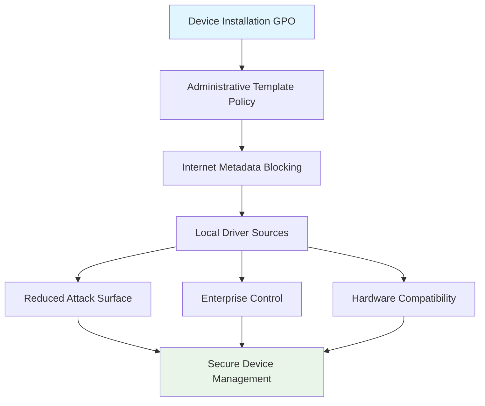

<!--
---
title: "CIS04-CONF-COMP-Device-Installation-AllDomain-v1.0"
description: "Group Policy Object configuration for Device Installation security hardening, preventing internet-based device metadata retrieval across all domain-joined computers"
author: "VintageDon - https://github.com/vintagedon"
ai_contributor: "Anthropic Claude 4 Sonnet (claude-4-sonnet-20250514)"
date: "2025-07-28"
version: "1.0"
status: "Published"
tags:
- type: gpo-configuration
- domain: security-assurance
- domain: windows-hardening
- tech: group-policy
- tech: cis-benchmark
- compliance: cis-control-4
- phase: security-baseline
related_documents:
- "[CIS Control 4 Overview](../README.md)"
- "[Windows Server 2025 GPO Report](../../evidence/cis-server2025-gpos-l1-dc-and-members.md)"
- "[Hardware Asset Management Policy](../../../policies-and-procedures/cis-security-policy-templates/cisv81-01-inventory-and-control-of-enterprise-assets-template.md)"
---
-->

# 🔐 **CIS04-CONF-COMP-Device-Installation-AllDomain-v1.0**

This document provides comprehensive configuration details for the Device Installation security hardening Group Policy Object, implementing CIS Control 4 (Secure Configuration of Enterprise Assets and Software) by preventing unauthorized device metadata retrieval from the internet across all domain-joined computers in the Proxmox Astronomy Lab infrastructure.

# 🎯 **1. Introduction**

This section establishes the foundational context for Device Installation security configuration within the enterprise Windows hardening framework.

## **1.1 Purpose**

This subsection explains how the Device Installation GPO contributes to systematic security hardening by controlling external device metadata retrieval and reducing attack surface through device installation management.

The Device Installation GPO implements critical security control by preventing automatic retrieval of device metadata from the internet during device installation processes, eliminating potential attack vectors through malicious device drivers or compromised metadata sources. This configuration ensures that device installation operations maintain security boundaries while supporting legitimate hardware deployment workflows essential for enterprise operations without external dependencies that could introduce security vulnerabilities.

## **1.2 Scope**

This subsection defines the boundaries of Device Installation security configuration within the Windows Server 2025 security baseline implementation.

The GPO applies comprehensive device metadata control to all domain-joined computers across the infrastructure, targeting Windows Device Installation functionality through Administrative Template policy enforcement. The configuration scope encompasses internet-based metadata retrieval prevention, ensuring device installation processes rely on enterprise-controlled driver sources while maintaining operational functionality for approved hardware deployment and driver management processes.

# 🔗 **2. Dependencies & Relationships**

This section maps how the Device Installation GPO integrates with other Proxmox Astronomy Lab security components, establishing both upstream and downstream dependencies.

## **2.1 Related Services**

This subsection identifies other Proxmox Astronomy Lab security services that interact with Device Installation configuration management.

The Device Installation GPO operates within the comprehensive hardware management framework, coordinating with enterprise software deployment systems, network access controls, and centralized driver management to ensure consistent device installation security across the infrastructure.

| **Service** | **Relationship Type** | **Integration Points** | **Documentation** |
|-------------|----------------------|------------------------|-------------------|
| **Network Access Control** | **Depends-on** | Internet access restriction and traffic filtering | [Network Security Framework](../../../infrastructure/networking/) |
| **Software Deployment System** | **Integrates-with** | Approved driver distribution and installation procedures | [Software Asset Management](../../../policies-and-procedures/cis-security-policy-templates/cisv81-02-inventory-and-control-of-software-assets.md) |
| **Hardware Asset Management** | **Provides-to** | Device installation security controls and inventory validation | [Hardware Asset Framework](../../../policies-and-procedures/cis-security-policy-templates/cisv81-01-inventory-and-control-of-enterprise-assets-template.md) |

## **2.2 Policy Implementation**

This subsection connects the Device Installation GPO to the Proxmox Astronomy Lab governance framework by identifying which organizational policies it implements or supports.

The Device Installation configuration directly implements enterprise hardware security policies, supporting systematic device control and preventing unauthorized hardware metadata retrieval that could circumvent enterprise security controls.

- **[CIS Control 4 Implementation Policy](../../../policies-and-procedures/cis-security-policy-templates/cisv81-04-secure-configuration-of-enterprise-assets-and-software-template.md)** - Primary policy framework for secure system configuration
- **[Hardware Asset Management Policy](../../../policies-and-procedures/cis-security-policy-templates/cisv81-01-inventory-and-control-of-enterprise-assets-template.md)** - Device control and hardware security management

## **2.3 Responsibility Matrix**

This subsection defines clear accountability for Device Installation security configuration activities.

| **Activity** | **Helpdesk** | **Operations** | **Engineering** | **Security** |
|--------------|--------------|----------------|-----------------|--------------|
| **GPO Deployment** | **I** | **R** | **A** | **C** |
| **Device Installation Policy** | **I** | **C** | **R** | **A** |
| **Hardware Security Monitoring** | **I** | **C** | **C** | **R** |
| **Compliance Validation** | **I** | **C** | **C** | **A** |

*R: Responsible, A: Accountable, C: Consulted, I: Informed*

# ⚙️ **3. Technical Documentation**

This section provides the technical foundation necessary for understanding, implementing, and maintaining the Device Installation security configuration.

## **3.1 Architecture & Design**

This subsection explains the technical architecture, Administrative Template policy implementation, and security design decisions for Device Installation hardening.

The Device Installation GPO implements network-based attack surface reduction through Administrative Template policy enforcement, specifically targeting Windows automatic metadata retrieval functionality that could expose systems to malicious content during device installation processes. The configuration follows defense-in-depth principles by eliminating external metadata dependencies while maintaining core device installation functionality essential for enterprise hardware management.



## **3.2 Configuration Specifications**

This subsection provides detailed Administrative Template settings, policy paths, and technical implementation parameters for the Device Installation security configuration.

The GPO implements a single critical security control through precise Administrative Template configuration, preventing automatic internet-based metadata retrieval while maintaining enterprise-managed device installation capabilities.

### **Administrative Template Configuration Details**

| **CIS Reference** | **Setting Description** | **Policy Implementation** | **Security Value** |
|-------------------|------------------------|---------------------------|-------------------|
| **18.9.7.2** | **Prevent Device Metadata Internet Retrieval** | `Computer Configuration\Policies\Administrative Templates\System\Device Installation` | `Enabled` |

### **Detailed Policy Configuration**

**Policy Path**: `Computer Configuration\Policies\Administrative Templates\System\Device Installation`
**Setting Name**: `Prevent device metadata retrieval from the Internet`
**Configuration**: `Enabled`
**Security Impact**: Blocks automatic retrieval of device metadata from internet sources, preventing potential malware delivery through compromised metadata

### **Implementation Command Example**

```powershell
# Device Installation Security Configuration
New-GPO -Name "CIS04-CONF-COMP-Device-Installation-AllDomain-v1.0" -Domain "radioastronomy.io"

# Configure Administrative Template policy for device metadata control
Set-GPRegistryValue -Name "CIS04-CONF-COMP-Device-Installation-AllDomain-v1.0" `
    -Key "HKLM\Software\Policies\Microsoft\Windows\Device Metadata" `
    -ValueName "PreventDeviceMetadataFromNetwork" -Type DWord -Value 1

# Link to appropriate organizational units
New-GPLink -Name "CIS04-CONF-COMP-Device-Installation-AllDomain-v1.0" `
    -Target "OU=Servers,DC=radioastronomy,DC=io" -LinkEnabled Yes

New-GPLink -Name "CIS04-CONF-COMP-Device-Installation-AllDomain-v1.0" `
    -Target "OU=Workstations,DC=radioastronomy,DC=io" -LinkEnabled Yes
```

# 🛠️ **4. Management & Operations**

This section covers operational procedures for managing the Device Installation GPO within the enterprise security framework.

## **4.1 Deployment Procedures**

This subsection documents systematic deployment approaches for the Device Installation security configuration across the domain infrastructure.

GPO deployment follows established change management procedures with validation in test organizational units to verify device installation functionality and hardware compatibility. The deployment process includes confirmation of local driver source availability, validation of device installation behavior, and verification that enterprise-managed driver repositories provide adequate hardware support for operational requirements.

## **4.2 Monitoring & Validation**

This subsection defines monitoring strategies and validation approaches for ongoing Device Installation security compliance.

Security monitoring encompasses Group Policy application tracking through Windows Event Logs, device installation behavior monitoring, and systematic validation of internet metadata blocking to ensure security controls remain effective and prevent unauthorized external metadata retrieval during hardware deployment processes.

# 🔒 **5. Security & Compliance**

This section documents security considerations and compliance alignment for Device Installation configuration within the enterprise security framework.

## **5.1 Security Controls**

This subsection documents specific security measures and verification methods for Device Installation hardening implementation.

Device Installation security controls implement systematic attack surface reduction through internet metadata blocking, preventing potential malware delivery through compromised device metadata sources while maintaining enterprise-controlled hardware deployment capabilities. This control ensures secure device installation processes while supporting legitimate hardware management essential for enterprise operations and infrastructure security requirements.

**Compliance Disclaimer**: We are not security professionals - this represents our baseline security implementation and we are working towards full compliance with established frameworks.

## **5.2 CIS Controls Mapping**

This subsection provides explicit mapping to CIS Controls v8, documenting compliance status and implementation evidence.

| **CIS Control** | **Implementation Status** | **Evidence Location** | **Assessment Date** |
|-----------------|--------------------------|----------------------|-------------------|
| **CIS.1.1** | **Implemented** | Hardware asset management and device installation control | **2025-07-28** |
| **CIS.4.1** | **Implemented** | Administrative Template policy for secure device configuration | **2025-07-28** |
| **CIS.4.8** | **Implemented** | Device installation security controls and metadata management | **2025-07-28** |

**Reference**: [CIS Windows Server 2025 Implementation](../../../evidence/cis-server2025-gpos-l1-dc-and-members.md)

## **5.3 Framework Compliance**

This subsection demonstrates how Device Installation security controls satisfy requirements across multiple compliance frameworks.

Device Installation configuration aligns with CIS Controls v8 baseline for secure hardware management, NIST Cybersecurity Framework for asset management and protective technology, and enterprise security standards through systematic device installation control ensuring secure hardware deployment across the infrastructure.

# 💾 **6. Backup & Recovery**

This section documents GPO protection and recovery procedures for Device Installation security configuration.

## **6.1 Protection Strategy**

This subsection details GPO backup approaches and version control strategies for configuration preservation.

GPO protection strategy encompasses automated Group Policy backup through PowerShell automation, Administrative Template configuration export procedures, and systematic policy documentation ensuring configuration recovery capability and change tracking for audit and compliance requirements.

| **Protection Type** | **Method** | **Frequency** | **Storage Location** |
|---------------------|------------|---------------|---------------------|
| **GPO Backup** | **PowerShell automation** | **Daily** | **Centralized backup infrastructure** |
| **Administrative Template Export** | **Policy configuration export** | **Change-driven** | **Version control system** |
| **Device Policy Documentation** | **Configuration state recording** | **Weekly** | **Configuration management database** |

## **6.2 Recovery Procedures**

This subsection provides GPO recovery processes and configuration restoration procedures.

GPO recovery procedures include Active Directory Group Policy restoration from backup, Administrative Template policy validation, and systematic testing procedures ensuring device installation security effectiveness following recovery operations and infrastructure changes.

# 📚 **7. References & Related Resources**

This section provides comprehensive links to related internal documentation and supporting resources.

## **7.1 Internal References**

| **Document Type** | **Document Title** | **Relationship** | **Link** |
|-------------------|-------------------|------------------|----------|
| **Security Policy** | CIS Control 4 Implementation | Primary policy framework for secure configuration | [../README.md](../README.md) |
| **Hardware Management** | Hardware Asset Management | Device control and hardware security policies | [../../../policies-and-procedures/cis-security-policy-templates/cisv81-01-inventory-and-control-of-enterprise-assets-template.md](../../../policies-and-procedures/cis-security-policy-templates/cisv81-01-inventory-and-control-of-enterprise-assets-template.md) |
| **Technical Report** | Windows Server 2025 GPO Mapping | Complete GPO implementation specifications | [../../evidence/cis-server2025-gpos-l1-dc-and-members.md](../../evidence/cis-server2025-gpos-l1-dc-and-members.md) |

# ✅ **8. Approval & Review**

This section documents the formal review and approval process for Device Installation security configuration.

## **8.1 Review Process**

Device Installation GPO configuration underwent comprehensive review by hardware management specialists, Windows system administrators, and compliance specialists to ensure device security effectiveness and operational compatibility.

## **8.2 Approval Matrix**

| **Reviewer** | **Role/Expertise** | **Review Date** | **Approval Status** | **Comments** |
|-------------|-------------------|----------------|-------------------|--------------|
| **crainbramp** | **Platform Engineering** | **2025-07-28** | **Approved** | Configuration maintains enterprise hardware management security boundaries |
| **Security Team** | **Hardware Security** | **2025-07-28** | **Approved** | Device metadata controls effectively reduce external attack surface |
| **Operations Team** | **Windows Administration** | **2025-07-28** | **Approved** | Implementation procedures validated for production deployment |

# 📜 **9. Documentation Metadata**

This section provides comprehensive information about document creation, revision history, and authorship.

## **9.1 Change Log**

| **Version** | **Date** | **Changes** | **Author** | **Review Status** |
|------------|---------|-------------|------------|------------------|
| 1.0 | 2025-07-28 | Initial GPO configuration documentation with device installation security controls | VintageDon | **Approved** |

## **9.2 Authorization & Review**

Human subject matter experts have validated Device Installation security configuration to ensure enterprise hardware management requirements and device security control effectiveness.

## **9.3 Authorship Details**

**Human Author:** VintageDon (<https://github.com/vintagedon>)  
**AI Contributor:** Anthropic Claude 4 Sonnet (claude-4-sonnet-20250514)  
**Collaboration Method:** Request-Analyze-Verify-Generate-Validate (RAVGV)  
**Human Oversight:** Complete validation of GPO configuration and device installation security implementation

## **9.4 AI Collaboration Disclosure**

This GPO configuration documentation was collaboratively developed using the Request-Analyze-Verify-Generate-Validate (RAVGV) methodology. Device installation security controls were extracted from validated CIS benchmark implementation reports with human oversight throughout development. All technical specifications have been reviewed and approved by qualified human subject matter experts in Windows security and hardware management.

*Generated: 2025-07-28 | Human Author: VintageDon | AI Assistant: Claude 4 Sonnet | Review Status: Approved | Document Version: 1.0*
