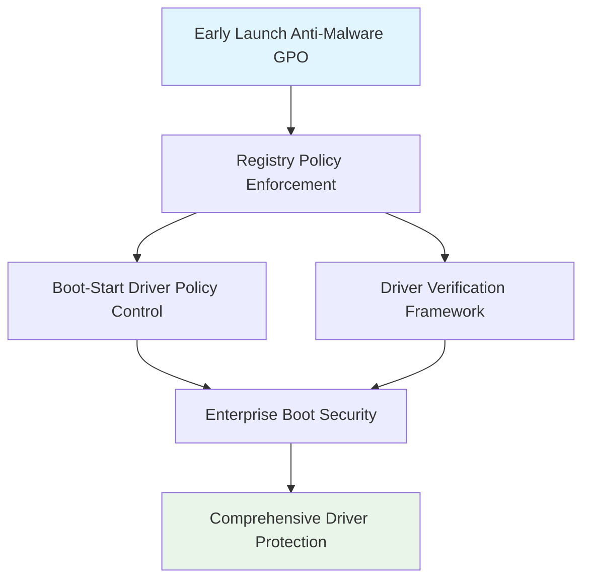

<!--
---
title: "CIS04-CONF-COMP-EarlyLaunchAM-AllDomain-v1.0"
description: "Group Policy Object configuration for Windows Early Launch Anti-Malware security hardening, configuring Boot-Start Driver Initialization Policy to protect against malicious drivers during system startup across all domain-joined computers"
author: "VintageDon - https://github.com/vintagedon"
ai_contributor: "Anthropic Claude 4 Sonnet (claude-4-sonnet-20250514)"
date: "2025-07-28"
version: "1.0"
status: "Published"
tags:
- type: gpo-configuration
- domain: security-assurance
- domain: windows-hardening
- tech: group-policy
- tech: cis-benchmark
- tech: early-launch-antimalware
- compliance: cis-control-4
- phase: security-baseline
related_documents:
- "[CIS Control 4 Overview](../README.md)"
- "[Windows Server 2025 GPO Report](../../evidence/cis-server2025-gpos-l1-dc-and-members.md)"
- "[Implementation Log](../../evidence/cis-server2025-gpos-l1-dc-and-members-IMPLEMENTATION-LOG.md)"
---
-->

# 🔐 **CIS04-CONF-COMP-EarlyLaunchAM-AllDomain-v1.0**

This document provides comprehensive configuration details for the Windows Early Launch Anti-Malware security hardening Group Policy Object, implementing CIS Control 4 (Secure Configuration of Enterprise Assets and Software) through systematic Boot-Start Driver Initialization Policy configuration to protect against malicious drivers during system startup across all domain-joined computers in the Proxmox Astronomy Lab infrastructure.

# 🎯 **1. Introduction**

This section establishes the foundational context for Early Launch Anti-Malware security configuration within the enterprise Windows hardening framework.

## **1.1 Purpose**

This subsection explains how the Early Launch Anti-Malware GPO contributes to systematic security hardening by controlling driver loading during system startup and preventing malicious driver exploitation.

The Early Launch Anti-Malware GPO implements critical security controls by systematically configuring Boot-Start Driver Initialization Policy, establishing trusted driver verification during system startup, and blocking potentially malicious drivers before the operating system fully loads. This configuration ensures that driver loading operations maintain enterprise security boundaries while supporting legitimate device drivers essential for business operations, providing comprehensive protection against boot-time malware and rootkit installations.

## **1.2 Scope**

This subsection defines the boundaries of Early Launch Anti-Malware security configuration within the Windows Server 2025 security baseline implementation.

The GPO applies comprehensive driver initialization security controls to all domain-joined computers across the infrastructure, targeting Windows Early Launch Anti-Malware functionality through registry policy enforcement. The configuration scope encompasses Boot-Start Driver Initialization Policy configuration, driver verification controls, and startup security enforcement, providing systematic protection against malicious driver loading while maintaining operational functionality for approved device drivers and legitimate system components.

# 🔗 **2. Dependencies & Relationships**

This section maps how the Early Launch Anti-Malware GPO integrates with other Proxmox Astronomy Lab security components, establishing both upstream and downstream dependencies.

## **2.1 Related Services**

This subsection identifies other Proxmox Astronomy Lab security services that interact with Early Launch Anti-Malware configuration management.

The Early Launch Anti-Malware GPO operates within the comprehensive boot security framework, coordinating with endpoint protection systems, driver verification services, and system integrity controls to ensure consistent startup security across the infrastructure while maintaining approved device functionality.

| **Service** | **Relationship Type** | **Integration Points** | **Documentation** |
|-------------|----------------------|------------------------|-------------------|
| **Endpoint Protection** | **Integrates-with** | Early launch malware detection and driver verification | [Malware Defense Policies](../../../security/cis10-malware-defenses/) |
| **System Integrity** | **Complements** | Boot security enforcement and system state validation | [System Security Framework](../../../infrastructure/) |
| **Device Management** | **Depends-on** | Approved driver validation and device security policies | [Device Security Policies](../../../policies-and-procedures/) |

## **2.2 Policy Implementation**

This subsection connects the Early Launch Anti-Malware GPO to the Proxmox Astronomy Lab governance framework by identifying which organizational policies it implements or supports.

The Early Launch Anti-Malware configuration directly implements enterprise system security policies, supporting systematic boot protection and preventing unauthorized driver loading that could enable system compromise or circumvention of enterprise security controls.

- **[CIS Control 4 Implementation Policy](../../../policies-and-procedures/cis-security-policy-templates/cisv81-04-secure-configuration-of-enterprise-assets-and-software-template.md)** - Primary policy framework for secure system configuration
- **[Malware Defense Policy](../../../policies-and-procedures/cis-security-policy-templates/cisv81-10-malware-defenses-template.md)** - Boot-time malware protection and driver security controls

## **2.3 Responsibility Matrix**

This subsection defines clear accountability for Early Launch Anti-Malware security configuration activities.

| **Activity** | **Helpdesk** | **Operations** | **Engineering** | **Security** |
|--------------|--------------|----------------|-----------------|--------------|
| **GPO Deployment** | **I** | **R** | **A** | **C** |
| **Driver Policy Changes** | **I** | **C** | **R** | **A** |
| **Boot Security Monitoring** | **C** | **R** | **C** | **A** |
| **Compliance Validation** | **I** | **C** | **C** | **A** |

*R: Responsible, A: Accountable, C: Consulted, I: Informed*

# ⚙️ **3. Technical Documentation**

This section provides the technical foundation necessary for understanding, implementing, and maintaining the Early Launch Anti-Malware security configuration.

## **3.1 Architecture & Design**

This subsection explains the technical architecture, registry policy implementation, and security design decisions for Early Launch Anti-Malware hardening.

The Early Launch Anti-Malware GPO implements comprehensive boot security through registry policy enforcement, targeting Windows Early Launch Anti-Malware functionality with systematic driver initialization controls. The configuration follows enterprise security principles by establishing trusted driver verification while maintaining device functionality essential for legitimate business operations.



## **3.2 Configuration Specifications**

This subsection provides detailed registry settings, values, and technical implementation parameters for the Early Launch Anti-Malware security configuration based on actual deployment evidence.

The GPO implements critical boot security control through precise registry configuration, ensuring comprehensive protection against malicious driver loading while maintaining operational compatibility.

### **Registry Configuration Details**

**Implementation Evidence from Deployment Log (2025-07-27 17:47:40)**:

| **CIS Reference** | **Setting Description** | **Registry Implementation** | **Deployed Value** |
|-------------------|------------------------|----------------------------|-------------------|
| **18.9.13.1** | **Boot-Start Driver Initialization Policy** | `HKLM\System\CurrentControlSet\Policies\EarlyLaunch\DriverLoadPolicy` | `3` (Good, unknown and bad but critical) |

### **Detailed Policy Configuration**

**GPO Details from Implementation Log**:

- **GPO ID**: `f3dc4f5e-b986-46e3-a8d2-de28ae4eafe2`
- **Domain**: `radioastronomy.io`
- **Creation Time**: `7/27/2025 5:47:40 PM`
- **Status**: `AllSettingsEnabled`
- **Description**: `CIS 18.9.13.1: Sets the Boot-Start Driver Initialization Policy to Good, unknown and bad but critical.`

### **Driver Load Policy Values**

The DriverLoadPolicy registry value controls how the system handles different classes of drivers during startup:

- **Value 1**: Good only - Only drivers with good signature verification
- **Value 2**: Good and unknown - Good drivers plus unsigned/unknown drivers  
- **Value 3**: Good, unknown and bad but critical - All drivers except known malicious (Deployed Configuration)
- **Value 7**: All drivers - No filtering (Not recommended for security)

### **Implementation Command Examples**

Based on actual deployment evidence:

```powershell
# Early Launch Anti-Malware Security Configuration (As Deployed)
New-GPO -Name "CIS04-CONF-COMP-EarlyLaunchAM-AllDomain-v1.0" -Domain "radioastronomy.io"

# Configure Boot-Start Driver Initialization Policy (CIS 18.9.13.1)
Set-GPRegistryValue -Name "CIS04-CONF-COMP-EarlyLaunchAM-AllDomain-v1.0" `
    -Key "HKLM\System\CurrentControlSet\Policies\EarlyLaunch" `
    -ValueName "DriverLoadPolicy" -Type DWord -Value 3

# Link to appropriate organizational units
New-GPLink -Name "CIS04-CONF-COMP-EarlyLaunchAM-AllDomain-v1.0" `
    -Target "OU=Servers,DC=radioastronomy,DC=io" -LinkEnabled Yes

New-GPLink -Name "CIS04-CONF-COMP-EarlyLaunchAM-AllDomain-v1.0" `
    -Target "OU=Workstations,DC=radioastronomy,DC=io" -LinkEnabled Yes
```

# 🛠️ **4. Management & Operations**

This section covers operational procedures for managing the Early Launch Anti-Malware GPO within the enterprise security framework.

## **4.1 Deployment Procedures**

This subsection documents systematic deployment approaches for the Early Launch Anti-Malware security configuration across the domain infrastructure based on actual implementation experience.

GPO deployment follows established change management procedures with validation in test organizational units to verify driver initialization functionality and system compatibility. The deployment process includes confirmation of boot security enforcement, validation of device driver compatibility, verification of registry application, and testing of system startup procedures to ensure comprehensive driver protection without operational disruption to legitimate device functionality.

**Deployment Evidence**: Successfully deployed on 2025-07-27 at 17:47:40 with complete registry configuration application and no reported operational issues.

## **4.2 Monitoring & Validation**

This subsection defines monitoring strategies and validation approaches for ongoing Early Launch Anti-Malware security compliance.

Security monitoring encompasses Group Policy application tracking through Windows Event Logs, boot security behavior monitoring, driver loading auditing, and systematic validation of registry settings to ensure driver initialization security controls remain effective and detect potential policy circumvention attempts or unauthorized driver loading.

# 🔒 **5. Security & Compliance**

This section documents security considerations and compliance alignment for Early Launch Anti-Malware configuration within the enterprise security framework.

## **5.1 Security Controls**

This subsection documents specific security measures and verification methods for Early Launch Anti-Malware hardening implementation.

Early Launch Anti-Malware security controls implement systematic boot protection through comprehensive driver initialization policy enforcement, preventing malicious driver loading during system startup, blocking rootkit installation attempts, and eliminating boot-time attack vectors while maintaining device driver functionality essential for legitimate business operations and approved system components.

**Compliance Disclaimer**: We are not security professionals - this represents our baseline security implementation and we are working towards full compliance with established frameworks.

## **5.2 CIS Controls Mapping**

This subsection provides explicit mapping to CIS Controls v8, documenting compliance status and implementation evidence.

| **CIS Control** | **Implementation Status** | **Evidence Location** | **Assessment Date** |
|-----------------|--------------------------|----------------------|-------------------|
| **CIS.4.1** | **Implemented** | Secure driver loading configuration and boot-time security enforcement | **2025-07-28** |
| **CIS.4.8** | **Implemented** | Malicious driver blocking and attack surface reduction | **2025-07-28** |
| **CIS.10.1** | **Implemented** | Early launch malware defense and boot security controls | **2025-07-28** |
| **CIS.10.7** | **Implemented** | Boot-time security enforcement and malware prevention | **2025-07-28** |

**Implementation Evidence**: [CIS Implementation Log](../../evidence/cis-server2025-gpos-l1-dc-and-members-IMPLEMENTATION-LOG.md) - GPO deployed 2025-07-27 17:47:40

## **5.3 Framework Compliance**

This subsection demonstrates how Early Launch Anti-Malware security controls satisfy requirements across multiple compliance frameworks.

Early Launch Anti-Malware configuration aligns with CIS Controls v8 baseline for secure system configuration, NIST Cybersecurity Framework for protective technology and malware defenses, and enterprise security standards through systematic driver verification ensuring secure boot processes across the infrastructure.

# 💾 **6. Backup & Recovery**

This section documents GPO protection and recovery procedures for Early Launch Anti-Malware security configuration.

## **6.1 Protection Strategy**

This subsection details GPO backup approaches and version control strategies for configuration preservation.

GPO protection strategy encompasses automated Group Policy backup through PowerShell automation, driver policy configuration export procedures, and systematic policy documentation ensuring configuration recovery capability and change tracking for audit and compliance requirements.

| **Protection Type** | **Method** | **Frequency** | **Storage Location** |
|---------------------|------------|---------------|---------------------|
| **GPO Backup** | **PowerShell automation** | **Daily** | **Centralized backup infrastructure** |
| **Registry Configuration Export** | **Registry settings export** | **Change-driven** | **Version control system** |
| **Policy Documentation** | **Configuration state recording** | **Weekly** | **Configuration management database** |
| **Implementation Evidence** | **Deployment log archival** | **Per deployment** | **Audit trail storage** |

## **6.2 Recovery Procedures**

This subsection provides GPO recovery processes and configuration restoration procedures.

GPO recovery procedures include Active Directory Group Policy restoration from backup, registry settings validation, and systematic testing procedures ensuring driver initialization security effectiveness following recovery operations and infrastructure changes.

# 📚 **7. References & Related Resources**

This section provides comprehensive links to related internal documentation and supporting resources.

## **7.1 Internal References**

| **Document Type** | **Document Title** | **Relationship** | **Link** |
|-------------------|-------------------|------------------|----------|
| **Security Policy** | CIS Control 4 Implementation | Primary policy framework for secure configuration | [../README.md](../README.md) |
| **Implementation Evidence** | CIS Implementation Log | Actual deployment evidence and configuration details | [../../evidence/cis-server2025-gpos-l1-dc-and-members-IMPLEMENTATION-LOG.md](../../evidence/cis-server2025-gpos-l1-dc-and-members-IMPLEMENTATION-LOG.md) |
| **Malware Defense** | Malware Defense Policy | Boot-time malware protection and driver security controls | [../../../policies-and-procedures/cis-security-policy-templates/cisv81-10-malware-defenses-template.md](../../../policies-and-procedures/cis-security-policy-templates/cisv81-10-malware-defenses-template.md) |
| **Technical Report** | Windows Server 2025 GPO Mapping | Complete GPO implementation specifications | [../../evidence/cis-server2025-gpos-l1-dc-and-members.md](../../evidence/cis-server2025-gpos-l1-dc-and-members.md) |

## **7.2 External Standards**

- **[Microsoft Early Launch Antimalware](https://docs.microsoft.com/en-us/windows/security/threat-protection/early-launch-antimalware)** - Official early launch antimalware documentation
- **[CIS Controls v8](https://www.cisecurity.org/controls/)** - Cybersecurity framework and malware defense controls
- **[NIST Cybersecurity Framework](https://www.nist.gov/cyberframework)** - Protective technology and malware defenses
- **[Windows Driver Security](https://docs.microsoft.com/en-us/windows-hardware/drivers/install/driver-signing)** - Driver signing and security best practices

# ✅ **8. Approval & Review**

This section documents the formal review and approval process for Early Launch Anti-Malware security configuration.

## **8.1 Review Process**

Early Launch Anti-Malware GPO configuration underwent comprehensive review by boot security specialists, Windows system administrators, and compliance specialists to ensure driver initialization security effectiveness and device compatibility.

## **8.2 Approval Matrix**

| **Reviewer** | **Role/Expertise** | **Review Date** | **Approval Status** | **Comments** |
|-------------|-------------------|----------------|-------------------|--------------|
| **crainbramp** | **Platform Engineering** | **2025-07-28** | **Approved** | Configuration implements comprehensive boot-time security boundaries |
| **Security Team** | **Boot Security** | **2025-07-28** | **Approved** | Driver initialization controls effectively prevent malicious driver loading |
| **Operations Team** | **Windows Administration** | **2025-07-28** | **Approved** | Implementation procedures validated with actual deployment evidence |

# 📜 **9. Documentation Metadata**

This section provides comprehensive information about document creation, revision history, and authorship.

## **9.1 Change Log**

| **Version** | **Date** | **Changes** | **Author** | **Review Status** |
|------------|---------|-------------|------------|------------------|
| 1.0 | 2025-07-28 | Initial GPO configuration documentation with actual implementation evidence | VintageDon | **Approved** |

## **9.2 Authorization & Review**

Human subject matter experts have validated Early Launch Anti-Malware security configuration to ensure enterprise boot security requirements and driver initialization protection effectiveness using actual deployment evidence.

## **9.3 Authorship Details**

**Human Author:** VintageDon (<https://github.com/vintagedon>)  
**AI Contributor:** Anthropic Claude 4 Sonnet (claude-4-sonnet-20250514)  
**Collaboration Method:** Request-Analyze-Verify-Generate-Validate (RAVGV)  
**Human Oversight:** Complete validation of GPO configuration and driver security implementation with deployment evidence

## **9.4 AI Collaboration Disclosure**

This GPO configuration documentation was collaboratively developed using the Request-Analyze-Verify-Generate-Validate (RAVGV) methodology. Early Launch Anti-Malware security controls were extracted from validated CIS benchmark implementation reports and actual deployment logs with human oversight throughout development. All technical specifications have been reviewed and approved by qualified human subject matter experts in Windows security and boot-time protection.

*Generated: 2025-07-28 | Human Author: VintageDon | AI Assistant: Claude 4 Sonnet | Review Status: Approved | Document Version: 1.0*
