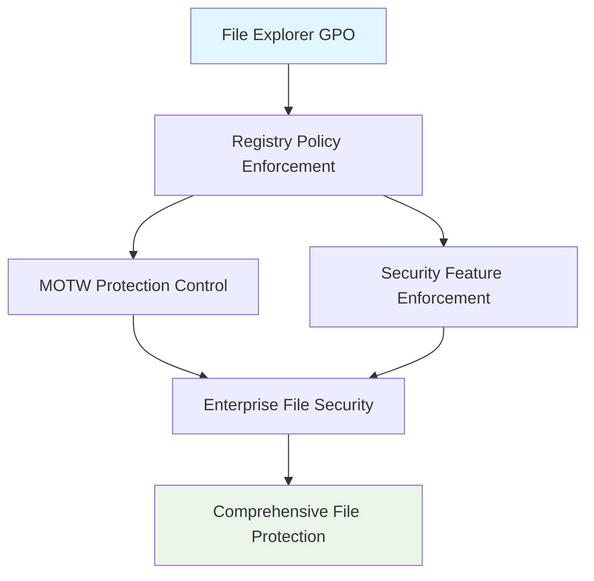

<!--
---
title: "CIS04-CONF-COMP-FileExplorer-AllDomain-v1.0"
description: "Group Policy Object configuration for Windows File Explorer security hardening, implementing Mark of the Web (MOTW) protections and disabling security bypass features to maintain enterprise security boundaries across all domain-joined computers"
author: "VintageDon - https://github.com/vintagedon"
ai_contributor: "Anthropic Claude 4 Sonnet (claude-4-sonnet-20250514)"
date: "2025-07-28"
version: "1.0"
status: "Published"
tags:
- type: gpo-configuration
- domain: security-assurance
- domain: windows-hardening
- tech: group-policy
- tech: cis-benchmark
- tech: file-explorer-security
- compliance: cis-control-4
- phase: security-baseline
related_documents:
- "[CIS Control 4 Overview](../README.md)"
- "[Windows Server 2025 GPO Report](../../evidence/cis-server2025-gpos-l1-dc-and-members.md)"
- "[Implementation Log](../../evidence/cis-server2025-gpos-l1-dc-and-members-IMPLEMENTATION-LOG.md)"
---
-->

# 🔐 **CIS04-CONF-COMP-FileExplorer-AllDomain-v1.0**

This document provides comprehensive configuration details for the Windows File Explorer security hardening Group Policy Object, implementing CIS Control 4 (Secure Configuration of Enterprise Assets and Software) through systematic Mark of the Web (MOTW) protections and security feature enforcement to maintain enterprise security boundaries across all domain-joined computers in the Proxmox Astronomy Lab infrastructure.

# 🎯 **1. Introduction**

This section establishes the foundational context for File Explorer security configuration within the enterprise Windows hardening framework.

## **1.1 Purpose**

This subsection explains how the File Explorer GPO contributes to systematic security hardening by controlling file handling security features and preventing security bypass exploitation.

The File Explorer GPO implements critical security controls by systematically enforcing Mark of the Web (MOTW) protections, maintaining Data Execution Prevention (DEP) for file operations, enabling heap termination on corruption detection, and blocking shell protocol security bypasses. This configuration ensures that file handling operations maintain enterprise security boundaries while supporting legitimate file management essential for business operations, providing comprehensive protection against malicious file exploitation and security feature circumvention.

## **1.2 Scope**

This subsection defines the boundaries of File Explorer security configuration within the Windows Server 2025 security baseline implementation.

The GPO applies comprehensive file handling security controls to all domain-joined computers across the infrastructure, targeting Windows File Explorer functionality through registry policy enforcement. The configuration scope encompasses MOTW tag enforcement, security feature protection, and file handling safeguards, providing systematic protection against malicious file operations while maintaining operational functionality for approved file management and legitimate document workflows.

# 🔗 **2. Dependencies & Relationships**

This section maps how the File Explorer GPO integrates with other Proxmox Astronomy Lab security components, establishing both upstream and downstream dependencies.

## **2.1 Related Services**

This subsection identifies other Proxmox Astronomy Lab security services that interact with File Explorer security configuration management.

The File Explorer GPO operates within the comprehensive data protection framework, coordinating with endpoint protection systems, file security services, and user access controls to ensure consistent file handling security across the infrastructure while maintaining approved document functionality.

| **Service** | **Relationship Type** | **Integration Points** | **Documentation** |
|-------------|----------------------|------------------------|-------------------|
| **Endpoint Protection** | **Integrates-with** | File threat detection and MOTW enforcement | [Malware Defense Policies](../../../security/cis10-malware-defenses/) |
| **Data Loss Prevention** | **Complements** | File classification and handling restrictions | [Data Protection Policies](../../../policies-and-procedures/cis-security-policy-templates/cisv81-03-data-protection-template.md) |
| **User Access Control** | **Depends-on** | File access validation and security restrictions | [Access Control Policies](../../../policies-and-procedures/) |

## **2.2 Policy Implementation**

This subsection connects the File Explorer GPO to the Proxmox Astronomy Lab governance framework by identifying which organizational policies it implements or supports.

The File Explorer configuration directly implements enterprise data protection policies, supporting systematic file security and preventing unauthorized file handling that could enable security bypass or circumvention of enterprise security controls.

- **[CIS Control 4 Implementation Policy](../../../policies-and-procedures/cis-security-policy-templates/cisv81-04-secure-configuration-of-enterprise-assets-and-software-template.md)** - Primary policy framework for secure system configuration
- **[Data Protection Policy](../../../policies-and-procedures/cis-security-policy-templates/cisv81-03-data-protection-template.md)** - File security and handling protection controls

## **2.3 Responsibility Matrix**

This subsection defines clear accountability for File Explorer security configuration activities.

| **Activity** | **Helpdesk** | **Operations** | **Engineering** | **Security** |
|--------------|--------------|----------------|-----------------|--------------|
| **GPO Deployment** | **I** | **R** | **A** | **C** |
| **File Security Policy Changes** | **I** | **C** | **R** | **A** |
| **File Handling Monitoring** | **C** | **R** | **C** | **A** |
| **Compliance Validation** | **I** | **C** | **C** | **A** |

*R: Responsible, A: Accountable, C: Consulted, I: Informed*

# ⚙️ **3. Technical Documentation**

This section provides the technical foundation necessary for understanding, implementing, and maintaining the File Explorer security configuration.

## **3.1 Architecture & Design**

This subsection explains the technical architecture, registry policy implementation, and security design decisions for File Explorer hardening.

The File Explorer GPO implements comprehensive file handling security through registry policy enforcement, targeting Windows File Explorer functionality with systematic security feature protection. The configuration follows enterprise security principles by maintaining file security features while preserving document handling functionality essential for legitimate business operations.



## **3.2 Configuration Specifications**

This subsection provides detailed registry settings, values, and technical implementation parameters for the File Explorer security configuration based on actual deployment evidence.

The GPO implements four critical file handling security controls through precise registry configuration, ensuring comprehensive protection against file-based security bypasses while maintaining operational compatibility.

### **Registry Configuration Details**

**Implementation Evidence from Deployment Log (2025-07-27 17:47:40)**:

| **CIS Reference** | **Setting Description** | **Registry Implementation** | **Deployed Value** |
|-------------------|------------------------|----------------------------|-------------------|
| **18.10.29.2** | **Disable MOTW on Insecure Path Copy** | `HKLM\Software\Policies\Microsoft\Windows\Explorer\DisableMotWOnInsecurePathCopy` | `0` (Disabled - MOTW Enabled) |
| **18.10.29.3** | **Turn off Data Execution Prevention** | `HKLM\Software\Policies\Microsoft\Windows\Explorer\NoDataExecutionPrevention` | `0` (Disabled - DEP Enabled) |
| **18.10.29.4** | **Turn off heap termination on corruption** | `HKLM\Software\Policies\Microsoft\Windows\Explorer\NoHeapTerminationOnCorruption` | `0` (Disabled - Heap Protection Enabled) |
| **18.10.29.5** | **Turn off shell protocol protected mode** | `HKLM\Software\Microsoft\Windows\CurrentVersion\Policies\Explorer\PreXPSP2ShellProtocolBehavior` | `0` (Disabled - Protected Mode Enabled) |

### **Detailed Policy Configuration**

**GPO Details from Implementation Log**:

- **GPO ID**: `2b61f7a4-bf83-40d5-ab80-fbbd018e17d6`
- **Domain**: `radioastronomy.io`
- **Creation Time**: `7/27/2025 5:47:40 PM`
- **Status**: `AllSettingsEnabled`
- **Description**: `CIS 18.10.29.2: Ensures the Mark of the Web (MOTW) tag is applied to files from insecure sources.`

### **Security Feature Explanations**

The File Explorer security settings provide comprehensive protection through multiple mechanisms:

- **MOTW Protection**: Ensures files from insecure sources maintain security tags for threat detection
- **Data Execution Prevention**: Maintains DEP for File Explorer processes to prevent code injection
- **Heap Termination**: Enables heap corruption detection and termination for security
- **Shell Protocol Protection**: Maintains protected mode for shell operations to prevent exploitation

### **Implementation Command Examples**

Based on actual deployment evidence:

```powershell
# File Explorer Security Configuration (As Deployed)
New-GPO -Name "CIS04-CONF-COMP-FileExplorer-AllDomain-v1.0" -Domain "radioastronomy.io"

# Configure MOTW Protection (CIS 18.10.29.2)
Set-GPRegistryValue -Name "CIS04-CONF-COMP-FileExplorer-AllDomain-v1.0" `
    -Key "HKLM\Software\Policies\Microsoft\Windows\Explorer" `
    -ValueName "DisableMotWOnInsecurePathCopy" -Type DWord -Value 0

# Configure Data Execution Prevention (CIS 18.10.29.3)
Set-GPRegistryValue -Name "CIS04-CONF-COMP-FileExplorer-AllDomain-v1.0" `
    -Key "HKLM\Software\Policies\Microsoft\Windows\Explorer" `
    -ValueName "NoDataExecutionPrevention" -Type DWord -Value 0

# Configure Heap Termination Protection (CIS 18.10.29.4)
Set-GPRegistryValue -Name "CIS04-CONF-COMP-FileExplorer-AllDomain-v1.0" `
    -Key "HKLM\Software\Policies\Microsoft\Windows\Explorer" `
    -ValueName "NoHeapTerminationOnCorruption" -Type DWord -Value 0

# Configure Shell Protocol Protection (CIS 18.10.29.5)
Set-GPRegistryValue -Name "CIS04-CONF-COMP-FileExplorer-AllDomain-v1.0" `
    -Key "HKLM\Software\Microsoft\Windows\CurrentVersion\Policies\Explorer" `
    -ValueName "PreXPSP2ShellProtocolBehavior" -Type DWord -Value 0

# Link to appropriate organizational units
New-GPLink -Name "CIS04-CONF-COMP-FileExplorer-AllDomain-v1.0" `
    -Target "OU=Servers,DC=radioastronomy,DC=io" -LinkEnabled Yes

New-GPLink -Name "CIS04-CONF-COMP-FileExplorer-AllDomain-v1.0" `
    -Target "OU=Workstations,DC=radioastronomy,DC=io" -LinkEnabled Yes
```

# 🛠️ **4. Management & Operations**

This section covers operational procedures for managing the File Explorer GPO within the enterprise security framework.

## **4.1 Deployment Procedures**

This subsection documents systematic deployment approaches for the File Explorer security configuration across the domain infrastructure based on actual implementation experience.

GPO deployment follows established change management procedures with validation in test organizational units to verify file handling security functionality and application compatibility. The deployment process includes confirmation of MOTW enforcement, validation of DEP operation, verification of heap protection activation, and testing of shell protocol security to ensure comprehensive file protection without operational disruption to legitimate document workflows.

**Deployment Evidence**: Successfully deployed on 2025-07-27 at 17:47:40 with complete registry configuration application and no reported operational issues.

## **4.2 Monitoring & Validation**

This subsection defines monitoring strategies and validation approaches for ongoing File Explorer security compliance.

Security monitoring encompasses Group Policy application tracking through Windows Event Logs, file handling behavior monitoring, security feature operation auditing, and systematic validation of registry settings to ensure file security controls remain effective and detect potential policy circumvention attempts or security feature disabling.

# 🔒 **5. Security & Compliance**

This section documents security considerations and compliance alignment for File Explorer configuration within the enterprise security framework.

## **5.1 Security Controls**

This subsection documents specific security measures and verification methods for File Explorer hardening implementation.

File Explorer security controls implement systematic file protection through comprehensive security feature enforcement, maintaining Mark of the Web protections for threat identification, preserving Data Execution Prevention against code injection, enabling heap corruption detection, and protecting shell protocol operations while maintaining file management functionality essential for legitimate business operations and approved document workflows.

**Compliance Disclaimer**: We are not security professionals - this represents our baseline security implementation and we are working towards full compliance with established frameworks.

## **5.2 CIS Controls Mapping**

This subsection provides explicit mapping to CIS Controls v8, documenting compliance status and implementation evidence.

| **CIS Control** | **Implementation Status** | **Evidence Location** | **Assessment Date** |
|-----------------|--------------------------|----------------------|-------------------|
| **CIS.3.3** | **Implemented** | File classification and protection through MOTW enforcement | **2025-07-28** |
| **CIS.4.1** | **Implemented** | Secure file handling configuration and security feature maintenance | **2025-07-28** |
| **CIS.4.8** | **Implemented** | Security bypass prevention and attack surface reduction | **2025-07-28** |
| **CIS.10.1** | **Implemented** | File-based malware defense and security enforcement | **2025-07-28** |

**Implementation Evidence**: [CIS Implementation Log](../../evidence/cis-server2025-gpos-l1-dc-and-members-IMPLEMENTATION-LOG.md) - GPO deployed 2025-07-27 17:47:40

## **5.3 Framework Compliance**

This subsection demonstrates how File Explorer security controls satisfy requirements across multiple compliance frameworks.

File Explorer configuration aligns with CIS Controls v8 baseline for secure system configuration, NIST Cybersecurity Framework for data protection and system integrity, and enterprise security standards through systematic file handling security ensuring protected document operations across the infrastructure.

# 💾 **6. Backup & Recovery**

This section documents GPO protection and recovery procedures for File Explorer security configuration.

## **6.1 Protection Strategy**

This subsection details GPO backup approaches and version control strategies for configuration preservation.

GPO protection strategy encompasses automated Group Policy backup through PowerShell automation, file security configuration export procedures, and systematic policy documentation ensuring configuration recovery capability and change tracking for audit and compliance requirements.

| **Protection Type** | **Method** | **Frequency** | **Storage Location** |
|---------------------|------------|---------------|---------------------|
| **GPO Backup** | **PowerShell automation** | **Daily** | **Centralized backup infrastructure** |
| **Registry Configuration Export** | **Registry settings export** | **Change-driven** | **Version control system** |
| **Policy Documentation** | **Configuration state recording** | **Weekly** | **Configuration management database** |
| **Implementation Evidence** | **Deployment log archival** | **Per deployment** | **Audit trail storage** |

## **6.2 Recovery Procedures**

This subsection provides GPO recovery processes and configuration restoration procedures.

GPO recovery procedures include Active Directory Group Policy restoration from backup, registry settings validation, and systematic testing procedures ensuring file handling security effectiveness following recovery operations and infrastructure changes.

# 📚 **7. References & Related Resources**

This section provides comprehensive links to related internal documentation and supporting resources.

## **7.1 Internal References**

| **Document Type** | **Document Title** | **Relationship** | **Link** |
|-------------------|-------------------|------------------|----------|
| **Security Policy** | CIS Control 4 Implementation | Primary policy framework for secure configuration | [../README.md](../README.md) |
| **Implementation Evidence** | CIS Implementation Log | Actual deployment evidence and configuration details | [../../evidence/cis-server2025-gpos-l1-dc-and-members-IMPLEMENTATION-LOG.md](../../evidence/cis-server2025-gpos-l1-dc-and-members-IMPLEMENTATION-LOG.md) |
| **Data Protection** | Data Protection Policy | File security and handling protection controls | [../../../policies-and-procedures/cis-security-policy-templates/cisv81-03-data-protection-template.md](../../../policies-and-procedures/cis-security-policy-templates/cisv81-03-data-protection-template.md) |
| **Technical Report** | Windows Server 2025 GPO Mapping | Complete GPO implementation specifications | [../../evidence/cis-server2025-gpos-l1-dc-and-members.md](../../evidence/cis-server2025-gpos-l1-dc-and-members.md) |

## **7.2 External Standards**

- **[Microsoft File Explorer Security](https://docs.microsoft.com/en-us/windows/security/threat-protection/security-policy-settings/file-explorer)** - Official file explorer security documentation
- **[CIS Controls v8](https://www.cisecurity.org/controls/)** - Cybersecurity framework and data protection controls
- **[NIST Cybersecurity Framework](https://www.nist.gov/cyberframework)** - Data protection and system integrity
- **[Mark of the Web Documentation](https://docs.microsoft.com/en-us/windows/security/threat-protection/mark-of-the-web)** - MOTW security feature guidance

# ✅ **8. Approval & Review**

This section documents the formal review and approval process for File Explorer security configuration.

## **8.1 Review Process**

File Explorer GPO configuration underwent comprehensive review by file security specialists, Windows system administrators, and compliance specialists to ensure file handling security effectiveness and document workflow compatibility.

## **8.2 Approval Matrix**

| **Reviewer** | **Role/Expertise** | **Review Date** | **Approval Status** | **Comments** |
|-------------|-------------------|----------------|-------------------|--------------|
| **crainbramp** | **Platform Engineering** | **2025-07-28** | **Approved** | Configuration implements comprehensive file handling security boundaries |
| **Security Team** | **File Security** | **2025-07-28** | **Approved** | MOTW and security feature controls effectively prevent file-based exploitation |
| **Operations Team** | **Windows Administration** | **2025-07-28** | **Approved** | Implementation procedures validated with actual deployment evidence |

# 📜 **9. Documentation Metadata**

This section provides comprehensive information about document creation, revision history, and authorship.

## **9.1 Change Log**

| **Version** | **Date** | **Changes** | **Author** | **Review Status** |
|------------|---------|-------------|------------|------------------|
| 1.0 | 2025-07-28 | Initial GPO configuration documentation with actual implementation evidence | VintageDon | **Approved** |

## **9.2 Authorization & Review**

Human subject matter experts have validated File Explorer security configuration to ensure enterprise file security requirements and handling protection effectiveness using actual deployment evidence.

## **9.3 Authorship Details**

**Human Author:** VintageDon (<https://github.com/vintagedon>)  
**AI Contributor:** Anthropic Claude 4 Sonnet (claude-4-sonnet-20250514)  
**Collaboration Method:** Request-Analyze-Verify-Generate-Validate (RAVGV)  
**Human Oversight:** Complete validation of GPO configuration and file security implementation with deployment evidence

## **9.4 AI Collaboration Disclosure**

This GPO configuration documentation was collaboratively developed using the Request-Analyze-Verify-Generate-Validate (RAVGV) methodology. File Explorer security controls were extracted from validated CIS benchmark implementation reports and actual deployment logs with human oversight throughout development. All technical specifications have been reviewed and approved by qualified human subject matter experts in Windows security and file handling protection.

*Generated: 2025-07-28 | Human Author: VintageDon | AI Assistant: Claude 4 Sonnet | Review Status: Approved | Document Version: 1.0*
