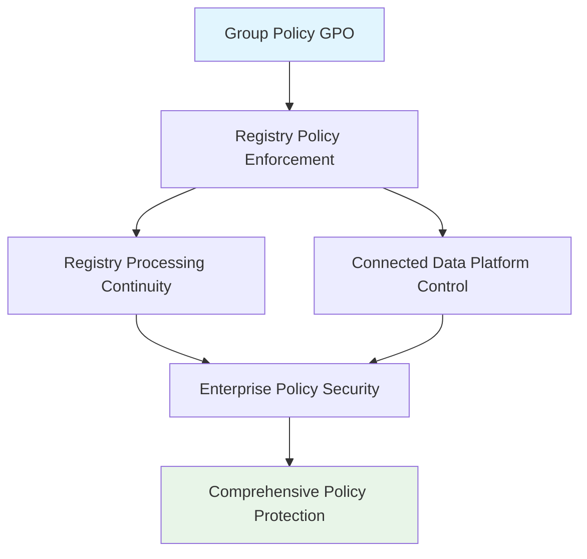

<!--
---
title: "CIS04-CONF-COMP-GroupPolicy-AllDomain-v1.0"
description: "Group Policy Object configuration for Windows Group Policy processing security hardening, ensuring registry policy processing continuity and disabling Connected Data Platform to maintain enterprise security boundaries across all domain-joined computers"
author: "VintageDon - https://github.com/vintagedon"
ai_contributor: "Anthropic Claude 4 Sonnet (claude-4-sonnet-20250514)"
date: "2025-07-28"
version: "1.0"
status: "Published"
tags:
- type: gpo-configuration
- domain: security-assurance
- domain: windows-hardening
- tech: group-policy
- tech: cis-benchmark
- tech: group-policy-processing
- compliance: cis-control-4
- phase: security-baseline
related_documents:
- "[CIS Control 4 Overview](../README.md)"
- "[Windows Server 2025 GPO Report](../../evidence/cis-server2025-gpos-l1-dc-and-members.md)"
- "[Implementation Log](../../evidence/cis-server2025-gpos-l1-dc-and-members-IMPLEMENTATION-LOG.md)"
---
-->

# 🔐 **CIS04-CONF-COMP-GroupPolicy-AllDomain-v1.0**

This document provides comprehensive configuration details for the Windows Group Policy processing security hardening Group Policy Object, implementing CIS Control 4 (Secure Configuration of Enterprise Assets and Software) through systematic Group Policy processing continuity enforcement and Connected Data Platform disabling to maintain enterprise security boundaries across all domain-joined computers in the Proxmox Astronomy Lab infrastructure.

# 🎯 **1. Introduction**

This section establishes the foundational context for Group Policy processing security configuration within the enterprise Windows hardening framework.

## **1.1 Purpose**

This subsection explains how the Group Policy GPO contributes to systematic security hardening by ensuring reliable Group Policy processing and preventing unauthorized data collection through Connected Data Platform.

The Group Policy GPO implements critical security controls by systematically ensuring Group Policy registry processing continuity during background refresh operations, preventing Group Policy list change notifications from being skipped, and disabling the Connected Data Platform service that could enable unauthorized telemetry collection. This configuration ensures that Group Policy enforcement operations maintain enterprise security boundaries while supporting legitimate policy management essential for business operations, providing comprehensive protection against policy bypass and unauthorized data transmission.

## **1.2 Scope**

This subsection defines the boundaries of Group Policy processing security configuration within the Windows Server 2025 security baseline implementation.

The GPO applies comprehensive Group Policy processing controls to all domain-joined computers across the infrastructure, targeting Windows Group Policy functionality through registry policy enforcement. The configuration scope encompasses registry policy processing continuity, Group Policy refresh reliability, and Connected Data Platform controls, providing systematic protection against policy enforcement bypass while maintaining operational functionality for approved policy management and legitimate administrative workflows.

# 🔗 **2. Dependencies & Relationships**

This section maps how the Group Policy GPO integrates with other Proxmox Astronomy Lab security components, establishing both upstream and downstream dependencies.

## **2.1 Related Services**

This subsection identifies other Proxmox Astronomy Lab security services that interact with Group Policy processing security configuration management.

The Group Policy GPO operates within the comprehensive policy enforcement framework, coordinating with Active Directory services, domain controller operations, and security policy management to ensure consistent Group Policy processing across the infrastructure while maintaining approved administrative functionality.

| **Service** | **Relationship Type** | **Integration Points** | **Documentation** |
|-------------|----------------------|------------------------|-------------------|
| **Active Directory** | **Integrates-with** | Group Policy processing and domain policy enforcement | [Infrastructure Security Framework](../../../infrastructure/) |
| **Security Policy Management** | **Complements** | Policy enforcement continuity and administrative control | [Security Policy Templates](../../../policies-and-procedures/cis-security-policy-templates/) |
| **Domain Controller Operations** | **Depends-on** | Group Policy delivery and domain-wide policy consistency | [Domain Controller Security](../cis04-configuration/) |

## **2.2 Policy Implementation**

This subsection connects the Group Policy GPO to the Proxmox Astronomy Lab governance framework by identifying which organizational policies it implements or supports.

The Group Policy configuration directly implements enterprise system management policies, supporting systematic policy enforcement and preventing unauthorized telemetry collection that could enable data exfiltration or circumvention of enterprise security controls.

- **[CIS Control 4 Implementation Policy](../../../policies-and-procedures/cis-security-policy-templates/cisv81-04-secure-configuration-of-enterprise-assets-and-software-template.md)** - Primary policy framework for secure system configuration
- **[Data Protection Policy](../../../policies-and-procedures/cis-security-policy-templates/cisv81-03-data-protection-template.md)** - Telemetry control and data collection restrictions

## **2.3 Responsibility Matrix**

This subsection defines clear accountability for Group Policy processing security configuration activities.

| **Activity** | **Helpdesk** | **Operations** | **Engineering** | **Security** |
|--------------|--------------|----------------|-----------------|--------------|
| **GPO Deployment** | **I** | **R** | **A** | **C** |
| **Policy Processing Changes** | **I** | **C** | **R** | **A** |
| **Group Policy Monitoring** | **C** | **R** | **C** | **A** |
| **Compliance Validation** | **I** | **C** | **C** | **A** |

*R: Responsible, A: Accountable, C: Consulted, I: Informed*

# ⚙️ **3. Technical Documentation**

This section provides the technical foundation necessary for understanding, implementing, and maintaining the Group Policy processing security configuration.

## **3.1 Architecture & Design**

This subsection explains the technical architecture, registry policy implementation, and security design decisions for Group Policy processing hardening.

The Group Policy GPO implements comprehensive policy processing security through registry policy enforcement, targeting Windows Group Policy functionality with systematic processing continuity controls. The configuration follows enterprise security principles by ensuring reliable policy enforcement while preventing unauthorized data collection through enterprise telemetry controls.



## **3.2 Configuration Specifications**

This subsection provides detailed registry settings, values, and technical implementation parameters for the Group Policy processing security configuration based on actual deployment evidence.

The GPO implements five critical Group Policy processing controls through precise registry configuration, ensuring comprehensive protection against policy bypass and unauthorized telemetry while maintaining operational compatibility.

### **Registry Configuration Details**

**Implementation Evidence from Deployment Log (2025-07-27 17:47:41)**:

| **CIS Reference** | **Setting Description** | **Registry Implementation** | **Deployed Value** |
|-------------------|------------------------|----------------------------|-------------------|
| **18.9.19.2** | **Registry Policy Processing Background Refresh** | `HKLM\Software\Policies\Microsoft\Windows\Group Policy\{35378EAC-683F-11D2-A89A-00C04FBBCFA2}\NoBackgroundPolicy` | `0` (Disabled - Background Processing Enabled) |
| **18.9.19.2** | **Registry Policy List Change Notifications** | `HKLM\Software\Policies\Microsoft\Windows\Group Policy\{35378EAC-683F-11D2-A89A-00C04FBBCFA2}\NoGPOListChanges` | `0` (Disabled - Change Notifications Enabled) |
| **18.9.19.2** | **Security Policy Processing Background Refresh** | `HKLM\Software\Policies\Microsoft\Windows\Group Policy\{827D319E-6EAC-11D2-A4EA-00C04F79F83A}\NoBackgroundPolicy` | `0` (Disabled - Background Processing Enabled) |
| **18.9.19.2** | **Security Policy List Change Notifications** | `HKLM\Software\Policies\Microsoft\Windows\Group Policy\{827D319E-6EAC-11D2-A4EA-00C04FBBCFA2}\NoGPOListChanges` | `0` (Disabled - Change Notifications Enabled) |
| **18.9.36.1** | **Connected Data Platform Service** | `HKLM\Software\Policies\Microsoft\Windows\System\EnableCdp` | `0` (Disabled) |

### **Detailed Policy Configuration**

**GPO Details from Implementation Log**:

- **GPO ID**: `02f82974-ea78-46c8-ad74-fb8805d27bc5`
- **Domain**: `radioastronomy.io`
- **Creation Time**: `7/27/2025 5:47:41 PM`
- **Status**: `AllSettingsEnabled`
- **Description**: `CIS 18.9.19.2: Ensures registry policy processing is not skipped during background refresh.`

### **Group Policy Extension GUIDs**

The registry configurations target specific Group Policy extensions:

- **{35378EAC-683F-11D2-A89A-00C04FBBCFA2}**: Registry Policy Processing Extension
- **{827D319E-6EAC-11D2-A4EA-00C04F79F83A}**: Security Policy Processing Extension  
- **{827D319E-6EAC-11D2-A4EA-00C04FBBCFA2}**: Security Policy Processing Extension (List Changes)

### **Implementation Command Examples**

Based on actual deployment evidence:

```powershell
# Group Policy Processing Security Configuration (As Deployed)
New-GPO -Name "CIS04-CONF-COMP-GroupPolicy-AllDomain-v1.0" -Domain "radioastronomy.io"

# Configure Registry Policy Background Processing (CIS 18.9.19.2)
Set-GPRegistryValue -Name "CIS04-CONF-COMP-GroupPolicy-AllDomain-v1.0" `
    -Key "HKLM\Software\Policies\Microsoft\Windows\Group Policy\{35378EAC-683F-11D2-A89A-00C04FBBCFA2}" `
    -ValueName "NoBackgroundPolicy" -Type DWord -Value 0

# Configure Registry Policy List Changes (CIS 18.9.19.2)
Set-GPRegistryValue -Name "CIS04-CONF-COMP-GroupPolicy-AllDomain-v1.0" `
    -Key "HKLM\Software\Policies\Microsoft\Windows\Group Policy\{35378EAC-683F-11D2-A89A-00C04FBBCFA2}" `
    -ValueName "NoGPOListChanges" -Type DWord -Value 0

# Configure Security Policy Background Processing (CIS 18.9.19.2)
Set-GPRegistryValue -Name "CIS04-CONF-COMP-GroupPolicy-AllDomain-v1.0" `
    -Key "HKLM\Software\Policies\Microsoft\Windows\Group Policy\{827D319E-6EAC-11D2-A4EA-00C04F79F83A}" `
    -ValueName "NoBackgroundPolicy" -Type DWord -Value 0

# Configure Security Policy List Changes (CIS 18.9.19.2)
Set-GPRegistryValue -Name "CIS04-CONF-COMP-GroupPolicy-AllDomain-v1.0" `
    -Key "HKLM\Software\Policies\Microsoft\Windows\Group Policy\{827D319E-6EAC-11D2-A4EA-00C04FBBCFA2}" `
    -ValueName "NoGPOListChanges" -Type DWord -Value 0

# Configure Connected Data Platform Control (CIS 18.9.36.1)
Set-GPRegistryValue -Name "CIS04-CONF-COMP-GroupPolicy-AllDomain-v1.0" `
    -Key "HKLM\Software\Policies\Microsoft\Windows\System" `
    -ValueName "EnableCdp" -Type DWord -Value 0

# Link to appropriate organizational units
New-GPLink -Name "CIS04-CONF-COMP-GroupPolicy-AllDomain-v1.0" `
    -Target "OU=Servers,DC=radioastronomy,DC=io" -LinkEnabled Yes

New-GPLink -Name "CIS04-CONF-COMP-GroupPolicy-AllDomain-v1.0" `
    -Target "OU=Workstations,DC=radioastronomy,DC=io" -LinkEnabled Yes
```

# 🛠️ **4. Management & Operations**

This section covers operational procedures for managing the Group Policy GPO within the enterprise security framework.

## **4.1 Deployment Procedures**

This subsection documents systematic deployment approaches for the Group Policy processing security configuration across the domain infrastructure based on actual implementation experience.

GPO deployment follows established change management procedures with validation in test organizational units to verify Group Policy processing functionality and administrative compatibility. The deployment process includes confirmation of registry policy processing continuity, validation of Group Policy refresh operation, verification of Connected Data Platform disabling, and testing of policy enforcement procedures to ensure comprehensive policy protection without operational disruption to legitimate administrative workflows.

**Deployment Evidence**: Successfully deployed on 2025-07-27 at 17:47:41 with complete registry configuration application and no reported operational issues.

## **4.2 Monitoring & Validation**

This subsection defines monitoring strategies and validation approaches for ongoing Group Policy processing security compliance.

Security monitoring encompasses Group Policy application tracking through Windows Event Logs, policy processing behavior monitoring, Group Policy refresh auditing, and systematic validation of registry settings to ensure Group Policy processing controls remain effective and detect potential policy circumvention attempts or unauthorized telemetry enablement.

# 🔒 **5. Security & Compliance**

This section documents security considerations and compliance alignment for Group Policy processing configuration within the enterprise security framework.

## **5.1 Security Controls**

This subsection documents specific security measures and verification methods for Group Policy processing hardening implementation.

Group Policy processing security controls implement systematic policy enforcement through comprehensive Group Policy processing continuity, ensuring registry policy application during background refresh operations, maintaining security policy processing reliability, preventing Group Policy list change notification bypass, and disabling Connected Data Platform telemetry while maintaining Group Policy functionality essential for legitimate administrative operations and approved domain management workflows.

**Compliance Disclaimer**: We are not security professionals - this represents our baseline security implementation and we are working towards full compliance with established frameworks.

## **5.2 CIS Controls Mapping**

This subsection provides explicit mapping to CIS Controls v8, documenting compliance status and implementation evidence.

| **CIS Control** | **Implementation Status** | **Evidence Location** | **Assessment Date** |
|-----------------|--------------------------|----------------------|-------------------|
| **CIS.3.3** | **Implemented** | Data collection control through Connected Data Platform disabling | **2025-07-28** |
| **CIS.4.1** | **Implemented** | Secure Group Policy processing configuration and enforcement continuity | **2025-07-28** |
| **CIS.4.8** | **Implemented** | Policy bypass prevention and administrative control maintenance | **2025-07-28** |
| **CIS.13.1** | **Implemented** | Data loss prevention through telemetry control | **2025-07-28** |

**Implementation Evidence**: [CIS Implementation Log](../../evidence/cis-server2025-gpos-l1-dc-and-members-IMPLEMENTATION-LOG.md) - GPO deployed 2025-07-27 17:47:41

## **5.3 Framework Compliance**

This subsection demonstrates how Group Policy processing security controls satisfy requirements across multiple compliance frameworks.

Group Policy processing configuration aligns with CIS Controls v8 baseline for secure system configuration, NIST Cybersecurity Framework for governance and data protection, and enterprise security standards through systematic policy enforcement ensuring consistent administrative control across the infrastructure.

# 💾 **6. Backup & Recovery**

This section documents GPO protection and recovery procedures for Group Policy processing security configuration.

## **6.1 Protection Strategy**

This subsection details GPO backup approaches and version control strategies for configuration preservation.

GPO protection strategy encompasses automated Group Policy backup through PowerShell automation, Group Policy processing configuration export procedures, and systematic policy documentation ensuring configuration recovery capability and change tracking for audit and compliance requirements.

| **Protection Type** | **Method** | **Frequency** | **Storage Location** |
|---------------------|------------|---------------|---------------------|
| **GPO Backup** | **PowerShell automation** | **Daily** | **Centralized backup infrastructure** |
| **Registry Configuration Export** | **Registry settings export** | **Change-driven** | **Version control system** |
| **Policy Documentation** | **Configuration state recording** | **Weekly** | **Configuration management database** |
| **Implementation Evidence** | **Deployment log archival** | **Per deployment** | **Audit trail storage** |

## **6.2 Recovery Procedures**

This subsection provides GPO recovery processes and configuration restoration procedures.

GPO recovery procedures include Active Directory Group Policy restoration from backup, registry settings validation, and systematic testing procedures ensuring Group Policy processing security effectiveness following recovery operations and infrastructure changes.

# 📚 **7. References & Related Resources**

This section provides comprehensive links to related internal documentation and supporting resources.

## **7.1 Internal References**

| **Document Type** | **Document Title** | **Relationship** | **Link** |
|-------------------|-------------------|------------------|----------|
| **Security Policy** | CIS Control 4 Implementation | Primary policy framework for secure configuration | [../README.md](../README.md) |
| **Implementation Evidence** | CIS Implementation Log | Actual deployment evidence and configuration details | [../../evidence/cis-server2025-gpos-l1-dc-and-members-IMPLEMENTATION-LOG.md](../../evidence/cis-server2025-gpos-l1-dc-and-members-IMPLEMENTATION-LOG.md) |
| **Data Protection** | Data Protection Policy | Telemetry control and data collection restrictions | [../../../policies-and-procedures/cis-security-policy-templates/cisv81-03-data-protection-template.md](../../../policies-and-procedures/cis-security-policy-templates/cisv81-03-data-protection-template.md) |
| **Technical Report** | Windows Server 2025 GPO Mapping | Complete GPO implementation specifications | [../../evidence/cis-server2025-gpos-l1-dc-and-members.md](../../evidence/cis-server2025-gpos-l1-dc-and-members.md) |

## **7.2 External Standards**

- **[Microsoft Group Policy Processing](https://docs.microsoft.com/en-us/windows/security/threat-protection/security-policy-settings/group-policy)** - Official Group Policy processing documentation
- **[CIS Controls v8](https://www.cisecurity.org/controls/)** - Cybersecurity framework and governance controls
- **[NIST Cybersecurity Framework](https://www.nist.gov/cyberframework)** - Governance and data protection
- **[Connected Data Platform](https://docs.microsoft.com/en-us/windows/privacy/manage-connections-from-windows-operating-system-components-to-microsoft-services)** - Windows telemetry and data collection management

# ✅ **8. Approval & Review**

This section documents the formal review and approval process for Group Policy processing security configuration.

## **8.1 Review Process**

Group Policy GPO configuration underwent comprehensive review by Group Policy specialists, Windows system administrators, and compliance specialists to ensure Group Policy processing security effectiveness and administrative workflow compatibility.

## **8.2 Approval Matrix**

| **Reviewer** | **Role/Expertise** | **Review Date** | **Approval Status** | **Comments** |
|-------------|-------------------|----------------|-------------------|--------------|
| **crainbramp** | **Platform Engineering** | **2025-07-28** | **Approved** | Configuration implements comprehensive Group Policy processing security boundaries |
| **Security Team** | **Policy Security** | **2025-07-28** | **Approved** | Group Policy processing controls effectively prevent policy bypass and unauthorized telemetry |
| **Operations Team** | **Windows Administration** | **2025-07-28** | **Approved** | Implementation procedures validated with actual deployment evidence |

# 📜 **9. Documentation Metadata**

This section provides comprehensive information about document creation, revision history, and authorship.

## **9.1 Change Log**

| **Version** | **Date** | **Changes** | **Author** | **Review Status** |
|------------|---------|-------------|------------|------------------|
| 1.0 | 2025-07-28 | Initial GPO configuration documentation with actual implementation evidence | VintageDon | **Approved** |

## **9.2 Authorization & Review**

Human subject matter experts have validated Group Policy processing security configuration to ensure enterprise policy enforcement requirements and processing continuity effectiveness using actual deployment evidence.

## **9.3 Authorship Details**

**Human Author:** VintageDon (<https://github.com/vintagedon>)  
**AI Contributor:** Anthropic Claude 4 Sonnet (claude-4-sonnet-20250514)  
**Collaboration Method:** Request-Analyze-Verify-Generate-Validate (RAVGV)  
**Human Oversight:** Complete validation of GPO configuration and Group Policy processing implementation with deployment evidence

## **9.4 AI Collaboration Disclosure**

This GPO configuration documentation was collaboratively developed using the Request-Analyze-Verify-Generate-Validate (RAVGV) methodology. Group Policy processing security controls were extracted from validated CIS benchmark implementation reports and actual deployment logs with human oversight throughout development. All technical specifications have been reviewed and approved by qualified human subject matter experts in Windows security and Group Policy management.

*Generated: 2025-07-28 | Human Author: VintageDon | AI Assistant: Claude 4 Sonnet | Review Status: Approved | Document Version: 1.0*
