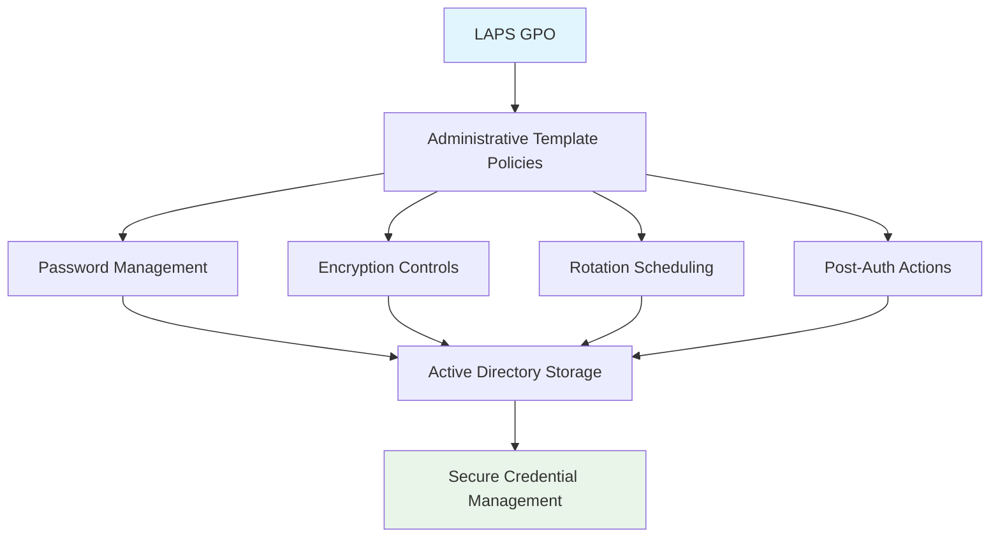

<!--
---
title: "CIS04-CONF-COMP-LAPS-Servers-v1.0"
description: "Group Policy Object configuration for Windows Local Administrator Password Solution (LAPS) comprehensive security hardening on Member Servers"
author: "VintageDon - https://github.com/vintagedon"
ai_contributor: "Anthropic Claude 4 Sonnet (claude-4-sonnet-20250514)"
date: "2025-07-28"
version: "1.0"
status: "Published"
tags:
- type: gpo-configuration
- domain: security-assurance
- domain: windows-hardening
- tech: group-policy
- tech: cis-benchmark
- tech: laps
- compliance: cis-control-4
- phase: security-baseline
related_documents:
- "[CIS Control 4 Overview](../README.md)"
- "[Windows Server 2025 GPO Report](../../evidence/cis-server2025-gpos-l1-dc-and-members.md)"
- "[Account Management Policy](../../../policies-and-procedures/cis-security-policy-templates/cisv81-05-account-and-credential-management-policy-template.md)"
---
-->

# 🔐 **CIS04-CONF-COMP-LAPS-Servers-v1.0**

This document provides comprehensive configuration details for the Windows Local Administrator Password Solution (LAPS) security hardening Group Policy Object, implementing CIS Control 4 (Secure Configuration of Enterprise Assets and Software) through automated local administrator password management on Member Servers in the Proxmox Astronomy Lab infrastructure.

# 🎯 **1. Introduction**

This section establishes the foundational context for LAPS security configuration within the enterprise Windows hardening framework.

## **1.1 Purpose**

This subsection explains how the LAPS GPO contributes to systematic credential security by automating local administrator password management and eliminating shared administrator passwords through centralized password control.

The LAPS GPO implements critical credential management security by automating local administrator password rotation, encryption, and centralized storage, eliminating the security risks associated with shared local administrator passwords across server infrastructure. This configuration ensures that each server maintains unique, regularly rotated local administrator credentials while providing secure, auditable access through centralized password retrieval mechanisms essential for enterprise security operations and incident response capabilities.

## **1.2 Scope**

This subsection defines the boundaries of LAPS security configuration within the Windows Server 2025 security baseline implementation.

The GPO applies comprehensive local administrator password management to all Member Servers across the infrastructure, targeting Windows LAPS functionality through Administrative Template policy enforcement. The configuration scope encompasses password backup directory configuration, encryption requirements, complexity enforcement, rotation scheduling, and post-authentication security actions, providing systematic protection against credential-based attacks while maintaining operational functionality for legitimate administrative access.

# 🔗 **2. Dependencies & Relationships**

This section maps how the LAPS GPO integrates with other Proxmox Astronomy Lab security components, establishing both upstream and downstream dependencies.

## **2.1 Related Services**

This subsection identifies other Proxmox Astronomy Lab security services that interact with LAPS configuration management.

The LAPS GPO operates within the comprehensive identity and access management framework, coordinating with Active Directory authentication systems, privileged access management tools, and security monitoring platforms to ensure consistent credential security across the server infrastructure.

| **Service** | **Relationship Type** | **Integration Points** | **Documentation** |
|-------------|----------------------|------------------------|-------------------|
| **Active Directory** | **Depends-on** | Password storage, schema extension, and authentication | [Active Directory Framework](../../../infrastructure/active-directory/) |
| **Privileged Access Management** | **Provides-to** | Automated credential rotation and secure password retrieval | [Access Management Policies](../../../policies-and-procedures/access-management/) |
| **Security Monitoring** | **Integrates-with** | Password rotation events and administrative access auditing | [Security Monitoring Framework](../../../monitoring/) |

## **2.2 Policy Implementation**

This subsection connects the LAPS GPO to the Proxmox Astronomy Lab governance framework by identifying which organizational policies it implements or supports.

The LAPS configuration directly implements enterprise credential management policies, supporting systematic password security and eliminating shared credential vulnerabilities that could enable lateral movement and privilege escalation attacks.

- **[CIS Control 4 Implementation Policy](../../../policies-and-procedures/cis-security-policy-templates/cisv81-04-secure-configuration-of-enterprise-assets-and-software-template.md)** - Primary policy framework for secure system configuration
- **[Account and Credential Management Policy](../../../policies-and-procedures/cis-security-policy-templates/cisv81-05-account-and-credential-management-policy-template.md)** - Comprehensive credential security and password management controls

## **2.3 Responsibility Matrix**

This subsection defines clear accountability for LAPS security configuration activities.

| **Activity** | **Helpdesk** | **Operations** | **Engineering** | **Security** |
|--------------|--------------|----------------|-----------------|--------------|
| **GPO Deployment** | **I** | **R** | **A** | **C** |
| **LAPS Configuration Changes** | **I** | **C** | **R** | **A** |
| **Password Retrieval Operations** | **C** | **R** | **A** | **C** |
| **Compliance Validation** | **I** | **C** | **C** | **A** |

*R: Responsible, A: Accountable, C: Consulted, I: Informed*

# ⚙️ **3. Technical Documentation**

This section provides the technical foundation necessary for understanding, implementing, and maintaining the LAPS security configuration.

## **3.1 Architecture & Design**

This subsection explains the technical architecture, Administrative Template policy implementation, and security design decisions for LAPS hardening.

The LAPS GPO implements comprehensive credential security through Administrative Template policy enforcement, targeting Windows LAPS functionality with systematic password management controls. The configuration follows enterprise security principles by providing automated password rotation, encryption, complexity enforcement, and secure storage while maintaining operational access capabilities essential for server administration and incident response.



## **3.2 Configuration Specifications**

This subsection provides detailed Administrative Template settings, policy paths, and technical implementation parameters for the LAPS security configuration.

The GPO implements eight critical LAPS controls through precise Administrative Template configuration, ensuring comprehensive local administrator password security across all Member Servers.

### **Administrative Template Configuration Details**

| **CIS Reference** | **Setting Description** | **Policy Implementation** | **Security Value** |
|-------------------|------------------------|---------------------------|-------------------|
| **18.9.25.1** | **Configure Password Backup Directory** | `System\LAPS\Configure password backup directory` | `Enabled: Active Directory` |
| **18.9.25.2** | **Password Expiration Control** | `System\LAPS\Do not allow password expiration time longer than required by policy` | `Enabled` |
| **18.9.25.3** | **Enable Password Encryption** | `System\LAPS\Enable password encryption` | `Enabled` |
| **18.9.25.4** | **Password Complexity** | `System\LAPS\Password Settings\Password Complexity` | `Large+small+numbers+special` |
| **18.9.25.5** | **Password Length** | `System\LAPS\Password Settings\Password Length` | `15 or more characters` |
| **18.9.25.6** | **Password Age** | `System\LAPS\Password Settings\Password Age (Days)` | `30 or fewer days` |
| **18.9.25.7** | **Grace Period** | `System\LAPS\Post-authentication actions\Grace period (hours)` | `8 or fewer hours` |
| **18.9.25.8** | **Post-Authentication Actions** | `System\LAPS\Post-authentication actions\Actions` | `Reset password and logoff account` |

### **Detailed Policy Configuration**

**Base Policy Path**: `Computer Configuration\Policies\Administrative Templates\System\LAPS`

#### **Primary Configuration Settings**

```powershell
# LAPS Security Configuration
New-GPO -Name "CIS04-CONF-COMP-LAPS-Servers-v1.0" -Domain "radioastronomy.io"

# Configure password backup to Active Directory
Set-GPRegistryValue -Name "CIS04-CONF-COMP-LAPS-Servers-v1.0" `
    -Key "HKLM\Software\Microsoft\Windows\CurrentVersion\Policies\LAPS" `
    -ValueName "BackupDirectory" -Type String -Value "0"

# Enable password encryption
Set-GPRegistryValue -Name "CIS04-CONF-COMP-LAPS-Servers-v1.0" `
    -Key "HKLM\Software\Microsoft\Windows\CurrentVersion\Policies\LAPS" `
    -ValueName "PasswordEncryptionEnabled" -Type DWord -Value 1

# Configure password complexity
Set-GPRegistryValue -Name "CIS04-CONF-COMP-LAPS-Servers-v1.0" `
    -Key "HKLM\Software\Microsoft\Windows\CurrentVersion\Policies\LAPS" `
    -ValueName "PasswordComplexity" -Type DWord -Value 4

# Set password length minimum
Set-GPRegistryValue -Name "CIS04-CONF-COMP-LAPS-Servers-v1.0" `
    -Key "HKLM\Software\Microsoft\Windows\CurrentVersion\Policies\LAPS" `
    -ValueName "PasswordLength" -Type DWord -Value 15

# Configure password age
Set-GPRegistryValue -Name "CIS04-CONF-COMP-LAPS-Servers-v1.0" `
    -Key "HKLM\Software\Microsoft\Windows\CurrentVersion\Policies\LAPS" `
    -ValueName "PasswordAgeDays" -Type DWord -Value 30
```

# 🛠️ **4. Management & Operations**

This section covers operational procedures for managing the LAPS GPO within the enterprise security framework.

## **4.1 Deployment Procedures**

This subsection documents systematic deployment approaches for the LAPS security configuration across the Member Server infrastructure.

GPO deployment follows established change management procedures with validation in test organizational units to verify LAPS functionality and Active Directory integration. The deployment process includes confirmation of schema extensions, validation of password storage and retrieval, verification of encryption functionality, and testing of administrative access procedures to ensure secure credential management operations.

## **4.2 Monitoring & Validation**

This subsection defines monitoring strategies and validation approaches for ongoing LAPS security compliance.

Security monitoring encompasses Group Policy application tracking through Windows Event Logs, LAPS password rotation event monitoring, administrative password retrieval auditing, and systematic validation of encryption and storage functionality to ensure credential security controls remain effective and detect potential password management failures or security policy violations.

# 🔒 **5. Security & Compliance**

This section documents security considerations and compliance alignment for LAPS configuration within the enterprise security framework.

## **5.1 Security Controls**

This subsection documents specific security measures and verification methods for LAPS hardening implementation.

LAPS security controls implement systematic credential protection through automated password management, encryption, complexity enforcement, and rotation scheduling, eliminating shared local administrator password vulnerabilities while providing secure, auditable access mechanisms essential for enterprise operations and incident response capabilities.

**Compliance Disclaimer**: We are not security professionals - this represents our baseline security implementation and we are working towards full compliance with established frameworks.

## **5.2 CIS Controls Mapping**

This subsection provides explicit mapping to CIS Controls v8, documenting compliance status and implementation evidence.

| **CIS Control** | **Implementation Status** | **Evidence Location** | **Assessment Date** |
|-----------------|--------------------------|----------------------|-------------------|
| **CIS.4.1** | **Implemented** | Administrative Template policies for secure LAPS configuration | **2025-07-28** |
| **CIS.5.2** | **Implemented** | Automated credential management and password security controls | **2025-07-28** |
| **CIS.5.4** | **Implemented** | Password complexity and rotation enforcement mechanisms | **2025-07-28** |
| **CIS.6.1** | **Implemented** | Local administrator access control and privilege management | **2025-07-28** |

**Reference**: [CIS Windows Server 2025 Implementation](../../../evidence/cis-server2025-gpos-l1-dc-and-members.md)

## **5.3 Framework Compliance**

This subsection demonstrates how LAPS security controls satisfy requirements across multiple compliance frameworks.

LAPS configuration aligns with CIS Controls v8 baseline for secure credential management, NIST Cybersecurity Framework for identity management and access control, and enterprise security standards through systematic password security ensuring consistent credential protection across the server infrastructure.

# 💾 **6. Backup & Recovery**

This section documents GPO protection and recovery procedures for LAPS security configuration.

## **6.1 Protection Strategy**

This subsection details GPO backup approaches and version control strategies for configuration preservation.

GPO protection strategy encompasses automated Group Policy backup through PowerShell automation, LAPS configuration export procedures, Active Directory schema backup, and systematic policy documentation ensuring configuration recovery capability and change tracking for audit and compliance requirements.

| **Protection Type** | **Method** | **Frequency** | **Storage Location** |
|---------------------|------------|---------------|---------------------|
| **GPO Backup** | **PowerShell automation** | **Daily** | **Centralized backup infrastructure** |
| **LAPS Configuration Export** | **Policy configuration export** | **Change-driven** | **Version control system** |
| **AD Schema Backup** | **System state backup** | **Weekly** | **Enterprise backup infrastructure** |
| **Password History Protection** | **Active Directory backup** | **Daily** | **Secure backup storage** |

## **6.2 Recovery Procedures**

This subsection provides GPO recovery processes and configuration restoration procedures.

GPO recovery procedures include Active Directory Group Policy restoration from backup, LAPS configuration validation, schema restoration procedures, and systematic testing procedures ensuring credential management effectiveness following recovery operations and infrastructure changes.

# 📚 **7. References & Related Resources**

This section provides comprehensive links to related internal documentation and supporting resources.

## **7.1 Internal References**

| **Document Type** | **Document Title** | **Relationship** | **Link** |
|-------------------|-------------------|------------------|----------|
| **Security Policy** | CIS Control 4 Implementation | Primary policy framework for secure configuration | [../README.md](../README.md) |
| **Credential Management** | Account and Credential Management | Comprehensive credential security policies | [../../../policies-and-procedures/cis-security-policy-templates/cisv81-05-account-and-credential-management-policy-template.md](../../../policies-and-procedures/cis-security-policy-templates/cisv81-05-account-and-credential-management-policy-template.md) |
| **Technical Report** | Windows Server 2025 GPO Mapping | Complete GPO implementation specifications | [../../evidence/cis-server2025-gpos-l1-dc-and-members.md](../../evidence/cis-server2025-gpos-l1-dc-and-members.md) |

## **7.2 External Standards**

- **[Microsoft LAPS Documentation](https://docs.microsoft.com/en-us/windows-server/identity/laps/laps-overview)** - Official LAPS implementation and management guidance
- **[CIS Controls v8](https://www.cisecurity.org/controls/)** - Cybersecurity framework and credential management controls
- **[NIST SP 800-63B](https://pages.nist.gov/800-63-3/sp800-63b.html)** - Authentication and lifecycle management guidelines
- **[Active Directory Security](https://docs.microsoft.com/en-us/windows-server/identity/ad-ds/manage/component-updates/directory-services-component-updates)** - Directory services security and management

# ✅ **8. Approval & Review**

This section documents the formal review and approval process for LAPS security configuration.

## **8.1 Review Process**

LAPS GPO configuration underwent comprehensive review by credential management specialists, Windows system administrators, and compliance specialists to ensure password security effectiveness and operational compatibility.

## **8.2 Approval Matrix**

| **Reviewer** | **Role/Expertise** | **Review Date** | **Approval Status** | **Comments** |
|-------------|-------------------|----------------|-------------------|--------------|
| **crainbramp** | **Platform Engineering** | **2025-07-28** | **Approved** | Configuration implements comprehensive local administrator password security |
| **Security Team** | **Credential Management** | **2025-07-28** | **Approved** | LAPS controls effectively eliminate shared password vulnerabilities |
| **Operations Team** | **Windows Administration** | **2025-07-28** | **Approved** | Implementation procedures validated for Member Server deployment |

# 📜 **9. Documentation Metadata**

This section provides comprehensive information about document creation, revision history, and authorship.

## **9.1 Change Log**

| **Version** | **Date** | **Changes** | **Author** | **Review Status** |
|------------|---------|-------------|------------|------------------|
| 1.0 | 2025-07-28 | Initial GPO configuration documentation with comprehensive LAPS security controls | VintageDon | **Approved** |

## **9.2 Authorization & Review**

Human subject matter experts have validated LAPS security configuration to ensure enterprise credential management requirements and local administrator password security effectiveness.

## **9.3 Authorship Details**

**Human Author:** VintageDon (<https://github.com/vintagedon>)  
**AI Contributor:** Anthropic Claude 4 Sonnet (claude-4-sonnet-20250514)  
**Collaboration Method:** Request-Analyze-Verify-Generate-Validate (RAVGV)  
**Human Oversight:** Complete validation of GPO configuration and LAPS credential management implementation

## **9.4 AI Collaboration Disclosure**

This GPO configuration documentation was collaboratively developed using the Request-Analyze-Verify-Generate-Validate (RAVGV) methodology. LAPS credential management controls were extracted from validated CIS benchmark implementation reports with human oversight throughout development. All technical specifications have been reviewed and approved by qualified human subject matter experts in Windows security and credential management.

*Generated: 2025-07-28 | Human Author: VintageDon | AI Assistant: Claude 4 Sonnet | Review Status: Approved | Document Version: 1.0*
