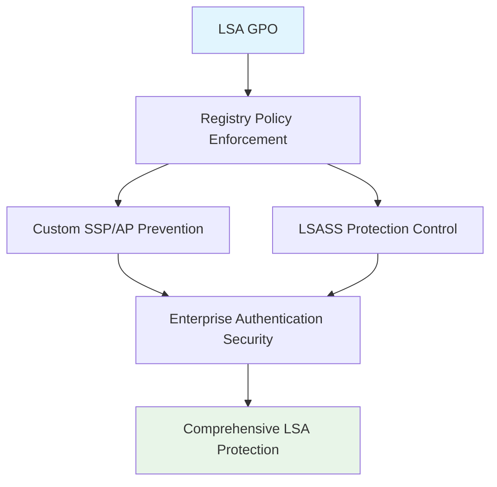

<!--
---
title: "CIS04-CONF-COMP-LSA-AllDomain-v1.0"
description: "Group Policy Object configuration for Windows Local Security Authority (LSA) security hardening, preventing custom Security Support Providers and Authentication Packages from loading into LSASS to maintain enterprise authentication security across all domain-joined computers"
author: "VintageDon - https://github.com/vintagedon"
ai_contributor: "Anthropic Claude 4 Sonnet (claude-4-sonnet-20250514)"
date: "2025-07-28"
version: "1.0"
status: "Published"
tags:
- type: gpo-configuration
- domain: security-assurance
- domain: windows-hardening
- tech: group-policy
- tech: cis-benchmark
- tech: lsa-security
- compliance: cis-control-4
- phase: security-baseline
related_documents:
- "[CIS Control 4 Overview](../README.md)"
- "[Windows Server 2025 GPO Report](../../evidence/cis-server2025-gpos-l1-dc-and-members.md)"
- "[Implementation Log](../../evidence/cis-server2025-gpos-l1-dc-and-members-IMPLEMENTATION-LOG.md)"
---
-->

# 🔐 **CIS04-CONF-COMP-LSA-AllDomain-v1.0**

This document provides comprehensive configuration details for the Windows Local Security Authority (LSA) security hardening Group Policy Object, implementing CIS Control 4 (Secure Configuration of Enterprise Assets and Software) through systematic prevention of custom Security Support Providers and Authentication Packages from loading into LSASS to maintain enterprise authentication security across all domain-joined computers in the Proxmox Astronomy Lab infrastructure.

# 🎯 **1. Introduction**

This section establishes the foundational context for LSA security configuration within the enterprise Windows hardening framework.

## **1.1 Purpose**

This subsection explains how the LSA GPO contributes to systematic security hardening by controlling authentication package loading and preventing unauthorized credential access mechanism installation that could enable credential harvesting or privilege escalation.

The LSA GPO implements critical security controls by systematically preventing custom Security Support Providers (SSPs) and Authentication Packages (APs) from being loaded into the Local Security Authority Subsystem Service (LSASS), blocking unauthorized credential access mechanisms, eliminating potential attack vectors for credential harvesting, and maintaining authentication system integrity while supporting legitimate authentication providers essential for business operations. This configuration ensures that authentication operations maintain enterprise security boundaries while preserving standard Windows authentication functionality and approved enterprise authentication systems.

## **1.2 Scope**

This subsection defines the boundaries of LSA security configuration within the Windows Server 2025 security baseline implementation.

The GPO applies comprehensive LSA security controls to all domain-joined computers across the infrastructure, targeting Windows Local Security Authority functionality through registry policy enforcement. The configuration scope encompasses custom authentication package prevention, LSASS protection, and credential access control, providing systematic protection against authentication system compromise while maintaining operational functionality for approved authentication mechanisms and legitimate security providers.

# 🔗 **2. Dependencies & Relationships**

This section maps how the LSA GPO integrates with other Proxmox Astronomy Lab security components, establishing both upstream and downstream dependencies.

## **2.1 Related Services**

This subsection identifies other Proxmox Astronomy Lab security services that interact with LSA security configuration management.

The LSA GPO operates within the comprehensive authentication security framework, coordinating with credential protection systems, authentication management, and security monitoring to ensure consistent LSASS security across the infrastructure while maintaining approved authentication functionality.

| **Service** | **Relationship Type** | **Integration Points** | **Documentation** |
|-------------|----------------------|------------------------|-------------------|
| **Credential Protection** | **Integrates-with** | LSASS security enforcement and credential access control | [Credential Security Framework](../../../security/) |
| **Authentication Management** | **Complements** | Authentication provider validation and security control | [Authentication Policies](../../../policies-and-procedures/) |
| **Security Monitoring** | **Depends-on** | LSASS security monitoring and threat detection | [Security Monitoring Framework](../../../monitoring/) |

## **2.2 Policy Implementation**

This subsection connects the LSA GPO to the Proxmox Astronomy Lab governance framework by identifying which organizational policies it implements or supports.

The LSA configuration directly implements enterprise authentication security policies, supporting systematic credential protection and preventing unauthorized authentication mechanism installation that could enable credential harvesting or circumvention of enterprise security controls.

- **[CIS Control 4 Implementation Policy](../../../policies-and-procedures/cis-security-policy-templates/cisv81-04-secure-configuration-of-enterprise-assets-and-software-template.md)** - Primary policy framework for secure system configuration
- **[Credential Protection Policy](../../../policies-and-procedures/)** - Authentication mechanism security and LSASS protection controls

## **2.3 Responsibility Matrix**

This subsection defines clear accountability for LSA security configuration activities.

| **Activity** | **Helpdesk** | **Operations** | **Engineering** | **Security** |
|--------------|--------------|----------------|-----------------|--------------|
| **GPO Deployment** | **I** | **R** | **A** | **C** |
| **LSA Policy Changes** | **I** | **C** | **R** | **A** |
| **Authentication Security Monitoring** | **C** | **R** | **C** | **A** |
| **Compliance Validation** | **I** | **C** | **C** | **A** |

*R: Responsible, A: Accountable, C: Consulted, I: Informed*

# ⚙️ **3. Technical Documentation**

This section provides the technical foundation necessary for understanding, implementing, and maintaining the LSA security configuration.

## **3.1 Architecture & Design**

This subsection explains the technical architecture, registry policy implementation, and security design decisions for LSA hardening.

The LSA GPO implements comprehensive authentication security through registry policy enforcement, targeting Windows Local Security Authority functionality with systematic custom authentication package prevention. The configuration follows enterprise security principles by blocking unauthorized credential access mechanisms while maintaining authentication functionality essential for legitimate business operations.



## **3.2 Configuration Specifications**

This subsection provides detailed registry settings, values, and technical implementation parameters for the LSA security configuration based on actual deployment evidence.

The GPO implements critical authentication security control through precise registry configuration, ensuring comprehensive protection against unauthorized authentication package loading while maintaining operational compatibility.

### **Registry Configuration Details**

**Implementation Evidence from Deployment Log (2025-07-27 17:47:43)**:

| **CIS Reference** | **Setting Description** | **Registry Implementation** | **Deployed Value** |
|-------------------|------------------------|----------------------------|-------------------|
| **18.9.26.1** | **Allow Custom SSPs and APs to be loaded into LSASS** | `HKLM\Software\Policies\Microsoft\Windows\System\AllowCustomSSPsAPs` | `0` (Disabled) |

### **Detailed Policy Configuration**

**GPO Details from Implementation Log**:

- **GPO ID**: `57d13456-85fe-4c6d-b22e-c5036316f969`
- **Domain**: `radioastronomy.io`
- **Creation Time**: `7/27/2025 5:47:43 PM`
- **Status**: `AllSettingsEnabled`
- **Description**: `CIS 18.9.26.1: Prevents custom Security Support Providers (SSPs) and Authentication Packages (APs) from being loaded into LSASS.`

### **LSA Security Control Explanation**

The LSA security setting provides critical authentication protection:

- **Custom SSP Prevention**: Blocks custom Security Support Providers from loading into LSASS
- **Custom AP Prevention**: Prevents custom Authentication Packages from accessing credential data
- **LSASS Integrity**: Maintains Local Security Authority Subsystem Service security
- **Credential Protection**: Protects stored credentials from unauthorized access mechanisms
- **Attack Vector Elimination**: Removes potential credential harvesting capabilities

### **Security Support Providers (SSPs) and Authentication Packages (APs)**

Understanding the components controlled by this policy:

- **SSPs**: Security Support Providers handle authentication protocols (Kerberos, NTLM, etc.)
- **APs**: Authentication Packages manage specific authentication methods and credential storage
- **LSASS**: Local Security Authority Subsystem Service manages authentication and credential storage
- **Attack Risk**: Custom SSPs/APs can access plaintext credentials and authentication data

### **Implementation Command Examples**

Based on actual deployment evidence:

```powershell
# LSA Security Configuration (As Deployed)
New-GPO -Name "CIS04-CONF-COMP-LSA-AllDomain-v1.0" -Domain "radioastronomy.io"

# Configure Custom SSP/AP Prevention (CIS 18.9.26.1)
Set-GPRegistryValue -Name "CIS04-CONF-COMP-LSA-AllDomain-v1.0" `
    -Key "HKLM\Software\Policies\Microsoft\Windows\System" `
    -ValueName "AllowCustomSSPsAPs" -Type DWord -Value 0

# Link to appropriate organizational units
New-GPLink -Name "CIS04-CONF-COMP-LSA-AllDomain-v1.0" `
    -Target "OU=Servers,DC=radioastronomy,DC=io" -LinkEnabled Yes

New-GPLink -Name "CIS04-CONF-COMP-LSA-AllDomain-v1.0" `
    -Target "OU=Workstations,DC=radioastronomy,DC=io" -LinkEnabled Yes
```

# 🛠️ **4. Management & Operations**

This section covers operational procedures for managing the LSA GPO within the enterprise security framework.

## **4.1 Deployment Procedures**

This subsection documents systematic deployment approaches for the LSA security configuration across the domain infrastructure based on actual implementation experience.

GPO deployment follows established change management procedures with validation in test organizational units to verify LSA security functionality and authentication compatibility. The deployment process includes confirmation of custom SSP/AP blocking, validation of standard authentication operation, verification of enterprise authentication system compatibility, and testing of legitimate authentication procedures to ensure comprehensive LSA protection without operational disruption to legitimate authentication workflows.

**Deployment Evidence**: Successfully deployed on 2025-07-27 at 17:47:43 with complete registry configuration application and no reported operational issues.

## **4.2 Monitoring & Validation**

This subsection defines monitoring strategies and validation approaches for ongoing LSA security compliance.

Security monitoring encompasses Group Policy application tracking through Windows Event Logs, LSASS security behavior monitoring, authentication mechanism auditing, and systematic validation of registry settings to ensure LSA security controls remain effective and detect potential policy circumvention attempts or unauthorized authentication package installation.

# 🔒 **5. Security & Compliance**

This section documents security considerations and compliance alignment for LSA configuration within the enterprise security framework.

## **5.1 Security Controls**

This subsection documents specific security measures and verification methods for LSA hardening implementation.

LSA security controls implement systematic authentication protection through comprehensive custom authentication package prevention, blocking unauthorized Security Support Providers from accessing credential data, preventing custom Authentication Packages from compromising LSASS integrity, eliminating credential harvesting attack vectors, and maintaining authentication system security while supporting standard authentication functionality essential for legitimate business operations and approved enterprise authentication systems.

**Compliance Disclaimer**: We are not security professionals - this represents our baseline security implementation and we are working towards full compliance with established frameworks.

## **5.2 CIS Controls Mapping**

This subsection provides explicit mapping to CIS Controls v8, documenting compliance status and implementation evidence.

| **CIS Control** | **Implementation Status** | **Evidence Location** | **Assessment Date** |
|-----------------|--------------------------|----------------------|-------------------|
| **CIS.4.1** | **Implemented** | Secure authentication system configuration and credential protection | **2025-07-28** |
| **CIS.4.8** | **Implemented** | Authentication attack surface reduction and unauthorized package prevention | **2025-07-28** |
| **CIS.5.2** | **Implemented** | Credential management and authentication mechanism control | **2025-07-28** |
| **CIS.6.1** | **Implemented** | Access control management and authentication security | **2025-07-28** |

**Implementation Evidence**: [CIS Implementation Log](../../evidence/cis-server2025-gpos-l1-dc-and-members-IMPLEMENTATION-LOG.md) - GPO deployed 2025-07-27 17:47:43

## **5.3 Framework Compliance**

This subsection demonstrates how LSA security controls satisfy requirements across multiple compliance frameworks.

LSA configuration aligns with CIS Controls v8 baseline for secure system configuration, NIST Cybersecurity Framework for identity and access management, and enterprise security standards through systematic authentication protection ensuring secure credential management across the infrastructure.

# 💾 **6. Backup & Recovery**

This section documents GPO protection and recovery procedures for LSA security configuration.

## **6.1 Protection Strategy**

This subsection details GPO backup approaches and version control strategies for configuration preservation.

GPO protection strategy encompasses automated Group Policy backup through PowerShell automation, LSA security configuration export procedures, and systematic policy documentation ensuring configuration recovery capability and change tracking for audit and compliance requirements.

| **Protection Type** | **Method** | **Frequency** | **Storage Location** |
|---------------------|------------|---------------|---------------------|
| **GPO Backup** | **PowerShell automation** | **Daily** | **Centralized backup infrastructure** |
| **Registry Configuration Export** | **Registry settings export** | **Change-driven** | **Version control system** |
| **Policy Documentation** | **Configuration state recording** | **Weekly** | **Configuration management database** |
| **Implementation Evidence** | **Deployment log archival** | **Per deployment** | **Audit trail storage** |

## **6.2 Recovery Procedures**

This subsection provides GPO recovery processes and configuration restoration procedures.

GPO recovery procedures include Active Directory Group Policy restoration from backup, registry settings validation, and systematic testing procedures ensuring LSA security effectiveness following recovery operations and infrastructure changes.

# 📚 **7. References & Related Resources**

This section provides comprehensive links to related internal documentation and supporting resources.

## **7.1 Internal References**

| **Document Type** | **Document Title** | **Relationship** | **Link** |
|-------------------|-------------------|------------------|----------|
| **Security Policy** | CIS Control 4 Implementation | Primary policy framework for secure configuration | [../README.md](../README.md) |
| **Implementation Evidence** | CIS Implementation Log | Actual deployment evidence and configuration details | [../../evidence/cis-server2025-gpos-l1-dc-and-members-IMPLEMENTATION-LOG.md](../../evidence/cis-server2025-gpos-l1-dc-and-members-IMPLEMENTATION-LOG.md) |
| **Credential Security** | Credential Protection Framework | Authentication mechanism security and LSASS protection controls | [../../../security/](../../../security/) |
| **Technical Report** | Windows Server 2025 GPO Mapping | Complete GPO implementation specifications | [../../evidence/cis-server2025-gpos-l1-dc-and-members.md](../../evidence/cis-server2025-gpos-l1-dc-and-members.md) |

## **7.2 External Standards**

- **[Microsoft LSA Security](https://docs.microsoft.com/en-us/windows/security/threat-protection/security-policy-settings/local-security-authority)** - Official Local Security Authority documentation
- **[CIS Controls v8](https://www.cisecurity.org/controls/)** - Cybersecurity framework and authentication security
- **[NIST Cybersecurity Framework](https://www.nist.gov/cyberframework)** - Identity and access management
- **[Windows Authentication Architecture](https://docs.microsoft.com/en-us/windows-server/security/windows-authentication/windows-authentication-architecture)** - Authentication system security guidance

# ✅ **8. Approval & Review**

This section documents the formal review and approval process for LSA security configuration.

## **8.1 Review Process**

LSA GPO configuration underwent comprehensive review by authentication security specialists, Windows system administrators, and compliance specialists to ensure LSA security effectiveness and authentication system compatibility.

## **8.2 Approval Matrix**

| **Reviewer** | **Role/Expertise** | **Review Date** | **Approval Status** | **Comments** |
|-------------|-------------------|----------------|-------------------|--------------|
| **crainbramp** | **Platform Engineering** | **2025-07-28** | **Approved** | Configuration implements comprehensive authentication system security boundaries |
| **Security Team** | **Authentication Security** | **2025-07-28** | **Approved** | LSA controls effectively prevent unauthorized credential access mechanisms |
| **Operations Team** | **Windows Administration** | **2025-07-28** | **Approved** | Implementation procedures validated with actual deployment evidence |

# 📜 **9. Documentation Metadata**

This section provides comprehensive information about document creation, revision history, and authorship.

## **9.1 Change Log**

| **Version** | **Date** | **Changes** | **Author** | **Review Status** |
|------------|---------|-------------|------------|------------------|
| 1.0 | 2025-07-28 | Initial GPO configuration documentation with actual implementation evidence | VintageDon | **Approved** |

## **9.2 Authorization & Review**

Human subject matter experts have validated LSA security configuration to ensure enterprise authentication security requirements and custom authentication package prevention effectiveness using actual deployment evidence.

## **9.3 Authorship Details**

**Human Author:** VintageDon (<https://github.com/vintagedon>)  
**AI Contributor:** Anthropic Claude 4 Sonnet (claude-4-sonnet-20250514)  
**Collaboration Method:** Request-Analyze-Verify-Generate-Validate (RAVGV)  
**Human Oversight:** Complete validation of GPO configuration and LSA security implementation with deployment evidence

## **9.4 AI Collaboration Disclosure**

This GPO configuration documentation was collaboratively developed using the Request-Analyze-Verify-Generate-Validate (RAVGV) methodology. LSA security controls were extracted from validated CIS benchmark implementation reports and actual deployment logs with human oversight throughout development. All technical specifications have been reviewed and approved by qualified human subject matter experts in Windows security and authentication management.

*Generated: 2025-07-28 | Human Author: VintageDon | AI Assistant: Claude 4 Sonnet | Review Status: Approved | Document Version: 1.0*
