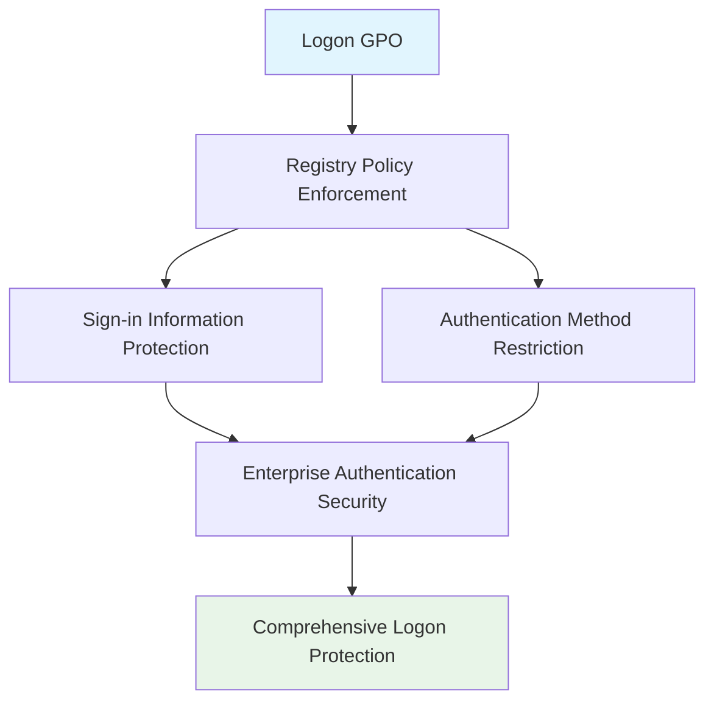

<!--
---
title: "CIS04-CONF-COMP-Logon-AllDomain-v1.0"
description: "Group Policy Object configuration for Windows Logon and Sign-in security hardening, implementing account detail protection and authentication method restrictions to maintain enterprise security boundaries across all domain-joined computers"
author: "VintageDon - https://github.com/vintagedon"
ai_contributor: "Anthropic Claude 4 Sonnet (claude-4-sonnet-20250514)"
date: "2025-07-28"
version: "1.0"
status: "Published"
tags:
- type: gpo-configuration
- domain: security-assurance
- domain: windows-hardening
- tech: group-policy
- tech: cis-benchmark
- tech: logon-security
- compliance: cis-control-4
- phase: security-baseline
related_documents:
- "[CIS Control 4 Overview](../README.md)"
- "[Windows Server 2025 GPO Report](../../evidence/cis-server2025-gpos-l1-dc-and-members.md)"
- "[Implementation Log](../../evidence/cis-server2025-gpos-l1-dc-and-members-IMPLEMENTATION-LOG.md)"
---
-->

# 🔐 **CIS04-CONF-COMP-Logon-AllDomain-v1.0**

This document provides comprehensive configuration details for the Windows Logon and Sign-in security hardening Group Policy Object, implementing CIS Control 4 (Secure Configuration of Enterprise Assets and Software) through systematic account detail protection and authentication method restrictions to maintain enterprise security boundaries across all domain-joined computers in the Proxmox Astronomy Lab infrastructure.

# 🎯 **1. Introduction**

This section establishes the foundational context for Logon and Sign-in security configuration within the enterprise Windows hardening framework.

## **1.1 Purpose**

This subsection explains how the Logon GPO contributes to systematic security hardening by controlling sign-in screen information exposure and restricting authentication methods that could enable credential harvesting or unauthorized access.

The Logon GPO implements critical security controls by systematically blocking user account detail display on sign-in screens, disabling network selection UI exposure, preventing connected user enumeration, eliminating lock screen app notifications, blocking domain picture password authentication, and disabling domain PIN logon. This configuration ensures that logon operations maintain enterprise security boundaries while supporting legitimate authentication methods essential for business operations, providing comprehensive protection against credential exposure and unauthorized authentication bypass.

## **1.2 Scope**

This subsection defines the boundaries of Logon and Sign-in security configuration within the Windows Server 2025 security baseline implementation.

The GPO applies comprehensive logon security controls to all domain-joined computers across the infrastructure, targeting Windows Logon and Sign-in functionality through registry policy enforcement. The configuration scope encompasses sign-in information protection, authentication method restrictions, and credential exposure prevention, providing systematic protection against information disclosure while maintaining operational functionality for approved authentication workflows and legitimate user access.

# 🔗 **2. Dependencies & Relationships**

This section maps how the Logon GPO integrates with other Proxmox Astronomy Lab security components, establishing both upstream and downstream dependencies.

## **2.1 Related Services**

This subsection identifies other Proxmox Astronomy Lab security services that interact with Logon and Sign-in security configuration management.

The Logon GPO operates within the comprehensive authentication security framework, coordinating with Active Directory authentication, identity management systems, and access control policies to ensure consistent logon security across the infrastructure while maintaining approved authentication functionality.

| **Service** | **Relationship Type** | **Integration Points** | **Documentation** |
|-------------|----------------------|------------------------|-------------------|
| **Active Directory Authentication** | **Integrates-with** | Domain authentication validation and credential protection | [Authentication Security Framework](../../../infrastructure/) |
| **Identity Management** | **Complements** | User credential protection and authentication method control | [Identity Management Policies](../../../policies-and-procedures/) |
| **Access Control** | **Depends-on** | User access validation and authentication restrictions | [Access Control Policies](../../../security/cis06-access-control/) |

## **2.2 Policy Implementation**

This subsection connects the Logon GPO to the Proxmox Astronomy Lab governance framework by identifying which organizational policies it implements or supports.

The Logon configuration directly implements enterprise authentication security policies, supporting systematic credential protection and preventing unauthorized information disclosure that could enable social engineering or circumvention of enterprise security controls.

- **[CIS Control 4 Implementation Policy](../../../policies-and-procedures/cis-security-policy-templates/cisv81-04-secure-configuration-of-enterprise-assets-and-software-template.md)** - Primary policy framework for secure system configuration
- **[Access Control Management Policy](../../../policies-and-procedures/cis-security-policy-templates/cisv81-06-access-control-management-template.md)** - Authentication method and credential protection controls

## **2.3 Responsibility Matrix**

This subsection defines clear accountability for Logon and Sign-in security configuration activities.

| **Activity** | **Helpdesk** | **Operations** | **Engineering** | **Security** |
|--------------|--------------|----------------|-----------------|--------------|
| **GPO Deployment** | **I** | **R** | **A** | **C** |
| **Logon Policy Changes** | **I** | **C** | **R** | **A** |
| **Authentication Monitoring** | **C** | **R** | **C** | **A** |
| **Compliance Validation** | **I** | **C** | **C** | **A** |

*R: Responsible, A: Accountable, C: Consulted, I: Informed*

# ⚙️ **3. Technical Documentation**

This section provides the technical foundation necessary for understanding, implementing, and maintaining the Logon and Sign-in security configuration.

## **3.1 Architecture & Design**

This subsection explains the technical architecture, registry policy implementation, and security design decisions for Logon and Sign-in hardening.

The Logon GPO implements comprehensive authentication security through registry policy enforcement, targeting Windows Logon and Sign-in functionality with systematic information protection controls. The configuration follows enterprise security principles by preventing credential exposure while maintaining authentication functionality essential for legitimate business operations.



## **3.2 Configuration Specifications**

This subsection provides detailed registry settings, values, and technical implementation parameters for the Logon and Sign-in security configuration based on actual deployment evidence.

The GPO implements five critical logon security controls through precise registry configuration, ensuring comprehensive protection against information disclosure and unauthorized authentication while maintaining operational compatibility.

### **Registry Configuration Details**

**Implementation Evidence from Deployment Log (2025-07-27 17:47:42)**:

| **CIS Reference** | **Setting Description** | **Registry Implementation** | **Deployed Value** |
|-------------------|------------------------|----------------------------|-------------------|
| **18.9.28.1** | **Block User Account Details on Sign-in** | `HKLM\Software\Policies\Microsoft\Windows\System\BlockUserFromShowingAccountDetailsOnSignin` | `1` (Enabled) |
| **18.9.28.2** | **Don't Display Network Selection UI** | `HKLM\Software\Policies\Microsoft\Windows\System\DontDisplayNetworkSelectionUI` | `1` (Enabled) |
| **18.9.28.3** | **Don't Enumerate Connected Users** | `HKLM\Software\Policies\Microsoft\Windows\System\DontEnumerateConnectedUsers` | `1` (Enabled) |
| **18.9.28.5** | **Disable Lock Screen App Notifications** | `HKLM\Software\Policies\Microsoft\Windows\System\DisableLockScreenAppNotifications` | `1` (Enabled) |
| **18.9.28.6** | **Block Domain Picture Password** | `HKLM\Software\Policies\Microsoft\Windows\System\BlockDomainPicturePassword` | `1` (Enabled) |
| **18.9.28.7** | **Disable Domain PIN Logon** | `HKLM\Software\Policies\Microsoft\Windows\System\AllowDomainPINLogon` | `0` (Disabled) |

### **Detailed Policy Configuration**

**GPO Details from Implementation Log**:

- **GPO ID**: `e29fd3d4-91aa-4c82-b136-df82ed73ee30`
- **Domain**: `radioastronomy.io`
- **Creation Time**: `7/27/2025 5:47:42 PM`
- **Status**: `AllSettingsEnabled`
- **Description**: `CIS 18.9.28.1: Prevents users from showing account details on the sign-in screen.`

### **Security Control Explanations**

The Logon security settings provide comprehensive protection through multiple mechanisms:

- **Account Detail Protection**: Prevents display of user account information on sign-in screens
- **Network UI Restriction**: Blocks network selection interface to prevent information disclosure
- **User Enumeration Prevention**: Stops connected user enumeration that could reveal account names
- **Lock Screen Security**: Disables app notifications that could leak information on lock screen
- **Picture Password Blocking**: Prevents domain picture password authentication
- **PIN Authentication Control**: Disables domain PIN logon to enforce stronger authentication

### **Implementation Command Examples**

Based on actual deployment evidence:

```powershell
# Logon Security Configuration (As Deployed)
New-GPO -Name "CIS04-CONF-COMP-Logon-AllDomain-v1.0" -Domain "radioastronomy.io"

# Configure Account Detail Protection (CIS 18.9.28.1)
Set-GPRegistryValue -Name "CIS04-CONF-COMP-Logon-AllDomain-v1.0" `
    -Key "HKLM\Software\Policies\Microsoft\Windows\System" `
    -ValueName "BlockUserFromShowingAccountDetailsOnSignin" -Type DWord -Value 1

# Configure Network Selection UI Control (CIS 18.9.28.2)
Set-GPRegistryValue -Name "CIS04-CONF-COMP-Logon-AllDomain-v1.0" `
    -Key "HKLM\Software\Policies\Microsoft\Windows\System" `
    -ValueName "DontDisplayNetworkSelectionUI" -Type DWord -Value 1

# Configure Connected User Enumeration Control (CIS 18.9.28.3)
Set-GPRegistryValue -Name "CIS04-CONF-COMP-Logon-AllDomain-v1.0" `
    -Key "HKLM\Software\Policies\Microsoft\Windows\System" `
    -ValueName "DontEnumerateConnectedUsers" -Type DWord -Value 1

# Configure Lock Screen App Notifications (CIS 18.9.28.5)
Set-GPRegistryValue -Name "CIS04-CONF-COMP-Logon-AllDomain-v1.0" `
    -Key "HKLM\Software\Policies\Microsoft\Windows\System" `
    -ValueName "DisableLockScreenAppNotifications" -Type DWord -Value 1

# Configure Domain Picture Password Control (CIS 18.9.28.6)
Set-GPRegistryValue -Name "CIS04-CONF-COMP-Logon-AllDomain-v1.0" `
    -Key "HKLM\Software\Policies\Microsoft\Windows\System" `
    -ValueName "BlockDomainPicturePassword" -Type DWord -Value 1

# Configure Domain PIN Logon Control (CIS 18.9.28.7)
Set-GPRegistryValue -Name "CIS04-CONF-COMP-Logon-AllDomain-v1.0" `
    -Key "HKLM\Software\Policies\Microsoft\Windows\System" `
    -ValueName "AllowDomainPINLogon" -Type DWord -Value 0

# Link to appropriate organizational units
New-GPLink -Name "CIS04-CONF-COMP-Logon-AllDomain-v1.0" `
    -Target "OU=Servers,DC=radioastronomy,DC=io" -LinkEnabled Yes

New-GPLink -Name "CIS04-CONF-COMP-Logon-AllDomain-v1.0" `
    -Target "OU=Workstations,DC=radioastronomy,DC=io" -LinkEnabled Yes
```

# 🛠️ **4. Management & Operations**

This section covers operational procedures for managing the Logon GPO within the enterprise security framework.

## **4.1 Deployment Procedures**

This subsection documents systematic deployment approaches for the Logon and Sign-in security configuration across the domain infrastructure based on actual implementation experience.

GPO deployment follows established change management procedures with validation in test organizational units to verify logon security functionality and user experience compatibility. The deployment process includes confirmation of information protection enforcement, validation of authentication method restrictions, verification of sign-in screen security, and testing of user authentication procedures to ensure comprehensive logon protection without operational disruption to legitimate authentication workflows.

**Deployment Evidence**: Successfully deployed on 2025-07-27 at 17:47:42 with complete registry configuration application and no reported operational issues.

## **4.2 Monitoring & Validation**

This subsection defines monitoring strategies and validation approaches for ongoing Logon and Sign-in security compliance.

Security monitoring encompasses Group Policy application tracking through Windows Event Logs, logon behavior monitoring, authentication attempt auditing, and systematic validation of registry settings to ensure logon security controls remain effective and detect potential policy circumvention attempts or unauthorized information disclosure.

# 🔒 **5. Security & Compliance**

This section documents security considerations and compliance alignment for Logon and Sign-in configuration within the enterprise security framework.

## **5.1 Security Controls**

This subsection documents specific security measures and verification methods for Logon and Sign-in hardening implementation.

Logon and Sign-in security controls implement systematic authentication protection through comprehensive information disclosure prevention, blocking account detail exposure on sign-in screens, preventing network interface information leakage, eliminating user enumeration capabilities, disabling lock screen notifications, and restricting alternative authentication methods while maintaining standard authentication functionality essential for legitimate business operations and approved user access workflows.

**Compliance Disclaimer**: We are not security professionals - this represents our baseline security implementation and we are working towards full compliance with established frameworks.

## **5.2 CIS Controls Mapping**

This subsection provides explicit mapping to CIS Controls v8, documenting compliance status and implementation evidence.

| **CIS Control** | **Implementation Status** | **Evidence Location** | **Assessment Date** |
|-----------------|--------------------------|----------------------|-------------------|
| **CIS.4.1** | **Implemented** | Secure authentication configuration and information protection | **2025-07-28** |
| **CIS.4.8** | **Implemented** | Authentication attack surface reduction and information disclosure prevention | **2025-07-28** |
| **CIS.6.1** | **Implemented** | Access control management and authentication method restriction | **2025-07-28** |
| **CIS.6.2** | **Implemented** | Account management and credential protection | **2025-07-28** |

**Implementation Evidence**: [CIS Implementation Log](../../evidence/cis-server2025-gpos-l1-dc-and-members-IMPLEMENTATION-LOG.md) - GPO deployed 2025-07-27 17:47:42

## **5.3 Framework Compliance**

This subsection demonstrates how Logon and Sign-in security controls satisfy requirements across multiple compliance frameworks.

Logon and Sign-in configuration aligns with CIS Controls v8 baseline for secure system configuration, NIST Cybersecurity Framework for identity and access management, and enterprise security standards through systematic authentication protection ensuring secure user access across the infrastructure.

# 💾 **6. Backup & Recovery**

This section documents GPO protection and recovery procedures for Logon and Sign-in security configuration.

## **6.1 Protection Strategy**

This subsection details GPO backup approaches and version control strategies for configuration preservation.

GPO protection strategy encompasses automated Group Policy backup through PowerShell automation, logon security configuration export procedures, and systematic policy documentation ensuring configuration recovery capability and change tracking for audit and compliance requirements.

| **Protection Type** | **Method** | **Frequency** | **Storage Location** |
|---------------------|------------|---------------|---------------------|
| **GPO Backup** | **PowerShell automation** | **Daily** | **Centralized backup infrastructure** |
| **Registry Configuration Export** | **Registry settings export** | **Change-driven** | **Version control system** |
| **Policy Documentation** | **Configuration state recording** | **Weekly** | **Configuration management database** |
| **Implementation Evidence** | **Deployment log archival** | **Per deployment** | **Audit trail storage** |

## **6.2 Recovery Procedures**

This subsection provides GPO recovery processes and configuration restoration procedures.

GPO recovery procedures include Active Directory Group Policy restoration from backup, registry settings validation, and systematic testing procedures ensuring logon security effectiveness following recovery operations and infrastructure changes.

# 📚 **7. References & Related Resources**

This section provides comprehensive links to related internal documentation and supporting resources.

## **7.1 Internal References**

| **Document Type** | **Document Title** | **Relationship** | **Link** |
|-------------------|-------------------|------------------|----------|
| **Security Policy** | CIS Control 4 Implementation | Primary policy framework for secure configuration | [../README.md](../README.md) |
| **Implementation Evidence** | CIS Implementation Log | Actual deployment evidence and configuration details | [../../evidence/cis-server2025-gpos-l1-dc-and-members-IMPLEMENTATION-LOG.md](../../evidence/cis-server2025-gpos-l1-dc-and-members-IMPLEMENTATION-LOG.md) |
| **Access Control** | Access Control Management Policy | Authentication method and credential protection controls | [../../../policies-and-procedures/cis-security-policy-templates/cisv81-06-access-control-management-template.md](../../../policies-and-procedures/cis-security-policy-templates/cisv81-06-access-control-management-template.md) |
| **Technical Report** | Windows Server 2025 GPO Mapping | Complete GPO implementation specifications | [../../evidence/cis-server2025-gpos-l1-dc-and-members.md](../../evidence/cis-server2025-gpos-l1-dc-and-members.md) |

## **7.2 External Standards**

- **[Microsoft Logon Security](https://docs.microsoft.com/en-us/windows/security/identity-protection/credential-guard/)** - Official logon and credential protection documentation
- **[CIS Controls v8](https://www.cisecurity.org/controls/)** - Cybersecurity framework and access control management
- **[NIST Cybersecurity Framework](https://www.nist.gov/cyberframework)** - Identity and access management
- **[Windows Authentication](https://docs.microsoft.com/en-us/windows-server/security/windows-authentication/windows-authentication-overview)** - Authentication method security guidance

# ✅ **8. Approval & Review**

This section documents the formal review and approval process for Logon and Sign-in security configuration.

## **8.1 Review Process**

Logon GPO configuration underwent comprehensive review by authentication security specialists, Windows system administrators, and compliance specialists to ensure logon security effectiveness and user experience compatibility.

## **8.2 Approval Matrix**

| **Reviewer** | **Role/Expertise** | **Review Date** | **Approval Status** | **Comments** |
|-------------|-------------------|----------------|-------------------|--------------|
| **crainbramp** | **Platform Engineering** | **2025-07-28** | **Approved** | Configuration implements comprehensive authentication security boundaries |
| **Security Team** | **Authentication Security** | **2025-07-28** | **Approved** | Logon controls effectively prevent information disclosure and credential exposure |
| **Operations Team** | **Windows Administration** | **2025-07-28** | **Approved** | Implementation procedures validated with actual deployment evidence |

# 📜 **9. Documentation Metadata**

This section provides comprehensive information about document creation, revision history, and authorship.

## **9.1 Change Log**

| **Version** | **Date** | **Changes** | **Author** | **Review Status** |
|------------|---------|-------------|------------|------------------|
| 1.0 | 2025-07-28 | Initial GPO configuration documentation with actual implementation evidence | VintageDon | **Approved** |

## **9.2 Authorization & Review**

Human subject matter experts have validated Logon and Sign-in security configuration to ensure enterprise authentication security requirements and credential protection effectiveness using actual deployment evidence.

## **9.3 Authorship Details**

**Human Author:** VintageDon (<https://github.com/vintagedon>)  
**AI Contributor:** Anthropic Claude 4 Sonnet (claude-4-sonnet-20250514)  
**Collaboration Method:** Request-Analyze-Verify-Generate-Validate (RAVGV)  
**Human Oversight:** Complete validation of GPO configuration and logon security implementation with deployment evidence

## **9.4 AI Collaboration Disclosure**

This GPO configuration documentation was collaboratively developed using the Request-Analyze-Verify-Generate-Validate (RAVGV) methodology. Logon and Sign-in security controls were extracted from validated CIS benchmark implementation reports and actual deployment logs with human oversight throughout development. All technical specifications have been reviewed and approved by qualified human subject matter experts in Windows security and authentication management.

*Generated: 2025-07-28 | Human Author: VintageDon | AI Assistant: Claude 4 Sonnet | Review Status: Approved | Document Version: 1.0*
