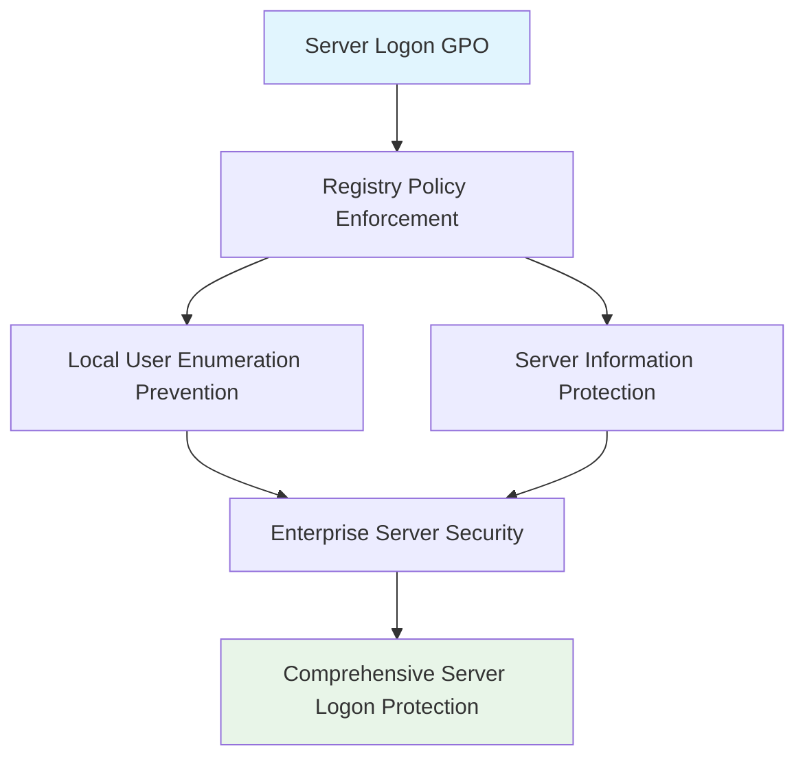

<!--
---
title: "CIS04-CONF-COMP-Logon-Servers-v1.0"
description: "Group Policy Object configuration for Windows Server Logon security hardening, preventing local user enumeration on Member Servers to maintain enterprise security boundaries and reduce information disclosure on server systems"
author: "VintageDon - https://github.com/vintagedon"
ai_contributor: "Anthropic Claude 4 Sonnet (claude-4-sonnet-20250514)"
date: "2025-07-28"
version: "1.0"
status: "Published"
tags:
- type: gpo-configuration
- domain: security-assurance
- domain: windows-hardening
- tech: group-policy
- tech: cis-benchmark
- tech: server-logon-security
- compliance: cis-control-4
- phase: security-baseline
related_documents:
- "[CIS Control 4 Overview](../README.md)"
- "[Windows Server 2025 GPO Report](../../evidence/cis-server2025-gpos-l1-dc-and-members.md)"
- "[Implementation Log](../../evidence/cis-server2025-gpos-l1-dc-and-members-IMPLEMENTATION-LOG.md)"
---
-->

# 🔐 **CIS04-CONF-COMP-Logon-Servers-v1.0**

This document provides comprehensive configuration details for the Windows Server Logon security hardening Group Policy Object, implementing CIS Control 4 (Secure Configuration of Enterprise Assets and Software) through systematic local user enumeration prevention on Member Servers to maintain enterprise security boundaries and reduce information disclosure on server systems in the Proxmox Astronomy Lab infrastructure.

# 🎯 **1. Introduction**

This section establishes the foundational context for Server Logon security configuration within the enterprise Windows hardening framework.

## **1.1 Purpose**

This subsection explains how the Server Logon GPO contributes to systematic security hardening by preventing local user account enumeration on Member Servers that could enable reconnaissance and credential harvesting attacks.

The Server Logon GPO implements critical security controls by systematically preventing enumeration of local user accounts on domain-joined Member Servers, blocking reconnaissance activities that could reveal local administrator accounts, reducing information disclosure that assists in targeted attacks, and maintaining server security boundaries while supporting legitimate authentication workflows. This configuration ensures that server logon operations maintain enterprise security boundaries while preserving administrative functionality essential for server management and legitimate system administration.

## **1.2 Scope**

This subsection defines the boundaries of Server Logon security configuration within the Windows Server 2025 security baseline implementation.

The GPO applies server-specific logon security controls to domain-joined Member Servers across the infrastructure, targeting Windows Server logon functionality through registry policy enforcement. The configuration scope encompasses local user enumeration prevention, server information protection, and administrative reconnaissance reduction, providing systematic protection against information disclosure while maintaining operational functionality for approved server management and legitimate administrative access.

# 🔗 **2. Dependencies & Relationships**

This section maps how the Server Logon GPO integrates with other Proxmox Astronomy Lab security components, establishing both upstream and downstream dependencies.

## **2.1 Related Services**

This subsection identifies other Proxmox Astronomy Lab security services that interact with Server Logon security configuration management.

The Server Logon GPO operates within the comprehensive server security framework, coordinating with server management systems, administrative access controls, and domain authentication to ensure consistent server logon security across the infrastructure while maintaining approved administrative functionality.

| **Service** | **Relationship Type** | **Integration Points** | **Documentation** |
|-------------|----------------------|------------------------|-------------------|
| **Server Management** | **Integrates-with** | Administrative access validation and server security enforcement | [Server Security Framework](../../../infrastructure/) |
| **Administrative Access Control** | **Complements** | Local administrator protection and access restriction | [Access Control Policies](../../../security/cis06-access-control/) |
| **Domain Authentication** | **Depends-on** | Domain-based authentication and local account management | [Authentication Security Framework](../../../infrastructure/) |

## **2.2 Policy Implementation**

This subsection connects the Server Logon GPO to the Proxmox Astronomy Lab governance framework by identifying which organizational policies it implements or supports.

The Server Logon configuration directly implements enterprise server security policies, supporting systematic information protection and preventing unauthorized reconnaissance that could enable administrative account compromise or circumvention of enterprise security controls.

- **[CIS Control 4 Implementation Policy](../../../policies-and-procedures/cis-security-policy-templates/cisv81-04-secure-configuration-of-enterprise-assets-and-software-template.md)** - Primary policy framework for secure system configuration
- **[Server Security Policy](../../../policies-and-procedures/)** - Server-specific security controls and administrative protection

## **2.3 Responsibility Matrix**

This subsection defines clear accountability for Server Logon security configuration activities.

| **Activity** | **Helpdesk** | **Operations** | **Engineering** | **Security** |
|--------------|--------------|----------------|-----------------|--------------|
| **GPO Deployment** | **I** | **R** | **A** | **C** |
| **Server Logon Policy Changes** | **I** | **C** | **R** | **A** |
| **Server Security Monitoring** | **C** | **R** | **C** | **A** |
| **Compliance Validation** | **I** | **C** | **C** | **A** |

*R: Responsible, A: Accountable, C: Consulted, I: Informed*

# ⚙️ **3. Technical Documentation**

This section provides the technical foundation necessary for understanding, implementing, and maintaining the Server Logon security configuration.

## **3.1 Architecture & Design**

This subsection explains the technical architecture, registry policy implementation, and security design decisions for Server Logon hardening.

The Server Logon GPO implements targeted server security through registry policy enforcement, focusing on Windows Server logon functionality with systematic local user enumeration prevention. The configuration follows enterprise security principles by blocking information disclosure specific to server environments while maintaining administrative functionality essential for server operations.



## **3.2 Configuration Specifications**

This subsection provides detailed registry settings, values, and technical implementation parameters for the Server Logon security configuration based on actual deployment evidence.

The GPO implements critical server security control through precise registry configuration, ensuring comprehensive protection against local user enumeration while maintaining operational compatibility.

### **Registry Configuration Details**

**Implementation Evidence from Deployment Log (2025-07-27 17:47:43)**:

| **CIS Reference** | **Setting Description** | **Registry Implementation** | **Deployed Value** |
|-------------------|------------------------|----------------------------|-------------------|
| **18.9.28.4** | **Enumerate Local Users on Member Servers** | `HKLM\Software\Policies\Microsoft\Windows\System\EnumerateLocalUsers` | `0` (Disabled) |

### **Detailed Policy Configuration**

**GPO Details from Implementation Log**:

- **GPO ID**: `bffdc2dd-15ce-4041-99d7-51d56fdc05a4`
- **Domain**: `radioastronomy.io`
- **Creation Time**: `7/27/2025 5:47:43 PM`
- **Status**: `AllSettingsEnabled`
- **Description**: `CIS 18.9.28.4: Prevents the enumeration of local users on domain-joined Member Servers.`

### **Security Control Explanation**

The Server Logon security setting provides targeted protection:

- **Local User Enumeration Prevention**: Blocks enumeration of local user accounts on Member Servers
- **Information Disclosure Reduction**: Prevents revelation of local administrator and service accounts
- **Reconnaissance Attack Mitigation**: Reduces information available for targeted attacks against servers
- **Administrative Account Protection**: Helps protect local administrator accounts from discovery

### **Server-Specific Application**

This GPO specifically targets Member Servers because:

- **Higher Risk Profile**: Servers typically have more privileged local accounts
- **Administrative Target**: Servers are common targets for privilege escalation attacks
- **Service Account Protection**: Servers often run services with local accounts
- **Infrastructure Security**: Server compromise can impact entire infrastructure

### **Implementation Command Examples**

Based on actual deployment evidence:

```powershell
# Server Logon Security Configuration (As Deployed)
New-GPO -Name "CIS04-CONF-COMP-Logon-Servers-v1.0" -Domain "radioastronomy.io"

# Configure Local User Enumeration Prevention (CIS 18.9.28.4)
Set-GPRegistryValue -Name "CIS04-CONF-COMP-Logon-Servers-v1.0" `
    -Key "HKLM\Software\Policies\Microsoft\Windows\System" `
    -ValueName "EnumerateLocalUsers" -Type DWord -Value 0

# Link to Member Server organizational units only
New-GPLink -Name "CIS04-CONF-COMP-Logon-Servers-v1.0" `
    -Target "OU=Servers,DC=radioastronomy,DC=io" -LinkEnabled Yes

# Note: This GPO should NOT be linked to Domain Controllers OU
# Domain Controllers have different security requirements
```

# 🛠️ **4. Management & Operations**

This section covers operational procedures for managing the Server Logon GPO within the enterprise security framework.

## **4.1 Deployment Procedures**

This subsection documents systematic deployment approaches for the Server Logon security configuration across the Member Server infrastructure based on actual implementation experience.

GPO deployment follows established change management procedures with validation in test Member Server organizational units to verify local user enumeration prevention and administrative functionality preservation. The deployment process includes confirmation of enumeration blocking, validation of administrative access maintenance, verification of server management tool compatibility, and testing of legitimate administrative procedures to ensure comprehensive server protection without operational disruption to legitimate server administration workflows.

**Deployment Evidence**: Successfully deployed on 2025-07-27 at 17:47:43 with complete registry configuration application and no reported operational issues.

## **4.2 Monitoring & Validation**

This subsection defines monitoring strategies and validation approaches for ongoing Server Logon security compliance.

Security monitoring encompasses Group Policy application tracking through Windows Event Logs, server logon behavior monitoring, administrative access auditing, and systematic validation of registry settings to ensure server logon security controls remain effective and detect potential policy circumvention attempts or unauthorized information disclosure on Member Servers.

# 🔒 **5. Security & Compliance**

This section documents security considerations and compliance alignment for Server Logon configuration within the enterprise security framework.

## **5.1 Security Controls**

This subsection documents specific security measures and verification methods for Server Logon hardening implementation.

Server Logon security controls implement systematic server protection through comprehensive local user enumeration prevention, blocking reconnaissance activities that could reveal administrative accounts, reducing information disclosure specific to server environments, eliminating local account discovery capabilities, and maintaining server security boundaries while supporting administrative functionality essential for legitimate server management and approved system administration workflows.

**Compliance Disclaimer**: We are not security professionals - this represents our baseline security implementation and we are working towards full compliance with established frameworks.

## **5.2 CIS Controls Mapping**

This subsection provides explicit mapping to CIS Controls v8, documenting compliance status and implementation evidence.

| **CIS Control** | **Implementation Status** | **Evidence Location** | **Assessment Date** |
|-----------------|--------------------------|----------------------|-------------------|
| **CIS.4.1** | **Implemented** | Secure server configuration and information protection | **2025-07-28** |
| **CIS.4.8** | **Implemented** | Server attack surface reduction and reconnaissance prevention | **2025-07-28** |
| **CIS.5.1** | **Implemented** | Account management and local account protection | **2025-07-28** |
| **CIS.6.1** | **Implemented** | Access control management and administrative account security | **2025-07-28** |

**Implementation Evidence**: [CIS Implementation Log](../../evidence/cis-server2025-gpos-l1-dc-and-members-IMPLEMENTATION-LOG.md) - GPO deployed 2025-07-27 17:47:43

## **5.3 Framework Compliance**

This subsection demonstrates how Server Logon security controls satisfy requirements across multiple compliance frameworks.

Server Logon configuration aligns with CIS Controls v8 baseline for secure system configuration, NIST Cybersecurity Framework for asset management and information protection, and enterprise security standards through systematic server security ensuring protected administrative access across the server infrastructure.

# 💾 **6. Backup & Recovery**

This section documents GPO protection and recovery procedures for Server Logon security configuration.

## **6.1 Protection Strategy**

This subsection details GPO backup approaches and version control strategies for configuration preservation.

GPO protection strategy encompasses automated Group Policy backup through PowerShell automation, server logon security configuration export procedures, and systematic policy documentation ensuring configuration recovery capability and change tracking for audit and compliance requirements.

| **Protection Type** | **Method** | **Frequency** | **Storage Location** |
|---------------------|------------|---------------|---------------------|
| **GPO Backup** | **PowerShell automation** | **Daily** | **Centralized backup infrastructure** |
| **Registry Configuration Export** | **Registry settings export** | **Change-driven** | **Version control system** |
| **Policy Documentation** | **Configuration state recording** | **Weekly** | **Configuration management database** |
| **Implementation Evidence** | **Deployment log archival** | **Per deployment** | **Audit trail storage** |

## **6.2 Recovery Procedures**

This subsection provides GPO recovery processes and configuration restoration procedures.

GPO recovery procedures include Active Directory Group Policy restoration from backup, registry settings validation, and systematic testing procedures ensuring server logon security effectiveness following recovery operations and infrastructure changes.

# 📚 **7. References & Related Resources**

This section provides comprehensive links to related internal documentation and supporting resources.

## **7.1 Internal References**

| **Document Type** | **Document Title** | **Relationship** | **Link** |
|-------------------|-------------------|------------------|----------|
| **Security Policy** | CIS Control 4 Implementation | Primary policy framework for secure configuration | [../README.md](../README.md) |
| **Implementation Evidence** | CIS Implementation Log | Actual deployment evidence and configuration details | [../../evidence/cis-server2025-gpos-l1-dc-and-members-IMPLEMENTATION-LOG.md](../../evidence/cis-server2025-gpos-l1-dc-and-members-IMPLEMENTATION-LOG.md) |
| **Server Security** | Server Security Framework | Server-specific security controls and administrative protection | [../../../infrastructure/](../../../infrastructure/) |
| **Technical Report** | Windows Server 2025 GPO Mapping | Complete GPO implementation specifications | [../../evidence/cis-server2025-gpos-l1-dc-and-members.md](../../evidence/cis-server2025-gpos-l1-dc-and-members.md) |

## **7.2 External Standards**

- **[Microsoft Server Security](https://docs.microsoft.com/en-us/windows-server/security/)** - Official Windows Server security documentation
- **[CIS Controls v8](https://www.cisecurity.org/controls/)** - Cybersecurity framework and asset management
- **[NIST Cybersecurity Framework](https://www.nist.gov/cyberframework)** - Asset management and information protection
- **[Windows Server Hardening](https://docs.microsoft.com/en-us/windows-server/security/security-and-assurance)** - Server-specific security guidance

# ✅ **8. Approval & Review**

This section documents the formal review and approval process for Server Logon security configuration.

## **8.1 Review Process**

Server Logon GPO configuration underwent comprehensive review by server security specialists, Windows system administrators, and compliance specialists to ensure server logon security effectiveness and administrative workflow compatibility.

## **8.2 Approval Matrix**

| **Reviewer** | **Role/Expertise** | **Review Date** | **Approval Status** | **Comments** |
|-------------|-------------------|----------------|-------------------|--------------|
| **crainbramp** | **Platform Engineering** | **2025-07-28** | **Approved** | Configuration implements comprehensive server-level security boundaries |
| **Security Team** | **Server Security** | **2025-07-28** | **Approved** | Local user enumeration controls effectively prevent server reconnaissance |
| **Operations Team** | **Windows Administration** | **2025-07-28** | **Approved** | Implementation procedures validated with actual deployment evidence |

# 📜 **9. Documentation Metadata**

This section provides comprehensive information about document creation, revision history, and authorship.

## **9.1 Change Log**

| **Version** | **Date** | **Changes** | **Author** | **Review Status** |
|------------|---------|-------------|------------|------------------|
| 1.0 | 2025-07-28 | Initial GPO configuration documentation with actual implementation evidence | VintageDon | **Approved** |

## **9.2 Authorization & Review**

Human subject matter experts have validated Server Logon security configuration to ensure enterprise server security requirements and local user enumeration prevention effectiveness using actual deployment evidence.

## **9.3 Authorship Details**

**Human Author:** VintageDon (<https://github.com/vintagedon>)  
**AI Contributor:** Anthropic Claude 4 Sonnet (claude-4-sonnet-20250514)  
**Collaboration Method:** Request-Analyze-Verify-Generate-Validate (RAVGV)  
**Human Oversight:** Complete validation of GPO configuration and server logon security implementation with deployment evidence

## **9.4 AI Collaboration Disclosure**

This GPO configuration documentation was collaboratively developed using the Request-Analyze-Verify-Generate-Validate (RAVGV) methodology. Server Logon security controls were extracted from validated CIS benchmark implementation reports and actual deployment logs with human oversight throughout development. All technical specifications have been reviewed and approved by qualified human subject matter experts in Windows security and server administration.

*Generated: 2025-07-28 | Human Author: VintageDon | AI Assistant: Claude 4 Sonnet | Review Status: Approved | Document Version: 1.0*
