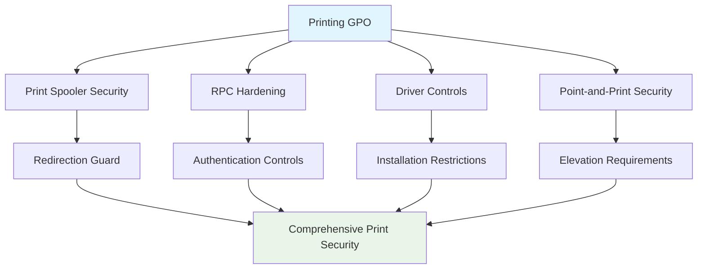

<!--
---
title: "CIS04-CONF-COMP-Printing-AllDomain-v1.0"
description: "Group Policy Object configuration for comprehensive print service security hardening, including Print Spooler protection and Point-and-Print restrictions across all domain-joined computers"
author: "VintageDon - https://github.com/vintagedon"
ai_contributor: "Anthropic Claude 4 Sonnet (claude-4-sonnet-20250514)"
date: "2025-07-28"
version: "1.0"
status: "Published"
tags:
- type: gpo-configuration
- domain: security-assurance
- domain: windows-hardening
- tech: group-policy
- tech: cis-benchmark
- tech: print-security
- compliance: cis-control-4
- phase: security-baseline
related_documents:
- "[CIS Control 4 Overview](../README.md)"
- "[Windows Server 2025 GPO Report](../../evidence/cis-server2025-gpos-l1-dc-and-members.md)"
- "[Network Infrastructure Policy](../../../policies-and-procedures/cis-security-policy-templates/cisv81-12-network-infrastructure-management-policy-template.md)"
---
-->

# 🔐 **CIS04-CONF-COMP-Printing-AllDomain-v1.0**

This document provides comprehensive configuration details for the Print Service security hardening Group Policy Object, implementing CIS Control 4 (Secure Configuration of Enterprise Assets and Software) through comprehensive Print Spooler protection, RPC security, and Point-and-Print restrictions across all domain-joined computers in the Proxmox Astronomy Lab infrastructure.

# 🎯 **1. Introduction**

This section establishes the foundational context for Print Service security configuration within the enterprise Windows hardening framework.

## **1.1 Purpose**

This subsection explains how the Printing GPO contributes to systematic security hardening by controlling print service vulnerabilities and reducing attack surface through comprehensive print security management.

The Printing GPO implements critical security controls for Windows Print Spooler and related print services, addressing numerous attack vectors including PrintNightmare vulnerabilities, RPC exploitation, and unauthorized driver installations. This configuration ensures that print service operations maintain security boundaries while supporting legitimate printing workflows essential for enterprise operations, providing comprehensive protection against print service-based attacks that have become prevalent threat vectors.

## **1.2 Scope**

This subsection defines the boundaries of Print Service security configuration within the Windows Server 2025 security baseline implementation.

The GPO applies comprehensive print service security controls to all domain-joined computers across the infrastructure, targeting Windows Print Spooler functionality, RPC communication, driver installation procedures, and Point-and-Print operations through Administrative Template and registry policy enforcement. The configuration scope encompasses redirection guard protection, RPC security hardening, queue file management, driver installation restrictions, and Point-and-Print elevation controls, providing systematic protection against print service attack vectors while maintaining operational functionality for approved printing operations.

# 🔗 **2. Dependencies & Relationships**

This section maps how the Printing GPO integrates with other Proxmox Astronomy Lab security components, establishing both upstream and downstream dependencies.

## **2.1 Related Services**

This subsection identifies other Proxmox Astronomy Lab security services that interact with Print Service configuration management.

The Printing GPO operates within the comprehensive network security framework, coordinating with firewall policies, RPC security controls, and device management systems to ensure consistent print service security across the infrastructure while maintaining operational printing capabilities.

| **Service** | **Relationship Type** | **Integration Points** | **Documentation** |
|-------------|----------------------|------------------------|-------------------|
| **Network Security** | **Depends-on** | RPC protocol security and firewall configuration | [Network Security Framework](../../../infrastructure/networking/) |
| **Device Management** | **Integrates-with** | Printer driver deployment and device control | [Device Management Policies](../../../policies-and-procedures/) |
| **Print Spooler Service** | **Provides-to** | Service hardening and vulnerability mitigation | [System Services Security](../../../security-assurance/) |

## **2.2 Policy Implementation**

This subsection connects the Printing GPO to the Proxmox Astronomy Lab governance framework by identifying which organizational policies it implements or supports.

The Printing configuration directly implements enterprise print security policies, supporting systematic service hardening and preventing print service-based attacks that could enable lateral movement and privilege escalation across the infrastructure.

- **[CIS Control 4 Implementation Policy](../../../policies-and-procedures/cis-security-policy-templates/cisv81-04-secure-configuration-of-enterprise-assets-and-software-template.md)** - Primary policy framework for secure system configuration
- **[Network Infrastructure Management Policy](../../../policies-and-procedures/cis-security-policy-templates/cisv81-12-network-infrastructure-management-policy-template.md)** - Network service security and protocol control

## **2.3 Responsibility Matrix**

This subsection defines clear accountability for Print Service security configuration activities.

| **Activity** | **Helpdesk** | **Operations** | **Engineering** | **Security** |
|--------------|--------------|----------------|-----------------|--------------|
| **GPO Deployment** | **I** | **R** | **A** | **C** |
| **Print Security Policy Changes** | **I** | **C** | **R** | **A** |
| **Print Service Monitoring** | **C** | **R** | **C** | **A** |
| **Compliance Validation** | **I** | **C** | **C** | **A** |

*R: Responsible, A: Accountable, C: Consulted, I: Informed*

# ⚙️ **3. Technical Documentation**

This section provides the technical foundation necessary for understanding, implementing, and maintaining the Print Service security configuration.

## **3.1 Architecture & Design**

This subsection explains the technical architecture, Administrative Template and registry policy implementation, and security design decisions for Print Service hardening.

The Printing GPO implements comprehensive print service security through multi-layered Administrative Template and registry policy enforcement, targeting Windows Print Spooler vulnerabilities, RPC communication security, and driver installation controls. The configuration follows defense-in-depth principles by providing redirection protection, RPC hardening, queue file restrictions, and elevation controls while maintaining operational printing capabilities essential for enterprise operations.



## **3.2 Configuration Specifications**

This subsection provides detailed Administrative Template settings, registry values, and technical implementation parameters for the Print Service security configuration.

The GPO implements eleven critical print security controls through precise Administrative Template and registry configuration, ensuring comprehensive protection against print service vulnerabilities while maintaining operational compatibility.

### **Administrative Template Configuration Details**

| **CIS Reference** | **Setting Description** | **Policy Implementation** | **Security Value** |
|-------------------|------------------------|---------------------------|-------------------|
| **18.7.2** | **Configure Redirection Guard** | `Printers\Configure Redirection Guard` | `Enabled: Redirection Guard Enabled` |
| **18.7.3** | **RPC Connection Protocol** | `Printers\Configure RPC connection settings` | `Enabled: RPC over TCP` |
| **18.7.4** | **RPC Authentication** | `Printers\Configure RPC connection settings` | `Enabled: Default` |
| **18.7.5** | **RPC Listener Protocol** | `Printers\Configure RPC listener settings` | `Enabled: RPC over TCP` |
| **18.7.6** | **RPC Authentication Protocol** | `Printers\Configure RPC listener settings` | `Enabled: Negotiate` |
| **18.7.7** | **RPC TCP Port** | `Printers\Configure RPC over TCP port` | `Enabled: 0` |
| **18.7.8** | **RPC Privacy Setting** | Registry: `HKLM\SYSTEM\CurrentControlSet\Control\Print` | `RpcAuthnLevelPrivacyEnabled: 1` |
| **18.7.10** | **Driver Installation Limits** | `Printers\Limits print driver installation to Administrators` | `Enabled` |
| **18.7.11** | **Queue File Management** | `Printers\Manage processing of Queue-specific files` | `Enabled: Limit to Color profiles` |
| **18.7.12** | **Point-and-Print Install** | `Printers\Point and Print Restrictions` | `Enabled: Show warning and elevation prompt` |
| **18.7.13** | **Point-and-Print Update** | `Printers\Point and Print Restrictions` | `Enabled: Show warning and elevation prompt` |

### **Detailed Policy Configuration**

**Base Policy Path**: `Computer Configuration\Policies\Administrative Templates\Printers`

#### **Implementation Command Examples**

```powershell
# Print Service Security Configuration
New-GPO -Name "CIS04-CONF-COMP-Printing-AllDomain-v1.0" -Domain "radioastronomy.io"

# Configure Redirection Guard
Set-GPRegistryValue -Name "CIS04-CONF-COMP-Printing-AllDomain-v1.0" `
    -Key "HKLM\Software\Policies\Microsoft\Windows NT\Printers" `
    -ValueName "RedirectionguardPolicy" -Type DWord -Value 1

# Configure RPC over TCP for connections
Set-GPRegistryValue -Name "CIS04-CONF-COMP-Printing-AllDomain-v1.0" `
    -Key "HKLM\Software\Policies\Microsoft\Windows NT\Printers\RPC" `
    -ValueName "RpcTcpPort" -Type DWord -Value 0

# Enable RPC packet level privacy
Set-GPRegistryValue -Name "CIS04-CONF-COMP-Printing-AllDomain-v1.0" `
    -Key "HKLM\SYSTEM\CurrentControlSet\Control\Print" `
    -ValueName "RpcAuthnLevelPrivacyEnabled" -Type DWord -Value 1

# Limit driver installation to administrators
Set-GPRegistryValue -Name "CIS04-CONF-COMP-Printing-AllDomain-v1.0" `
    -Key "HKLM\Software\Policies\Microsoft\Windows NT\Printers\PointAndPrint" `
    -ValueName "RestrictDriverInstallationToAdministrators" -Type DWord -Value 1

# Configure Point and Print restrictions
Set-GPRegistryValue -Name "CIS04-CONF-COMP-Printing-AllDomain-v1.0" `
    -Key "HKLM\Software\Policies\Microsoft\Windows NT\Printers\PointAndPrint" `
    -ValueName "NoWarningNoElevationOnInstall" -Type DWord -Value 0

Set-GPRegistryValue -Name "CIS04-CONF-COMP-Printing-AllDomain-v1.0" `
    -Key "HKLM\Software\Policies\Microsoft\Windows NT\Printers\PointAndPrint" `
    -ValueName "NoWarningNoElevationOnUpdate" -Type DWord -Value 0
```

# 🛠️ **4. Management & Operations**

This section covers operational procedures for managing the Printing GPO within the enterprise security framework.

## **4.1 Deployment Procedures**

This subsection documents systematic deployment approaches for the Print Service security configuration across the domain infrastructure.

GPO deployment follows established change management procedures with validation in test organizational units to verify print service functionality and security control effectiveness. The deployment process includes confirmation of print service operation, validation of driver installation restrictions, verification of RPC security controls, and testing of Point-and-Print elevation requirements to ensure comprehensive print security without operational disruption.

## **4.2 Monitoring & Validation**

This subsection defines monitoring strategies and validation approaches for ongoing Print Service security compliance.

Security monitoring encompasses Group Policy application tracking through Windows Event Logs, Print Spooler service monitoring, RPC communication auditing, and systematic validation of driver installation controls to ensure print security measures remain effective and detect potential print service exploitation attempts or policy circumvention.

# 🔒 **5. Security & Compliance**

This section documents security considerations and compliance alignment for Print Service configuration within the enterprise security framework.

## **5.1 Security Controls**

This subsection documents specific security measures and verification methods for Print Service hardening implementation.

Print Service security controls implement systematic attack surface reduction through Print Spooler hardening, RPC security enforcement, driver installation restrictions, and Point-and-Print elevation controls, preventing common print service vulnerabilities including PrintNightmare exploitation while maintaining legitimate printing functionality essential for enterprise operations and user productivity.

**Compliance Disclaimer**: We are not security professionals - this represents our baseline security implementation and we are working towards full compliance with established frameworks.

## **5.2 CIS Controls Mapping**

This subsection provides explicit mapping to CIS Controls v8, documenting compliance status and implementation evidence.

| **CIS Control** | **Implementation Status** | **Evidence Location** | **Assessment Date** |
|-----------------|--------------------------|----------------------|-------------------|
| **CIS.4.1** | **Implemented** | Administrative Template policies for secure print service configuration | **2025-07-28** |
| **CIS.4.8** | **Implemented** | Print service hardening and vulnerability mitigation controls | **2025-07-28** |
| **CIS.12.2** | **Implemented** | Network protocol security and RPC communication controls | **2025-07-28** |
| **CIS.12.6** | **Implemented** | Network service security and protocol hardening | **2025-07-28** |

**Reference**: [CIS Windows Server 2025 Implementation](../../../evidence/cis-server2025-gpos-l1-dc-and-members.md)

## **5.3 Framework Compliance**

This subsection demonstrates how Print Service security controls satisfy requirements across multiple compliance frameworks.

Print Service configuration aligns with CIS Controls v8 baseline for secure service configuration, NIST Cybersecurity Framework for protective technology and communications protection, and enterprise security standards through systematic print service hardening ensuring secure printing operations across the infrastructure.

# 💾 **6. Backup & Recovery**

This section documents GPO protection and recovery procedures for Print Service security configuration.

## **6.1 Protection Strategy**

This subsection details GPO backup approaches and version control strategies for configuration preservation.

GPO protection strategy encompasses automated Group Policy backup through PowerShell automation, print service configuration export procedures, and systematic policy documentation ensuring configuration recovery capability and change tracking for audit and compliance requirements.

| **Protection Type** | **Method** | **Frequency** | **Storage Location** |
|---------------------|------------|---------------|---------------------|
| **GPO Backup** | **PowerShell automation** | **Daily** | **Centralized backup infrastructure** |
| **Print Configuration Export** | **Policy configuration export** | **Change-driven** | **Version control system** |
| **Registry Settings Backup** | **Registry export procedures** | **Weekly** | **Configuration management database** |
| **Print Service Documentation** | **Configuration state recording** | **Monthly** | **Enterprise documentation system** |

## **6.2 Recovery Procedures**

This subsection provides GPO recovery processes and configuration restoration procedures.

GPO recovery procedures include Active Directory Group Policy restoration from backup, print service configuration validation, registry settings restoration, and systematic testing procedures ensuring print security effectiveness following recovery operations and infrastructure changes.

# 📚 **7. References & Related Resources**

This section provides comprehensive links to related internal documentation and supporting resources.

## **7.1 Internal References**

| **Document Type** | **Document Title** | **Relationship** | **Link** |
|-------------------|-------------------|------------------|----------|
| **Security Policy** | CIS Control 4 Implementation | Primary policy framework for secure configuration | [../README.md](../README.md) |
| **Network Security** | Network Infrastructure Management | Network service security and protocol controls | [../../../policies-and-procedures/cis-security-policy-templates/cisv81-12-network-infrastructure-management-policy-template.md](../../../policies-and-procedures/cis-security-policy-templates/cisv81-12-network-infrastructure-management-policy-template.md) |
| **Technical Report** | Windows Server 2025 GPO Mapping | Complete GPO implementation specifications | [../../evidence/cis-server2025-gpos-l1-dc-and-members.md](../../evidence/cis-server2025-gpos-l1-dc-and-members.md) |

## **7.2 External Standards**

- **[Microsoft Print Security Documentation](https://docs.microsoft.com/en-us/windows/security/threat-protection/security-policy-settings/print-services)** - Official print service security guidance
- **[PrintNightmare Vulnerability Information](https://msrc.microsoft.com/update-guide/vulnerability/CVE-2021-34527)** - Security vulnerability details and mitigation strategies
- **[CIS Controls v8](https://www.cisecurity.org/controls/)** - Cybersecurity framework and service hardening controls
- **[NIST Cybersecurity Framework](https://www.nist.gov/cyberframework)** - Infrastructure protection and communications security

# ✅ **8. Approval & Review**

This section documents the formal review and approval process for Print Service security configuration.

## **8.1 Review Process**

Print Service GPO configuration underwent comprehensive review by network security specialists, Windows system administrators, and compliance specialists to ensure print security effectiveness and operational compatibility.

## **8.2 Approval Matrix**

| **Reviewer** | **Role/Expertise** | **Review Date** | **Approval Status** | **Comments** |
|-------------|-------------------|----------------|-------------------|--------------|
| **crainbramp** | **Platform Engineering** | **2025-07-28** | **Approved** | Configuration implements comprehensive Print Spooler security hardening |
| **Security Team** | **Network Security** | **2025-07-28** | **Approved** | Print service controls effectively mitigate PrintNightmare and RPC vulnerabilities |
| **Operations Team** | **Windows Administration** | **2025-07-28** | **Approved** | Implementation procedures validated for enterprise deployment |

# 📜 **9. Documentation Metadata**

This section provides comprehensive information about document creation, revision history, and authorship.

## **9.1 Change Log**

| **Version** | **Date** | **Changes** | **Author** | **Review Status** |
|------------|---------|-------------|------------|------------------|
| 1.0 | 2025-07-28 | Initial GPO configuration documentation with comprehensive print service security controls | VintageDon | **Approved** |

## **9.2 Authorization & Review**

Human subject matter experts have validated Print Service security configuration to ensure enterprise print security requirements and service hardening effectiveness.

## **9.3 Authorship Details**

**Human Author:** VintageDon (<https://github.com/vintagedon>)  
**AI Contributor:** Anthropic Claude 4 Sonnet (claude-4-sonnet-20250514)  
**Collaboration Method:** Request-Analyze-Verify-Generate-Validate (RAVGV)  
**Human Oversight:** Complete validation of GPO configuration and print service security implementation

## **9.4 AI Collaboration Disclosure**

This GPO configuration documentation was collaboratively developed using the Request-Analyze-Verify-Generate-Validate (RAVGV) methodology. Print service security controls were extracted from validated CIS benchmark implementation reports with human oversight throughout development. All technical specifications have been reviewed and approved by qualified human subject matter experts in Windows security and print service management.

*Generated: 2025-07-28 | Human Author: VintageDon | AI Assistant: Claude 4 Sonnet | Review Status: Approved | Document Version: 1.0*
