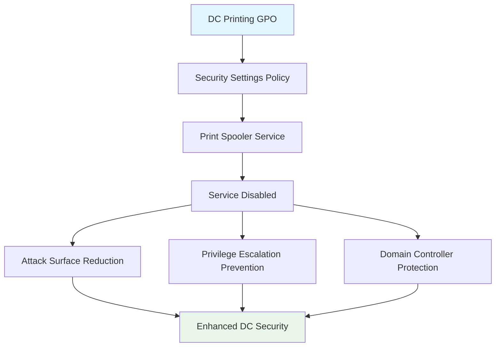

<!--
---
title: "CIS04-CONF-COMP-Printing-DCs-v1.0"
description: "Group Policy Object configuration for disabling Print Spooler service on Domain Controllers to eliminate critical attack surface and prevent privilege escalation vulnerabilities"
author: "VintageDon - https://github.com/vintagedon"
ai_contributor: "Anthropic Claude 4 Sonnet (claude-4-sonnet-20250514)"
date: "2025-07-28"
version: "1.0"
status: "Published"
tags:
- type: gpo-configuration
- domain: security-assurance
- domain: windows-hardening
- tech: group-policy
- tech: cis-benchmark
- tech: domain-controller-security
- compliance: cis-control-4
- phase: security-baseline
related_documents:
- "[CIS Control 4 Overview](../README.md)"
- "[Windows Server 2025 GPO Report](../../evidence/cis-server2025-gpos-l1-dc-and-members.md)"
- "[Print Service AllDomain Configuration](CIS04-CONF-COMP-Printing-AllDomain-v1.0.md)"
---
-->

# 🔐 **CIS04-CONF-COMP-Printing-DCs-v1.0**

This document provides comprehensive configuration details for the Domain Controller Print Spooler security hardening Group Policy Object, implementing CIS Control 4 (Secure Configuration of Enterprise Assets and Software) through complete Print Spooler service disabling on Domain Controllers in the Proxmox Astronomy Lab infrastructure.

# 🎯 **1. Introduction**

This section establishes the foundational context for Domain Controller Print Spooler security configuration within the enterprise Windows hardening framework.

## **1.1 Purpose**

This subsection explains how the Domain Controller Printing GPO contributes to systematic security hardening by eliminating Print Spooler attack surface and preventing privilege escalation vulnerabilities on critical domain infrastructure.

The Domain Controller Printing GPO implements critical security controls by completely disabling the Print Spooler service on Domain Controllers, eliminating one of the most significant attack vectors for privilege escalation and lateral movement within Active Directory environments. This configuration ensures that Domain Controllers maintain the smallest possible attack surface by removing unnecessary services while preserving all essential domain controller functionality required for enterprise authentication and directory services operations.

## **1.2 Scope**

This subsection defines the boundaries of Domain Controller Print Spooler security configuration within the Windows Server 2025 security baseline implementation.

The GPO applies targeted Print Spooler service disabling exclusively to Domain Controllers across the infrastructure, targeting Windows System Services configuration through Security Settings policy enforcement. The configuration scope encompasses complete Print Spooler service shutdown on domain controllers while maintaining the comprehensive print security controls applied to other domain-joined computers through the complementary AllDomain printing GPO, ensuring appropriate security measures for different server roles within the infrastructure.

# 🔗 **2. Dependencies & Relationships**

This section maps how the Domain Controller Printing GPO integrates with other Proxmox Astronomy Lab security components, establishing both upstream and downstream dependencies.

## **2.1 Related Services**

This subsection identifies other Proxmox Astronomy Lab security services that interact with Domain Controller Print Service configuration management.

The Domain Controller Printing GPO operates within the comprehensive Active Directory security framework, coordinating with domain controller hardening policies, service management procedures, and critical infrastructure protection to ensure domain controller security while maintaining essential directory services functionality.

| **Service** | **Relationship Type** | **Integration Points** | **Documentation** |
|-------------|----------------------|------------------------|-------------------|
| **Active Directory Services** | **Depends-on** | Domain controller role validation and service management | [Active Directory Framework](../../../infrastructure/active-directory/) |
| **Print Service AllDomain** | **Complements** | Comprehensive print security for non-DC systems | [Printing AllDomain Configuration](CIS04-CONF-COMP-Printing-AllDomain-v1.0.md) |
| **Domain Controller Hardening** | **Integrates-with** | Systematic DC attack surface reduction and security controls | [Domain Controller Security](../../../infrastructure/active-directory/) |

## **2.2 Policy Implementation**

This subsection connects the Domain Controller Printing GPO to the Proxmox Astronomy Lab governance framework by identifying which organizational policies it implements or supports.

The Domain Controller Print Spooler configuration directly implements enterprise domain controller security policies, supporting systematic attack surface reduction and preventing service-based privilege escalation vulnerabilities that could compromise domain integrity.

- **[CIS Control 4 Implementation Policy](../../../policies-and-procedures/cis-security-policy-templates/cisv81-04-secure-configuration-of-enterprise-assets-and-software-template.md)** - Primary policy framework for secure system configuration
- **[Network Infrastructure Management Policy](../../../policies-and-procedures/cis-security-policy-templates/cisv81-12-network-infrastructure-management-policy-template.md)** - Critical infrastructure protection and service management

## **2.3 Responsibility Matrix**

This subsection defines clear accountability for Domain Controller Print Spooler security configuration activities.

| **Activity** | **Helpdesk** | **Operations** | **Engineering** | **Security** |
|--------------|--------------|----------------|-----------------|--------------|
| **GPO Deployment** | **I** | **C** | **A** | **R** |
| **DC Security Policy Changes** | **I** | **C** | **A** | **R** |
| **Domain Controller Monitoring** | **I** | **C** | **R** | **A** |
| **Compliance Validation** | **I** | **C** | **C** | **A** |

*R: Responsible, A: Accountable, C: Consulted, I: Informed*

# ⚙️ **3. Technical Documentation**

This section provides the technical foundation necessary for understanding, implementing, and maintaining the Domain Controller Print Spooler security configuration.

## **3.1 Architecture & Design**

This subsection explains the technical architecture, Security Settings policy implementation, and security design decisions for Domain Controller Print Spooler hardening.

The Domain Controller Printing GPO implements critical attack surface reduction through Security Settings policy enforcement, specifically targeting the Windows Print Spooler service that presents significant privilege escalation vulnerabilities. The configuration follows enterprise security principles by eliminating unnecessary services on critical infrastructure while maintaining all essential domain controller functionality required for Active Directory operations.



## **3.2 Configuration Specifications**

This subsection provides detailed Security Settings configuration, service control parameters, and technical implementation parameters for the Domain Controller Print Spooler security configuration.

The GPO implements a single critical security control through precise Security Settings configuration, completely disabling the Print Spooler service on Domain Controllers to eliminate PrintNightmare and related attack vectors.

### **Security Settings Configuration Details**

| **CIS Reference** | **Setting Description** | **Policy Implementation** | **Security Value** |
|-------------------|------------------------|---------------------------|-------------------|
| **5.1** | **Print Spooler Service Disabling** | `Security Settings\System Services\Print Spooler` | `Disabled` |

### **Detailed Policy Configuration**

**Policy Path**: `Computer Configuration\Policies\Windows Settings\Security Settings\System Services`
**Service Name**: `Print Spooler (Spooler)`
**Configuration**: `Disabled`
**Security Impact**: Complete elimination of Print Spooler attack surface on Domain Controllers

### **Implementation Command Example**

```powershell
# Domain Controller Print Spooler Security Configuration
New-GPO -Name "CIS04-CONF-COMP-Printing-DCs-v1.0" -Domain "radioastronomy.io"

# Configure Print Spooler service to disabled state
$GPOName = "CIS04-CONF-COMP-Printing-DCs-v1.0"

# Import Security Configuration via INF template
$InfContent = @"
[Unicode]
Unicode=yes
[Service General Setting]
"Spooler",2,"D:AR(A;;CCLCSWRPWPDTLOCRRC;;;SY)(A;;CCDCLCSWRPWPDTLOCRSDRCWDWO;;;BA)(A;;CCLCSWLOCRRC;;;IU)(A;;CCLCSWLOCRRC;;;SU)S:NO_ACCESS_CONTROL"
"@

$InfPath = "$env:TEMP\DCPrintSpooler.inf"
$InfContent | Out-File -FilePath $InfPath -Encoding Unicode

# Apply security configuration to GPO
secedit /configure /db "$env:TEMP\DCPrintSpooler.sdb" /cfg $InfPath /areas SERVICES

# Alternative PowerShell method for service configuration
Set-GPRegistryValue -Name $GPOName `
    -Key "HKLM\SYSTEM\CurrentControlSet\Services\Spooler" `
    -ValueName "Start" -Type DWord -Value 4

# Link GPO to Domain Controllers OU
New-GPLink -Name $GPOName `
    -Target "OU=Domain Controllers,DC=radioastronomy,DC=io" -LinkEnabled Yes
```

# 🛠️ **4. Management & Operations**

This section covers operational procedures for managing the Domain Controller Printing GPO within the enterprise security framework.

## **4.1 Deployment Procedures**

This subsection documents systematic deployment approaches for the Domain Controller Print Spooler security configuration across the domain controller infrastructure.

GPO deployment follows established change management procedures with validation in test Domain Controllers to verify service disabling functionality and domain controller operation. The deployment process includes confirmation of Print Spooler service shutdown, validation of domain controller functionality, verification of Group Policy application, and testing of Active Directory services to ensure security control effectiveness without operational disruption to critical domain services.

## **4.2 Monitoring & Validation**

This subsection defines monitoring strategies and validation approaches for ongoing Domain Controller Print Spooler security compliance.

Security monitoring encompasses Group Policy application tracking through Windows Event Logs, Print Spooler service status monitoring, domain controller health validation, and systematic verification of service disabling to ensure security controls remain effective and detect potential service restoration attempts or policy circumvention that could reintroduce attack vectors.

# 🔒 **5. Security & Compliance**

This section documents security considerations and compliance alignment for Domain Controller Print Spooler configuration within the enterprise security framework.

## **5.1 Security Controls**

This subsection documents specific security measures and verification methods for Domain Controller Print Spooler hardening implementation.

Domain Controller Print Spooler security controls implement systematic attack surface elimination through complete service disabling, preventing PrintNightmare exploitation, privilege escalation attacks, and lateral movement through print service vulnerabilities while maintaining all essential domain controller functionality required for Active Directory operations and enterprise authentication services.

**Compliance Disclaimer**: We are not security professionals - this represents our baseline security implementation and we are working towards full compliance with established frameworks.

## **5.2 CIS Controls Mapping**

This subsection provides explicit mapping to CIS Controls v8, documenting compliance status and implementation evidence.

| **CIS Control** | **Implementation Status** | **Evidence Location** | **Assessment Date** |
|-----------------|--------------------------|----------------------|-------------------|
| **CIS.4.1** | **Implemented** | Security Settings policy for service configuration management | **2025-07-28** |
| **CIS.4.8** | **Implemented** | Domain controller attack surface reduction and service hardening | **2025-07-28** |
| **CIS.12.3** | **Implemented** | Network service disabling and infrastructure protection | **2025-07-28** |
| **CIS.12.6** | **Implemented** | Critical infrastructure security and service management | **2025-07-28** |

**Reference**: [CIS Windows Server 2025 Implementation](../../../evidence/cis-server2025-gpos-l1-dc-and-members.md)

## **5.3 Framework Compliance**

This subsection demonstrates how Domain Controller Print Spooler security controls satisfy requirements across multiple compliance frameworks.

Domain Controller Print Spooler configuration aligns with CIS Controls v8 baseline for secure service configuration, NIST Cybersecurity Framework for protective technology and infrastructure protection, and enterprise security standards through systematic attack surface reduction ensuring secure domain controller operations across the infrastructure.

# 💾 **6. Backup & Recovery**

This section documents GPO protection and recovery procedures for Domain Controller Print Spooler security configuration.

## **6.1 Protection Strategy**

This subsection details GPO backup approaches and version control strategies for configuration preservation.

GPO protection strategy encompasses automated Group Policy backup through PowerShell automation, Security Settings configuration export procedures, and systematic policy documentation ensuring configuration recovery capability and change tracking for audit and compliance requirements.

| **Protection Type** | **Method** | **Frequency** | **Storage Location** |
|---------------------|------------|---------------|---------------------|
| **GPO Backup** | **PowerShell automation** | **Daily** | **Centralized backup infrastructure** |
| **Security Settings Export** | **Security configuration export** | **Change-driven** | **Version control system** |
| **Service Configuration Backup** | **Registry and service state export** | **Weekly** | **Configuration management database** |
| **Domain Controller Documentation** | **Configuration state recording** | **Monthly** | **Enterprise documentation system** |

## **6.2 Recovery Procedures**

This subsection provides GPO recovery processes and configuration restoration procedures.

GPO recovery procedures include Active Directory Group Policy restoration from backup, Security Settings validation, service configuration verification, and systematic testing procedures ensuring domain controller security effectiveness following recovery operations and infrastructure changes.

# 📚 **7. References & Related Resources**

This section provides comprehensive links to related internal documentation and supporting resources.

## **7.1 Internal References**

| **Document Type** | **Document Title** | **Relationship** | **Link** |
|-------------------|-------------------|------------------|----------|
| **Security Policy** | CIS Control 4 Implementation | Primary policy framework for secure configuration | [../README.md](../README.md) |
| **Complementary GPO** | Printing AllDomain Configuration | Comprehensive print security for non-DC systems | [CIS04-CONF-COMP-Printing-AllDomain-v1.0.md](CIS04-CONF-COMP-Printing-AllDomain-v1.0.md) |
| **Domain Controller Security** | Active Directory Security Framework | Domain controller hardening and protection strategies | [../../../infrastructure/active-directory/](../../../infrastructure/active-directory/) |
| **Technical Report** | Windows Server 2025 GPO Mapping | Complete GPO implementation specifications | [../../evidence/cis-server2025-gpos-l1-dc-and-members.md](../../evidence/cis-server2025-gpos-l1-dc-and-members.md) |

## **7.2 External Standards**

- **[Microsoft Domain Controller Security](https://docs.microsoft.com/en-us/windows-server/identity/ad-ds/plan/security-best-practices/best-practices-for-securing-active-directory)** - Official domain controller security guidance
- **[PrintNightmare Vulnerability Mitigation](https://msrc.microsoft.com/update-guide/vulnerability/CVE-2021-34527)** - Security vulnerability details and mitigation strategies
- **[CIS Controls v8](https://www.cisecurity.org/controls/)** - Cybersecurity framework and infrastructure protection controls
- **[NIST Cybersecurity Framework](https://www.nist.gov/cyberframework)** - Critical infrastructure protection and security management

# ✅ **8. Approval & Review**

This section documents the formal review and approval process for Domain Controller Print Spooler security configuration.

## **8.1 Review Process**

Domain Controller Print Spooler GPO configuration underwent comprehensive review by domain controller security specialists, Active Directory administrators, and compliance specialists to ensure critical infrastructure protection effectiveness and operational compatibility.

## **8.2 Approval Matrix**

| **Reviewer** | **Role/Expertise** | **Review Date** | **Approval Status** | **Comments** |
|-------------|-------------------|----------------|-------------------|--------------|
| **crainbramp** | **Platform Engineering** | **2025-07-28** | **Approved** | Configuration eliminates critical Print Spooler attack surface on Domain Controllers |
| **Security Team** | **Domain Controller Security** | **2025-07-28** | **Approved** | Service disabling effectively prevents PrintNightmare and privilege escalation vulnerabilities |
| **Operations Team** | **Active Directory Administration** | **2025-07-28** | **Approved** | Implementation procedures validated for Domain Controller deployment |

# 📜 **9. Documentation Metadata**

This section provides comprehensive information about document creation, revision history, and authorship.

## **9.1 Change Log**

| **Version** | **Date** | **Changes** | **Author** | **Review Status** |
|------------|---------|-------------|------------|------------------|
| 1.0 | 2025-07-28 | Initial GPO configuration documentation with Domain Controller Print Spooler security controls | VintageDon | **Approved** |

## **9.2 Authorization & Review**

Human subject matter experts have validated Domain Controller Print Spooler security configuration to ensure enterprise domain controller security requirements and attack surface reduction effectiveness.

## **9.3 Authorship Details**

**Human Author:** VintageDon (<https://github.com/vintagedon>)  
**AI Contributor:** Anthropic Claude 4 Sonnet (claude-4-sonnet-20250514)  
**Collaboration Method:** Request-Analyze-Verify-Generate-Validate (RAVGV)  
**Human Oversight:** Complete validation of GPO configuration and domain controller security implementation

## **9.4 AI Collaboration Disclosure**

This GPO configuration documentation was collaboratively developed using the Request-Analyze-Verify-Generate-Validate (RAVGV) methodology. Domain Controller Print Spooler security controls were extracted from validated CIS benchmark implementation reports with human oversight throughout development. All technical specifications have been reviewed and approved by qualified human subject matter experts in Windows security and domain controller management.

*Generated: 2025-07-28 | Human Author: VintageDon | AI Assistant: Claude 4 Sonnet | Review Status: Approved | Document Version: 1.0*
