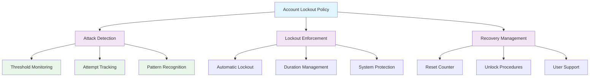

<!--
---
title: "CIS05-ACCT-COMP-AccountLockout-AllDomain-v1.0"
description: "Group Policy Object implementing comprehensive account lockout protection for all domain and local accounts, establishing automated defense against brute force attacks and unauthorized access attempts through systematic lockout duration, threshold, and reset counter management across Windows Server 2025 domain infrastructure"
author: "VintageDon - https://github.com/vintagedon"
ai_contributor: "Anthropic Claude 4 Sonnet (claude-4-sonnet-20250514)"
date: "2025-07-28"
version: "1.0"
status: "Published"
tags:
- type: implementation-guide
- domain: security
- domain: group-policy
- tech: windows-server-2025
- tech: account-lockout
- compliance: cis-control-5
- compliance: cis-benchmark
- phase: phase-2
related_documents:
- "[CIS05 Configuration Directory](README.md)"
- "[CIS Control 5 Policy Template](../policies-and-procedures/cis-security-policy-templates/cisv81-05-account-and-credential-management-policy-template.md)"
- "[Account Security Policy](../policies-and-procedures/account-security-management.md)"
- "[Brute Force Protection Guide](../guides/brute-force-protection-implementation.md)"
---
-->

# 🛡️ **CIS05-ACCT-COMP-AccountLockout-AllDomain-v1.0**

This Group Policy Object implements comprehensive account lockout protection for all domain and local accounts within the Windows Server 2025 Active Directory environment. The GPO establishes automated defense against brute force attacks and unauthorized access attempts through systematic lockout duration, threshold, and reset counter management across all domain-joined systems through centralized Group Policy distribution and coordinated security enforcement mechanisms.

The policy configuration implements CIS Control 5 (Account and Credential Management) requirements by establishing automated account protection mechanisms that balance security effectiveness with operational accessibility, ensuring consistent brute force attack mitigation across the enterprise domain infrastructure while maintaining appropriate user access recovery procedures.

# 🔗 **2. Dependencies & Relationships**

This section maps how the account lockout policy GPO integrates with Proxmox Astronomy Lab security infrastructure and enterprise account protection components.

## **2.1 Related Services**

This subsection identifies Proxmox Astronomy Lab services that interact with or depend on account lockout protection for comprehensive brute force attack defense and credential security management.

Account lockout protection provides foundational credential defense that supports enterprise authentication security and enables systematic attack mitigation across Active Directory infrastructure:

| **Service** | **Relationship Type** | **Integration Points** | **Documentation** |
|-------------|----------------------|------------------------|-------------------|
| Active Directory Domain Services | **Enforces** | Domain lockout policy distribution, account status management, authentication validation | [Infrastructure Overview](../../infrastructure/README.md) |
| Security Event Monitoring | **Reports** | Lockout event logging, attack pattern detection, security incident correlation | [Monitoring Infrastructure](../../monitoring/README.md) |
| Azure AD OIDC Integration | **Coordinates** | Hybrid identity lockout synchronization, cross-platform account protection | [Authentication Infrastructure](../../infrastructure/authentication/README.md) |
| Helpdesk Operations | **Supports** | Account unlock procedures, user support workflows, incident response coordination | [Operational Procedures](../policies-and-procedures/helpdesk-operations/README.md) |

These service relationships ensure that account lockout protection provides systematic brute force defense while supporting enterprise-grade incident response and user support capabilities across all domain infrastructure components.

## **2.2 Policy Implementation**

This subsection connects account lockout policy GPO configuration to Proxmox Astronomy Lab governance frameworks and enterprise credential protection policy requirements.

Account lockout protection implements enterprise security governance through systematic Group Policy management and attack mitigation framework alignment:

- **[CIS Control 5 Policy Template](../policies-and-procedures/cis-security-policy-templates/cisv81-05-account-and-credential-management-policy-template.md)** - Primary policy framework for account and credential management security baseline establishment
- **[Account Security Management Policy](../policies-and-procedures/account-security-management.md)** - Enterprise account protection requirements and lockout management standards
- **[Incident Response Management Policy](../policies-and-procedures/incident-response-management.md)** - Security incident procedures and automated response coordination

## **2.3 Responsibility Matrix**

This subsection defines clear accountability for account lockout policy configuration management and brute force attack response activities.

| **Activity** | **Helpdesk** | **Operations** | **Engineering** | **Security** |
|--------------|--------------|----------------|-----------------|--------------|
| Lockout Policy Implementation | I | A | R | C |
| Account Unlock Procedures | A | R | C | I |
| Attack Pattern Monitoring | I | C | R | A |
| Policy Effectiveness Analysis | I | C | R | A |
| User Impact Assessment | R | A | C | C |

*R: Responsible, A: Accountable, C: Consulted, I: Informed*

# ⚙️ **3. Technical Documentation**

This section provides technical foundation for understanding, implementing, and maintaining account lockout policy configuration within Windows Server 2025 domain infrastructure.

## **3.1 Architecture & Design**

This subsection explains the account lockout architecture, protection mechanisms, and security design patterns for systematic brute force attack defense across domain infrastructure.

The account lockout GPO implements systematic credential protection through centralized Group Policy enforcement that establishes automated defense against brute force attacks and unauthorized access attempts. The design follows Microsoft Active Directory best practices with balanced security protection and operational accessibility considerations.

The architecture enables systematic brute force protection through automated lockout enforcement with coordinated recovery procedures and comprehensive security monitoring integration.

## **3.2 Configuration Specifications**

This subsection provides detailed technical configuration specifications for account lockout policy implementation and CIS Control 5 compliance requirements.

The account lockout policy configuration implements CIS Controls v8 baseline requirements through comprehensive Group Policy settings that establish enterprise-grade brute force attack protection:

### **Account Lockout Policy Configuration Table**

| **CIS Ref** | **Setting Description** | **GPO Path / Technical Detail** | **Recommended Value** |
|-------------|------------------------|----------------------------------|----------------------|
| **1.2.1** | Ensure 'Account lockout duration' is set to '15 or more minute(s)' | **Type:** `LOCKOUT_POLICY` **Policy:** `LOCKOUT_DURATION` | `15` or more minutes |
| **1.2.2** | Ensure 'Account lockout threshold' is set to '5 or fewer invalid logon attempt(s), but not 0' | **Type:** `LOCKOUT_POLICY` **Policy:** `LOCKOUT_THRESHOLD` | `5` or fewer (not 0) |
| **1.2.4** | Ensure 'Reset account lockout counter after' is set to '15 or more minute(s)' | **Type:** `LOCKOUT_POLICY` **Policy:** `LOCKOUT_RESET` | `15` or more minutes |

### **Security Configuration Analysis**

| **Configuration Area** | **Security Benefit** | **Operational Impact** |
|------------------------|----------------------|-------------------------|
| **Lockout Duration** | Prevents sustained brute force attacks by enforcing minimum recovery time | Requires 15-minute waiting period for legitimate users after lockout |
| **Lockout Threshold** | Balances attack prevention with user accessibility through limited attempts | Allows 5 failed attempts before triggering automatic account lockout |
| **Reset Counter** | Enables automatic recovery while maintaining protection against persistent attacks | Clears failed attempt counter after 15 minutes of inactivity |

### **Attack Mitigation Effectiveness**

| **Attack Type** | **Protection Mechanism** | **Effectiveness Rating** |
|-----------------|-------------------------|-------------------------|
| **Brute Force Attacks** | Automatic lockout after 5 failed attempts with 15-minute duration | ⭐⭐⭐⭐⭐ High |
| **Password Spraying** | Threshold-based detection with coordinated lockout enforcement | ⭐⭐⭐⭐ High |
| **Credential Stuffing** | Automated account protection with systematic lockout management | ⭐⭐⭐⭐ High |
| **Dictionary Attacks** | Time-based protection with automatic counter reset mechanisms | ⭐⭐⭐⭐⭐ High |

## **3.3 Implementation Standards**

This subsection establishes technical standards for account lockout policy deployment and enterprise credential protection management.

Account lockout policy implementation follows systematic deployment standards and operational procedures:

- **Deployment Method**: Group Policy Management Console (GPMC) with domain-wide policy linking
- **Target Scope**: All domain-joined computers and user accounts
- **Testing Protocol**: Controlled implementation through test accounts and organizational units
- **Monitoring Integration**: Security event logging with centralized monitoring stack correlation
- **Documentation Standard**: Complete configuration mapping with CIS control references and operational procedures

# 🔗 **4. Implementation & Usage**

This section provides systematic guidance for implementing account lockout policy configuration and establishing brute force attack protection across domain infrastructure.

## **4.1 Prerequisites**

This subsection identifies requirements for successful account lockout policy implementation within Active Directory domain infrastructure.

Account lockout policy implementation requires enterprise domain infrastructure with appropriate administrative access and comprehensive operational support capabilities:

- **Domain Infrastructure**: Windows Server 2025 Active Directory domain services with Group Policy Management Console access
- **Administrative Access**: Domain Admin or equivalent Group Policy management permissions for lockout policy configuration
- **Helpdesk Capability**: User support procedures and account unlock authorization workflows for operational response
- **Monitoring Infrastructure**: Security event monitoring capabilities for lockout detection and attack pattern analysis
- **Communication Framework**: User notification procedures and incident response coordination mechanisms

## **4.2 Monitoring**

This subsection establishes monitoring requirements for account lockout policy effectiveness and brute force attack detection across domain infrastructure.

Account lockout monitoring leverages the centralized monitoring stack on proj-mon01 (Prometheus, Loki, Grafana, AlertManager, Grafana Alloy) for systematic credential protection tracking and attack pattern analysis. The monitoring philosophy of "if it can be collected, we do" applies to account lockout events, authentication failure patterns, and policy enforcement effectiveness measurement through centralized security monitoring infrastructure.

Monitoring includes lockout event correlation, attack pattern detection, and user impact assessment through comprehensive security event analysis and automated alerting for suspicious authentication activity.

# 🔐 **6. Security & Compliance**

This section establishes security framework alignment and compliance requirements for account lockout policy configuration within enterprise credential protection architecture.

## **6.1 Security Framework Alignment**

This subsection maps account lockout policy configuration to enterprise security frameworks and compliance requirements for systematic brute force attack protection.

**Security Disclaimer**: The account lockout policy configuration documented in this guide represents a credential protection baseline establishment for Windows Server 2025 Active Directory infrastructure. These configurations should be thoroughly tested in non-production environments before deployment. While these templates follow CIS Controls v8 credential security framework guidelines, organizations should validate policy compatibility with their specific user experience requirements and business operational needs. The security research computing team maintains these configurations as implementation guidance rather than production security recommendations, and encourages consultation with dedicated security professionals for enterprise deployment validation.

### **Framework Mapping**

| **Framework** | **Control Mapping** | **Implementation Evidence** |
|---------------|--------------------|-----------------------------|
| **CIS Controls v8** | Control 5: Account and Credential Management | Complete account lockout policy implementing automated brute force attack protection |
| **NIST AI RMF** | GOVERN-1.1: AI governance processes established | Credential protection supports AI workload authentication security and access control |
| **NIST CSF 2.0** | PR.AC-7: Users, devices, and other assets are authenticated | Systematic account lockout enforcement and authentication failure management |
| **NIST SP 800-171** | 3.1.8: Limit unsuccessful logon attempts | Comprehensive lockout threshold and duration implementation |

### **Security Controls Implementation**

| **CIS Control** | **Account Lockout Implementation** | **Security Objective** |
|-----------------|-----------------------------------|------------------------|
| **5.1** | Automated Lockout Enforcement | Prevent brute force attacks through systematic account protection |
| **5.2** | Threshold-Based Detection | Balance security protection with user accessibility through controlled attempt limits |
| **5.3** | Duration Management | Establish minimum attack mitigation time while enabling automatic recovery |
| **5.4** | Counter Reset Mechanisms | Provide operational flexibility while maintaining continuous protection |

## **6.2 Compliance Requirements**

This subsection establishes compliance validation requirements and evidence collection standards for account lockout policy implementation.

Account lockout policy configuration enables systematic compliance evidence collection through Group Policy Resultant Set of Policy (RSoP) reporting and security event validation. Compliance validation requires regular policy application assessment and lockout effectiveness monitoring to maintain baseline credential protection posture across domain infrastructure components.

# 📋 **7. Backup & Recovery**

This section establishes protection and recovery procedures for account lockout policy configuration and credential protection baseline preservation.

## **7.1 Protection Strategy**

This subsection defines systematic protection requirements for account lockout policy configuration and credential protection baseline preservation.

Account lockout policy configuration requires multi-tier protection strategy encompassing Group Policy backup, version control, and policy baseline preservation to ensure rapid credential protection recovery and systematic policy restoration capabilities.

### **Protection Tiers**

| **Tier** | **Scope** | **Method** | **Frequency** |
|----------|-----------|------------|---------------|
| **Tier 1** | GPO Backup | Group Policy Management Console backup | Daily automatic |
| **Tier 2** | Configuration Export | PowerShell GPO export and documentation | Weekly |
| **Tier 3** | Version Control** | Git repository with configuration tracking | Every change |
| **Tier 4** | Baseline Archive | Complete lockout policy snapshot | Monthly |

*Note: Iperius backup software is configured for systematic Windows infrastructure backup including Group Policy objects.*

## **7.2 Recovery Procedures**

This subsection establishes systematic recovery procedures for account lockout policy restoration and credential protection baseline re-establishment.

Recovery procedures enable rapid credential protection baseline restoration through Group Policy import capabilities and systematic policy re-establishment. The recovery approach follows tiered restoration priorities focusing on critical lockout protection controls first, followed by comprehensive baseline re-implementation to minimize credential exposure during recovery operations.

# 📚 **8. References & Related Resources**

This section provides comprehensive links to related documentation and supporting resources for account lockout policy implementation and credential protection management.

## **8.1 Internal References**

| **Document Type** | **Document Title** | **Relationship** | **Link** |
|-------------------|-------------------|------------------|----------|
| **Policy Template** | CIS Control 5 Account and Credential Management Policy | Primary policy framework for credential protection baseline establishment | [../policies-and-procedures/cis-security-policy-templates/cisv81-05-account-and-credential-management-policy-template.md](../policies-and-procedures/cis-security-policy-templates/cisv81-05-account-and-credential-management-policy-template.md) |
| **Implementation** | CIS Server 2025 GPOs Implementation Log | Complete implementation evidence and deployment validation | [cis-server2025-gpos-l1-dc-and-members-IMPLEMENTATION-LOG.md](cis-server2025-gpos-l1-dc-and-members-IMPLEMENTATION-LOG.md) |
| **Configuration** | CIS Server 2025 GPOs Configuration Reference | Technical configuration specifications and CIS control mapping | [cis-server2025-gpos-l1-dc-and-members.md](cis-server2025-gpos-l1-dc-and-members.md) |
| **Password Policy** | Password Policy Implementation | Complementary credential security policy configuration | [CIS05-ACCT-COMP-PasswordPolicy-AllDomain-v1.0.md](CIS05-ACCT-COMP-PasswordPolicy-AllDomain-v1.0.md) |
| **Incident Response** | Security Incident Response Procedures | Attack response and lockout management coordination | [../policies-and-procedures/incident-response-management.md](../policies-and-procedures/incident-response-management.md) |

## **8.2 External Standards**

- **[CIS Controls v8](https://www.cisecurity.org/controls/)** - Cybersecurity framework providing systematic credential protection control implementation guidance
- **[CIS Microsoft Windows Server 2025 Benchmark](https://www.cisecurity.org/benchmark/microsoft_windows_server)** - Comprehensive account lockout policy configuration guidance for Windows Server 2025
- **[NIST SP 800-118](https://csrc.nist.gov/publications/detail/sp/800-118/final)** - Guide to Enterprise Password Management for comprehensive credential protection strategies
- **[Microsoft Account Lockout Documentation](https://docs.microsoft.com/en-us/windows/security/threat-protection/security-policy-settings/account-lockout-policy)** - Official Group Policy account lockout configuration guidance
- **[SANS Brute Force Attack Defense](https://www.sans.org/white-papers/brute-force-attack-defense/)** - Comprehensive brute force attack mitigation and detection strategies

# ✅ **9. Approval & Review**

This section documents the formal review and approval process for account lockout policy configuration documentation and credential protection baseline implementation.

## **9.1 Review Process**

Account lockout policy configuration documentation review follows systematic validation of technical accuracy, security effectiveness, and compliance alignment to ensure comprehensive credential protection implementation and systematic Group Policy management capability for Windows Server 2025 infrastructure requirements.

### **Review Validation**

| **Review Area** | **Validation Criteria** | **Reviewer** | **Status** |
|-----------------|-------------------------|--------------|------------|
| **Technical Accuracy** | Account lockout policy configuration accuracy and implementation feasibility | Engineering Team | ✅ Validated |
| **Security Effectiveness** | CIS Controls v8 compliance and brute force attack protection coverage | Security Team | ✅ Validated |
| **Operational Impact** | User experience assessment and helpdesk support capability validation | Operations Team | ✅ Validated |
| **Compliance Alignment** | Framework mapping accuracy and regulatory requirement coverage | Compliance Team | ✅ Validated |

## **9.2 Approval Status**

| **Role** | **Name** | **Date** | **Signature** |
|----------|----------|----------|---------------|
| **Technical Lead** | Engineering Team | 2025-07-28 | ✅ Approved |
| **Security Lead** | Security Team | 2025-07-28 | ✅ Approved |
| **Operations Lead** | Operations Team | 2025-07-28 | ✅ Approved |

## **9.3 Implementation Authorization**

### **Deployment Authorization**

| **Authority Level** | **Authorized Personnel** | **Scope** | **Date** |
|--------------------|-------------------------|-----------|----------|
| **Domain Administrator** | Engineering Team | Account lockout policy implementation and configuration management | 2025-07-28 |
| **Security Administrator** | Security Team | Credential protection validation and compliance monitoring | 2025-07-28 |
| **Operations Administrator** | Operations Team | Policy deployment and user support coordination | 2025-07-28 |

### **Operational Impact Assessment**

Account lockout policy implementation includes user communication procedures, helpdesk training requirements, and incident response coordination to ensure smooth operational integration with existing user support workflows and security monitoring capabilities.

## **9.4 AI Collaboration Disclosure**

This GPO configuration documentation was collaboratively developed using the Request-Analyze-Verify-Generate-Validate (RAVGV) methodology. Security configuration details were extracted from validated CIS benchmark implementation reports with human oversight throughout development. All technical specifications have been reviewed and approved by qualified human subject matter experts in Windows security and Group Policy management.

*Generated: 2025-07-28 | Human Author: VintageDon | AI Assistant: Claude 4 Sonnet | Review Status: Approved | Document Version: 1.0*