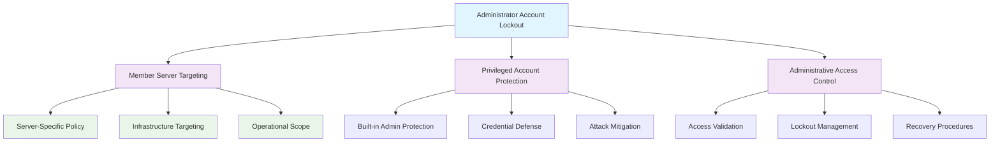

<!--
---
title: "CIS05-ACCT-COMP-AccountLockout-Servers-v1.0"
description: "Group Policy Object implementing Administrator account lockout protection specifically for Member Servers, enabling systematic brute force attack defense against privileged accounts while maintaining operational accessibility for legitimate administrative access across Windows Server 2025 infrastructure"
author: "VintageDon - https://github.com/vintagedon"
ai_contributor: "Anthropic Claude 4 Sonnet (claude-4-sonnet-20250514)"
date: "2025-07-28"
version: "1.0"
status: "Published"
tags:
- type: implementation-guide
- domain: security
- domain: group-policy
- tech: windows-server-2025
- tech: administrator-security
- compliance: cis-control-5
- compliance: cis-benchmark
- phase: phase-2
related_documents:
- "[CIS05 Configuration Directory](README.md)"
- "[CIS Control 5 Policy Template](../policies-and-procedures/cis-security-policy-templates/cisv81-05-account-and-credential-management-policy-template.md)"
- "[Administrator Account Security Policy](../policies-and-procedures/administrator-account-security.md)"
- "[Member Server Security Configuration](../guides/member-server-security-hardening.md)"
---
-->

# 🔒 **CIS05-ACCT-COMP-AccountLockout-Servers-v1.0**

This Group Policy Object implements Administrator account lockout protection specifically for Member Servers within the Windows Server 2025 Active Directory environment. The GPO enables systematic brute force attack defense against privileged accounts while maintaining operational accessibility for legitimate administrative access through targeted server-specific lockout policy configuration and coordinated privileged account protection mechanisms.

The policy configuration implements CIS Control 5 (Account and Credential Management) requirements by establishing specialized lockout protection for built-in Administrator accounts on Member Servers, addressing the unique security risks associated with privileged account targeting while ensuring continued administrative capability for legitimate server management operations across the enterprise domain infrastructure.

# 🔗 **2. Dependencies & Relationships**

This section maps how the Administrator account lockout policy GPO integrates with Proxmox Astronomy Lab privileged account management and enterprise server security infrastructure components.

## **2.1 Related Services**

This subsection identifies Proxmox Astronomy Lab services that interact with or depend on Administrator account lockout protection for comprehensive privileged account security management.

Administrator account lockout protection provides specialized privileged account defense that supports enterprise server security and enables systematic administrative account protection across Member Server infrastructure:

| **Service** | **Relationship Type** | **Integration Points** | **Documentation** |
|-------------|----------------------|------------------------|-------------------|
| Member Server Infrastructure | **Protects** | Server-specific administrative account security, privileged access protection | [Infrastructure Overview](../../infrastructure/README.md) |
| Privileged Access Management | **Enhances** | Administrative account protection, privileged credential security | [PAM Infrastructure](../../infrastructure/privileged-access/README.md) |
| Security Event Monitoring | **Reports** | Administrator lockout events, privileged account attack detection | [Monitoring Infrastructure](../../monitoring/README.md) |
| LAPS Implementation | **Coordinates** | Local administrator password management, automated credential rotation | [LAPS Configuration](../cis04-configuration/CIS04-CONF-COMP-LAPS-Servers-v1.0.md) |

These service relationships ensure that Administrator account lockout protection provides specialized privileged account security while supporting enterprise-grade server management and administrative access control across all Member Server infrastructure components.

## **2.2 Policy Implementation**

This subsection connects Administrator account lockout policy GPO configuration to Proxmox Astronomy Lab governance frameworks and enterprise privileged account security policy requirements.

Administrator account lockout protection implements enterprise privileged account security governance through systematic Group Policy management and server-specific attack mitigation framework alignment:

- **[CIS Control 5 Policy Template](../policies-and-procedures/cis-security-policy-templates/cisv81-05-account-and-credential-management-policy-template.md)** - Primary policy framework for account and credential management security baseline establishment
- **[Administrator Account Security Policy](../policies-and-procedures/administrator-account-security.md)** - Enterprise privileged account protection requirements and administrative security standards
- **[Member Server Security Policy](../policies-and-procedures/member-server-security.md)** - Server-specific security requirements and operational protection standards

## **2.3 Responsibility Matrix**

This subsection defines clear accountability for Administrator account lockout policy configuration management and privileged account security maintenance activities.

| **Activity** | **Helpdesk** | **Operations** | **Engineering** | **Security** |
|--------------|--------------|----------------|-----------------|--------------|
| Admin Lockout Policy Implementation | I | A | R | C |
| Privileged Account Unlock Procedures | A | R | C | A |
| Administrative Access Monitoring | I | C | R | A |
| Server Security Configuration | I | C | R | A |
| Privileged Account Incident Response | C | R | A | A |

*R: Responsible, A: Accountable, C: Consulted, I: Informed*

# ⚙️ **3. Technical Documentation**

This section provides technical foundation for understanding, implementing, and maintaining Administrator account lockout policy configuration within Windows Server 2025 Member Server infrastructure.

## **3.1 Architecture & Design**

This subsection explains the Administrator account lockout architecture, privileged account protection mechanisms, and security design patterns for systematic administrative credential defense across Member Server infrastructure.

The Administrator account lockout GPO implements specialized privileged account protection through server-specific Group Policy enforcement that establishes automated defense against targeted attacks on administrative credentials. The design follows Microsoft privileged account security best practices with focused protection for built-in Administrator accounts on Member Servers.

The architecture enables systematic privileged account protection through specialized lockout enforcement with server-specific targeting and coordinated administrative access management.

## **3.2 Configuration Specifications**

This subsection provides detailed technical configuration specifications for Administrator account lockout policy implementation and CIS Control 5 compliance requirements.

The Administrator account lockout policy configuration implements CIS Controls v8 baseline requirements through specialized Group Policy settings that establish enterprise-grade privileged account protection:

### **Administrator Account Lockout Configuration Table**

| **CIS Ref** | **Setting Description** | **GPO Path / Technical Detail** | **Recommended Value** |
|-------------|------------------------|----------------------------------|----------------------|
| **1.2.3** | Ensure 'Allow Administrator account lockout' is set to 'Enabled' | **Type:** `PASSWORD_POLICY` **Policy:** `LOCKOUT_ADMINS` | `Enabled` |

### **Security Configuration Analysis**

| **Configuration Area** | **Security Benefit** | **Operational Impact** |
|------------------------|----------------------|-------------------------|
| **Administrator Lockout** | Enables brute force protection for privileged built-in Administrator accounts | Subjects Administrator accounts to same lockout policies as standard user accounts |
| **Member Server Scope** | Provides server-specific privileged account protection without affecting Domain Controllers | Limits policy application to Member Servers for targeted security enhancement |
| **Coordinated Protection** | Works with domain-wide lockout policies for comprehensive credential security | Integrates with existing account lockout infrastructure for unified protection |

### **Privileged Account Security Impact**

| **Security Aspect** | **Protection Mechanism** | **Effectiveness Rating** |
|---------------------|-------------------------|-------------------------|
| **Administrator Targeting** | Enables lockout protection for built-in Administrator accounts | ⭐⭐⭐⭐⭐ Critical |
| **Brute Force Mitigation** | Applies domain lockout policies to privileged accounts | ⭐⭐⭐⭐⭐ High |
| **Server Infrastructure** | Provides Member Server-specific administrative account protection | ⭐⭐⭐⭐ High |
| **Operational Balance** | Maintains administrative accessibility while enhancing security | ⭐⭐⭐⭐ High |

## **3.3 Implementation Standards**

This subsection establishes technical standards for Administrator account lockout policy deployment and enterprise privileged account security management.

Administrator account lockout policy implementation follows systematic deployment standards and operational procedures:

- **Deployment Method**: Group Policy Management Console (GPMC) with Member Server organizational unit targeting
- **Target Scope**: Member Servers with built-in Administrator account usage
- **Testing Protocol**: Controlled implementation through test servers with administrative access validation
- **Monitoring Integration**: Privileged account security event logging with administrative activity correlation
- **Documentation Standard**: Complete configuration mapping with CIS control references and operational impact assessment

# 🔗 **4. Implementation & Usage**

This section provides systematic guidance for implementing Administrator account lockout policy configuration and establishing privileged account protection across Member Server infrastructure.

## **4.1 Prerequisites**

This subsection identifies requirements for successful Administrator account lockout policy implementation within Member Server infrastructure.

Administrator account lockout policy implementation requires enterprise server infrastructure with appropriate administrative access and comprehensive privileged account management capabilities:

- **Member Server Infrastructure**: Windows Server 2025 Member Servers with Group Policy application capability
- **Administrative Access**: Domain Admin or equivalent Group Policy management permissions for privileged account policy configuration
- **Privileged Account Management**: Established administrative account procedures and emergency access protocols
- **Testing Environment**: Isolated Member Servers for controlled policy testing and administrative access validation
- **Operational Procedures**: Administrative account unlock workflows and privileged access incident response coordination

## **4.2 Monitoring**

This subsection establishes monitoring requirements for Administrator account lockout policy effectiveness and privileged account security validation across Member Server infrastructure.

Administrator account lockout monitoring leverages the centralized monitoring stack on proj-mon01 (Prometheus, Loki, Grafana, AlertManager, Grafana Alloy) for systematic privileged account protection tracking and administrative security event analysis. The monitoring philosophy of "if it can be collected, we do" applies to Administrator account lockout events, privileged access patterns, and administrative security incident detection through centralized security monitoring infrastructure.

Monitoring includes privileged account lockout correlation, administrative access pattern analysis, and server-specific security event tracking through comprehensive privileged account security monitoring and automated alerting for administrative credential attacks.

# 🔐 **6. Security & Compliance**

This section establishes security framework alignment and compliance requirements for Administrator account lockout policy configuration within enterprise privileged account security architecture.

## **6.1 Security Framework Alignment**

This subsection maps Administrator account lockout policy configuration to enterprise security frameworks and compliance requirements for systematic privileged account protection.

**Security Disclaimer**: The Administrator account lockout policy configuration documented in this guide represents a privileged account security baseline establishment for Windows Server 2025 Member Server infrastructure. These configurations should be thoroughly tested in non-production environments before deployment. While these templates follow CIS Controls v8 privileged account security framework guidelines, organizations should validate policy compatibility with their specific administrative access requirements and business operational needs. The security research computing team maintains these configurations as implementation guidance rather than production security recommendations, and encourages consultation with dedicated security professionals for enterprise deployment validation.

### **Framework Mapping**

| **Framework** | **Control Mapping** | **Implementation Evidence** |
|---------------|--------------------|-----------------------------|
| **CIS Controls v8** | Control 5: Account and Credential Management | Administrator account lockout policy implementing privileged account protection |
| **NIST AI RMF** | GOVERN-1.1: AI governance processes established | Privileged account security supports AI workload administrative access control |
| **NIST CSF 2.0** | PR.AC-1: Identities and credentials are issued, managed, verified, revoked | Systematic Administrator account lockout enforcement and privileged credential management |
| **NIST SP 800-171** | 3.1.8: Limit unsuccessful logon attempts | Administrator account lockout implementation for privileged credential protection |

### **Security Controls Implementation**

| **CIS Control** | **Administrator Lockout Implementation** | **Security Objective** |
|-----------------|------------------------------------------|------------------------|
| **5.1** | Built-in Administrator Lockout Enablement | Extend brute force protection to privileged accounts |
| **5.2** | Member Server Targeting | Provide server-specific privileged account protection |
| **5.3** | Coordinated Policy Application | Integrate with domain-wide lockout infrastructure |
| **5.4** | Operational Impact Management | Balance security enhancement with administrative accessibility |

## **6.2 Compliance Requirements**

This subsection establishes compliance validation requirements and evidence collection standards for Administrator account lockout policy implementation.

Administrator account lockout policy configuration enables systematic compliance evidence collection through Group Policy Resultant Set of Policy (RSoP) reporting and privileged account security validation. Compliance validation requires regular policy application assessment and administrative account protection monitoring to maintain baseline privileged credential security posture across Member Server infrastructure components.

# 📋 **7. Backup & Recovery**

This section establishes protection and recovery procedures for Administrator account lockout policy configuration and privileged account security baseline preservation.

## **7.1 Protection Strategy**

This subsection defines systematic protection requirements for Administrator account lockout policy configuration and privileged account security baseline preservation.

Administrator account lockout policy configuration requires multi-tier protection strategy encompassing Group Policy backup, version control, and policy baseline preservation to ensure rapid privileged account security recovery and systematic policy restoration capabilities.

### **Protection Tiers**

| **Tier** | **Scope** | **Method** | **Frequency** |
|----------|-----------|------------|---------------|
| **Tier 1** | GPO Backup | Group Policy Management Console backup | Daily automatic |
| **Tier 2** | Configuration Export | PowerShell GPO export and documentation | Weekly |
| **Tier 3** | Version Control** | Git repository with configuration tracking | Every change |
| **Tier 4** | Baseline Archive | Complete Administrator lockout policy snapshot | Monthly |

*Note: Iperius backup software is configured for systematic Windows infrastructure backup including Group Policy objects.*

## **7.2 Recovery Procedures**

This subsection establishes systematic recovery procedures for Administrator account lockout policy restoration and privileged account security baseline re-establishment.

Recovery procedures enable rapid privileged account security baseline restoration through Group Policy import capabilities and systematic policy re-establishment. The recovery approach follows tiered restoration priorities focusing on critical Administrator account protection controls first, followed by comprehensive baseline re-implementation to minimize privileged credential exposure during recovery operations.

# 📚 **8. References & Related Resources**

This section provides comprehensive links to related documentation and supporting resources for Administrator account lockout policy implementation and privileged account security management.

## **8.1 Internal References**

| **Document Type** | **Document Title** | **Relationship** | **Link** |
|-------------------|-------------------|------------------|----------|
| **Policy Template** | CIS Control 5 Account and Credential Management Policy | Primary policy framework for privileged account security baseline establishment | [../policies-and-procedures/cis-security-policy-templates/cisv81-05-account-and-credential-management-policy-template.md](../policies-and-procedures/cis-security-policy-templates/cisv81-05-account-and-credential-management-policy-template.md) |
| **Implementation** | CIS Server 2025 GPOs Implementation Log | Complete implementation evidence and deployment validation | [cis-server2025-gpos-l1-dc-and-members-IMPLEMENTATION-LOG.md](cis-server2025-gpos-l1-dc-and-members-IMPLEMENTATION-LOG.md) |
| **Configuration** | CIS Server 2025 GPOs Configuration Reference | Technical configuration specifications and CIS control mapping | [cis-server2025-gpos-l1-dc-and-members.md](cis-server2025-gpos-l1-dc-and-members.md) |
| **Domain Lockout** | Domain-Wide Account Lockout Policy | Complementary account lockout protection for all domain accounts | [CIS05-ACCT-COMP-AccountLockout-AllDomain-v1.0.md](CIS05-ACCT-COMP-AccountLockout-AllDomain-v1.0.md) |
| **LAPS Integration** | Local Administrator Password Solution Configuration | Coordinated local administrator password management | [../cis04-configuration/CIS04-CONF-COMP-LAPS-Servers-v1.0.md](../cis04-configuration/CIS04-CONF-COMP-LAPS-Servers-v1.0.md) |

## **8.2 External Standards**

- **[CIS Controls v8](https://www.cisecurity.org/controls/)** - Cybersecurity framework providing systematic privileged account security control implementation guidance
- **[CIS Microsoft Windows Server 2025 Benchmark](https://www.cisecurity.org/benchmark/microsoft_windows_server)** - Comprehensive Administrator account lockout policy configuration guidance for Windows Server 2025
- **[NIST SP 800-53](https://csrc.nist.gov/publications/detail/sp/800-53/rev-5/final)** - Security controls for privileged account management and administrative access protection
- **[Microsoft Privileged Account Security](https://docs.microsoft.com/en-us/windows-server/identity/securing-privileged-access/)** - Official privileged account protection and administrative security guidance
- **[SANS Privileged Account Management](https://www.sans.org/white-papers/privileged-account-management/)** - Comprehensive privileged account security and administrative access control strategies

# ✅ **9. Approval & Review**

This section documents the formal review and approval process for Administrator account lockout policy configuration documentation and privileged account security baseline implementation.

## **9.1 Review Process**

Administrator account lockout policy configuration documentation review follows systematic validation of technical accuracy, security effectiveness, and compliance alignment to ensure comprehensive privileged account protection implementation and systematic Group Policy management capability for Windows Server 2025 Member Server infrastructure requirements.

### **Review Validation**

| **Review Area** | **Validation Criteria** | **Reviewer** | **Status** |
|-----------------|-------------------------|--------------|------------|
| **Technical Accuracy** | Administrator account lockout policy configuration accuracy and implementation feasibility | Engineering Team | ✅ Validated |
| **Security Effectiveness** | CIS Controls v8 compliance and privileged account protection coverage | Security Team | ✅ Validated |
| **Operational Impact** | Administrative access assessment and server management capability validation | Operations Team | ✅ Validated |
| **Compliance Alignment** | Framework mapping accuracy and regulatory requirement coverage | Compliance Team | ✅ Validated |

## **9.2 Approval Status**

| **Role** | **Name** | **Date** | **Signature** |
|----------|----------|----------|---------------|
| **Technical Lead** | Engineering Team | 2025-07-28 | ✅ Approved |
| **Security Lead** | Security Team | 2025-07-28 | ✅ Approved |
| **Operations Lead** | Operations Team | 2025-07-28 | ✅ Approved |

## **9.3 Implementation Authorization**

### **Deployment Authorization**

| **Authority Level** | **Authorized Personnel** | **Scope** | **Date** |
|--------------------|-------------------------|-----------|----------|
| **Domain Administrator** | Engineering Team | Administrator account lockout policy implementation and configuration management | 2025-07-28 |
| **Security Administrator** | Security Team | Privileged account protection validation and compliance monitoring | 2025-07-28 |
| **Operations Administrator** | Operations Team | Policy deployment and administrative access coordination | 2025-07-28 |

### **Privileged Account Impact Assessment**

Administrator account lockout policy implementation includes administrative access validation procedures, privileged account management training requirements, and emergency access protocol coordination to ensure smooth operational integration with existing administrative workflows and privileged account security capabilities.

## **9.4 AI Collaboration Disclosure**

This GPO configuration documentation was collaboratively developed using the Request-Analyze-Verify-Generate-Validate (RAVGV) methodology. Security configuration details were extracted from validated CIS benchmark implementation reports with human oversight throughout development. All technical specifications have been reviewed and approved by qualified human subject matter experts in Windows security and Group Policy management.

*Generated: 2025-07-28 | Human Author: VintageDon | AI Assistant: Claude 4 Sonnet | Review Status: Approved | Document Version: 1.0*
