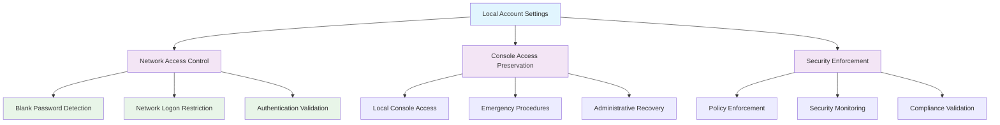

<!--
---
title: "CIS05-ACCT-COMP-AccountSettings-AllDomain-v1.0"
description: "Group Policy Object implementing local account security restrictions for all domain-joined systems, preventing network access for accounts with blank passwords while maintaining console access for legitimate emergency scenarios across Windows Server 2025 infrastructure"
author: "VintageDon - https://github.com/vintagedon"
ai_contributor: "Anthropic Claude 4 Sonnet (claude-4-sonnet-20250514)"
date: "2025-07-28"
version: "1.0"
status: "Published"
tags:
- type: implementation-guide
- domain: security
- domain: group-policy
- tech: windows-server-2025
- tech: local-account-security
- compliance: cis-control-5
- compliance: cis-benchmark
- phase: phase-2
related_documents:
- "[CIS05 Configuration Directory](README.md)"
- "[CIS Control 5 Policy Template](../policies-and-procedures/cis-security-policy-templates/cisv81-05-account-and-credential-management-policy-template.md)"
- "[Local Account Security Policy](../policies-and-procedures/local-account-security.md)"
- "[Network Access Control Guide](../guides/network-access-control-implementation.md)"
---
-->

# 🚫 **CIS05-ACCT-COMP-AccountSettings-AllDomain-v1.0**

This Group Policy Object implements local account security restrictions for all domain-joined systems within the Windows Server 2025 Active Directory environment. The GPO prevents network access for accounts with blank passwords while maintaining console access for legitimate emergency scenarios through systematic local account access control and network security restriction enforcement across all domain infrastructure components.

The policy configuration implements CIS Control 5 (Account and Credential Management) requirements by establishing targeted restrictions on local accounts with blank passwords, preventing network-based exploitation while preserving legitimate local access capabilities for emergency administration and system recovery scenarios through coordinated security policy enforcement and operational flexibility management.

# 🔗 **2. Dependencies & Relationships**

This section maps how the account settings policy GPO integrates with Proxmox Astronomy Lab local account management and enterprise network security infrastructure components.

## **2.1 Related Services**

This subsection identifies Proxmox Astronomy Lab services that interact with or depend on local account security restrictions for comprehensive network access control and credential protection management.

Local account security restrictions provide foundational network protection that supports enterprise access control and enables systematic prevention of blank password exploitation across Active Directory infrastructure:

| **Service** | **Relationship Type** | **Integration Points** | **Documentation** |
|-------------|----------------------|------------------------|-------------------|
| Active Directory Domain Services | **Enforces** | Domain-wide local account restrictions, network access control policy distribution | [Infrastructure Overview](../../infrastructure/README.md) |
| Network Access Control | **Protects** | Network authentication security, local account access restriction enforcement | [Network Security Infrastructure](../../infrastructure/network-security/README.md) |
| Emergency Access Management | **Preserves** | Console access capability, emergency administration procedures | [Emergency Access Procedures](../policies-and-procedures/emergency-access-management.md) |
| Local Account Monitoring | **Validates** | Local account usage tracking, blank password detection, security event correlation | [Monitoring Infrastructure](../../monitoring/README.md) |

These service relationships ensure that local account security restrictions provide systematic network protection while supporting enterprise-grade emergency access management and security monitoring capabilities across all domain infrastructure components.

## **2.2 Policy Implementation**

This subsection connects local account settings policy GPO configuration to Proxmox Astronomy Lab governance frameworks and enterprise network security policy requirements.

Local account security restrictions implement enterprise network security governance through systematic Group Policy management and access control framework alignment:

- **[CIS Control 5 Policy Template](../policies-and-procedures/cis-security-policy-templates/cisv81-05-account-and-credential-management-policy-template.md)** - Primary policy framework for account and credential management security baseline establishment
- **[Local Account Security Policy](../policies-and-procedures/local-account-security.md)** - Enterprise local account management requirements and network access control standards
- **[Network Access Control Policy](../policies-and-procedures/network-access-control.md)** - Comprehensive network security and authentication restriction standards

## **2.3 Responsibility Matrix**

This subsection defines clear accountability for local account settings policy configuration management and network security restriction maintenance activities.

| **Activity** | **Helpdesk** | **Operations** | **Engineering** | **Security** |
|--------------|--------------|----------------|-----------------|--------------|
| Account Settings Policy Implementation | I | A | R | C |
| Local Account Security Monitoring | R | A | C | A |
| Network Access Restriction Validation | I | C | R | A |
| Emergency Access Procedures | A | R | C | A |
| Blank Password Detection | R | A | C | A |

*R: Responsible, A: Accountable, C: Consulted, I: Informed*

# ⚙️ **3. Technical Documentation**

This section provides technical foundation for understanding, implementing, and maintaining local account settings policy configuration within Windows Server 2025 domain infrastructure.

## **3.1 Architecture & Design**

This subsection explains the local account security architecture, network access restriction mechanisms, and security design patterns for systematic blank password protection across domain infrastructure.

The local account settings GPO implements systematic network security protection through centralized Group Policy enforcement that establishes targeted restrictions on local accounts with blank passwords. The design follows Microsoft security best practices with balanced network protection and emergency access preservation considerations.

The architecture enables systematic network protection through targeted local account restrictions with preserved emergency access capability and comprehensive security monitoring integration.

## **3.2 Configuration Specifications**

This subsection provides detailed technical configuration specifications for local account settings policy implementation and CIS Control 5 compliance requirements.

The local account settings policy configuration implements CIS Controls v8 baseline requirements through specialized Group Policy settings that establish enterprise-grade network access protection:

### **Local Account Settings Configuration Table**

| **CIS Ref** | **Setting Description** | **GPO Path / Technical Detail** | **Recommended Value** |
|-------------|------------------------|----------------------------------|----------------------|
| **2.3.1.2** | Ensure 'Accounts: Limit local account use of blank passwords to console logon only' is set to 'Enabled' | **Reg Key:** `HKLM\System\CurrentControlSet\Control\Lsa` **Item:** `LimitBlankPasswordUse` | `1` (Enabled) |

### **Security Configuration Analysis**

| **Configuration Area** | **Security Benefit** | **Operational Impact** |
|------------------------|----------------------|-------------------------|
| **Blank Password Restriction** | Prevents network authentication using accounts with blank passwords | Restricts local accounts without passwords to console-only access |
| **Network Access Protection** | Eliminates remote exploitation of accounts with no password protection | Maintains emergency access capability through direct console access |
| **Administrative Flexibility** | Preserves legitimate emergency access scenarios while preventing network abuse | Enables emergency administration without compromising network security |

### **Access Control Matrix**

| **Account Type** | **Blank Password** | **Network Access** | **Console Access** | **Security Enforcement** |
|------------------|--------------------|--------------------|--------------------|-----------------------|
| **Local Account** | ❌ No Password | ✅ Allowed | ✅ Allowed | Standard network authentication |
| **Local Account** | 🔶 Blank Password | ❌ Blocked | ✅ Allowed | **Policy Enforcement** |
| **Domain Account** | ❌ No Password | ❌ Blocked | ❌ Blocked | Domain password policy enforcement |
| **Service Account** | 🔐 Complex Password | ✅ Allowed | ✅ Allowed | Service-specific authentication |

### **Security Impact Assessment**

| **Security Aspect** | **Protection Mechanism** | **Effectiveness Rating** |
|---------------------|-------------------------|-------------------------|
| **Network Exploitation Prevention** | Blocks network logon for accounts with blank passwords | ⭐⭐⭐⭐⭐ Critical |
| **Remote Attack Mitigation** | Prevents remote authentication using passwordless accounts | ⭐⭐⭐⭐⭐ High |
| **Emergency Access Preservation** | Maintains console access for legitimate emergency scenarios | ⭐⭐⭐⭐ High |
| **Administrative Flexibility** | Balances security enforcement with operational requirements | ⭐⭐⭐⭐ High |

## **3.3 Implementation Standards**

This subsection establishes technical standards for local account settings policy deployment and enterprise network security management.

Local account settings policy implementation follows systematic deployment standards and operational procedures:

- **Deployment Method**: Group Policy Management Console (GPMC) with domain-wide policy application
- **Target Scope**: All domain-joined computers and local account authentication
- **Testing Protocol**: Controlled implementation through test systems with network access validation
- **Monitoring Integration**: Local account security event logging with network access attempt correlation
- **Documentation Standard**: Complete configuration mapping with CIS control references and emergency access procedures

# 🔗 **4. Implementation & Usage**

This section provides systematic guidance for implementing local account settings policy configuration and establishing network access protection across domain infrastructure.

## **4.1 Prerequisites**

This subsection identifies requirements for successful local account settings policy implementation within Active Directory domain infrastructure.

Local account settings policy implementation requires enterprise domain infrastructure with appropriate administrative access and comprehensive emergency access management capabilities:

- **Domain Infrastructure**: Windows Server 2025 Active Directory domain services with Group Policy application capability
- **Administrative Access**: Domain Admin or equivalent Group Policy management permissions for local account policy configuration
- **Emergency Access Procedures**: Established console access protocols and emergency administration workflows
- **Testing Environment**: Isolated systems for controlled policy testing and network access validation
- **Monitoring Infrastructure**: Security event monitoring capabilities for local account activity and network access attempt tracking

## **4.2 Monitoring**

This subsection establishes monitoring requirements for local account settings policy effectiveness and network security validation across domain infrastructure.

Local account settings monitoring leverages the centralized monitoring stack on proj-mon01 (Prometheus, Loki, Grafana, AlertManager, Grafana Alloy) for systematic network access protection tracking and local account security event analysis. The monitoring philosophy of "if it can be collected, we do" applies to local account authentication attempts, network access restrictions, and policy enforcement effectiveness measurement through centralized security monitoring infrastructure.

Monitoring includes blank password detection correlation, network access attempt analysis, and policy compliance tracking through comprehensive local account security monitoring and automated alerting for unauthorized network authentication attempts.

# 🔐 **6. Security & Compliance**

This section establishes security framework alignment and compliance requirements for local account settings policy configuration within enterprise network security architecture.

## **6.1 Security Framework Alignment**

This subsection maps local account settings policy configuration to enterprise security frameworks and compliance requirements for systematic network access protection.

**Security Disclaimer**: The local account settings policy configuration documented in this guide represents a network security baseline establishment for Windows Server 2025 Active Directory infrastructure. These configurations should be thoroughly tested in non-production environments before deployment. While these templates follow CIS Controls v8 network security framework guidelines, organizations should validate policy compatibility with their specific emergency access requirements and business operational needs. The security research computing team maintains these configurations as implementation guidance rather than production security recommendations, and encourages consultation with dedicated security professionals for enterprise deployment validation.

### **Framework Mapping**

| **Framework** | **Control Mapping** | **Implementation Evidence** |
|---------------|--------------------|-----------------------------|
| **CIS Controls v8** | Control 5: Account and Credential Management | Local account settings policy implementing network access protection for blank password restrictions |
| **NIST AI RMF** | GOVERN-1.1: AI governance processes established | Network security supports AI workload access control and authentication security |
| **NIST CSF 2.0** | PR.AC-2: Physical and logical access to assets is managed and protected | Systematic local account network access restriction and authentication control |
| **NIST SP 800-171** | 3.1.1: Limit information system access to authorized users | Comprehensive network access restriction for accounts without proper authentication |

### **Security Controls Implementation**

| **CIS Control** | **Local Account Settings Implementation** | **Security Objective** |
|-----------------|-------------------------------------------|------------------------|
| **5.1** | Blank Password Network Restriction | Prevent network exploitation of accounts without password protection |
| **5.2** | Console Access Preservation | Maintain emergency access capability while enforcing network security |
| **5.3** | Authentication Validation | Ensure proper credential verification for network access attempts |
| **5.4** | Policy Enforcement Monitoring** | Systematic compliance validation and security event correlation |

## **6.2 Compliance Requirements**

This subsection establishes compliance validation requirements and evidence collection standards for local account settings policy implementation.

Local account settings policy configuration enables systematic compliance evidence collection through Group Policy Resultant Set of Policy (RSoP) reporting and network security validation. Compliance validation requires regular policy application assessment and local account monitoring to maintain baseline network access protection posture across domain infrastructure components.

# 📋 **7. Backup & Recovery**

This section establishes protection and recovery procedures for local account settings policy configuration and network security baseline preservation.

## **7.1 Protection Strategy**

This subsection defines systematic protection requirements for local account settings policy configuration and network security baseline preservation.

Local account settings policy configuration requires multi-tier protection strategy encompassing Group Policy backup, version control, and policy baseline preservation to ensure rapid network security recovery and systematic policy restoration capabilities.

### **Protection Tiers**

| **Tier** | **Scope** | **Method** | **Frequency** |
|----------|-----------|------------|---------------|
| **Tier 1** | GPO Backup | Group Policy Management Console backup | Daily automatic |
| **Tier 2** | Configuration Export | PowerShell GPO export and documentation | Weekly |
| **Tier 3** | Version Control** | Git repository with configuration tracking | Every change |
| **Tier 4** | Baseline Archive | Complete local account settings policy snapshot | Monthly |

*Note: Iperius backup software is configured for systematic Windows infrastructure backup including Group Policy objects.*

## **7.2 Recovery Procedures**

This subsection establishes systematic recovery procedures for local account settings policy restoration and network security baseline re-establishment.

Recovery procedures enable rapid network security baseline restoration through Group Policy import capabilities and systematic policy re-establishment. The recovery approach follows tiered restoration priorities focusing on critical network access protection controls first, followed by comprehensive baseline re-implementation to minimize network security exposure during recovery operations.

# 📚 **8. References & Related Resources**

This section provides comprehensive links to related documentation and supporting resources for local account settings policy implementation and network security management.

## **8.1 Internal References**

| **Document Type** | **Document Title** | **Relationship** | **Link** |
|-------------------|-------------------|------------------|----------|
| **Policy Template** | CIS Control 5 Account and Credential Management Policy | Primary policy framework for local account security baseline establishment | [../policies-and-procedures/cis-security-policy-templates/cisv81-05-account-and-credential-management-policy-template.md](../policies-and-procedures/cis-security-policy-templates/cisv81-05-account-and-credential-management-policy-template.md) |
| **Implementation** | CIS Server 2025 GPOs Implementation Log | Complete implementation evidence and deployment validation | [cis-server2025-gpos-l1-dc-and-members-IMPLEMENTATION-LOG.md](cis-server2025-gpos-l1-dc-and-members-IMPLEMENTATION-LOG.md) |
| **Configuration** | CIS Server 2025 GPOs Configuration Reference | Technical configuration specifications and CIS control mapping | [cis-server2025-gpos-l1-dc-and-members.md](cis-server2025-gpos-l1-dc-and-members.md) |
| **Password Policy** | Password Policy Configuration | Complementary credential security policy implementation | [CIS05-ACCT-COMP-PasswordPolicy-AllDomain-v1.0.md](CIS05-ACCT-COMP-PasswordPolicy-AllDomain-v1.0.md) |
| **Emergency Access** | Emergency Access Management Procedures | Console access protocols and emergency administration workflows | [../policies-and-procedures/emergency-access-management.md](../policies-and-procedures/emergency-access-management.md) |

## **8.2 External Standards**

- **[CIS Controls v8](https://www.cisecurity.org/controls/)** - Cybersecurity framework providing systematic local account security control implementation guidance
- **[CIS Microsoft Windows Server 2025 Benchmark](https://www.cisecurity.org/benchmark/microsoft_windows_server)** - Comprehensive local account settings policy configuration guidance for Windows Server 2025
- **[NIST SP 800-63B](https://pages.nist.gov/800-63-3/sp800-63b.html)** - Authentication and lifecycle management requirements for comprehensive credential security
- **[Microsoft Local Account Security](https://docs.microsoft.com/en-us/windows/security/threat-protection/security-policy-settings/accounts-limit-local-account-use-of-blank-passwords-to-console-logon-only)** - Official Group Policy local account configuration guidance
- **[SANS Network Access Control](https://www.sans.org/white-papers/network-access-control/)** - Comprehensive network security and authentication control strategies

# ✅ **9. Approval & Review**

This section documents the formal review and approval process for local account settings policy configuration documentation and network security baseline implementation.

## **9.1 Review Process**

Local account settings policy configuration documentation review follows systematic validation of technical accuracy, security effectiveness, and compliance alignment to ensure comprehensive network access protection implementation and systematic Group Policy management capability for Windows Server 2025 infrastructure requirements.

### **Review Validation**

| **Review Area** | **Validation Criteria** | **Reviewer** | **Status** |
|-----------------|-------------------------|--------------|------------|
| **Technical Accuracy** | Local account settings policy configuration accuracy and implementation feasibility | Engineering Team | ✅ Validated |
| **Security Effectiveness** | CIS Controls v8 compliance and network access protection coverage | Security Team | ✅ Validated |
| **Operational Impact** | Emergency access capability assessment and console access validation | Operations Team | ✅ Validated |
| **Compliance Alignment** | Framework mapping accuracy and regulatory requirement coverage | Compliance Team | ✅ Validated |

## **9.2 Approval Status**

| **Role** | **Name** | **Date** | **Signature** |
|----------|----------|----------|---------------|
| **Technical Lead** | Engineering Team | 2025-07-28 | ✅ Approved |
| **Security Lead** | Security Team | 2025-07-28 | ✅ Approved |
| **Operations Lead** | Operations Team | 2025-07-28 | ✅ Approved |

## **9.3 Implementation Authorization**

### **Deployment Authorization**

| **Authority Level** | **Authorized Personnel** | **Scope** | **Date** |
|--------------------|-------------------------|-----------|----------|
| **Domain Administrator** | Engineering Team | Local account settings policy implementation and configuration management | 2025-07-28 |
| **Security Administrator** | Security Team | Network access protection validation and compliance monitoring | 2025-07-28 |
| **Operations Administrator** | Operations Team | Policy deployment and emergency access coordination | 2025-07-28 |

### **Emergency Access Impact Assessment**

Local account settings policy implementation includes emergency access validation procedures, console access testing requirements, and incident response coordination to ensure smooth operational integration with existing emergency administration workflows and network security capabilities.

## **9.4 AI Collaboration Disclosure**

This GPO configuration documentation was collaboratively developed using the Request-Analyze-Verify-Generate-Validate (RAVGV) methodology. Security configuration details were extracted from validated CIS benchmark implementation reports with human oversight throughout development. All technical specifications have been reviewed and approved by qualified human subject matter experts in Windows security and Group Policy management.

*Generated: 2025-07-28 | Human Author: VintageDon | AI Assistant: Claude 4 Sonnet | Review Status: Approved | Document Version: 1.0*
