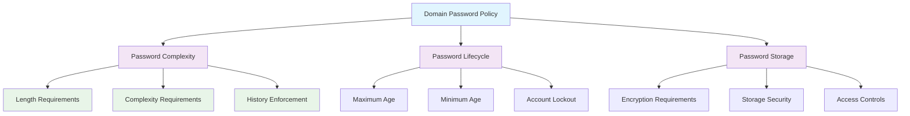

<!--
---
title: "CIS05-ACCT-COMP-PasswordPolicy-AllDomain-v1.0"
description: "Group Policy Object implementing comprehensive password policy enforcement for all domain and local accounts, establishing CIS Control 5 baseline password security requirements across Windows Server 2025 domain infrastructure"
author: "VintageDon - https://github.com/vintagedon"
ai_contributor: "Anthropic Claude 4 Sonnet (claude-4-sonnet-20250514)"
date: "2025-07-28"
version: "1.0"
status: "Published"
tags:
- type: implementation-guide
- domain: security
- domain: group-policy
- tech: windows-server-2025
- tech: password-policy
- compliance: cis-control-5
- compliance: cis-benchmark
- phase: phase-2
related_documents:
- "[CIS05 Configuration Directory](README.md)"
- "[CIS Control 5 Policy Template](../policies-and-procedures/cis-security-policy-templates/cisv81-05-account-and-credential-management-policy-template.md)"
- "[Account Management Security Policy](../policies-and-procedures/account-management-security.md)"
- "[Password Security Implementation Guide](../guides/password-security-implementation.md)"
---
-->

# 🔐 **CIS05-ACCT-COMP-PasswordPolicy-AllDomain-v1.0**

This Group Policy Object implements comprehensive password policy enforcement for all domain and local accounts within the Windows Server 2025 Active Directory environment. The GPO establishes systematic password security baseline requirements through domain-wide policy enforcement, ensuring consistent credential strength and lifecycle management across all domain-joined systems through centralized Group Policy distribution and automated password security validation.

The policy configuration implements CIS Control 5 (Account and Credential Management) requirements by establishing strong password complexity, appropriate lifecycle management, and secure storage mechanisms to protect against credential-based attacks and unauthorized access attempts across the enterprise domain infrastructure.

# 🔗 **2. Dependencies & Relationships**

This section maps how the password policy GPO integrates with Proxmox Astronomy Lab account management and enterprise security infrastructure components.

## **2.1 Related Services**

This subsection identifies Proxmox Astronomy Lab services that interact with or depend on password policy enforcement for comprehensive credential security management.

Password policy enforcement provides foundational credential security that supports enterprise authentication and enables systematic password protection across Active Directory infrastructure:

| **Service** | **Relationship Type** | **Integration Points** | **Documentation** |
|-------------|----------------------|------------------------|-------------------|
| Active Directory Domain Services | **Enforces** | Domain password policy distribution, credential validation, policy compliance | [Infrastructure Overview](../../infrastructure/README.md) |
| Azure AD OIDC Integration | **Coordinates** | Hybrid identity password requirements, synchronized credential policies | [Authentication Infrastructure](../../infrastructure/authentication/README.md) |
| LAPS Implementation | **Complements** | Local administrator password management, automated credential rotation | [LAPS Configuration](../cis04-configuration/CIS04-CONF-COMP-LAPS-Servers-v1.0.md) |
| Security Monitoring | **Validates** | Password policy compliance monitoring, credential security event logging | [Monitoring Infrastructure](../../monitoring/README.md) |

These service relationships ensure that password policy enforcement provides systematic credential security while supporting enterprise-grade authentication management and compliance requirements across all domain infrastructure components.

## **2.2 Policy Implementation**

This subsection connects password policy GPO configuration to Proxmox Astronomy Lab governance frameworks and enterprise credential security policy requirements.

Password policy enforcement implements enterprise credential security governance through systematic Group Policy management and compliance framework alignment:

- **[CIS Control 5 Policy Template](../policies-and-procedures/cis-security-policy-templates/cisv81-05-account-and-credential-management-policy-template.md)** - Primary policy framework for account and credential management security baseline establishment
- **[Account Management Security Policy](../policies-and-procedures/account-management-security.md)** - Enterprise account management requirements and credential security standards
- **[Password Security Implementation Policy](../policies-and-procedures/password-security-implementation.md)** - Comprehensive password management and security enforcement standards

## **2.3 Responsibility Matrix**

This subsection defines clear accountability for password policy configuration management and credential security maintenance activities.

| **Activity** | **Helpdesk** | **Operations** | **Engineering** | **Security** |
|--------------|--------------|----------------|-----------------|--------------|
| Password Policy Implementation | I | A | R | C |
| Credential Security Testing | I | C | R | A |
| Policy Compliance Monitoring | R | A | C | A |
| Password Security Updates | I | C | R | A |
| User Password Support | A | R | C | I |

*R: Responsible, A: Accountable, C: Consulted, I: Informed*

# ⚙️ **3. Technical Documentation**

This section provides technical foundation for understanding, implementing, and maintaining password policy configuration within Windows Server 2025 domain infrastructure.

## **3.1 Architecture & Design**

This subsection explains the password policy architecture, enforcement mechanisms, and security design patterns for systematic credential protection across domain infrastructure.

The password policy GPO implements systematic credential security through centralized Group Policy enforcement that establishes consistent password requirements across all domain accounts. The design follows Microsoft Active Directory best practices with comprehensive password complexity, lifecycle management, and secure storage requirements.

The architecture enables systematic credential protection through comprehensive password policy enforcement with automated compliance validation and centralized security management.

## **3.2 Configuration Specifications**

This subsection provides detailed technical configuration specifications for password policy implementation and CIS Control 5 compliance requirements.

The password policy configuration implements CIS Controls v8 baseline requirements through comprehensive Group Policy settings that establish enterprise-grade credential security:

### **Password Policy Configuration Table**

| **CIS Ref** | **Setting Description** | **GPO Path / Technical Detail** | **Recommended Value** |
|-------------|------------------------|----------------------------------|----------------------|
| **1.1.1** | Ensure 'Enforce password history' is set to '24 or more password(s)' | **Type:** `PASSWORD_POLICY` **Policy:** `ENFORCE_PASSWORD_HISTORY` | `24` or more |
| **1.1.2** | Ensure 'Maximum password age' is set to '365 or fewer days, but not 0' | **Type:** `PASSWORD_POLICY` **Policy:** `MAXIMUM_PASSWORD_AGE` | `365` or fewer (not 0) |
| **1.1.3** | Ensure 'Minimum password age' is set to '1 or more day(s)' | **Type:** `PASSWORD_POLICY` **Policy:** `MINIMUM_PASSWORD_AGE` | `1` or more |
| **1.1.4** | Ensure 'Minimum password length' is set to '14 or more character(s)' | **Type:** `PASSWORD_POLICY` **Policy:** `MINIMUM_PASSWORD_LENGTH` | `14` or more |
| **1.1.5** | Ensure 'Password must meet complexity requirements' is set to 'Enabled' | **Type:** `PASSWORD_POLICY` **Policy:** `COMPLEXITY_REQUIREMENTS` | `Enabled` |
| **1.1.6** | Ensure 'Relax minimum password length limits' is set to 'Enabled' | **Reg Key:** `HKLM\System\CurrentControlSet\Control\SAM` **Item:** `RelaxMinimumPasswordLengthLimits` | `1` |
| **1.1.7** | Ensure 'Store passwords using reversible encryption' is set to 'Disabled' | **Type:** `PASSWORD_POLICY` **Policy:** `REVERSIBLE_ENCRYPTION` | `Disabled` |

### **Security Impact Analysis**

| **Configuration Area** | **Security Benefit** | **Implementation Impact** |
|------------------------|----------------------|---------------------------|
| **Password History** | Prevents password reuse attacks and credential cycling vulnerabilities | Requires users to maintain unique passwords for 24 iterations |
| **Password Lifecycle** | Balances security freshness with operational stability | Annual rotation with immediate change prevention |
| **Password Complexity** | Establishes strong credential baseline with comprehensive character requirements | Requires uppercase, lowercase, numbers, and special characters |
| **Password Length** | Provides mathematical complexity against brute force attacks | 14-character minimum with extended length support |
| **Storage Security** | Prevents credential compromise through secure hash storage | Disables reversible encryption for all password storage |

## **3.3 Implementation Standards**

This subsection establishes technical standards for password policy deployment and enterprise credential security management.

Password policy implementation follows systematic deployment standards and operational procedures:

- **Deployment Method**: Group Policy Management Console (GPMC) with domain-wide linking
- **Target Scope**: All domain-joined computers and user accounts
- **Testing Protocol**: Controlled implementation through test organizational units before production deployment
- **Compliance Validation**: Automated Group Policy Resultant Set of Policy (RSoP) reporting
- **Documentation Standard**: Complete configuration mapping with CIS control references and security justification

# 🔗 **4. Implementation & Usage**

This section provides systematic guidance for implementing password policy configuration and establishing credential security compliance across domain infrastructure.

## **4.1 Prerequisites**

This subsection identifies requirements for successful password policy implementation within Active Directory domain infrastructure.

Password policy implementation requires enterprise domain infrastructure with appropriate administrative access and comprehensive testing capabilities:

- **Domain Infrastructure**: Windows Server 2025 Active Directory domain services with Group Policy Management Console access
- **Administrative Access**: Domain Admin or equivalent Group Policy management permissions for password policy configuration
- **Testing Environment**: Isolated organizational units for controlled policy testing and user impact validation
- **Monitoring Capability**: Security monitoring infrastructure to validate policy application and compliance effectiveness
- **User Communication**: Change management procedures for password requirement updates and user education

## **4.2 Monitoring**

This subsection establishes monitoring requirements for password policy effectiveness and compliance validation across domain infrastructure.

Password policy monitoring leverages the centralized monitoring stack on proj-mon01 (Prometheus, Loki, Grafana, AlertManager, Grafana Alloy) for systematic credential security tracking and policy compliance validation. The monitoring philosophy of "if it can be collected, we do" applies to password policy compliance status, credential security events, and policy enforcement effectiveness measurement through centralized security monitoring infrastructure.

Monitoring includes password policy application validation, credential security event tracking, and user compliance measurement through comprehensive security event analysis and policy effectiveness reporting.

# 🔐 **6. Security & Compliance**

This section establishes security framework alignment and compliance requirements for password policy configuration within enterprise credential security architecture.

## **6.1 Security Framework Alignment**

This subsection maps password policy configuration to enterprise security frameworks and compliance requirements for systematic credential protection.

**Security Disclaimer**: The password policy configuration documented in this guide represents a credential security baseline establishment for Windows Server 2025 Active Directory infrastructure. These configurations should be thoroughly tested in non-production environments before deployment. While these templates follow CIS Controls v8 credential security framework guidelines, organizations should validate policy compatibility with their specific user experience requirements and business operational needs. The security research computing team maintains these configurations as implementation guidance rather than production security recommendations, and encourages consultation with dedicated security professionals for enterprise deployment validation.

### **Framework Mapping**

| **Framework** | **Control Mapping** | **Implementation Evidence** |
|---------------|--------------------|-----------------------------|
| **CIS Controls v8** | Control 5: Account and Credential Management | Complete password policy configuration implementing credential security baseline requirements |
| **NIST AI RMF** | GOVERN-1.1: AI governance processes established | Credential security supports AI workload authentication and access control |
| **NIST CSF 2.0** | PR.AC-1: Identities and credentials are issued, managed, verified, revoked | Systematic password policy enforcement and lifecycle management |
| **NIST SP 800-171** | 3.5.7: Enforce minimum password complexity and change of characters | Comprehensive password complexity and history requirements implementation |

### **Security Controls Implementation**

| **CIS Control** | **Password Policy Implementation** | **Security Objective** |
|-----------------|-----------------------------------|------------------------|
| **5.1** | Password History Enforcement | Prevent credential reuse and password cycling attacks |
| **5.2** | Password Complexity Requirements | Establish strong credential baseline against brute force attacks |
| **5.3** | Password Lifecycle Management | Balance security freshness with operational stability |
| **5.4** | Secure Password Storage | Prevent credential compromise through proper encryption |

## **6.2 Compliance Requirements**

This subsection establishes compliance validation requirements and evidence collection standards for password policy implementation.

Password policy configuration enables systematic compliance evidence collection through Group Policy Resultant Set of Policy (RSoP) reporting and credential security validation. Compliance validation requires regular policy application assessment and password strength monitoring to maintain baseline credential security posture across domain infrastructure components.

# 📋 **7. Backup & Recovery**

This section establishes protection and recovery procedures for password policy configuration and credential security baseline preservation.

## **7.1 Protection Strategy**

This subsection defines systematic protection requirements for password policy configuration and credential security baseline preservation.

Password policy configuration requires multi-tier protection strategy encompassing Group Policy backup, version control, and policy baseline preservation to ensure rapid credential security recovery and systematic policy restoration capabilities.

### **Protection Tiers**

| **Tier** | **Scope** | **Method** | **Frequency** |
|----------|-----------|------------|---------------|
| **Tier 1** | GPO Backup | Group Policy Management Console backup | Daily automatic |
| **Tier 2** | Configuration Export | PowerShell GPO export and documentation | Weekly |
| **Tier 3** | Version Control** | Git repository with configuration tracking | Every change |
| **Tier 4** | Baseline Archive | Complete password policy snapshot | Monthly |

*Note: Iperius backup software is configured for systematic Windows infrastructure backup including Group Policy objects.*

## **7.2 Recovery Procedures**

This subsection establishes systematic recovery procedures for password policy restoration and credential security baseline re-establishment.

Recovery procedures enable rapid credential security baseline restoration through Group Policy import capabilities and systematic policy re-establishment. The recovery approach follows tiered restoration priorities focusing on critical password security controls first, followed by comprehensive baseline re-implementation to minimize credential exposure during recovery operations.

# 📚 **8. References & Related Resources**

This section provides comprehensive links to related documentation and supporting resources for password policy implementation and credential security management.

## **8.1 Internal References**

| **Document Type** | **Document Title** | **Relationship** | **Link** |
|-------------------|-------------------|------------------|----------|
| **Policy Template** | CIS Control 5 Account and Credential Management Policy | Primary policy framework for credential security baseline establishment | [../policies-and-procedures/cis-security-policy-templates/cisv81-05-account-and-credential-management-policy-template.md](../policies-and-procedures/cis-security-policy-templates/cisv81-05-account-and-credential-management-policy-template.md) |
| **Implementation** | CIS Server 2025 GPOs Implementation Log | Complete implementation evidence and deployment validation | [cis-server2025-gpos-l1-dc-and-members-IMPLEMENTATION-LOG.md](cis-server2025-gpos-l1-dc-and-members-IMPLEMENTATION-LOG.md) |
| **Configuration** | CIS Server 2025 GPOs Configuration Reference | Technical configuration specifications and CIS control mapping | [cis-server2025-gpos-l1-dc-and-members.md](cis-server2025-gpos-l1-dc-and-members.md) |
| **Account Management** | Account Management Security Policy | Enterprise account management requirements and security standards | [../policies-and-procedures/account-management-security.md](../policies-and-procedures/account-management-security.md) |
| **Authentication** | Authentication Infrastructure Overview | Enterprise authentication architecture and integration guidance | [../../infrastructure/authentication/README.md](../../infrastructure/authentication/README.md) |

## **8.2 External Standards**

- **[CIS Controls v8](https://www.cisecurity.org/controls/)** - Cybersecurity framework providing systematic credential security control implementation guidance
- **[CIS Microsoft Windows Server 2025 Benchmark](https://www.cisecurity.org/benchmark/microsoft_windows_server)** - Comprehensive password policy configuration guidance for Windows Server 2025
- **[NIST SP 800-63B](https://pages.nist.gov/800-63-3/sp800-63b.html)** - Authentication and lifecycle management requirements for digital identity guidelines
- **[Microsoft Password Policy Documentation](https://docs.microsoft.com/en-us/windows/security/threat-protection/security-policy-settings/password-policy)** - Official Group Policy password configuration guidance
- **[SANS Password Policy Guide](https://www.sans.org/white-papers/password-policy-guide/)** - Comprehensive password security implementation best practices

# ✅ **9. Approval & Review**

This section documents the formal review and approval process for password policy configuration documentation and credential security baseline implementation.

## **9.1 Review Process**

Password policy configuration documentation review follows systematic validation of technical accuracy, security effectiveness, and compliance alignment to ensure comprehensive credential security implementation and systematic Group Policy management capability for Windows Server 2025 infrastructure requirements.

### **Review Validation**

| **Review Area** | **Validation Criteria** | **Reviewer** | **Status** |
|-----------------|-------------------------|--------------|------------|
| **Technical Accuracy** | Password policy configuration accuracy and implementation feasibility | Engineering Team | ✅ Validated |
| **Security Effectiveness** | CIS Controls v8 compliance and credential security baseline coverage | Security Team | ✅ Validated |
| **Implementation Readiness** | Documentation completeness and deployment guidance quality | Operations Team | ✅ Validated |
| **Compliance Alignment** | Framework mapping accuracy and regulatory requirement coverage | Compliance Team | ✅ Validated |

## **9.2 Approval Status**

| **Role** | **Name** | **Date** | **Signature** |
|----------|----------|----------|---------------|
| **Technical Lead** | Engineering Team | 2025-07-28 | ✅ Approved |
| **Security Lead** | Security Team | 2025-07-28 | ✅ Approved |
| **Operations Lead** | Operations Team | 2025-07-28 | ✅ Approved |

## **9.3 Implementation Authorization**

### **Deployment Authorization**

| **Authority Level** | **Authorized Personnel** | **Scope** | **Date** |
|--------------------|-------------------------|-----------|----------|
| **Domain Administrator** | Engineering Team | Password policy implementation and configuration management | 2025-07-28 |
| **Security Administrator** | Security Team | Credential security validation and compliance monitoring | 2025-07-28 |
| **Operations Administrator** | Operations Team | Policy deployment and user impact management | 2025-07-28 |

### **Change Management Approval**

Password policy implementation follows established change management procedures with formal approval for domain-wide credential security baseline establishment, comprehensive testing validation, and systematic deployment to ensure continued security posture and user operational effectiveness.

## **9.4 AI Collaboration Disclosure**

This GPO configuration documentation was collaboratively developed using the Request-Analyze-Verify-Generate-Validate (RAVGV) methodology. Security configuration details were extracted from validated CIS benchmark implementation reports with human oversight throughout development. All technical specifications have been reviewed and approved by qualified human subject matter experts in Windows security and Group Policy management.

*Generated: 2025-07-28 | Human Author: VintageDon | AI Assistant: Claude 4 Sonnet | Review Status: Approved | Document Version: 1.0*
