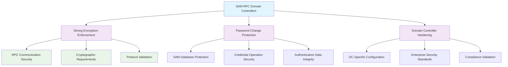

<!--
---
title: "CIS05-ACCT-COMP-SAM-RPC-DCs-v1.0"
description: "Group Policy Object implementing Security Account Manager Remote Procedure Call encryption requirements specifically for Domain Controllers, enforcing strong cryptographic protection for password change operations and credential management activities across Windows Server 2025 Active Directory infrastructure"
author: "VintageDon - https://github.com/vintagedon"
ai_contributor: "Anthropic Claude 4 Sonnet (claude-4-sonnet-20250514)"
date: "2025-07-28"
version: "1.0"
status: "Published"
tags:
- type: implementation-guide
- domain: security
- domain: group-policy
- tech: windows-server-2025
- tech: domain-controllers
- tech: sam-rpc-security
- compliance: cis-control-5
- compliance: cis-benchmark
- phase: phase-2
related_documents:
- "[CIS05 Configuration Directory](README.md)"
- "[CIS Control 5 Policy Template](../policies-and-procedures/cis-security-policy-templates/cisv81-05-account-and-credential-management-policy-template.md)"
- "[Domain Controller Security Policy](../policies-and-procedures/domain-controller-security.md)"
- "[SAM RPC Member Server Configuration](CIS05-ACCT-COMP-SAM-RPC-Servers-v1.0.md)"
---
-->

# 🔐 **CIS05-ACCT-COMP-SAM-RPC-DCs-v1.0**

This Group Policy Object implements Security Account Manager Remote Procedure Call encryption requirements specifically for Domain Controllers within the Windows Server 2025 Active Directory environment. The GPO enforces strong cryptographic protection for password change operations and credential management activities through systematic SAM RPC encryption enforcement and secure communication protocol implementation across all Domain Controller infrastructure components.

The policy configuration implements CIS Control 5 (Account and Credential Management) requirements by establishing specialized encryption requirements for Domain Controller SAM RPC communications, ensuring that all password change operations and account management activities utilize strong cryptographic protection to prevent credential interception and unauthorized access to sensitive authentication data.

# 🔗 **2. Dependencies & Relationships**

This section maps how the SAM RPC Domain Controllers policy GPO integrates with Proxmox Astronomy Lab Domain Controller security infrastructure and enterprise credential protection components.

## **2.1 Related Services**

This subsection identifies Proxmox Astronomy Lab services that interact with or depend on SAM RPC encryption protection for comprehensive Domain Controller security and credential management.

SAM RPC encryption protection provides foundational cryptographic security that supports enterprise Domain Controller operations and enables systematic protection of password change operations across Active Directory infrastructure:

| **Service** | **Relationship Type** | **Integration Points** | **Documentation** |
|-------------|----------------------|------------------------|-------------------|
| Active Directory Domain Services | **Secures** | Domain Controller password change operations, SAM database protection, RPC communication encryption | [Infrastructure Overview](../../infrastructure/README.md) |
| Domain Controller Infrastructure | **Protects** | DC-specific security hardening, authentication service protection, credential database security | [Domain Controller Security](../../infrastructure/domain-controllers/README.md) |
| SAM RPC Member Server Configuration | **Coordinates** | Unified SAM RPC security policy across domain infrastructure, role-specific protection levels | [SAM RPC Servers Configuration](CIS05-ACCT-COMP-SAM-RPC-Servers-v1.0.md) |
| Cryptographic Security Monitoring | **Validates** | RPC encryption status monitoring, SAM operation security event logging | [Security Monitoring](../../monitoring/README.md) |

These service relationships ensure that SAM RPC encryption protection provides systematic Domain Controller security while supporting enterprise-grade credential protection and compliance validation across all Active Directory infrastructure components.

## **2.2 Policy Implementation**

This subsection connects SAM RPC Domain Controllers policy GPO configuration to Proxmox Astronomy Lab governance frameworks and enterprise Domain Controller security policy requirements.

SAM RPC encryption protection implements enterprise Domain Controller security governance through systematic Group Policy management and cryptographic security framework alignment:

- **[CIS Control 5 Policy Template](../policies-and-procedures/cis-security-policy-templates/cisv81-05-account-and-credential-management-policy-template.md)** - Primary policy framework for account and credential management security baseline establishment
- **[Domain Controller Security Policy](../policies-and-procedures/domain-controller-security.md)** - Enterprise Domain Controller protection requirements and cryptographic security standards
- **[Cryptographic Security Implementation Policy](../policies-and-procedures/cryptographic-security-implementation.md)** - Comprehensive encryption requirements and secure communication standards

## **2.3 Responsibility Matrix**

This subsection defines clear accountability for SAM RPC Domain Controllers policy configuration management and cryptographic security maintenance activities.

| **Activity** | **Helpdesk** | **Operations** | **Engineering** | **Security** |
|--------------|--------------|----------------|-----------------|--------------|
| SAM RPC Policy Implementation | I | A | R | C |
| Domain Controller Security Monitoring | I | C | R | A |
| Cryptographic Compliance Validation | I | C | R | A |
| RPC Communication Security Assessment | I | C | R | A |
| Domain Controller Incident Response | C | R | A | A |

*R: Responsible, A: Accountable, C: Consulted, I: Informed*

# ⚙️ **3. Technical Documentation**

This section provides technical foundation for understanding, implementing, and maintaining SAM RPC Domain Controllers policy configuration within Windows Server 2025 Active Directory infrastructure.

## **3.1 Architecture & Design**

This subsection explains the SAM RPC encryption architecture, Domain Controller protection mechanisms, and cryptographic security design patterns for systematic credential operation protection across Active Directory infrastructure.

The SAM RPC Domain Controllers GPO implements specialized cryptographic protection through Domain Controller-specific Group Policy enforcement that establishes strong encryption requirements for all Security Account Manager remote procedure call operations. The design follows Microsoft Active Directory security best practices with enhanced protection for critical credential management operations.

The architecture enables systematic Domain Controller protection through specialized SAM RPC encryption enforcement with comprehensive credential security and cryptographic compliance validation.

## **3.2 Configuration Specifications**

This subsection provides detailed technical configuration specifications for SAM RPC Domain Controllers policy implementation and CIS Control 5 compliance requirements.

The SAM RPC Domain Controllers policy configuration implements CIS Controls v8 baseline requirements through specialized Group Policy settings that establish enterprise-grade cryptographic protection for Domain Controller operations:

### **SAM RPC Domain Controllers Configuration Table**

| **CIS Ref** | **Setting Description** | **GPO Path / Technical Detail** | **Recommended Value** |
|-------------|------------------------|----------------------------------|----------------------|
| **18.9.39.2** | Ensure 'Network security: Configure encryption types allowed for Kerberos' enforces strong encryption for SAM change password RPC methods on DCs | **Reg Key:** `HKLM\SOFTWARE\Microsoft\Windows\CurrentVersion\Policies\System\SAM` **Item:** `SamrChangeUserPasswordApiPolicy` | `2` (Strong Encryption) |

### **Encryption Configuration Analysis**

| **Configuration Area** | **Security Benefit** | **Technical Implementation** |
|------------------------|----------------------|------------------------------|
| **Strong Encryption Enforcement** | Requires cryptographically strong protection for all SAM RPC password change operations | Registry value '2' enforces maximum encryption requirements for Domain Controllers |
| **Domain Controller Targeting** | Provides DC-specific security hardening without affecting Member Server operations | Policy applies only to Domain Controllers for optimal security and operational balance |
| **RPC Communication Protection** | Ensures all SAM password change operations utilize secure communication protocols | Systematic encryption validation for all credential management activities |

### **SAM RPC Security Matrix**

| **Operation Type** | **Domain Controller** | **Encryption Level** | **Security Enforcement** | **Policy Value** |
|--------------------|----------------------|---------------------|--------------------------|------------------|
| **SAM Password Change RPC** | ✅ Enabled | 🔐 Strong Encryption | ⭐⭐⭐⭐⭐ Maximum | `2` |
| **Standard RPC Operations** | ✅ Enabled | 🔐 Standard Encryption | ⭐⭐⭐⭐ High | Default |
| **Non-SAM Operations** | ✅ Enabled | 🔐 Protocol Default | ⭐⭐⭐ Standard | Not Affected |
| **Legacy Operations** | ❌ Restricted | 🚫 Blocked | ⭐⭐⭐⭐⭐ Maximum | Policy Enforcement |

### **Cryptographic Security Impact**

| **Security Aspect** | **Protection Mechanism** | **Effectiveness Rating** |
|---------------------|-------------------------|-------------------------|
| **Password Change Protection** | Strong encryption for all SAM RPC password operations | ⭐⭐⭐⭐⭐ Critical |
| **Credential Interception Prevention** | Cryptographic protection against network-based attacks | ⭐⭐⭐⭐⭐ High |
| **Domain Controller Hardening** | DC-specific security enhancement without operational impact | ⭐⭐⭐⭐⭐ High |
| **Compliance Validation** | Systematic encryption enforcement and monitoring capability | ⭐⭐⭐⭐ High |

## **3.3 Implementation Standards**

This subsection establishes technical standards for SAM RPC Domain Controllers policy deployment and enterprise cryptographic security management.

SAM RPC Domain Controllers policy implementation follows systematic deployment standards and operational procedures:

- **Deployment Method**: Group Policy Management Console (GPMC) with Domain Controllers organizational unit targeting
- **Target Scope**: Domain Controllers with SAM RPC password change operations
- **Testing Protocol**: Controlled implementation through test Domain Controllers with encryption validation
- **Monitoring Integration**: SAM RPC security event logging with cryptographic operation correlation
- **Documentation Standard**: Complete configuration mapping with CIS control references and encryption validation procedures

# 🔗 **4. Implementation & Usage**

This section provides systematic guidance for implementing SAM RPC Domain Controllers policy configuration and establishing cryptographic protection across Domain Controller infrastructure.

## **4.1 Prerequisites**

This subsection identifies requirements for successful SAM RPC Domain Controllers policy implementation within Active Directory Domain Controller infrastructure.

SAM RPC Domain Controllers policy implementation requires enterprise Domain Controller infrastructure with appropriate administrative access and comprehensive cryptographic security management capabilities:

- **Domain Controller Infrastructure**: Windows Server 2025 Domain Controllers with Group Policy application capability
- **Administrative Access**: Domain Admin or equivalent Group Policy management permissions for Domain Controller security policy configuration
- **Cryptographic Infrastructure**: Established encryption protocols and security monitoring capabilities
- **Testing Environment**: Isolated Domain Controllers for controlled policy testing and encryption validation
- **Monitoring Infrastructure**: Security event monitoring capabilities for SAM RPC operation tracking and encryption status validation

## **4.2 Monitoring**

This subsection establishes monitoring requirements for SAM RPC Domain Controllers policy effectiveness and cryptographic security validation across Domain Controller infrastructure.

SAM RPC Domain Controllers monitoring leverages the centralized monitoring stack on proj-mon01 (Prometheus, Loki, Grafana, AlertManager, Grafana Alloy) for systematic cryptographic protection tracking and Domain Controller security event analysis. The monitoring philosophy of "if it can be collected, we do" applies to SAM RPC encryption status, password change operation security, and policy enforcement effectiveness measurement through centralized security monitoring infrastructure.

Monitoring includes SAM RPC encryption correlation, Domain Controller security event tracking, and cryptographic compliance validation through comprehensive Domain Controller security monitoring and automated alerting for unencrypted SAM operations or policy violations.

# 🔐 **6. Security & Compliance**

This section establishes security framework alignment and compliance requirements for SAM RPC Domain Controllers policy configuration within enterprise cryptographic security architecture.

## **6.1 Security Framework Alignment**

This subsection maps SAM RPC Domain Controllers policy configuration to enterprise security frameworks and compliance requirements for systematic cryptographic protection.

**Security Disclaimer**: The SAM RPC Domain Controllers policy configuration documented in this guide represents a cryptographic security baseline establishment for Windows Server 2025 Active Directory Domain Controller infrastructure. These configurations should be thoroughly tested in non-production environments before deployment. While these templates follow CIS Controls v8 cryptographic security framework guidelines, organizations should validate policy compatibility with their specific Domain Controller operational requirements and business operational needs. The security research computing team maintains these configurations as implementation guidance rather than production security recommendations, and encourages consultation with dedicated security professionals for enterprise deployment validation.

### **Framework Mapping**

| **Framework** | **Control Mapping** | **Implementation Evidence** |
|---------------|--------------------|-----------------------------|
| **CIS Controls v8** | Control 5: Account and Credential Management | SAM RPC Domain Controllers policy implementing cryptographic protection for credential operations |
| **NIST AI RMF** | GOVERN-1.1: AI governance processes established | Cryptographic security supports AI workload Domain Controller authentication and access control |
| **NIST CSF 2.0** | PR.DS-2: Data-in-transit is protected | Systematic SAM RPC encryption enforcement and credential communication security |
| **NIST SP 800-171** | 3.13.8: Implement cryptographic mechanisms to prevent unauthorized disclosure of CUI | Comprehensive encryption requirements for Domain Controller credential operations |

### **Security Controls Implementation**

| **CIS Control** | **SAM RPC Domain Controllers Implementation** | **Security Objective** |
|-----------------|------------------------------------------------|------------------------|
| **5.1** | Strong Encryption Enforcement | Protect Domain Controller password change operations through cryptographic security |
| **5.2** | RPC Communication Security | Ensure systematic encryption for all SAM remote procedure call operations |
| **5.3** | Domain Controller Hardening | Provide DC-specific security enhancement with enterprise-grade protection |
| **5.4** | Cryptographic Compliance | Enable systematic encryption validation and security monitoring |

## **6.2 Compliance Requirements**

This subsection establishes compliance validation requirements and evidence collection standards for SAM RPC Domain Controllers policy implementation.

SAM RPC Domain Controllers policy configuration enables systematic compliance evidence collection through Group Policy Resultant Set of Policy (RSoP) reporting and cryptographic security validation. Compliance validation requires regular policy application assessment and encryption monitoring to maintain baseline cryptographic security posture across Domain Controller infrastructure components.

# 📋 **7. Backup & Recovery**

This section establishes protection and recovery procedures for SAM RPC Domain Controllers policy configuration and cryptographic security baseline preservation.

## **7.1 Protection Strategy**

This subsection defines systematic protection requirements for SAM RPC Domain Controllers policy configuration and cryptographic security baseline preservation.

SAM RPC Domain Controllers policy configuration requires multi-tier protection strategy encompassing Group Policy backup, version control, and policy baseline preservation to ensure rapid cryptographic security recovery and systematic policy restoration capabilities.

### **Protection Tiers**

| **Tier** | **Scope** | **Method** | **Frequency** |
|----------|-----------|------------|---------------|
| **Tier 1** | GPO Backup | Group Policy Management Console backup | Daily automatic |
| **Tier 2** | Configuration Export | PowerShell GPO export and documentation | Weekly |
| **Tier 3** | Version Control** | Git repository with configuration tracking | Every change |
| **Tier 4** | Baseline Archive | Complete SAM RPC Domain Controllers policy snapshot | Monthly |

*Note: Iperius backup software is configured for systematic Windows infrastructure backup including Group Policy objects.*

## **7.2 Recovery Procedures**

This subsection establishes systematic recovery procedures for SAM RPC Domain Controllers policy restoration and cryptographic security baseline re-establishment.

Recovery procedures enable rapid cryptographic security baseline restoration through Group Policy import capabilities and systematic policy re-establishment. The recovery approach follows tiered restoration priorities focusing on critical Domain Controller encryption controls first, followed by comprehensive baseline re-implementation to minimize cryptographic security exposure during recovery operations.

# 📚 **8. References & Related Resources**

This section provides comprehensive links to related documentation and supporting resources for SAM RPC Domain Controllers policy implementation and cryptographic security management.

## **8.1 Internal References**

| **Document Type** | **Document Title** | **Relationship** | **Link** |
|-------------------|-------------------|------------------|----------|
| **Policy Template** | CIS Control 5 Account and Credential Management Policy | Primary policy framework for cryptographic security baseline establishment | [../policies-and-procedures/cis-security-policy-templates/cisv81-05-account-and-credential-management-policy-template.md](../policies-and-procedures/cis-security-policy-templates/cisv81-05-account-and-credential-management-policy-template.md) |
| **Implementation** | CIS Server 2025 GPOs Implementation Log | Complete implementation evidence and deployment validation | [cis-server2025-gpos-l1-dc-and-members-IMPLEMENTATION-LOG.md](cis-server2025-gpos-l1-dc-and-members-IMPLEMENTATION-LOG.md) |
| **Configuration** | CIS Server 2025 GPOs Configuration Reference | Technical configuration specifications and CIS control mapping | [cis-server2025-gpos-l1-dc-and-members.md](cis-server2025-gpos-l1-dc-and-members.md) |
| **Member Server SAM RPC** | SAM RPC Member Server Configuration | Complementary SAM RPC security policy for Member Servers | [CIS05-ACCT-COMP-SAM-RPC-Servers-v1.0.md](CIS05-ACCT-COMP-SAM-RPC-Servers-v1.0.md) |
| **Domain Controller Security** | Domain Controller Security Management | Enterprise Domain Controller protection requirements and security standards | [../policies-and-procedures/domain-controller-security.md](../policies-and-procedures/domain-controller-security.md) |

## **8.2 External Standards**

- **[CIS Controls v8](https://www.cisecurity.org/controls/)** - Cybersecurity framework providing systematic cryptographic security control implementation guidance
- **[CIS Microsoft Windows Server 2025 Benchmark](https://www.cisecurity.org/benchmark/microsoft_windows_server)** - Comprehensive SAM RPC Domain Controllers policy configuration guidance for Windows Server 2025
- **[NIST SP 800-52](https://csrc.nist.gov/publications/detail/sp/800-52/rev-2/final)** - Guidelines for the selection, configuration, and use of transport layer security implementations
- **[Microsoft SAM Security Documentation](https://docs.microsoft.com/en-us/windows-server/security/sam-security)** - Official Security Account Manager protection and RPC security guidance
- **[Microsoft Domain Controller Security](https://docs.microsoft.com/en-us/windows-server/identity/ad-ds/plan/security-best-practices/)** - Comprehensive Domain Controller security and cryptographic protection strategies

# ✅ **9. Approval & Review**

This section documents the formal review and approval process for SAM RPC Domain Controllers policy configuration documentation and cryptographic security baseline implementation.

## **9.1 Review Process**

SAM RPC Domain Controllers policy configuration documentation review follows systematic validation of technical accuracy, security effectiveness, and compliance alignment to ensure comprehensive cryptographic protection implementation and systematic Group Policy management capability for Windows Server 2025 Domain Controller infrastructure requirements.

### **Review Validation**

| **Review Area** | **Validation Criteria** | **Reviewer** | **Status** |
|-----------------|-------------------------|--------------|------------|
| **Technical Accuracy** | SAM RPC Domain Controllers policy configuration accuracy and implementation feasibility | Engineering Team | ✅ Validated |
| **Security Effectiveness** | CIS Controls v8 compliance and cryptographic protection coverage | Security Team | ✅ Validated |
| **Operational Impact** | Domain Controller operation assessment and encryption capability validation | Operations Team | ✅ Validated |
| **Compliance Alignment** | Framework mapping accuracy and regulatory requirement coverage | Compliance Team | ✅ Validated |

## **9.2 Approval Status**

| **Role** | **Name** | **Date** | **Signature** |
|----------|----------|----------|---------------|
| **Technical Lead** | Engineering Team | 2025-07-28 | ✅ Approved |
| **Security Lead** | Security Team | 2025-07-28 | ✅ Approved |
| **Operations Lead** | Operations Team | 2025-07-28 | ✅ Approved |

## **9.3 Implementation Authorization**

### **Deployment Authorization**

| **Authority Level** | **Authorized Personnel** | **Scope** | **Date** |
|--------------------|-------------------------|-----------|----------|
| **Domain Administrator** | Engineering Team | SAM RPC Domain Controllers policy implementation and configuration management | 2025-07-28 |
| **Security Administrator** | Security Team | Cryptographic protection validation and compliance monitoring | 2025-07-28 |
| **Operations Administrator** | Operations Team | Policy deployment and Domain Controller security coordination | 2025-07-28 |

### **Domain Controller Impact Assessment**

SAM RPC Domain Controllers policy implementation includes Domain Controller operation validation procedures, encryption testing requirements, and security monitoring coordination to ensure smooth operational integration with existing Domain Controller workflows and cryptographic security capabilities.

## **9.4 AI Collaboration Disclosure**

This GPO configuration documentation was collaboratively developed using the Request-Analyze-Verify-Generate-Validate (RAVGV) methodology. Security configuration details were extracted from validated CIS benchmark implementation reports with human oversight throughout development. All technical specifications have been reviewed and approved by qualified human subject matter experts in Windows security and Group Policy management.

*Generated: 2025-07-28 | Human Author: VintageDon | AI Assistant: Claude 4 Sonnet | Review Status: Approved | Document Version: 1.0*
