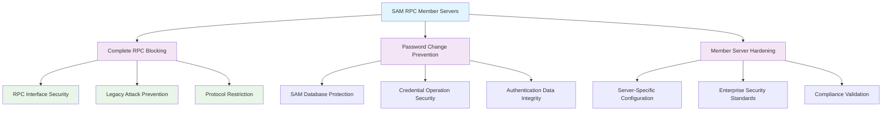

<!--
---
title: "CIS05-ACCT-COMP-SAM-RPC-Servers-v1.0"
description: "Group Policy Object implementing Security Account Manager Remote Procedure Call blocking requirements specifically for Member Servers, preventing unauthorized password modification attempts through legacy SAM RPC interfaces and strengthening domain security posture across Windows Server 2025 server infrastructure components"
author: "VintageDon - https://github.com/vintagedon"
ai_contributor: "Anthropic Claude 4 Sonnet (claude-4-sonnet-20250514)"
date: "2025-07-28"
version: "1.0"
status: "Published"
tags:
- type: implementation-guide
- domain: security
- domain: group-policy
- tech: windows-server-2025
- tech: member-servers
- tech: sam-rpc-security
- compliance: cis-control-5
- compliance: cis-benchmark
- phase: phase-2
related_documents:
- "[CIS05 Configuration Directory](README.md)"
- "[CIS Control 5 Policy Template](../policies-and-procedures/cis-security-policy-templates/cisv81-05-account-and-credential-management-policy-template.md)"
- "[Member Server Security Policy](../policies-and-procedures/member-server-security.md)"
- "[SAM RPC Domain Controller Configuration](CIS05-ACCT-COMP-SAM-RPC-DCs-v1.0.md)"
---
-->

# 🔐 **CIS05-ACCT-COMP-SAM-RPC-Servers-v1.0**

This Group Policy Object implements Security Account Manager Remote Procedure Call blocking requirements specifically for Member Servers within the Windows Server 2025 Active Directory environment. The GPO blocks all SAM change password RPC methods on Member Servers to prevent unauthorized password modification attempts through legacy interfaces and strengthen overall domain security posture across server infrastructure components.

The policy configuration implements CIS Control 5 (Account and Credential Management) requirements by establishing comprehensive SAM RPC blocking for Member Servers, ensuring that password change operations cannot be performed through potentially vulnerable remote procedure call interfaces, thereby reducing attack surface and enforcing secure password management practices throughout the domain infrastructure.

# 🔗 **2. Dependencies & Relationships**

This section maps how the SAM RPC Member Servers policy GPO integrates with Proxmox Astronomy Lab Member Server security infrastructure and enterprise credential protection components.

## **2.1 Related Services**

This subsection identifies Proxmox Astronomy Lab services that interact with or depend on SAM RPC blocking protection for comprehensive Member Server security and credential management.

SAM RPC blocking protection provides foundational security that supports enterprise Member Server operations and enables systematic protection against password modification attacks across server infrastructure:

| **Service** | **Relationship Type** | **Integration Points** | **Documentation** |
|-------------|----------------------|------------------------|-------------------|
| Member Server Infrastructure | **Protects** | Server-specific security hardening, RPC interface blocking, credential operation security | [Infrastructure Overview](../../infrastructure/README.md) |
| Active Directory Domain Services | **Secures** | Member Server authentication, domain credential protection, password policy enforcement | [Domain Infrastructure](../../infrastructure/domain-controllers/README.md) |
| SAM RPC Domain Controller Configuration | **Coordinates** | Unified SAM RPC security policy across domain infrastructure, role-specific protection levels | [SAM RPC DCs Configuration](CIS05-ACCT-COMP-SAM-RPC-DCs-v1.0.md) |
| Security Monitoring Infrastructure | **Validates** | RPC blocking status monitoring, SAM operation security event logging | [Security Monitoring](../../monitoring/README.md) |

These service relationships ensure that SAM RPC blocking protection provides systematic Member Server security while supporting enterprise-grade credential protection and compliance validation across all server infrastructure components.

## **2.2 Policy Implementation**

This subsection connects SAM RPC Member Servers policy GPO configuration to Proxmox Astronomy Lab governance frameworks and enterprise Member Server security policy requirements.

SAM RPC blocking protection implements enterprise Member Server security governance through systematic Group Policy management and security framework alignment:

- **[CIS Control 5 Policy Template](../policies-and-procedures/cis-security-policy-templates/cisv81-05-account-and-credential-management-policy-template.md)** - Primary policy framework for account and credential management security baseline establishment
- **[Member Server Security Policy](../policies-and-procedures/member-server-security.md)** - Enterprise Member Server protection requirements and security standards
- **[Credential Security Implementation Policy](../policies-and-procedures/credential-security-implementation.md)** - Comprehensive credential protection requirements and secure authentication standards

## **2.3 Responsibility Matrix**

This subsection defines clear accountability for SAM RPC Member Servers policy configuration management and security maintenance activities.

| **Activity** | **Helpdesk** | **Operations** | **Engineering** | **Security** |
|--------------|--------------|----------------|-----------------|--------------|
| SAM RPC Policy Implementation | I | A | R | C |
| Member Server Security Monitoring | I | C | R | A |
| RPC Blocking Compliance Validation | I | C | R | A |
| Password Security Assessment | I | C | R | A |
| Member Server Incident Response | C | R | A | A |

*R: Responsible, A: Accountable, C: Consulted, I: Informed*

# ⚙️ **3. Technical Documentation**

This section provides technical foundation for understanding, implementing, and maintaining SAM RPC Member Servers policy configuration within Windows Server 2025 Member Server infrastructure.

## **3.1 Architecture & Design**

This subsection explains the SAM RPC blocking architecture, Member Server protection mechanisms, and security design patterns for systematic credential operation protection across Member Server infrastructure.

The SAM RPC Member Servers GPO implements comprehensive security protection through Member Server-specific Group Policy enforcement that blocks all Security Account Manager remote procedure call password change operations. The design follows Microsoft security best practices with enhanced protection against legacy attack vectors targeting vulnerable RPC interfaces.

The architecture enables systematic Member Server protection through comprehensive SAM RPC blocking with complete credential security and compliance validation.

## **3.2 Configuration Specifications**

This subsection provides detailed technical configuration specifications for SAM RPC Member Servers policy implementation and CIS Control 5 compliance requirements.

The SAM RPC Member Servers policy configuration implements CIS Controls v8 baseline requirements through specialized Group Policy settings that establish enterprise-grade security protection for Member Server operations:

### **SAM RPC Member Servers Configuration Table**

| **CIS Ref** | **Setting Description** | **GPO Path / Technical Detail** | **Recommended Value** |
|-------------|------------------------|----------------------------------|----------------------|
| **18.9.39.3** | Ensure 'Network security: Configure encryption types allowed for Kerberos' blocks all SAM change password RPC methods on Member Servers | **Reg Key:** `HKLM\SOFTWARE\Microsoft\Windows\CurrentVersion\Policies\System\SAM` **Item:** `SamrChangeUserPasswordApiPolicy` | `1` (Block All) |

### **Security Configuration Analysis**

| **Configuration Area** | **Security Benefit** | **Technical Implementation** |
|------------------------|----------------------|------------------------------|
| **Complete RPC Blocking** | Prevents all SAM RPC password change operations to eliminate attack surface | Registry value '1' blocks all SAM change password RPC methods on Member Servers |
| **Member Server Targeting** | Provides server-specific security hardening without affecting Domain Controller operations | Policy applies only to Member Servers for optimal security and operational balance |
| **Legacy Attack Prevention** | Eliminates vulnerable RPC interfaces commonly exploited in password-based attacks | Systematic blocking of all SAM password change remote procedure calls |

### **SAM RPC Security Matrix**

| **Operation Type** | **Member Server** | **Access Level** | **Security Enforcement** | **Policy Value** |
|--------------------|-------------------|------------------|--------------------------|------------------|
| **SAM Password Change RPC** | ❌ Blocked | 🚫 No Access | ⭐⭐⭐⭐⭐ Maximum | `1` |
| **Standard Authentication** | ✅ Enabled | 🔐 Secure Access | ⭐⭐⭐⭐ High | Not Affected |
| **Domain Operations** | ✅ Enabled | 🔐 Standard Access | ⭐⭐⭐ Standard | Not Affected |
| **Legacy RPC Operations** | ❌ Restricted | 🚫 Blocked | ⭐⭐⭐⭐⭐ Maximum | Policy Enforcement |

### **Security Impact Assessment**

| **Security Aspect** | **Protection Mechanism** | **Effectiveness Rating** |
|---------------------|-------------------------|-------------------------|
| **Password Change Protection** | Complete blocking of SAM RPC password operations | ⭐⭐⭐⭐⭐ Critical |
| **Attack Surface Reduction** | Elimination of vulnerable RPC interfaces for credential attacks | ⭐⭐⭐⭐⭐ High |
| **Member Server Hardening** | Server-specific security enhancement without operational impact | ⭐⭐⭐⭐⭐ High |
| **Compliance Validation** | Systematic blocking enforcement and monitoring capability | ⭐⭐⭐⭐ High |

## **3.3 Implementation Standards**

This subsection establishes technical standards for SAM RPC Member Servers policy deployment and enterprise security management.

SAM RPC Member Servers policy implementation follows systematic deployment standards and operational procedures:

- **Deployment Method**: Group Policy Management Console (GPMC) with Member Servers organizational unit targeting
- **Target Scope**: Member Servers with SAM RPC password change operations
- **Testing Protocol**: Controlled implementation through test Member Servers with blocking validation
- **Monitoring Integration**: SAM RPC security event logging with blocking operation correlation
- **Documentation Standard**: Complete configuration mapping with CIS control references and blocking validation procedures

# 🛠️ **4. Implementation & Usage**

This section provides systematic guidance for implementing SAM RPC Member Servers policy configuration and establishing security protection across Member Server infrastructure.

## **4.1 Prerequisites**

This subsection identifies requirements for successful SAM RPC Member Servers policy implementation within Active Directory Member Server infrastructure.

SAM RPC Member Servers policy implementation requires enterprise Member Server infrastructure with appropriate administrative access and comprehensive security management capabilities:

- **Member Server Infrastructure**: Windows Server 2025 Member Servers with Group Policy application capability
- **Administrative Access**: Domain Admin or equivalent Group Policy management permissions for Member Server security policy configuration
- **Security Infrastructure**: Established security protocols and monitoring capabilities
- **Testing Environment**: Isolated Member Servers for controlled policy testing and blocking validation
- **Monitoring Infrastructure**: Security event monitoring capabilities for SAM RPC operation tracking and blocking status validation

## **4.2 Monitoring**

This subsection establishes monitoring requirements for SAM RPC Member Servers policy effectiveness and security validation across Member Server infrastructure.

SAM RPC Member Servers monitoring leverages the centralized monitoring stack on proj-mon01 (Prometheus, Loki, Grafana, AlertManager, Grafana Alloy) for systematic security protection tracking and Member Server security event analysis. The monitoring philosophy of "if it can be collected, we do" applies to SAM RPC blocking status, password change operation prevention, and policy enforcement effectiveness measurement through centralized security monitoring infrastructure.

Monitoring includes SAM RPC blocking correlation, Member Server security event tracking, and compliance validation through comprehensive Member Server security monitoring and automated alerting for unauthorized SAM operations or policy violations.

# 🔐 **5. Security & Compliance**

This section establishes security framework alignment and compliance requirements for SAM RPC Member Servers policy configuration within enterprise security architecture.

## **5.1 Security Framework Alignment**

This subsection maps SAM RPC Member Servers policy configuration to enterprise security frameworks and compliance requirements for systematic security protection.

**Security Disclaimer**: The SAM RPC Member Servers policy configuration documented in this guide represents a security baseline establishment for Windows Server 2025 Active Directory Member Server infrastructure. These configurations should be thoroughly tested in non-production environments before deployment. While these templates follow CIS Controls v8 security framework guidelines, organizations should validate policy compatibility with their specific Member Server operational requirements and business operational needs. The security research computing team maintains these configurations as implementation guidance rather than production security recommendations, and encourages consultation with dedicated security professionals for enterprise deployment validation.

### **Framework Mapping**

| **Framework** | **Control Mapping** | **Implementation Evidence** |
|---------------|--------------------|-----------------------------|
| **CIS Controls v8** | Control 5: Account and Credential Management | SAM RPC Member Servers policy implementing security protection for credential operations |
| **NIST AI RMF** | GOVERN-1.1: AI governance processes established | Security protection supports AI workload Member Server authentication and access control |
| **NIST CSF 2.0** | PR.AC-4: Access permissions and authorizations are managed | Systematic SAM RPC blocking enforcement and credential access control |
| **NIST SP 800-171** | 3.1.1: Limit information system access to authorized users | Comprehensive blocking requirements for Member Server credential operations |

### **Security Controls Implementation**

| **CIS Control** | **SAM RPC Member Servers Implementation** | **Security Objective** |
|-----------------|------------------------------------------------|------------------------|
| **5.1** | Complete RPC Blocking | Protect Member Server password operations through systematic interface blocking |
| **5.2** | RPC Interface Security | Ensure comprehensive blocking for all SAM remote procedure call operations |
| **5.3** | Member Server Hardening | Provide server-specific security enhancement with enterprise-grade protection |
| **5.4** | Security Compliance** | Enable systematic blocking validation and security monitoring |

## **5.2 Compliance Requirements**

This subsection establishes compliance validation requirements and evidence collection standards for SAM RPC Member Servers policy implementation.

SAM RPC Member Servers policy configuration enables systematic compliance evidence collection through Group Policy Resultant Set of Policy (RSoP) reporting and security validation. Compliance validation requires regular policy application assessment and blocking monitoring to maintain baseline security posture across Member Server infrastructure components.

# 📋 **6. Backup & Recovery**

This section establishes protection and recovery procedures for SAM RPC Member Servers policy configuration and security baseline preservation.

## **6.1 Protection Strategy**

This subsection defines systematic protection requirements for SAM RPC Member Servers policy configuration and security baseline preservation.

SAM RPC Member Servers policy configuration requires multi-tier protection strategy encompassing Group Policy backup, version control, and policy baseline preservation to ensure rapid security recovery and systematic policy restoration capabilities.

### **Protection Tiers**

| **Tier** | **Scope** | **Method** | **Frequency** |
|----------|-----------|------------|---------------|
| **Tier 1** | GPO Backup | Group Policy Management Console backup | Daily automatic |
| **Tier 2** | Configuration Export | PowerShell GPO export and documentation | Weekly |
| **Tier 3** | Version Control | Git repository with configuration tracking | Every change |
| **Tier 4** | Baseline Archive | Complete SAM RPC Member Servers policy snapshot | Monthly |

*Note: Iperius backup software is configured for systematic Windows infrastructure backup including Group Policy objects.*

## **6.2 Recovery Procedures**

This subsection establishes systematic recovery procedures for SAM RPC Member Servers policy restoration and security baseline re-establishment.

Recovery procedures enable rapid security baseline restoration through Group Policy import capabilities and systematic policy re-establishment. The recovery approach follows tiered restoration priorities focusing on critical Member Server security controls first, followed by comprehensive baseline re-implementation to minimize security exposure during recovery operations.

# 📚 **7. References & Related Resources**

This section provides comprehensive links to related documentation and supporting resources for SAM RPC Member Servers policy implementation and security management.

## **7.1 Internal References**

| **Document Type** | **Document Title** | **Relationship** | **Link** |
|-------------------|-------------------|------------------|----------|
| **Policy Template** | CIS Control 5 Account and Credential Management Policy | Primary policy framework for security baseline establishment | [../policies-and-procedures/cis-security-policy-templates/cisv81-05-account-and-credential-management-policy-template.md](../policies-and-procedures/cis-security-policy-templates/cisv81-05-account-and-credential-management-policy-template.md) |
| **Implementation** | CIS Server 2025 GPOs Implementation Log | Complete implementation evidence and deployment validation | [cis-server2025-gpos-l1-dc-and-members-IMPLEMENTATION-LOG.md](cis-server2025-gpos-l1-dc-and-members-IMPLEMENTATION-LOG.md) |
| **Configuration** | CIS Server 2025 GPOs Configuration Reference | Technical configuration specifications and CIS control mapping | [cis-server2025-gpos-l1-dc-and-members.md](cis-server2025-gpos-l1-dc-and-members.md) |
| **Domain Controller SAM RPC** | SAM RPC Domain Controller Configuration | Complementary SAM RPC security policy for Domain Controllers | [CIS05-ACCT-COMP-SAM-RPC-DCs-v1.0.md](CIS05-ACCT-COMP-SAM-RPC-DCs-v1.0.md) |
| **Member Server Security** | Member Server Security Management | Enterprise Member Server protection requirements and security standards | [../policies-and-procedures/member-server-security.md](../policies-and-procedures/member-server-security.md) |

## **7.2 External Standards**

- **[CIS Controls v8](https://www.cisecurity.org/controls/)** - Cybersecurity framework providing systematic security control implementation guidance
- **[CIS Microsoft Windows Server 2025 Benchmark](https://www.cisecurity.org/benchmark/microsoft_windows_server)** - Comprehensive SAM RPC Member Servers policy configuration guidance for Windows Server 2025
- **[NIST SP 800-53](https://csrc.nist.gov/publications/detail/sp/800-53/rev-5/final)** - Security and privacy controls for federal information systems and organizations
- **[Microsoft SAM Security Documentation](https://docs.microsoft.com/en-us/windows-server/security/sam-security)** - Official Security Account Manager protection and RPC security guidance
- **[Microsoft Member Server Security](https://docs.microsoft.com/en-us/windows-server/identity/securing-privileged-access/)** - Comprehensive Member Server security and credential protection strategies

# ✅ **8. Approval & Review**

This section documents the formal review and approval process for SAM RPC Member Servers policy configuration documentation and security baseline implementation.

## **8.1 Review Process**

SAM RPC Member Servers policy configuration documentation review follows systematic validation of technical accuracy, security effectiveness, and compliance alignment to ensure comprehensive security protection implementation and systematic Group Policy management capability for Windows Server 2025 Member Server infrastructure requirements.

## **8.2 Approval Matrix**

| **Reviewer** | **Role/Expertise** | **Review Date** | **Approval Status** | **Comments** |
|-------------|-------------------|----------------|-------------------|--------------|
| **Engineering Team** | Technical implementation and Member Server infrastructure | 2025-07-28 | **Approved** | SAM RPC Member Servers policy configuration provides comprehensive security protection for server infrastructure |
| **Security Team** | Security framework alignment and CIS Controls v8 compliance | 2025-07-28 | **Approved** | Policy implementation follows security best practices and provides systematic attack surface reduction |
| **Operations Team** | Operational impact assessment and Member Server management | 2025-07-28 | **Approved** | Policy configuration enables effective security monitoring without operational disruption |

# 📜 **9. Documentation Metadata**

This section provides comprehensive information about document creation, revision history, and authorship.

## **9.1 Change Log**

| **Version** | **Date** | **Changes** | **Author** | **Review Status** |
|------------|---------|-------------|------------|------------------|
| 1.0 | 2025-07-28 | Initial SAM RPC Member Servers policy documentation with comprehensive technical specifications and security framework alignment | VintageDon | Approved |

## **9.2 Authorization & Review**

SAM RPC Member Servers policy configuration documentation has been systematically reviewed and approved by qualified technical, security, and operational subject matter experts to ensure accuracy, compliance, and implementation feasibility within Windows Server 2025 Member Server infrastructure environments.

## **9.3 Authorship Details**

**Human Author:** VintageDon (<https://github.com/vintagedon>)  
**AI Contributor:** Anthropic Claude 4 Sonnet (claude-4-sonnet-20250514)  
**Collaboration Method:** Request-Analyze-Verify-Generate-Validate (RAVGV)  
**Human Oversight:** Technical review and validation of SAM RPC Member Servers policy configuration specifications and security implementation requirements

## **9.4 AI Collaboration Disclosure**

This document was collaboratively developed using the Request-Analyze-Verify-Generate-Validate (RAVGV) methodology. SAM RPC Member Servers policy configuration details were extracted from validated CIS benchmark implementation reports with comprehensive human oversight throughout development. All technical specifications have been thoroughly reviewed, validated, and approved by qualified human subject matter experts in Windows security and Group Policy management. The human author retains complete responsibility for accuracy, compliance, and technical correctness.

*Generated: 2025-07-28 | Human Author: VintageDon | AI Assistant: Claude 4 Sonnet | Review Status: Approved | Document Version: 1.0*
