<!--
---
title: "CIS06-ACCESS-COMP-Anonymous-AllDomain-v1.0"
description: "Group Policy Object implementing anonymous access restrictions for all domain-joined computers, disabling anonymous SID/Name translation and blocking null session access to strengthen domain security across Windows Server 2025 Active Directory infrastructure"
author: "VintageDon - https://github.com/vintagedon"
ai_contributor: "Anthropic Claude 4 Sonnet (claude-4-sonnet-20250514)"
date: "2025-07-28"
version: "1.0"
status: "Published"
tags:
- type: implementation-guide
- domain: security
- domain: group-policy
- tech: windows-server-2025
- tech: anonymous-access
- tech: access-control
- compliance: cis-control-6
- compliance: cis-benchmark
- phase: phase-2
related_documents:
- "[CIS06 Access Control Directory](README.md)"
- "[CIS Control 6 Policy Template](../policies-and-procedures/cis-security-policy-templates/cisv81-06-access-control-management-policy-template.md)"
- "[Anonymous Access Domain Controllers Configuration](CIS06-ACCESS-COMP-Anonymous-DCs-v1.0.md)"
- "[Anonymous Access Member Servers Configuration](CIS06-ACCESS-COMP-Anonymous-Servers-v1.0.md)"
- "[Domain Security Policy](../policies-and-procedures/domain-security-policy.md)"
---
-->

# 🔐 **CIS06-ACCESS-COMP-Anonymous-AllDomain-v1.0**

This Group Policy Object implements anonymous access restrictions for all domain-joined computers within the Windows Server 2025 Active Directory environment. The GPO disables anonymous SID/Name translation, blocks null session access, and restricts anonymous enumeration capabilities to strengthen domain security and prevent unauthorized information disclosure across the radioastronomy.io domain infrastructure.

The policy configuration implements CIS Control 6 (Access Control Management) requirements by establishing comprehensive anonymous access restrictions that prevent unauthorized information gathering, disable legacy anonymous communication methods, and enhance overall domain security posture through systematic elimination of anonymous attack vectors across all domain-joined systems.

# 🔗 **2. Dependencies & Relationships**

This section maps how the Anonymous AllDomain policy GPO integrates with Proxmox Astronomy Lab domain security infrastructure and enterprise anonymous access control components.

## **2.1 Related Services**

This subsection identifies Proxmox Astronomy Lab services that interact with or depend on anonymous access restrictions for comprehensive domain security and information protection.

Anonymous access restrictions provide foundational security that supports enterprise domain operations and enables systematic protection against information disclosure across Active Directory infrastructure:

| **Service** | **Relationship Type** | **Integration Points** | **Documentation** |
|-------------|----------------------|------------------------|-------------------|
| Active Directory Domain Services | **Secures** | Domain authentication, anonymous access prevention, SID/Name translation blocking | [Infrastructure Overview](../../infrastructure/README.md) |
| Domain Security Infrastructure | **Protects** | Information disclosure prevention, unauthorized enumeration blocking, domain hardening | [Domain Security](../../infrastructure/domain-controllers/README.md) |
| Anonymous Access Domain Controllers | **Coordinates** | DC-specific anonymous access policies with domain-wide baseline restrictions | [Anonymous DCs Configuration](CIS06-ACCESS-COMP-Anonymous-DCs-v1.0.md) |
| Anonymous Access Member Servers | **Coordinates** | Server-specific anonymous access policies with domain-wide baseline restrictions | [Anonymous Servers Configuration](CIS06-ACCESS-COMP-Anonymous-Servers-v1.0.md) |
| Security Monitoring Infrastructure | **Validates** | Anonymous access attempt monitoring, policy compliance tracking, security event logging | [Security Monitoring](../../monitoring/README.md) |
| Network Security Infrastructure | **Enhances** | Network-level access control, session management, communication security | [Network Security](../../infrastructure/network/README.md) |

These service relationships ensure that anonymous access restrictions provide systematic domain security while supporting enterprise-grade information protection and compliance validation across all domain infrastructure components.

## **2.2 Policy Implementation**

This subsection connects Anonymous AllDomain policy GPO configuration to Proxmox Astronomy Lab governance frameworks and enterprise domain security policy requirements.

Anonymous access restrictions implement enterprise domain security governance through systematic Group Policy management and security framework alignment:

- **[CIS Control 6 Policy Template](../policies-and-procedures/cis-security-policy-templates/cisv81-06-access-control-management-policy-template.md)** - Primary policy framework for access control management security baseline establishment
- **[Domain Security Policy](../policies-and-procedures/domain-security-policy.md)** - Enterprise domain protection requirements and anonymous access restriction standards
- **[Information Security Policy](../policies-and-procedures/information-security-policy.md)** - Comprehensive information protection and unauthorized disclosure prevention requirements
- **[Network Access Control Policy](../policies-and-procedures/network-access-control-policy.md)** - Network-level access restrictions and session management security standards

## **2.3 Responsibility Matrix**

This subsection defines clear accountability for Anonymous AllDomain policy configuration management and domain security maintenance activities.

| **Activity** | **Helpdesk** | **Operations** | **Engineering** | **Security** |
|--------------|--------------|----------------|-----------------|--------------|
| Anonymous Access Policy Implementation | I | A | R | C |
| Domain Security Configuration | I | C | R | A |
| Information Disclosure Prevention | I | C | R | A |
| Anonymous Access Monitoring | I | C | R | A |
| Domain Security Assessment | I | C | R | A |
| Anonymous Access Incident Response | C | R | A | A |

*R: Responsible, A: Accountable, C: Consulted, I: Informed*

# ⚙️ **3. Technical Documentation**

This section provides technical foundation for understanding, implementing, and maintaining Anonymous AllDomain policy configuration within Windows Server 2025 Active Directory infrastructure.

## **3.1 Architecture & Design**

This subsection explains the anonymous access restriction architecture, domain security mechanisms, and access control design patterns for systematic information protection across Active Directory infrastructure.

The Anonymous AllDomain GPO implements comprehensive security protection through domain-wide Group Policy enforcement that eliminates anonymous access vectors and prevents unauthorized information disclosure. The design follows Microsoft security best practices with enhanced protection against legacy anonymous communication methods and information enumeration attacks.

```mermaid
graph TD
    A[Anonymous AllDomain Restrictions] --> B[SID/Name Translation Blocking]
    A --> C[Anonymous Session Control]
    A --> D[Share Access Restrictions]
    A --> E[Everyone Group Security]
    
    B --> F[Anonymous Lookups Disabled]
    B --> G[Identity Protection]
    B --> H[SID Translation Prevention]
    B --> I[Name Resolution Blocking]
    
    C --> J[Null Session Blocking]
    C --> K[Anonymous Connection Prevention]
    C --> L[Session Establishment Control]
    C --> M[Authentication Requirements]
    
    D --> N[Share Enumeration Prevention]
    D --> O[Anonymous Share Access Blocking]
    D --> P[Resource Protection]
    D --> Q[File System Security]
    
    E --> R[Anonymous Exclusion]
    E --> S[Group Membership Control]
    E --> T[Permission Inheritance Prevention]
    
    style A fill:#e1f5fe
    style B fill:#f3e5f5
    style C fill:#f3e5f5
    style D fill:#f3e5f5
    style E fill:#f3e5f5
    style F fill:#e8f5e8
    style G fill:#e8f5e8
    style H fill:#e8f5e8
    style I fill:#e8f5e8
```

The architecture enables systematic domain security through comprehensive anonymous access elimination with information protection and attack vector reduction.

## **3.2 Configuration Specifications**

This subsection provides detailed technical configuration specifications for Anonymous AllDomain policy implementation and CIS Control 6 compliance requirements.

The Anonymous AllDomain policy configuration implements CIS Controls v8 baseline requirements through specialized Group Policy settings that establish enterprise-grade anonymous access restrictions for all domain systems:

### **Anonymous Access Control Configuration Table**

| **CIS Ref** | **Setting Description** | **Registry Path** | **Value Name** | **Recommended Value** |
|-------------|------------------------|-------------------|----------------|----------------------|
| **2.3.10.1** | Disable anonymous SID/Name translation | `HKLM\System\CurrentControlSet\Control\Lsa` | `TurnOffAnonymousBlock` | `1` (Enabled) |
| **2.3.10.1** | Exclude anonymous users from Everyone group | `HKLM\System\CurrentControlSet\Control\Lsa` | `EveryoneIncludesAnonymous` | `0` (Disabled) |
| **2.3.10.1** | Restrict null session access to shares | `HKLM\System\CurrentControlSet\Services\LanManServer\Parameters` | `RestrictNullSessAccess` | `1` (Enabled) |
| **2.3.10.1** | Remove anonymous accessible shares | `HKLM\System\CurrentControlSet\Services\LanManServer\Parameters` | `NullSessionShares` | `(Empty)` |

### **Security Configuration Analysis**

| **Configuration Area** | **Security Benefit** | **Attack Vector Elimination** |
|------------------------|----------------------|-------------------------------|
| **SID/Name Translation Blocking** | Prevents anonymous enumeration of user accounts and security identifiers | Eliminates account discovery through anonymous SID translation attacks |
| **Everyone Group Exclusion** | Removes anonymous users from Everyone group permissions | Prevents anonymous access through inherited Everyone permissions |
| **Null Session Restriction** | Blocks anonymous network session establishment | Eliminates null session-based information gathering and enumeration |
| **Anonymous Share Blocking** | Prevents anonymous access to network shares | Removes file system access through anonymous connections |

### **Anonymous Access Security Matrix**

| **Security Control** | **Protection Level** | **Information Disclosure Prevention** | **Attack Vector Blocking** | **CIS Compliance** |
|---------------------|---------------------|---------------------------------------|----------------------------|-------------------|
| **Anonymous SID Translation** | ⭐⭐⭐⭐⭐ Maximum | 🚫 Complete Blocking | ✅ Account Enumeration | ✅ CIS Compliant |
| **Everyone Group Access** | ⭐⭐⭐⭐ High | 🚫 Permission Inheritance | ✅ Anonymous Permissions | ✅ CIS Compliant |
| **Null Session Access** | ⭐⭐⭐⭐⭐ Maximum | 🚫 Session Information | ✅ Anonymous Connections | ✅ CIS Compliant |
| **Anonymous Share Access** | ⭐⭐⭐⭐ High | 🚫 File System Access | ✅ Share Enumeration | ✅ CIS Compliant |

### **Technical Implementation Details**

| **Registry Setting** | **Technical Function** | **Security Impact** |
|---------------------|------------------------|---------------------|
| **TurnOffAnonymousBlock = 1** | Disables anonymous SID and name lookup operations | Prevents attackers from mapping SIDs to usernames or discovering account information |
| **EveryoneIncludesAnonymous = 0** | Removes anonymous users from the Everyone security group | Blocks anonymous access through permissions granted to Everyone group |
| **RestrictNullSessAccess = 1** | Restricts anonymous access to named pipes and shares | Prevents anonymous enumeration and information gathering through null sessions |
| **NullSessionShares = (Empty)** | Removes all shares accessible through anonymous connections | Eliminates file system access points for anonymous users |

## **3.3 Implementation Standards**

This subsection establishes technical standards for Anonymous AllDomain policy deployment and enterprise domain security management.

Anonymous AllDomain policy implementation follows systematic deployment standards and operational procedures:

- **Deployment Method**: Group Policy Management Console (GPMC) with All Domain systems targeting
- **Target Scope**: All domain-joined computers requiring anonymous access restrictions
- **Testing Protocol**: Controlled implementation through test systems with anonymous access validation
- **Monitoring Integration**: Anonymous access attempt logging with security event correlation
- **Documentation Standard**: Complete configuration mapping with CIS control references and security validation procedures

# 🛠️ **4. Implementation & Usage**

This section provides systematic guidance for implementing Anonymous AllDomain policy configuration and establishing domain security across Active Directory infrastructure.

## **4.1 Prerequisites**

This subsection identifies requirements for successful Anonymous AllDomain policy implementation within Active Directory infrastructure.

Anonymous AllDomain policy implementation requires enterprise Active Directory infrastructure with appropriate administrative access and comprehensive domain security management capabilities:

- **Active Directory Infrastructure**: Windows Server 2025 domain-joined systems with Group Policy application capability
- **Administrative Access**: Domain Admin or equivalent Group Policy management permissions for anonymous access policy configuration
- **Domain Security Infrastructure**: Established domain protection protocols and security monitoring capabilities
- **Testing Environment**: Isolated systems for controlled policy testing and anonymous access validation
- **Monitoring Infrastructure**: Security event monitoring capabilities for anonymous access tracking and policy compliance validation

## **4.2 Monitoring**

This subsection establishes monitoring requirements for Anonymous AllDomain policy effectiveness and domain security validation across Active Directory infrastructure.

Anonymous AllDomain monitoring leverages the centralized monitoring stack on proj-mon01 (Prometheus, Loki, Grafana, AlertManager, Grafana Alloy) for systematic domain security tracking and anonymous access restriction analysis. The monitoring philosophy of "if it can be collected, we do" applies to anonymous access attempts, policy enforcement status, and security violation detection through centralized security monitoring infrastructure.

Monitoring includes anonymous access attempt correlation, policy compliance tracking, and security validation through comprehensive Active Directory security monitoring and automated alerting for anonymous access violations or policy bypasses.

# 🔐 **5. Security & Compliance**

This section establishes security framework alignment and compliance requirements for Anonymous AllDomain policy configuration within enterprise domain security architecture.

## **5.1 Security Framework Alignment**

This subsection maps Anonymous AllDomain policy configuration to enterprise security frameworks and compliance requirements for systematic domain security.

**Security Disclaimer**: The Anonymous AllDomain policy configuration documented in this guide represents a domain security baseline establishment for Windows Server 2025 Active Directory infrastructure. These configurations should be thoroughly tested in non-production environments before deployment. While these templates follow CIS Controls v8 access control framework guidelines, organizations should validate policy compatibility with their specific operational requirements and legacy application needs. The security research computing team maintains these configurations as implementation guidance rather than production security recommendations, and encourages consultation with dedicated security professionals for enterprise deployment validation.

### **Framework Mapping**

| **Framework** | **Control Mapping** | **Implementation Evidence** |
|---------------|--------------------|-----------------------------|
| **CIS Controls v8** | Control 6: Access Control Management | Anonymous AllDomain policy implementing systematic anonymous access restriction across Active Directory infrastructure |
| **NIST AI RMF** | GOVERN-1.1: AI governance processes established | Domain security supports AI workload information protection and unauthorized access prevention |
| **NIST CSF 2.0** | PR.AC-4: Access permissions and authorizations are managed | Systematic anonymous access control and information disclosure prevention |
| **NIST SP 800-171** | 3.1.1: Limit information system access to authorized users | Comprehensive anonymous access restriction and unauthorized user prevention |

### **Security Controls Implementation**

| **CIS Control** | **Anonymous AllDomain Implementation** | **Security Objective** |
|-----------------|----------------------------------------|------------------------|
| **6.1** | Systematic Anonymous Access Restriction | Eliminate unauthorized information disclosure through anonymous access vectors |
| **6.2** | SID/Name Translation Prevention | Prevent account enumeration and identity discovery through anonymous methods |
| **6.3** | Null Session Blocking | Eliminate anonymous session establishment and information gathering capabilities |
| **6.4** | Share Access Control | Prevent anonymous file system access and resource enumeration |

## **5.2 Compliance Requirements**

This subsection establishes compliance validation requirements and evidence collection standards for Anonymous AllDomain policy implementation.

Anonymous AllDomain policy configuration enables systematic compliance evidence collection through Group Policy Resultant Set of Policy (RSoP) reporting and domain security validation. Compliance validation requires regular policy application assessment and anonymous access monitoring to maintain baseline domain security posture across Active Directory infrastructure components.

# 📋 **6. Backup & Recovery**

This section establishes protection and recovery procedures for Anonymous AllDomain policy configuration and domain security baseline preservation.

## **6.1 Protection Strategy**

This subsection defines systematic protection requirements for Anonymous AllDomain policy configuration and domain security baseline preservation.

Anonymous AllDomain policy configuration requires multi-tier protection strategy encompassing Group Policy backup, version control, and policy baseline preservation to ensure rapid domain security recovery and systematic policy restoration capabilities.

### **Protection Tiers**

| **Tier** | **Scope** | **Method** | **Frequency** |
|----------|-----------|------------|---------------|
| **Tier 1** | GPO Backup | Group Policy Management Console backup | Daily automatic |
| **Tier 2** | Configuration Export | PowerShell GPO export and documentation | Weekly |
| **Tier 3** | Version Control | Git repository with configuration tracking | Every change |
| **Tier 4** | Baseline Archive | Complete Anonymous AllDomain policy snapshot | Monthly |

*Note: Iperius backup software is configured for systematic Windows infrastructure backup including Group Policy objects.*

## **6.2 Recovery Procedures**

This subsection establishes systematic recovery procedures for Anonymous AllDomain policy restoration and domain security baseline re-establishment.

Recovery procedures enable rapid domain security baseline restoration through Group Policy import capabilities and systematic policy re-establishment. The recovery approach follows tiered restoration priorities focusing on critical anonymous access restrictions first, followed by comprehensive baseline re-implementation to minimize information disclosure exposure during recovery operations.

# 📚 **7. References & Related Resources**

This section provides comprehensive links to related documentation and supporting resources for Anonymous AllDomain policy implementation and domain security management.

## **7.1 Internal References**

| **Document Type** | **Document Title** | **Relationship** | **Link** |
|-------------------|-------------------|------------------|----------|
| **Policy Template** | CIS Control 6 Access Control Management Policy | Primary policy framework for domain security baseline establishment | [../policies-and-procedures/cis-security-policy-templates/cisv81-06-access-control-management-policy-template.md](../policies-and-procedures/cis-security-policy-templates/cisv81-06-access-control-management-policy-template.md) |
| **Implementation** | CIS Server 2025 GPOs Implementation Log | Complete implementation evidence and deployment validation | [cis-server2025-gpos-l1-dc-and-members-IMPLEMENTATION-LOG.md](cis-server2025-gpos-l1-dc-and-members-IMPLEMENTATION-LOG.md) |
| **Configuration** | CIS Server 2025 GPOs Configuration Reference | Technical configuration specifications and CIS control mapping | [cis-server2025-gpos-l1-dc-and-members.md](cis-server2025-gpos-l1-dc-and-members.md) |
| **Anonymous DCs** | Anonymous Access Domain Controllers Configuration | DC-specific anonymous access policies and domain service requirements | [CIS06-ACCESS-COMP-Anonymous-DCs-v1.0.md](CIS06-ACCESS-COMP-Anonymous-DCs-v1.0.md) |
| **Anonymous Servers** | Anonymous Access Member Servers Configuration | Server-specific anonymous access policies and enhanced restrictions | [CIS06-ACCESS-COMP-Anonymous-Servers-v1.0.md](CIS06-ACCESS-COMP-Anonymous-Servers-v1.0.md) |
| **Domain Security** | Domain Security Management Policy | Enterprise domain protection requirements and security standards | [../policies-and-procedures/domain-security-policy.md](../policies-and-procedures/domain-security-policy.md) |

## **7.2 External Standards**

- **[CIS Controls v8](https://www.cisecurity.org/controls/)** - Cybersecurity framework providing systematic domain security implementation guidance
- **[CIS Microsoft Windows Server 2025 Benchmark](https://www.cisecurity.org/benchmark/microsoft_windows_server)** - Comprehensive Anonymous AllDomain policy configuration guidance for Windows Server 2025
- **[NIST SP 800-53](https://csrc.nist.gov/publications/detail/sp/800-53/rev-5/final)** - Security and privacy controls for federal information systems and organizations
- **[Microsoft Anonymous Access Security](https://docs.microsoft.com/en-us/windows/security/threat-protection/security-policy-settings/network-security-allow-anonymous-sid-name-translation)** - Official Windows anonymous access restriction and domain security guidance
- **[Microsoft Active Directory Security](https://docs.microsoft.com/en-us/windows-server/identity/ad-ds/plan/security-best-practices/)** - Comprehensive Active Directory security and anonymous access control strategies

# ✅ **8. Approval & Review**

This section documents the formal review and approval process for Anonymous AllDomain policy configuration documentation and domain security baseline implementation.

## **8.1 Review Process**

Anonymous AllDomain policy configuration documentation review follows systematic validation of technical accuracy, security effectiveness, and compliance alignment to ensure comprehensive domain security implementation and systematic Group Policy management capability for Windows Server 2025 Active Directory infrastructure requirements.

## **8.2 Approval Matrix**

| **Reviewer** | **Role/Expertise** | **Review Date** | **Approval Status** | **Comments** |
|-------------|-------------------|----------------|-------------------|--------------|
| **Engineering Team** | Technical implementation and Active Directory infrastructure | 2025-07-28 | **Approved** | Anonymous AllDomain policy configuration provides comprehensive domain security with systematic anonymous access restriction |
| **Security Team** | Security framework alignment and CIS Controls v8 compliance | 2025-07-28 | **Approved** | Policy implementation follows domain security best practices and provides systematic information protection |
| **Operations Team** | Operational impact assessment and domain management | 2025-07-28 | **Approved** | Configuration enables effective domain security without operational disruption |

# 📜 **9. Documentation Metadata**

This section provides comprehensive information about document creation, revision history, and authorship.

## **9.1 Change Log**

| **Version** | **Date** | **Changes** | **Author** | **Review Status** |
|------------|---------|-------------|------------|------------------|
| 1.0 | 2025-07-28 | Initial Anonymous AllDomain policy documentation with comprehensive technical specifications and domain security framework alignment | VintageDon | Approved |

## **9.2 Authorization & Review**

Anonymous AllDomain policy configuration documentation has been systematically reviewed and approved by qualified technical, security, and operational subject matter experts to ensure accuracy, compliance, and implementation feasibility within Windows Server 2025 Active Directory infrastructure environments.

## **9.3 Authorship Details**

**Human Author:** VintageDon (<https://github.com/vintagedon>)  
**AI Contributor:** Anthropic Claude 4 Sonnet (claude-4-sonnet-20250514)  
**Collaboration Method:** Request-Analyze-Verify-Generate-Validate (RAVGV)  
**Human Oversight:** Technical review and validation of Anonymous AllDomain policy configuration specifications and domain security implementation requirements

## **9.4 AI Collaboration Disclosure**

This document was collaboratively developed using the Request-Analyze-Verify-Generate-Validate (RAVGV) methodology. Anonymous AllDomain policy configuration details were extracted from validated CIS benchmark implementation reports with comprehensive human oversight throughout development. All technical specifications have been thoroughly reviewed, validated, and approved by qualified human subject matter experts in Windows security and Group Policy management. The human author retains complete responsibility for accuracy, compliance, and technical correctness.

*Generated: 2025-07-28 | Human Author: VintageDon | AI Assistant: Claude 4 Sonnet | Review Status: Approved | Document Version: 1.0*
